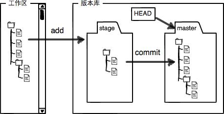

# 工作区、暂存区



工作区：包括新建文件、对已存在文件的修改

新建文件是Untracked files，对已存在文件的修改是Changes not staged for commit

使用`git add`将工作区内容添加到暂存区（stage）

再通过`git commit`就可以一次性把暂存区的所有修改提交到分支

# 添加

将当前路径下所有文件添加到git跟踪记录（track）：

```bash
git add .
```

# 删除

从git跟踪中删除某个文件

```bash
git rm <文件路径>
```


# 提交

把暂存区的所有修改提交到分支，带参数m，表示这次提交的message：

```bash
git commit -m "init"
```


# 推送

# 撤回

## git reset

用于回退版本，可以遗弃不再使用的提交。

带参数hard和soft

1. hard：强行回退到指定版本，放弃当前任何修改：

   ```bash
   git reset --hard <commit_id>
   ```

2.  soft：不删除工作空间改动代码，不撤销暂存区（git add添加的文件），只撤销commit 

   ```bash
   git reset --soft <commit_id>
   ```

3. mixed(默认)：默认的时候，只有暂存区变化

   ```
   git reset
   ```

   


## git revert

与git reset用法基本一致，撤销某次操作，此次操作之前和之后的 commit 和 history都会保留，并且把这次撤销，作为一次最新的提交。

撤销某个版本：

```bash
git revert <commit_id>
```

撤销**前一个**版本，可以通过如下命令：

```bash
git revert HEAD 
```


## 区别

|      | reset        | revert                                         |
| ---- | ------------ | ---------------------------------------------- |
| 作用 | 重设本地更改 | 撤销远端的提交（已经push）                     |
| HEAD | 往后回滚     | 继续向前移动，只是新的commit内容与之前正好相反 |
|      |              |                                                |

# 合并

## git merge

最简洁用法

一、开发分支（dev）上的代码达到上线的标准后，要合并到 master 分支

git checkout dev

git pull

git checkout master

git merge dev

git push -u origin master

 

二、当master代码改动了，需要更新开发分支（dev）上的代码

git checkout master 

git pull 

git checkout dev

git merge master 

git push -u origin dev

# .gitignore

该文件放在git项目根目录下，告诉git忽略对哪些文件的跟踪。注意该文件的生效对象仅限于未加入stage的文件，若已加入stage（即git add），则不起效。应该先将要忽略的文件unstage，此后gitignore就生效，再使用add会忽略指定的文件。