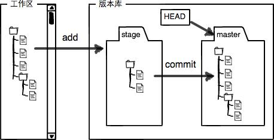

# 工作区、暂存区



## 工作区

包括新建文件、对已存在文件的修改

新建文件是Untracked files，对已存在文件的修改是Changes not staged for commit

用`git status`可以查看：

```bash
$ git status
On branch master
Changes not staged for commit:
  (use "git add <file>..." to update what will be committed)
  (use "git checkout -- <file>..." to discard changes in working directory)

	modified:   readme.txt

Untracked files:
  (use "git add <file>..." to include in what will be committed)

	LICENSE

no changes added to commit (use "git add" and/or "git commit -a")
```

## 暂存区

使用`git add`将工作区内容添加到**暂存区**（stage），状态变为Changes to be committed

```bash
$ git status
On branch master
Changes to be committed:
  (use "git reset HEAD <file>..." to unstage)

	new file:   LICENSE
	modified:   readme.txt
```

注意：所有的修改都要经过git add才会进入暂存区，git add之后的修改不会进入暂存区

再通过`git commit`就可以一次性把暂存区的所有修改提交到分支

# 拉取

```bash
git pull
```


# 查看状态

```bash
git status
```


# 添加

添加指定文件：

```bash
git add <文件路径>
```

将当前路径下所有文件添加到git跟踪记录（track）：

```bash
git add .
```

# 删除

从git跟踪中删除某个文件

```bash
git rm <文件路径>
```


# 提交

把暂存区的所有修改提交到分支，带参数m，表示这次提交的message：

```bash
git commit -m "init"
```

# 撤销修改

将文件从工作区或暂存区撤回

```bash
git checkout -- <文件名>
```

两种情况：

文件在工作区

2

# 推送

把本地提交推送到远端

```bash
git push
```


# 撤回

## git reset

用于回退版本，可以遗弃不再使用的提交。

带参数hard和soft

1. hard：强行回退到指定版本，放弃当前任何修改：

   ```bash
   git reset --hard <commit_id>
   ```

2.  soft：不删除工作空间改动代码，不撤销暂存区（git add添加的文件），只撤销commit 

   ```bash
   git reset --soft <commit_id>
   ```

3. mixed(默认)：默认的时候，只有暂存区变化

   ```bash
   git reset
   ```

   


## git revert

与git reset用法基本一致，撤销某次操作，此次操作之前和之后的 commit 和 history都会保留，并且把这次撤销，作为一次最新的提交。

撤销某个版本：

```bash
git revert <commit_id>
```

撤销**前一个**版本，可以通过如下命令：

```bash
git revert HEAD 
```


## 区别

|      | reset        | revert                                         |
| ---- | ------------ | ---------------------------------------------- |
| 作用 | 重设本地更改 | 撤销远端的提交（已经push）                     |
| HEAD | 往后回滚     | 继续向前移动，只是新的commit内容与之前正好相反 |
|      |              |                                                |

# 分支

分支之间的跳转，需要保证该分支下工作区、暂存区与分支提交相同，无修改：即git diff HEAD 无差异；否则在分支跳转时会出现报错情况，无法跳转

分支跳转完成后后，工作区目录会恢复到当前分支最近一次提交下的目录情况，即不同分支底下的目录内容即便存在差异，也不会互相干扰泾渭分明。

## 查看分支

查看当前所有分支：

```bash
git branch
```


## 创建分支

```bash
git branch <分支名>
```

## 切换分支

最新版本git提供**switch**命令，不用再和checkout混淆

```bash
git switch <分支名>
```

## 创建+切换分支

创建`dev`分支，然后切换到`dev`分支：

```bash
git switch -c dev
```


## 删除分支

```bash
git branch -d <分支名>
```


# 合并

## git merge

合并指定分支到**当前**分支

```bash
git merge <分支名>
```

例如当前在master分支，要将dev分支合并到master：

```bash
$ git merge dev
Updating d46f35e..b17d20e
Fast-forward
 readme.txt | 1 +
 1 file changed, 1 insertion(+)
```

注意`Fast-forward`信息，Git告诉我们，这次合并是“快进模式”，也就是直接把`master`指向`dev`的当前提交，所以合并速度非常快。不是每次合并都能`Fast-forward`

**常用合并方式**

```bash
#先切到开发分支，并拉到最新
git checkout develop
git pull origin develop
#再切回主分支，并拉到最新
git checkout master
git pull origin master
#使用--no-ff命令合并，并填写信息
git merge develop --no-ff -m "merge dev to master"
#提交
git commit -m "develop merge to master"
git push origin master
```

加上`--no-ff`参数就可以用普通模式合并，合并后的历史有分支，能看出来曾经做过合并，而`fast forward`合并就看不出来曾经做过合并。


# 比较

查看工作区的某文件和最新版本的区别

```bash
git diff HEAD -- <文件名>
```


# .gitignore

该文件放在git项目根目录下，告诉git忽略对哪些文件的跟踪。注意该文件的生效对象仅限于未加入stage的文件，若已加入stage（即git add），则不起效。应该先将要忽略的文件unstage，此后gitignore就生效，再使用add会忽略指定的文件。