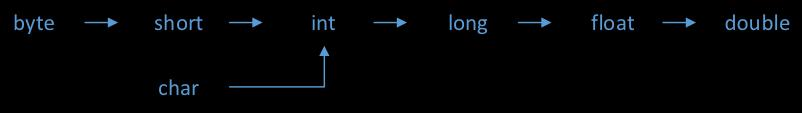
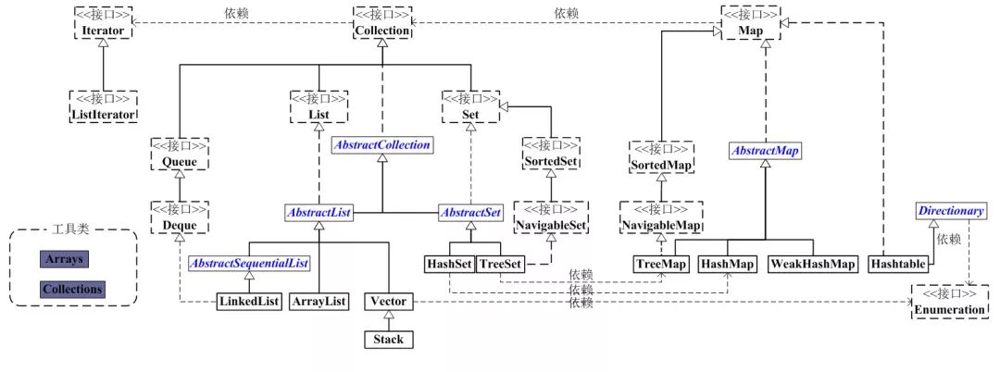
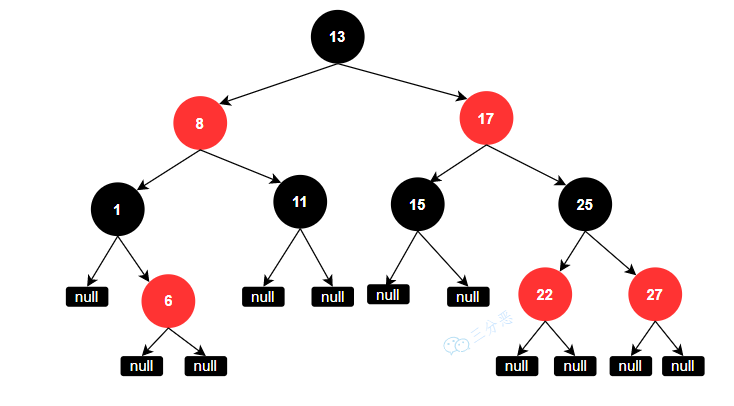
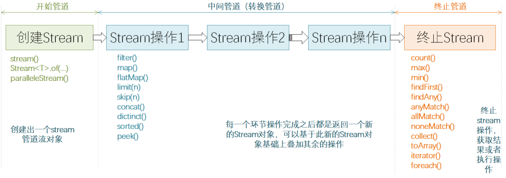
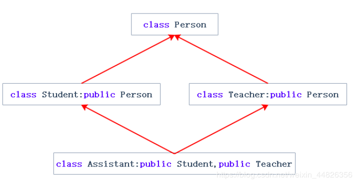
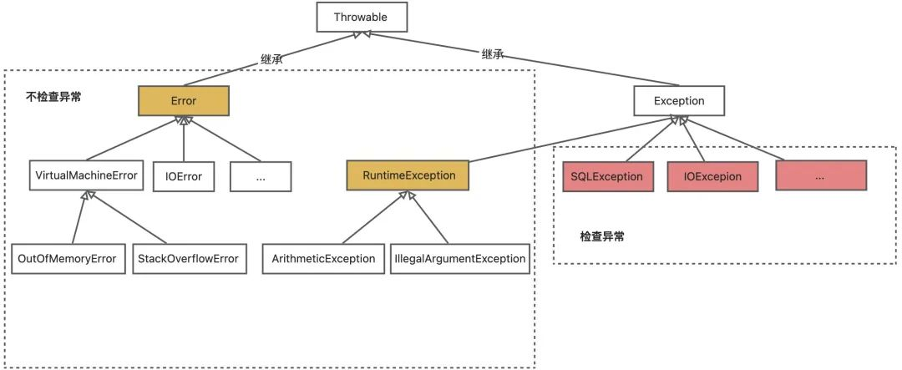
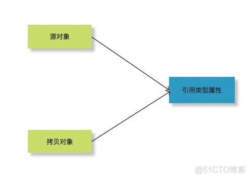
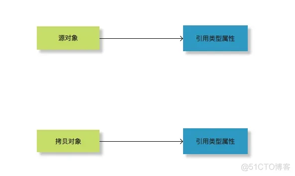

# JDK新特性

从 Java1.0 到 Java9 ，每个Java版本对应一个JDK版本 ：JDK1.0、JDK1.2 ... JDK1.8、JDK1.9。

Java10以后，JDK版本号与Java版本号数字一致：JDK10、JDK11、JDK12。

## JDK8新特性

- 支持lambda表达式，允许把函数整体作为一个方法的参数

- Optional类

  实际上是个容器，支持链式调用判空

  ```java
  Optional.ofNullable(a).orElse(0); // 如果a为null，返回0；否则返回a
  ```

- Stream类，引入函数式编程

- 默认方法：接口支持默认的实现方法

## JDK9新特性（2017年9月）

- 模块化
- 提供了List.of()、Set.of()、Map.of()和Map.ofEntries()等工厂方法
- 接口支持私有方法
- Optional 类改进
- 多版本兼容Jar包
- JShell工具
- try-with-resources的改进
- Stream API的改进
- 设置G1为JVM默认垃圾收集器
- 支持http2.0和websocket的API

**重要特性：主要是API的优化，如支持HTTP2的Client API、JVM采用G1为默认垃圾收集器。**


## JDK10新特性（2018年3月）

- 局部变量类型推断，类似JS可以通过var来修饰局部变量，编译之后会推断出值的真实类型
- 不可变集合的改进
- 并行全垃圾回收器 G1，来优化G1的延迟
- 线程本地握手，允许在不执行全局VM安全点的情况下执行线程回调，可以停止单个线程，而不需要停止所有线程或不停止线程
- Optional新增orElseThrow()方法
- 类数据共享
- Unicode 语言标签扩展
- 根证书

**重要特性：通过var关键字实现局部变量类型推断，使Java语言变成弱类型语言、JVM的G1垃圾回收由单线程改成多线程并行处理，降低G1的停顿时间。**


## JDK11新特性（2018年9月）（LTS版本）

- 增加一些字符串处理方法
- 用于 Lambda 参数的局部变量语法
- Http Client重写，支持HTTP/1.1和HTTP/2 ，也支持 websockets
- 可运行单一Java源码文件，如：java Test.java
- ZGC：可伸缩低延迟垃圾收集器，ZGC可以看做是G1之上更细粒度的内存管理策略。由于内存的不断分配回收会产生大量的内存碎片空间，因此需要整理策略防止内存空间碎片化，在整理期间需要将对于内存引用的线程逻辑暂停，这个过程被称为"Stop the world"。只有当整理完成后，线程逻辑才可以继续运行。（并行回收）
- 支持 TLS 1.3 协议
- Flight Recorder（飞行记录器），基于OS、JVM和JDK的事件产生的数据收集框架
- 对Stream、Optional、集合API进行增强

**重要特性：对于JDK9和JDK10的完善，主要是对于Stream、集合等API的增强、新增ZGC垃圾收集器。**


## JDK12新特性（2019年3月）

- Switch 表达式扩展，可以有返回值
- 新增NumberFormat对复杂数字的格式化
- 字符串支持transform、indent操作
- 新增方法Files.mismatch(Path, Path)
- Teeing Collector
- 支持unicode 11
- Shenandoah GC，新增的GC算法
- G1收集器的优化，将GC的垃圾分为强制部分和可选部分，强制部分会被回收，可选部分可能不会被回收，提高GC的效率

**重要特性：switch表达式语法扩展、G1收集器优化、新增Shenandoah GC垃圾回收算法。**


## JDK13新特性（2019年9月）

- Switch 表达式扩展，switch表达式增加yield关键字用于返回结果，作用类似于return，如果没有返回结果则使用break
- 文本块升级 """ ，引入了文本块，可以使用"""三个双引号表示文本块，文本块内部就不需要使用换行的转义字符
- SocketAPI 重构，Socket的底层实现优化，引入了NIO
- FileSystems.newFileSystem新方法
- ZGC优化，增强 ZGC 释放未使用内存，将标记长时间空闲的堆内存空间返还给操作系统，保证堆大小不会小于配置的最小堆内存大小，如果堆最大和最小内存大小设置一样，则不会释放内存还给操作系统

**重要特性：ZGC优化，释放内存还给操作系统、socket底层实现引入NIO。**


## JDK14新特性（2020年3月）

- instanceof模式匹配，instanceof类型匹配语法简化，可以直接给对象赋值，如if(obj instanceof String str),如果obj是字符串类型则直接赋值给了str变量
- 引入Record类型，类似于Lombok 的@Data注解，可以向Lombok一样自动生成构造器、equals、getter等方法；
- Switch 表达式-标准化
- 改进 NullPointerExceptions提示信息，打印具体哪个方法抛的空指针异常，避免同一行代码多个函数调用时无法判断具体是哪个函数抛异常的困扰，方便异常排查；
- 删除 CMS 垃圾回收器

## JDK15新特性（2020年9月）

- EdDSA 数字签名算法
- Sealed Classes（封闭类，预览），通过sealed关键字修饰抽象类限定只允许指定的子类才可以实现或继承抽象类，避免抽象类被滥用
- Hidden Classes（隐藏类）
- 移除 Nashorn JavaScript引擎
- 改进java.net.DatagramSocket 和 java.net.MulticastSocket底层实现

## JDK16新特性（2021年3月）

- 允许在 JDK C ++源代码中使用 C ++ 14功能
- ZGC性能优化，去掉ZGC线程堆栈处理从安全点到并发阶段
- 增加 Unix 域套接字通道
- 弹性元空间能力
- 提供用于打包独立 Java 应用程序的 jpackage 工具

**JDK16相当于是将JDK14、JDK15的一些特性进行了正式引入，如instanceof模式匹配（Pattern matching）、record的引入等最终到JDK16变成了final版本。**


## JDK17新特性（2021年9月）（LTS版本）

- Free Java License

- JDK 17 将取代 JDK 11 成为下一个长期支持版本

- Spring 6 和 Spring Boot 3需要JDK17

- 移除实验性的 AOT 和 JIT 编译器

- 恢复始终执行严格模式 (Always-Strict) 的浮点定义

- 正式引入密封类sealed class，限制抽象类的实现。

  > 与 final 区别：sealed 提供了更细粒度的继承关系控制。密封类的主要新增关键词有`sealed`、`permits`、`non-sealed`。子类继承方式`sealed`传递了密封性，`final`确认了密封性，`non-sealed`显式声明破坏密封性。给予密封性的控制，所以要求子类必须为 permits 后声明的直接子类，所以也不支持匿名类与函数式接口。

- 统一日志异步刷新，先将日志写入缓存，然后再异步刷新

**虽然JDK17也是一个LTS版本，但是并没有像JDK8和JDK11一样引入比较突出的特性，主要是对前几个版本的整合和完善。**

------


# 数据结构

# 一、基本数据类型

是CPU可以直接进行运算的类型。Java定义了以下几种基本数据类型：

一、整数类型：byte，short，int，long

二、浮点数类型：float，double

三、布尔类型：boolean

四、字符类型：char

八种基本类型比较：

| **类型名称** | **字节空间** | 包装类    | **应用场景**         | 默认值（基本类型） | 数据范围                        |
| ------------ | ------------ | --------- | -------------------- | ------------------ | ------------------------------- |
| byte         | 1Byte        | Byte      | 字节数据             | 0                  | `-2^7~2^7-1`                    |
| short        | 2Byte        | Short     | 短整数               | 0                  | `-2^15~2^15-1`                  |
| int          | 4Byte        | Integer   | 普通整数             | 0                  | `-2^31~2^31-1`                  |
| long         | 8Byte        | Long      | 长整数               | 0                  | `-2^63~2^63-1`                  |
| float        | 4Byte        | Float     | 浮点数               | 0.0                | 1.4E-45~3.4028235E38            |
| double       | 8Byte        | Double    | 双精度浮点数         | 0.0                | 4.9E-324~1.7976931348623157E308 |
| char         | 2Byte        | Character | 一个字符             | 空                 | 0~65535                         |
| boolean      | 1Byte        | Boolean   | 逻辑变量(true,flase) | false              | true或false                     |

**注意**：默认值只有基本类型才有，包装类默认为null

**表示的范围**：

| 类型  | 占据空间       | 表示整数范围                                | 计算方式     |
| ------- | ---------------- | --------------------------------------------- | -------------- |
| byte  | 1Byte（8bit)   | -128 ~ 127                                 | `-2^7~2^7-1`   |
| short | 2Byte | -32768 ~ 32767                             | `-2^15~2^15-1` |
| int   | 4Byte | -2147483648 ~ 2147483647                   | `-2^31~2^31-1` |
| long  | 8Byte | -9223372036854775808 ~ 9223372036854775807 | `-2^63~2^63-1` |

整形超出范围，编译器直接报错

浮点型超范，会自动截断。单精度最多7位小数，双精度最多15位

```java
double d = 1.111111111111111d; // 打印：1.111111111111111
double d = 1.1111111111111111d;      // 1.1111111111111112
float f = 1.1111111f;  // 1.111111
float f = 1.11111111f; // 1.1111112
```


### 1、整形

对于整型类型，Java只定义了带符号的整型，因此，最高位的bit表示符号位（0表示正数，1表示负数），其余位用二进制来表示一个整数 

赋值：

```java
int i = 2147483647;
int i2 = -2147483648;  // 负数用-开头
int i3 = 2_000_000_000;  // 可以加下划线，便于计数，不影响数值
int i4 = 0xff0000; // 0x开头代表十六进制数，表示16711680
int i5 = 0b1000000000; // 0b开头代表二进制，表示512
long l = 9000000000000000000L;  // long型的结尾需要加L
```

### 2、浮点型

对于float类型，需要加上`f`后缀。对于double类型，后缀`d`可加可不加

```java
float f1 = 3.14f;
float f2 = 3.14e38f; // 科学计数法表示的3.14x10^38
double d = 1.79e308;
double d2 = -1.79e308d;  // double的
double d3 = 4.9e-324; // 科学计数法表示的4.9x10^-324
```

### 3、布尔类型

只有`true`和`false`两个值

### 4、字符类型

char表示一个字符。事实上是一个16位无符号整数（0~65535），这个值是对应字符的编码；

Java字符串类型采用Unicode字符集编码。Unicode是世界通用的长度字符集，所有的字符串都是16位；

char赋值有三种方式：

```java
char ch1= 'N';  // 字符赋值
char ch2= 705;   // 整形赋值
char ch3= '\u0031';  // unicode，16进制形式
```

注意char类型字符使用单引号`'a'`，且仅有**一个字符**，要和双引号`"a"`的String类型区分开。

### BigInteger

不可变，范围无限。但速度慢。

做运算只能用实例方法：

```java
BigInteger i1 = new BigInteger("1234567890");
BigInteger i2 = new BigInteger("12345678901234567890");
BigInteger sum = i1.add(i2); // 12345678902469135780
```

### BigDecimal

不可变，范围无限，精度无限，所以没有损失

比较一定要用`compareTo()`

> 不要用`equals()`，因为`1.2`和`1.20`由于`scale`不同导致`equals()`返回`false`

注意直接用float和double创建BigDecimal会有精度误差，应该传入String类型创建

```java
public static void main(String[] args) {
    BigDecimal bigDecimalD1  =  new BigDecimal(6.6);
    System.out.println(bigDecimalD1);  // 6.5999999999999996447286321199499070644378662109375

    BigDecimal bigDecimalF1  =  new BigDecimal(6.6f);
    System.out.println(bigDecimalF1);  // 6.599999904632568359375

    // 下面才是正确用法
    BigDecimal bigDecimalD2  =  new BigDecimal(Double.toString(6.6));
    System.out.println(bigDecimalD2); // 6.6

    BigDecimal bigDecimalF2  =  new BigDecimal(Float.toString(6.6f));
    System.out.println(bigDecimalF2); // 6.6
    
    BigDecimal bigDecimal  =  new BigDecimal("6.637456238568374657");
    System.out.println(bigDecimal);  // 6.637456238568374657"
}
```

### 类型间转换

类型的转换关系如下：



- 自动类型转换(隐式类型转换)：从小类型到大类型可以**自动完成**。
- 强制转换：从大类型到小类型需要加括号，但这样转换有可能会造成**精度损失或溢出**。

```java
long l = 100L;
double d = l;  // long自动转double
 
double d = 0.1d;
long l = (long)d;  // double转long必须强制转换，否则报错
```

**注意**：

1. long为8字节，float仅为4字节，但long可以自动转换为float（简单来说因为浮点数用科学计数法存储的，而整数是用二进制存储的。所以虽然long型是64位的，float型是32位，但是float型所能表示的数要远远大于long型。来自 <https://www.jianshu.com/p/94b6fde08a74> ）
2. char为2字节，可以自动转换为int，但不能自动转同为2字节的short

### 几种特殊转换

多种基本类型参与的表达式运算中，运算结果会**自动转换称较大的类型**；比如：

```java
int a = 4；
int b = 10;
double c = a/b；//结果为0.4，自动转换为double类型
```

byte、char、short三种类型实际存储的数据都是整数，在实际使用中遵循如下规则：

1、Int直接量可以直接赋值给byte、char和short，只要不超过其表示范围。

2、byte、char、short三种类型参与运算时，先一律转换成int类型再进行运算。

# 二、引用类型

> [JDK12之后引入的四种引用类型](./Java高级.md#####Java中引用的类型)

除了上述基本类型的变量，剩下的都是引用类型，也就是对象。例如，引用类型最常用的就是String字符串

## String

String 类被声明为 final，因此它不可被继承。(Integer 等包装类也不能被继承）

String底层实现数组也被声明为 final，意味着数组初始化后地址不能改变，且内部不提供改变数组的方法，保证了**String不可变**。（其实也不是绝对的，通过反射机制也能修改）

### 底层实现

在 jdk1.8 中，String 内部使用 **char 数组 **存储数据。

jdk1.9 起，String 类的实现改用 **byte 数组** 存储字符串，同时使用 `coder` 来标识使用了哪种编码。

### 空和非空判断

```java
// string为空有两种情况：1.为null；2.不为null，且长度为0
public static boolean isEmpty(String str) {
    return str == null || str.length() = 0;
}
// 非空：首先不为null，其次长度大于0
public static boolean isNotEmpty(String str) {
    return str != null && str.length() > 0;
}
```

### 判断空白

```java
// 空白符包含：空格、tab 键、换行符
public static boolean isBlank(String str) {
    if (isEmpty(str)) {
        return true;
    } else {
        int strLen = str.length();
        for(int i = 0; i < strLen; ++i) {
            if (!Character.isWhitespace(str.charAt(i))) {
                return false;
            }
        }
        return true;
    }
}
```


### Q：String, StringBuffer and StringBuilder区别？

|          | String           | StringBuffer                     | StringBuilder            |
| -------- | ---------------- | -------------------------------- | ------------------------ |
| 可变性   | 不可变           | 可变（操作不生成新对象）         | 可变（操作不生成新对象） |
| 线程安全 | 无（因为不可变） | 是（内部使用 synchronized 同步） | 否                       |
| 性能     | 无               | 低                               | 高                       |

所以在单线程环境下推荐使用 StringBuilder，多线程环境下推荐使用 StringBuffer。


### jdk1.8 String + 操作符自动转换为StringBuilder操作

- 如果是变量拼接

  ```java
  String c = "gc";
  c = c + "hc";
  // 第二行操作会由jvm转换为如下等价操作
  StringBuilder sbc1 = new StringBuilder();
  sbc1.append("gc");
  sbc1.append("hc");
  return sbc1.toString();
  ```

- 如果是常量拼接，则编译阶段直接优化

  ```java
  String s = "a" + "b" + "c";  // 编译器优化为s="abc"
  ```

如果string pool中存在字符串常量“abc”则不再新建对象。

## 包装类型

| 原始类型 | byte | short | char      | int     | long | float | double | boolean |
| -------- | ---- | ----- | --------- | ------- | ---- | ----- | ------ | ------- |
| 封装类   | Byte | Short | Character | Integer | Long | Float | Double | Boolean |

包装类**默认值**都为`null`

包装类提供了多种**静态方法**，主要是parsexxx（将string转为基本类型）和valueOf（将string或基本类型转为包装类）

### parsexxx

是封装类型提供的将String转换为基本类型的api，常用一个参数（默认十进制），还支持第二个参数表示进制radix

注意String没有parse

| `api`                | 参数类型 | 返回类型 |
| -------------------- | -------- | -------- |
| `Integer.parseInt`   | `String` | `int`    |
| `Float.parseFloat`   | `String` | `float`  |
| `Double.parseDouble` | `String` | `double` |
| `Long.parseLong`     | `String` | `long`   |

### valueOf

是封装类型提供的将String或基本类型转换为封装类型的api，常用一个参数（默认十进制），也支持第二个参数表示进制
String.valueOf 返回其他基本类型的String形式

| `api`             | 参数类型                  | 返回类型  |
| ----------------- | ------------------------- | --------- |
| `Integer.valueOf` | String、int               | `Integer` |
| `Float.valueOf`   | String 、float            | `Float`   |
| `Double.valueOf`  | String  、double          | `Double`  |
| `Long.valueOf`    | String  、long            | `Long`    |
| `String.valueOf`  | int,  float, double, long | `String`  |

## 自动装箱和拆箱

Java 1.5引入，目的是将原始类型值转自动地转换成对应的对象。该机制可以让我们在Java的变量赋值或方法调用等情况下，使用原始类型或者对象类型更加简单直接。

- 装箱：将初始类型的变量转换成封装类对象
- 拆箱：将封装类对象转换成初始类型

java中数字1，2，3,…,1000等，都是初始类型，只是平常使用时没有注意到，如创建一个Integer：

```java
Integer n1  = new Integer(1);  // 常规写法，创建对象  
Integer n2  = 1;   // 自动装箱，直接赋值  
```


### 规则

以int加法为例

1. 封装类 + 基本类型，结果为封装类

   ```java
   Integer i = 0;
   i += 1;  // 等价于 i = i + 1;
   System.out.println(i); // 1
   System.out.println(i.getClass()); // class java.lang.Integer 
   ```

2. 基本类型+封装类，结果还是基本类型

   ```java
   int i1 = 0;
   i1 += new Integer(1);  // 等价于i1 = i1 +  new Integer(1);
   System.out.println(i1);  // 1
   // System.out.println(i1.getClass());  // 报错
   ```

其他类型和运算同理

### 弊端

例如在一个循环中进行自动装箱操作的情况，自动拆装箱是消耗时间的：

```java
Integer sum = 0;	// 包装类
for(int i=1000; i<5000; i++){
    sum += i;	// 与基本类型相加，自动装箱
}
```

**正确做法**

合理声明变量类型，避免因为自动装箱引起的性能问题

### 底层实现

自动装箱：编译器调用**包装类的静态方法**`valueOf()`方法将原始类型值转换成对象，如`Integer.valueOf()`

```java
int b = 1;
Integer a = Integer.valueOf(b);
```

自动拆箱：编译器通过调用**包装对象**的`intValue()`,`doubleValue()`这类的方法将对象转换成原始类型值。

```java
Integer a = 1;
int b = a.intValue();  // 1
```


### 方法重载与自动装箱

若同时实现了参数为基本类型和包装类型的方法，则调用时会根据参数类型选择相应方法，不发生自动装箱拆箱

```java
public void test(int num){	// 重载，入参为初始类型int
    System.out.println("method with primitive argument");
}
public void test(Integer num){	// 重载，入参为包装类型Integer
    System.out.println("method with wrapper argument");
}
public static void main(String[] args) {
    AutoBoxingTest autoTest = new AutoBoxingTest();
    int n1 = 3;
    autoTest.test(3);  // 调用初始类型test

    Integer n2 = 4;
    autoTest.test(n2);  // 调用包装类型test
}
```

### ==运算符与自动装箱

1. 用于初始类型的比较时，比较值是否相等

   ```java
   int i1 = 1;
   int i2 = 1;
   System.out.println(i1 == i2); // true
   ```

   

2. 用于封装类型比较时，比较是否同一对象（用equals）

   ```java
   // 情况1
   Integer obj1 = 1; // autoboxing will call Integer.valueOf()
   Integer obj2 = 1; // same call to Integer.valueOf() will return same
   // cached Object
   System.out.println(obj1 == obj2); // true
   
   // 情况2
   Integer one = new Integer(1); // no autoboxing
   Integer anotherOne = new Integer(1);
   System.out.println(one == anotherOne); // false
   ```

   对于情况1，自动装箱创建的Integer，实际上调用了Integer.valueOf()方法，出于节省内存的考虑，JVM会缓存-128~127的Integer对象，即**缓存池**，因此obj1与obj2实际上指向同一对象。

   对于情况2，使用new创建的Integer，不再从缓存池取，因此地址肯定不一样。

3. 用于初始类型和封装类比较时，发生自动拆箱。规则是封装类转成初始类型，比较**值是否相等**

   ```java
   Integer num1 = 1; // autoboxing
   int num2 = 1;
   System.out.println(num1 == num2); // true
   ```

    若封装类型未初始化或为null，则与原始类型比较，自动拆箱时调用obj.xxxValue()，会抛空指针异常
   
4. 不仅是==运算符，其他比较运算符<、>等同理。

## 缓存池

只要不是用new显式创建包装类型，当值在一定范围内，jvm优先从缓存池中获取对象，不会另外创建

```java
Integer obj1 = 1; //从缓存池取 
Integer obj2 = Integer.valueOf(1); //从缓存池取
System.out.println(obj1 == obj2); // true 
Integer obj3 = new Integer(1);  //另外创建
System.out.println(obj3 == obj2); // false
```

缓存池范围

| 包装类型    | 缓存池             |
| ----------- | ------------------ |
| `Integer`   | `-128  ~ 127`      |
| `Short`     | `-128  ~ 127`      |
| `Bytes`     | `-128  ~ 127`      |
| `Long`      | `-128  ~ 127`      |
| `Boolean`   | `true和false`      |
| `Character` | `\u0000  - \u007F` |

String和浮点数没有缓存池很好理解：String取值原本就没规律，浮点数的范围也很难限定

**注意**：只有Integer的上限可以修改。

用jvm命令 `-XX:AutoBoxCacheMax=<high>` 设置，high应大于127，若小于等于127则上限不变。额
Long的范围无法设置

## 字符串常量池

字符串常量池（String Pool）保存着所有字符串字面量（literal strings），这些字面量在编译时期就确定。

**intern方法**

调用 intern() 方法时，如果 String Pool 中已经存在一个字符串和该字符串值相等（使用 equals() 方法判断），那么就会返回 String Pool 中字符串的引用；否则，就会在 String Pool 中添加一个新串

```java
String s1 = new String("aaa");
String s2 = new String("aaa");
System.out.println(s1 == s2);        // false
String s3 = s1.intern();
String s4 = s2.intern();
System.out.println(s3 == s4);        // true
String s5 = "bbb";
String s6 = "bbb";
System.out.println(s5 == s6);       // true
```

### Q：String s = new String("abc") 会创建几个对象？

- 若String Pool 中不存在 “abc” 字符串对象：创建两个对象

  “abc” 属于字符串字面量（或称字符串常量），因此编译时期会检查 String Pool（运行时常量池，在**方法区**） 中是否存在“abc”，若不存在就创建一个字符串对象，指向这个 “abc” 字符串字面量；

  而使用 new 的方式会在**堆**中创建一个字符串对象。

- 若存在：只创建一个new


## 常量

定义变量的时候，如果加上final修饰符，这个变量就变成了常量

```
final double PI = 3.14; // PI是一个常量
```

常量在定义时进行初始化后就**不可再次赋值**，再次赋值会导致编译错误。

常量的作用是用有意义的变量名来避免魔术数字（Magic number）。根据习惯，常量名通常全部大写。

## var关键字

有些时候，类型的名字太长，写起来比较麻烦。例如：

```
StringBuilder sb = new StringBuilder();
```

如果想省略变量类型，可以使用var关键字：

```
var sb = new StringBuilder();
```

编译器会根据赋值语句**自动推断**出变量sb的类型是StringBuilder。

因此，使用var定义变量，**仅仅是少写了变量类型而已**。


## 日期和时间

### Date

`java.util.Date`是表示日期和时间的类，注意与`java.sql.Date`区分（后者用在数据库）。

实际上存储了一个long类型的以**毫秒**表示的**时间戳**：

```java
public class Date implements Serializable, Cloneable, Comparable<Date> {
    private transient long fastTime;
    ...
}
```

**Date与String的转换**

用SimpleDateFormat类

字符串解析为Date：

```java
// dateStr:待解析字符串
// dateFormat：日期格式
public static Date str2Date(String dateStr, String dateFormat) {
    if (StringHelper.isEmpty(dateStr)) {
        return null;
    } else {
        SimpleDateFormat df = new SimpleDateFormat(dateFormat);
        try {
            return df.parse(dateStr);  // 解析
        } catch (Exception var4) {
            return null;
        }
    }
}
```


Date转字符串：

```java
//date：待转换日期
// dateFormat：日期格式
public static String date2Str(Date date, String dateFormat) {   
    if (date == null) {
        return null;
    } else {
        SimpleDateFormat df = new SimpleDateFormat(dateFormat); 
        return df.format(date);  // 转换
    }
}
```


### Calendar

用于获取并设置年、月、日、时、分、秒，它和`Date`比，主要多了一个**日期和时间运算**的功能

例如求前一天，直接用Calendar来加减，**不用额外考虑跨月跨年**

```java
public static String getLastDay() {
    Calendar calendar = Calendar.getInstance();
    // 设置日期格式
    DateFormat df = new SimpleDateFormat(DateUtil.YYYYMMDD);
    // 日期减一
    calendar.set(Calendar.DATE, calendar.get(Calendar.DATE) -1);
    return df.format(calendar.getTime());
}
```

### 计时

都要用到System包的函数

currentTimeMillis()返回的是系统当前时间和1970-01-01之前间隔时间的**毫秒数**

```
long start = System.currentTimeMillis();
```

nanoTime()的返回值本身则没有什么意义，因为它基于的时间点是随机的，甚至可能是一个未来的时间，所以返回值可能为负数。但是其精确度为**纳秒**，相对高了不少，一般用于计时器：

```
long start = System.nanoTime();
Thread.currentThread().sleep(1000);            
long end = System.nanoTime();            
System.out.println(end-start);
```


# 三、集合

容器主要包括 Collection 和 Map 两种，Collection 存储着对象的集合，而 Map 存储着键值对（两个对象）的映射表。



## Set

- TreeSet：基于红黑树实现，支持有序性操作，例如根据一个范围查找元素的操作。但是查找效率不如 HashSet，HashSet 查找的时间复杂度为 O(1)，TreeSet 则为 O(logN)。
- HashSet：基于哈希表实现，支持快速查找，但不支持有序性操作。并且失去了元素的插入顺序信息，也就是说使用 Iterator 遍历 HashSet 得到的结果是不确定的。
- LinkedHashSet：具有 HashSet 的查找效率，并且内部使用双向链表维护元素的插入顺序。

## List

- ArrayList：基于动态数组实现，支持随机访问。

- Vector：和 ArrayList 类似，但它是线程安全的。

- LinkedList：基于双向链表实现，只能顺序访问，但是可以快速地在链表中间插入和删除元素。不仅如此，LinkedList 还可以用作栈、队列和双向队列。

- CopyOnWriteArrayList：

  > 写操作在一个复制的数组上进行，需要加锁，防止并发写入导致写入数据丢失。结束之后需要把原始数组指向新的复制数组。
  >
  > 读操作还是在原始数组中进行。因此并发时可以多个线程读，但只能一个写，**读写分离**，互不影响。
  >
  > 适用于**读多写少**。
  >
  > 不适合内存敏感、实时性要求高的场景（可能读到旧数据）。

  

## Queue

- LinkedList：可以用它来实现双向队列。
- PriorityQueue：基于堆结构实现，可以用它来实现优先队列。

## Map

- TreeMap：按照 Key 的自然顺序或者 Comprator 的顺序进行排序。基于红黑树实现。
- HashMap：基于哈希表实现。
- HashTable：和 HashMap 类似，但它是线程安全的，这意味着同一时刻多个线程同时写入 HashTable 不会导致数据不一致。它是遗留类，不应该去使用它，而是使用 ConcurrentHashMap 来支持线程安全，ConcurrentHashMap 的效率会更高，因为 ConcurrentHashMap 引入了分段锁。
- LinkedHashMap：使用双向链表来维护元素的顺序，顺序为插入顺序或者最近最少使用（LRU）顺序。

## Q：是否一定要使用线程安全的集合？

不一定。如Vector是线程安全的，但是开销就比ArrayList大，速度更慢。线程安全完全可以由程序员保证。

## 单一类型默认向下兼容

单一类型指的是泛型，默认**向下兼容**。

```java
// 数组类型是Number，但是可以放入Number及其子类型Integer、float和double
Number numArray [] = {23, 0.1f, 0.2d};
// ArrayList同理
```

## Map比较

|                             | 线程安全 | 有序 | key可以null | value可以null |
| --------------------------- | -------- | ---- | ----------- | ------------- |
| HashMap                     | 否       | 否   | 是          | 是            |
| LinkedHashMap               | 否       | 是   |             |               |
| TreeMap                     | 否       | 是   |             |               |
| ConcurrentHashMap           | 是       | 否   | 否          | 否            |
| Collections.synchronizedMap | 是       | 否   |             |               |
| HashTable                   | 是       | 否   | 否          | 否            |


## Set比较

相同点：都不允许重复、都线程不安全。

|                             | 线程安全 | 有序               | 放入null元素 | 查找、添加、删除复杂度 |
| --------------------------- | -------- | ------------------ | ------------ | ---------------------- |
| HashSet                     | 否       | 否                 | 可以         | O(1)                   |
| LinkedHashSet               | 否       | 是（按插入顺序）   | 可以         | O(1)                   |
| TreeSet                     | 否       | 是（按元素值排序） | 不可以       | O(logN)                |
| ConcurrentHashSet           | 是       | 否                 |              |                        |
| CopyOnWriteArraySet         | 是       | 否                 |              |                        |
| Collections.synchronizedSet | 是       | 否                 |              |                        |

## List比较


|                              | 线程安全 |      |
| ---------------------------- | -------- | ---- |
| ArrayList                    | 否       |      |
| Vector                       | 是       |      |
| CopyOnWriteArrayList         | 是       |      |
| Collections.synchronizedList | 是       |      |


## 0.Iterator迭代器

使用迭代器的好处：调用方总是以统一的方式遍历各种集合类型，而不必关心它们内部的存储结构。

迭代器遍历顺序是**从前往后**，不能反向。

已知Java的集合类都可以使用`for each`循环，比for循环简洁。

`List`、`Set`和`Queue`会迭代每个元素，`Map`会迭代每个key。以`List`为例：

```java
List<String> list = List.of("Apple", "Orange", "Pear");
for (String s : list) {  // for-each
    System.out.println(s);
}
```

for each是jdk1.5提供的语法糖，底层由编译器改写为for循环+Iterator实现：

```java
for (Iterator<String> it = list.iterator(); it.hasNext(); ) {
     String s = it.next();
     System.out.println(s);
}
```

自定义的集合类，想要使用`for each`循环，只需满足以下条件：

- 集合类实现`Iterable`接口，该接口要求返回一个`Iterator`对象，需要实现三个基本操作：

  1. next() 会返回迭代器的下一个元素，并且更新迭代器的状态。

  2. hasNext() 用于检测集合中是否还有元素。

  3. remove() 将迭代器返回的元素删除。

- 用`Iterator`对象迭代集合内部数据。

## 1.数组 `[]`

1.是一种引用数据类型（非基本类型），实际上并不属于java集合，但功能类似

2.数组中的数据类型必须一致

3.长度在**运行期间**不可改变，用属性`.length`获取

### 创建

1.创建时若不初始化，则必须指定长度。元素值为该类型默认值

```java
int [] intArray0 = new int [3];  // 创建长度为3的整数数组，每个元素都是0
```

2.若初始化（赋初值），则不能指定长度（因为长度由初始化元素个数决定）

```java
int intArray1 [] = new int []{20, 21, 22};
```

可以省略new:

```java
int intArray2 [] = {23, 24, 25};
```

### 数组的类型

由初始化时的类型type决定：[type]

```java
Object oa [] = {};
int intArray [] = {23, 24, 25};
String stringArray[] = {"abc", "def", "ghi"};
System.out.println(oa.getClass());		//class [Ljava.lang.Object
System.out.println(intArray.getClass());    //class [I
System.out.println(stringArray.getClass());    //class [Ljava.lang.String
```

## 2.ArrayList

### 扩容

使用 ensureCapacityInternal() 方法来保证容量足够，如果不够时，需要使用 grow() 扩容

新容量大小为**1.5倍**

### Q：数组与ArrayList区别？

|          | 数组                                                         | ArrayList                                     |
| -------- | ------------------------------------------------------------ | --------------------------------------------- |
| 底层实现 | 继承Object，不属于集合                                       | 实现Collection接口，是集合的一种              |
| 长度     | .length属性获取，一旦创建不可变                              | size()方法获取，可动态增减                    |
| 元素类型 | 单一类型即可                                                 | 单一类型，且必须为**引用类型**                |
| 互相转换 | Arrays.asList();返回的是**静态List**，不能进行增加和删除操作，只能对元素值修改 | list实例的toArray方法；或用stream().toArray() |


### Q：ArrayList和LinkedList区别？

相同：都实现List接口

|                                    | ArrayList                              | LinkedList                                     |
| ---------------------------------- | -------------------------------------- | ---------------------------------------------- |
| 底层                               | 基于动态数组，地址连续                 | 基于**双向**链表，地址分散                     |
| 随机（下标）访问速度：`get(index)` | 快，get()瞬间获取                      | 慢。除了头和尾能瞬间获得，其余位置需要遍历链表 |
| 插入（指定位置）：`add(index, e)`  | 慢，因为数组要整体移动。若触发扩容更慢 | 快，且不会扩容，但要遍历链表                   |
| 插入（不指定位置，尾插）：`add(e)` | 快。若触发扩容慢                       | 快，且不会扩容                                 |

## 3.HashMap

### 3.1存储结构

本质是一个链表数组table。

内部包含一个Entry类型数组，Entry 存储着键值对，包含四个字段，next字段表示 Entry 是一个链表。即数组中的每个位置被当成一个**桶**，一个桶存放一个链表。HashMap 使用拉链法来解决冲突，同一个链表中存放**hashCode 和 桶大小 取模运算结果**相同的 Entry。


### 3.2 put方法(1.7与1.8变化)

1. 根据key和哈希算法计算数组下标：**index = hashCode(Key) & (capacity - 1)**，相当于对hashCode取模：`hashCode % capacity`。

    > 使用&运算原因：位运算比取模更快。
    >
    > 前提是 capacity = 2 ^ n 

    **1.8中对hashCode计算还做了改进**

    

    优化了高位运算的算法：hash**无符号右移**16位后与自身异或，目的是当桶长度较小时，也能保证高低位的bit都参与到hash计算中，同时不会有太大开销。

2. 如果数组下标位置桶为空，则将key和value封装为Entry对象（1.7是Entry，1.8是Node），并放入该桶

3. 如果数组下标位置桶不为空，则分情况：

    - jdk1.7：**先判断**是否需要扩容

     若不用扩容，则生成Entry，并用**头插法**加入桶。
   
   - jdk1.8：先判断当前位置桶类型是红黑树还是链表
   
     - 若是红黑树Node，则封装节点并插入红黑树，判断红黑树是否存在当前key，存在则直接更新value
     - 若是链表Node，则封装节点并用尾插法，遍历链表过程中判断是否存在当前key，存在则直接更新value。插入后统计链表长度，**若>=8则转红黑树**
   
     - **插入之后再判断**是否扩容
   

#### Q：链表转红黑树的阈值被设置为8的原因？

1. 当选用的hash算法离散性很好时，数组中同一位置出现碰撞的概率很低，几乎不会出现达到阈值的情况；然而采用随机hash算法时，离散性可能会变差，理想情况下随机hash算法计算出的位置分布遵循**泊松分布**，根据概率统计，同一位置的元素达到8个概率只有大约1亿分之6，几乎是不可能事件。**若这种小概率事件都发生了，说明HashMap的元素个数相当多，有提高查找效率的必要。**
2. 另一种解释是链表查找的平均查找次数是n/2，而红黑树的平均查找次数是log(n)，8/2=4而log(8)=3，3<4因此有必要转换，但这种说法存在问题，如果是这个理由那应该选择在节点数达到5时就转换，5/2同样大于log(5)。

树退化的阈值被设为6而不是7，主要是为了避免频繁的树结构的转换，减少系统开销。

#### Q：使用红黑树的原因？

首先二叉搜索树（BST）的查找肯定效率比链表高。但BST有缺点，在元素插入时会导致树倾斜，插入顺序会影响树的高度，而树的高度直接影响了BST的查找效率，在极端情况下BST会退化成链表（所有节点都在一条斜线上），复杂度O(n。

红黑树具有性质：任一节点到其子树中的每个叶子节点的路径都包含相同数量的黑色节点，可推导出从红黑树的根节点到叶子节点的最长可能路径不超过最短可能路径的两倍，即红黑树可以保持其大致是平衡的。因此红黑树可以保持**在最坏情况下都相对高效，依然是O(logn)**。作为代价，红黑树的插入删除操作可能会引起树的旋转。

> 红黑树本质上是一种**二叉查找树**，为了保持平衡，它又在二叉查找树的基础上增加了一些规则：
>
> 1. 每个节点要么是红色，要么是黑色；
> 2. 根节点永远是黑色的；
> 3. 所有的叶子节点都是是黑色的（注意这里说叶子节点其实是图中的 NULL 节点）；
> 4. 每个红色节点的两个子节点一定都是黑色；
> 5. 从任一节点到其子树中每个叶子节点的路径都包含相同数量的黑色节点；
>
> 

为什么不直接使用红黑树：

由于TreeNodes占用空间是普通Nodes的两倍（相较于链表结构，链表只有指向下一个节点的指针，二叉树则需要左右指针，分别指向左节点和右节点），因此使用红黑树取代链表需要以**额外的空间为代价**。只有当节点较多时，才有转换的必要。

### 3.3 扩容

注意：这里的扩容指table扩容，而不是桶（因为桶是链表，没有上限），操作是table**翻倍**，Entry数组长度 * 2

相关参数主要有3个：

- capacity：Entry数组长度，初始为**16**，且始终保持capacity = 2 ^ n。

- size：键值对数量。

- loadFactor：加载因子，取0~1之间的值，默认0.75

扩容时机：由扩容临界值**Threshold = loadFactor * capacity**决定。当HashMap中的元素个数超过该值**Threshold** 时，就会进行Entry数组扩容

#### Q：capacity = 2^n 的原因？

前面已经解释过，求元素放几号桶时用&运算代替取模，前提是要求capacity = 2^n 。

> 这是一种非常规的设计，常规设计是把桶大小设为**素数**（hashTable初始化桶大小就是11），相对来说素数的hash冲突概率小于合数


扩容操作：

1. 扩容：创建新的Entry空数组，长度是原数组**翻倍**。

2. ReHash：遍历原Entry数组，把所有Entry重写Hash到新数组

   需要reHash的原因：hashMap计算数组下标逻辑是`index = HashCode(Key) & (Length - 1)`，数组长度倍增后，需要重新计算下标

扩容结果：

jdk1.7：由于ReHash，可能导致原来在一个桶的结点分散到不同桶

jdk1.8：也是由于ReHash，可能导致原来的红黑树退化为链表，或链表进化为红黑树


### hashMap线程不安全分析

线程1和线程2分别将Entry1、Entry2插入同一个桶时，无论桶空还是非空，都会出现竞争问题。

由于jdk1.7使用头插法，扩容时还可能造成**循环链表**问题。假设有线程1和线程2，都尝试向HashMap中插入新的条目，并触发了HashMap的扩容，两个线程都新建了新的扩容数组nextTable。假设在原table某位置，存在一个链表，其顺序为A-->B-->C，线程1在执行到头节点A时就挂起了，但此时对线程1而言，A的next节点是B。在这同时线程2执行了完整的迁移操作，扩容后新的链表顺序为C-->B-->A。随后线程1恢复，但由于其挂起时，已经将当前位置指向了节点A，而next节点指向了B，此时就出现了loop，A-->B-->A

jdk1.8虽然用尾插法不会出现循环链表，但还是会有某个桶**覆盖问题**。例如线程1和2都争抢table位置A的空桶，线程1先插入，线程2认为此时A桶仍为空，覆盖了线程1插入的Entry

### Q：为什么重写equals()方法一定要重写hashCode()方法？

如果我们要使用自定义类的对象作为Entry的key，那么就有必要重写equals()方法，确定判断key相等的规则。

但重写equals()方法后又会产生新的问题，如果不重写Object的hashCode()，则默认基于内存地址计算hashcode，可能会出现两个key相等但hashcode不同的情况，这样即使两个Entry的key相等，却落入不同的桶。

因此重写hashCode应满足：

1. 如果两个对象**等价**（即用equals比较返回true），那么它们的hashCode值一定要相同；
2. 如果两个对象的hashCode相同，它们并不一定等价；

**hashCode和地址的关系**：地址相同，hashcode一定相等；hashcode相等，地址不一定相同。

### Q：HashMap的key可以为null吗？value呢？

key可以为null，因为源码中put方法计算null的hash=0，取模计算`hashCode % capacity`后必然落在**0号桶**

```java
static final int hash(Object key) {
    int h;
    return (key == null) ? 0 : (h = key.hashCode()) ^ (h >>> 16);
}
```

而value显然没有任何取值限制，因此可以为null。

测试：

```java
public static void main(String[] args) {
    HashMap<String, Integer> map = new HashMap<>();
    map.put(null, 0);  // key为null
    map.put("null", null); // value为null
    System.out.println(map); // {null=0, null=null}
    System.out.println(map.containsKey(null)); // true
    System.out.println(map.get(null)); // 0
}
```

### Q：ConcurrentHashmap为何不允许null？

hashmap允许null值会产生**二义性问题**：get(key)返回null，表示key对于val为null，还是key不存在？

虽然可以配合containsKey()消除二义性，但在**多线程环境下，无法保证get()和containsKey()的原子性**，因此ConcurrentHashmap不应该允许null。


## 4.ConcurrentHashMap


和 HashMap 实现上类似，主要差别是 ConcurrentHashMap 使用**两级数组**：

第一级 Segment （分段锁）数组，segment个数就是**并发度**，表示同时支持几个线程并发，多线程同时操作不同的segment不冲突。

第二级：每个Segment维护着一个Entry数组（HashEntry链表)

ConcurrentHashMap 中的重要变量有：

- table：默认为null，**延迟初始化**，第一次插入操作时初始化，默认大小为**16**的数组，size总是`2^n`，用来存储Node节点数据，扩容时大小总是`2^n`；
- nextTable：默认为null，扩容时新生成的数组，其大小为原数组的两倍；
- Node：保存key，value及key的hash值的数据结构；
- sizeCtl：table数组的容量阈值，默认为0，用来控制table的初始化和扩容操作；
- ForwardingNode：一个特殊的Node节点，hash值为-1，其中存储nextTable的引用。只有table发生扩容时，ForwardingNode才会发挥作用，作为一个占位符放在table中表示当前节点为null或已经被移动。

ConcurrentHashMap 包含两个核心内部类：Segment 和 HashEntry


### 初始化的线程安全

table初始化操作会延缓到第一次put操作。在ConcurrentHashMap在构造函数中只会初始化sizeCtl值，并不会直接初始化table，sizeCtl的默认初始值为0，若构造方法传入了自定义的initialCapacity值，那么sizeCtl的值默认为大于initialCapacity的最小的2的次幂。但是put操作是可以并发执行的，在put操作中进行了如下处理：

尝试执行put操作的线程会判断table是否已经被初始化，若table尚未被初始化，则尝试进行初始化操作。初始化方法中，线程会执行Unsafe.compareAndSwapInt方法修改sizeCtl为-1，并且只有一个线程可以执行成功，其余的线程如果进来发现sizeCtl=-1，那么就会执行Thread.yield()让出CPU时间片等待table初始化完成。

### put操作的线程安全

执行put操作的线程在判断table已经初始化的前提下，还会对put操作的目标位置Node进行如下判断：

- 若目标位置的Node为null，则说明该位置第一次插入数据，利用**CAS+自旋**（Unsafe.compareAndSwapObject）安全插入数据，两种可能结果：
  - CAS成功，则说明操作成功，退出；
  - CAS失败，则说明其他线程抢先一步插入了数据，进行自旋，再次尝试插入数据，后续逻辑与目标位置已存在数据的逻辑相同；
- 若目标位置的Node为ForwardingNode，表明有其他线程在进行扩容操作，当前线程会帮助扩容；
- 若目标位置已存在普通Node，则将新的Node节点按链表或红黑树的方式插入到合适的位置，这个过程采用**Synchronized**实现并发；

### 数组扩容的线程安全

当table数组的元素个数达到容量阀值sizeCtl的时候，需要对table进行扩容，扩容氛围两个阶段：

- 构建一个新的nextTable，容量为原先table的两倍；

- 把原先table中的数据进行迁移；


第一步nextTable的构建只能单线程进行操作，同样是通过对sizeClt值进行CAS操作，确保只有一个线程能初始化nextTable成功。

第二步中的逻辑则类似put操作，对每个尝试复制数据的位置进行CAS操作，若失败则说明已有别的线程对该位置进行扩容，后续使用Synchronized锁进行并发的迁移操作。

### jdk1.7和1.8变化

JDK 1.7 使用分段锁机制来实现并发更新操作，核心类为 Segment，它继承可重入锁 ReentrantLock以实现锁。

JDK1.8 使用CAS 操作支持更高并发度，CAS失败时使用内置锁 synchronized。底层与HashMap相同，链表长度大于8时转红黑树

### Q：使用ConcurrentHashMap 就一定线程安全吗？

不一定。如两个线程的put就有可能发生覆盖，依然需要加锁保证执行结果，例如下面代码，第4行判断只能保证单线程安全，在多线程环境，由于第4和第5行不是原子操作，因此会出错，只能加锁解决。

```java
class JobTest {
	private Map<String, Job> jobMap = new ConcurrentHashMap();
	boolean test(Job job) {
		if(!jobMap.containsKey(job.getId){ // 如果map不存在才写入
			jobMap.put(job.getId, job);
			return true;
		}else{
			log.info("任务已存在");
			return false;
		} 
	}
}
```

也可以使用ConcurrentHashMap的**putIfAbsent**方法优化，put操作成功返回null，若key已存在则返回value。该方法内部使用了同步锁实现了原子操作，因此不需要额外加锁。

```java
class JobTest {
	private Map<String, Job> jobMap = new ConcurrentHashMap();
	boolean test(Job job) {
		Job job = jobMap.putIfAbsent(job.getId, job);
		if(job==null){  // 说明put成功
			return true;
		}else{
			log.info("任务已存在");
			return false;
		} 
	}
}
```


## 5. LinkedHashMap

继承自 HashMap，实现Map接口，因此具有和 HashMap 一样的快速查找特性。

```java
public class LinkedHashMap<K,V> extends HashMap<K,V> implements Map<K,V>
```

**与hashmap的不同**：所有Entry用双向链表串起来。即Enrty是有序的

**实现**

1. 内部维护一个双向链表，用来维护插入顺序或LRU顺序

   ```java
   // 双向链表头是最久未使用的  
   transient  LinkedHashMap.Entry<K,V> head;    
   
   // 双向链表尾是最近刚使用的  
   transient  LinkedHashMap.Entry<K,V> tail;  
   ```

2. accessOrder 决定了顺序，默认为 false，维护的是**插入顺序**。为true是LRU顺序

   ```java
   final  boolean accessOrder;
   ```

   

   最重要的是以下用于维护顺序的函数，它们会在 put、get 等方法中调用：

3. afterNodeAccess()
   get之后调用，如果 accessOrder 为 true，则会将该节点移到链表尾部（LRU顺序，最近使用的是尾，最久未使用是头）

4. afterNodeInsertion()
   put之后调用，如果removeEldestEntry() 返回true，则移除链表头
   removeEldestEntry() 默认为 false，若要返回true需要继承LinkedHashMap 并重写该方法


## TreeMap

按照 Key 的自然顺序或者 Comprator 的顺序进行排序，内部是通过**红黑树**来实现。

由于要排序，因此 key 所属的类必须：

- 实现 Comparable 接口；
- 或者自定义一个实现了 Comparator 接口的比较器，传给 TreeMap， 用于 key 的比较。

## WeakHashMap

主要用来实现缓存。通过使用 WeakHashMap 来引用缓存对象，可由 JVM 对这部分缓存进行回收。举例：Tomcat 中的 ConcurrentCache 使用了 WeakHashMap 来实现缓存功能。

WeakHashMap 的 Entry 继承自 WeakReference：

```java
private static class Entry<K,V> extends WeakReference<Object> implements Map.Entry<K,V>
```

## HashTable

也是key-value的数据结构，继承自Dictionary类（过时），实现了Map接口。

与HashMap最大的不同是，HashTable是**线程安全**的。且HashMap在java 1.8引入红黑树，而HashTable还是链表结构。

## 6、HashSet

底层采用的是HashMap进行实现的，但是没有key-value，只有HashMap的key

## ConcurrentHashSet

底层使用ConcurrentHashMap实现，线程安全

## LinkedHashSet

继承HashSet，具有 HashSet 的查找效率，并且内部使用双向链表维护元素的插入顺序。

## TreeSet

基于红黑树。按元素值排序。

## Fail-fast机制

就是在做系统设计的时候先考虑异常情况，一旦发生异常，直接停止并上报。在Java中默认指的是集合的一种错误检测机制。当多个线程对部分集合进行结构上的改变的操作时，有可能会产生fail-fast机制，这个时候就会抛出ConcurrentModificationException（后文用CME代替）。

> ConcurrentModificationException：当方法检测到对象的并发修改，但不允许这种修改时，就抛出该异常。

**异常复现**

在Java中， 如果在foreach 循环里对某些集合元素进行元素的 **remove/add** 操作的时候，就会触发fail-fast机制，进而抛出CME。如以下代码：

```java
List<String> userNames = new ArrayList<String>() {{
    add("Hollis");
    add("hollis");
    add("HollisChuang");
    add("H");
}};
for (String userName : userNames) {  // 报错CME
    if (userName.equals("Hollis")) {
        userNames.remove(userName);
    }
}
System.out.println(userNames);
```

同样，在foreach中对userNames执行add方法，也会抛CME

**原理**

foreach中，集合遍历通过iterator进行，但是元素的add/remove却是直接使用的集合类自己的方法。这就导致iterator在遍历的时候，会发现有一个元素在自己不知不觉的情况下就被删除/添加了，就会抛出一个异常，用来提示用户，可能发生了并发修改！

**解决办法**

1. 直接用普通for循环操作

2. 直接用Iterator操作

   ```java
   Iterator iterator = userNames.iterator();
   while (iterator.hasNext()) {
       if (iterator.next().equals("Hollis")) {
           iterator.remove();
       }
   }
   ```

   

3. for-each执行remove后break

   > 立刻结束循环，也就是说不让代码执行到下一次的next方法

4. 直接使用fail-safe的集合类

   > java.util.concurrent包下的容器都是fail-safe的，如CopyOnWriteArrayList、ConcurrentLinkedDeque
   >
   > 这样的集合容器在遍历时不是直接在集合内容上访问的，而是先复制原有集合内容，在拷贝的集合上进行遍历。


# 四、Stream

是一种集合`Stream<T>` ，特点是无存储；适用于函数式编程；惰性执行。 

- 无存储：Stream不是一种数据结构，它只是某种数据源的一个视图，数据源可以是一个数组，Java容器或I/O channel等。Stream只能被使用一次，一旦遍历过就会失效，就像容器的迭代器那样，想要再次遍历必须重新生成。
- 函数式编程：对Stream的任何修改都不会修改背后的数据源，比如对Stream执行过滤操作并不会删除被过滤的元素，而是会产生一个不包含被过滤元素的新Stream。
- 惰性执行：Stream上的操作并不会立即执行，只有遇到最终操作才会一并执行。

可以将 Stream 流操作分为 3 种类型：

- 创建
- 中间处理
- 最终操作



## 1.创建

| API              | 功能                                                         |
| ---------------- | ------------------------------------------------------------ |
| stream()         | 调用集合（数组、List、Set、Map 等）的方法，创建一个新的stream**串行流**对象 |
| parallelStream() | 调用集合的方法，创建一个新的stream**并行流**对象             |
| Stream.of()      | 静态方法传入集合，创建一个新的stream串行流对象               |

例：

```java
// 通过list创建
List<String> strings = Arrays.asList("Hollis", "HollisChuang", "hollis", "Hello", "HelloWorld", "Hollis");
Stream<String> stream = strings.stream();
// 静态方法
Stream<String> stream = Stream.of("Hollis", "HollisChuang", "hollis", "Hello", "HelloWorld", "Hollis");
```

## 2.中间操作

| API      | 功能                               | 输入                     |
| -------- | ---------------------------------- | ------------------------ |
| filter   | 过滤出元素                         | 函数，用于判断是否过滤   |
| map      | 映射每个元素到对应的结果（一对一） | 函数，用于对每个元素操作 |
| flatMap  | 一对多映射                         | 函数                     |
| limit    | 返回前 n 个元素                    | int                      |
| skip     | 跳过前 n 个元素                    | skip                     |
| sorted   | 用于对流进行排序                   | Comparator               |
| distinct | 去重                               | 无                       |
| concat   | 合并                               | stream                   |
| peek     | 遍历                               |                          |
|          |                                    |                          |

中间操作可以组合使用，按链式顺序依次处理：

```java
List<String> ids = Arrays.asList("205","10","308","49","627","193","111", "193");
// 使用流操作
List<Dept> results = ids.stream()
    .filter(s -> s.length() > 2)
    .distinct()
    .map(Integer::valueOf)
    .sorted(Comparator.comparingInt(o -> o))
    .limit(3)
    .map(id -> new Dept(id))
    .collect(Collectors.toList());
System.out.println(results); 
//输出：[Dept{id=111},  Dept{id=193},  Dept{id=205}]
```

上面的代码片段的处理逻辑很清晰：

- 使用 filter 过滤掉不符合条件的数据
- 通过 distinct 对存量元素进行去重操作
- 通过 map 操作将字符串转成整数类型
- 借助 sorted 指定按照数字大小正序排列
- 使用 limit 截取排在前 3 位的元素
- 又一次使用 map 将 id 转为 Dept 对象类型
- 使用 collect 终止操作将最终处理后的数据收集到 list 中

**sorted复杂用法**

排序逻辑：以Record的time字段**倒序**排列

```java
List<Record> NewRecords = Records.stream()
    .filter(dto -> prodInstId.equals(dto.getProdInstId()))
    .sorted(Comparator.comparing(Record::getTime).reversed())
    .collect(Collectors.toList());
```

### Q：Stream的中间操作的执行方式？

例如中间操作是filter加map，那么对Stream中所有元素，是全部先filter再map，还是每个元素filter加map？

答案是后者，在中间操作加打印即可看到。

总结：Stream还是很智能的，不会有几个中间操作就增加几次循环，而是只有**一轮循环**，每次完成一个元素的所有中间操作。

## 3.最终操作

Stream的中间操作得到的结果还是一个Stream，将一个Stream转换成我们需要的类型（如计算出流中元素的个数、将流转换成集合等），还需要最终操作。

最终操作只能有一个，并且在最后。最终操作之后，Stream不能再进行任何操作。

| API     | 功能                       | 输入                                 |
| ------- | -------------------------- | ------------------------------------ |
| forEach | 遍历，执行操作             | Consumer类型函数                     |
| count   | 计数                       | 无                                   |
| collect | 将stream元素转换为指定类型 | Collectors.toxxx()方法，常用toList() |
| max     | 返回最大元素               |                                      |

中间操作peek和最终操作forEach的区别：只有peek并不会执行遍历，还需要加最终操作；而forEach可以单独执行遍历


**异常情况**

- 集合为null：此时list.stream()会抛空指针异常。

  应该在list创建流之前检查list != null

- 元素有null：此时map操作抛空指针异常。

  应该在中间操作map中，用`Objects::nonNull`保证元素非空：

  ```java
  List<String> roleCodes = sysRoles.stream().filter(Objects::nonNull).map(SysRole::getRoleCode).collect(Collectors.toList());
  
  ```

  

------

# 方法

## 形参

方法的参数。如果参数类型是非基本类型（例如类A），则参数只能传A类型**或其子类**，若传A的父类则编译报错。

**值传递**：传基本类型，不影响方法外部的变量

**引用传递**：传引用类型（地址），有可能影响方法外部的变量

此外引用传递还有两种情况：

1. 直接对引用对象赋值

   这样丝毫不会影响引用对象

2. 调用引用对象的方法

   会影响引用对象

```java
public class Exam {
    String str = new String("good");
    char[] ch = {'a','b','c'};

    public static  void change(String str, char[] ch) {
        str = "test ok";  // 情况1
        ch[0] = 'g';  // 情况2（对数组某个元素赋值，相当于调用数组的方法)
        ch = new char[]{'c', 'd', 'e'};  // 情况1
    }
    public static void setValue(StringBuilder str){
        str = new StringBuilder("sss");  // 情况1
    }
    public static void setValue2(StringBuilder str){
        str.append("sss");  // 情况2
    }
    public static void main(String[] args) {
        Exam ex=  new Exam();
        ex.change(ex.str, ex.ch);
        System.out.println(ex.str);  // good
        System.out.println(ex.ch); // gbc 
        
        StringBuilder str = new StringBuilder();
        setValue(str);
        System.out.println(str.toString()); //输出空字符串
        setValue2(str);
        System.out.println(str.toString()); //sss
    }
}
```

## 方法重写（override）

又称方法覆盖，即子类方法覆盖父类方法 ，或a类实现b接口方法。必须加上@Override 注解。

为了满足**里氏替换原则**，重写有以下三个限制： 

1. 子类方法的访问权限必须大于等于父类方法；
2. 子类方法的返回类型必须是父类方法返回类型或为其子类型。
3. 子类方法抛出的异常类型必须是父类抛出异常类型或为其子类型。

> 里氏替换原则：如果调用一个父类的方法可以成功，那么替换为子类调用也应当可以运行

### Q：在子类实例中调用同名方法时，编译器如何判断调用子类还是父类方法？

- 若是重写：子类方法和父类方法的参数类型相同，则无论传参为哪种类型，均调用子类方法。

  > 因为方法重写，子类覆盖了父类方法。
  >
  > 注意方法形参的约束：例如都是B类，则传参必须是B类或其子类。否则编译报错

- 若是非重写：子类方法和父类方法的参数类型不同，就找入参类型最近似的相应方法（在继承链上最接近）。注意到由于继承，子类可以使用父类的方法，但父类用不了子类的。

```java
// 子类和父类的方法参数类型不同的例子1
class A {
    public void show(A obj) {System.out.println("A.show(A)");}
    public void show(B obj) {System.out.println("A.show(B)");}
}
class B extends A {
    public void show(C obj) {System.out.println("B.show(C)");}
    public void show(D obj) {System.out.println("B.show(D)");}
}
class Test1{
    public static void main(String[] args) {
        A a = new A(); B b = new B(); C c = new C(); D d = new D();
        b.show(a);  // A.show(A)----因为子类没有参数为A类型的方法，因此只能用父类的
        b.show(b);  // A.show(B)----同上
        b.show(c);  // B.show(C)----B类有参数为C类型的方法
        b.show(d);  // B.show(D)----同上
        A ba = new B();  // 用父类引用接收一个子类对象，此时当作父类来用
        ba.show(a);   // A.show(A)----A类有参数为A类型的方法，直接命中
        ba.show(b);   // A.show(B)----同上
        ba.show(c);   // A.show(B)----A类没有参数为C类型的方法，但C类型在继承链上最接近B，因此选中方法show(B obj)
        ba.show(d);   // A.show(B)----同上
    }
}
```


## 方法重载（overload）

存在于同一个类中，指一个方法与已经存在的方法：

1. 名称上相同
2. 但是参数列表不同（类型、个数、顺序三者至少有一个不同）

其余的修饰符、返回值等要素是否相同均不影响重载

重载的目的：功能类似的方法使用同一名字，更容易记住，因此，调用起来更简单。

## main方法

```java
public static void main(String[] args) {
}
```

定义在某个类中，必须是static。

一个Java程序中不一定只有一个main函数，但至少有一个。java程序运行时，以某个main方法为入口。

web应用中可以不写main方法，因为web容器已经自带入口。

### Q：main方法为什么必须加static？

已知在类加载时无法创建对象，因为静态方法可以不通过对象调用，所以在类的main方法所在在类加载时就可以通过main方法入口来运行程序。

## StackTraceElement

异常处理中常用的堆栈打印`printStackTrace()`，打印的就是StackTraceElement数组，是一系列方法调用堆栈的列表，遍历可以观察方法的调用链路。

StackTraceElement被定义为final，不允许被继承。包含当前执行方法的文件名、类名、方法名、文件行号等信息。

有两种方法可以获取StackTraceElement数组：

- Thread.currentThread().getStackTrace()
- new Throwable().getStackTrace()

```java
public static void getCaller() {
    StackTraceElement stack[] = new Throwable().getStackTrace();
    for (int i=0; i < stack.length; i++) {
        StackTraceElement ste=stack[i];
        // 输出序号--类名--文件名：方法所在行号
        System.out.println((i+"--"+ste.getClassName()+"."+ste.getMethodName()+"(...)"+"--"+ste.getFileName()+":"+ste.getLineNumber()));
    }
}
```

在com.eshore.cmp.corp.service.service.comPlan.impl.AreaLimitServiceTmpImpl#qryList中调用上面的getCaller()，输出如下：

```
0--com.eshore.cmp.corp.service.service.comPlan.impl.AreaLimitServiceTmpImpl.getCaller(...)--AreaLimitServiceTmpImpl.java:1126
1--com.eshore.cmp.corp.service.service.comPlan.impl.AreaLimitServiceTmpImpl.qryList(...)--AreaLimitServiceTmpImpl.java:615
2--com.eshore.cmp.corp.controller.comPlan.AreaLimitWebController.qryAreaLimitTempInfoList(...)--AreaLimitWebController.java:63
3--com.eshore.cmp.corp.controller.comPlan.AreaLimitWebController$$FastClassBySpringCGLIB$$2e15eb15.invoke(...)--<generated>:-1
4--org.springframework.cglib.proxy.MethodProxy.invoke(...)--MethodProxy.java:218
5--org.springframework.aop.framework.CglibAopProxy$CglibMethodInvocation.invokeJoinpoint(...)--CglibAopProxy.java:771
6--org.springframework.aop.framework.ReflectiveMethodInvocation.proceed(...)--ReflectiveMethodInvocation.java:163
7--org.springframework.aop.framework.CglibAopProxy$CglibMethodInvocation.proceed(...)--CglibAopProxy.java:749
8--org.springframework.aop.framework.adapter.MethodBeforeAdviceInterceptor.invoke(...)--MethodBeforeAdviceInterceptor.java:56
9--org.springframework.aop.framework.ReflectiveMethodInvocation.proceed(...)--ReflectiveMethodInvocation.java:175
10--org.springframework.aop.framework.CglibAopProxy$CglibMethodInvocation.proceed(...)--CglibAopProxy.java:749
11--org.springframework.aop.interceptor.ExposeInvocationInterceptor.invoke(...)--ExposeInvocationInterceptor.java:95
12--org.springframework.aop.framework.ReflectiveMethodInvocation.proceed(...)--ReflectiveMethodInvocation.java:186
13--org.springframework.aop.framework.CglibAopProxy$CglibMethodInvocation.proceed(...)--CglibAopProxy.java:749
14--org.springframework.aop.framework.CglibAopProxy$DynamicAdvisedInterceptor.intercept(...)--CglibAopProxy.java:691
15--com.eshore.cmp.corp.controller.comPlan.AreaLimitWebController$$EnhancerBySpringCGLIB$$f0ff7748.qryAreaLimitTempInfoList(...)--<generated>:-1
16--sun.reflect.NativeMethodAccessorImpl.invoke0(...)--NativeMethodAccessorImpl.java:-2
17--sun.reflect.NativeMethodAccessorImpl.invoke(...)--NativeMethodAccessorImpl.java:62
18--sun.reflect.DelegatingMethodAccessorImpl.invoke(...)--DelegatingMethodAccessorImpl.java:43
19--java.lang.reflect.Method.invoke(...)--Method.java:498
20--org.springframework.web.method.support.InvocableHandlerMethod.doInvoke(...)--InvocableHandlerMethod.java:190
21--org.springframework.web.method.support.InvocableHandlerMethod.invokeForRequest(...)--InvocableHandlerMethod.java:138
22--org.springframework.web.servlet.mvc.method.annotation.ServletInvocableHandlerMethod.invokeAndHandle(...)--ServletInvocableHandlerMethod.java:105
23--org.springframework.web.servlet.mvc.method.annotation.RequestMappingHandlerAdapter.invokeHandlerMethod(...)--RequestMappingHandlerAdapter.java:879
24--org.springframework.web.servlet.mvc.method.annotation.RequestMappingHandlerAdapter.handleInternal(...)--RequestMappingHandlerAdapter.java:793
25--org.springframework.web.servlet.mvc.method.AbstractHandlerMethodAdapter.handle(...)--AbstractHandlerMethodAdapter.java:87
26--org.springframework.web.servlet.DispatcherServlet.doDispatch(...)--DispatcherServlet.java:1040
27--org.springframework.web.servlet.DispatcherServlet.doService(...)--DispatcherServlet.java:943
28--org.springframework.web.servlet.FrameworkServlet.processRequest(...)--FrameworkServlet.java:1006
29--org.springframework.web.servlet.FrameworkServlet.doPost(...)--FrameworkServlet.java:909
30--javax.servlet.http.HttpServlet.service(...)--HttpServlet.java:660
31--org.springframework.web.servlet.FrameworkServlet.service(...)--FrameworkServlet.java:883
32--javax.servlet.http.HttpServlet.service(...)--HttpServlet.java:741
33--org.apache.catalina.core.ApplicationFilterChain.internalDoFilter(...)--ApplicationFilterChain.java:231
34--org.apache.catalina.core.ApplicationFilterChain.doFilter(...)--ApplicationFilterChain.java:166
35--org.apache.tomcat.websocket.server.WsFilter.doFilter(...)--WsFilter.java:53
36--org.apache.catalina.core.ApplicationFilterChain.internalDoFilter(...)--ApplicationFilterChain.java:193
37--org.apache.catalina.core.ApplicationFilterChain.doFilter(...)--ApplicationFilterChain.java:166
38--com.alibaba.druid.support.http.WebStatFilter.doFilter(...)--WebStatFilter.java:123
39--org.apache.catalina.core.ApplicationFilterChain.internalDoFilter(...)--ApplicationFilterChain.java:193
40--org.apache.catalina.core.ApplicationFilterChain.doFilter(...)--ApplicationFilterChain.java:166
41--org.springframework.web.filter.RequestContextFilter.doFilterInternal(...)--RequestContextFilter.java:100
42--org.springframework.web.filter.OncePerRequestFilter.doFilter(...)--OncePerRequestFilter.java:119
43--org.apache.catalina.core.ApplicationFilterChain.internalDoFilter(...)--ApplicationFilterChain.java:193
44--org.apache.catalina.core.ApplicationFilterChain.doFilter(...)--ApplicationFilterChain.java:166
45--org.springframework.web.filter.FormContentFilter.doFilterInternal(...)--FormContentFilter.java:93
46--org.springframework.web.filter.OncePerRequestFilter.doFilter(...)--OncePerRequestFilter.java:119
47--org.apache.catalina.core.ApplicationFilterChain.internalDoFilter(...)--ApplicationFilterChain.java:193
48--org.apache.catalina.core.ApplicationFilterChain.doFilter(...)--ApplicationFilterChain.java:166
49--org.springframework.web.filter.CharacterEncodingFilter.doFilterInternal(...)--CharacterEncodingFilter.java:201
50--org.springframework.web.filter.OncePerRequestFilter.doFilter(...)--OncePerRequestFilter.java:119
51--org.apache.catalina.core.ApplicationFilterChain.internalDoFilter(...)--ApplicationFilterChain.java:193
52--org.apache.catalina.core.ApplicationFilterChain.doFilter(...)--ApplicationFilterChain.java:166
53--org.apache.catalina.core.StandardWrapperValve.invoke(...)--StandardWrapperValve.java:202
54--org.apache.catalina.core.StandardContextValve.invoke(...)--StandardContextValve.java:96
55--org.apache.catalina.authenticator.AuthenticatorBase.invoke(...)--AuthenticatorBase.java:541
56--org.apache.catalina.core.StandardHostValve.invoke(...)--StandardHostValve.java:139
57--org.apache.catalina.valves.ErrorReportValve.invoke(...)--ErrorReportValve.java:92
58--org.apache.catalina.core.StandardEngineValve.invoke(...)--StandardEngineValve.java:74
59--org.apache.catalina.connector.CoyoteAdapter.service(...)--CoyoteAdapter.java:343
60--org.apache.coyote.http11.Http11Processor.service(...)--Http11Processor.java:373
61--org.apache.coyote.AbstractProcessorLight.process(...)--AbstractProcessorLight.java:65
62--org.apache.coyote.AbstractProtocol$ConnectionHandler.process(...)--AbstractProtocol.java:868
63--org.apache.tomcat.util.net.NioEndpoint$SocketProcessor.doRun(...)--NioEndpoint.java:1590
64--org.apache.tomcat.util.net.SocketProcessorBase.run(...)--SocketProcessorBase.java:49
65--java.util.concurrent.ThreadPoolExecutor.runWorker(...)--ThreadPoolExecutor.java:1149
66--java.util.concurrent.ThreadPoolExecutor$Worker.run(...)--ThreadPoolExecutor.java:624
67--org.apache.tomcat.util.threads.TaskThread$WrappingRunnable.run(...)--TaskThread.java:61
68--java.lang.Thread.run(...)--Thread.java:748
```


------

# 面向对象

面向对象三大特征：封装、继承和多态。

## Object

所有类的父类，本身再无父类。是java继承树的根。

通用方法

```java
public native int hashCode()

public boolean equals(Object obj)

protected native Object clone() throws CloneNotSupportedException

public String toString()

public final native Class<?> getClass()

protected void finalize() throws Throwable {}

public final native void notify()

public final native void notifyAll()

public final native void wait(long timeout) throws InterruptedException

public final void wait(long timeout, int nanos) throws InterruptedException

public final void wait() throws InterruptedException
```

### 等价与相等

相等：== 运算符

等价：对象的 `equals()` 方法

- 对于基本类型，== 判断两个值是否相等，基本类型没有 `equals()` 方法。
- 对于引用类型，== 判断两个变量是否引用同一个对象（**地址相同**）；而 `equals()` 判断引用的对象是否等价。

### equals()和Objects.equals()

对象实例的equals()可能报空指针异常，而`Objects.equals()`方法不会

`java.util`包下提供的Objects类（不是java.land.Object），有许多对象操作的辅助方法

```java
Integer a = 1;
int b = 1;
Integer c = null;
// System.out.println(c.equals(a));  //报错, null不存在，不能调用实例方法
System.out.println(a.equals(c));  // true
System.out.println(Objects.equals(a, c)); //false
System.out.println(Objects.equals(a, b)); //true
```

### null

null也是一个对象，是对象就有hashCode，**null的hashCode为0**。

## 构造方法

作用是给对象初始化。new对象时调用一次（且仅一次，而对象的一般方法可以调用多次），不new就不会调用。

构造函数是特殊的函数，**没有返回值**，因此只能说new操作符返回了构造函数创建的实例引用，等号左边接收的值并不是由构造函数返回的：`A a = new A();`

类成员若没有声明时赋初值，则**由构造函数赋予默认值**：

| 类型                   | 默认值     |
| ---------------------- | ---------- |
| `int，long`            | `0`        |
| `float，double`        | `0.0`      |
| `char`                 | `'\u0000'` |
| `bool`                 | `false`    |
| `对象（包括封装类型）` | `null`     |

### 默认构造函数

不显式定义构造函数，则jvm会默认定义一个**无参构造函数**。若显式定义带参构造，则还需显式定义无参构造，否则报错。

 

### 继承类的构造函数

在[继承](###继承)中，子类会由编译器在第一行添加`super();`调用**父类无参构造函数**

如果想调用父类的有参的构造器，那么就必须显式的调用，执行顺序从最上层的父类构造器开始，一层一层往下（有父才有子）。


### 构造代码块

类中直接用{}定义，每一次创建对象时执行，因此可能多次执行（静态块只一次）。创建对象时执行顺序：**静态块——main()——构造块——构造方法**

可以访问静态变量和非静态变量，但构造块中的变量，外部无法访问（局部）。

```java
public class HelloA {
    public HelloA() {	System.out.println("A的构造函数");  }  //构造函数
    {	//构造代码块
        System.out.println("A的构造代码块");
    }
    static {	//静态代码块
        System.out.println("A的静态代码块");
    }
}
public class HelloB extends HelloA{
    public HelloB() {  System.out.println("B的构造函数");  }   //构造函数
    {  //构造代码块
        System.out.println("B的构造代码块");
    }
    static {  //静态代码块
        System.out.println("B的静态代码块");
    }
    public static void main(String[] args) {  // 测试
        System.out.println("main");
        HelloB b = new HelloB();
    }
}
// 输出：
A的静态代码块
B的静态代码块
main
A的构造代码块
A的构造函数
B的构造代码块
B的构造函数
// 如果new两个B，只会多输出main后面的内容一次，因为静态代码块在程序中只执行一次。
```

[Q：静态代码块、构造代码块、构造函数以及Java类初始化顺序？](./Java高级.md#Q：静态代码块、构造代码块、构造函数以及Java类初始化顺序？)

## 继承

### super关键字

表示父类（超类）。

- 子类引用父类的字段时，可以用super.fieldName;
- 调用父类方法可以用super.function();

#### super的局部性

可以看到尽管在实例b中获取了父类的变量num并进行修改，但只是实例b的局部变量，并不会影响父类实例a的num

```java
public class A {public int num = 1;}
public class B extends A {
    public int num = 2;
    public void test() {
        System.out.println(num);  // 2 ->覆盖了父类的num=1
        System.out.println(super.num);  // 1
        super.num += 10;
        System.out.println(super.num);  // 11
    }
}
 
public class Test {
    public static void main(String[] args) {
        A a = new A();B b = new B();
        b.test();
        System.out.println(a.num);  // 1 -> 不会受b影响
    }
}
```

super只是一个标志，仅表示可以通过它调用父类方法和访问属性。
子类实例调用super不依赖父类实例，**super地址还是子类实例自身，并不指向父类对象**

可以输出他们的地址来验证：

```java
public class A {
    public int num = 1;
    public void hash() {System.out.println("hash " + this.hashCode());}
}
public class B extends A{
    public int num = 2;
    public void test() {
        System.out.println(super.hashCode()); // 621009875
        System.out.println(this.hashCode());  // 621009875
        super.hash();  // hash 621009875
    }
}
public class Test {
    public static void main(String[] args) {
        A a = new A(); B b = new B();
        b.test();
        a.hash();  // hash 1265094477
    }
}
```


### instanceof操作符

java关键字，判断一个实例是否是某个类的对象（包括继承和实现），返回布尔值。

```java
 Object n = Integer.valueOf(123);
 System.out.println(n instanceof Double); // false
 System.out.println(n instanceof Integer); // true
 System.out.println(n instanceof Number); // true，因为Integer的父类是Number
 System.out.println(n instanceof java.io.Serializable); // true，因为Number实现了Serializable接口
```

### isAssignableFrom()

A.class.isAssignableFrom(B.class); // 判断A是否B的父类

```java
// Integer i = ?
Integer.class.isAssignableFrom(Integer.class); // true，因为Integer可以赋值给Integer
// Number n = ?
Number.class.isAssignableFrom(Integer.class); // true，因为Integer可以赋值给Number
// Object o = ?
Object.class.isAssignableFrom(Integer.class); // true，因为Integer可以赋值给Object
// Integer i = ?
Integer.class.isAssignableFrom(Number.class); // false，因为Number不能赋值给Integer
```

### 覆盖

1. 属性覆盖
   对属性而言，子类与父类属性名相同，则称为属性覆盖（为何类型不作要求？因为访问属性时只用名字进行，不关心类型）。从父类继承的该属性被子类属性屏蔽。
2. 方法覆盖（方法重写override）

### Q：Java为什么不支持多继承？

c++的多继承会产生钻石问题”diamond problem“（见：[菱形继承](https://cloud.tencent.com/developer/article/1688467)



简要说就是会产生数据冗余和二义性问题，如A继承B、C类，当B、C类中有同名方法，A调用该方法会有二义性。

Java解决方法是**禁止多继承，只允许多实现**。由于接口中都是空方法，没有实现，即使A实现的多个接口B、C中有同名方法也不冲突。

```java
// 由于只能继承一个类，因此extends放前面，implements放后面
// A类继承B类，实现C、D、E
public class A extends B implements C, D, E { 
}
```


## 多态

子类对象赋值给父类对象引用，之后父类对象就可以在**运行时**根据当前赋值给它的子对象的特性，执行方法时就可以有不同的操作。

多态分为编译时多态和运行时多态。**编译时多态**是静态的，主要指方法重载（overload）；**运行时多态**指方法覆盖（override），在运行时通过动态绑定实现。

最常见的用法：

```java
List<Integer> list = new ArrayList();  // 用父类List对象接收一个子类 ArrayList对象
listAdd(list);
public void listAdd(List<Integer> list) {
    list.add(xxx);  // 执行add方法
}
```

listAdd的形参类型是List，而实际传参时不仅可以传List，也可以传List的其他子类LinkedList，因此第4行add方法最终执行哪个子类的覆盖方法，取决于赋给父对象哪个子类的对象。

多态强大之处在于，允许添加更多类型的子类实现功能扩展，却不需要修改基于父类的代码（listAdd不用动）。

### 向上转型和向下转型

对象的类型在new()时刻就由构造函数指定，之后不可更改。

1. 向上转型：接收new创建的对象需要声明类型，若接收类型与new类型不一致，则发生**隐式转换（向上转换）**。子类型可以赋给父，隐式转换仍为子类型，但丢失部分属性。
2. 向下转型：反之父类型赋给子类型（即**向下转型**）需要强制转换，否则可能报错。可以先用instanceof运算符判断再强转。

```java
// 父类
public class Father {
    private int age;
    private String name;
    public Father() { }
    public Father(int age, String name) {
        this.age = age;
        this.name = name;
    }
    public int getAge() { return age; }
    public void setAge(int age) { this.age = age; }
    public String getName() { return name; }
    public void setName(String name) { this.name = name; }
    public void say() {  System.out.println("I am Father"); }
}
// 子类
public class Son extends Father{
    private String sex;

    public Son(String sex, int age, String name) {
        super(age, name);  // 指定调用父类的某个构造函数
        this.sex = sex;
    }
    public String getSex() { return sex; }
    public void setSex(String sex) { this.sex = sex; }
    public void say() {  System.out.println("I am Son");  }
}
```

测试向上转型，可以看到father和son对象都属于Son类，但是father没有sex属性：

```java
public static void main(String[] args) {
    Father father = new Son("M", 30, "bob");  // 隐式转换
    Son son = new Son("M", 30, "bob");
    System.out.println(father.getSex());  // 报错
    System.out.println(father.getAge() + " " + father.getName() + "," + father.getClass());  // 30 bob,class Son
    System.out.println(son.getSex()  +  " " + son.getAge()  +  "," + son.getName() +  " " + son.getClass()); //M 30,bob class Son
}
```

测试向下转型，可以看到father没有sex属性，但是father强制转换成Son类型的对象son后，son就有sex属性了。而father和son的地址相同，因此他们是**同一个对象的不同引用**：

```java
public static void main(String[] args) {
    Son son = new Father(30, "bob");  // 报错，没有强制向下转型
    Father father = new Son("M", 30, "bob");
	System.out.println(father.getSex() + " " + father.getAge() + " " + father.getName() + "," + father.getClass());  // 报错，没有sex属性
	Son son = (Son)father;  // 强制向下转型
	System.out.println(son.getSex()  +  " " + son.getAge()  +  "," + son.getName() +  " " + son.getClass());  // M 30,bob class Son
	son.say(); // I am Son
	father.say(); // I am Son
	System.out.println(father.hashCode());  //621009875
	System.out.println(son.hashCode());  //621009875
}
```


## 访问控制

1. 公有public：可被其他任何对象访问
2. 保护protected：只可被同一类及其子类的实例、同一包中类的实例，以及不同包中的子类访问
3. 私有private：只能被这个类本身访问，类外都不可见
4. 默认（不常用，即不加修饰符）：仅允许同一包内访问，又称为包访问权限

| 类型/修饰符            | private | 无修饰符 | protected | public |
| ---------------------- | ------- | -------- | --------- | ------ |
| 同一类                 | Y       | Y        | Y         | Y      |
| 同一包（子类、非子类） | N       | Y        | Y         | Y      |
| 不同包中子类           | N       | N        | Y         | Y      |
| 不同包中非子类         | N       | N        | N         | Y      |


## static

### 静态变量

static修饰的变量。又称**类变量**，属于类，只能在**类内声明**（不能在方法内），存储于jvm的方法区。

因为属于类，所以该类的所有对象都能访问，通过以下方式：

```java
Test.var;  // 类名为Test，变量名为var
```

静态变量可以修改值（而final变量不能）

### 静态方法

static修饰的方法。静态方法属于类，在类加载时就存在了，它不依赖于任何实例。也不能有 this 和 super 关键字，因为这两个关键字与具体对象关联。

所以静态方法必须有实现，即不能是抽象方法。

静态方法内只能访问所属类的静态字段和其他静态方法，不能访问其他字段和方法（此时还未chu'shi'h。

静态方法不能被重写（override），因为override基于运行时的**动态绑定**，静态方法在编译时使用**静态绑定**进行绑定，静态方法属于类而不是实例。

例如，A类有一个普通方法和一个静态方法 ：

```java
public class A {
    public void upper() {System.out.println("A");}
    public static void lower() {System.out.println("a");}
}
```

B类继承A类，并重载两个方法

```java
public class B extends A{
    public void upper() {System.out.println("B");}
    public static void lower() {System.out.println("b");}
}
```

测试结果表明，c本质上是一个B类实例，因此upper方法覆盖了父类方法，输出B

而lower是静态方法，不会被重写，编译器会提示不应该实例调用，而应写成类名调用

```java
public class Test {
  public static void main(String[] args) {
    A a = new A();  B b = new B();  A c = new B();
    a.upper(); //A
    a.lower(); //a
    b.upper(); //B
    b.lower(); //b
    c.upper(); //B
    c.lower(); //a
  }
}
```

### 静态代码块

static修饰的代码块

[Q：静态代码块、构造代码块、构造函数以及Java类初始化顺序？](./Java高级.md###Q：静态代码块、构造代码块、构造函数以及Java类初始化顺序？)

### 静态内部类

static修饰的内部类

非静态内部类依赖于外部类的实例，也就是说需要先创建外部类实例，才能用这个实例去创建非静态内部类。而静态内部类不需要。


## final

使用final修饰过的都是不可改变的：

1. final修饰变量
   表示常量，即**声明赋初值**后就恒定不变的属性，如果在程序中重新赋值则编译报错。

   或在**构造方法中初始化**。

2. final修饰方法
   表示最终的方法，任何继承类**无法重写**（或叫覆盖，Override）该方法。
   但重载（Overload）不会受到限制。

3. final修饰类
   表示最终的累，该类不能作为任何类的父类，即不能被继承
   类中的**方法会全部被隐式定义为final**类型。但类变量不会隐式加final，需要手动加final修饰。

------

# 异常



Thorwable类（表示可抛出）是所有异常和错误的超类，两个直接子类为Error和Exception。

- Error表示严重的错误，程序对此一般无能为力。
- Exception则是运行时的错误，它可以被捕获并处理。

Exception又分为两大类：

- RuntimeException以及它的子类：运行时异常
- 非RuntimeException（包括IOException、ReflectiveOperationException等）

针对编译器又分为：

- 检查异常：Exception下**非RuntimeException**的子类，是编译器在编译期间检查的那些异常，也称“编译时异常”。
- 非检查异常：Error和Exception下的RuntimeException子类，编译器不会检查运行时异常，也称为“运行时异常”。

## Java异常处理机制

**异常的向上传播**：当一个异常被抛出时，JVM会在当前的方法里寻找一个匹配的处理，如果没有找到，这个方法会**强制结束**并弹出当前栈帧，并且异常会重新抛给上层调用的方法（在调用方法帧）。如果在所有帧弹出前仍然没有找到合适的异常处理，这个线程将终止。

如果这个异常在最后一个**非守护线程**（比如main线程）里抛出，将会导致JVM自己终止。

## 异常处理方式

### try-catch 捕获异常

在当前方法处理异常。将可能异常的代码放在try块，在catch块捕获异常并处理。

可以使用**多个catch**语句，来捕获多种异常，但这些异常不能存在继承关系。每个catch分别捕获对应的Exception及其子类。且catch的顺序非常重要：子类必须写在前面。多个catch语句只有一个能被执行。

例如下面，UnsupportedEncodingException异常是永远捕获不到的，因为它是IOException的子类：

```java
public static void main(String[] args) {
    try {
        process1();
        process2();
        process3();
    } catch (IOException e) {
        System.out.println("IO error");
    } catch (UnsupportedEncodingException e) { // 永远捕获不到
        System.out.println("Bad encoding");
    } catch (Exception e) {
        System.out.println("Unknown error");
    }
}
```

正确做法是UnsupportedEncodingException的捕获放前面

最好使用位运算符`|`将异常合并：

```java
public static void main(String[] args) {
    try {
        ...
    } catch (IOException | NumberFormatException e) { // IOException或NumberFormatException
        System.out.println("Bad input");
    } catch (Exception e) {
        System.out.println("Unknown error");
    }
}
```

### throw 抛出异常

在catch块将捕获的异常抛到上层调用方法。

在程序中可以抛出两种类型的异常，一种是检查异常，另一种是非检查异常，应该尽量抛出**非检查异常**，遇到检查异常应该捕获进行处理不要抛给上层。

在异常处理的时候应该**尽可能晚**的处理异常，最好定义一个全局异常处理器，在其中处理所有抛出的异常，并将异常信息封装到 Result 对象中返回给调用者。

#### 异常转换

如果一个方法捕获了某个异常后，又在catch子句中抛出新的异常，就相当于把抛出的异常类型“转换”了：

```java
public class Main {
    public static void main(String[] args) {
        try {
            process1();
        } catch (Exception e) {
            e.printStackTrace();  // 打印调用栈
        }
    }

    static void process1() {
        try {
            process2();
        } catch (NullPointerException e) {  // 捕获NullPointerException
            throw new IllegalArgumentException();  // 又抛出IllegalArgumentException
        }
    }

    static void process2() {
        throw new NullPointerException();
    }
}
```

**printStackTrace方法**可以打印方法的调用栈，上面的输出：

```
java.lang.IllegalArgumentException
    at Main.process1(Main.java:15)
    at Main.main(Main.java:5)
```

说明新的异常丢失了原始异常NullPointerException的信息

为了能追踪到完整的异常栈，在构造异常时，把原始的Exception实例传进去，新的Exception就可以持有原始Exception信息。对上述代码改进：

```java
static void process1() {
    try {
        process2();
    } catch (NullPointerException e) {  // 捕获NullPointerException
        throw new IllegalArgumentException(e);   // 创建异常时将捕获的异常传入
    }
}
```

打印的异常栈：

```
java.lang.IllegalArgumentException: java.lang.NullPointerException
    at Main.process1(Main.java:15)
    at Main.main(Main.java:5)
Caused by: java.lang.NullPointerException
    at Main.process2(Main.java:20)
    at Main.process1(Main.java:13)
```

注意到Caused by: Xxx，说明捕获的IllegalArgumentException并不是造成问题的根源，根源在于NullPointerException，是在Main.process2()方法抛出的。

获取原始异常可以用继承自Throwable的`getCause()`方法，如果返回null，说明已经是“根异常”了：

```java
try {
    process1();
} catch (Exception e) {
    e.printStackTrace();
    System.out.println(e.getCause());  // java.lang.NullPointerException
}
```

#### 异常屏蔽

如果在执行`finally`语句时抛出异常，原来在catch中准备抛出的异常就“消失”了，因为只能抛出一个异常。没有被抛出的异常称为“被屏蔽”的异常（Suppressed Exception）。

```java
public class Main {
    public static void main(String[] args) {
        try {
            Integer.parseInt("abc");
        } catch (Exception e) {
            System.out.println("catched");
            throw new RuntimeException(e);
        } finally {
            System.out.println("finally");
            throw new IllegalArgumentException(); // 在finally块依然抛出异常
        }
    }
}
```

某些场景需要获知所有的异常。先用origin变量保存原始异常，然后调Throwable的`addSuppressed()`，把原始异常添加进来，最后在finally抛出：

```java
public class Main {
    public static void main(String[] args) throws Exception {
        Exception origin = null;
        try {
            System.out.println(Integer.parseInt("abc"));
        } catch (Exception e) {
            origin = e;
            throw e;
        } finally {
            Exception e = new IllegalArgumentException();
            if (origin != null) { // 若不为空，就将被屏蔽的异常添加到当前异常中
                e.addSuppressed(origin);
            }
            throw e;
        }
    }
}
```

当catch和finally都抛出了异常时，虽然catch的异常被屏蔽了，但是，finally抛出的异常仍然包含了它，在第3行用Suppressed标明：

```
Exception in thread "main" java.lang.IllegalArgumentException
    at Main.main(Main.java:11)
Suppressed: java.lang.NumberFormatException: For input string: "abc"
    at java.base/java.lang.NumberFormatException.forInputString(NumberFormatException.java:65)
    at java.base/java.lang.Integer.parseInt(Integer.java:652)
    at java.base/java.lang.Integer.parseInt(Integer.java:770)
    at Main.main(Main.java:6)
```

通过`Throwable.getSuppressed()`可以获取所有的Suppressed Exception。

绝大多数情况下，在finally中不要抛出异常。因此通常不需要关心Suppressed Exception。


### finally块

非必须，可写可不写。无论是否发生异常，都会执行。且总是最后执行（但实际执行时，throw在finally之后执行，return在finally之后执行，见 [Q：finally和return的执行顺序？](#Q：finally和return的执行顺序？)）

建议：不在finally块return；不在finally块抛异常

## try-with-resources 语句

JDK1.7新增语法，声明包含三部分：**try(声明需要关闭的资源)、try 块、catch 块**。

要求在 try-with-resources 声明中定义的变量实现了 **AutoCloseable** 接口并重写**close**方法，这样在系统可以自动调用它们的close方法，从而替代了finally中关闭资源的功能。使用分号分隔，每个声明可以管理多个资源。

```java
private static void autoClosable() throws IOException {
    //jdk1.7版本流会自动关闭，实现了AutoClosable接口
	// 在try括号中创建文件输入输出流，在代码块中操作流
	// 不用再考虑关闭流
    try(
            FileInputStream fis = new FileInputStream("xxx.txt"); 
            FileOutputStream fos = new FileOutputStream("hhh.txt");
    ){
        int len = -1;
        while((len=fis.read())!=-1) {
            fos.write(len);
        }
    }
}
```

### 原理

java代码：

```java
public static void main(String[] args){
    try(MyResource myResource = new MyResource()){
        myResource.open();
    } catch (Exception e) {
        e.printStackTrace();
    }
}
```

在编译后的字节码（.class文件）中，用反编译文件可以看到自动加上了finally块，且在里面try执行重写的**close**方法，并在catch块中多调用了**addSuppressed**方法处理异常屏蔽：

```java
try {
    MyResource myResource = new MyResource();
    Throwable var2 = null;
    try {
        myResource.open();
    } catch (Throwable var12) {
        var2 = var12;
        throw var12;
    } finally {
        if (myResource != null) {
            if (var2 != null) {
                try {
                    myResource.close();  // 调用close
                } catch (Throwable var11) {
                    var2.addSuppressed(var11); // 处理异常屏蔽
                }
            } else {
                myResource.close();
            }
        }
    }
} catch (Exception var14) {
    var14.printStackTrace();
}
```


## 全局异常处理

springboot 项目，http 接口的异常处理主要分为三类：

- 基于请求转发：**真正**的全局异常处理。

  实现方式：BasicExceptionController

- 基于异常处理器：不是真正的全局异常处理，因为它处理不了过滤器等抛出的异常。

  实现方式：

  - @ExceptionHandler
  - @ControllerAdvice+@ExceptionHandler
  - SimpleMappingExceptionResolver
  - HandlerExceptionResolver

- 基于过滤器：近似全局异常处理。它能处理过滤器及之后的环节抛出的异常

  实现方式：Filter

异常处理器示例：通过 @ControllerAdvice+@ExceptionHandler 实现**基于异常处理器的http接口全局异常处理**

在 HttpExceptionHandler 类中，@RestControllerAdvice = @ControllerAdvice + @ResponseBody ，如果有其他的异常类型需要处理，只需要新增@ExceptionHandler注解的方法即可。

```java
//http 接口异常处理类
@Slf4j
@RestControllerAdvice("org.example.controller")
public class HttpExceptionHandler {
    /**
     * 处理业务异常
     * @param request 请求参数
     * @param e 异常
     * @return Result
     */
    @ExceptionHandler(value = BizException.class)
    public Object bizExceptionHandler(HttpServletRequest request, BizException e) {
        log.warn("业务异常：" + e.getMessage() , e);
        return Result.fail(e.getCode(), e.getMessage());
    }
    /**
     * 处理系统异常
     * @param request 请求参数
     * @param e 异常
     * @return Result
     */
    @ExceptionHandler(value = SystemException.class)
    public Object systemExceptionHandler(HttpServletRequest request, SystemException e) {
        log.error("系统异常：" + e.getMessage() , e);
        return Result.fail(e.getCode(), e.getMessage());
    }
    /**
     * 处理未知异常
     * @param request 请求参数
     * @param e 异常
     * @return Result
     */
    @ExceptionHandler(value = Throwable.class)
    public Object unknownExceptionHandler(HttpServletRequest request, Throwable e) {
        log.error("未知异常：" + e.getMessage() , e);
        return Result.fail(e.getMessage());
    }
}
```


## Q：finally和return的执行顺序？

已知先执行try/catch，然后必然执行finally

1. 若try/catch中有return，先计算return值，然后进finally（但finally中无法修改return值），最后return。
2. 若finally中有return，则无论try/catch中return值如何，以finally中的return为最终返回。

无论如何，甚至在try/catch结构以外都其他语法中，return都是**最后执行**

（可以使用编译器的Debug功能查看详细过程。）

**测试**

1. try中return

   ```java
   public class tryDemo {
       public static int show() {
           try {
               System.out.println("before return");
               return 1;
           } finally {
               System.out.println("finally模块被执行");
           }
       }
       public static void main(String args[]) {
           System.out.println(show());
       }
   }
   ```

   输出：

   before return

   finally模块被执行

   1

2. catch中return

   ```java
   // 以下省略main
   public static int show() {
       try {
           int a = 8/0;  // 执行到此处，然后抛异常进入catch
           return 1;
       } catch (Exception e) {
           System.out.println("before return");
           return 2;
       } finally {
           System.out.println("finally模块被执行");
       }
   }
   ```

   输出（可以看到return在finally后）：

   before return

   finally模块被执行

   2

3. final中return

   ```java
   public static int show() {
       try {
           int a = 8/0;
           return 1;
       } catch (Exception e) {
           return 2;
       } finally {
           System.out.println("finally模块被执行");
           return 0;  // 在此返回
       }
   }
   ```

   输出（可以看到当finally有返回值时，会直接返回。不会再去返回try或者catch中的返回值。）：

   finally模块被执行

   0

4. finally中对于返回变量做的改变会影响最终的返回结果吗

   ```java
   public static int show() {
       int result = 0;
       try {
           return result;  // 此时return值已经决定了，才走finally
       } finally {
           System.out.println("finally模块被执行");
           result = 1;
       }
   }
   ```

   输出（可以看到result值一旦计算出来，finally中是无法改变的）：

   finally模块被执行

   0

------

# 代理

是一种常用的设计模式，其目的就是为其他对象提供一个代理以控制对某个对象的访问。代理类负责为委托类**预处理**、**后处理**等增强操作。


## 动态代理

动态代理有以下特点:

代理对象不需要实现接口，利用反射，在运行时构建代理对象（需要指定创建的类和接口）

### 1、jdk动态代理

1. 通过 Proxy.getProxyClass() 方法获取代理类 Class 对象；
2. 通过反射 aClazz.getConstructor() 获取构造器对象；
3. 定义InvocationHandler类并实例化，当然也可以直接使用匿名内部类；
4. 通过反射 constructor.newInstance() 创建代理类对象；
5. 调用代理方法，接口的所有方法实际上都会去执行 InvocationHandler 对象的 invoke方法

代理类所在包：java.lang.reflect.Proxy，jdk的Proxy类提供静态方法`newProxyInstance`完成上述操作

#### 使用

1. 实现一个`InvocationHandler`接口，它必须重写`invoke`方法
2. 创建被代理的类以及接口
3. 将1、2两步结果作为参数，传入`Proxy`的静态方法`newProxyInstance(ClassLoaderloader, Class[] interfaces, InvocationHandler h)`创建一个代理
4. 通过代理调用方法

#### 目的

对代理对象的方法进行了增强，即方法执行前后执行自定义的切面逻辑。

#### 例

代理工厂类:ProxyFactory.java

```java
public class ProxyFactory{
    //维护一个目标对象
    private Object target;
    public ProxyFactory(Object target){
        this.target=target;
    }

   //方法：给目标对象生成代理对象
    public Object getProxyInstance(){
        // 调用Proxy静态方法创建代理
        return Proxy.newProxyInstance(
                target.getClass().getClassLoader(),		// 目标对象的类加载器
                target.getClass().getInterfaces(),		// 目标对象实现的接口数组
                new InvocationHandler() {				// InvocationHandler接口实例
                    @Override
                    public Object invoke(Object proxy, Method method, Object[] args) throws Throwable {
                        // 执行目标对象方法前置操作
                        System.out.println("开始事务");
                        // 执行目标对象方法
                        Object returnValue = method.invoke(target, args);
                        // 执行目标对象方法后置操作
                        System.out.println("提交事务");
                        return returnValue;
                    }
                }
        );
    }

}
```

测试类:Test.java

```java
public class Test {
    public static void main(String[] args) {
        // 目标对象
        IUserDao target = new UserDao();
        // 原始的类型 class 【cn.itcast.b_dynamic.UserDao】
        System.out.println(target.getClass());

        // 给目标对象，创建代理对象，注意要强转
        IUserDao proxy = (IUserDao) new ProxyFactory(target).getProxyInstance();
        // class $Proxy0   内存中动态生成的代理对象
        System.out.println(proxy.getClass());

        // 执行方法   【代理对象】
        proxy.save();
    }
}
```


### 2、cglib动态代理

也叫**子类代理**，在内存中构建一个子类对象从而实现对目标对象功能的扩展。

jdk动态代理有限制：目标对象必须实现一个或多个接口，因此要代理未实现接口的类，使用cglib

Cglib是一个强大的高性能的代码生成包，底层是通过一个小而快的字节码处理框架ASM来转换字节码并生成新的类

#### 使用

1、引入cglib的jar文件（Spring已经集成）

2、目标类不能为final,否则报错

3、目标对象的方法不能为final/static

#### 例

目标对象类:UserDao.java,没有实现任何接口

```java
public class UserDao {
    public void save() {
        System.out.println("----已经保存数据!----");
    }
}
```

Cglib代理工厂:ProxyFactory.java

```java
public class ProxyFactory implements MethodInterceptor{
    //维护目标对象
    private Object target;

    public ProxyFactory(Object target) {
        this.target = target;
    }

    //给目标对象创建一个代理对象
    public Object getProxyInstance(){
        //1. 创建工具类
        Enhancer en = new Enhancer();
        //2. 设置父类（目标对象类）
        en.setSuperclass(target.getClass());
        //3. 设置回调（代理对象，此处为当前对象）
        en.setCallback(this);
        //4. 生成子类(代理对象)
        return en.create();
    }

    @Override
    public Object intercept(Object obj, Method method, Object[] args, MethodProxy proxy) throws Throwable {
        System.out.println("开始事务...");
        //执行目标对象的方法
        Object returnValue = method.invoke(target, args);
        System.out.println("提交事务...");
        return returnValue;
    }
}
```

测试类:

```java
public class Test {
    @Test
    public void test(){
        //目标对象
        UserDao target = new UserDao();
        //代理对象
        UserDao proxy = (UserDao)new ProxyFactory(target).getProxyInstance();
        //执行代理对象的方法
        proxy.save();
    }
}
```

### 总结

代理对象不需要实现接口。

但是目标对象如果实现了接口，就用jdk动态代理；目标对象没有实现任何接口，用cglib

------

# 反射

- 优点： 运行期类型的判断，动态加载类，提高代码灵活度。
- 缺点： 性能瓶颈：反射相当于一系列解释操作，通知 JVM 要做的事情，性能比直接的java代码要慢很多。  

## Class类

由于JVM为每个加载的class创建了对应的Class实例，且这个Class实例是**单例**，并在实例中保存了该class的所有信息，包括类名、包名、父类、实现的接口、所有方法、字段等，因此，如果获取了某个Class实例，我们就可以通过这个Class实例获取到该实例对应的class的所有信息。

这种通过Class实例获取class信息的方法称为**反射**（Reflection）。

获取class的**Class实例**方式

1. 直接通过一个class的静态变量class获取

   ```java
   Class cls = String.class;
   System.out.println(cls);  // class java.lang.String
   ```

2. 通过类实例的getClass()方法获取

   ```java
   String s = "Hello";
   Class cls = s.getClass();
   System.out.println(cls); // class java.lang.String
   ```

3. 如果知道一个class的**完整类名**，可以通过静态方法Class.forName()获取

   ```java
   Class cls = Class.forName("java.lang.String");
   ```

注意，.class获取到的类实例再用getClass，得到的是java的Class类，因为所有类实例的类型都是java.lang.Class

```java
System.out.println(String.class.class);  // 报错，String.class是类实例，实例无法再获取实例
System.out.println(String.class.getClass());  // class java.lang.Class
```


## 获取构造方法

- getConstructor(Class...)：获取某个public的Constructor；
- getConstructors()：获取所有public的Constructor；
- getDeclaredConstructor(Class...)：获取某个Constructor；
- getDeclaredConstructors()：获取所有Constructor。

## new、newnewInstance() 、Constructor.newInstance()区别？

### 1. new和newnewInstance()

在执行Class.forName("a.class.Name")时，JVM会在classapth中去找对应的类并加载，这时JVM会执行该类的静态代码段。在使用newInstance()方法的时候，必须保证这个类已经加载并且已经连接了，而这可以通过Class的静态方法forName()来完成的。

使用关键字new创建一个类的时候，这个类可以没有被加载，一般也不需要该类在classpath中设定，但可能需要通过classlaoder来加载。

### 2. newnewInstance() 和Constructor.newInstance()

Class.newInstance() 只能够调用 **无参** 且**public**的构造函数，即**默认构造函数**； 
Constructor.newInstance() 调用 **任意**构造构造函数，甚至可以调用私有的。

## 如何给`List<Integer>`里面加一个String？

按理说静态代码中是不允许的，考察**泛型擦除**，在执行期中操作

```java
public class OrderDo {
	private List<String> tags;
   	// get set  省略
}
public class OrderDto {
	private List<Integer> tags;
    // get set  省略
}
public static void main() {
    OrderDo orderDo = new OrderDo();
    orderDo.setTags(Arrays.asList("tag1", "tag2"));
    OrderDto orderDto = new OrderDto();
    BeanUtils.copyProperties(orderDo, orderDto);  // spring提供的拷贝，使用反射机制
    System.out.println(orderDto.getTags());
    System.out.println(orderDto.getTags().get(0));  // tag1
    System.out.println(orderDto.getTags().get(0).getClass());  // 运行时报错：java.lang.String cannot be cast to java.lang.Integer
    List<Integer> tags = orderDto.getTags();
    Integer integer = tags.get(0);  // 运行时报错：java.lang.String cannot be cast to java.lang.Integer
    String str = tags.get(0); // 编译直接报错：java: 不兼容的类型: java.lang.Integer无法转换为java.lang.String
    System.out.println(orderDto.getTags().get(0).equals(1)); // 运行时报错：java.lang.String cannot be cast to java.lang.Integer
    Object obj = tags.get(0);
    System.out.println(obj.getClass());  // class java.lang.String
}
```

拷贝得到的List<T>实际上泛型还是String，getClass()获取类型就会报转换出错，编译器认为取出的元素类型应该是Integer，如16行；也不能比较，如20行，因为比较也涉及获取类型。

取出元素用Integer接收将运行时报错，而用String接收会直接编译报错，如19行

如果一定要打印元素类型，可以先用Object类型接收（或者Integer和String的其他共同父类），再getClass，如22行


```java
public static void main(String[] args) {
    OrderDo orderDo = new OrderDo();
    orderDo.setTags(Arrays.asList("tag1", "tag2"));
    List<String> stringList = Arrays.asList("tag1", "tag2");
    List<Integer> intList = new ArrayList<>();
    BeanUtils.copyProperties(stringList, intList);
    System.out.println(stringList);  // [tag1, tag2]
    System.out.println(intList);  // []
}
```

如果用BeanUtils.copyProperties()**对List直接操作**，则无法将元素复制出来，因为spring实现这个拷贝功能用的是反射，找到对应类的get、set方法，通过invoke调用来赋值。而List没有成对的get、set方法（常用的`get(Integer index)`并没有对应的set）

## 什么是深拷贝、浅拷贝？

浅拷贝：对基本数据类型进行值传递，对引用数据类型进行引用传递般的拷贝



深拷贝：对基本数据类型进行值传递，对引用数据类型，创建一个新的对象，并复制其内容



常用的Spring中BeanUtils的copyProperties是浅拷贝。

## 如何实现深拷贝？

1、用对象的clone方法：

```java
 public static void main(String[] args) throws CloneNotSupportedException {
        User user = new User("Hollis", "hollischuang");
        user.setAddress(new Address("zhejiang", "hangzhou", "binjiang"));
        User newUser = new User();
        BeanUtils.copyProperties(user, newUser);  // 浅拷贝
        User newUser1 = (User) user.clone();  // 深拷贝
        System.out.println(user.getAddress() == newUser.getAddress());  // true
        System.out.println(user.getAddress() == newUser1.getAddress()); // false
}
```

需要重写Object.clone()，需要同时实现 Cloneable 接口（虽然这个接口内并没有定义 clone，否则在调用 clone() 时会报 CloneNotSupportedException 异常）

```java
public class Address implements Cloneable {
    private String province;
    private String city;
    private String area;
    //省略构造函数和setter/getter

    @Override
    public Object clone() throws CloneNotSupportedException {
        return super.clone();
    }
}

class User implements Cloneable {
    private String name;
    private String password;
    private Address address;
    //省略构造函数和setter/getter

    @Override
    protected Object clone() throws CloneNotSupportedException {
        User user = (User)super.clone();
        user.setAddress((Address)address.clone());
        return user;
    }
}
```

这样还是有缺陷，如果我们在User中有很多个对象，那么每个对象都要clone、set，导致clone方法就写的很长；而且如果后面有修改，在User中新增属性，clone也要改。

2、序列化

借助序列化来实现深拷贝。先把对象序列化成流，再从流中反序列化成对象，这样就一定是新的对象了。

需要修改下上面的User和Address类，使他们实现Serializable接口，否则无法序列化：

```java
class User implements Serializable
class Address implements Serializable
```

fastjson：

```java
User newUser = JSON.parseObject(JSON.toJSONString(user), User.class);
```

使用Apache Commons Lang中提供的SerializationUtils：

```java
User newUser = (User) SerializationUtils.clone(user);
```

