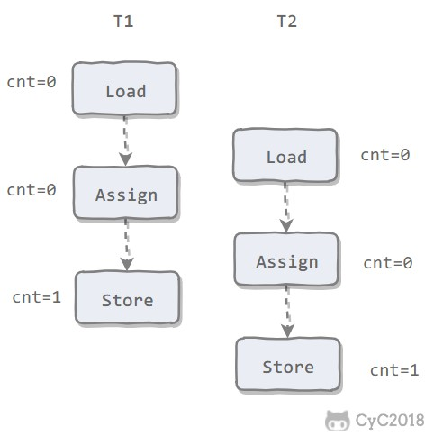

# 多线程

## 创建线程

实例化一个Thread实例，然后调用它的start()方法。但是这个线程启动后实际上什么也不做就立刻结束了。我们希望新线程能执行指定的代码，都需要重写run方法

**注意：run()无参数，无返回值。**

有三种方法：


1. 直接创建线程，在构造函数中用**箭头函数**实现run方法重写

   ```java
   public static void main(String[] args) {
       Thread t = new Thread(() -> {
           // 方法逻辑
       });
       t.start();
   }
   ```
   
2. 继承Thread类

   定义一个类继承Thread，重写其run()方法（因为Thread类实现了Runnable），然后new一个该类实例：

   ```java
   public class Main {
       public static void main(String[] args) {
           Thread t = new MyThread();
           t.start();  // 启动新线程
       }
   }
   
   class MyThread extends Thread {
       @Override
       public void run() {
           System.out.println("start new thread!");
       }
   }
   ```

 

2. 实现Runnable接口

   创建Thread时，传入一个Runnable接口**实例**，接口实例中重写run方法

   ```java
   public class Main {
       public static void main(String[] args) {
           Thread t = new Thread(new MyRunnable());
           t.start();  // 启动新线程
       }
   }
   
   class MyRunnable implements Runnable {
       @Override
       public void run() {
           System.out.println("start new thread!");
       }
   }
   ```

   

3. 实现Callable接口

   通过Runnable接口定义任务执行的内容并开启线程的方式无法得到返回值，也无法让执行端捕获到异常。可通过Callable接口，使任务在完成后返回指定类型的值或抛出异常。

   由于Callable任务是异步执行的，且不能明确是得到了返回值还是捕获了异常，因此需要对其进一步封装，即Future接口。

   FutureTask实现了RunnableFuture接口，表示FutureTask本质上也是表征了一个任务。可以传入Runnable（无返回值）或Callable（有返回）

   - 创建FutureTask时传入Callable实例，再创建Thread传入FutureTask实例
   
     ```java
     public class MyCallable implements Callable<Integer> {
         public Integer call() {  return 123;  }
         public static void main(String[] args) throws ExecutionException, InterruptedException {
             MyCallable mc = new MyCallable();
             FutureTask<Integer> ft = new FutureTask<>(mc);
             Thread thread = new Thread(ft);
             thread.start();
             System.out.println(ft.get());
         }
     }
     ```
   
   - Future + Callable + ThreadPool
   
     在任务的执行处接收Future，通过Future来获取结果：
   
     ```java
     //进行异步任务列表
     public static List<FutureTask<NaResult<MsgResult>>> futureTasks = new ArrayList<>();
     //常驻内存线程池 初始化3个线程 和JDBC连接池是一个意思 实现重用
     public static ExecutorService executorService = Executors.newFixedThreadPool(3);
     // 异步并行任务
     for (QrySimCardCond condBean : condBeanList) {
         Callable callable = () -> {
             // 处理逻辑略
             return simCard;
         };
         FutureTask<SimCard> futureTask = new FutureTask<>(callable);
         futureTasks.add(futureTask);	// 将futureTask加入任务队列
         executorService.submit(futureTask);		// 将futureTask提交到线程池执行
     }
     ```

## 

**三种方法区别**

- 方法一 extends Thread    单继承
- 方法二 implements Runnable  多实现 重写run方法，没有返回值
- 方法三 implements Callable 多实现 重写call方法，**有返回值**（通过 FutureTask 封装，用get取）


### 线程的优先级

```java
Thread.setPriority(int n) //  1~10, 默认值5 
```

优先级高的线程被操作系统调度的优先级较高，操作系统对高优先级线程可能调度更频繁

但不能保证高优先级的线程一定会先执行，低优先级也不一定后执行。

## 线程作用域

线程私有的只有两种：线程**非静态**的私有变量，以及线程函数内定义的局部变量。

其余外部变量，或**线程类内定义的静态变量**，都是线程间共享的

例：统计一个线程类创建过多少个线程，并为每个线程进行编号。 

```java
class MyThread extends Thread {
    private static int sn = 0;    //线程数，MyThread类静态变量，线程间共享
    private int x = 0;      //线程编号，线程私有

    MyThread() {
        x = sn++;
    }

    @Override
    public void run() {
        Thread t = Thread.currentThread();
        System.out.println(t.getName() + "\t" + x);
    }
}
public class ThreadVarTest {
    public static void main(String[] args) {
        // 每个线程创建时，其x值都已确定
        Thread t1 = new MyThread();
        Thread t2 = new MyThread();
        Thread t3 = new MyThread();
        Thread t4 = new MyThread();
        // 只是输出的顺序不定
        t1.start();
        t2.start();
        t3.start();
        t4.start();
    }
}
```

输出：

Thread-1	1
Thread-3	3
Thread-2	2
Thread-0	0

## 线程的生命周期（线程状态）


Java中线程的状态有以下几种：

1. **NEW** ：新建。

   新创建的线程对象（下文统称“线程”），但还没有调用start()方法；

2. **RUNNABLE**：可运行。

   就绪（ready）和运行中（running）两种状态统称为“RUNNABLE可运行”。

   - running：线程对象创建后，其他线程(比如main线程）调用了该线程的start()方法，线程进入运行中状态。

   - ready：该状态的线程位于可运行线程池中，等待被线程调度选中，获取CPU的使用权，此时处于就绪状态。ready状态的线程在获得CPU时间片后变为running。

3. **BLOCKED**：阻塞状态。

   表示线程阻塞于锁（synchronized等）。

4. **WAITING**：无限期等待状态。

   线程不会被分配CPU时间片，需要等待其他线程**显式唤醒**（通知或中断）；

5. **TIMED_WAITING**：限期等待。

   线程不会被分配CPU时间片，但不同于WAITING，线程可以在**指定的时间后自动唤醒**；

6. **TERMINATED**：终止。

   - 该线程已经执行完毕（当线程的run()方法return，或者主线程的main()方法return），则线程终止。

   - 若抛出**异常未捕获**，也导致线程终止。

   调用一个终止状态的线程会报出java.lang.IllegalThreadStateException异常。

   调用线程`stop`方法，可以强制终止（**强烈不推荐**）。

7. **IN_NATIVE**：执行native代码

   这种状态一般在**jstack日志**中看到。

   其实是通过JNI（Java Native Interface）接口去执行了 c和c++的一些native的code，在这种状态下，其实在JNI中已经认为它进入了safepoint，即使已经在运行,与前面提到的stop the world好像理解上有点不一样,这时候这个线程其实还是可以一直在运行的，因为如果这个代码是native的code，其实hotstpot是没法知道是什么状态的，而且也没法控制行为，有可能在做一个很长的 Loop，在那里不停的执行，所以这个时候如果要等的话，肯定会出问题safepoint就进不去了，但这时候认为已经是safepoint了，就可以做那些vm operation，因为我的Java线上还在运行，当 native code执行自己的东西的时候，是不会去碰到那些Java内部的那些hip hop object的那些东西，当想访问那些object的时候，需要通过那些JMI的接口，当调用接口的时候，这个时候JVM就会来检查这时候是不是正在做safepoint,如果正在做safepoint，就会把调用给阻塞，然后线程就会被停下来,等vm operation结束了以后再继续执行下去。 所以虽然在Thread in native状态你仍然在运行，但实际上不会造成造成危害,因为要访问那种Java object或者访问hip的时候，这里的JMI接口会挡住。

   **Safepoint 可以理解成是在代码执行过程中的一些特殊位置**，当线程执行到这些位置的时候，**线程可以暂停**。在 SafePoint 保存了其他位置没有的**一些当前线程的运行信息，供其他线程读取**。这些信息包括：线程上下文的任何信息，例如对象或者非对象的内部指针等等。我们一般这么理解 SafePoint，就是线程只有运行到了 SafePoint 的位置，他的**一切状态信息，才是确定的**，也只有这个时候，才知道这个线程用了哪些内存，没有用哪些；并且，只有线程处于 SafePoint 位置，这时候对 JVM 的堆栈信息进行修改，例如回收某一部分不用的内存，线程才会感知到，之后继续运行，每个线程都有一份自己的内存使用快照，这时候其他线程对于内存使用的修改，线程就不知道了，只有再**进行到 SafePoint 的时候，才会感知**。

   所以，GC 一定需要所有线程同时进入 SafePoint，并停留在那里，等待 GC 处理完内存，再让所有线程继续执。像这种**所有线程进入 SafePoint**等待的情况，就是 Stop the world

   日志中调用sun.misc.Unsafe.park()会使线程进入BLOCKED，这个方法类似于Object.wait()

## 线程方法

### 1.`Thread.start()`

启动线程

### 2. `Thread.sleep(long millis)`

当前线程放弃获取的CPU时间片，进入TIMED_WAITING状态，**但不释放对象锁**，millis毫秒后线程自动苏醒进入就绪状态。

作用：给其它线程执行机会。


### 3. `Thread.yield()`

由**当前线程**调用此方法，当前线程放弃获取的CPU时间片，**但不释放锁资源**，由运行状态变为**就绪状态**，让OS再次选择线程。 作用：让相同优先级的线程轮流执行，但并不保证一定会轮流执行。实际中无法保证yield()达到让步目的，因为让步的线程还有可能被线程调度程序再次选中。Thread.yield()**不会导致阻塞**。该方法与sleep()类似，只是不能由用户指定暂停多长时间。


### 4. `thread.join(long millis)`

（参数可选，表示等待时间）

在当前线程里调用其它线程Thread1的join方法，会等待Thread1执行结束。

令当前线程进入**WAITING/TIMED_WAITING**状态，且**不会释放对象锁**。

> 当线程Thread执行完毕，或millis时间到，则当前线程一般情况下进入RUNNABLE状态，也有可能进入BLOCKED状态（因为join是**基于wait实现**的）。

要保证n个线程按顺序执行，可以在主线程中依次调用它们的join()方法，如：

```java
...
Thread A = new Thread(...);
Thread B = new Thread(...);
Thread C = new Thread(...);

A.start();
A.join();

B.start();
B.join();

C.start();
C.join();
...
```


### 5. `Object.wait() / wait(long timeout)`

**必须在块或方法中使用**

当前线程调用对象的wait()方法，当前线程**释放对象锁**并进入WAITING/TIMED_WAITING状态，**当前线程**进入等待队列。依靠**同一个被锁的对象**调用notify() / notifyAll()唤醒，或timeout时间到自动唤醒。

### 6. `Object.notify() / notifyAll()`

也必须在**synchronized**块或方法中使用

随机唤醒一个(notify)或所有(notifyAll)正在object锁等待的线程（就是在下文例1中getTask()中位于this.wait()的线程），从而使得等待线程从this.wait()方法返回。让等待的线程被重新唤醒
**注意**：wait和notify必须对**同一个对象**使用才有效

  例1

  ```java
  class TaskQueue {
      Queue<String> queue = new LinkedList<>();
      public synchronized void addTask(String s) {
         this.queue.add(s);
         this.notify(); // 唤醒在this锁等待的线程
      }
      public synchronized String getTask() {
          while (queue.isEmpty()) {
  	    	// 释放this锁:
     			this.wait();
          	// 重新获取this锁
          }
          return queue.remove();
      }
  }
  ```

  完整例子：例2

  ```java
  public class ThreadWait {
      public static void main(String[] args) throws InterruptedException {
          // 任务队列
          TaskQueue taskQueue = new TaskQueue();
          List<Thread> ts = new ArrayList<Thread>();
          // 启动5个线程，都在等待从任务队列取出task,并执行
          for (int i=0; i<5; i++) {
              Thread t = new Thread() {
                  @Override
                  public void run() {
                      while (true) {
                          try {
                              String s = taskQueue.getTask();
                              System.out.println(this.getName() + " execute task: " + s);
                          } catch (InterruptedException e) {
                              return;
                          }
                      }
                  }
              };
              t.start();
              ts.add(t);
          }
          Thread add = new Thread(() -> {
              // 不断放入task（10次）
              for (int i=0; i<10; i++) {
                  String s = "t-" + i;
                  System.out.println("add task: " + s);
                  taskQueue.addTask(s);
                  try { Thread.sleep(100); } catch(InterruptedException e) {}
              }
          });
          add.start();
          add.join();
          Thread.sleep(100);
          for (Thread t : ts) {
              // ts中的线程都是死循环，需要强制中断
              t.interrupt();
          }
      }
  }
  
  class TaskQueue {
      Queue<String> queue = new LinkedList<>();
      public synchronized void addTask(String s) {
          this.queue.add(s);
          this.notifyAll();   // 唤醒所有线程
      }
      public synchronized String getTask() throws InterruptedException {
          // if (queue.isEmpty()) {  // 如果这里用if判断，则只有一个线程能执行，另外四个线程都报错退出
          while (queue.isEmpty()) {
              this.wait();
          }
          return queue.remove();
      }
  }
  // 输出
  add task: t-0
  Thread-4 execute task: t-0
  add task: t-1
  Thread-0 execute task: t-1
  add task: t-2
  Thread-3 execute task: t-2
  add task: t-3
  Thread-3 execute task: t-3
  add task: t-4
  Thread-3 execute task: t-4
  add task: t-5
  Thread-1 execute task: t-5
  add task: t-6
  Thread-3 execute task: t-6
  add task: t-7
  Thread-2 execute task: t-7
  add task: t-8
  Thread-2 execute task: t-8
  add task: t-9
  Thread-0 execute task: t-9
  Process finished with exit code 0
  ```

  重点关注addTask()方法，内部调用了this.notifyAll()而不是this.notify()，使用notifyAll()将唤醒所有当前正在this锁等待的线程，而notify()只会唤醒其中一个（具体哪个依赖操作系统，有一定的**随机性**）。

  这是因为可能有多个线程正在getTask()方法内部的wait()中等待，使用notifyAll()将一次性全部唤醒。通常来说，notifyAll()更安全。有些时候，如果我们的代码逻辑考虑不周，用notify()会导致只唤醒了一个线程，而其他线程可能永远等待下去醒不过来了。

### 注意：在多线程环境中，检查条件是否成立，应该用while而不是if

上面例2，判断队列是否为空用while而不是if。notifyAll()唤醒所有线程后，只有一个线程能获取this锁，此时该线程执行queue.remove()就能获取任务。而此后其他线程执行queue.remove()就会报错。最终结果是第一次取得任务的线程继续执行完所有任务。

问题的本质在于if是**一次性**的，而while是**一直判断**。当队列非空，多个线程都进入if，其中随机一个线程先执行，取出队列的任务后队列变为空然后释放锁，这时其他线程wait结束获得锁开始执行，会一直执行到queue.remove()，因为if语句只能保证当前队列为空，而while可以保证队列始终为空。遇到使用wait暂停执行的情况，用常规思维加if判断就失效了。

### Q：run和start区别？

直接调用Thread实例的run()方法是无效的，相当于调用了一个普通的Java方法，当前线程并没有任何改变，也不会启动新线程。

必须调用Thread实例的start()方法才能启动新线程，start()会自动调用重写的run()

### Q：wait()和sleep()的区别？

|          | sleep()                                                      | wait()                                                       |
| :------- | ------------------------------------------------------------ | ------------------------------------------------------------ |
| 所属的类 | Thread                                                       | Object                                                       |
| 释放锁   | 不（不会失去对任何监视器（monitor）的所有权，也就是不会释放锁，仅仅会让出CPU的执行权） | 是（不仅会让出CPU的执行权，还会释放锁（即monitor的所有权），并且进入wait set） |
| 使用方式 | 使用sleep()方法需要捕获InterruptedException异常              | 使用wait()方法则必须放在**synchronized**代码块里面，同样需要捕获InterruptedException异常，并且需要获取对象的锁。 |
| 使用场景 | 当前线程休眠，或者轮循暂停操作                               | 多线程之间的通信                                             |


## volatile关键字（共享变量）

volatile关键字解决的是**可见性**问题：当一个线程修改了某个共享变量的值，其他线程能够立刻看到修改后的值。

但是volatile无法保证线程安全，因为不能保证原子性，例如两个线程同时写冲突

> 在 Java 内存模型中，允许编译器和处理器对指令进行**重排序**，重排序不会影响单线程的执行结果，却会影响到多线程并发执行的正确性。

volatile 关键字通过添加**内存屏障**的方式来**禁止指令重排**，即重排序时不能把后面的指令放到内存屏障之前。

### JMM层面实现

一个变量加volatile后，该变量和内存的交互操作更严格，即**read-load-use** 和 **assign-store-write** 必须是原子性的

> [Java内存模型](##Java内存模型)中定义的8种[内存间交互操作](###内存间交互操作)
>
> 


### 汇编层面实现

在原汇编代码前面加**lock指令**

> lock指令解释
>
> 1. 将当前处理器缓存行的数据**立即**写回内存
> 2. 将其他CPU中缓存的该数据的缓存置失效（MESI缓存一致性协议）
> 3. **内存屏障**，使lock前后指令不能重排序


### 内存屏障 

JVM规范的四种内存屏障

| 内存屏障类型   | 抽象场景                   | 描述                                           |
| :------------- | :------------------------- | :--------------------------------------------- |
| LoadLoad屏障   | Load1; LoadLoad; Load2     | 在Load2读取前，保证Load1先读操作完毕。         |
| StoreStore屏障 | Store1; StoreStore; Store2 | 在Store2写入前，保证Store1的写操作刷新到主内存 |
| LoadStore屏障  | Load1; LoadStore; Store2   | 在Store2写入前，保证Load1读操作完毕。          |
| StoreLoad屏障  | Store1; StoreLoad; Load2   | 在Load2读取前，保证Store1的写操作刷新到主内存  |

为了实现volatile的内存语义（最终实现执行顺序与代码语义的一致性），JVM采取以下的保守策略：

- 在每个volatile**写操作的前面**插入一个StoreStore屏障，写操作**后面**插入一个StoreLoad屏障。（保证这个volatile写操作在其他并发线程的写之后、在其他读之前）
- 在每个volatile**读操作的后面**插入一个LoadLoad屏障和LoadStore屏障。（保证这个volatile读操作在其他并发线程的读和写之前）

```
volatile int a = 0；
a = 1;  // 写
#StoreStore屏障，保证第4行a=2之后没有其他修改a的操作，否则执行结果不符合代码语义
a = 2； // 写
#StoreLoad屏障
b = a; // 读
#LoadLoad屏障
#LoadStore屏障，保证第6行读出的a就是2，不会再赋其他值，否则执行结果不符合语义
```


### **缓存一致性协议**

多个cpu从主内存读取同一个数据到各自的高速缓存，当其中某个cpu修改了缓存的数据，会**立刻同步到主内存**。其他cpu通过**总线嗅探机制**可以立刻感知数据变化，从而将自己缓存的数据置失效。

> 缓存加锁
>
> 核心机制基于缓存一致性协议实现，一个处理器的缓存回写内存会导致其他cpu的缓存失效，IA-32和Intel 64处理器使用MESI实现缓存一致性协议


## 线程同步

### 1. synchronized关键字

原理：

作用于代码块：与 volatile 的实现原理不同，它对应的内存间交互操作为：lock 和 unlock，在虚拟机实现上对应的字节码指令为 **monitorenter** 和 **monitorexit**。再底层依赖操作系统的互斥锁（Mutex Lock）。

作用于方法：在字节码的方法访问标识符(flags)中加**ACC_SYNCHRONIZED**

1. 用于代码块

   保证了代码块在任意时刻最多只有一个线程能执行。

   ```java
   class Counter {
       public static final Object lock = new Object();
       public static int count = 0;
   }
   class AddThread extends Thread {
   	public void run() {
       	for (int i=0; i<10000; i++) {
           	synchronized(Counter.lock) {  // 对Counter类的静态实例lock加锁，进行互斥操作
               	Counter.count += 1;
           	}
       	}
   	}
   }
   ```

   注意：加锁目标必须是**对象**（锁不了基本类型）；且加锁对象必须**唯一**

   ```java
   class Counter {
       public static Integer count = 0;
   }
   class AddThread extends Thread {
       public void run() {
           for (int i=0; i<10000; i++) {
               synchronized(Counter.count) {  // 对Counter类的静态变量count进行互斥操作。加1一万次
                   Counter.count += 1;
               }
           }
       }
   }
   class DecThread extends Thread {
       public void run() {
           for (int i=0; i<10000; i++) {
               synchronized(Counter.count) {  // 对Counter类的静态变量count进行互斥操作。减1一万次
                   Counter.count -= 1;
               }
           }
       }
   }
   ```

   这里的执行结果count是不确定的，因为count引用的地址会随加减操作变化（Integer常量池）。

   每次对count加锁，锁的都不是同一个东西，因此无法保证互斥操作。

   

2. 用于方法

   - 非静态方法

     ```java
     public synchronized void add(int n) { // 锁住this
         count += n;
     } // 解锁
     ```

     其实就是锁住方法所属实例，即this。等价于同步代码块：

     ```java
     public void add(int n) {
         synchronized(this) { // 代码块，锁住this
             count += n;
         } // 解锁
     }
     ```

   - 静态方法

     ```java
     public synchronized static void test(int n) {
         ...
     }
     ```

     对于static方法，是没有this实例的，因为static方法是针对类而不是实例。因此静态方法加锁就是锁住该类。等价于代码块：

     ```java
     public class Counter {
         public static void test(int n) {
             synchronized(Counter.class) {
                 ...
             }
         }
     }
     ```

     

3. 不需要synchronized的操作

   **单条原子操作的语句**

   > JVM规范定义了几种**原子操作**：
   >
   > 1. 基本类型赋值操作，例如：int n = m；（long和double除外，但x64平台jvm已包括）
   > 2. 引用类型赋值，例如：`List <String> list = anotherList`。

   但是多条语句操作就需要同步。

### 2. Lock

Java内置的synchronized关键字锁相对比较重量级，且使用时存在以下局限：

- 当一个线程获取了对应的锁，并执行同步代码块时，其他线程只能一直等待，等待获取锁的线程释放锁，而获取锁的线程释放锁只会有两种情况：

  - 获取锁的线程执行完了代码块，线程释放对锁的占有；
  - 线程执行发生异常，JVM自动释放锁；

  如果这个获取锁的线程由于要等待IO或者其他原因（如调用sleep方法）被阻塞了，但是又没有释放锁，其他线程便会长时间地等待下去。等待中的线程**不会响应中断**。

- 如果多个线程都只是进行读操作，当一个线程在进行读操作时，其他线程也只能等待无法进行读操作。

- synchronized机制无法感知线程是否成功获取了锁。

因此Java中提供了**Lock接口**，用于在部分场景下取代synchronized关键字，进行更轻量级的实现。但注意，采用Lock方式获取必须主动去释放锁，且Lock在发生异常时，不会自动释放锁。因此一般来说，使用Lock必须配合try-catch块，在try之前获取锁，并且在finally释放锁，以保证锁一定被被释放，防止死锁。

#### 可重入锁ReentrantLock

ReentrantLock实现了Lock接口。可重入锁即表示可反复进入的锁，但仅限于当前线程。当前线程可以反复加锁，但也需要释放同样加锁次数的锁，即重入了多少次，就要释放多少次，不然也会导入锁不被释放。

**几个重要方法：**

1. lock()

   获取锁，有三种情况：

   - 锁空闲：直接获取锁并返回，同时设置锁持有者数量为：1；

   - 当前线程持有锁：直接获取锁并返回，同时锁持有者数量+1；

   - 其他线程持有锁：当前线程会休眠等待，直至获取锁为止；

     ```java
     Lock lock = new ReentrantLock();
     lock.lock();
     try {
         // 处理任务
     } catch(Exception e) {
         
     } finally {
         lock.unlock(); // 释放锁
     }
     ```

     注意，lock()方法的调用在try之前，原因是加锁操作可能会抛出异常，如果加锁在try块之前，那么出现异常时try-finally块不会执行；如果加锁操作在try块中，由于finally一定会执行，此时try中的加锁操作出现异常，finally依然会执行解锁操作，而此时并没有获取到锁，执行解锁操作会抛出另外一个异常，可能将加锁的异常信息覆盖，导致信息丢失。

     因此应该将加锁操作放在try块之前。

2. tryLock()

   尝试获取锁，与lock()相比多了**返回值**。获取成功返回：true，获取失败返回：false。

   还可以带参数`tryLock(long time, TimeUnit unit)`，在拿不到锁时会等待重试一定的时间time，在时间期限之内如果还拿不到锁，就返回false

   同样有以下三种情况：

   - 锁空闲：直接获取锁并返回：true，同时设置锁持有者数量为：1；

   - 当前线程持有锁：直接获取锁并返回：true，同时锁持有者数量+1；

   - 其他线程持有锁：获取锁失败，返回：false；

     ```java
     Lock lock = new ReentrantLock();
     if (lock.tryLock(1, TimeUnit.SECONDS)) {  // 尝试获取锁，最多等待1秒
          try {
              // 处理任务
          } catch(Exception e){
              
          } finally{
              lock.unlock();   // 释放锁
          } 
     } else {
         // 如果不能获取锁，则直接做其他事情
     }
     ```

     

3. unlock()

   释放锁，每次锁持有者数量递减 1，直到 0 为止。

lock()方法和unlock()方法间的代码块即为加锁的代码块。Lock只有代码块加锁的方式，不能对方法加锁。


### Q：synchronized和ReentrantLock区别？

|            | synchronized                                   | ReentrantLock                                      |
| ---------- | ---------------------------------------------- | -------------------------------------------------- |
| 作用域     | 能锁方法和代码块                               | 只能锁代码块                                       |
| 语法       | 是关键字                                       | 是实现类                                           |
| 实现机制   | jvm层面，对象头monitor模式，锁信息保存在对象头 | api层面，依赖AQS，通过代码中int类型state标识锁状态 |
| 支持锁类型 | 非公平锁                                       | 公平或非公平                                       |
| 条件队列   | 单条件队列                                     | 多条件队列                                         |
| 是否可重入 | 可重入                                         | 可重入                                             |
| 锁升级     | 有锁升级过程                                   | 无                                                 |


## 线程通信

### 1. Object 的 wait/notify 方法

见上一节**线程方法**的第5、6方法

### 2. Condition 的 await/singal  方法

线程方法的例1TaskQueue的wait/notify，把synchronized替换为ReentrantLock实现：

```java
class TaskQueue {
    private final Lock lock = new ReentrantLock();
    private final Condition condition = lock.newCondition();  // 获得一个绑定了Lock实例的Condition实例
    private Queue<String> queue = new LinkedList<>();

    public void addTask(String s) {
        lock.lock();  // 如果加锁成功
        try {
            queue.add(s);
            condition.signalAll();  // 唤醒所有等待线程
        } finally {
            lock.unlock();  // 无论如何都要释放锁
        }
    }

    public String getTask() {
        lock.lock(); // 如果加锁成功
        try {
            while (queue.isEmpty()) {  // 注意多线程环境用while语句判断
                condition.await();  // 队列为空时等待
            }
            return queue.remove();
        } finally {
            lock.unlock(); // 无论如何都要释放锁
        }
    }
}
```

### 3.管道输入/输出流

管道输入/输出流和普通的文件输入/输出流或者网络输入/输出流不同之处在于，它主要用于线程之间的数据传输，而传输的媒介为内存。

管道输入/输出流主要包括了如下4种具体实现：PipedOutputStream、PipedInputStream、 PipedReader和PipedWriter，前两种面向字节，而后两种面向字符。

## 守护线程

Java中的线程分为两类： daemon 线程（守护线程）和 user 线程（用户线程）。

main函数就是由用户线程执行的。 JVM 内部同时还启动了很多守护线程， 比如垃圾回收线程。

守护线程和用户线程区别：当**最后一个用户线程**束时， JVM才会正常退出，而不管当前是否存在守护线程，也就是说守护线程是否结束并不影响 JVM退出。换而言之，只要有一个用户线程还没结束，正常情况下JVM就不会退出。

## 线程池

线程池内部维护了若干个线程，没有任务的时候，这些线程都处于等待状态。如果有新任务，就分配一个空闲线程执行。如果所有线程都处于忙碌状态，新任务要么放入队列等待，要么增加一个新线程进行处理。

Java标准库提供了ExecutorService接口表示线程池，通过Executor类创建

几个常用实现类：

1. `FixedThreadPool(int n)`：线程数**固定**的线程池；
2. CachedThreadPool：线程数根据任务**动态调整**的线程池；
3. SingleThreadExecutor：仅单线程执行的线程池，相当于大小为1的`FixedThreadPool`。
4. ScheduledThreadPool：线程任务可以定期反复执行

### 线程池参数

1. `int corePoolSize`： 核心线程数

2. `int maximumPoolSize`： 最大线程数（一般要大于核心线程数，多出来的部分理解为非核心线程

3. `long keepAliveTime`：最大空闲时间，表示线程没有任务执行时最多保持多久时间会终止（只有当线程池中的线程数大于 corePoolSize 时，keepAliveTime 才会起作用）

4. `TimeUnit unit`： 时间单位

5. `BlockingQueue workQueue`： 工作队列

   cmp项目用的是

   |                                       | 排序                       | 容量                                                         |
   | ------------------------------------- | -------------------------- | ------------------------------------------------------------ |
   | ArrayBlockingQueue（有界队列）        | FIFO                       |                                                              |
   | LinkedBlockingQueue（可设置容量队列） | FIFO                       | 默认Integer.MAX_VALUE，吞吐量高于ArrayBlockingQueue          |
   | DelayQueue（延迟队列）                | 根据指定的执行时间从小到大 |                                                              |
   | PriorityBlockingQueue（优先级队列）   | 优先级                     |                                                              |
   | SynchronousQueue（同步队列）          |                            | 不存储元素，每个插入操作必须等到另一个线程调用移除操作，否则插入一直阻塞。吞吐量通常要高于LinkedBlockingQuene |

   

6. `ThreadFactory threadFactory`： 线程工厂，主要用来创建线程。

7. `RejectedExecutionHandler handler`： 拒绝策略

   有以下四种策略：

   - ThreadPoolExecutor.AbortPolicy：**默认策略**，丢弃任务并抛异常（RejectedExecutionException）；

   - ThreadPoolExecutor.DiscardPolicy：也是丢弃任务，但是不抛出异常；

   - ThreadPoolExecutor.DiscardOldestPolicy：丢弃队列最前面的任务，然后重新尝试执行任务（重复此过程）；

   - ThreadPoolExecutor.CallerRunsPolicy：由调用线程处理该任务。


   想实现自己的拒绝策略，实现RejectedExecutionHandler接口即可。

### 任务调度


1. 线程池创建时，线程数为0，当有任务提交给线程池时，在核心池**corePool**创建一个线程执行，直到线程数达到corePoolSize 
2. 当线程数达到corePoolSize 时，再有任务提交进来，就放到工作队列，当有线程执行完任务，就从队列中取任务执行（按先进先出顺序）
3. 当工作队列也满了，corePool还是没有空闲线程，则新来任务就在maxPool创建线程
4. 当maxPool也满了，则对新来任务执行拒绝策略【**注意**：以上这些步骤中，如果发现线程池状态不是RUNNING，则直接拒绝】
5. 当线程数大于corePoolSize时，keepAliveTime参数起作用，关闭没有任务执行的线程，直到线程数不超过corePoolSize。线程池通过这个机制动态调节线程数。

### **线程池状态变化**


1. **RUNNING**：正常运行，既接受新任务，也处理队列中任务
2. **SHUTDOWN**：正常状态调用`shutdown()`方法，就进入SHUTDOWN状态，不再接受新任务【拒绝策略】，等待的任务也会放弃，但会继续处理队列中任务直到结束。
3. **STOP**：正常状态调用`shutdownNow()`方法，就进入STOP状态，不接受新任务，也不处理队列中的任务，**正在运行的线程也会中断**。
4. **TIDYING**：过渡状态，表示线程池即将结束。由两种状态转变而来：1）SHUTDOWN状态处理完队列中的任务，且没有线程在运行；2）或者STOP状态的工作线程为空（必然为空，因为线程全中断）
5. **TERMINATED**：终止状态，TIDYING状态调用`tryTerminate()`方法，就进入TERMINATED状态。该方法是一个空方法，留给用户扩展。


### 使用

- execute：提交一个任务给线程池执行，如果线程异常直接抛出。只能提交Runnable

- submit：提交一个任务给线程池执行，如果线程异常并不会直接抛出，而要用Futrue的get方法获取（前提是线程未捕获异常）。可以提交Runnable和Callable。

cmp中，在CRMThreadPoolManager类，用静态map存<名称，线程池>以复用，工作队列用LinkedBlockingQueue。

### 动态设置参数

JDK允许线程池使用方通过ThreadPoolExecutor的实例来动态设置线程池的核心策略。

例如ThreadPoolExecutor#setCorePoolSize方法，在运行期线程池使用方调用此方法设置corePoolSize之后，线程池会直接覆盖原来的corePoolSize值，并且基于当前值和原始值的比较结果采取不同的处理策略


### 源码

**核心属性**

```java
public class ThreadPoolExecutor extends AbstractExecutorService {
    private final AtomicInteger ctl = new AtomicInteger(ctlOf(RUNNING, 0));
    private static final int COUNT_BITS = Integer.SIZE - 3;  // 29
    private static final int CAPACITY   = (1 << COUNT_BITS) - 1;
    // runState is stored in the high-order bits
    private static final int RUNNING    = -1 << COUNT_BITS;
    private static final int SHUTDOWN   =  0 << COUNT_BITS;
    private static final int STOP       =  1 << COUNT_BITS;
    private static final int TIDYING    =  2 << COUNT_BITS;
    private static final int TERMINATED =  3 << COUNT_BITS;
    // Packing and unpacking ctl
    // 获取线程池状态，通过按位与操作，低29位将全部变成0
    private static int runStateOf(int c)     { return c & ~CAPACITY; }
    // 获取线程池worker数量，通过按位与操作，高3位将全部变成0
    // 注意工作线程并不区分核心线程和非核心线程，就是在执行任务的线程
    private static int workerCountOf(int c)  { return c & CAPACITY; }
    // 根据线程池状态和线程池worker数量，生成ctl值
    private static int ctlOf(int rs, int wc) { return rs | wc; }
    // 线程池状态小于xx
    private static boolean runStateLessThan(int c, int s) { return c < s; }
    // 线程池状态大于等于xx
    private static boolean runStateAtLeast(int c, int s) { return c >= s; }
}
```

核心变量：ctl，用于表示【线程池状态】和【工作线程数】。长度32bit，高3位记录线程池状态（5种），低29位记录工作线程个数（2^29)。所以每个状态int都要左移29位，使得状态值保存在int的高三位。

#### 1.任务调度 Executor.execute()

线程池执行的核心方法

实现java.util.concurrent.ThreadPoolExecutor#execute

```java
public void execute(Runnable command) {
    if (command == null)
        throw new NullPointerException();
    /*
     * Proceed in 3 steps:
     *
     * 1. If fewer than corePoolSize threads are running, try to
     * start a new thread with the given command as its first
     * task.  The call to addWorker atomically checks runState and
     * workerCount, and so prevents false alarms that would add
     * threads when it shouldn't, by returning false.
     *
     * 2. If a task can be successfully queued, then we still need
     * to double-check whether we should have added a thread
     * (because existing ones died since last checking) or that
     * the pool shut down since entry into this method. So we
     * recheck state and if necessary roll back the enqueuing if
     * stopped, or start a new thread if there are none.
     *
     * 3. If we cannot queue task, then we try to add a new
     * thread.  If it fails, we know we are shut down or saturated
     * and so reject the task.
     */
    int c = ctl.get();
    // ==========1.创建核心线程============
    // 如果工作线程数 小于 核心线程数，则调addWorker()创建核心线程
    if (workerCountOf(c) < corePoolSize) {
        // command就是任务，true表示分配核心线程执行
        if (addWorker(command, true))
            // 成功直接返回
            return;
        // 不成功，说明有其他线程竞争
        c = ctl.get();
    }
    // ==========2.（第1步不成功，则）将任务添加到工作队列============
    // 2.1 如果状态是RUNNING，才会添加
    if (isRunning(c) && workQueue.offer(command)) {
        // 放入队列后重新检查
        int recheck = ctl.get();
        // 状态不是RUNNING---则队列弹出，并拒绝 
        // （******这个状态很多网上的图都没画出来，比如前面的流程图）
        if (! isRunning(recheck) && remove(command))
            reject(command);
        // 如果状态是RUNNING，且工作线程数是0，则创建非核心线程（用于处理工作队列，所以不分配任务）
        else if (workerCountOf(recheck) == 0)
            addWorker(null, false);
    }
    // ==========3. （第2步不成功，则）创建非核心线程并分配任务。若不成功，就执行拒绝策略============
    else if (!addWorker(command, false))
        reject(command);
}
```

#### 2.添加工作线程 addWorker()

Worker这个工作线程，实现了Runnable接口，并持有一个线程thread，一个初始化的任务firstTask。thread是在调用构造方法时通过ThreadFactory来创建的线程，可以用来执行任务；firstTask用它来保存传入的第一个任务，这个任务可以有也可以为null。如果这个值是非空的，那么线程就会在启动初期立即执行这个任务，也就对应核心线程创建时的情况；如果这个值是null，那么就需要创建一个线程去执行任务列表（workQueue）中的任务，也就是非核心线程的创建。


```java
private boolean addWorker(Runnable firstTask, boolean core) {
    retry:  // 跳出内层for循环的语法，28行--continue retry; 执行后直接跳到此处。24行--break retry; 执行后打破外循环
    // =============外循环判断线程池状态===============
    for (;;) {
        // 重新获取状态
        int c = ctl.get();
        int rs = runStateOf(c);

        // Check if queue empty only if necessary.
        // 如果线程池状态不是RUNNING
        if (rs >= SHUTDOWN &&
            // 【且不是】状态为SHUTDOWN，且任务为空，且工作队列非空。
            ! (rs == SHUTDOWN && firstTask == null && !workQueue.isEmpty()))
            // 直接返回false（如果是【SHUTDOWN && 任务空 && 队列非空】，不进入，因为这个状态下虽然不接受新任务，但存量任务还要处理）
            return false;

         // =============内循环判断工作线程个数===============
        for (;;) {
            // 工作线程数不符合设置，返回false
            int wc = workerCountOf(c);
            if (wc >= CAPACITY ||
                wc >= (core ? corePoolSize : maximumPoolSize))
                return false;
            // CAS对ctl++，若成功则【跳出外循环】
            if (compareAndIncrementWorkerCount(c))
                break retry;
            c = ctl.get();  // Re-read ctl
            // 如果状态变了，继续外循环（外循环就是检测线程池状态的）
            if (runStateOf(c) != rs)
                continue retry;
            // 如果状态没变，继续内循环
            // else CAS failed due to workerCount change; retry inner loop
        }
    }

    // ==================走到这，说明ctl++成功，开始创建工作线程===============
    // 工作线程是否启动
    boolean workerStarted = false;
    // 工作线程是否创建
    boolean workerAdded = false;
    // 工作线程
    Worker w = null;
    try {
        // 创建工作线程Worker内部类
        w = new Worker(firstTask);
        final Thread t = w.thread;
        if (t != null) {
            // 加可重入锁（因为Worker添加必须串行），锁级别是当前线程池
            final ReentrantLock mainLock = this.mainLock;
            mainLock.lock();
            try {
                // Recheck while holding lock.
                // Back out on ThreadFactory failure or if
                // shut down before lock acquired.
                int rs = runStateOf(ctl.get());
                // 线程池状态是RUNNING，或者SHUTDOWN且任务为空
                if (rs < SHUTDOWN || (rs == SHUTDOWN && firstTask == null)) {
                    if (t.isAlive()) // precheck that t is startable，线程在运行（执行start方法）就抛错
                        throw new IllegalThreadStateException();
                    // 线程添加到集合
                    workers.add(w);
                    int s = workers.size();
                    // 更新工作线程数的历史最大值
                    if (s > largestPoolSize)
                        largestPoolSize = s;
                    // 表示工作线程创建
                    workerAdded = true;
                }
            } finally {
                mainLock.unlock();
            }
            // 创建成功就启动
            if (workerAdded) {
                t.start();
                workerStarted = true;
            }
        }
    } finally {
        // 最后检查是否启动。若启动失败，则将工作线程从workers集合移除，并将ctl--
        if (! workerStarted)
            addWorkerFailed(w);
    }
    // 返回是否启动（启动肯定就创建）
    return workerStarted;
}
```

#### Worker

线程池需要管理线程的生命周期，需要在线程长时间不运行的时候进行回收。线程池使用一张Hash表：

```java
private final HashSet<Worker> workers = new HashSet<Worker>();
```

去持有线程的引用，这样可以通过添加引用、移除引用这样的操作来控制线程的生命周期。这个时候重要的就是如何判断线程是否在运行。

工作线程，通过继承AQS，使用AQS来实现**独占锁**这个功能。没有使用可重入锁ReentrantLock，而是使用AQS，为的就是实现**不可重入**的特性去反应线程现在的执行状态。

- lock方法一旦获取了独占锁，表示当前线程正在执行任务中。如果正在执行任务，则不应该中断线程。
- 如果该线程现在不是独占锁的状态（即空闲），说明它没有在处理任务，这时可以中断。 

线程池在执行shutdown方法或tryTerminate方法时会调用interruptIdleWorkers方法来中断空闲的线程，interruptIdleWorkers方法会使用tryLock方法来判断线程池中的线程是否是空闲状态；如果线程是空闲状态则可以安全回收

```java
private final class Worker
    extends AbstractQueuedSynchronizer
    implements Runnable
{
    /**
     * This class will never be serialized, but we provide a
     * serialVersionUID to suppress a javac warning.
     */
    private static final long serialVersionUID = 6138294804551838833L;

    /** Thread this worker is running in.  Null if factory fails. */
    final Thread thread;
    /** Initial task to run.  Possibly null. */
    Runnable firstTask;
    /** Per-thread task counter */
    volatile long completedTasks;

    /**
     * Creates with given first task and thread from ThreadFactory.
     * @param firstTask the first task (null if none)
     */
    Worker(Runnable firstTask) {
        setState(-1); // inhibit interrupts until runWorker
        this.firstTask = firstTask;
        // 这儿是Worker的关键所在，使用了线程工厂创建了一个线程。传入的参数为当前worker
        this.thread = getThreadFactory().newThread(this);
    }

    /** Delegates main run loop to outer runWorker  */
    public void run() {
        runWorker(this);
    }

    // Lock methods 【锁方法，0表示解锁，1表示加锁】
    // The value 0 represents the unlocked state.
    // The value 1 represents the locked state.

    // 覆写
    protected boolean isHeldExclusively() {
        return getState() != 0;
    }
    // 覆写
    protected boolean tryAcquire(int unused) {
        if (compareAndSetState(0, 1)) {
            setExclusiveOwnerThread(Thread.currentThread());
            return true;
        }
        return false;
    }

    protected boolean tryRelease(int unused) {
        setExclusiveOwnerThread(null);
        setState(0);
        return true;
    }

    public void lock()        { acquire(1); }
    public boolean tryLock()  { return tryAcquire(1); }
    public void unlock()      { release(1); }
    public boolean isLocked() { return isHeldExclusively(); }

    void interruptIfStarted() {
        Thread t;
        if (getState() >= 0 && (t = thread) != null && !t.isInterrupted()) {
            try {
                t.interrupt();
            } catch (SecurityException ignore) {
            }
        }
    }
}
```


#### 3.runWorker方法

Worker对象（线程）执行的核心方法，过程如下：

1. while循环不断地通过getTask()方法获取任务。
2. 如果线程池正在停止，那么要保证当前线程是中断状态，否则要保证当前线程不是中断状态。 
3. 执行任务。 
4. 如果getTask结果为null（说明拿不到任务，空闲）则跳出循环，执行processWorkerExit()方法，销毁线程。


```java
final void runWorker(Worker w) {
    Thread wt = Thread.currentThread();
    Runnable task = w.firstTask;
    w.firstTask = null;
    w.unlock(); // allow interrupts
    boolean completedAbruptly = true;
    try {
        // task != null 说明任务是最开始addWorker传来的
        // (task = getTask()) != null 说明任务是从工作队列获取的
        while (task != null || (task = getTask()) != null) {
            w.lock();
            // If pool is stopping, ensure thread is interrupted;
            // if not, ensure thread is not interrupted.  This
            // requires a recheck in second case to deal with
            // shutdownNow race while clearing interrupt
            if ((runStateAtLeast(ctl.get(), STOP) ||
                 (Thread.interrupted() &&
                  runStateAtLeast(ctl.get(), STOP))) &&
                !wt.isInterrupted())
                wt.interrupt();
            try {
                // 前置增强（勾子函数）
                beforeExecute(wt, task);
                Throwable thrown = null;
                try {
                    // 执行任务
                    task.run();
                } catch (RuntimeException x) {
                    thrown = x; throw x;
                } catch (Error x) {
                    thrown = x; throw x;
                } catch (Throwable x) {
                    thrown = x; throw new Error(x);
                } finally {
                    // 后置增强（勾子函数）
                    afterExecute(task, thrown);
                }
            } finally {
                task = null;
                w.completedTasks++;
                w.unlock();
            }
        }
        completedAbruptly = false;
    } finally {
        processWorkerExit(w, completedAbruptly);
    }
}
```

#### 4. 任务申请 getTask

Worker工作线程除了addWorker自带的任务以外，就是从工作队列获取

getTask进行了多次判断，为的是控制线程的数量，使其符合线程池的状态。如果线程池现在不应该持有那么多线程，则会返回null值。

工作线程Worker的执行（**runWorker方法**）会调用**getTask**不断接收新任务去执行，而当工作线程Worker接收不到任务的时候【即getTask返回null】，就会开始被回收。

- 核心线程可以无限等待获取任务，因此不会被回收
- 非核心线程要限时获取任务

```java
private Runnable getTask() {
    // 是否超时，默认否
    boolean timedOut = false; // Did the last poll() time out?

    // 死循环
    for (;;) {
        int c = ctl.get();
        int rs = runStateOf(c);

        // 线程池状态是SHUTDOWN
        // 且 线程池是STOP，或工作队列为空
        if (rs >= SHUTDOWN && (rs >= STOP || workQueue.isEmpty())) {
            decrementWorkerCount();  // ctl--
            return null;  // 返回null----销毁一个非核心线程（run方法结束，线程就销毁。保持线程存在的唯一办法是继续循环不退出）
        }
        // 获取工作线程数
        int wc = workerCountOf(c);

        // Are workers subject to culling?
        // allowCoreThreadTimeOut--默认为false，如果为true则核心线程也要超时
        // 或：工作线程大于核心线程数，说明有非核心线程
        boolean timed = allowCoreThreadTimeOut || wc > corePoolSize;

        // 工作线程超过最大线程数（基本不会发生，一般为false）或 【有非核心线程 && 上一轮循环走了poll，但没拿到任务（超时）】
        // 且 工作线程>1，或 工作队列为空
        if ((wc > maximumPoolSize || (timed && timedOut))
            && (wc > 1 || workQueue.isEmpty())) {
            // CAS将ctr--，成功则返回null----销毁一个非核心线程
            if (compareAndDecrementWorkerCount(c))
                return null;
            continue;
        }

        try {
            // 根据前面的timed标志位选择取队列方式
            // poll可以指定等待时间（非核心线程）
            // take一直等（核心线程）
            Runnable r = timed ?
                workQueue.poll(keepAliveTime, TimeUnit.NANOSECONDS) :
                workQueue.take();
            // 如果拿到任务，则正常返回
            if (r != null)
                return r;
            // 没拿到，则修改标志位
            timedOut = true;
        } catch (InterruptedException retry) {
            timedOut = false;
        }
    }
}
```


#### 5. 线程回收 processWorkerExit()

将需要回收的线程移出工作集（引用消除），最终还是依赖JVM的GC来完成回收


```java
private void processWorkerExit(Worker w, boolean completedAbruptly) {
    if (completedAbruptly) // If abrupt, then workerCount wasn't adjusted
        decrementWorkerCount();

    final ReentrantLock mainLock = this.mainLock;
    mainLock.lock();
    try {
        completedTaskCount += w.completedTasks;
        workers.remove(w);  // 移出工作集
    } finally {
        mainLock.unlock();
    }

    tryTerminate();

    int c = ctl.get();
    if (runStateLessThan(c, STOP)) {
        if (!completedAbruptly) {
            int min = allowCoreThreadTimeOut ? 0 : corePoolSize;
            if (min == 0 && ! workQueue.isEmpty())
                min = 1;
            if (workerCountOf(c) >= min)
                return; // replacement not needed
        }
        addWorker(null, false);
    }
}
```

#### submit方法

java.util.concurrent.AbstractExecutorService#submit

有几种重载，入参可以是Runnable或Callable

```java
public Future<?> submit(Runnable task) {
    if (task == null) throw new NullPointerException();
    RunnableFuture<Void> ftask = newTaskFor(task, null);
    execute(ftask);
    return ftask;
}
```

submit 方法提交的时候把任务包裹了一层，就是用 FutureTask 包裹的。FutureTask 的构造方法里面默认了状态为 NEW：


**FutureTask** 有七种状态，流转关系如下：

```java
NEW -> COMPLETING -> NORMAL
NEW -> COMPLETING -> EXCEPTIONAL
NEW -> CANCELLED
NEW -> INTERRUPTING -> INTERRUPTED
```

 runWorker 方法的 task.run ， task 是一个 FutureTask，所以 run 方法其实是 FutureTask 的 run 方法。


① 处call执行的是线程的任务

- 如果线程抛异常则进入②，执行**setException()**
- 线程正常执行则进入③，执行**set()**

两个方法都是先进行一个 **CAS** 的操作。如果 cas 成功，把当前 FutureTask 的 status 字段从 NEW 修改为 COMPLETING 。然后设置outcome。如果cas 操作失败了，则不会进行任何操作（说明当前的状态是 CANCELLED 或者 INTERRUPTING 或者 INTERRUPTED。也就是这个任务被取消了或者被中断了。所以不再进行任何操作），也不会设置outcome。

区别是**setException()**最终状态流转到 EXCEPTIONAL，而set()最终状态流转到NORMAL。

```java
protected void set(V v) {
    if (UNSAFE.compareAndSwapInt(this, stateOffset, NEW, COMPLETING)) {
        outcome = v;
        UNSAFE.putOrderedInt(this, stateOffset, NORMAL); // final state
        finishCompletion();
    }
}

protected void setException(Throwable t) {
    if (UNSAFE.compareAndSwapInt(this, stateOffset, NEW, COMPLETING)) {
        outcome = t;
        UNSAFE.putOrderedInt(this, stateOffset, EXCEPTIONAL); // final state
        finishCompletion();
    }
}
```

#### 6. 任务拒绝

是一个接口，用户可以通过实现这个接口去定制拒绝策略，也可以选择JDK提供的四种已有拒绝策略。

```java
public interface RejectedExecutionHandler {
    void rejectedExecution(Runnable r, ThreadPoolExecutor executor);
}
```

### 

### Q：为什么核心线程满后，先放阻塞队列，而不是创建非核心线程？

因为创建线程消耗资源，因此先考虑将任务缓存起来等待执行。

### Q：核心线程数会被回收吗？需要什么设置？

核心线程数默认是不会被回收的，如果需要回收核心线程数，需要调用下面的方法：allowCoreThreadTimeOut();

### Q：如何动态指定队列长度？

因为LinkedBlockingQueue的capacity是被final修饰的，所以不允许动态修改

```java
/** The capacity bound, or Integer.MAX_VALUE if none */
private final int capacity;
```

所以要想动态修改只能自己实现一个BlockingQueue：复制LinkedBlockingQueue源码，将capacity的final修饰去掉，添加set方法，保存为ResizableCapacityLinkedBlockingQueue.java即可

### Q：线程池如何实现参数的动态修改？

自己实现线程池，重写ThreadPoolExecutor的`setCorePoolSize`方法，接收入参来动态设置核心线程数，同理还有

setMaximumPoolSize、setKeepAliveTime、setThreadFactory、setRejectedExecutionHandler


### Q：为什么一般不建议使用JDK提供的线程池？

阿里规约，由于FixedThreadPool和SingleThreadPool里面的阻塞队列基本是没有上限的（默认队列长度Integer.MAX_VALUE=21亿），这就可能会导致任务过多，内存溢出（OOM），而CachedThreadPool和ScheduledThreadPool则可能会创建大量线程（< 21亿），也可能会导致内存溢出（OOM）

### Q：线程异常是否会抛出？

具体看使用ThreadPoolExecutor的哪种方法

execute：提交一个任务给线程池执行，如果线程异常直接抛出

submit：提交一个任务给线程池执行，如果线程异常并不会直接抛出，而要用Futrue的get方法获取（前提是线程未捕获异常。如果子线程捕获了异常，该异常不会被封装到 Future 里面。）

### Q：如果线程的异常未处理，最后谁来处理？

由jvm调用

java.lang.Thread#dispatchUncaughtException，最终调

java.lang.ThreadGroup#uncaughtException()处理

### Q：线程数如何设置？

出自《Java并发编程实践》。并不绝对，需要动态调整：
$$
{线程等待时间 + 线程 CPU 时间  \over 线程 CPU 时间} * CPU 数目 * CPU使用率
$$


### Q：为什么要用一个变量ctl表示线程池状态和工作线程数？

用一个变量存储两个状态，这样就可以用一次CAS原子操作维护两个状态，保证多线程环境下线程池状态和工作线程数的一致性，不用为了维护一致额外加锁操作。

此外对ctl操作使用位运算，加快速度。

## ThreadLocal

线程本地变量。如果你创建了一个ThreadLocal变量，那么访问这个变量的每个线程都会有这个变量的一个本地拷贝，多个线程操作这个变量的时候，实际是操作自己本地内存里面的变量，从而起到线程隔离的作用，避免了线程安全问题。

### **场景和用法**

使用事务时，需要保证数据库连接`conn`是同一个，因此最简单方法是将conn在需要函数间传递（service层--dao层）

然而这样降低代码耦合度，而且如果用到第三方库，则无法修改源码

解决方法：使用java标准库的`ThreadLocal<T>`，核心api有：

1. `set(T t)`：存储

2. `get()`：取

   通俗理解，一个`ThreadLocal<T>`对象就是一个盒子，要存什么就往里set，要取的时候就直接get，但是只能存一个对象。

3. `remove()`：清除

4. `initialValue()`：初始化。

   ```java
   private static ThreadLocal<DateFormat> threadLocal = new ThreadLocal<>(){
       @Override // 重写初始化方法
       protected DateFormat initialValue() { 
           return new SimpleDateFormat("yyyy-MM-dd"); // 给ThreadLocal设初始值
       }
   };
   ```

实例总是以**静态字段**初始化如下：

```java
// 创建一个存储User类型的ThreadLocal
static ThreadLocal<User> ctx = new ThreadLocal<>();
```

**好处**

ThreadLocal相当于给**每个线程**都开辟了一个独立的 存储空间，同一个线程共享同一个ThreadLocal，各个线程的ThreadLocal关联的实例互不干扰。

普通的方法之间调用一定是**同一个线程**执行的（详情见jvm栈部分），因此一定能访问同一个ThreadLocal，实现共享变量，从而避免方法参数传递带来的代码耦合

### 内部结构

Thread类内部保存着类型为ThreadLocalMap 的两个变量

```java
public class Thread implements Runnable {
	/***********省略N行代码*************/
	ThreadLocal.ThreadLocalMap threadLocals = null;
	ThreadLocal.ThreadLocalMap inheritableThreadLocals = null;
	/***********省略N行代码*************/
}
```

ThreadLocalMap 是 ThreadLocal 的 **内部类**，没有实现 Map 接口，用独立的方式实现了 Map 的功能，其内部的 Entry 也是独立实现。


Entry 中的 key 只能是 **ThreadLocal 对象**，value可以是任意类型。

设计目的是只能通过 ThreadLocal 索引存储的数据。

Entry 使用**弱引用**WeakReference，目的是将ThreadLocal 对象的生命周期和线程的生命周期解绑

```java
static class Entry extends WeakReference<ThreadLocal<?>> {
    Object value;
    Entry(ThreadLocal<?> k, Object v){
    	super(k);
    	value = v;
	}
}
```

**Q：使用弱引用就一定能避免内存泄漏吗？**


不一定。如图，由于 ThreadLocalMap 只持有 ThreadLocal 的弱引用，没有任何强引用指向 threadlocal 实例，所以**threadlocal** 就可以顺利被 gc 回收，此时 Entry 中的 key=null 。

但是在没有手动删除这个 Entry 以及 CurrentThread 依然运行的前提下，考虑情况：CurrentThread 也使用了这个threadlocal ，因此也存在有强引用链 CurrentThreadRef->CurrentThread -> threadLocalMap -> Entry -> value，因此**value** 不会被回收，只是由于key为null，这块 value 永远不会被访问到了，导致 value 内存泄漏。

简而言之：线程内部 threadLocalMap 的Entry中，key是弱引用会被回收，则只剩value但无法访问，造成内存泄漏。

### Q：什么情况会造成内存泄露？

在**线程池**中使用ThreadLocal。因为当ThreadLocal对象使用完后，应把设置的<key, value>回收，即回收Entry。

但线程池中的线程不会回收，而线程对象通过强引用指向ThreadLocalMap，Map也是通过强引用指向Entry，因此Entry对象也不会回收，从而导致内存泄露。还有可能当线程被复用执行其他代码时，将上一次执行中存储的ThreadLocal带入。

因此ThreadLocal一般搭配**try...finally**语句，保证最后一定执行remove

**上面两种问题的解决方法**

手动调用**remove**。优化：通过AutoCloseable接口配合try-with-resource语句，见下面例子

上面场景的实现：

为了保证能释放ThreadLocal关联的实例，我们可以通过AutoCloseable接口配合try-with-resource语句结构，让编译器自动为我们关闭

```java
// 创建工具类
public class ConnContext implements AutoCloseable {
    // ThreadLocal初始化
    static final ThreadLocal<Connection> ctx = new ThreadLocal<>();
    public ConnContext() {
        conn = ds.getConnection();  // ds是数据库连接池，从连接池获取连接
        ctx.set(conn);
    }
    // 静态方法：获取conn
    public static Connection currentConn() {
        return ctx.get();
    }
        
    @Override
    public void close() { // 重写close方法，显式remove
        ctx.remove();
    }
}

```

在其他类中使用：

```java
// 实际使用时，安全获取连接，无需手动释放
try (var ctx = new UserContext()) {
    Connection conn = ConnContext.currentConn();
} 
```

这样就在`ConnContext`中完全封装了`ThreadLocal`，外部代码在`try (resource) {...}`内部可以随时调用`ConnContext.currentConn()`获取当前线程绑定的数据库连接

### Q：父子线程怎么共享数据？

父线程能用ThreadLocal来给子线程传值吗？毫无疑问，不能。那该怎么办？

这时候可以用到另外一个类——`InheritableThreadLocal`。

使用起来很简单，在主线程的InheritableThreadLocal实例设置值，在子线程中就可以拿到了。

```java
public class InheritableThreadLocalTest {
    public static void main(String[] args) {
        final ThreadLocal threadLocal = new InheritableThreadLocal();
        // 主线程
        threadLocal.set("不擅技术");
        //子线程
        Thread t = new Thread() {
            @Override
            public void run() {
                super.run();
                System.out.println("鄙人三某 ，" + threadLocal.get());
            }
        };
        t.start();
    }
}
```

原理

在Thread类里还有另外一个变量：

```
ThreadLocal.ThreadLocalMap inheritableThreadLocals = null;
```

在Thread.init的时候，如果父线程的`inheritableThreadLocals`不为空，就把它赋给当前线程（子线程）的`inheritableThreadLocals`。

```java
if (inheritThreadLocals && parent.inheritableThreadLocals != null)
    this.inheritableThreadLocals = ThreadLocal.createInheritedMap(parent.inheritableThreadLocals);
```

## 线程安全

### Q：SimpleDateFormat类为何不是线程安全的？

SimpleDateFormat是继承自DateFormat类，其中的Calendar对象被多线程共享，而Calendar对象本身不支持线程安全。

**解决**

1. 局部变量法

   在**线程内部**定义SimpleDateFormat，则该对象是线程私有的，不会有线程安全问题

2. 给SimpleDateFormat对象加锁

   不推荐，效率低

3. ThreadLocal（推荐）

   使用ThreadLocal存储每个线程拥有的SimpleDateFormat对象的副本，各个线程在使用时互不干扰，性能较高

   ```java
   private static ThreadLocal<DateFormat> threadLocal = new ThreadLocal<>(){
       @Override
       protected DateFormat initialValue() {
           return new SimpleDateFormat("yyyy-MM-dd");
       }
   };
   // 在线程中
   threadLocal.get().parse("2020-01-01");
   ```

4. DateTimeFormatter

   Java8提供的新的日期时间API中的类，是线程安全的

   ```
    private static DateTimeFormatter formatter = DateTimeFormatter.ofPattern("yyyy-MM-dd");
   ```


集合的线程安全见《Java基础》


# Java内存模型

Java Memory Model（JMM）是一种规范，试图屏蔽各种硬件和操作系统的内存访问差异，以实现 Java 程序在各种平台都能达到一致的内存访问效果。

**JMM定义了Java虚拟机（JVM）在计算机内存（RAM）中的工作方式。**规定了以下两点：

1. 可见性：一个线程如何以及何时可以看到其他线程修改过后的共享变量的值；
2. 同步：如何在需要的时候对共享变量进行同步。


并发编程中的两个关键问题就是这两条标准的体现：线程之间如何**通信** 和 **同步**。

在命令式的编程中，线程之间的通信和同步机制有两种：**共享内存和消息传递**。

- 线程通信机制：

    - 共享内存的并发模型：线程之间共享程序的公共状态，线程之间通过读-写内存中的公共状态来隐式进行通信。典型的共享内存通信方式就是通过**共享对象**进行通信。

    - 消息传递的并发模型：线程之间没有公共状态，线程之间必须通过明确的发送消息来显式进行通信，在Java中典型的消息传递方式就是` wait() `和` notify() `。

- 线程同步机制：

  具体指程序用于控制不同线程之间操作发生相对顺序的机制。

    - 在共享内存的并发模型：同步是显式进行的，必须显式指定某个方法或某段代码需要在线程之间互斥进行。

    - 在消息传递的并发模型：由于消息的发送必须在消息的接受之前，因此同步是隐式进行的。

Java的并发采用的是**共享内存**模型，因此Java线程之间的通信总是隐式进行的，而同步是显式。

## 主内存与工作内存

在JMM中，线程之间的共享变量存储在**主内存**中。每个线程都有一个私有的**工作内存**，存储了共享变量的**副本**。

> 工作内存是JMM中的抽象概念，并不真实存在。

线程只能直接操作自己工作内存中的变量，不同线程之间的变量值传递需要通过主内存来完成。


## 内存间交互操作

Java 内存模型定义了 8 个操作来完成主内存和工作内存的交互操作。


- read：把一个变量的值从主内存传输到工作内存中
- load：在 read 之后执行，把 read 得到的值放入工作内存的变量副本中
- use：把工作内存中一个变量的值传递给执行引擎（Thread）
- assign：把一个从执行引擎（Thread）接收到的值赋给工作内存的变量
- store：把工作内存的一个变量的值传送到主内存中
- write：在 store 之后执行，把 store 得到的值放入主内存的变量中
- lock：对主内存的变量加锁
- unlock：对主内存的变量解锁

## 内存模型三大特性

### 原子性

Java 内存模型保证了 read、load、use、assign、store、write、lock 和 unlock 这8种操作具有**原子性**，例如对一个 int 类型的变量执行 assign 赋值操作，这个操作就是原子性的。

【但是】 Java 内存模型允许虚拟机将**没有被 volatile 修饰**的 64 位数据（long，double）的读写操作划分为**两次 32 位**的操作来进行，即 load、store、read 和 write 操作可以不具备原子性。

有一个错误认识就是，int 等原子性的类型在多线程环境中不会出现线程安全问题。如下面代码中，cnt 属于 int 类型变量，1000 个线程对它进行自增操作之后，得到的值为 997 而不是 1000。

```java
// 线程不安全示例
public class ThreadUnsafeExample { 
    private int cnt = 0;
    public void add() { cnt++; }
    public int get() { return cnt; }
}
public static void main(String[] args) throws InterruptedException {
    final int threadSize = 1000;
    ThreadUnsafeExample example = new ThreadUnsafeExample();
    final CountDownLatch countDownLatch = new CountDownLatch(threadSize);
    ExecutorService executorService = Executors.newCachedThreadPool();
    for (int i = 0; i < threadSize; i++) {
        executorService.execute(() -> {
            example.add();  // 用线程池对cnt执行1000次++
            countDownLatch.countDown();
        });
    }
    countDownLatch.await();
    executorService.shutdown();
    System.out.println(example.get()); // 997
}
```

为了方便讨论，将内存间的交互操作简化为 3 个：**load、assign、store**。

下图演示了两个线程同时对 cnt 进行操作，load、assign、store 这一系列操作整体上看不具备原子性，那么在 T1 修改 cnt 并且还没有将修改后的值写入主内存，T2 依然可以读入旧值。可以看出，这两个线程虽然执行了两次自增运算，但是主内存中 cnt 的值最后为 1 而不是 2。因此对 int 类型读写操作满足原子性只是说明 load、assign、store 这些单个操作具备原子性。



AtomicInteger 能保证多个线程修改的原子性。


```java
// 用AtomicInteger 改写上面的不安全示例
public class AtomicExample {  
    private AtomicInteger cnt = new AtomicInteger(); // 使用AtomicInteger替换int
    public void add() { cnt.incrementAndGet(); }
    public int get() { return cnt.get(); }
}
public static void main(String[] args) throws InterruptedException {
    final int threadSize = 1000;
    AtomicExample example = new AtomicExample(); // 只修改这条语句
    final CountDownLatch countDownLatch = new CountDownLatch(threadSize);
    ExecutorService executorService = Executors.newCachedThreadPool();
    for (int i = 0; i < threadSize; i++) {
        executorService.execute(() -> {
            example.add();
            countDownLatch.countDown();
        });
    }
    countDownLatch.await();
    executorService.shutdown();
    System.out.println(example.get()); //1000
}
```

除了使用原子类之外，也可以使用 synchronized 互斥锁来保证操作的原子性。它对应的内存间交互操作为：lock 和 unlock，在虚拟机实现上对应的字节码指令为 monitorenter 和 monitorexit。

### 可见性

可见性：当一个线程修改了共享变量的值，其它线程能够立即得知这个修改。

JMM 是通过在变量修改后将新值同步回主内存，在变量读取前从主内存刷新变量值来实现可见性的。

主要有三种实现可见性的方式：

- volatile
- synchronized，对一个变量执行 unlock 操作之前，必须把变量值同步回主内存。
- final，被 final 关键字修饰的字段在构造器中一旦初始化完成，并且没有发生 this 逃逸（其它线程通过 this 引用访问到初始化了一半的对象），那么其它线程就能看见 final 字段的值。

> 可见性并不能保证线程安全（原子性）。
>
> 对前面的【线程不安全示例】中的 cnt 变量使用 volatile 修饰，并不能解决线程不安全问题，因为 volatile 不保证操作的原子性。


### 有序性

有序性：在本线程内观察，所有操作都是有序的。

但在一个线程观察另一个线程，所有操作都是无序的，无序是因为发生了**指令重排序**。

> 在 JMM 中，允许编译器和处理器对指令进行重排序，重排序过程不会影响到单线程程序的执行，却会影响到多线程并发执行的正确性。

volatile 关键字通过添加**内存屏障**的方式来禁止指令重排，即重排序时不能把后面的指令放到内存屏障之前。

也可以通过 synchronized 来保证有序性，它保证每个时刻只有一个线程执行同步代码，相当于是让线程顺序执行同步代码。


### 先行发生原则（happens-before）

上面提到了可以用 volatile 和 synchronized 来保证有序性。除此之外，JVM 还规定了先行发生原则，让一个操作**无需控制**就能先于另一个操作完成。

1. **单一线程原则**：在一个线程内，在程序前面的操作先行发生于后面的操作。
2. **管程锁定规则**：一个unLock操作先行发生于后面对同一个锁额lock操作。
3. **volatile变量规则**：对一个变量的写操作先行发生于后面对这个变量的读操作（否则读到旧值）
4. **线程启动规则**：Thread对象的start()方法先行发生于此线程的每一个动作
5. **线程加入规则**：Thread 对象的结束先行发生于 join() 方法返回。
6. **线程中断规则**：对线程interrupt()方法的调用先行发生于被中断线程的代码检测到中断事件的发生，可以通过 interrupted() 方法检测到是否有中断发生。
7. **对象终结规则**：一个对象的初始化完成（构造函数执行结束）先行发生于他的finalize()方法的开始
8. **传递性**：如果操作A先行发生于操作B，而操作B又先行发生于操作C，则可以得出操作A先行发生于操作C

## as-if-serial原则

> 不管怎么重排序（编译器和处理器为了提高并行度），**单线程程序的执行结果不能被改变**。

编译器、runtime和处理器都必须遵守as-if-serial语义。为了遵守as-if-serial语义，编译器和处理器不会对存在数据依赖关系的操作做重排序。但是不存在依赖关系的操作，可能会被重排序。例如

```
double pi = 3.14;   // A
double r = 1.0;   // B 
double area = pi * r * r;   // C
```

显然C依赖A和B，因此A和B必须在C之前准备好。但A和B直接不存在依赖，因此A和B的执行顺序可以互换。

# Java锁机制

## synchronized原理

synchronized关键字是Java内置的原子性锁，使用者看不到，是一种监视器（Monitor）锁。当对象锁升级为重量级锁时，markWord存储指向Monitor的指针。


Monitor是**线程私有**的数据结构，每一个被synchronized锁住的对象都关联一个monitor实例。每个线程都有一个可用monitor record列表，同时还有一个全局的可用列表。

使用synchronized关键字会在编译后的同步代码块前后加上 **monitorenter** 和 **monitorexit** 字节码指令，依赖操作系统底层的互斥锁（Mutex Lock）实现。当一个线程执行到 monitorenter 指令时，就会获得对象所对应的 `monitor` 的所有权，也就获得到了对象的锁

在jvm中，monitor对象由**ObjectMonitor**实现（C++），其跟同步相关的数据结构如下：

```c++
ObjectMonitor() {
    _header       = NULL; // 锁对象oop的原始对象头
    _count        = 0;   // 【重要】计数器，用来记录该对象被线程获取锁的次数
    _waiters      = 0;
    _recursions   = 0;   // 锁的重入次数
    _owner        = NULL; //【重要】指向持有ObjectMonitor对象的线程 
    _WaitSet      = NULL; // 处于wait状态的线程，会被加入到_WaitSet队列（先入先出）
    _WaitSetLock  = 0;
    _EntryList    = NULL; //处于等待锁block状态的线程，会被加入到该列表
    _cxq          =  NULL; // 另一个争抢锁的队列
}
```

Owner字段存放拥有该锁的线程的唯一标识，表示该锁被**这个线程占用**。如果线程调用了 wait() 方法，会释放 monitor 对象，并进入WaitSet，其他线程可以竞争成为这个monitor 的owner。

count是锁计数器。线程执行monitorenter指令时（即线程成为owner）会尝试获取对象锁，如果对象未加锁或者线程已获得了锁，锁的计数器count +1；此时其他尝试竞争锁的线程会进入等待队列中。执行monitorexit指令时会将count -1，当count归零时锁会被释放，处于等待队列中的线程则会尝试竞争锁。

两个队列：WaitSet、EntryList，用来保存ObjectWaiter 对象列表。

### 对象在内存中布局

对象存放在jvm的堆中，大致分为三部分：对象头、对象实例和对齐填充


1. 对象头：由MarkWord和KlassPoint（类型指针）组成。

   - KlassPoint指向类元数据，jvm通过其确定对象是哪个类的实例，大小8B

   - Mark Word用于存储对象自身的运行时数据， 大小8B。

   - Length用于存储**数组对象**长度，大小8B

     如果对象是非数组对象，那么对象头占用8B + 8B = 16B；

     如果对象是数组对象，那么对象头占用16B + 8 = 24B。

     > 注：
     >
     > 1.  以上均假设64位系统，若32位则大小减半。
     > 1.  在64位开启指针压缩的情况下 `-XX:+UseCompressedOops`，存放KlassPoint的空间大小是4B
     >

     

3. 对象实例：存储对象的属性信息，包括父类的属性信息，按照4字节对齐

4. 对齐填充：因为虚拟机要求对象字节必须是**8字节的整数倍**（64位jvm默认，可修改为16），填充字符用于凑齐


Synchronized不论是修饰方法还是代码块，都是通过持有修饰对象的锁来实现同步，原因就是Synchronized锁存在锁对象的对象头的**MarkWord**中，如下图（64位系统）


**可重入性**

由synchronized底层原理可知，若当前线程已经持有锁对象，在其再次申请锁时，锁的计数器会+1，当前线程依然可以获取锁。因此，从逻辑上讲，synchronized关键字属于可重入锁。

**线程中断**

对于synchronized关键字来说，如果一个线程在等待锁，那么结果只有两种，要么它获得这把锁继续执行，要么保持等待，即使调用中断线程的方法，也不会生效。

**等待唤醒机制**

在使用notify()、notifyAll()和wait()方法时，必须处于synchronized代码块或者synchronized方法中，否则会抛出IllegalMonitorStateException异常，这是因为调用这几个方法前必须拿到当前对象的监视器monitor对象。

**执行过程**

线程进入synchronized代码块前后，执行过程如下：

- 线程获得互斥锁；
- 线程清空工作内存；
- 线程从主内存拷贝共享变量最新的值到工作内存成为副本；
- 线程执行同步代码；
- 线程将修改后的副本的值刷新回主内存中；
- 线程释放锁；


## 乐观锁 VS 悲观锁

乐观锁与悲观锁是一种广义上的概念，体现了看待线程同步的不同角度。在Java和数据库中都有此概念对应的实际应用。

**悲观锁**

读过程中拒绝写入（写入必须等待）。因此线程在获取数据的时候会先加锁，确保数据不会被别的线程修改。

例：synchronized关键字和Lock的实现类

**乐观锁**

乐观估计读的过程**大概率**不会有写入，所以不会添加锁，只是在写时判断是否有其他线程写。如果没有则直接写，反之则根据不同的实现方式执行不同的操作（如：报错或者自动重试）。

例：CAS算法（自旋）


## 公平锁 VS 非公平锁

公平锁是指多个线程按照申请锁的顺序来获取锁，线程直接**进入队列中排队**，队列中的第一个线程才能获得锁。

- 优点是等待锁的线程不会饿死。
- 缺点是整体吞吐效率相对非公平锁要低，等待队列中除第一个线程以外的所有线程都会阻塞，CPU唤醒阻塞线程的开销比非公平锁大。

非公平锁是多个线程加锁时**直接尝试获取锁**，获取不到才会到等待队列的队尾等待。但如果此时锁刚好可用，那么这个线程可以无需阻塞直接获取到锁，所以非公平锁有可能出现后申请锁的线程先获取锁的场景。

- 优点是可以减少唤起线程的开销，整体的吞吐效率高，因为线程有几率不阻塞直接获得锁，CPU不必唤醒所有线程。
- 缺点是处于等待队列中的线程可能会饿死，或者等很久才会获得锁。

非公平锁加锁流程：

1. 首先就会调用 CAS 进行一次抢锁，如果这个时候恰巧锁没有被占用，直接拿到锁。
2. 非公平锁在 CAS 失败后，和公平锁一样都会进入到 tryAcquire 方法，在 tryAcquire 方法中，如果发现锁这个时候被释放了（state == 0），非公平锁会直接 CAS 抢锁。但是公平锁会判断等待队列是否有线程处于等待状态，如果有则不去抢锁，乖乖排到后面。


源码

ReentrantLock里面有一个内部类Sync，Sync继承AQS，添加锁和释放锁的大部分操作实际上都是在Sync中实现的。它有公平锁FairSync和非公平锁NonfairSync两个子类。**ReentrantLock默认使用非公平锁**，也可以通过构造器来显示的指定使用公平锁。


公平锁与非公平锁的lock()方法


唯一的区别就在于公平锁在获取同步状态时多了一个限制条件：hasQueuedPredecessors()。该方法主要做一件事情：主要是判断当前线程是否位于同步队列中的第一个。如果是则返回true，否则返回false。


## 可重入锁 VS 非可重入锁

可重入锁又名递归锁，是指在同一个线程在外层方法获取锁的时候，再进入该线程的内层方法会自动获取锁（前提锁对象得是同一个对象或者class），不会因为之前已经获取过还没释放而阻塞。Java中ReentrantLock和synchronized都是可重入锁，可重入锁的一个优点是可一定程度**避免死锁**。

```Java
public class Widget {
    public synchronized void doSomething() {
        System.out.println("方法1执行...");
        doOthers();
    }

    public synchronized void doOthers() {
        System.out.println("方法2执行...");
    }
}
```

在上面的代码中，类中的两个方法都是被内置锁synchronized修饰的，doSomething()方法中调用doOthers()方法。因为内置锁是可重入的，所以同一个线程在调用doOthers()时可以直接获得当前对象的锁（见前文synchronized修饰方法），进入doOthers()进行操作。

如果是一个不可重入锁，那么当前线程在调用doOthers()之前需要将执行doSomething()时获取当前对象的锁释放掉，实际上该对象锁已被当前线程所持有，且无法释放。所以此时会出现死锁。

例如，有多个人在排队打水，此时管理员允许锁和同一个人的多个水桶绑定。这个人用多个水桶打水时，第一个水桶和锁绑定并打完水之后，第二个水桶也可以直接和锁绑定并开始打水，所有的水桶都打完水之后打水人才会将锁还给管理员。这个人的所有打水流程都能够成功执行，后续等待的人也能够打到水。这就是可重入锁。


但如果是非可重入锁的话，此时管理员只允许锁和同一个人的一个水桶绑定。第一个水桶和锁绑定打完水之后并不会释放锁，导致第二个水桶不能和锁绑定也无法打水。当前线程出现死锁，整个等待队列中的所有线程都无法被唤醒。


通过重入锁ReentrantLock以及非可重入锁NonReentrantLock的源码来对比分析一下为什么非可重入锁在重复调用同步资源时会出现死锁。

首先ReentrantLock和NonReentrantLock都继承父类AQS，其父类AQS中维护了一个同步状态**status**来计数重入次数，status初始值为0。

当线程尝试获取锁时，可重入锁先尝试获取并更新status值，如果status == 0表示没有其他线程在执行同步代码，则把status置为1，当前线程开始执行。如果status != 0，则判断当前线程是否是获取到这个锁的线程，如果是的话执行status+1，且当前线程可以再次获取锁。而非可重入锁是直接去获取并尝试更新当前status的值，如果status != 0的话会导致其获取锁失败，当前线程阻塞。

释放锁时，可重入锁同样先获取当前status的值，在当前线程是持有锁的线程的前提下。如果status-1 == 0，则表示当前线程所有重复获取锁的操作都已经执行完毕，然后该线程才会真正释放锁。而非可重入锁则是在确定当前线程是持有锁的线程之后，直接将status置为0，将锁释放。


## 独享锁 VS 共享锁

独享锁也叫排他锁，是指该锁一次只能被一个线程所持有。如果线程T对数据A加上排它锁后，则其他线程不能再对A加任何类型的锁。获得排它锁的线程即能读数据又能修改数据。JDK中的synchronized和JUC中Lock的实现类就是互斥锁。

共享锁是指该锁可被多个线程所持有。如果线程T对数据A加上共享锁后，则其他线程只能对A再加共享锁，不能加排它锁。获得共享锁的线程只能读数据，不能修改数据。

独享锁与共享锁也是通过AQS来实现的，通过实现不同的方法，来实现独享或者共享。

ReentrantReadWriteLock的部分源码


ReentrantReadWriteLock有两把锁：ReadLock和WriteLock，由词知意，一个读锁一个写锁，合称“读写锁”。再进一步观察可以发现ReadLock和WriteLock是靠内部类Sync实现的锁。Sync是AQS的一个子类，这种结构在CountDownLatch、ReentrantLock、Semaphore里面也都存在。

在ReentrantReadWriteLock里面，读锁和写锁的锁主体都是Sync，但读锁和写锁的加锁方式不一样。读锁是共享锁，写锁是独享锁。读锁的共享锁可保证并发读非常高效，而读写、写读、写写的过程互斥，因为读锁和写锁是分离的。所以ReentrantReadWriteLock的并发性相比一般的互斥锁有了很大提升。

那读锁和写锁的具体加锁方式有什么区别呢？在了解源码之前我们需要回顾一下其他知识。 在最开始提及AQS的时候我们也提到了state字段（int类型，32位），该字段用来描述有多少线程获持有锁。

在独享锁中这个值通常是0或者1（如果是重入锁的话state值就是重入的次数），在共享锁中state就是持有锁的数量。但是在ReentrantReadWriteLock中有读、写两把锁，所以需要在一个整型变量state上分别描述读锁和写锁的数量（或者也可以叫状态）。于是将state变量“按位切割”切分成了两个部分，高16位表示读锁状态（读锁个数），低16位表示写锁状态（写锁个数）。如下图所示：


再回头看一下互斥锁ReentrantLock中公平锁和非公平锁，它们添加的都是独享锁。根据源码所示，当某一个线程调用lock方法获取锁时，如果同步资源没有被其他线程锁住，那么当前线程在使用CAS更新state成功后就会成功抢占该资源。而如果公共资源被占用且不是被当前线程占用，那么就会加锁失败。所以可以确定ReentrantLock无论读操作还是写操作，添加的锁都是都是独享锁。


参考：[不可不说的Java“锁”事](https://tech.meituan.com/2018/11/15/java-lock.html)


## 锁优化

主要是指 JVM 对 synchronized 的优化。

为减少获得锁和释放锁带来的性能消耗，JDK1.6引入了“偏向锁”和“轻量级锁”。锁优化机制包括：自适应锁、锁消除、锁粗化、轻量级锁和偏向锁。

### 各种锁的开销

从小到大：

检测markword的偏向状态 < CAS < 操作系统互斥量mutex


### 轻量级锁

在没有多线程竞争时，相对重量级锁，减少操作系统互斥量带来的性能消耗。但是，如果存在锁竞争，除了互斥量本身开销，还额外有CAS操作的开销。


### 自旋锁

> 阻塞或唤醒一个Java线程需要操作系统**切换CPU状态**来完成，这种状态转换需要耗费处理器时间。如果同步代码块中的内容过于简单，CPU状态转换消耗的时间有可能比用户代码执行的时间还要长，为了这一小段时间去切换线程，线程挂起和恢复现场的花费可能会让系统得不偿失。
>
> 如果物理机器有多个处理器，能够让两个或以上的线程同时并行执行，我们就可以让后面那个请求锁的线程不放弃CPU的执行时间，看看持有锁的线程是否很快就会释放锁。

为了让当前线程**不必阻塞**，我们需让当前线程进行自旋（即CPU空转，核心操作就是[CAS](###CAS算法)），如果在自旋完成后前面锁定同步资源的线程已经释放了锁，那么当前线程就可以直接获取同步资源，从而**避免切换线程的开销**。

自旋锁在JDK1.4.2中引入，使用-XX:+UseSpinning来开启。在 JDK 1.6 中默认开启自旋锁，并且引入了自适应的自旋锁。自适应意味着自旋的次数不再固定了，而是由前一次在同一个锁上的自旋次数及锁的拥有者的状态来决定。

### 锁粗化

将多个连续的加锁、解锁操作连接在一起，扩展成一个范围更大的锁。

### 锁消除

锁消除是指对于被检测出不可能存在竞争的共享数据的锁进行消除。

锁消除主要是通过**逃逸分析**来支持，如果堆上的共享数据不可能逃逸出去被其它线程访问到，那么就可以把它们当成私有数据对待，也就可以将它们的锁进行消除。

对于一些看起来没有加锁的代码，其实隐式的加了很多锁。例如下面的字符串拼接代码就隐式加了锁：

```java
public static String concatString(String s1, String s2, String s3) {
    return s1 + s2 + s3;
}
```

String 是一个不可变的类，编译器会对 String 的拼接自动优化。在 JDK 1.5 之前，会转化为 StringBuffer 对象的连续 append() 操作：

```java
public static String concatString(String s1, String s2, String s3) {
    StringBuffer sb = new StringBuffer();
    sb.append(s1);
    sb.append(s2);
    sb.append(s3);
    return sb.toString();
}
```

每个 append() 方法中都有一个同步块。虚拟机观察变量 sb，很快就会发现它的动态作用域被限制在 concatString() 方法内部。也就是说，sb 的所有引用永远不会逃逸到 concatString() 方法之外，其他线程无法访问到它，因此可以进行消除。


## 锁升级

无锁 -> 偏向锁 -> 轻量级锁 -> 重量级锁


### 锁升级过程

> markword结构
>
> 

1. 对象刚创建：无锁态

2. 第一个线程拿到对象的锁：升级为**偏向锁**。覆盖原来的markword，记录指向该线程指针JavaThread*，修改偏向锁位为1

3. 其他线程发生竞争时：该线程的锁升级为**轻量级锁（自旋锁）**。覆盖原markword，记录指向**拿到锁的**线程的栈（线程独立内存区域）中LockRecord的指针，修改所标志位为01

   > 自旋即线程进行CAS操作，不停尝试修改markword获取锁，设置为指向自己线程栈LockRecord的指针，操作成功的线程获得锁。（缺点：空转，消耗cpu，因此需要升级）


4. 自旋超过10次（或者自旋线程数超过CPU核数的一半），或自旋期间又来一个竞争线程，升级为重量级锁，向操作系统申请资源（linux mutex，互斥量），修改markword为指向互斥量的指针


### **无锁**

无锁没有对资源进行锁定，所有的线程都能访问并修改同一个资源，但同时只有一个线程能修改成功。

无锁的特点就是修改操作在循环内进行，线程会不断的尝试修改共享资源。如果没有冲突就修改成功并退出，否则就会继续循环尝试。如果有多个线程修改同一个值，必定会有一个线程能修改成功，而其他修改失败的线程会不断重试直到修改成功。上面我们介绍的CAS原理及应用即是无锁的实现。无锁无法全面代替有锁，但无锁在某些场合下的性能是非常高的。

### 偏向锁

> 偏向锁的思想是偏向于让第一个获取锁对象的线程，这个线程在之后获取该锁就不再需要进行同步操作，甚至连 CAS 操作也不再需要。

当锁对象第一次被线程获得的时候，进入偏向状态，标记为 1 01，**执行 CAS 操作在Mark Word里存储锁偏向的线程ID**

- 如果 CAS 操作成功，则竞争成功，即获得偏向锁。这个线程以后每次进入这个锁相关的同步块就不需要再进行任何同步操作（CAS），而是检测Mark Word里是否存储着指向当前线程的偏向锁。
- 如果CAS失败，表示有竞争，当到达safepoint时获得偏向锁的线程被挂起，**偏向锁升级为轻量级锁**，然后被阻塞在安全点的线程继续往下执行同步代码块

> 偏向锁的撤销
>
> 偏向锁只有遇到其他线程尝试竞争偏向锁时，持有偏向锁的线程才会释放锁，线程不会主动释放。由于撤销需要知道当前持有该偏向锁的线程栈状态，因此偏向锁的撤销，需要等待**全局安全点**（在这个时间点上没有字节码正在执行），它会首先暂停拥有偏向锁的线程，判断锁对象是否处于被锁定状态。撤销偏向锁（Revoke Bias）后，恢复无锁状态或者轻量级锁状态：
>
> - 撤销：线程已经退出同步代码块，或者已经不再存活，则直接撤销偏向锁，变成无锁状态
> - 升级：线程还在同步代码块中，则将T线程的偏向锁**升级为轻量级锁**


### 轻量级锁

> 当锁是偏向锁的时候，另外的线程竞争锁，就会升级为轻量级锁，其他线程通过自旋的 CAS 操作尝试获取锁，避免重量级锁使用互斥量的开销（阻塞）。
>
> 对于绝大部分的锁，在整个同步周期内都是不存在竞争的，因此也就不需要都使用互斥量进行同步，可以先采用 CAS 操作，如果 CAS 失败了再改用互斥量进行同步（升级为重量级锁）。

当尝试获取一个锁对象（要锁住的对象）时，如果锁对象标记为 0 01，说明锁对象处于无锁（unlocked）状态。此时虚拟机：

1. 在**当前线程的虚拟机栈**中创建 Lock Record，拷贝对象头中的Mark Word到此处

   > 锁记录（`lock record`），用于存放：
   >
   > - `displaced mark word`（置换标记字）：存放锁对象当前的`mark word`的拷贝
   > - `owner`指针：指向当前的锁对象的指针，在拷贝`mark word`阶段暂时不会处理它
   >
   > 

2. 使用 CAS 操作将对象的 Mark Word 更新为指向 Lock Record 的指针，并将Lock Record里的owner指针指向对象的Mark Word。

如果 **CAS 成功**，线程获得该对象上的锁，将对象的 Mark Word 的锁标记变为 00，表示该对象锁**升级为轻量级锁**。


如果 CAS 失败，jvm首先会检查对象的 Mark Word 是否指向当前线程的虚拟机栈：

- 如果是的话说明当前线程已经拥有了这个锁对象，那就可以直接进入同步块继续执行

- 否则说明多个线程竞争锁。
  - 若当前只有一个等待线程（2个竞争），则该线程通过自旋进行等待。自旋超过一定次数，升级重量级锁。
  
  - 若自旋时又来一个竞争线程（3个以上竞争），则轻量级锁要膨胀为重量级锁。
  

#### 轻量级锁重入

`synchronized`是可以锁重入的，在轻量级锁的情况下重入也是依赖于栈上的`lock record`完成的。例如

```java
synchronized (user){
    synchronized (user){
        synchronized (user){
            //TODO
        }
    }
}
```

轻量级锁的每次重入，都会在栈中生成一个`lock record`，但是保存的数据不同：

- 首次分配的`lock record`，`displaced mark word`复制了锁对象的`mark word`，`owner`指针指向锁对象
- 之后重入时在栈中分配的`lock record`中的`displaced mark word`为`null`，只存储了指向对象的`owner`指针


重入的次数等于该锁对象在栈帧中`lock record`的数量，这个数量隐式地充当了锁重入机制的计数器。这里需要计数的原因是每次解锁都需要对应一次加锁，只有最后解锁次数等于加锁次数时，锁对象才会被真正释放。在释放锁的过程中，如果是重入则删除栈中的`lock record`，直到没有重入时则使用CAS替换锁对象的`mark word`。

#### 轻量级锁释放

同样使用了CAS操作，尝试将`displaced mark word` 替换回`mark word`，这时需要检查锁对象的`mark word`中`lock record`指针是否指向当前线程的锁记录：

- 如果替换成功，则表示没有竞争发生，整个同步过程就完成了
- 如果替换失败，则表示当前锁资源存在竞争，有可能其他线程在这段时间里尝试过获取锁失败，导致自身被挂起，并修改了锁对象的`mark word`升级为重量级锁，最后在执行重量级锁的解锁流程后唤醒被挂起的线程

### 重量级锁

升级为重量级锁时，锁标志的状态值变为“10”，此时Mark Word中存储的是指向重量级锁的指针（hotspot中的ObjectMonitor），此时等待锁的线程都会进入阻塞状态。


### 一致性哈希码

一致性哈希码指对Object::hashCode()或者System::identityHashCode(Object)方法的调用，一般情况下是保持不变的，第一次计算后就存储在对象头markword中，因此：

1.当一个对象已经计算过**一致性哈希码**后，它就再也无法进入偏向锁状态了

- 因为偏向锁markword中没有地方存储hashcode，只能存在线程栈的LockRecord

2.当一个对象当前正处于偏向锁状态，又收到需要计算其一致性哈希码请求时，它的偏向状态会被立即撤销，并且锁会膨胀为重量级锁。

- 重量锁markword中也没有地方存储hashcode，只有指向ObjectMonitor的指针，ObjectMonitor的_header字段可记录非加锁状态下（标志位01）的markword，里面记录了hashcode

## 题：如何实现三个线程交替打印ABC，共100次？

一道题分别用synchronized锁、lock锁的wait/notify方法、lock锁的await/signal方法、countDownLatch解决

### 方法一：synchronized锁

思路：三个线程用同一个锁锁死，每个线程分别负责打印ABC，打印完全局count计数+1，具体轮到哪个线程打印由count % 3结果决定

```java
public class Test {
    static Integer count = 0;  // 计数
    static Object lock = new Object();  // 锁

    public static void main(String[] args) {

        Thread t0 = new Thread(() -> {
            while (true) {
                synchronized(lock) {
                    if (count < 100 && count % 3 == 0) {
                        System.out.println("A");
                        count ++;
                    }
                }
            }
        });
        Thread t1 = new Thread(() -> {
            while (true) {
                synchronized(lock) {
                    if (count < 100 && count % 3 == 1) {
                        System.out.println("B");
                        count ++;
                    }
                }
            }
        });
        Thread t2 = new Thread(() -> {
            while (true) {
                synchronized(lock) {
                    if (count < 100 && count % 3 == 2) {
                        System.out.println("C");
                        count ++;
                    }
                }
            }
        });
        t0.start();
        t1.start();
        t2.start();
    }
}
```

方法一变种：

用Thread继承类，思路差不多。

其实可以直接用Test.class作为锁对象，没必要额外用一个lock对象

```java
public class Test {
    static Integer count = 0;

    public static void main(String[] args) {
        MyThread0 t0 = new MyThread0();
        MyThread1 t1 = new MyThread1();
        MyThread2 t2 = new MyThread2();
        t0.start();
        t1.start();
        t2.start();
    }
}
class MyThread0 extends Thread {
    @Override
    public void run() {
        while (true) {
            synchronized (Test.class) {
                if (Test.count < 100 && Test.count % 3 == 0) {
                    System.out.println("A");
                    Test.count += 1;
                }
            }
        }

    }
}
// 另外两个实现略
```

### 方法二：lock锁+wait

如果线程不用while(true)一直轮询，就需要使用 wait / notify

```java
static Integer count = 0;
static Object lock = new Object();
public static void main(String[] args) {
    Thread t0 = new Thread(() -> {
        for (int i = 0; i < 100; i++) {
            synchronized(lock) {
                // 拿不到锁就wait
                // 在多线程环境，判断条件注意用while而不是if
                while (count < 100 && count % 3 != 0) {
                    try {
                        lock.wait();
                    } catch (InterruptedException e) {
                        throw new RuntimeException(e);
                    }
                }
                // 拿到锁了，判断计数未到100才操作
                if (count < 100) {
                    System.out.println("A");
                    count ++;
                }
                // 最后无论如何都notifyAll
                lock.notifyAll();
            } // end synchronized
        } // end for
    });
    // 另外两个线程实现略，只有打印不同
    t0.start();
    t1.start();
    t2.start();
    }
}
```

### 方法三：用Condition控制

```java
public class ReentrantLockTest {
    private static Integer count = 0;
    private static final ReentrantLock reentrantLock = new ReentrantLock();

    public static void main(String[] args) {
        Condition printACond = reentrantLock.newCondition();
        Condition printBCond = reentrantLock.newCondition();
        Condition printCCond = reentrantLock.newCondition();
        Thread t0 = new Thread(() -> {
            while (true) {
                reentrantLock.lock();
                if (count < 100) {
                    System.out.println("A");
                    count++;
                }
                // 唤醒BCond
                printBCond.signal();
                // ACond等待
                try {
                    printACond.await();
                } catch (InterruptedException e) {
                    throw new RuntimeException(e);
                }
                reentrantLock.unlock();
            }
        });
        Thread t1 = new Thread(() -> {
            while (true) {
                reentrantLock.lock();
                if (count < 100) {
                    System.out.println("B");
                    count++;
                }
                // 唤醒CCond
                printCCond.signal();
                // BCond等待
                try {
                    printBCond.await();
                } catch (InterruptedException e) {
                    throw new RuntimeException(e);
                }
                reentrantLock.unlock();
            }
        });
        Thread t2 = new Thread(() -> {
            while (true) {
                reentrantLock.lock();
                if (count < 100) {
                    System.out.println("C");
                    count++;
                }
                // 唤醒ACond
                printACond.signal();
                // CCond等待
                try {
                    printCCond.await();
                } catch (InterruptedException e) {
                    throw new RuntimeException(e);
                }
                reentrantLock.unlock();
            }
        });
        t0.start();
        t1.start();
        t2.start();
    }
}
```

问题：顺序不一定，可能会出现ABC或ACB或BAC等情况。原因是应该先等待，再解锁，这里顺序弄反了。改为如下即可

```java
Thread t0 = new Thread(() -> {
    while (true) {
        try {
            reentrantLock.lock();
            if (count % 3 != 0) {
                printACond.await();
            }
            if (count < 100) {
                System.out.println("A");
                count++;
            }
            printBCond.signal();
        } catch (InterruptedException e) {
            throw new RuntimeException(e);
        } finally {
            reentrantLock.unlock();
        }
    }
});
// 其余两个线程略
```

### 方法四、CountDownLatch

一个线程只能唤醒另一个线程一次，因此三个线程无法循环打印ABC，要循环打印100次理论上需要创建100个线程

```java
// 只顺序打印一次ABC
public static void main(String[] args) {
    // 只需要两个CountDownLatch
    CountDownLatch countDownLatchB = new CountDownLatch(1);
    CountDownLatch countDownLatchC = new CountDownLatch(1);
    Thread t0 = new Thread(() -> {
        System.out.println("A");
        countDownLatchB.countDown();  // 唤醒countDownLatchB
    });
    Thread t1 = new Thread(() -> {
        try {
            countDownLatchB.await();  // 等待countDownLatchB
        } catch (InterruptedException e) {
            throw new RuntimeException(e);
        }
        System.out.println("B");
        countDownLatchC.countDown(); // 唤醒countDownLatchC
    });
    Thread t2 = new Thread(() -> {
        try {
            countDownLatchC.await();    // 等待countDownLatchC
        } catch (InterruptedException e) {
            throw new RuntimeException(e);
        }
        System.out.println("C");
    });
    t0.start();
    t1.start();
    t2.start();
}
```

### 方法五.Thread的join()

Thread.join()是等线程Thread结束，因此只用三个线程实际上只能打印一次ABC

```java
static Integer count = 0;
public static void main(String[] args) {
    Thread t0 = new Thread(() -> {
        while (count < 100 && count % 3 == 0) {  // 其实用if结果一样，while只进入一次，线程就结束了
            System.out.println("A");
            count++;
        }
    });
    Thread t1 = new Thread(() -> {
        try {
            t0.join();  // 等线程0结束
        } catch (InterruptedException e) {
            throw new RuntimeException(e);
        }
        while (count < 100 && count % 3 == 1) {
            System.out.println("B");
            count++;
        }
    });
    Thread t2 = new Thread(() -> {
        try {
            t1.join();  // 等线程1结束
        } catch (InterruptedException e) {
            throw new RuntimeException(e);
        }
        while (count < 100 && count % 3 == 2) {
            System.out.println("C");
            count++;
        }
    });
    t0.start();
    t1.start();
    t2.start();
}
```

### 方法六、Semaphore

用三个信号量ABC，分别控制三个线程的占用和释放

```java
public class SemaphoreExample {
    static int count = 0;

    public static void main(String[] args) throws InterruptedException {
        Semaphore semaphoreA = new Semaphore(1); // 每个信号量最多一个占用
        Semaphore semaphoreB = new Semaphore(1);
        Semaphore semaphoreC = new Semaphore(1);
        semaphoreB.acquire();  // 先把B、C信号量占用，保证线程t0最先执行
        semaphoreC.acquire();
        Thread t0 = new Thread(() -> {
            while (count < 100) {
                try {
                    semaphoreA.acquire();  // 占用A
                    // 改进：这里加判断
                    System.out.println("A"+ count);
                    count++;
                } catch (InterruptedException e) {
                    throw new RuntimeException(e);
                } finally {
                    semaphoreB.release();  // 无论如何都释放B
                }
            }
        });
        Thread t1 = new Thread(() -> {
            while (count < 100) {
                try {
                    semaphoreB.acquire();
                    System.out.println("B"+ count);
                    count++;
                } catch (InterruptedException e) {
                    throw new RuntimeException(e);
                } finally {
                    semaphoreC.release();
                }
            }
        });
        Thread t2 = new Thread(() -> {
            while (count < 100) {
                try {
                    semaphoreC.acquire();
                    System.out.println("C" + count);
                    count++;
                } catch (InterruptedException e) {
                    throw new RuntimeException(e);
                } finally {
                    semaphoreA.release();
                }
            }
        });
        t0.start();
        t1.start();
        t2.start();
    }
}
```

这样写还是会有问题，最后输出的次数为102次，即ABC循环输出34次，打印count可知超过的两次为：B100
C101。原因是count=98时，t1线程已经进入while循环，来到26行的占用B；count=99时，t2线程已经进入while循环，来到39行的占用C。因此当t0线程释放B后，t1线程还能再打印一次B，同理t2多打印一次C

改进方式是在占用信号量之后，打印和count++操作之前加一个判断`if (count < 100)` 。这样的话while循环条件也可以改成`while (true)`。

# JUC（并发包java.util.concurrent）

## AQS

AQS（AbstractQueuedSynchronizer，抽象队列同步器） 是 J.U.C 的核心，JUC中的锁（如ReetrantLock、CountDownLatch和Semaphore）基于AQS实现。此外还可以基于AQS定制


AQS内部维护一个**FIFO队列**和一个volatile int 的变量**state**：

- state=1表示当前对象锁被占有，state的修改通过CAS操作保证修改的原子性。

- FIFO队列用于实现多线程排队工作，当线程加锁失败时，该线程被封装成**Node节点**加入队列尾部。

  > 本质上说，AQS提供排它锁和共享锁。**排它锁**是指多线程竞争同一资源时，同一时刻只允许一个线程获得锁；**共享锁**同一时刻允许多个线程获得锁。
  >
  > 排它锁：ReetrantLock重入锁用的是排它锁。放入AQS的Node标记为SHARED 
  >
  > 共享锁：CountDownLatch和Semaphore用的是共享锁。放入AQS的Node标记为EXCLUSIVE
  >
  > 


AQS 中的队列是 CLH 变体的虚拟双向队列，有以下特性

- AQS 中队列是个双向链表，也是 FIFO 先进先出的特性，通过 Head、Tail 头尾两个节点来维护队列。通过 volatile 修饰保证可见性
- Head 指向节点为已获得锁的节点，是一个虚拟节点，节点本身不持有具体线程
- 获取不到同步状态，会将节点进行自旋获取锁。但自旋失败一定次数后会将线程阻塞，相对于 CLH 队列性能较好

> CLH：Craig、Landin and Hagersten 队列，是 **单向链表实现的队列**。申请线程只在本地变量上自旋，**它不断轮询前驱的状态**，如果发现 **前驱节点释放了锁就结束自旋**

### CountDownLatch

用来控制一个或者多个线程等待多个线程。

维护了一个**计数器** cnt，每次调用 `countDown()` 方法会让计数器的值减 1，减到 0 的时候，那些因为调用 `await()` 方法而在等待的线程就会被唤醒。

```java
public class CountdownLatchExample {
    public static void main(String[] args) throws InterruptedException {
        final int totalThread = 10;
        CountDownLatch countDownLatch = new CountDownLatch(totalThread);
        // CountDownLatch countDownLatch = new CountDownLatch(totalThread+1);  // CDL创建为11个，则最后end不打印
        // CountDownLatch countDownLatch = new CountDownLatch(totalThread-1);  // 如果CDL小于10，则有可能先打印end（因为CDL很快到0），再由其他线程打印run
        ExecutorService executorService = Executors.newCachedThreadPool();
        for (int i = 0; i < totalThread; i++) {
            executorService.execute(() -> {  // 给线程池提交一个任务，类似submit
                System.out.print("run..");
                countDownLatch.countDown();  // countDownLatch减一
            });
        }
        countDownLatch.await();  // 主线程等待countDownLatch归零
        System.out.println("end");
        executorService.shutdown();
    }
}
// run..run..run..run..run..run..run..run..run..run..end

// 如果改成在线程中await，则所有线程都会等待countDownLatch归零
executorService.execute(() -> {  
    System.out.print("run..");
    countDownLatch.countDown();  // countDownLatch减一
    try {
        countDownLatch.await();  // 等待
    } catch (InterruptedException e) {
        throw new RuntimeException(e);
    }
    System.out.print("end");
});
// run..run..run..run..run..run..run..run..run..run..end.end.end.end.end.end.end.end.end.end.
```

### CyclicBarrier

用来控制多个线程互相等待，只有当多个线程都到达时，这些线程才会继续执行。

和 CountdownLatch 相似，都是通过维护计数器来实现的。线程执行 `await()` 方法之后计数器会减 1，并进行等待，直到计数器为 0，所有调用 await() 方法而在等待的线程才能继续执行。

CyclicBarrier 和 CountdownLatch 的一个区别是，CyclicBarrier 的计数器通过调用 `reset()` 方法可以**循环使用**，所以它才叫做循环屏障。另外await()等于countDown() + await()的功能，如果在线程之外await，则无法起到线程间互相等待的作用

> CyclicBarrier 有两个构造函数 
>
> - parties 指示计数器的初始值
> - barrierAction 在所有线程都到达屏障的时候会执行一次，但默认为null。

```java
public class CyclicBarrierExample {
    public static void main(String[] args) {
        final int totalThread = 10;
        CyclicBarrier cyclicBarrier = new CyclicBarrier(totalThread);
        ExecutorService executorService = Executors.newCachedThreadPool();
        for (int i = 0; i < totalThread; i++) {
            executorService.execute(() -> {
                System.out.print("before..");
                try {
                    cyclicBarrier.await();
                } catch (InterruptedException | BrokenBarrierException e) {
                    e.printStackTrace();
                }
                System.out.print("after..");
            });
        }
        executorService.shutdown();
    }
}
// before..before..before..before..before..before..before..before..before..before..after..after..after..after..after..after..after..after..after..after..
// 如果在主线程await，只会输出十次before，因为只countDown了一次，计数器未到达0
```

### Semaphore 

类似于操作系统中的信号量，可以控制对互斥资源的访问线程数，acquire()为占用，release()为释放。

以下代码模拟了对某个服务的并发请求，每次只能有 3 个客户端同时访问，请求总数为 10。

```java
public static void main(String[] args) {
    Semaphore semaphore = new Semaphore(3);  // 最多有 3 个客户端同时访问
    ExecutorService executorService = Executors.newCachedThreadPool();
    for (int i = 0; i < 10; i++) {  // 请求总数为 10
        executorService.execute(()->{
            try {
                semaphore.acquire(); // 或者用用tryAcquire()
                System.out.print(semaphore.availablePermits() + " ");  // 打印此时信号量的剩余
            } catch (InterruptedException e) {
                e.printStackTrace();
            } finally {
                semaphore.release();
            }
        });
    }
    executorService.shutdown();
}
```

### 比较

|        | CyclicBarrier                                                | CountDownLatch                                               |
| ------ | :----------------------------------------------------------- | :----------------------------------------------------------- |
| 重用性 | CyclicBarrier是**可重用**的，其中的线程会等待所有的线程完成任务。届时，屏障将被拆除，并可以选择性地做一些特定的动作，可以重新使用。 | CountDownLatch是**一次性**的，不同的线程在同一个计数器上工作，直到计数器为0。此后CountDownLatch不能再使用 |
| await  | 等待+CountDown                                               | 只有等待功能                                                 |

## FutureTask

在介绍 Callable 时我们知道它可以有返回值，返回值通过 `Future<V>` 进行封装。FutureTask 实现了 RunnableFuture 接口，该接口继承自 Runnable 和 `Future<V>` 接口，这使得 FutureTask 既可以当做一个任务执行，也可以有返回值。

```java
public class FutureTask<V> implements RunnableFuture<V>
public interface RunnableFuture<V> extends Runnable, Future<V>
```

FutureTask 可用于**异步**获取执行结果或取消执行任务的场景（未来的任务）。当一个任务需要执行很久，就可以用 FutureTask 来封装这个任务，主线程在完成自己的任务之后再用get()去获取结果；如果任务异常，也能用get捕获（因此get要加try-catch）。

```java
public static void main(String[] args) throws ExecutionException, InterruptedException {
    // 创建FutureTask，传入Callable
    FutureTask<Integer> futureTask = new FutureTask<Integer>(new Callable<Integer>() {
        @Override
        public Integer call() throws Exception {  // 重写call方法，执行具体逻辑
            int result = 0;
            for (int i = 0; i < 100; i++) {
                Thread.sleep(10);
                result += i;
            }
            return result;
        }
    });
    // 创建线程执行futureTask
    Thread computeThread = new Thread(futureTask);
    computeThread.start();

    Thread otherThread = new Thread(() -> {
        System.out.println("other task is running...");
        try {
            Thread.sleep(1000);
        } catch (InterruptedException e) {
            e.printStackTrace();
        }
    });
    otherThread.start();
    System.out.println(futureTask.get());  // 用get方法获取futureTask结果
}
// other task is running...
// 4950
```

或者将FutureTask交给线程池处理

```java
// 查simcard的FutureTask队列
List<FutureTask<SimCard>> qrySimcardFutureTasks = new ArrayList<>();

for (QrySimCardCond condBean : noRepeatCondBeanList) {  // 每个condBean创建一个FutureTask
    Callable callable = () -> {
        List<SimCard> simCardList = new ArrayList<>();
        try {
            simCardList = corpQryService.getSimCard(condBean, null);
        } catch (Exception e) {
            logger.error("qryRealTimeLocation sim卡查询异常,入参{}，报错{}", JSONObject.toJSONString(condBean), e);
        }
        SimCard simCard = null;
        // 卡存在则正常返回
        if (simCardList.size() > 0) {
            simCard = simCardList.get(0);
        } else {
            // 卡不存在则返回一个只有accnum属性的simcard
            simCard = new SimCard();
            simCard.setAccNum(condBean.getObjId());
        }
        return simCard;
    };
    FutureTask<SimCard> futureTask = new FutureTask<>(callable);
    qrySimcardFutureTasks.add(futureTask);
    executorService.submit(futureTask);  // 提交线程池
}
try {  // futureTask的 get操作需要try
    for (FutureTask<SimCard> futureTask : qrySimcardFutureTasks) {
        SimCard simCard = futureTask.get();
    }
}  catch (Exception e) {
    logger.error("qrySimcardFutureTasks get 报错： {}", JSONObject.toJSONString(e));
}
```

## BlockingQueue

java.util.concurrent.BlockingQueue 接口有以下阻塞队列的实现：

- **FIFO 队列** ：LinkedBlockingQueue、ArrayBlockingQueue（固定长度）
- **优先级队列** ：PriorityBlockingQueue

提供了阻塞的 take() 和 put() 方法：如果队列为空 take() 将阻塞，直到队列中有内容；如果队列为满 put() 将阻塞，直到队列有空闲位置。

**使用 BlockingQueue 实现生产者消费者问题**

```java
public class ProducerConsumer {
    private static BlockingQueue<String> queue = new ArrayBlockingQueue<>(5); // 固定长度阻塞队列
    private static class Producer extends Thread {  // 模拟生产者
        @Override
        public void run() {
            try {
                queue.put("product");  // 放入队列
            } catch (InterruptedException e) {
                e.printStackTrace();
            }
            System.out.print("produce..");
        }
    }

    private static class Consumer extends Thread { // 模拟消费者
        @Override
        public void run() {
            try {
                String product = queue.take();  // 弹出队列
            } catch (InterruptedException e) {
                e.printStackTrace();
            }
            System.out.print("consume..");
        }
    }
}
public static void main(String[] args) {
    for (int i = 0; i < 2; i++) {
        Producer producer = new Producer();
        producer.start();
    }
    for (int i = 0; i < 5; i++) {
        Consumer consumer = new Consumer();
        consumer.start();
    }
    for (int i = 0; i < 3; i++) {
        Producer producer = new Producer();
        producer.start();
    }
}// produce..produce..consume..consume..produce..consume..produce..consume..produce..consume..
```

##  ForkJoin

主要用于并行计算中，和 MapReduce 原理类似，都是把大的计算任务拆分（fork方法）成多个小任务并行计算，再汇总结果（join方法）

核心代码是ForkJoinExample，继承**RecursiveTask**，在`compute()`方法中，关键是如何拆分出子任务并且提交子任务。

ForkJoin 使用 ForkJoinPool 来启动，它是一个特殊的线程池，线程数量取决于 CPU 核数。

```java
public class ForkJoinExample extends RecursiveTask<Integer> {
    private final int threshold = 5;
    private int first;
    private int last;

    public ForkJoinExample(int first, int last) {
        this.first = first;
        this.last = last;
    }

    @Override
    protected Integer compute() {
        int result = 0;
        if (last - first <= threshold) {
            // 任务足够小则直接计算
            for (int i = first; i <= last; i++) {
                result += i;
            }
        } else {
            // 拆分成子任务
            int middle = first + (last - first) / 2;  // 二分法
            ForkJoinExample leftTask = new ForkJoinExample(first, middle);
            ForkJoinExample rightTask = new ForkJoinExample(middle + 1, last);
            // fork方法并行执行每个子任务
            leftTask.fork();
            rightTask.fork();
            // 或者用invokeAll执行所有子任务
            // invokeAll(leftTask, rightTask);
            
            // join方法汇总结果
            result = leftTask.join() + rightTask.join();
        }
        return result;
    }

    public static void main(String[] args) throws ExecutionException, InterruptedException {
        ForkJoinExample example = new ForkJoinExample(1, 10000); // 计算1到10000的累加
        ForkJoinPool forkJoinPool = new ForkJoinPool();  // 创建特殊线程池
        Future result = forkJoinPool.submit(example);  // 将任务提交给线程池
        System.out.println(result.get());
    }
}
```

# Atomic

原子操作的封装类，位于java.util.concurrent.atomic包。

Atomic类是通过无锁（lock-free）的方式实现的线程安全（thread-safe）访问。

基本包装类对应的原子类：

| 包装类     | Boolean       | Integer       | Long       | Array                               |
| ---------- | ------------- | ------------- | ---------- | ----------------------------------- |
| 原子操作类 | AtomicBoolean | AtomicInteger | AtomicLong | AtomicIntegerArray、AtomicLongArray |

## AtomicInteger

提供的主要操作有：

1. 增加值并返回新值：`int addAndGet(int delta)`
2. 加1后返回新值：`int incrementAndGet()`
3. 获取当前值：`int get()`
4. 用CAS方式设置：`int compareAndSet(int expect, int update)`，expect是旧值，update是新值

> CAS：Compare and Set（也称compare and swap），即先比较再赋值。

**定义**

```java
public class AtomicInteger extends Number implements java.io.Serializable {
    private static final long serialVersionUID = 6214790243416807050L;
    // setup to use Unsafe.compareAndSwapInt for updates
    private static final Unsafe unsafe = Unsafe.getUnsafe(); // 获取并操作内存的数据
    private static final long valueOffset; // 存储value在AtomicInteger中的偏移量
    private volatile int value;  // 存储AtomicInteger的int值，该属性需要借助volatile关键字保证其在线程间是可见的
    static {
        try {
            valueOffset = unsafe.objectFieldOffset
                (AtomicInteger.class.getDeclaredField("value"));
        } catch (Exception ex) { throw new Error(ex); }
    }
}
```


##  CAS算法

涉及三个操作数：

- 需要读写的内存值 V。
- 进行比较的值 A。
- 要写入的新值 B。

当且仅当 V 的值等于 A 时，CAS通过原子方式用新值B来更新V的值（“比较+更新”整体是一个**原子操作**），否则不会执行任何操作。一般情况下，“更新”是一个**不断重试**的操作。

### 问题

1. ABA问题

   内存值原来是A，后来变成了B，然后又变成了A，则CAS无法检测值变化。

   - 解决：给值加版本号：1A 2B 3A

2. 循环时间长开销大

   CAS操作如果长时间不成功，会导致其一直自旋，给CPU带来非常大的开销。

3. 只能保证一个共享变量的原子操作

   对一个共享变量执行操作时，CAS能够保证原子操作，但是对多个共享变量操作时，CAS是无法保证操作的原子性的。

   - 解决：Java从1.5开始JDK提供了**AtomicReference**类来保证引用对象之间的原子性，可以把多个变量放在一个对象里来进行CAS操作。

 

## Q：如何实现原子操作？

硬件层面：通过CPU的cmpxchg指令

软件层面：例如实现incrementAndGet

```java
public int incrementAndGet(AtomicInteger var) {
    int prev, next;
    do {
        prev = var.get();
        next = prev + 1; // 如果要实现CAS，1可以改为变量
    } while ( ! var.compareAndSet(prev, next));  // 不断重试CAS
    return next;
}
```

CAS是指，在这个操作中，如果`AtomicInteger`的当前值是`prev`，那么就更新为`next`，返回`true`。如果`AtomicInteger`的当前值不是`prev`，就什么也不干，返回`false`。通过CAS操作并配合`do ... while`循环，即使其他线程修改了`AtomicInteger`的值，最终的结果也是正确的。

# 虚拟线程

Java 19引入的一种轻量级线程，它在很多其他语言中被称为协程（GoLang）、纤程、绿色线程、用户态线程等。

## 背景

先回顾一下线程的特点：

- 线程是由操作系统创建并调度的资源；
- 线程切换会耗费大量CPU时间；
- 一个系统能同时调度的线程数量是有限的，通常在几百至几千级别。

因此，我们说线程是一种重量级资源。在服务器端，对用户请求，通常都实现为一个线程处理一个请求。由于用户的请求数往往远超操作系统能同时调度的线程数量，所以通常使用线程池来尽量减少频繁创建和销毁线程的成本。

为了能高效执行**IO密集**型任务，Java从19开始引入了虚拟线程。

> IO密集型任务
>
> 对于需要处理大量IO请求的任务来说，使用线程是低效的，因为一旦读写IO，线程就必须进入等待状态，直到IO数据返回。常见的IO操作包括：
>
> - 读写文件；
> - 读写网络，例如HTTP请求；
> - 读写数据库，本质上是通过JDBC实现网络调用。
>
> 真正由CPU执行的代码消耗的时间非常少，线程的大部分时间都在等待IO。这类任务称为**IO密集**型任务。

## 原理

虚拟线程的接口和普通线程是一样的，但是执行方式不一样。虚拟线程不是由操作系统调度，而是由**普通线程调度**，即成百上千个虚拟线程可以由一个普通线程调度。

任何时刻，只能执行一个虚拟线程，但是，一旦该虚拟线程执行一个IO操作进入等待时，它会被立刻“挂起”，然后执行下一个虚拟线程。什么时候IO数据返回了，这个挂起的虚拟线程才会被再次调度。因此，若干个虚拟线程可以在一个普通线程中交替运行。

例如：

```java
void register() {
    config = readConfigFile("./config.json"); // #1
    if (config.useFullName) {
        name = req.firstName + " " + req.lastName;
    }
    insertInto(db, name); // #2
    if (config.cache) {
        redis.set(key, name); // #3
    }
}
```

涉及到IO读写的#1、#2、#3处，执行到这些地方的时候（进入相关的JNI方法内部时）会自动挂起，并切换到其他虚拟线程执行。等到数据返回后，当前虚拟线程会再次调度并执行，因此，代码看起来是同步执行，但实际上是异步执行的。

## 使用

方法一：直接创建虚拟线程并运行：

```java
// 传入Runnable实例并立刻运行:
Thread vt = Thread.startVirtualThread(() -> {
    System.out.println("Start virtual thread...");
    Thread.sleep(10);
    System.out.println("End virtual thread.");
});
```

方法二：创建虚拟线程但不自动运行，而是手动调用`start()`开始运行：

```java
// 创建VirtualThread:
Thread.ofVirtual().unstarted(() -> {
    System.out.println("Start virtual thread...");
    Thread.sleep(1000);
    System.out.println("End virtual thread.");
});
// 运行:
vt.start();
```

方法三：通过虚拟线程的ThreadFactory创建虚拟线程，然后手动调用`start()`开始运行：

```java
// 创建ThreadFactory:
ThreadFactory tf = Thread.ofVirtual().factory();
// 创建VirtualThread:
Thread vt = tf.newThread(() -> {
    System.out.println("Start virtual thread...");
    Thread.sleep(1000);
    System.out.println("End virtual thread.");
});
// 运行:
vt.start();
```

直接调用`start()`实际上是由`ForkJoinPool`的线程来调度的。我们也可以自己创建调度线程，然后运行虚拟线程：

```java
// 创建调度器:
ExecutorService executor = Executors.newVirtualThreadPerTaskExecutor();
// 创建大量虚拟线程并调度:
ThreadFactory tf = Thread.ofVirtual().factory();
for (int i=0; i<100000; i++) {
    Thread vt = tf.newThread(() -> { ... });
    executor.submit(vt);
    // 也可以直接传入Runnable或Callable:
    executor.submit(() -> {
        System.out.println("Start virtual thread...");
        Thread.sleep(1000);
        System.out.println("End virtual thread.");
        return true;
    });
}
```

注意

1. 由于虚拟线程属于非常轻量级的资源，因此，用时创建，用完就扔，**不要池化**虚拟线程。
2. 虚拟线程在Java 19中是预览功能，**默认关闭**，需要添加参数`--enable-preview`启用：

   ```
   java --source 19 --enable-preview Main.java
   ```

## 限制

只有以虚拟线程方式运行的代码，才会在执行IO操作时自动被挂起并切换到其他虚拟线程。

普通线程的IO操作仍然会等待，例如，我们在`main()`方法中读写文件，是不会有调度和自动挂起的。

可以自动引发调度切换的操作包括：

- 文件IO；
- 网络IO；
- 使用Concurrent库引发等待；
- Thread.sleep()操作。

这是因为JDK为了实现虚拟线程，已经对底层相关操作进行了修改，这样应用层的Java代码无需修改即可使用虚拟线程。无法自动切换的语言（JavaScript）需要用户手动调用`await`来实现异步操作：

```
async function doWork() {
    await readFile();
    await sendNetworkData();
}
```

无法调度的场景：

1. 在虚拟线程中，如果绕过JDK的IO接口，直接通过JNI读写文件或网络
2. 在`synchronized`块内部
