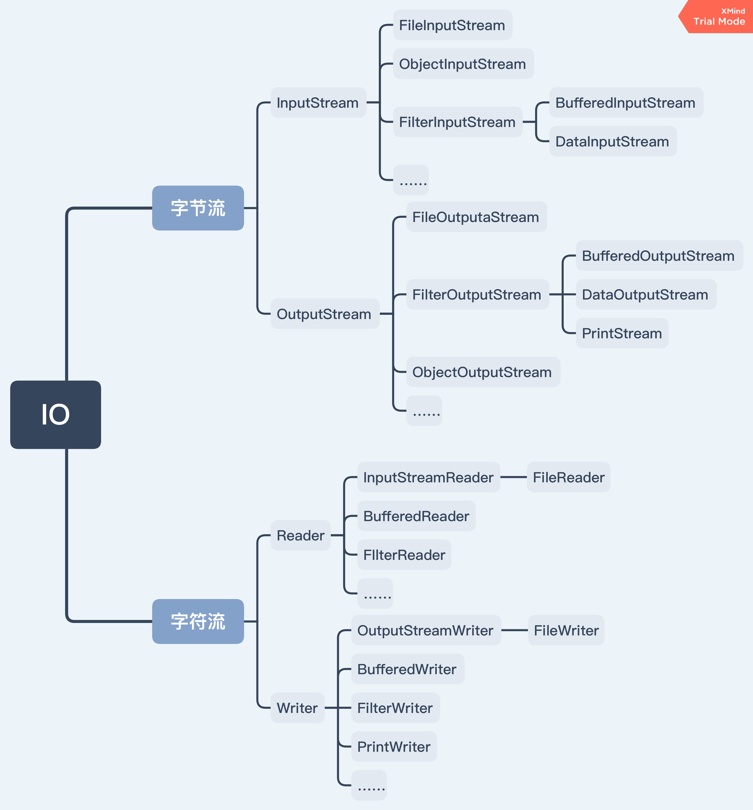

# IO

指Input/Output，即输入java内存和输出到外部：

Input指从外部读入数据到内存

Output指把数据从内存输出到外部

主要可分为字节流和字符流：



## 一、字节流

顾名思义以字节**Byte**为单位，主要有两种：

- InputStream

抽象类，所有输入字节流实现继承自它，**只能读不能写**

- OutputStream

抽象类，所有输出字节流实现继承自它，**只能写不能读**

**注意**：写输入流会导致流关闭，同理读输出流也会导致关闭


### 常用字节流

### 文件数据流(FileOutputStream & FileInputStream)

### 2. 过滤器数据流

它的实现采用了 装饰设计模式（包装模式），有兴趣的话可以搜索看下，还是挺实用的。

顾名思义，过滤器。 就是给 数据流 后面加个过滤器，然后再通过 过滤器 进行 输入/输出 操作。过滤器会在中间起到特殊处理作用。

### 2.1 缓冲区数据流（BufferedInputStream & BufferedOutputStream）

### 2.2 数据数据流

这个数据流，并非像前面的一样，只能处理字节或字节数组。它允许通过数据流读写各种 Java 基本类型。

创建方式也是经典 装饰设计模式。

```
DataInputStream dis = new DataInputStream(InputStream is);

DataOutputStream dos = new DataOutputStream(OutputStream is);
```


## 二、字符流

与字节流（byte为单位）的区别在于，字符流以**char**类型为单位

主要也是两种：Reader和Writer

| InputStream & OutputStream          | Reader & Writer                       |
| :---------------------------------- | :------------------------------------ |
| 字节流，以`byte`为单位              | 字符流，以`char`为单位                |
| 读取字节（-1，0~255）：`int read()` | 读取字符（-1，0~65535）：`int read()` |
| 读到字节数组：`int read(byte[] b)`  | 读到字符数组：`int read(char[] c)`    |

### 常用字符流

# 序列化

## 序列化和反序列化

- 对象序列化，将对象以二进制的形式保存在硬盘上
- 反序列化；将二进制的文件转化为对象读取
- 实现serializable接口，不想让字段放在硬盘上就加**transient**

序列化和反序列化需要遵循相同的协议，如阿里的 fastjson，谷歌的 ProtocolBuf，JDK 原生的序列化等

手写序列化，利用jdk实现

```java
public class DefaultMessageProtocol implements MessageProtocol {
    @Override
    public RpcRequest unmarshallingReqMessage(byte[] data) throws Exception {
        ObjectInputStream in = new ObjectInputStream(new ByteArrayInputStream(data));
        return (RpcRequest) in.readObject();
    }

    @Override
    public byte[] marshallingRespMessage(RpcResponse response) throws Exception {
        return serialize(response);
    }
  
   private byte[] serialize(Object obj) throws Exception {
        ByteArrayOutputStream baos = new ByteArrayOutputStream();
        ObjectOutputStream out = new ObjectOutputStream(baos);
        out.writeObject(obj);
        return baos.toByteArray();
    }
}
```


## serialVersionUID

如果用户没有自己声明一个serialVersionUID,接口会默认生成一个serialVersionUID
但是强烈建议用户自定义一个serialVersionUID,因为默认的serialVersinUID对于class的细节非常敏感，反序列化时可能会导致InvalidClassException这个异常。
（比如说先进行序列化，然后在反序列化之前修改了类，那么就会报错。因为修改了类，对应的SerialversionUID也变化了，而序列化和反序列化就是通过对比其SerialversionUID来进行的，一旦SerialversionUID不匹配，反序列化就无法成功。


# JDBC

## 基本使用

Connection代表一个JDBC连接，它相当于Java程序到数据库的连接（通常是TCP连接）。打开一个Connection时，需要准备URL、用户名和口令，才能成功连接到数据库。

依赖，引入JDBC驱动：

```xml
<dependency>
    <groupId>mysql</groupId>
    <artifactId>mysql-connector-java</artifactId>
    <version>5.1.47</version>
    <scope>runtime</scope>
</dependency>
```

代码：

```java
// JDBC连接的URL, 不同数据库有不同的格式:
// 参数分别为：使用uniCode编码、编码格式为utf8、不使用SSL加密
String JDBC_URL = "jdbc:mysql://localhost:3306/cmp_corp?useUnicode=true&characterEncoding=UTF-8&useSSL=false";
String JDBC_USER = "root";
String JDBC_PASSWORD = "password";
// 使用try (resource)语法，自动关闭
// 1. 建立连接
try (Connection conn = DriverManager.getConnection(JDBC_URL, JDBC_USER, JDBC_PASSWORD)) {
    // 2. 创建Statement
    try (Statement stmt = conn.createStatement()) {
        // 3. 执行SQL，并用ResultSet接收结果
        try (ResultSet rs = stmt.executeQuery("SELECT id, grade, name, gender FROM students WHERE gender=1")) {
            while (rs.next()) {
                long id = rs.getLong(1); // 注意：查询结果的索引从1开始
                long grade = rs.getLong(2);
                String name = rs.getString(3);
                int gender = rs.getInt(4);
            }
        }
    }
}
```

## 防止SQL注入

正常的SQL：

```sql
SELECT * FROM user WHERE login='bob' AND pass='1234'
```

用户可能通过精心构造的字符串，拼出意想不到的SQL，如传入name = `"bob' OR pass="`, pass = `" OR pass='"`：

```sql
SELECT * FROM user WHERE login='bob' OR pass=' AND pass=' OR pass=''
```

**解决**

本质上，只要将引号`'`转义，就能防止拼接。

JDBC提供了`PreparedStatement`，替换上面使用的`Statement`：

```java
try (Connection conn = DriverManager.getConnection(JDBC_URL, JDBC_USER, JDBC_PASSWORD)) {
    // SQL用'?'占位
    try (PreparedStatement ps = conn.prepareStatement("SELECT id, grade, name, gender FROM students WHERE gender=? AND grade=?")) {
        ps.setObject(1, "M"); // 填充占位符。注意：索引从1开始
        ps.setObject(2, 3);
        try (ResultSet rs = ps.executeQuery()) {
            while (rs.next()) {
                long id = rs.getLong("id");
                long grade = rs.getLong("grade");
                String name = rs.getString("name");
                String gender = rs.getString("gender");
            }
        }
    }
}
```

## 连接池

JDBC连接池有一个标准的接口`javax.sql.DataSource`，但只是接口，没有实现。常用的JDBC连接池有：HikariCP、C3P0、BoneCP、Druid等。最常用的是HikariCP

依赖：

```xml
<dependency>
    <groupId>com.zaxxer</groupId>
    <artifactId>HikariCP</artifactId>
    <version>2.7.1</version>
</dependency>
```

代码：

```java
// 设置连接池配置
HikariConfig config = new HikariConfig();
config.setJdbcUrl("jdbc:mysql://localhost:3306/test");
config.setUsername("root");
config.setPassword("password");
config.addDataSourceProperty("connectionTimeout", "1000"); // 连接超时：1秒
config.addDataSourceProperty("idleTimeout", "60000"); // 空闲超时：60秒
config.addDataSourceProperty("maximumPoolSize", "10"); // 最大连接数：10
// 使用配置创建连接池
DataSource ds = new HikariDataSource(config);
// 获取连接，由前面的DriverManage.getConnection()，改为从连接池获取连接
try (Connection conn = ds.getConnection()) { 
    ...
}
```

连接池内部维护了若干个`Connection`实例，如果调用`ds.getConnection()`，就选择一个**空闲连接**，并标记它为“正在使用”然后返回。

调用`conn.close()`时（try-with-resource语句隐式执行），不是真正“关闭”连接，而是释放到连接池中，以便下次获取连接时能直接返回。

配置参数：维护的最小、最大活动连接数，指定一个连接在空闲一段时间后自动关闭等。


# JVM

意义：从软件层面屏蔽不同操作系统在底层硬件与指令上的区别。（一次编译，处处运行，而没有虚拟机的语言，如c++，在win和linux上执行要编译为不同的程序

## JVM模型

这段代码运行时的jvm模型如下图

```java
public class Math {
    public static final int initDate = 666;
    public User user = new User();

    public Math() {
    }

    public int compute() {
        int a = 1;
        int b = 2;
        int c = (a + b) * 3;
        return c;
    }

    public static void main(String[] args) {	// 主函数调用compute
        Math math = new Math();
        math.compute();
    }
}
```


### 线程私有区域

图中蓝色区域（栈、本地方法栈、程序计数器）。

例如，执行main方法的主线程会在内存中开启一片区域，存放其私有的程序计数器、虚拟机栈、本地方法栈等，如图左边所示，框住只是为了说明其逻辑上的关系，物理上并不在一起。

1. 虚拟机栈 VM Stack

   又称栈 or 线程栈。创建一个线程就在虚拟机栈中分配一块私有的栈，每个线程中的方法**调用**又会在本栈中创建一个**栈帧**。存储局部变量、对象指针、操作数栈、动态链接、方法出口。

   - 局部变量表： 存放着方法中的局部变量，包括基本类型和引用类型。在编译期间就已确定空间大小，运行期间大小不变。

   - 操作数栈：用来操作方法中的数的一个临时栈

   - 动态链接： 把符号引用（字面量，例如方法名）转换为直接引用（指针，指向真实地址）存在内存空间中

   - 方法出口：记录该方法调用完毕应该回到的地方 (放到我们这个例子中就是回到Main函数的下一行)

   栈由多个栈帧组成，栈帧具有栈数据结构FIFO的特性，栈顶存放**当前执行方法**的栈帧，下一层调用上一层。

   JVM为这个区域规定了两种异常状况：

   - StackOverflowError：线程请求的栈深度大于虚拟机所允许的深度时抛出；
   - OutOfMemoryError：虚拟机栈无法申请到足够的内存时抛出。

2. 本地方法栈Native Method Stack

   为JVM使用的Native方法（C、C++代码）提供运行空间。功能上与虚拟机栈是类似。

   该区域JVM也规定了StackOverflowError和OutOfMemoryError异常。

3. 程序计数器 Program Counter Register

   当前线程所执行的**字节码的行号**指示器，指向下一条要执行的命令。方法执行完返回时必须要用到。

   该区域没有规定任何异常。

### 线程共享区域

图中黄色区域（堆、方法区），虽然逻辑上分区，但**物理上是连续的区域**。

1. 堆 Heap

   存储所有对象实例。JVM的垃圾回收主要发生在该区域。（与栈具有数据结构FIFO特性不同，jvm的堆和数据结构的堆没有关系）

   从结构上，堆被划分为新生代和老年代；而新生代又分为Eden区、To Survivor区（s0）、From Survivor区（s1），大小比例为8:1:1。

   当堆中没有内存可供完成实例分配，且堆也无法再扩展时，将会抛出OutOfMemoryError异常。

2. 方法区 Method Area

   存储类的静态信息（.class）、常量、静态变量（指针，指向堆）、即时编译器（JIT）编译产生的代码

   由于HotSpot虚拟机将GC算法拓展到了该区域，因此方法区有时也被称为**永久代**，1.8之后改称元空间metaspace。

   当方法区无法满足内存分配需求时，将抛出OutOfMemoryError异常。

   **运行时常量池**

   是方法区的一部分。Class 文件中的常量池（编译器生成的字面量和符号引用）会在类加载后被放入这个区域。

   除了在编译期生成的常量，还允许动态生成，例如 String 类的 intern()。

**直接内存**

JDK 1.4 中新引入了 NIO 类，它可以使用 Native 函数库直接分配**堆外内存**，然后通过 Java 堆里的 DirectByteBuffer 对象作为这块内存的引用进行操作。这样能在一些场景中显著提高性能，因为避免了在堆内存和堆外内存来回拷贝数据。

## JVM版本的更新

jdk1.7版本中，将字符串常量池从方法区移动到了堆中，避免方法区内存有限从而出现OOM错误。而jdk1.8版本则将方法区从运行时内存移动到了本地内存中，方法区不再与堆相连。


## Java类加载机制

### 什么是类加载

类是在运行期间第一次使用时动态加载的，而不是一次性加载所有类。

JVM将类的`.class `文件中的二进制数据读入到内存中，将其放在**方法区**内，然后在**堆区**创建一个 `java.lang.Class`对象。 `Class`对象封装了类在方法区内的数据结构，并提供访问方法区内的数据结构的接口。

### 类加载的时机

类加载的时机：JVM规范允许类加载器在预料某个类将要被使用时就预先加载它，不需要等到某个类被“首次主动使用”时再加载。如果在预先加载的过程中遇到了` .class `文件缺失或存在错误，类加载器必须在程序首次主动使用该类时才报告错误（LinkageError错误）如果这个类一直没有被程序主动使用，那么类加载器就不会报告错误。

### 类加载的过程

类加载包括3个阶段：加载（Load）、链接（Link）、初始化（Init），其中**链接**又分为3个具体步骤（验证、准备、解析）。

1. 加载

   查找并加载类的二进制数据。

   - 通过一个类的全限定名来获取其定义的二进制字节流。
   - 将这个字节流所代表的静态存储结构转化为方法区的运行时数据结构。
   - 在Java堆中生成一个代表这个类的 `java.lang.Class`对象，作为对方法区中这些数据的访问入口。

   可以使用系统提供的类加载器或自定义自己的类加载器来完成加载。

2. 验证

   确保被加载的类的正确性，确保` .Class `文件的字节流中包含的信息符合当前虚拟机的要求，并且不会危害虚拟机自身的安全。

   - 文件格式验证：验证字节流是否符合Class文件格式的规范；
   - 元数据验证：对字节码描述的信息进行语义分析以保证其描述的信息符合Java语言规范的要求；
   - 字节码验证：通过数据流和控制流分析，确定程序语义是合法的、符合逻辑的；
   - 符号引用验证：确保解析动作能正确执行。

   验证阶段非常重要但不是必须的，它对程序运行期没有影响。如果所引用的类经过反复验证，可以考虑采用 `-Xverifynone`参数来关闭大部分的类验证措施，以缩短虚拟机类加载的时间。

3. 准备

   为类的静态变量（static）分配内存，并将其初始化为**默认值**。这些内存都在**方法区**中分配。

   - 该阶段进行内存分配的仅包括static变量，不包括实例变量，实例变量会在对象实例化时随着对象分配在Java堆中；

   - 如果只是静态变量static，则初始化为默认值（int是0），而不是代码中的显式赋值；

     ```java
     public static int value = 123;
     ```

   - 如果是常量（final），那就会被初始化为指定的值。

     ```java
     public static final int value = 123;
     ```

4. 解析

   把类中的符号引用转换为直接引用。

   符号引用就是一组符号来描述目标，可以是任何字面量。

   直接引用就是直接指向目标的指针、相对偏移量或一个间接定位到目标的句柄。

5. 初始化

   为类的静态变量赋予正确的初始值。步骤如下：

   - 假如该类还没有被加载和链接，则程序先加载并连接该类；

   - 假如该类的直接父类还没有被初始化，则先初始化其直接父类；

   - 假如类中有初始化语句，则系统依次执行这些初始化语句。

### 类初始化的时机

1. 主动引用

   jvm规范并未强制要求何时加载，但规定了只有当对类进行**主动引用**时必须对类初始化。类的主动引用包括六种情况：

   - 创建类的实例（new）；
   - 访问某个类或接口的静态变量，或者对该静态变量赋值；
   - 调用类的静态方法；
   - 反射：使用 java.lang.reflect 包的方法对类进行反射调用
   - 初始化某个类，则其父类也会被初始化；
   - Java虚拟机启动时被标明为启动类的类（ `JavaTest`），直接使用 `java.exe`命令来运行某个主类。

2. 被动引用

   除主动引用的场景外，其余均为被动引用，不会触发初始化。被动引用主要有三种情况

   - 通过子类引用父类的静态字段，不会导致子类初始化。

   ```java
   System.out.println(SubClass.value);  // value 字段在 SuperClass 中定义
   ```

   - 通过**数组**定义来引用类，不会触发此类的初始化。

     该过程会对数组类进行初始化，**数组类**是一个由虚拟机自动生成的、直接继承自 Object 的子类，其中包含了数组的属性和方法。

   ```java
   SuperClass[] sca = new SuperClass[10];
   ```

   - **常量**在编译阶段会存入调用类的常量池中，本质上并没有直接引用到定义常量的类，因此不会触发定义常量的类的初始化。

   ```java
   System.out.println(ConstClass.HELLOWORLD);
   ```

### 类与类加载器

两个类相等，需要类本身相等，并且使用**同一个类加载器**进行加载。这是因为每一个类加载器都拥有一个独立的类名称空间。

这里的相等，包括类的 Class 对象的

-  equals() 方法
-  isAssignableFrom() 方法
-  isInstance() 方法
-  instanceof 关键字

的返回结果为 true

### 类加载器

类加载器包括：

- Bootstrap ClassLoader 启动类加载器
- ExtClassLoader 扩展类加载器
- AppClassLoader 应用类加载器
- User ClassLoader 自定义类加载器

从JVM的角度而言，类加载器只分为两种：启动类加载器和其他类加载器。启动类加载器由C++实现，是JVM的一部分（Hotspot虚拟机），其他所有类加载器都由Java实现，独立于虚拟机之外，继承自抽象类` java.lang.ClassLoader `，需要由启动类加载器加载到内存后才能去加载其他类。

具体地：

启动类加载器负责加载存放在 `\jre\lib`下的类库（如所有的java.开头的类）。启动类加载器无法被Java程序直接引用。

扩展类加载器负责加载 `\jre\lib\ext`目录中的所有类库（如javax.开头的类）。开发者可以直接使用扩展类加载器。

应用程序类加载器负责加载用户类路径（ClassPath）所指定的类，开发者可以直接使用该类加载器。如果应用程序中没有自定义类加载器，一般情况下这就是程序中默认的类加载器。

#### JVM类加载机制

- **全盘负责**，当一个类加载器负责加载某个Class时，该Class所依赖的和引用的其他Class也将由该类加载器负责载入，除非显示使用另外一个类加载器来载入；
- **父类委托**，先让父类加载器试图加载该类，只有在父类加载器无法加载该类时才尝试从自己的类路径中加载该类；
- **缓存机制**，缓存机制保证所有加载过的Class都会被缓存，当程序中需要使用某个Class时，类加载器先从缓存区寻找该Class，只有缓存区不存在，系统才会读取该类对应的二进制数据，并将其转换成Class对象，存入缓存区。当修改了Class后，必须重启JVM，程序的修改才会生效。

#### 类加载的方式

- 启动应用时候由JVM初始化加载
- 通过Class.forName()方法动态加载
- 通过ClassLoader.loadClass()方法动态加载

#### Q：Class.forName()和ClassLoader.loadClass()的区别？

- `Class.forName()`除了将类的.class文件加载到jvm中之外，还会对类进行解释，执行类中的static块；
- `ClassLoader.loadClass()`只将.class文件加载到jvm中，不会执行static中的内容，只有在newInstance()创建实例时才会去执行static块。
- `Class.forName(name,initialize,loader)`通过传入参数也可控制是否加载static块。

#### 双亲委派机制

如果一个类加载器收到了类加载的请求，它首先不会自己去尝试加载这个类，而是**把请求委托给父加载器**去完成，依次向上，因此，所有的类加载请求最终都应该被传递到顶层的启动类加载器中，只有当父加载器在它的搜索范围中没有找到所需的类时，即无法完成该加载时，子加载器才会尝试自己去加载该类。

每个类加载器对他加载过的类有缓存

向上委托查找，向下委托加载

**双亲委派模型（Parents Delegation Model）**

该模型要求除了顶层的启动类加载器外，其它的类加载器都要有自己的父类加载器。这里的父子关系一般通过**组合**关系（Composition）来实现，而不是继承关系（Inheritance）。


双亲委派机制意义：

- 防止内存中出现多份同样的字节码；
- 保证Java程序安全稳定运行。如，即使重写` java.lang.System `类，在类加载的过程中，启动类加载器还是会加载Java提供的System类，避免System类遭到恶意修改。

## Java反射

通常情况下，Java中使用某个类时，需要先知道它是什么类，对外暴露了哪些方法，然后创建类的实例，之后通过类的对象进行操作。

所谓反射，就是java运行时并不知道要初始化的类是什么，而是通过类的全限定名，调用class.forName()方法获取类，然后再通过类对象的getMethod()方法获取要调用的方法的对象，再通过类的getConstructor()方法获取类的构造器，最后通过Constructor的getInstance()方法创建类的实例，并通过方法对象的invoke()方法调用真正想要使用的方法。

总之，反射就是在**运行时**才知道要操作的类是什么，并且可以在运行时获取类的完整构造，并调用对应的方法。

Java反射的基本流程大致如下：

```java
Class clz = Class.forName("com.xxx.xxx");
Method method = clz.getMethod("methodName", int.class);
Constructor constructor = clz.getConstructor();
Object object = constructor.newInstance();
method.invoke(object, 1);
```

## Q：静态代码块、构造代码块、构造函数以及Java类初始化顺序？

创建对象时执行顺序：**静态块——main()——构造块——构造方法**。

1. 静态代码块：类中以static开头的`{}`代码块

   - 类加载阶段执行，因此**只执行一次**，且在main函数之前

   - 一个类中可以有多个静态代码块，jvm将其拼接后一次执行

   - 无法访问非静态变量（因为此时尚未创建）

   - 静态块中的变量，外部无法访问（局部）

     ```java
     public class Test{
         static int cnt = 6;
         int a = 1;
         // 1. 静态块1，先于主函数执行
         static {
             cnt += 9;
             a += 1;  // 报错，a是非静态变量
             int b = 1;
         }
         // 3. 最后执行
         public static void main(String[] args) {
             System.out.println(cnt);
         }
         // 2. 静态块2，先于主函数执行，但在静态块1之后
         static {
            cnt /= 3;
            b += 1; // 报错，b是上一个静态块的局部变量
         }
     }  // 最终输出：5
     ```

     

2. 构造代码块：类中的花括号`{}`代码块

   对象创建时调用，即new时，因此可能多次执行（静态块只一次）

   可以访问静态变量和非静态变量

   构造块中 的变量，外部也无法访问（局部）

   

   ```java
   public class HelloA {
       public HelloA(){	System.out.println("A的构造函数");  }  //构造函数
       {	//构造代码块
           System.out.println("A的构造代码块");
       }
       static {	//静态代码块
           System.out.println("A的静态代码块");
       }
   }
   public class HelloB extends HelloA{
       public HelloB(){  System.out.println("B的构造函数");  }   //构造函数
       {  //构造代码块
           System.out.println("B的构造代码块");
       }
       static {  //静态代码块
           System.out.println("B的静态代码块");
       }
       public static void main(String[] args) {// 测试
           System.out.println("main");
           HelloB b = new HelloB();
       }
   }
   // 输出：
   A的静态代码块
   B的静态代码块
   main
   A的构造代码块
   A的构造函数
   B的构造代码块
   B的构造函数
   // 如果new两个B，只会多输出main后面的内容一次，因为静态代码块在程序中只执行一次。
   ```
   
   

## 垃圾回收（GC）

就是将没有引用的对象回收，主要是针对堆和方法区进行，这些区域是**线程共享**的。

程序计数器、虚拟机栈和本地方法栈这三个区域属于**线程私有**的，只存在于线程的生命周期内，线程结束之后就会消失，因此不需要回收。


新生代与老年代是1：3；

新生代包括eden区、s0和s1（Survivor缩写），大小比例是8：1：1。

### Minor GC 和 Full GC

HotSpot虚拟机中的GC可分为两种：Partial GC和Full GC。

- YGC（Young GC，或minor GC）：对新生代堆gc，在eden区（也包含某个s0/s1）满时发生。使用**拷贝算法**，频率较高，性能耗费小

- FGC（Full GC，或Major GC）：全堆（新生代+老年代）范围gc，在老年代满时发生。使用**标记压缩**算法，比YGC慢。需要两类垃圾收集器结合使用。

  FGC触发时机：

  1. 手动调用System.gc
  2. 在Minor GC之后，若JVM判断老年代的连续内存空间已少于先前每次Minor GC结束后晋升至老年代的对象总大小的平均值，则JVM会进行Full GC（具体的判断逻辑随着收集器不同有所区别）；
  3. 方法区（永久代）的空间不足时。

  

### 堆对象生命周期

1. 新建对象，默认先放入eden区，此时年龄为0。

   - eden区放满，触发YGC，还存活的对象放入s0，且年龄+1。

   - eden区放不下（大对象，如长字符串或数组），直接放老年代。

     `-XX:PretenureSizeThreshold`，大于此值的对象直接放老年代

2. 下一次YGC，扫描并回收eden + s0，还存活的对象放s1，且年龄+1

   也就是每次YGC，存活的交替放入s0或s1

3. 当**年龄足够**时（一般15，CMS是6），放入老年代

   若YGC的存活对象s区装不下，不管年龄多少，**多余的**直接放入老年代。见下文年龄动态判断

   -XX:MaxTenuringThreshold 用来定义年龄的阈值

4. 当老年代放满，触发FGC

#### 对象年龄动态判断机制

当单个 Survivor 区占用超过 50% (`-XX:TargetSurvivorRatio`)，则年龄最老的，即使没到15，也直接放入老年代。例如50%的对象最大年龄为8，则年龄>8的放入老年代。


#### Q：JVM如何判断对象存活？

1. 引用计数法

   为每个对象设置一个引用计数器，每当有引用时，计数器+1，引用失效时计数器-1。当对象引用为0时，判断对象失效。

   优点：实现简单，效率高；缺点：难以解决垃圾对象间循环引用，但实际上已经无法寻址的情况。

2. 根可达分析法

   从**GC Roots**出发，与之直接或间接关联的对象就是有效对象，反之就是无效对象。

   可作为GC Roots的对象包括：

   - 虚拟机栈中引用的对象（局部变量）
   - 方法区中类静态属性引用的对象（静态变量）
   - 方法区中常量引用的对象（常量）
   - 本地方法栈中JNI引用的对象（JNI指针）

#### Q：Minor GC如何避免全堆扫描？

由于**老年代的对象可能引用新生代的对象**，在标记存活对象的时候，需要扫描老年代的对象，如果该对象拥有对新生代对象的引用，那么这个引用也会被作为 GC Roots。这相当于就做了**全堆扫描**。

HotSpot虚拟机通过**卡表**技术避免Minor GC触发全堆扫描。具体策略是将老年代的空间分成大小为 512B的若干张卡，并且维护一个卡表。卡表本身是字节数组，数组中的每个元素对应着一张卡，本质上就是维护一个标识位，这个标识位代表对应的卡是否可能存有指向新生代对象的引用，如果可能存在，那么这张卡就是所谓的**脏卡**。

在进行Minor GC的时候，只需要在卡表中寻找脏卡，并将脏卡中的老年代指向新生代的引用加入到GC Roots中，当完成所有脏卡的扫描之后，将所有脏卡的标识位清零。

#### Java中引用的类型

JDK1.2之后，Java中存在4种引用类型，从强到弱包括：强、软、弱、虚。


1. 强引用 Strong Reference

  Java中的**默认引用**声明就是强引用，如new instance语句和显式赋值语句等。只要强引用存在，垃圾回收器永远不会回收被引用的对象，即使内存不足时，JVM也会直接抛出OutOfMemoryError，而不会回收对象。

  将引用赋值为null，则中断强引用。

2. 软引用 Soft Reference

  用于描述一些非必需但有用的对象，可通过` java.lang.ref.SoftReference `来使用软引用，如：

  ```java
  SoftReference<Object> obj = new SoftReference<>();
  ```

  在内存足够的时候，软引用对象不会被回收；内存不足时，JVM则会回收软引用对象。如果回收了软引用对象之后仍然没有足够的内存，JVM才会抛出OutOfMemoryError。

  软引用的特性可以很好地解决OOM问题，适用于很多缓存场景，如网页缓存、图片缓存等。

3. 弱引用 Weak Reference

  弱引用的强度比软引用要更弱，无论内存是否足够，只要 JVM 开始进行垃圾回收，那被弱引用关联的对象都会被回收。可通过` java.lang.ref.WeakReference ` 来使用弱引用，如：

  ```java
  WeakReference<Object> obj = new WeakReference<>();
  ```

4. 虚引用 Phantom Reference

  最弱的引用类型，如果一个对象仅持有虚引用，那么它等同于没有持有任何引用。

  ```java
  PhantomReference<Object> obj = new PhantomReference<>();
  ```

  无法通过虚引用获得对象。虚引用必须与**引用队列**配合使用。虚引用的实际应用场景为当对象被回收时，收到系统通知。

  > **引用队列**
  >
  > 可以与软引用、弱引用以及虚引用一起配合使用，当垃圾回收器准备回收一个对象时，如果发现它还有引用，那么就会在回收对象之前，把这个引用加入到与之关联的引用队列中去。程序可以通过判断引用队列中是否已经加入了引用，来判断被引用的对象是否将要被垃圾回收，这样就可以在对象被回收之前采取一些必要的措施。  

#### finalize方法

是Object的protected方法。当某个对象被jvm垃圾回收的时候，finalize()将被自动调用。但是jvm不保证finalize()一定被调用

默认为空实现，自定义某个类M的finalize()需要重写

```java
public class M {
    @Override
    protected void finalize () throws  Throwable {
        System.out.println("finalize");
    }
}
```


#### 被标记为失效的对象是否一定会被回收？

被标记为失效的对象被回收前会经历如下步骤：

1. JVM判断对象是否重写了finalize()方法：

   - 若重写了finalize()，则将其放入F-Queue队列中；
   - 若未重写，则直接回收。

2. 执行队列中的finalize()方法：

   JVM自动创建一个优先级较低的线程执行队列中的finalize()方法，只负责触发，不保证执行完毕。若finalize()方法执行了耗时操作，则JVM会停止执行方法并立刻回收对象。

3. 对象销毁/重生：

   若finalize()方法中将this赋值给了某个引用，则该对象会重生，否则会被回收。

#### Q：为什么年龄达15时放入老年代？

因为对象markword中的分代年龄用4bit表示，最大15

对象内存布局


markword结构（64位系统中是8B=64bit）


### 主流垃圾收集器


实线连接表示配合使用

发展路线：内存越来越大，**STW**时间越来越短。从分代到不分代。

|                   | 管理内存 | STW时间 |
| ----------------- | -------- | ------- |
| Serial            | 几十M    |         |
| Parallel Scavenge | 几个G    |         |
| CMS               | 几十G    | 200ms   |
| G1                | 上百G    | 10ms    |
| ZGC               | 4TB      | 1ms     |


#### Q：为什么要STW机制？

如果不暂停线程，让其继续执行，会破坏GC Root的依赖关系，导致某些对象被回收，增加gc的复杂性。

**STW**

stop the world的简写，停止所有用户线程，所有线程进入**SafePoint**等待。

**Safepoint** 

可以理解成是在**代码执行过程中的一些特殊位置**，当线程执行到这些位置的时候，**线程可以暂停**。

在 SafePoint 保存了其他位置没有的**一些当前线程的运行信息，供其他线程读取**。这些信息包括：线程上下文的任何信息，例如对象或者非对象的内部指针等等。信息的使用场景：

1. 当需要 GC 时，需要知道哪些对象还被使用，或者已经不被使用可以回收了，这样就需要每个线程的对象使用情况。
2. 对于偏向锁（Biased Lock），在高并发时想要解除偏置，需要线程状态还有获取锁的线程的精确信息。
3. 对方法进行即时编译优化（OSR栈上替换），或者反优化（bailout栈上反优化），这需要线程究竟运行到方法的哪里的信息。

线程只有运行到了 SafePoint 的位置，他的**一切状态信息才是确定的**

**Safepoint 如何实现**

SafePoint 可以插入到代码的某些位置，每个线程运行到 SafePoint 代码时，主动去检查是否需要进入 SafePoint，称为 **Polling**

理论上，可以在每条 Java 编译后的字节码的边界，都放一个检查 Safepoint 的机器命令。线程执行到这里的时候，会执行 **Polling** 询问 JVM 是否需要进入 SafePoint，这个询问是会有性能损耗的，所以 JIT 会优化尽量减少 SafePoint。

经过 **JIT 编译优化**的代码，会在下列放置一个 SafePoint：

1. 所有方法的返回之前

2. 所有非counted loop的循环（即：无界循环）回跳之前（即循环体末尾）

   **注意**：对于明确有界的int循环，不会放置 SafePoint，如：

   ```java
   for (int i = 0; i < 100000000; i++) {
       ...
   }
   ```

   但是int换成**long**就还是会放置 SafePoint

目的：防止发生 GC 需要 Stop the world 时，该线程一直不能暂停

**STW时线程状态的变化**

当线程处于下列5种状态：

1. 运行字节码

   运行字节码时，解释器会看线程是否被标记为 **poll armed**，如果是，VM 线程调用 `SafepointSynchronize::block(JavaThread *thread)`进行 block。

2. 运行 native 代码

   当运行 native 代码时，VM 线程略过这个线程，但是给这个线程设置 **poll armed**，让它在执行完 native 代码之后，它会检查是否 poll armed，如果还需要停在 SafePoint，则直接 block。

3. 运行 JIT 编译好的代码

   由于运行的是编译好的机器码，直接查看本地 local polling page 是否为脏，如果为脏则需要 block。这个特性是在 Java 10 引入的 [JEP 312: Thread-Local Handshakes](https://openjdk.java.net/jeps/312) 之后，才是只用检查本地 local polling page 是否为脏就可以了。

4. 处于 BLOCK 状态

   在需要所有线程需要进入 SafePoint 的操作完成之前，不许离开 BLOCK 状态

5. 处于线程切换状态或者处于 VM 运行状态

   会一直轮询线程状态直到线程处于阻塞状态（线程肯定会变成上面说的那四种状态，变成哪个都会 block 住）。

#### 垃圾回收算法

1. 标记清除：缺点是不连续。只有CMS使用

   

2. 拷贝算法：优点是无碎片，缺点是浪费空间

   

3. 标记整理（标记压缩）：优点是无碎片，缺点是时间长

   

   回收器主要使用2和3

#### 年轻代垃圾收集器

1. Serial 串行垃圾回收器：串行回收，STW

   

2. ParNew 并行垃圾回收器：可以理解为Serial回收器的多线程版，STW时多个线程并行回收。

   默认开启的线程数与CPU数量相同，在CPU核数很多的机器上，可以通过参数`-XX:ParallelGCThreads`来设置线程

   

3. Parallel Scavenge（ParallelGC）

#### 老年代垃圾收集器

1. SerialOld：可理解为Serial回收器的老年代版本，同样是一个单线程回收器，使用的是**标记整理**算法。其作用主要有：

   - 在JDK1.5及之前的版本中与Parallel Scavenge收集器搭配使用；
   - 作为CMS收集器的后备预案，如果CMS出现Concurrent Mode Failure，则SerialOld将作为后备收集器进行垃圾回收；
   - JVM使用的实际上是基于SerialOld改进的PS MarkSweep收集器。

2. ParallelOld：类似新生代的Parallel Scavenge，也是一种多线程的回收器，关注的重点同样在于吞吐量。使用了标记-整理算法进行垃圾回收。

3. CMS：

   CMS即Concurrent Mark Sweep，并发标记清除，使用的是**标记清除**算法，主要关注系统停顿时间。

   共有四个阶段：

   初始标记：STW，但是非常短

   并发标记：用户线程与gc线程**并发执行**（最耗时，因此才用并发，不会产生长时间STW）

   重新标记：STW，因为上一个阶段可能会存在标记失误（从线程角度理解），需要再次标记保证正确性  

   并发清理：一次性完成回收

   


#### 不分代垃圾收集器

1. G1（Garbage First，垃圾优先）：也有STW。逻辑分代，但物理不分代

   三色标记 + SATB

2. ZGC：oracle官方，java11引入，逻辑和物理都不分代

   颜色指针 + 读屏障

3. Shenandoah ：redhat开发，和ZGC差不多

4. Epsilon：啥也不干（调试用，或确认不用GC的场景）

### JVM默认回收器

- 1.7和1.8：PS+PO （Parallel Scavenge + ParallelOld）
- 1.9：G1

### 调优

减少FGC（实际上是减少STW）

## JVM命令

- 标准：-开头，所有Hotspot都支持

- 非标准：-X开头，特定版本hotspot支持特定命令

- 不稳定：-XX开头，下个版本可能取消

  -XX: +PrintCommandLineFlags 打印命令行参数值

#### 线上JVM启动参数

```shell
/usr/java/default/jre/bin/java -server -Xmx4g -Xms4g -Xmn2g -Xss256K -XX:SurvivorRatio=8 -XX:MetaspaceSize=512m -Xnoclassgc -XX:MaxTenuringThreshold=7 -XX:GCTimeRatio=19 -XX:+DisableExplicitGC -XX:+UseParNewGC -XX:+UseConcMarkSweepGC -XX:+UseCMSCompactAtFullCollection -XX:CMSFullGCsBeforeCompaction=0 -XX:+CMSParallelRemarkEnabled -XX:+CMSClassUnloadingEnabled -XX:+UseCMSInitiatingOccupancyOnly -XX:CMSInitiatingOccupancyFraction=70 -XX:SoftRefLRUPolicyMSPerMB=0 -XX:+UseFastAccessorMethods -XX:+UseCompressedOops -XX:+PrintGCDetails -XX:+PrintGCDateStamps -XX:+PrintGCTimeStamps -Xloggc:/data/logs/xxx/debug/gc.20210331_082950.log -XX:+HeapDumpOnOutOfMemoryError -XX:HeapDumpPath=/data/logs/xxx/debug/xxx.20210331_082950.dump -Dfile.encoding=UTF-8 -Djava.awt.headless=true -Djetty.logging.dir=/data/logs/xxx -Djava.io.tmp=/tmp -jar xxx.jar --spring.profiles.active=prod
```

\####

```shell
-server 服务器模式
-Xmx4g 最大堆内存4g
-Xms4g 初始堆内存4g
-Xmn2g 新生代内存大小
-Xss256K 线程栈大小
-XX:SurvivorRatio=8 eden与survivor比例
-XX:MetaspaceSize=512m 元空间大小
-XX:MaxTenuringThreshold=7 该参数主要是控制新生代需要经历多少次GC晋升到老年代中的最大阈值。
-XX:GCTimeRatio=19 吞吐量 垃圾收集时间为1/(1+19),默认值为99，即1%时间用于垃圾收集。
-XX:+UseParNewGC 使用ParNew收集器
-XX:+CMSParallelRemarkEnabled 开启并发标记
-XX:+UseConcMarkSweepGC 使用CMS收集器
-XX:+UseCMSCompactAtFullCollection 和-XX:CMSFullGCsBeforeCompaction=0配合使用 意思就是GC之后对堆内存进行压缩整理
-XX:CMSFullGCsBeforeCompaction=0 
-XX:+UseCompressedOops 开启对象压缩
-XX:+PrintGCDetails 打印gc详情
-XX:+HeapDumpOnOutOfMemoryError OOM时生成dump文件
-XX:HeapDumpPath=/data/logs/xxx/debug/xxx.20210331_082950.dump dump存放路径
```


# 日志

## SLF4j

Spring Boot默认用`SLF4J + Logback`来记录日志，并用`INFO`级别输出到控制台。

依赖（spring默认集成slf4j，如果没有再单独引入）

```xml
<dependency>
    <groupId>org.slf4j</groupId>
    <artifactId>slf4j-api</artifactId>
    <version>1.7.5</version>
</dependency>
<dependency>
    <groupId>org.slf4j</groupId>
    <artifactId>slf4j-log4j12</artifactId>
    <version>1.7.5</version>
</dependency>
```

在src/main/resources/log4j.properties配置：

```properties
# 一、配置根Logger
# 格式：log4j.rootLogger = [ level ] , appenderName1, appenderName2, ...

###
# 1. level（可选）: 设定日志记录的最低级别，从高到低分为OFF、FATAL、ERROR、WARN、INFO、DEBUG、ALL或者自定义的级别。
# Log4j建议只使用四个级别，优先级从高到低分别是ERROR、WARN、INFO、DEBUG。
# 通过在这里定义的级别，可以控制到应用程序中相应级别的日志信息的开关。
# 比如在这里定义了INFO级别，则应用程序中所有DEBUG级别的日志信息将不被打印出来。
# 2. appenderName:就是指定日志信息输出到哪个地方。您可以同时指定多个输出目的地。
### 

# 输出debug级别及以上的日志，输出到stdout、D、E三个地方
log4j.rootLogger=debug,stdout,D,E

# 二、分别配置三个输出目的地

#输出信息到控制台
log4j.appender.stdout=org.apache.log4j.ConsoleAppender
log4j.appender.stdout.Target=System.out
log4j.appender.stdout.layout=org.apache.log4j.PatternLayout
log4j.appender.stdout.layout.ConversionPattern=[%-5p] %d{yyyy-MM-dd HH:mm:ss,SSS} method:%l%n%m%n

# 输出DEBUG 级别以上的日志到=D://Environment/Java/logs/log.log
log4j.appender.D=org.apache.log4j.DailyRollingFileAppender
log4j.appender.D.File=D://Environment/Java/logs/log.log
log4j.appender.D.Append=true
log4j.appender.D.Threshold=DEBUG 
log4j.appender.D.layout=org.apache.log4j.PatternLayout
log4j.appender.D.layout.ConversionPattern=%-d{yyyy-MM-dd HH:mm:ss}  [ %t:%r ] - [ %p ]  %m%n

#输出ERROR 级别以上的日志到D://Environment/Java/logs/error.log
log4j.appender.E=org.apache.log4j.DailyRollingFileAppender
log4j.appender.E.File=D://Environment/Java/logs/error.log 
log4j.appender.E.Append=true
log4j.appender.E.Threshold=ERROR 
log4j.appender.E.layout=org.apache.log4j.PatternLayout
log4j.appender.E.layout.ConversionPattern=%-d{yyyy-MM-dd HH:mm:ss}  [ %t:%r ] - [ %p ]  %m%n
```

使用

```java
public class Query {
    private static final Logger logger = LoggerFactory.getLogger(Query.class);
    public static void main(String[] args) {
        // 四种级别日志
        logger.debug("================114511415e");
        logger.info("Start to process file: {}", entry.getKey());  // {}占位符，要传参数
        logger.warn("==============END==============");
        logger.error("解析{}异常：{}", "db-server.conf", e); // 有几个{}，就传几个参数        
}
```

## 分布式日志系统

ELK = Elasticsearch + Logstash  + Kibana

Elasticsearch：分析和搜索引擎

Logstash：服务端数据处理管道

Kibana：Elasticsearch数据可视化

由于Logstash重量级，可改用FileBeat收集日志