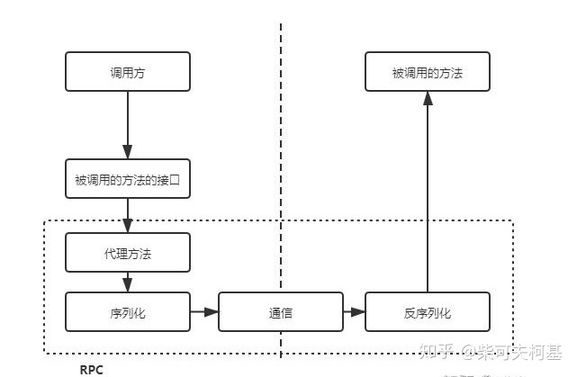
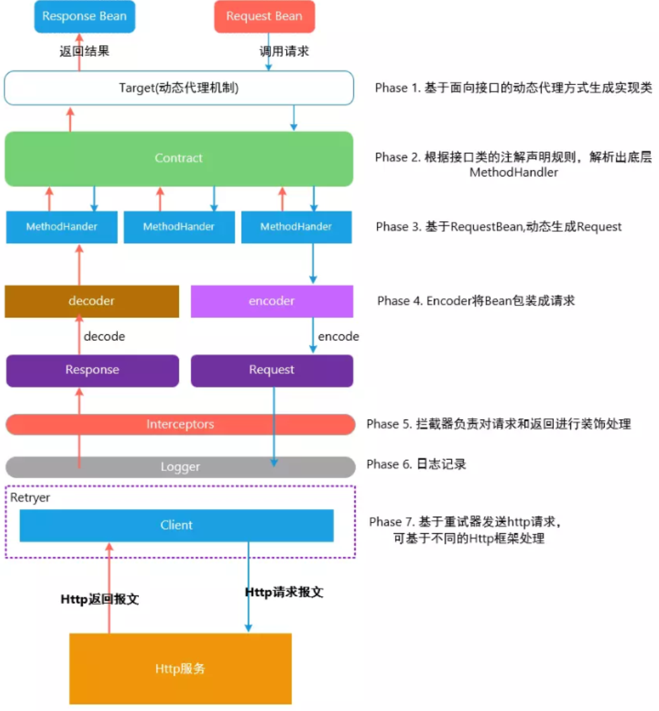

# Feign


Feign是Netflix开发的声明式、模板化的HTTP客户端。Spring Cloud openfeign对Feign进行了增强，使其支持Spring MVC注解，另外还整合了Ribbon和Eureka。

**feign的作用**：替代原有的http方式，用本地接口调用的方式完成http请求。虽然性能较低，但是增加了可读性。


feign之前JAVA 项目中如何实现接口http调用？

1. Httpclient

   是 Apache Jakarta Common 下的子项目，用来提供高效的、最新的、功能丰富的支持 Http 协议的客户端编程工具包，并且它支持 HTTP 协议最新版本和建议 相比传统 JDK 自带的URLConnection，提升了易用性和灵活性，使客户端发送 HTTP 请求变得容易，提高了开发的效率。

2. HttpURLConnection

   是 Java 的 **标准类**，它继承自 URLConnection，可用于向指定网站发送 GET 、POST 请求。HttpURLConnection 使用比较复杂，不像 HttpClient 那样容易使用。

3. Okhttp

   一个处理网络请求的开源项目，是**安卓端**最火的轻量级框架，由 Square 公司贡献，用于替代 HttpUrlConnection 和 HttpClient。OkHttp 拥有简洁的 API、高效的性能，并支持多种协议（HTTP/2 和 SPDY）。

4. RestTemplate

   是 **Spring** 提供的用于访问 Rest 服务的客户端，RestTemplate 提供了多种便捷访问远程HTTP 服务的方法，能够大大提高客户端的编写效率。  

## Q：为什么feign第一次调用耗时较长？

内置ribbon，是懒加载

## 设计架构




Feign 中默认使用 JDK 原生的 URLConnection 发送 HTTP 请求。可以集成别的组件替换URLConnection，比如 Apache HttpClient、OkHttp。
Feign发起调用真正执行逻辑：**feign.Client#execute**  

例：配置 OkHttp 依赖：

```xml
<dependency>
	<groupId>io.github.openfeign</groupId>
	<artifactId>feign‐okhttp</artifactId>
</dependency>  
```

yml：

```yaml
feign:
	#feign 使用 okhttp
	httpclient:
		enabled: false
	okhttp:
		enabled: true  
```


# Dubbo