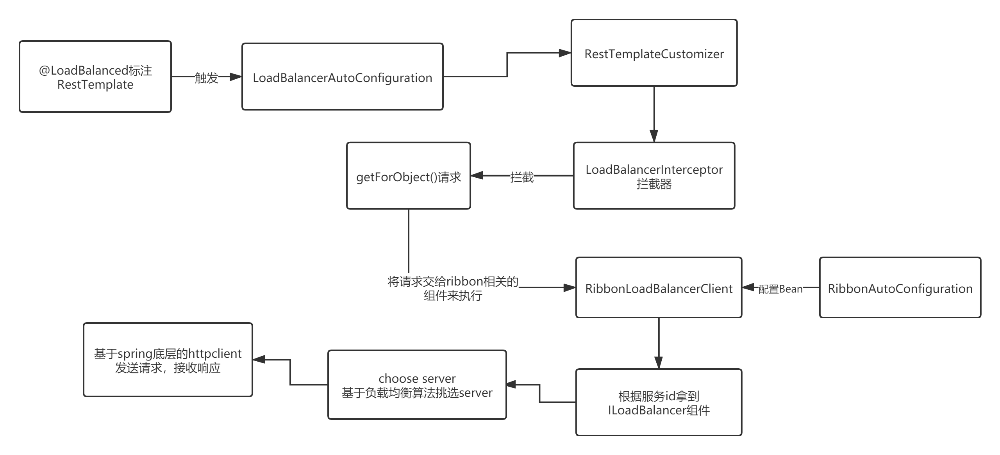
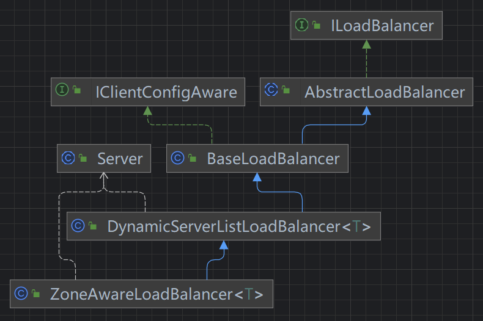
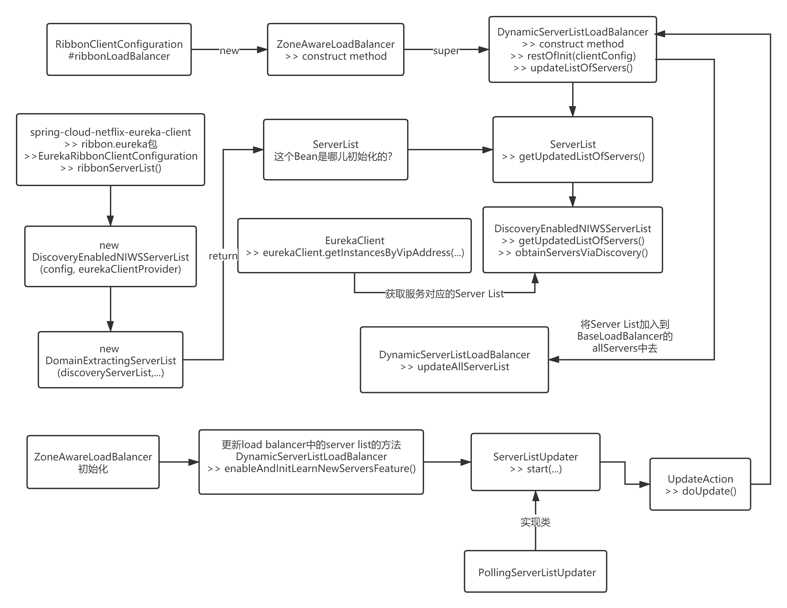

# 一、Ribbon

概述

Ribbon主要的工作：

1. 根据服务Id，也就是服务名称（被调服务），先拿到一个核心组件ILoadBalancer，其中包含被调服务的Server List（服务列表）
2. 基于ILoadBalancer内置的IRule组件，使用负载均衡算法，从服务列表中挑选一个Server
3. 基于Spring原生的http组件ClientHttpRequestExecution，发起http请求，最终拿到响应并返回，over

# 使用

在项目中需要使用Ribbon，只需要使用@LoadBalanced去标注一个RestTemplate的bean即可，后续就可以在Controller中注入一个RestTemplate，调用getForObject()之类的方法了

```java
@LoadBalanced
@Bean
public RestTemplate getRestTemplate() {
    return new RestTemplate();
}
```

Ribbon在生产上一般用的比较少，因为代码写起来比较冗余，一般直接用feign，集成了ribbon。

ribbon有几大核心的组件

**ILoadBalancer**：ribbon核心中的核心，是ribbon实现**客户端负载均衡**的组件，底层基于IRule。

**IRule**：ribbon核心组件之一，负载均衡规则器，负责从服务列表中使用某一规则挑选一个Server

> 可以通过实现IRule接口的方式来自定义负载均衡规则
> ribbon自带的规则：
>
> 1. RoundRobinRule：轮询，也是系统默认的负载均衡规则，从一堆server list中，不断的轮询来选择server，尽量保证请求能够分摊到每个server上
>
> 2. WeightedResponseTimeRule：带着权重的，每个服务器可以有权重，权重越高优先访问，如果某个服务器响应时间比较长，那么权重就会降低，减少访问
>
> 3. RandomRule：随机找一个服务器访问
>
> 4. RetryRule：可以重试，通过round robin找到的服务器如果请求失败，可以重新找一个服务器

**IPing**：ribbon组件之一，负载定时ping每个服务器，判断其是否还存活，实际上这个用处不是很大，后面会说

> ribbon跟eureka整合之后，是依赖eureka的本地服务表，哪个服务宕机了，eureka server那里会有一套evict机制，eureka client定时增量拉取实例变更到本地就行，也用不着ribbon来操心，当然ribbon跟eureka整合后面也会具体剖析

# 源码分析入口

可以从这个所谓的负载均衡注解`@LoadBalanced`入手，毕竟只有这一个跟ribbon相关的配置。

这个注解所在的包org.springframework.cloud.client.loadbalancer，同包下找到一个`LoadBalancerAutoConfiguration`，就是研究ribbon的入口，一般跟springboot整合的技术，都会搞一个XXAutoConfiguration或者XXXConfiguration，这是固定的套路和打法

```java
@Configuration
@ConditionalOnClass(RestTemplate.class)
@ConditionalOnBean(LoadBalancerClient.class)
@EnableConfigurationProperties(LoadBalancerRetryProperties.class)
public class LoadBalancerAutoConfiguration {

    @LoadBalanced
    @Autowired(required = false)
    private List<RestTemplate> restTemplates = Collections.emptyList();

    @Bean
    public SmartInitializingSingleton loadBalancedRestTemplateInitializerDeprecated(
        final ObjectProvider<List<RestTemplateCustomizer>> restTemplateCustomizers) {
        return () -> restTemplateCustomizers.ifAvailable(customizers -> {
            for (RestTemplate restTemplate : LoadBalancerAutoConfiguration.this.restTemplates) {
                for (RestTemplateCustomizer customizer : customizers) {
                    customizer.customize(restTemplate);
                }
            }
        });
    }
......
}
```
核心：17行customizer.customize(restTemplate);

首先restTemplate就是我们定义在spring里面的RestTemplate bean，之前我们通过new的方式往spring容器里面放了一个，就会在这里取出来，然后调用一个RestTemplateCustomizer的customize()方法对这个bean进行一个“定制”

如果你在bean容器里没有定义RestTemplate，那么这整个自动配置类是不会执行的，`@ConditionalOnClass(RestTemplate.class)`，这里人家已经使用了Conditional的派生注解做了限定。

方法内部：

```java
List<ClientHttpRequestInterceptor> list = new ArrayList<>(restTemplate.getInterceptors());
list.add(loadBalancerInterceptor);
restTemplate.setInterceptors(list);
```

主要是添加了一个拦截器`loadBalancerInterceptor`，就是说，以后使用restTemplate调用它的方法，例如`getForObject,postForEntity....`都会走这个拦截器。

拦截器主要实现：

```java
@Override
public ClientHttpResponse intercept(final HttpRequest request, final byte[] body,
                                    final ClientHttpRequestExecution execution) throws IOException {
    final URI originalUri = request.getURI();
    String serviceName = originalUri.getHost();
    Assert.state(serviceName != null, "Request URI does not contain a valid hostname: " + originalUri);
    return this.loadBalancer.execute(serviceName, requestFactory.createRequest(request, body, execution));
}
```

拿到服务名 ，originalUri.getHost()

调用了私有loadBalancer组件的execute方法，把serviceName传进去，拿到结果

岔开一句：这个私有loadBalancer组件从哪来？在org.springframework.cloud.client.loadbalancer.LoadBalancerAutoConfiguration中自动配置：

```java
@Bean
public LoadBalancerInterceptor ribbonInterceptor(
    LoadBalancerClient loadBalancerClient,  // spring去找LoadBalancerClient类型的bean
    LoadBalancerRequestFactory requestFactory) {
    return new LoadBalancerInterceptor(loadBalancerClient, requestFactory);
}
```

已知@Bean方法带参数，会由spring容器去找入参，所以一定是在某个地方注册容器的。

找半天发现在org.springframework.cloud.netflix.ribbon.RibbonAutoConfiguration 自动配置类中，通过无参@Bean方法注册：

```java
@Bean
@ConditionalOnMissingBean(LoadBalancerClient.class)
public LoadBalancerClient loadBalancerClient() {  // 向spring注册LoadBalancerClient类型bean
    return new RibbonLoadBalancerClient(springClientFactory());
}
```

回到主线，所有的微服务调用都会由RibbonLoadBalancerClient#execute方法来进行处理。


```java
@Override
public <T> T execute(String serviceId, LoadBalancerRequest<T> request) throws IOException {
    ILoadBalancer loadBalancer = getLoadBalancer(serviceId);
    Server server = getServer(loadBalancer);
    if (server == null) {
        throw new IllegalStateException("No instances available for " + serviceId);
    }
    RibbonServer ribbonServer = new RibbonServer(serviceId, server, isSecure(server,serviceId),
                                                 serverIntrospector(serviceId).getMetadata(server));

    return execute(serviceId, ribbonServer, request);
}
```

第3行是核心，根据这个服务Id获取一个负载均衡组件`ILoadBalancer`，打断点可以看到是一个`DynamicServerListLoadBalancer`，在下一节详述


## 启动流程图



# Ribbon与Eureka整合

上一节org.springframework.cloud.netflix.ribbon.RibbonLoadBalancerClient#execute中，核心就两行代码：

```java
ILoadBalancer loadBalancer = getLoadBalancer(serviceId);
Server server = getServer(loadBalancer);
```

分别是获取ILoadBalancer和Server

## ILoadBalancer

继承关系：



在springcloud体系中，Ribbon组件的功能是充当了负载均衡的作用，那么具体完成这个工作的是其内部哪个组件？答案是ILoadBalancer。每个被调服务都会对应一个ILoadBalancer

上一节看到RibbonLoadBalancerClient#execute方法，其中获取ILoadBalancer的逻辑，是从**spring工厂**中获取的，而且是**特定的工厂**，即每个被调用服务会有一个自己的spring工厂，然后从中获取需要的组件，例如这个负载均衡的组件就包含其中：

```java
protected ILoadBalancer getLoadBalancer(String serviceId) {
    return this.clientFactory.getLoadBalancer(serviceId);
}
```

这个 `clientFactory` 就是 `SpringClientFactory` 类型的一个实例。SpringClientFactory是创建客户端、负载均衡器和客户端配置实例的一个工厂。为每个客户端名称（指的就是**每个被调服务**的服务名称）创建一个Spring ApplicationContext（就是Spring容器），然后从工厂中提取需要的Bean，当然也包括我们需要的负载均衡组件的Bean了

因此可以确定`ILoadBalancer`是从Spring工厂中获取的，那么是什么时候被放进去的？只能是自动配置，RibbonClientConfiguration

### RibbonClientConfiguration

非常重要的Ribbon配置类，在第一个发起Ribbon请求的时候会完成对应的初始化操作。会完成多个相关的默认设置。

| 接口                 | 默认实现                     | 描述                 |
| :------------------- | :--------------------------- | :------------------- |
| IClientConfig        | DefaultClientConfigImpl      | 管理配置接口         |
| IRule                | ZoneAvoidanceRule            | 均衡策略接口         |
| IPing                | DummyPing                    | 检查服务可用性接口   |
| `ServerList<Server>` | ConfigurationBasedServerList | 获取服务列表接口     |
| ILoadBalancer        | **ZoneAwareLoadBalancer**    | **负载均衡接口**     |
| ServerListUpdater    | PollingServerListUpdater     | 定时更新服务列表接口 |
| ServerIntrospector   | DefaultServerIntrospector    | 安全端口接口         |


### ZoneAwareLoadBalancer

最常用的负载均衡接口实现类。配置类RibbonClientConfiguration注册的就是ZoneAwareLoadBalancer类型，即工厂获取的ILoadBalancer是该类型。

构造时调用父类`DynamicServerListLoadBalancer` 的构造方法，调用了`restOfInit()`方法，调用了`updateListOfServers()`方法，并通过这个方法，从eureka client那里获取到被调服务的server list。

最终会把server list设置到 `BaseLoadBalancer（DynamicServerListLoadBalancer的父类，ZoneAwareLoadBalancer的爷爷类）` 的 `allServerList` 变量里面去。

**总结：`ZoneAwareLoadBalancer`里面的server list就是从eureka client本地获取的**


### 定时拉取新服务

**定时更新ribbon负载均衡组件里的server list是通过 enableAndInitLearnNewServersFeature 方法完成的，是通PollingServerListUpdater 组件内部的ScheduledFuture定时调用 updateListOfServers() 实现的**

ZoneAwareLoadBalancer的父类DynamicServerListLoadBalancer的 `enableAndInitLearnNewServersFeature`方法，实现了拉取最新服务的逻辑

```java
public void enableAndInitLearnNewServersFeature() {
    LOGGER.info("Using serverListUpdater {}", serverListUpdater.getClass().getSimpleName());
    serverListUpdater.start(updateAction);
}
```

其中serverListUpdater是类成员：

```java
public class DynamicServerListLoadBalancer<T extends Server> extends BaseLoadBalancer {
    private static final Logger LOGGER = LoggerFactory.getLogger(DynamicServerListLoadBalancer.class);

    boolean isSecure = false;
    boolean useTunnel = false;

    // to keep track of modification of server lists
    protected AtomicBoolean serverListUpdateInProgress = new AtomicBoolean(false);

    volatile ServerList<T> serverListImpl;

    volatile ServerListFilter<T> filter;

    protected final ServerListUpdater.UpdateAction updateAction = new ServerListUpdater.UpdateAction() {
        @Override
        public void doUpdate() {
            updateListOfServers();
        }
    };

    protected volatile ServerListUpdater serverListUpdater;
}
```

> 多说一句，serverListUpdater同样是在 RibbonClientConfiguration 这个配置类中自动配置的
>
> ```java
> @Bean
> @ConditionalOnMissingBean
> public ServerListUpdater ribbonServerListUpdater(IClientConfig config) {
>  return new PollingServerListUpdater(config);
> }
> ```

接口ServerListUpdater唯一的实现类**PollingServerListUpdater**中实现了start方法：

```java
@Override
public synchronized void start(final UpdateAction updateAction) {
    if (isActive.compareAndSet(false, true)) {
        final Runnable wrapperRunnable = new Runnable() {
            @Override
            public void run() {
                if (!isActive.get()) {
                    if (scheduledFuture != null) {
                        scheduledFuture.cancel(true);
                    }
                    return;
                }
                try {
                    updateAction.doUpdate();
                    lastUpdated = System.currentTimeMillis();
                } catch (Exception e) {
                    logger.warn("Failed one update cycle", e);
                }
            }
        };
		// 调度器
        scheduledFuture = getRefreshExecutor().scheduleWithFixedDelay(
            wrapperRunnable,
            initialDelayMs,
            refreshIntervalMs,
            TimeUnit.MILLISECONDS
        );
    } else {
        logger.info("Already active, no-op");
    }
}
```

核心是14行updateAction.doUpdate();把主要逻辑封装到一个 `wrapperRunnable` 的线程里，然后通过一个 `scheduledFuture` 调度器定时执行，`initialDelayMs`是第一次执行的延迟，默认1s。`refreshIntervalMs`是后续的执行间隔时间，默认30s。

doUpdate();  --> com.netflix.loadbalancer.ServerListUpdater.UpdateAction#doUpdate --> updateListOfServers() --> updateAllServerList() --> setServersList()

setServersList中先调用父类BaseLoadBalancer的`setServersList(List lsrv)`，如果有多Zone（机房），则对每个机房再处理。

BaseLoadBalancer维护一个allServerList，当`setServersList(List lsrv)`传入的服务列表与现有allServerList不一致时，触发监听器动作更新allServerList。对下线的Server（即LoadBalancer无法使用这个Server），移除HttpClient并关闭连接。

## Server 

主要作用是选择服务

```java
protected Server getServer(ILoadBalancer loadBalancer, Object hint) {
    if (loadBalancer == null) {
        return null;
    }
    // Use 'default' on a null hint, or just pass it on?
    return loadBalancer.chooseServer(hint != null ? hint : "default");
}
```

第6行调用得是 `ZoneAwareLoadBalancer` 的 `chooseServer` 方法

```java
@Override
public Server chooseServer(Object key) {
    if (!ENABLED.get() || getLoadBalancerStats().getAvailableZones().size() <= 1) {
        logger.debug("Zone aware logic disabled or there is only one zone");
        return super.chooseServer(key);
    }
    Server server = null;
    ... ...
}
```

第5行真正调用的是BaseLoadBalancer类的方法：

```java
public Server chooseServer(Object key) {
    if (counter == null) {
        counter = createCounter();
    }
    counter.increment();
    if (rule == null) {
        return null;
    } else {
        try {
            return rule.choose(key);
        } catch (Exception e) {
            logger.warn("LoadBalancer [{}]:  Error choosing server for key {}", name, key, e);
            return null;
        }
    }
}
```

第10行，rule是一个`ZoneAvoidanceRule`类型的Bean，也是在`RibbonClientConfiguraiton`中自动配置的

核心逻辑：round robin轮询，从server list中挑选一个

## ribbon处理流程图



# 发起请求

ribbon通过其内置的IRule组件，使用指定的负载均衡算法（默认轮询）从ILoadBalancer组件的server list中会拿到一个真正要发送请求的server地址，那么接下来，就会调用网络通信组件发起http请求了。

通过拦截器，最终到org.springframework.cloud.netflix.ribbon.RibbonLoadBalancerClient#execute方法处理：

```java
@Override
public <T> T execute(String serviceId, ServiceInstance serviceInstance,
                     LoadBalancerRequest<T> request) throws IOException {
    Server server = null;
    if (serviceInstance instanceof RibbonServer) {
        server = ((RibbonServer) serviceInstance).getServer();
    }
    if (server == null) {
        throw new IllegalStateException("No instances available for " + serviceId);
    }
    RibbonLoadBalancerContext context = this.clientFactory.getLoadBalancerContext(serviceId);
    RibbonStatsRecorder statsRecorder = new RibbonStatsRecorder(context, server);
    try {
        T returnVal = request.apply(serviceInstance);
        statsRecorder.recordStats(returnVal);
        return returnVal;
    }
    // catch IOException and rethrow so RestTemplate behaves correctly
    catch (IOException ex) {
        statsRecorder.recordStats(ex);
        throw ex;
    }
    catch (Exception ex) {
        statsRecorder.recordStats(ex);
        ReflectionUtils.rethrowRuntimeException(ex);
    }
    return null;
}
```

注意11行，其实就是首先根据`serviceId`拿到这个服务对应的spring容器，再从其对应的spring容器中获取一个ribbon负载均衡的上下文（RibbonLoadBalancerContext ）这个bean

> 之前提到过，ribbon的设计理念，每个下游被调服务，对应一个spring容器（ApplicationContext）

继续深入，到达org.springframework.cloud.context.named.NamedContextFactory#getContext

```java
protected AnnotationConfigApplicationContext getContext(String name) {
    if (!this.contexts.containsKey(name)) {
        synchronized (this.contexts) {
            if (!this.contexts.containsKey(name)) {
                this.contexts.put(name, createContext(name));
            }
        }
    }
    return this.contexts.get(name);
}
```

contexts是一个Map<String, AnnotationConfigApplicationContext>，第9行从map中获取一个`AnnotationConfigApplicationContext`（spring容器），这个name就是服务名称。

回到execute，14行是关键，调用了一个request的apply方法，直接拿到了返回值，所以这个apply方法应该就是入口了。

request是`LoadBalancerRequest`类型入参，是一个lambda表达式（回调）：

```java
public LoadBalancerRequest<ClientHttpResponse> createRequest(
    final HttpRequest request, final byte[] body,
    final ClientHttpRequestExecution execution) {
    return instance -> {
        HttpRequest serviceRequest = new ServiceRequestWrapper(request, instance, this.loadBalancer);
        if (this.transformers != null) {
            for (LoadBalancerRequestTransformer transformer : this.transformers) {
                serviceRequest = transformer.transformRequest(serviceRequest, instance);
            }
        }
        return execution.execute(serviceRequest, body);
    };
}
```

也就是说，前面execute方法 的 request.apply(serviceInstance)最终调用到这个lambda，主要功能是重写获取URI的逻辑。因为11行会调用`ClientHttpRequestExecution`去发送http请求，这是spring原生的http网络组件，该组件里面一定会去调用`getURI()`拿到一个请求地址，因为最终发起请求直接用request的uri：

```java
// org.springframework.http.client.InterceptingClientHttpRequest.InterceptingRequestExecution#execute
ClientHttpRequest delegate = requestFactory.createRequest(request.getURI(), method);
```

> 你传进来的是类似： http://springboot-project-2/test_1/zhangopop，spring组件拿到这个地址是没办法处理的，它需要是ip，主机和port端口号，类似这种：*http://localhost:10001/test_1/zhangopop*，所以就需要这个ServiceRequestWrapper 包装类，去包装原生的request，来重写getURI()方法，把服务名称，变成实际发送的ip和port

底层调org.springframework.cloud.netflix.ribbon.RibbonLoadBalancerClient#reconstructURI重写：

```java
@Override
public URI reconstructURI(ServiceInstance instance, URI original) {
    Assert.notNull(instance, "instance can not be null");
    String serviceId = instance.getServiceId();
    RibbonLoadBalancerContext context = this.clientFactory.getLoadBalancerContext(serviceId);

    URI uri;
    Server server;
    if (instance instanceof RibbonServer) {
        RibbonServer ribbonServer = (RibbonServer) instance;
        server = ribbonServer.getServer();
        uri = updateToSecureConnectionIfNeeded(original, ribbonServer);
    }
    else {
        server = new Server(instance.getScheme(), instance.getHost(), instance.getPort());
        IClientConfig clientConfig = clientFactory.getClientConfig(serviceId);
        ServerIntrospector serverIntrospector = serverIntrospector(serviceId);
        uri = updateToSecureConnectionIfNeeded(original, clientConfig, serverIntrospector, server);
    }
    return context.reconstructURIWithServer(server, uri);
}
```

第20行将服务名称替换为ip和port

**总结：Lribbon底层发送http使用的是spring原生的网络组件ClientHttpRequestExecution，只不过对原生的request进行了封装ServiceRequestWrapper，重写了getURI()方法，主要是把http uri中的服务名称替换为实际的ip和port。**

# Ribbon整合ZooKeeper

## 使用

与euraka基本一致，不同的是主启动类加@EnableDiscoveryClient，pom要加zk依赖，yml配置：

```yaml
spring:
  cloud:
    zookeeper:
      connect-string: 172.16.140.10:2181	#zk地址
```


前面都是Ribbon和Eureka的整合源码，如果是整合zk，见org.springframework.cloud.zookeeper.discovery.ZookeeperServer，实现了Server接口，该接口是服务的抽象，用Eureka、ZK等具体的服务来实现。

```java
package com.netflix.loadbalancer;
import com.netflix.util.Pair;

public class Server {
    public static interface MetaInfo {
        public String getAppName();
        public String getServerGroup();
        public String getServiceIdForDiscovery();
        public String getInstanceId();
    }
    public static final String UNKNOWN_ZONE = "UNKNOWN";
    private String host;
    private int port = 80;
    private String scheme;
    private volatile String id;
    private volatile boolean isAliveFlag;
    private String zone = UNKNOWN_ZONE;
    private volatile boolean readyToServe = true;
}
```


还有org.springframework.cloud.zookeeper.discovery.ZookeeperServerList实现了ServerList接口，该接口用于维护Service列表，由注释可知默认每30s更新一次（可配置）

```java
package com.netflix.loadbalancer;

import java.util.List;

/**
 * Interface that defines the methods sed to obtain the List of Servers
 * @author stonse
 *
 * @param <T>
 */
public interface ServerList<T extends Server> {
    public List<T> getInitialListOfServers();
    /**
     * Return updated list of servers. This is called say every 30 secs
     * (configurable) by the Loadbalancer's Ping cycle
     * 
     */
    public List<T> getUpdatedListOfServers();   
}
```

getUpdatedListOfServers在我们熟悉的DynamicServerListLoadBalancer的updateListOfServers方法中调用

```java
@VisibleForTesting
public void updateListOfServers() {
    List<T> servers = new ArrayList<T>();
    if (serverListImpl != null) {
        servers = serverListImpl.getUpdatedListOfServers();  // 调用
        LOGGER.debug("List of Servers for {} obtained from Discovery client: {}",
                     getIdentifier(), servers);

        if (filter != null) {
            servers = filter.getFilteredListOfServers(servers);
            LOGGER.debug("Filtered List of Servers for {} obtained from Discovery client: {}",
                         getIdentifier(), servers);
        }
    }
    updateAllServerList(servers);
}
```


# 二、Feign