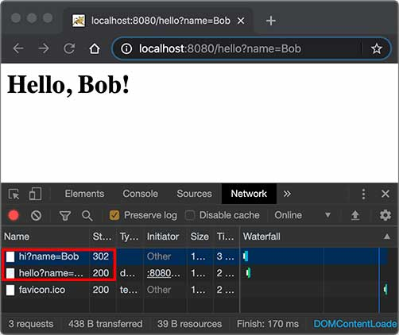
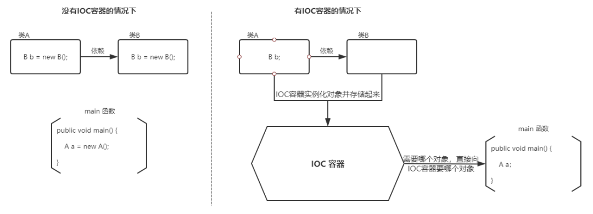
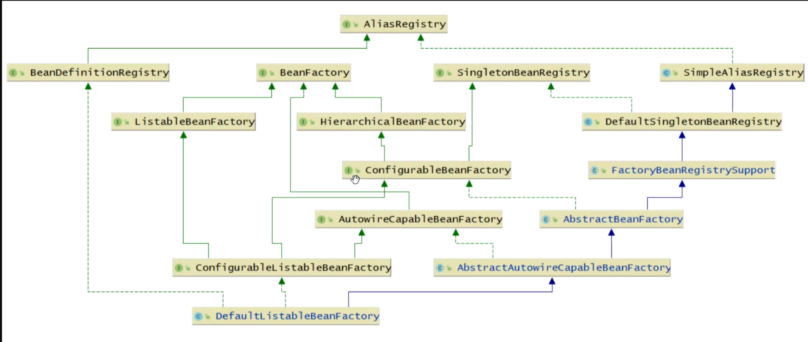
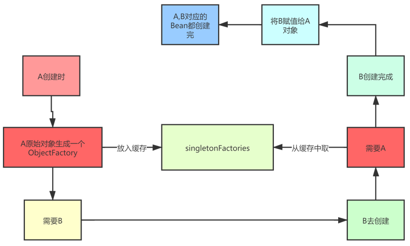
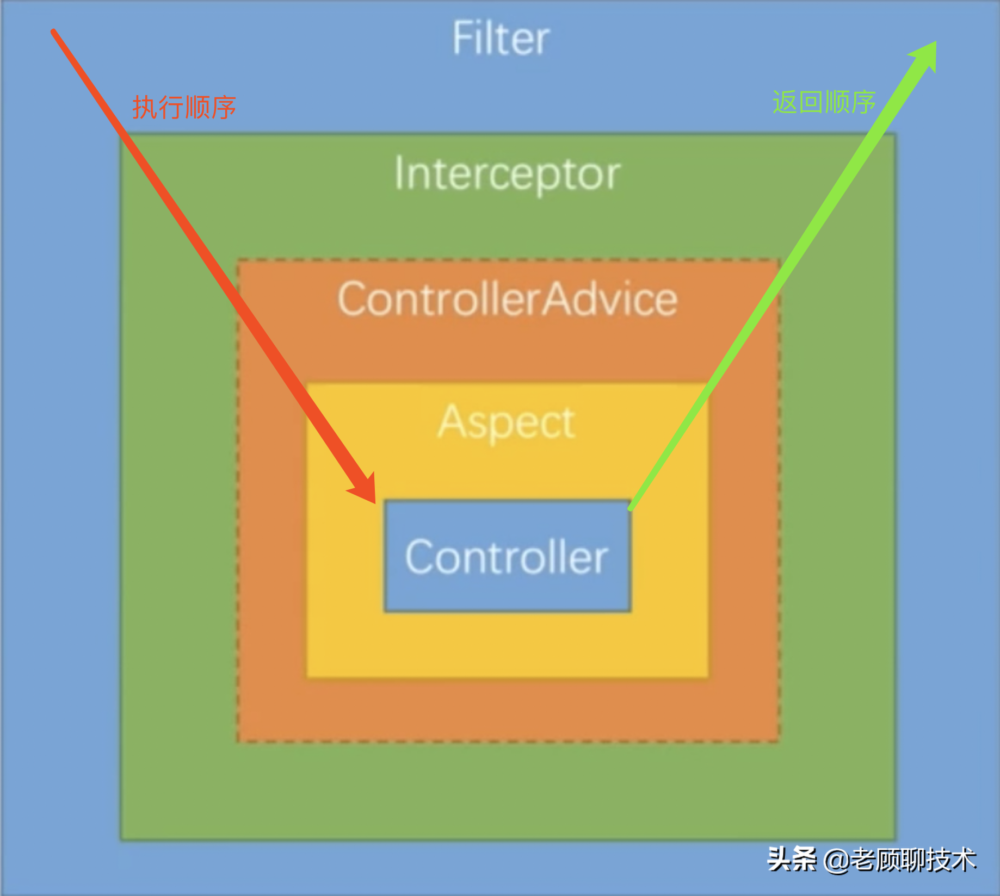

# Servlet

编写HTTP服务器很简单，但要编写完善的服务非常复杂。

在JavaEE平台上，处理TCP连接，解析HTTP协议这些底层工作统统扔给现成的Web服务器去做，因此提供了Servlet API，我们使用这套API编写自己的Servlet来处理HTTP请求，Web服务器实现Servlet API接口，实现底层功能：

```
                 ┌───────────┐
                 │My Servlet │
                 ├───────────┤
                 │Servlet API│
┌───────┐  HTTP  ├───────────┤
│Browser│<──────>│Web Server │
└───────┘        └───────────┘
```

## servlet基础

一个Servlet总是继承自`HttpServlet`，然后覆写`doGet()`或`doPost()`等方法。注意到`doGet()`方法传入了`HttpServletRequest`和`HttpServletResponse`两个对象，分别代表HTTP请求和响应。

使用Servlet API时，并不直接与底层TCP交互，也不需要解析HTTP协议，因为`HttpServletRequest`和`HttpServletResponse`就已经封装好了请求和响应。以发送响应为例，我们只需要设置正确的响应类型，然后获取`PrintWriter`，写入响应即可。

servlet简单实现：

```java
// WebServlet注解表示这是一个Servlet，并映射到地址“/”:
@WebServlet(urlPatterns = "/")
public class HelloServlet extends HttpServlet {
    @Override
    protected void doGet(HttpServletRequest req, HttpServletResponse resp) throws ServletException, IOException {
        // 设置响应类型:
        resp.setContentType("text/html");
        // 获取输出流:
        PrintWriter pw = resp.getWriter();
        // 读取url传参
        String name = req.getParameter("name");
        if (name == null) {
            name = "world";
        }
        // 写入响应:
        pw.write("<h1>Hello, " + name + "!</h1>");
        // 最后不要忘记flush强制输出:
        pw.flush();
    }
}
```

Servlet API是一个jar包，需要通过Maven来引入

```xml
<project xmlns="http://maven.apache.org/POM/4.0.0"
    xmlns:xsi="http://www.w3.org/2001/XMLSchema-instance"
    xsi:schemaLocation="http://maven.apache.org/POM/4.0.0 http://maven.apache.org/maven-v4_0_0.xsd">
    <modelVersion>4.0.0</modelVersion>
    <groupId>com.itranswarp.learnjava</groupId>
    <artifactId>web-servlet-hello</artifactId>
    <!-- 打包类型为war-->
    <packaging>war</packaging>
    <version>1.0-SNAPSHOT</version>

    <properties>
        <project.build.sourceEncoding>UTF-8</project.build.sourceEncoding>
        <project.reporting.outputEncoding>UTF-8</project.reporting.outputEncoding>
        <maven.compiler.source>11</maven.compiler.source>
        <maven.compiler.target>11</maven.compiler.target>
        <java.version>11</java.version>
    </properties>

    <dependencies>
         <!-- 引入Servlet API-->
        <dependency>
            <groupId>javax.servlet</groupId>
            <artifactId>javax.servlet-api</artifactId>
            <version>4.0.0</version>
            <scope>provided</scope>
        </dependency>
    </dependencies>

    <build>
        <finalName>hello</finalName>
    </build>
</project>
```

注意到这个`pom.xml`与前面我们讲到的普通Java程序有个区别，打包类型不是`jar`，而是`war`，表示Java Web Application Archive

注意到`<scope>`指定为`provided`，表示编译时使用，但不会打包到`.war`文件中，因为运行期Web服务器本身已经提供了Servlet API相关的jar包。

普通的Java程序是通过启动JVM，然后执行`main()`方法开始运行。但是Web应用程序有所不同，我们无法直接运行`war`文件，必须先启动Web服务器（常用如Tomcat），再由Web服务器加载我们编写的`HelloServlet`，这样就可以让`HelloServlet`处理浏览器发送的请求。

要运行我们的`hello.war`，首先要[下载Tomcat服务器](https://tomcat.apache.org/download-90.cgi)，解压后，把`hello.war`复制到Tomcat的`webapps`目录下，然后切换到`bin`目录，执行`startup.sh`或`startup.bat`启动Tomcat服务器。

## servlet开发

上述方法在tomcat中运行war，如果想在IDE中断点调试，还需要打开Tomcat的远程调试端口并且连接上去。

如何在IDE中启动并调试webapp？可以把Tomcat的jar包全部引入进来，然后自己编写一个`main()`方法，先启动Tomcat，然后让它加载我们的webapp就行。

新建一个`web-servlet-embedded`工程，编写`pom.xml`，`<packaging>`类型仍然为`war`，引入依赖`tomcat-embed-core`和`tomcat-embed-jasper。不必引入Servlet API，因为引入Tomcat依赖后自动引入了Servlet API

```xml
<project xmlns="http://maven.apache.org/POM/4.0.0"
    xmlns:xsi="http://www.w3.org/2001/XMLSchema-instance"
    xsi:schemaLocation="http://maven.apache.org/POM/4.0.0 http://maven.apache.org/xsd/maven-4.0.0.xsd">
    <modelVersion>4.0.0</modelVersion>

    <groupId>com.itranswarp.learnjava</groupId>
    <artifactId>web-servlet-embedded</artifactId>
    <version>1.0-SNAPSHOT</version>
    <packaging>war</packaging>

    <properties>
        <project.build.sourceEncoding>UTF-8</project.build.sourceEncoding>
        <project.reporting.outputEncoding>UTF-8</project.reporting.outputEncoding>
        <maven.compiler.source>11</maven.compiler.source>
        <maven.compiler.target>11</maven.compiler.target>
        <java.version>11</java.version>
        <tomcat.version>9.0.26</tomcat.version>
    </properties>

    <dependencies>
        <dependency>
            <groupId>org.apache.tomcat.embed</groupId>
            <artifactId>tomcat-embed-core</artifactId>
            <version>${tomcat.version}</version>
            <scope>provided</scope>
        </dependency>
        <dependency>
            <groupId>org.apache.tomcat.embed</groupId>
            <artifactId>tomcat-embed-jasper</artifactId>
            <version>${tomcat.version}</version>
            <scope>provided</scope>
        </dependency>
    </dependencies>
</project>
```

编写一个`main()`方法，启动Tomcat服务器，可直接在浏览器访问`http://localhost:8080/`

```java
public class Main {
    public static void main(String[] args) throws Exception {
        // 启动Tomcat:
        Tomcat tomcat = new Tomcat();
        tomcat.setPort(Integer.getInteger("port", 8080));
        tomcat.getConnector();
        // 创建webapp:
        // tomcat加载当前工程作为根webapp
        Context ctx = tomcat.addWebapp("", new File("src/main/webapp").getAbsolutePath());
        WebResourceRoot resources = new StandardRoot(ctx);
        resources.addPreResources(
                new DirResourceSet(resources, "/WEB-INF/classes", new File("target/classes").getAbsolutePath(), "/"));
        ctx.setResources(resources);
        tomcat.start();
        tomcat.getServer().await();
    }
}
```


## servlet进阶

前面基础的servlet只能处理get请求，如果要处理post请求，就需要覆写`doPost()`方法。如果没有覆写doPost，post请求就会返回405或400（get同理），参考源码：

```java
// javax.servlet.http.HttpServlet#doPost
protected void doPost(HttpServletRequest req, HttpServletResponse resp) throws ServletException, IOException {
    String protocol = req.getProtocol();
    String msg = lStrings.getString("http.method_post_not_supported");
    if (protocol.endsWith("1.1")) {
        resp.sendError(405, msg);
    } else {
        resp.sendError(400, msg);
    }
}
```

一个Webapp完全可以有多个Servlet，分别映射不同的路径，浏览器发出的HTTP请求总是由Web Server先接收，然后根据Servlet配置的映射，不同的路径转发到不同的Servlet。这种根据路径转发的功能一般称为**Dispatch**。映射到`/`的`IndexServlet`比较特殊，它实际上会接收所有未匹配的路径，相当于`/*`，因为Dispatcher的逻辑可以用伪代码实现如下：

```java
String path = ...
if (path.equals("/hello")) {
    // 路径“/hello”转发到helloServlet处理
    dispatchTo(helloServlet);
} else if (path.equals("/signin")) {
    // 路径“/signin”转发到signinServlet处理
    dispatchTo(signinServlet);
} else {
    // 所有未匹配的路径均转发到"/"
    dispatchTo(indexServlet);
}
```

### HttpServletRequest

封装了一个HTTP请求，它实际上是从`ServletRequest`继承而来。最早设计Servlet时，设计者希望Servlet不仅能处理HTTP，也能处理类似SMTP等其他协议，因此，单独抽出了`ServletRequest`接口，但实际上除了HTTP外，并没有其他协议会用Servlet处理，所以这是一个过度设计。

常用的方法有：

- getMethod()：返回请求方法，例如，`"GET"`，`"POST"`；
- getRequestURI()：返回请求路径，但不包括请求参数，例如，`"/hello"`；
- getQueryString()：返回请求参数，例如，`"name=Bob&a=1&b=2"`；
- getParameter(name)：返回请求参数，GET请求从URL读取参数，POST请求从Body中读取参数；
- getContentType()：获取请求Body的类型，例如，`"application/x-www-form-urlencoded"`；
- getContextPath()：获取当前Webapp挂载的路径，对于ROOT来说，总是返回空字符串`""`；
- getCookies()：返回请求携带的所有Cookie；
- getHeader(name)：获取指定的Header，对Header名称不区分大小写；
- getHeaderNames()：返回所有Header名称；
- getInputStream()：如果该请求带有HTTP Body，该方法将打开一个输入流用于读取Body；
- getReader()：和getInputStream()类似，但打开的是Reader；
- getRemoteAddr()：返回客户端的IP地址；
- getScheme()：返回协议类型，例如，`"http"`，`"https"`；

还有两个方法：`setAttribute()`和`getAttribute()`，可以给当前`HttpServletRequest`对象附加多个Key-Value，相当于把`HttpServletRequest`当作一个`Map<String, Object>`使用。

### HttpServletResponse

封装了一个HTTP响应。由于HTTP响应必须先发送Header，再发送Body，所以，操作`HttpServletResponse`对象时，必须先调用设置Header的方法，最后调用发送Body的方法。

常用的设置Header的方法有：

- setStatus(sc)：设置响应代码，默认是`200`；
- setContentType(type)：设置Body的类型，例如，`"text/html"`；
- setCharacterEncoding(charset)：设置字符编码，例如，`"UTF-8"`；
- setHeader(name, value)：设置一个Header的值；
- addCookie(cookie)：给响应添加一个Cookie；
- addHeader(name, value)：给响应添加一个Header，因为HTTP协议允许有多个相同的Header；

**注意**

写入完毕后调用`flush()`却是必须的，因为大部分Web服务器都基于HTTP/1.1协议，会复用TCP连接。如果没有调用`flush()`，将导致缓冲区的内容无法及时发送到客户端。此外，写入完毕后千万不要调用`close()`，原因同样是因为会复用TCP连接，如果关闭写入流，将关闭TCP连接，使得Web服务器无法复用此TCP连接。

### Servlet多线程模型

一个Servlet类在服务器中只有一个实例，但对于每个HTTP请求，Web服务器会使用多线程执行请求。因此，一个Servlet的`doGet()`、`doPost()`等处理请求的方法是多线程并发执行的。如果Servlet中定义了字段，要注意多线程并发访问的问题：

```java
public class HelloServlet extends HttpServlet {
    private Map<String, String> map = new ConcurrentHashMap<>();

    protected void doGet(HttpServletRequest req, HttpServletResponse resp) throws ServletException, IOException {
        // 注意读写map字段是多线程并发的:
        this.map.put(key, value);
    }
}
```

但是对于每个请求，Web服务器会创建唯一的`HttpServletRequest`和`HttpServletResponse`实例，因此，`HttpServletRequest`和`HttpServletResponse`实例只有在当前处理线程中有效，它们总是局部变量，不存在多线程共享的问题。

### 重定向

Redirect， 指当浏览器请求一个URL时，服务器返回一个重定向指令，告诉浏览器地址已经变了，麻烦使用新的URL再重新发送新请求。

```java
// 我们已经编写了一个能处理`/hello`的`HelloServlet`，如果收到的路径为`/hi`，希望能重定向到`/hello`，可以再编写一个RedirectServlet

@WebServlet(urlPatterns = "/hi")
public class RedirectServlet extends HttpServlet {
    protected void doGet(HttpServletRequest req, HttpServletResponse resp) throws ServletException, IOException {
        // 构造重定向的路径:
        String name = req.getParameter("name");
        String redirectToUrl = "/hello" + (name == null ? "" : "?name=" + name);
        // 发送302重定向响应:
        resp.sendRedirect(redirectToUrl);
        
        // 如果要发送301重定向，上面的代码要这么写
        // resp.setStatus(HttpServletResponse.SC_MOVED_PERMANENTLY); // 301
        // resp.setHeader("Location", "/hello");
    }
}
```

**过程**

如果浏览器发送`GET /hi`请求，`RedirectServlet`将处理此请求。由于`RedirectServlet`在内部又发送了重定向响应，因此，浏览器会收到如下响应：

```
HTTP/1.1 302 Found
Location: /hello
```

当浏览器收到302响应后，它会立刻根据`Location`的指示发送一个新的`GET /hello`请求。

```ascii
┌───────┐   GET /hi     ┌───────────────┐
│Browser│ ────────────> │RedirectServlet│
│       │ <──────────── │               │
└───────┘   302         └───────────────┘


┌───────┐  GET /hello   ┌───────────────┐
│Browser│ ────────────> │ HelloServlet  │
│       │ <──────────── │               │
└───────┘   200 <html>  └───────────────┘
```

观察Chrome浏览器的网络请求，可以看到两次HTTP请求，并且浏览器的地址栏路径自动更新为`/hello`：




重定向有两种：

- 临时重定向：响应状态码302
- 永久重定向：响应状态码301

两者的区别：如果服务器发送301，浏览器会**缓存**`/hi`到`/hello`这个重定向的关联，下次请求`/hi`的时候，浏览器就直接发送`/hello`请求了。

**作用**

当Web应用升级后，如果请求路径发生了变化，可以将原来的路径重定向到新路径，从而避免浏览器请求原路径找不到资源。


### 转发

Forward，指内部转发。当一个Servlet处理请求的时候，它可以决定自己不继续处理，而是转发给另一个Servlet处理。

```java
// 我们已经编写了一个能处理`/hello`的`HelloServlet`，继续编写一个能处理`/morning`的`ForwardServlet`

@WebServlet(urlPatterns = "/morning")
public class ForwardServlet extends HttpServlet {
    protected void doGet(HttpServletRequest req, HttpServletResponse resp) throws ServletException, IOException {
        req.getRequestDispatcher("/hello").forward(req, resp);
    }
}
```

`ForwardServlet`在收到请求后，它并不自己发送响应，而是把请求和响应都转发给路径为`/hello`的Servlet，后续请求的处理实际上是由`HelloServlet`完成的。这种处理方式称为转发（Forward），我们用流程图画出来如下：

```ascii
                          ┌────────────────────────┐
                          │      ┌───────────────┐ │
                          │ ────>│ForwardServlet │ │
┌───────┐  GET /morning   │      └───────────────┘ │
│Browser│ ──────────────> │              │         │
│       │ <────────────── │              ▼         │
└───────┘    200 <html>   │      ┌───────────────┐ │
                          │ <────│ HelloServlet  │ │
                          │      └───────────────┘ │
                          │       Web Server       │
                          └────────────────────────┘
```

**转发和重定向的区别**

转发是在Web服务器内部完成的，对浏览器来说，它只发出了一个HTTP请求，浏览器的地址栏路径仍然是`/morning`，浏览器并不知道该请求在Web服务器内部实际上做了一次转发。

## MVC

```
   HTTP Request    ┌─────────────────┐
──────────────────>│DispatcherServlet│
                   └─────────────────┘
                            │
               ┌────────────┼────────────┐
               ▼            ▼            ▼
         ┌───────────┐┌───────────┐┌───────────┐
         │Controller1││Controller2││Controller3│
         └───────────┘└───────────┘└───────────┘
               │            │            │
               └────────────┼────────────┘
                            ▼
   HTTP Response ┌────────────────────┐
<────────────────│render(ModelAndView)│
                 └────────────────────┘
```

## Filter过滤器

过滤器是Servlet规范的组件，对 **请求和响应**`(ServletRequest request, ServletResponse response)`进行预处理。

过滤器 **依赖于servlet容器**，基于函数回调实现。随web应用的启动而启动，只初始化一次，随web应用的停止而销毁。

1. 启动服务器时加载过滤器的实例，并调用init()方法来初始化实例
2. 每一次请求时都只调用方法doFilter()进行处理；
3. 停止服务器时（stop Spring应用）调用destroy()方法，销毁实例。

**使用**

1. 实现Filter接口（引入 javax.servlet.*），重写init、doFilter和destroy方法
2. a)实现类加上@Component注解

```java
@Component
public class TimeFilter implements Filter {
    @Override
    public void init(FilterConfig filterConfig) throws ServletException {
        System.out.println("=======================time filter init======================");
    }

    @Override
    public void doFilter(ServletRequest request, ServletResponse response, FilterChain chain) throws IOException, ServletException {
        System.out.println("======================time filter start======================");
        long startTime =  System.currentTimeMillis();

        chain.doFilter(request, response);  // 在重写的doFilter中调用FilterChain实例的doFilter方法

        long endTime = System.currentTimeMillis();
        System.out.println("time filter 消耗"+ (endTime - startTime) + "ms");
        System.out.println("======================time filter end ======================");
    }

    @Override
    public void destroy() {
        System.out.println("======================time filter destroy======================");
    }
}
```

b)若要指定过滤的url，在过滤器实现类加`@WebFilter()`，启动类加`@ServletComponentScan`

```java
@WebFilter("/user/*")  // 参数填要过滤的url
public class TimeFilter implements Filter {
	...
}
```

c)或用配置类注册Filter，也可设置过滤的url

```java
@Configuration
public class FilterConfiguration {
    // 返回一个用于注册filter的bean
    @Bean
    public FilterRegistrationBean<TimeFilter> timeFilter() {
        FilterRegistrationBean<TimeFilter> registrationBean = new FilterRegistrationBean<>();
        TimeFilter timeFilter = new TimeFilter();
        registrationBean.setFilter(timeFilter);   // 设置Filter
        List<String> urls = new ArrayList<>();
        urls.add("/*");
        registrationBean.setUrlPatterns(urls);  // 设置要过滤的url
        // 注意一定要设置过滤的url，否则会将静态资源也过滤进来
        // 从而报转换错误：java.lang.ClassCastException:
        //        org.springframework.web.servlet.resource.ResourceHttpRequestHandler cannot be cast to
        //        org.springframework.web.method.HandlerMethod
        return registrationBean;
    }
}
```

从doFilter方法的参数可知，filter里面是能够获取到**请求**的参数和**响应**的数据；但此方法是无法知道是哪一个Controller类中的哪个方法被执行。

**注意**

Filter中是没法使用注入的bean的，也就是无法使用@Autowired

```java
@Component
public class TimeFilter implements Filter {
    // 注入的值为null
    @Autowired
    private UserService userService;
}
```

Spring中，web应用启动的顺序是：listener->filter->servlet，先初始化listener，然后再来就filter的初始化，再接着才到我们的dispathServlet的初始化，因此，当我们需要在filter里注入一个注解的bean时，就会注入失败，因为filter初始化时，注解的bean还没初始化，没法注入。

此外对请求和响应进行预处理时，注意不要影响原始的请求和响应，用**代理**模式”复制“一份再处理，参考：

[修改请求](https://www.liaoxuefeng.com/wiki/1252599548343744/1328976435871777)

[修改响应](https://www.liaoxuefeng.com/wiki/1252599548343744/1328976456843298)


## Listener监听器

与Filter一样也是Servlet规范的组件，一般来说Listener启动在Filter之前，销毁在其后。

其中最常用的是`ServletContextListener`,它会在整个Web应用程序初始化完成后，以及Web应用程序关闭后获得回调通知。一个Web服务器可以运行一个或多个WebApp，对于每个WebApp，Web服务器都会为其创建一个全局唯一的`ServletContext`实例

```java
@WebListener  // 务必加这个注解，同时在启动类加@ServletComponentScan
public class AppListener implements ServletContextListener {
    // 在此初始化WebApp,例如打开数据库连接池等:
    public void contextInitialized(ServletContextEvent sce) {
        System.out.println("WebApp initialized: ServletContext = " + sce.getServletContext());
    }

    // 在此清理WebApp,例如关闭数据库连接池等:
    public void contextDestroyed(ServletContextEvent sce) {
        System.out.println("WebApp destroyed.");
    }
}
```

除了`ServletContextListener`外，还有几种Listener：

- HttpSessionListener：监听HttpSession的创建和销毁事件；
- ServletRequestListener：监听ServletRequest请求的创建和销毁事件；
- ServletRequestAttributeListener：监听ServletRequest请求的属性变化事件（即调用`ServletRequest.setAttribute()`方法）；
- ServletContextAttributeListener：监听ServletContext的属性变化事件（即调用`ServletContext.setAttribute()`方法）；

用于监听请求的ServletRequestListener用法：

```java
@WebListener
public class MyServletRequestListener implements ServletRequestListener {
    @Override
    public void requestInitialized(ServletRequestEvent sre) {  // 监听请求建立
        System.out.println("requestInitialized" + "," + new Date());
        Object count = sre.getServletContext().getAttribute("count");  // 从请求中获取ServletContext实例，并取count属性，作为访问次数统计
        Integer cInteger = 0;
        if (count != null) {
            cInteger = Integer.valueOf(count.toString());
        }
        System.out.println("历史访问次数：" + count);
        cInteger++;
        sre.getServletContext().setAttribute("count", cInteger);
    }
    
    @Override
    public void requestDestroyed(ServletRequestEvent sre) {  // 监听请求销毁
        System.out.println("requestDestroyed" + "," + new Date());
        System.out.println("当前访问次数：" + sre.getServletContext().getAttribute("count"));
    }
}
```

## Q：jar包和war包的区别？

jar包是java打的包，war包可以理解为javaweb打的包。

jar包中只是用java来写的项目打包来的，里面只有编译后的class和一些部署文件。

而war包里面的东西就全了，包括写的代码编译成的class文件，依赖的包，配置文件，所有的网站页面，包括html，jsp等等。一个war包可以理解为是一个web项目，里面是项目的所有东西。

前后端分离的项目，后端war包存放空页面

# Spring

### SpringBoot 引导配置

**Spring Boot应用程序的入口点是使用@SpringBootApplication注释的类**


```java
@SpringBootApplication
public class Application {
    public static void main(String[] args) {
        SpringApplication.run(Application.class, args);
    }
}
```

  默认情况下，`Spring Boot`使用嵌入式容器来运行应用程序。在这种情况下，`Spring Boot`使用`public static void main`入口点来启动嵌入式`Web`服务器。此外，它还负责将`Servlet`，`Filter`和`ServletContextInitializer bean`从应用程序上下文绑定到嵌入式`servlet`容器。
 `Spring Boot`的另一个特性是它会自动扫描同一个包中的所有类或`Main`类的子包中的组件。

`Spring Boot`提供了将其部署到外部容器的方式。我们只需要扩展`SpringBootServletInitializer`即可：


```java
/**
 * War部署
 *
 * @author SanLi
 * Created by 2689170096@qq.com on 2018/4/15
 */
public class ServletInitializer extends SpringBootServletInitializer {

    @Override
    protected SpringApplicationBuilder configure(SpringApplicationBuilder application) {
        return application.sources(Application.class);
    }

    @Override
    public void onStartup(ServletContext servletContext) throws ServletException {
        super.onStartup(servletContext);
        servletContext.addListener(new HttpSessionEventPublisher());
    }
}
```

  这里外部`servlet`容器查找在war包下的`META-INF`文件夹下MANIFEST.MF文件中定义的`Main-class`，`SpringBootServletInitializer`将负责绑定`Servlet`，`Filter`和`ServletContextInitializer`。


## Spring IoC

**Inverse of Control（控制反转）**是一种设计思想，**控制**指的是对象创建（实例化、管理）的权力，**反转**是控制权交给外部环境（Spring 框架、IoC 容器）。

**IoC 容器**是 Spring 用来实现 IoC 的载体， IoC 容器实际上就是个 Map（key，value），存放各种对象。

例如：现有类 A 依赖于类 B

- **传统的开发方式** ：往往是在类 A 中手动通过 new 关键字来 new 一个 B 的对象出来
- **使用 IoC 思想的开发方式** ：不通过 new 关键字来创建对象，而是通过 IoC 容器(Spring 框架) 来帮助我们实例化对象。我们需要哪个对象，直接从 IoC 容器里面过去即可。



### IoC 和 DI 

IoC 最常见以及最合理的实现方式叫做**依赖注入**（Dependency Injection，简称 DI）。

老马（Martin Fowler）在一篇文章中提到将 IoC 改名为 DI，原文如下，原文地址：https://martinfowler.com/articles/injection.html 。

老马的大概意思是 IoC 太普遍并且不表意，很多人会因此而迷惑，所以，使用 DI 来精确指名这个模式比较好。

## Spring AOP

Aspect-Oriented Programming（面向切面编程）能够将那些与业务无关，却为业务模块所**共用**的代码（成为**横切逻辑代码**）（例如事务处理、日志管理、权限控制等）封装起来，，便于减少重复代码，降低模块耦合度，增加可拓展性和可维护性。

Spring AOP 就是基于动态代理的，如果要代理的对象，实现了某个接口，那么 Spring AOP 会使用 **JDK Proxy**，去创建代理对象，而对于没有实现接口的对象，就无法使用 JDK Proxy 去进行代理了，这时候 Spring AOP 会使用 **Cglib** 生成一个被代理对象的子类来作为代理，如下图所示：


### Spring AOP创建时机？

在BeanPostProcessor后置处理器时创建，有jdk动态代理和cglib两种实现

## SpringBoot单体应用支持的最大并发？

SpringBoot内置Tomcat，在默认设置中，Tomcat的最大线程数是200，**最大连接数（并发量）是10000**。

## BeanDefinition 

表示Bean定义，BeanDefinition中存在很多属性用来描述一个Bean的特点。比如：

- class，表示Bean类型 
- scope，表示Bean作用域，单例或原型等 
- lazyInit：表示Bean是否是懒加载 
- initMethodName：表示Bean初始化时要执行的方法
- destroyMethodName：表示Bean销毁时要执行的方法

Bean定义有两种方式：声明式和定义式

**声明式**

1. xml格式 `<bean/>`  
2. @Bean
3. @Component、@Service、@Controller等

**定义式**

```java
AnnotationConfigApplicationContext context = new AnnotationConfigApplicationContext(AppConfig.class);
// 生成一个BeanDefinition对象
// 下面代码等同于@Component，如果用注解就由框架生成
AbstractBeanDefinition beanDefinition =
        BeanDefinitionBuilder.genericBeanDefinition().getBeanDefinition();
// 设置beanClass等信息
beanDefinition.setBeanClass(UserService.class);
beanDefinition.setScope("prototype");
// 注册到ApplicationContext中
context.registerBeanDefinition("userService", beanDefinition);
// 定义之后才能从容器中获取bean
System.out.println(context.getBean("userService"));
```


## BeanDefinitionReader

这些BeanDefinitionReader在我们使用Spring时用得少，但在Spring源码中用得多，相当于Spring源码的基础设施。

**AnnotatedBeanDefinitionReader**

可以直接把某个类转换为BeanDefinition，并且会解析该类上的**注解**。

注意：它能解析的注解是：@Conditional，@Scope、@Lazy、@Primary、@DependsOn、@Role、@Description

```java
AnnotationConfigApplicationContext context = new AnnotationConfigApplicationContext(AppConfig.class);
AnnotatedBeanDefinitionReader annotatedBeanDefinitionReader = new
        AnnotatedBeanDefinitionReader(context);
// 调用register注册方法，将UserService.class解析为BeanDefinition
annotatedBeanDefinitionReader.register(UserService.class);
System.out.println(context.getBean("userService"));
```

AppConfig类：

```java
@ComponentScan("com.css.service")
public class AppConfig {

    @Bean
    public UserService userService () {
        return new UserService();
    }
}
```

**XmlBeanDefinitionReader**
可以解析`<bean/>`标签

**ClassPathBeanDefinitionScanner**
虽然是扫描器，但是它的作用和`BeanDefinitionReader`类似，它可以扫描某个包路径，解析其中的类。例如：扫描到的类上如果存在@Component注解，那么就会把这个类解析为一个BeanDefinition

```java
// AnnotationConfigApplicationContext context = new AnnotationConfigApplicationContext(AppConfig.class);
// 以下三行等同上面一行操作
// 如果用默认构造方法，则必须要先注册再刷新
AnnotationConfigApplicationContext context = new AnnotationConfigApplicationContext();
context.register(AppConfig.class);
context.refresh();
ClassPathBeanDefinitionScanner scanner = new ClassPathBeanDefinitionScanner(context);
scanner.scan("com.css");  // 扫描
System.out.println(context.getBean("userService"));
```

## BeanFactory

表示Bean工厂，负责创建Bean，并且提供获取Bean的API。 

**“Spring容器”**就可以理解为BeanFactory

BeanFactory接口存在一个非常重要的实现类是DefaultListableBeanFactory：

```java
DefaultListableBeanFactory beanFactory = new DefaultListableBeanFactory();
// 创建beanDefinition
AbstractBeanDefinition beanDefinition =
        BeanDefinitionBuilder.genericBeanDefinition().getBeanDefinition();
beanDefinition.setBeanClass(UserService.class);
// 将beanDefinition注册到工厂
beanFactory.registerBeanDefinition("userService", beanDefinition);
System.out.println(beanFactory.getBean("userService"));
```


DefaultListableBeanFactory是非常强大的，支持很多功能，可以通过查看
DefaultListableBeanFactory的类继承实现结构来看




**FactoryBean**

我们可以通过BeanPostPorcessor来干涉Spring创建Bean的过程，但是如果我们想一个
Bean完完全全由我们来创造，也是可以的，比如通过FactoryBean 

```java
@Component("userService")
public class CssFactoryBean implements FactoryBean {

    @Override
    public Object getObject() throws Exception {
        UserService userService = new UserService();
        return userService;
    }

    @Override
    public Class<?> getObjectType() {
        return UserService.class;
    }
}
//测试：
public static void main(String[] args) throws IOException {
        AnnotationConfigApplicationContext context = new
                AnnotationConfigApplicationContext(AppConfig.class);
        System.out.println(context.getBean("cssFactoryBean")); // com.css.service.UserService@548a102f
        System.out.println(context.getBean("&&&cssFactoryBean")); // com.css.service.CssFactoryBean@5762806e
}
```

 CssFactoryBean这个类实现了FactoryBean之后，从容器中getBean拿到的实际上是CssFactoryBean重写了getObject和getObjectType方法返回的bean。要获得CssFactoryBean这个bean本身，getBean传的名字要在前面加“&”。

单例池singletonObjects中存的始终只有cssFactoryBean，而没有userService。factoryBeanObjectCache中存的key虽然为cssFactoryBean，指向却是userService实例

### FactoryBean与@Bean区别？

虽然都是创建bean，效果基本上一样，但@Bean会经过BeanPostPorcessor的初始化前和初始化后处理，而FactoryBean只会执行初始化后


## ApplicationContext

是个接口，实际上继承自BeanFactory，不过比BeanFactory更加强大，在Spring源码的定义： 

```java
public interface ApplicationContext extends EnvironmentCapable, ListableBeanFactory, HierarchicalBeanFactory,   MessageSource, ApplicationEventPublisher, ResourcePatternResolver {
    ... 
} 
```

1. HierarchicalBeanFactory：拥有获取父BeanFactory的功能

2. ListableBeanFactory：拥有获取beanNames的功能

3. ResourcePatternResolver：资源加载器，可以一次性获取多个资源（文件资源等等）

4. EnvironmentCapable：可以获取运行时环境（没有设置运行时环境功能）

5. ApplicationEventPublisher：拥有广播事件的功能（没有添加事件监听器的功能）

6. MessageSource：拥有国际化功能

两个比较重要的实现类：

- AnnotationConfigApplicationContext
- ClassPathXmlApplicationContext

### 资源加载

是ApplicationContext继承自ResourcePatternResolver接口的功能，可以直接利用ApplicationContext获取某个文件，或访问URL

```java
public static void main(String[] args) throws IOException {
    AnnotationConfigApplicationContext context = new
            AnnotationConfigApplicationContext(AppConfig.class);
    Resource resource = context.getResource("file://D:\\笔记\\CS-Note\\Spring常见问题.md");  // 绝对路径读取
    // 获取长度
    System.out.println(resource.contentLength());  // 69579
    System.out.println(resource.getFilename());  // Spring常见问题.md
    // resource.getFile();  // 也可以获取文件本身

    Resource resource1 = context.getResource("classpath:application.properties");  // 读取classpath路径下
    System.out.println(resource1.contentLength());  // 223

    Resource resource2 = context.getResource("https://www.baidu.com");  // 读取URL
    System.out.println(resource2.getURL()); // https://www.baidu.com
    
    Resource[] resources = context.getResources("classpath:com/css/*.class");// 用*表达式读取多个资源
    for (Resource res : resources) {
        System.out.println(res.getFilename());
    }
}
```

### 获取运行时环境

是ApplicationContext继承自EnvironmentCapable接口的功能

```java
public static void main(String[] args) throws IOException {
    AnnotationConfigApplicationContext context = new
            AnnotationConfigApplicationContext(AppConfig.class);
    Map<String, Object> systemEnvironment = context.getEnvironment().getSystemEnvironment(); // 获取系统环境信息
    System.out.println(systemEnvironment);
    System.out.println("=======");
    Map<String, Object> systemProperties = context.getEnvironment().getSystemProperties();  // 获取java -d 传入的命令参数
    System.out.println(systemProperties);
    System.out.println("=======");
     // 包含上面两个，以及properties文件的配置
    MutablePropertySources propertySources = context.getEnvironment().getPropertySources();
    System.out.println(propertySources);
    System.out.println("=======");
    System.out.println(context.getEnvironment().getProperty("NO_PROXY"));
    System.out.println(context.getEnvironment().getProperty("sun.jnu.encoding"));
    System.out.println(context.getEnvironment().getProperty("css"));
}
```

### 事件发布

先定义一个事件监听器

```java
@Bean
public ApplicationListener applicationListener() {
    return new ApplicationListener() {
        @Override
        public void onApplicationEvent(ApplicationEvent event) {
            System.out.println("接收到了一个事件:" + event.getSource());
            // 接收到了一个事件:org.springframework.context.annotation.AnnotationConfigApplicationContext@5d22bbb7, started on Fri Oct 21 16:19:18 CST 2022
        }
    };
}
```

发布事件

```java
@Component("userService")
@Scope("prototype")
 //  实现这个接口，重写其setApplicationContext方法，获取spring容器ApplicationContext
public class UserService implements ApplicationContextAware {
	// spring容器
    private ApplicationContext applicationContext;
    
    @Override
    public void setApplicationContext(ApplicationContext applicationContext) throws BeansException {
        this.applicationContext = applicationContext;
    }
    public void test() {
        // 发布事件123
        applicationContext.publishEvent("123");
    }
}
```

## 类型转换

JDK中提供的类型转化工具类 

```java
public class StringToUserPropertyEditor extends PropertyEditorSupport implements PropertyEditor {
    // 重写setAsText方法
    @Override
    public void setAsText(String text) throws IllegalArgumentException {
        User user = new User();
        user.setName(text);
        this.setValue(user);
    }
}
```

```java
@Component("userService")
public class UserService  {

    @Value("css123")
    // 给User对象赋值“css123”，最终效果会给user的name属性赋值
    private User user;

    public void test() {
        System.out.println(user.getName());  // 输出user的name属性
    }
}
```

如何向Spring中注册PropertyEditor：

```java
@Bean
public CustomEditorConfigurer customEditorConfigurer() {
    CustomEditorConfigurer customEditorConfigurer = new CustomEditorConfigurer();
    Map<Class<?>, Class<? extends PropertyEditor>> propertyEditorMap = new HashMap<>();
	// 表示StringToUserPropertyEditor可以将String转化成User类型
    // 设置 map<目标类型， 使用的转换器>
    propertyEditorMap.put(User.class, StringToUserPropertyEditor.class);
    customEditorConfigurer.setCustomEditors(propertyEditorMap);
    return customEditorConfigurer;
}
```

测试

```java
public static void main(String[] args) throws IOException {
    AnnotationConfigApplicationContext context = new
            AnnotationConfigApplicationContext(AppConfig.class);
    UserService userService = (UserService)context.getBean("userService");
    userService.test(); //css123
}
```

# Bean的生命周期

Bean的生命周期指的就是：在Spring中，Bean是如何生成的？
被Spring管理的对象叫做Bean。Bean的生成步骤如下：

1. Spring扫描class得到`BeanDefinition`
2. 根据得到的BeanDefinition去生成bean
3. 首先根据class推断构造方法
4. 根据推断出来的构造方法，反射，得到一个对象（暂时叫做原始对象）
5. 填充原始对象中的属性（依赖注入）
6. 如果原始对象中的某个方法被AOP了，那么则需要根据原始对象生成一个代理对象
7. 把最终生成的代理对象放入单例池（源码中叫做singletonObjects）中，下次getBean()时就直接
    从单例池拿即可

## getBean()

可以用beanName获取容器的bean。可以用别名或多重别名（最终肯定能找到对应bean），存在aliasMap中，是一个map：<别名, 真实名>


# SpringBoot是怎么启动的

在Application类下 SpringApplication.run()

SpringBootApplication有三个Annotation

@EnableAutoConfiguration 通过@import将所有符合自动配置条件的bean定义都加载到IoC容器 搜索符合自动配置条件的功能需要借助于SpringFactoriesLoader提供的配置查找的功能 即根据 @EnableAutoConfiguration的完整类名作为查找的Key 获取对应的一组Configuration类

@Configuration 和JavaConfig形式的Spring loc容器的配置类使用的@Configuration一样 是其定义成一个JavaConfig配置类

 

@ComponentScan 对应XML配置中的元素 其功能就是自动扫描并加载符合条件的组件（比如@Component和@Repository等）或者bean定义，最终将这些bean定义加载到IoC容器

## 如何解决循环依赖

A创建时--->需要B---->B去创建--->需要A，从而产生了循环依赖

Spring使用三级缓存

1. 一级缓存`singletonObjects `ConcurrentHashMap<beanName, bean对象> ：

   缓存已经经历了完整生命周期的bean对象。

2. 二级缓存`earlySingletonObjects `HashMap<beanName, bean对象>：

   比`singletonObjects`多了一个early，表示缓存的是早期的bean对象。 早期是什么意思？表示Bean的生命周期还没走完就把这个Bean放入了earlySingletonObjects。 

3. 三级缓存`singletonFactories ` ConcurrentHashMap<beanName, bean对象>：

   缓存ObjectFactory，表示对象工厂，表示用来创建早期bean对象的 工厂。

SingletonObjecs 完成初始化的单例对象的cache（一级缓存）

EarlySingletonObjecs 完成实例化但没有初始化的 提前曝光的单例对象的Cache（二级缓存）

SingletonFactories 进入实例化阶段的单例对象工厂的cache（三级缓存）




## 循环依赖无法解决的场景

```java
// IA 、 IB是两个空接口，略
@Repository
public class A implements IA {
    @Autowired
    private IB ib;
}
@Repository
public class B implements IB {
    @Autowired
    private IA ia;
}
```

A、B两个实现类中互相注入对方的接口，若A、B的注解都是@Repository，则spring无法启动，报错： Error creating bean with name 'a': Bean with name 'a' has been injected into other beans [b] in its raw version as part of a circular reference, but has eventually been wrapped. This means that said other beans do not use the final version of the bean. This is often the result of over-eager type matchin                                   

只有当其中一个不是@Repository，或两个都不是，比如用@Service、@Controller或@Component时，才不会报错

## @Component 和 @Configuration + @Bean 同时存在，创建bean用哪个？

`allowBeanDefinitionOverriding=true;`，默认是允许BeanDefinition覆盖

因此若同时存在，默认情况下，容器加载的是@Configuration + @Bean 配置的bean


## Interceptor拦截器

依赖于springMVC框架，基于反射实现（aop机制）

**使用**

1. 引入import org.springframework.web.servlet.HandlerInterceptor;

2. 实现`HandlerInterceptor`接口

   主要实现三个方法

   - `preHandle(request, response, handler)`：方法**执行前**触发。可以获取到方法的请求、响应和Controller对象（就是入参的handler）

   - `postHandle(request, response, handler)`：方法**执行后**触发。参数和`preHandle()`相同。注意当controller内部**有异常时不执行**

   - `afterCompletion(request, response, handler, exception)`：不管controller内部是否有异常，**都会执行**此方法；此方法还会有个Exception ex这个参数；如果有异常，ex会有异常值；没有异常则ex为null
   
     注意：如果controller内部有异常，但异常被@ControllerAdvice 统一捕获的话，ex也会为null

```java
@Component
public class TimeInterceptor implements HandlerInterceptor {
    @Override
    public boolean preHandle(HttpServletRequest request, HttpServletResponse response, Object handler) throws Exception{
        System.out.println("================preHandle================");
        // 强转为HandlerMethod后，获取类名
        System.out.println("获取类名：" + ((HandlerMethod)handler).getBean().getClass().getName());
        // 强转为HandlerMethod后，获取方法名
        System.out.println("获取方法名" + ((HandlerMethod)handler).getMethod().getName());
        request.setAttribute("startTime", System.currentTimeMillis());
        return true;
    }

    @Override
    public void postHandle(HttpServletRequest request, HttpServletResponse response, Object handler, ModelAndView modelAndView) throws Exception {
        System.out.println("================postHandle================");
        Long startTime = (Long) request.getAttribute("startTime");
        System.out.println("time interceptor postHandle 耗时" + (System.currentTimeMillis() - startTime));
    }

    @Override
    public void afterCompletion(HttpServletRequest request, HttpServletResponse response, Object handler, Exception ex) throws  Exception {
        System.out.println("================afterCompletion================");
        Long startTime = (Long) request.getAttribute("startTime");
        System.out.println("time interceptor postHandle 耗时" + (System.currentTimeMillis() - startTime));
        System.out.println("Exception is： "+ex);
    }
}
```


3. 实现WebMvcConfigurer类，重写其`addInterceptors`方法，将2中实现的接口注册到登记类中

```java
@Configuration
public class WebConfigurer implements WebMvcConfigurer {
    @Autowired
    private TimeInterceptor timeInterceptor;  // 注入自定义拦截器

    //这个方法用来注册拦截器，我们自己写好的拦截器需要通过这里添加注册才能生效
    @Override
    public void addInterceptors(InterceptorRegistry registry) {
        // 拦截所有请求
        registry.addInterceptor(timeInterceptor).addPathPatterns("/**");
    }
}
```

**总结**

虽然拦截器可以获取Controller和方法，但却获取不到方法参数。因为在DispatcherServlet类的doDispatch方法中，拦截器的preHandler方法实际上由applyPreHandle方法执行，HandlerMethod没有从request中获取请求参数，来组装方法参数，而是在ha.handle这个方法的时候，才会组装参数

## Aspect切面

AOP操作可以对操作进行横向的拦截。最大的优势在于他可以**获取执行方法的参数**，对方法进行统一的处理。常见使用日志、事务、请求参数校验等

增加依赖：

```xml
<dependency>
    <groupId>org.springframework.boot</groupId>
    <artifactId>spring-boot-starter-aop</artifactId>
    <scope>test</scope>
</dependency>
<dependency>
    <groupId>org.aspectj</groupId>
    <artifactId>aspectjweaver</artifactId>
</dependency>
```

实现切面：

```java
@Component
@Aspect
public class TimeAspect {
    @Around(" execution(* com.tywl.schedule.controller.UserController.*(..))")  // 指定要切的方法，此处为UserController中的全部
    public Object handlerControllerMethod(ProceedingJoinPoint pjp) throws Throwable {
        System.out.println("============time aspect begin============");

        Object[] args = pjp.getArgs();
        for (Object arg : args) {
            System.out.println("arg is:" + arg);
        }

        long start = new Date().getTime();
        Object object = pjp.proceed();
        System.out.println("time aspect 耗时：" + ((new Date().getTime()) - start));
        System.out.println("============time aspect end============");
        return object;
    }
}
```

## Listener、Filter、Interceptor、Aspect总结

|      | Filter                                                       | Interceptor                                                  | Aspect                                 |
| ---- | ------------------------------------------------------------ | ------------------------------------------------------------ | -------------------------------------- |
| 参数 | HttpServletRequest request, HttpServletResponse response     | HttpServletRequest request, HttpServletResponse response, Object handler | ProceedingJoinPoint pjp                |
| 特性 | 可以拿到原始的HTTP请求和响应，但无法获取请求Controller，以及Controller中的方法 | 可以拿到HTTP请求和响应和Controller和方法，但拿不到方法的参数 | 可以拿到方法参数，但拿不到HTTP请求和响 |
| 体系 | Servlet                                                      | Spring                                                       | Spring                                 |

同时采用这几种组件，处理请求的顺序：

Listener ->  Filter  -> Interceptor  -> ControllerAdvice ->  Aspect。最后才到Controller层

控制台输出：

可以看到ServletContextListener最先执行，然后是Filter.init()，再到ServletRequestListener，再到TimeFilter.init()，到Filter.start()，再到HandlerInterceptor，再到Aspect，才到方法。

即Listener与Filter可能是交织执行，并没有确定的顺序，具体要看是哪种Listener

```
WebApp initialized: ServletContext = org.apache.catalina.core.StandardContext$NoPluggabilityServletContext@4a6c18ad
=======================time filter init======================
2022-09-22 16:05:24.461  INFO 39956 --- [           main] c.u.j.r.DefaultLazyPropertyResolver      : Property Resolver custom Bean not found with name 'encryptablePropertyResolver'. Initializing Default Property Resolver
2022-09-22 16:05:24.462  INFO 39956 --- [           main] c.u.j.d.DefaultLazyPropertyDetector      : Property Detector custom Bean not found with name 'encryptablePropertyDetector'. Initializing Default Property Detector
2022-09-22 16:05:24.630  INFO 39956 --- [           main] o.s.s.c.ThreadPoolTaskScheduler          : Initializing ExecutorService 'taskScheduler'
2022-09-22 16:05:24.710  INFO 39956 --- [           main] o.s.s.concurrent.ThreadPoolTaskExecutor  : Initializing ExecutorService 'applicationTaskExecutor'
2022-09-22 16:05:24.768  WARN 39956 --- [           main] ion$DefaultTemplateResolverConfiguration : Cannot find template location: classpath:/templates/ (please add some templates or check your Thymeleaf configuration)
2022-09-22 16:05:24.868  INFO 39956 --- [           main] o.s.b.w.embedded.tomcat.TomcatWebServer  : Tomcat started on port(s): 8085 (http) with context path ''
2022-09-22 16:05:24.870  INFO 39956 --- [           main] com.tywl.schedule.ScheduleApplication    : Started ScheduleApplication in 1.344 seconds (JVM running for 6.622)
requestInitialized,Thu Sep 22 16:05:28 CST 2022
历史访问次数：：null
2022-09-22 16:05:28.243  INFO 39956 --- [nio-8085-exec-1] o.a.c.c.C.[Tomcat].[localhost].[/]       : Initializing Spring DispatcherServlet 'dispatcherServlet'
2022-09-22 16:05:28.243  INFO 39956 --- [nio-8085-exec-1] o.s.web.servlet.DispatcherServlet        : Initializing Servlet 'dispatcherServlet'
2022-09-22 16:05:28.247  INFO 39956 --- [nio-8085-exec-1] o.s.web.servlet.DispatcherServlet        : Completed initialization in 4 ms
======================time filter start======================
================preHandle================
获取类名：com.tywl.schedule.controller.UserController$$EnhancerBySpringCGLIB$$e9f080f2
获取方法名test
============time aspect begin============
==============执行test方法====================
time aspect 耗时：1
============time aspect end============
================postHandle================
time interceptor postHandle 耗时27
================afterCompletion================
time interceptor postHandle 耗时27
Exception is： null
time filter 消耗31ms
======================time filter end ======================
requestDestroyed,Thu Sep 22 16:05:28 CST 2022
当前访问次数：1
requestInitialized,Thu Sep 22 16:05:34 CST 2022
历史访问次数：：1
======================time filter start======================
================preHandle================
获取类名：com.tywl.schedule.controller.UserController$$EnhancerBySpringCGLIB$$e9f080f2
获取方法名test
============time aspect begin============
==============执行test方法====================
time aspect 耗时：0
============time aspect end============
================postHandle================
time interceptor postHandle 耗时2
================afterCompletion================
time interceptor postHandle 耗时2
Exception is： null
time filter 消耗2ms
======================time filter end ======================
requestDestroyed,Thu Sep 22 16:05:34 CST 2022
当前访问次数：2
2022-09-22 16:31:00.148  INFO 39956 --- [extShutdownHook] o.s.s.concurrent.ThreadPoolTaskExecutor  : Shutting down ExecutorService 'applicationTaskExecutor'
2022-09-22 16:31:00.149  INFO 39956 --- [extShutdownHook] o.s.s.c.ThreadPoolTaskScheduler          : Shutting down ExecutorService 'taskScheduler'
======================time filter destroy======================
WebApp destroyed.
```

示意图：



# Spring常用注解

## @Component

最普通的组件，可以被注入到spring容器进行管理。等效于XML的bean配置

是单例模式，因此bean会在全局共享。

根据类型注入，因此如果有多个同类型（或一个接口的多个实现，具体看程序getBean()获取的是类还是接口），启动时会报错：

```
Field sysUserApi in com.eshore.cmp.corp.service.service.base.CorpBaseService required a single bean, but 2 were found:
	- userErrorDecoder: defined in URL [jar:file:/D:/Java/apache-maven-3.5.4/repository/com/eshore/cmp/cmp-ord-api/2.0.0-SNAPSHOT/cmp-ord-api-2.0.0-SNAPSHOT.jar!/com/eshore/cmp/ord/UserErrorDecoder.class]
	- feignErrorDecoder: defined in URL [jar:file:/D:/Java/apache-maven-3.5.4/repository/com/eshore/cmppub/cmppub-springcloud-common/2.0.0-SNAPSHOT/cmppub-springcloud-common-2.0.0-20210618.070507-15.jar!/com/eshore/cmppub/springcloud/common/components/feign/FeignErrorDecoder.class]
```

@Repository, @Service  和 @Controller 都包含 @Component，是针对不同的使用场景所采取的特定功能化的注解组件

- @Repository注解可以标记在任何的类上，用来表明该类是用来执行与数据库相关的操作（即dao对象），并支持自动处理数据库操作产生的异常
- @Service修饰服务（接口实现类）。如果你不知道要在项目的业务层采用@Service还是@Component注解。那么，@Service是一个更好的选择。

## @Scope

只有一个参数：value，别名scopeName

用法：

- `singleton`：单例（默认），每次getBean都只返回同一个bean
- `prototype`：原型，每次getBean返回一个新的bean
- `request`: 表示该针对每一次HTTP请求都会产生一个新的bean，同时该bean仅在当前HTTP request内有效
- `session`：表示该针对每一次HTTP请求都会产生一个新的bean，同时该bean仅在当前HTTP session内有效

**多例失效场景**

controller是默认的单例，对其Autowired注入的service层指定是多例时，多例失效。原因是多例service被单例controller依赖，而单例controller初始化时，多例的service注入，创建bean；单例controller调用service时，由于注入只有一次，因此调的还是注入时的service，即多例service没有起效

解决：

- 方法1: 不使用`@Autowired` ,每次调用多例的时候,直接调用bean

- 方法2:spring的解决方法:设置`proxyMode`,每次请求的时候实例化

  > `@Scope`注解添加了一个proxyMode的属性，有两个值`ScopedProxyMode.INTERFACES`和`ScopedProxyMode.TARGET_CLASS`，前一个表示表示Service是一个接口，后一个表示Service是一个类。

```java
@Scope(value = ConfigurableBeanFactory.SCOPE_PROTOTYPE, proxyMode = ScopedProxyMode.TARGET_CLASS)
```

## @ComponentScan

扫描含有@Component的类，注入spring容器。包含@Component的注解也算，如：@Controller，@Service和@Repository

**原理**

org.springframework.context.annotation.ClassPathScanningCandidateComponentProvider#registerDefaultFilters

方法中给includeFilters添加了@Component过滤器，因此默认扫描带@Component的类：

```java
this.includeFilters.add(new AnnotationTypeFilter(Component.class));
```

**value**

指定扫描路径，默认扫描该注解修饰的当前类所在目录

**ExcludeFilter 和 IncludeFilter**

1.ExcludeFilter表示**排除过滤器**。

比如以下配置，表示扫描com.zhouyu这个包下面的所有类，但是排除UserService类，也就是就算它上面有@Component注解也不会成为Bean。

```java
@ComponentScan(value = "com.css.service",
        excludeFilters = {@ComponentScan.Filter(
                type = FilterType.ASSIGNABLE_TYPE,
                classes = UserService.class)})
public class AppConfig {
}
```

2.IncludeFilter表示**包含过滤器**

以下配置，即使UserService类没加@Component也能注入spring容器。

```java
@ComponentScan(value = "com.css.service",
        includeFilters = {@ComponentScan.Filter(
                type = FilterType.ASSIGNABLE_TYPE,
                classes = UserService.class)})
public class AppConfig {
}
```

FilterType分为：

1. ANNOTATION：通过注解过滤
2. ASSIGNABLE_TYPE：通过Class类型过滤
3. ASPECTJ：Aspectj表达式过滤
4. REGEX：正则表达式过滤
5. CUSTOM：自定义 过滤 

在Spring的扫描逻辑中，默认会添加一个**Annotation**类型的FilterType给includeFilters，表示默认情况下Spring会认为类上有@Component注解的就是Bean。  

## @Configuration

用于修饰类，告诉Springboot这是一个配置类（等同于配置文件）

参数：proxyBeanMethods，代理bean的方法，布尔类型

- true：保证每个@Bean方法被调用多少次返回的组件都是单实例的
- false：每个@Bean方法被调用多少次返回的组件都是新创建的


## @Bean

用于修饰方法，按**类型**装配。一般与@Configuration搭配使用，在配置类中，使用@Bean标注的方法给容器中添加组件。默认以**方法名**作为组件name，返回类型就是组件类型。

组件name必须是唯一的，否则会冲突。

1. 方法无参，则容器中注入的bean名称为方法名

   ```java
   // 配置类
   @Configuration(proxyBeanMethods = false)  
   public class Myconfig {
       @Bean  
       public User user01() {  // 向容器中添加组件，名称默认为user01，即方法名
           return new User("zhangsan", 18);
       }
   }
   // 主启动类main方法, 获取IOC容器
   ConfigurableApplicationContext run = SpringApplication.run(MainApplicaition.class, args);
   
   // 从容器中获取组件
   User user = run.getBean("user01", User.class);
   ```

2. 方法带参

   @Bean修饰的方法若带参数，则根据**形参类型**寻找容器组件。容器中注入的bean名称为传入参数

   ```java
   @Bean
   @ConditionalOnMissingBean(name = "user123")  // 若容器中不存在名为user123的组件
   public User user123(User user1) {            // 则获取容器中类型为User的组件，并将其命名为user123以返回
       return user1;
   }
   ```
   
   带多个参数，其他参数是别名
   
   ```java
   @Bean({"user", "user1", "user2"})			// 名字是user，有两个别名user1和user2
   public User user123(User user1) {            // 则获取容器中类型为User的组件，并将其命名为user123以返回
       return user1;
   }
   ```
   
   

## @Conditional

参数：条件类。根据条件类返回的布尔值决定是否加载该类

使用：

```java
@Component
@Conditional(CssCondition.class)
public class UserService {

   public void test(){
      System.out.println("test ");
   }
}
```

再写一个条件类，实现Condition接口

```java
public class CssCondition implements Condition {
   @Override
   public boolean matches(ConditionContext context, AnnotatedTypeMetadata metadata) {
      try {
         context.getClassLoader().loadClass("com.zhouyu.service.user");
         return true;
      } catch (ClassNotFoundException e) {
         return false;
      }
   }
}
```

spring容器就会根据CssCondition的返回布尔值决定是否加载UserService

## @Order

用于修饰类

```java
@Order(1)
@Service
public class CustomerHandler extends BaseSyncCorpDataHandler implements ISyncCorpDataHandler {
	// 实现dealData方法
    @Override
    public CorpDataHandleResult dealData() {
        ...
    }
}
```

参数x越小，优先级越高。如果不标注数字，默认最低优先级（int最大值）

该注解等同于实现Ordered接口getOrder方法，并返回数字。

配合@Autowired，就能在类中按顺序注入List

```java
public class SyncCorpDataServiceImpl extends CorpBaseService implements ISyncCorpDataService {
	// 按Order的排序，扫描ISyncCorpDataHandler的所有实现类，依次注入到List中
    @Autowired
    List<ISyncCorpDataHandler> syncCorpDataHandlers;
    
    public String dealCorpDataFromIotReqInfo(SyncReqInfoBo svcCont) {
        // 依次执行每个ISyncCorpDataHandler接口实现类的dealData
        for (ISyncCorpDataHandler syncCorpDataHandler : syncCorpDataHandlers) {
            syncCorpDataHandler.dealData();
            ...
        }
    }
}
```

注意：@Order不能决定Spring容器加载Bean的顺序，只能决定@Autowired注入List<>的顺序

## @PostConstruct

jdk1.6开始，用于修饰非静态的void方法，在当前类构造完成时执行该方法，完成某些初始化动作。

执行顺序：Constructor -> @Autowired -> @PostConstruct  （构造完成，说明是完整的bean，因此依赖注入已完成）

例：当某个类中，注入的bean加载顺序迟于当前类，则程序无法启动，因为@PostConstruct方法依赖于注入bean，而此时bean未加载，无法继续

```java
// 某个类中
    @Autowired
    private IParamApi paramApi;

    @PostConstruct
    public void initOiddUrl() {
        if (!"local".equals(envActive)) {
            CmpParam param = paramApi.queryCmpParam("OIDD_URL");
            if (StringHelper.isNotEmpty(param.getParamValue())) {
                this.oiddUrl = param.getParamValue();
            }
        }
    }
```


## @Autowired

**作用**

自动导入对象到类中，被注入进的类同样要被 Spring 容器管理比如：Service 类注入到 Controller 类中。

默认 按类型装配（而不是变量名），默认情况下必须要求依赖对象必须存在，如果要允许null值，可以设置它的required属性为false

@Bean 和 @Autowired 做了两件完全不同的事情：

1. @Bean 告诉 Spring：“这是这个类的一个实例，请保留它，并在我请求时将它还给我”。
2. @Autowired 说：“请给我一个这个类的实例，例如，一个我之前用@Bean注释创建的实例”。

**前提**

要注入的类加上@Component（或者@Service、@Controller等包含@Component的注解）。

在类中的变量加@Autowired注解无法生效。

因为如果一个类new对象生成的，那么这个类就不归spring容器管理，IOC等spring的功能也就无法使用了。


**常规用法：单个注入**

  

```java
@Autowired // 直接注入
private  BeanInterface beaninterface; 
```

**注意**

由于@Autowired根据类型装配，因此容器中有多个同类型Bean时，需要加@Qualifier指定要注入的Bean名称，否则会出错。

```java
//控制器 
@RestController
public class HelloController {
    @Autowired
    @Qualifier("Zhang")  //指定注入名为“Zhang"的组件
    private User user;
}
// 配置类
@Configuration(proxyBeanMethods = false)
public class Myconfig {
    @Bean("Zhang")
    public User user01() {
        return new User("zhangsan", 18);
    }
    @Bean("Li")
    public User user03() {
        return new User("lisi", 19);
    }
}
```

若想将多个同类型Bean都注入，参考下文注入Map<T>

**注入集合**

注入`List<T>`

按类型搜寻相应的Bean并注入List，还可以使用@Order指定加载的顺序（也即是Bean在List中的顺序，spring根据加载顺序填入list。

注入`Set<T>`

也是按类型注入，但是没有顺序

注入`Map<T>`

 @Autowired 标注作用于 Map 类型时，如果 Map 的 key 为 String 类型，则 Spring 会将容器中所有**类型符合** Map 的 value 对应的类型的 Bean 增加进来，用 Bean 的 id 或 name 作为 Map 的 key。


## @ControllerAdvice

全局Controller异常处理

用法：在打上注解的类中，对每种要处理的异常类型，写一个处理方法，每个方法用@ExceptionHandler注解指定处理的异常类型，方法的参数一般也是要处理的异常类型

优点：将 Controller 层的异常和数据校验的异常进行统一处理，减少模板代码，减少编码量，提升扩展性和可维护性。

缺点：只能处理 Controller 层未捕获（往外抛）的异常，对于 Interceptor（拦截器）层的异常，Spring 框架层的异常，就无能为力了。

```java
// 全局Controller异常处理
@ControllerAdvice
public class GlobalExceptionAdvice {

    private Logger logger = LoggerFactory.getLogger(this.getClass());

	// valid异常
    @ResponseBody
    // 指定处理异常类型
    @ExceptionHandler(value = MethodArgumentNotValidException.class)
    // 入参为要处理的异常类型
    public NaResult<Object> methodArgumentNotValidHandler(MethodArgumentNotValidException e) {
        if (e != null && CollectionHelper.isNotEmpty(e.getBindingResult().getFieldErrors())) {
            FieldError error = CollectionHelper.getFirst(e.getBindingResult().getFieldErrors());
            return new NaResult<>(NaConstant.FAIL_CODE, error.getDefaultMessage(), null);
        }
        return new NaResult<>(NaConstant.FAIL_CODE, ExceptionMsgs.CommonErrMsg.PARAM_ERROR, null);
    }

    // NA自定义异常
    @ResponseBody
    @ExceptionHandler(value = NaException.class)
    public NaResult<Object> naExceptionHandler(NaException e) {
        logger.error("GlobalExceptionAdvice-naExceptionHandler:{}", e.getMessage(), e);
        return new NaResult<>(NaConstant.FAIL_CODE, e.getMessage(), null);
    }

    // 其他异常
    @ResponseBody
    @ExceptionHandler(value = Exception.class)
    public NaResult<Object> exceptionHandler(Exception e) {
        logger.error("GlobalExceptionAdvice-exceptionHandler:{}", e.getMessage(), e);
        return new NaResult<>(NaConstant.FAIL_CODE, e.getMessage(), null);
    }

}
```


## @RequestParam

参数：

- name（别名value）-- String类型

  name不能重复（即使不同类型取同名也不行）

- required -- 布尔类型

  默认为true，设为false才需要显式：

  ```java
  @RequestParam(value = "xxx", required = false) double d //xxx为传入参数名
  ```

  required参数为true的误区：
  required = true是在前端没有传参数（也就是null）的时候报错，并不能防止参数为空字符串""。

请求传来的参数实际上都是String类型，由框架转为相应类型，若超出类型取值范围，会报转换异常：

```
org.springframework.web.method.annotation.MethodArgumentTypeMismatchException: Failed to convert value of type 'java.lang.String' to required type 'int'; nested exception is java.lang.NumberFormatException: For input string: "2147483648"
```


## 参数校验（validation框架）

@Validated：用在方法入参上

@Valid：用在属性上，配合@Validated嵌套验证

例：数据结构是Item类包裹Prop类，最外层用@Validated校验Item，Item内用@Valid校验Prop，就能启用校验

```java
@PostMapping("/item/add")
public void addItem(@RequestBody @Validated Item item) {
    System.out.println("input:" + jsonMapper.toJson(item));
}

public class Item {
    @NotNull(message = "id不能为空")
    @Min(value = 1, message = "id必须为正整数")
    private Long id;

    @Valid
    @NotNull(message = "props不能为空")
    @Size(min = 1, message = "至少要有一个属性")
    private List<Prop> props;
    // get、set省略
}

public class Prop {
    @NotNull(message = "pid不能为空")
    @Min(value = 1, message = "pid必须为正整数")
    private Long pid;

    @NotBlank(message = "pidName不能为空")
    private String pidName;
    // get、set省略
}
```

**常用校验注解**

1. @NotNull：不能为null，但可以为empty（空字符串，空对象）

2. @NotEmpty：不能为null，而且长度必须大于0

3. @NotBlank：只能作用在String上，不能为null，而且调用trim()去除前后空格后，长度必须大于0

4. @Max(value)：最大值，用于一个枚举值的数据范围控制

5. @Min(value)：最小值，用于一个枚举值的数据范围控制

6. @Size(min=a, max=b)：限制字符长度必须在min到max之间

7. @Pattern(regexp = "正则")：正则表达式校验

   

## controller不能直接返回数字

如下代码直接返回int

```java
@Controller
@RequestMapping("/api/v1/authBillDetail")
public class AuthBillDetailController extends CMPController {
    @Autowired
    private IAuthBillDetailService authBillDetailService;
    
    @ApiOperation(value = "xxx notes = "xxx")
    @PostMapping("/insert")
    //@ResponseBody
    int insert(@RequestBody AuthBillDetail entity) {
        int res = authBillDetailService.insert(entity);
        return res;
    }
}
```

报错：

```
java.lang.IllegalArgumentException: Unknown return value type: java.lang.Integer
	at org.springframework.web.method.support.HandlerMethodReturnValueHandlerComposite.handleReturnValue(HandlerMethodReturnValueHandlerComposite.java:80)
	at org.springframework.web.servlet.mvc.method.annotation.ServletInvocableHandlerMethod.invokeAndHandle(ServletInvocableHandlerMethod.java:123)
	at org.springframework.web.servlet.mvc.method.annotation.RequestMappingHandlerAdapter.invokeHandlerMethod(RequestMappingHandlerAdapter.java:879)
```

若返回其他数字类型，如long等，也会报错。

解决：加@ResponseBody，或者返回非整数类型，或用自定义泛型包裹数字类型

## @Async

标注在方法或者类上，从而可以方便的实现方法的异步调用。调用者在调用异步方法时将立即返回，方法的实际执行将提交给指定的线程池中的线程执行。

编写Task组件：

```java
@Component
public class Task {
    public static Random random =new Random();
	//@Async
    public void doTaskOne() throws Exception {
        System.out.println("开始做任务一");
        long start = System.currentTimeMillis();
        Thread.sleep(random.nextInt(10000));
        long end = System.currentTimeMillis();
        System.out.println("完成任务一，耗时：" + (end - start) + "毫秒");
    }
	//@Async
    public void doTaskTwo() throws Exception {
        System.out.println("开始做任务二");
        long start = System.currentTimeMillis();
        Thread.sleep(random.nextInt(10000));
        long end = System.currentTimeMillis();
        System.out.println("完成任务二，耗时：" + (end - start) + "毫秒");
    }
	//@Async
    public void doTaskThree() throws Exception {
        System.out.println("开始做任务三");
        long start = System.currentTimeMillis();
        Thread.sleep(random.nextInt(10000));
        long end = System.currentTimeMillis();
        System.out.println("完成任务三，耗时：" + (end - start) + "毫秒");
    }
}
```

编写单元测试：

```java
@RunWith(SpringJUnit4ClassRunner.class)
@SpringBootTest(classes = LearnSpringApplication.class)  // 填启动类
public class ApplicationTests {
    @Autowired
    private Task task;

    @Test
    public void test() throws Exception {
        // 正常情况下是顺序执行
        task.doTaskOne();
        task.doTaskTwo();
        task.doTaskThree();
    }
}
/* 输出：
开始做任务一
完成任务一，耗时：3753毫秒
开始做任务二
完成任务二，耗时：528毫秒
开始做任务三
完成任务三，耗时：5775毫秒
*/
```

改用异步：将Task中三个函数加上@Async 注解，在**启动类**加@EnableAsync，则三个函数异步执行，乱序输出：例如：开始做任务二，开始做任务三，开始做任务一……等。但都没有打印耗时，因为主程序不等待三个函数执行完成就结束了

**异步回调**

使用Future返回异步调用结果，do函数改造如下：

```java
@Async
public Future<String> doTaskOne() throws Exception {
    System.out.println("开始做任务一");
    long start = System.currentTimeMillis();
    Thread.sleep(random.nextInt(10000));
    long end = System.currentTimeMillis();
    System.out.println("完成任务一，耗时：" + (end - start) + "毫秒");
    return new AsyncResult<>("任务一完成");
}
// doTaskTwo doTaskThree略
```

test改造

```java
@Test
public void test() throws Exception {
    long start = System.currentTimeMillis();

    Future<String> task1 = task.doTaskOne();
    Future<String> task2 = task.doTaskTwo();
    Future<String> task3 = task.doTaskThree();

    while(true) {
        if(task1.isDone() && task2.isDone() && task3.isDone()) {
            // 三个任务都调用完成，退出循环等待
            break;
        }
        Thread.sleep(1000);
    }
    long end = System.currentTimeMillis();
    System.out.println("任务全部完成，总耗时：" + (end - start) + "毫秒");
}
/* 输出：
开始做任务一
开始做任务三
开始做任务二
完成任务三，耗时：4362毫秒
完成任务二，耗时：7272毫秒
完成任务一，耗时：7555毫秒
任务全部完成，总耗时：8015毫秒
/*
```

**注意**

- @Async标注在类上时，表示该类的所有方法都是异步方法。
- @Async注解的方法一定要通过**依赖注入**调用（因为要通过**代理对象调用**，基于aop），不能直接通过this对象调用，否则不生效。
- @Async注解的方法不能是static或final，同样因为是基于aop，静态方法无法被代理

### 配置自定义线程池

Spring首先会通过下面两种方式查找作为异步方法的默认线程池：

1. 查找唯一的一个TaskExecutor类型的bean
2. 或者是一个名称为“taskExecutor”的Executor类型的Bean。

如果上面两种方式都没有查找到，则使用SimpleAsyncTaskExecutor作为异步方法的默认线程池

如果要配置自定义线程池，有多种方式：

1. 重新实现接口AsyncConfigurer，重写getAsyncExecutor方法
2. 继承AsyncConfigurerSupport
3. 自定义一个TaskExecutor类型的bean。
4. 自定义一个名称为“taskExecutor”的Executor类型的Bean。

方式1例：

```java
@Configuration
@EnableAsync  // 注意在配置类加这个注解
public class SpringAsyncConfig implements AsyncConfigurer {
    @Override
    public Executor getAsyncExecutor() {
        ThreadPoolTaskExecutor executor = new ThreadPoolTaskExecutor();
        executor.setCorePoolSize(3);//核心池大小
        executor.setMaxPoolSize(6);//最大线程数
        executor.setKeepAliveSeconds(60);//线程空闲时间
        executor.setQueueCapacity(10);//队列程度
        executor.setThreadNamePrefix("my-executor1-");//线程前缀名称
        executor.setRejectedExecutionHandler(new ThreadPoolExecutor.AbortPolicy());//配置拒绝策略
        executor.setAllowCoreThreadTimeOut(true);// 允许销毁核心线程
        executor.initialize();
        return executor;
    }
}
```

这样所有@Async方法都由这个指定线程池执行

如果不同方法需要配置**不同线程池**，在@Async()参数上指定线程池的名称

```java
// 配置类
@Configuration
public class ExecutorConfig {
    @Bean("customExecutor-1")// 自定义线程池1
    public Executor customExecutor1() {
        ...
    }

    @Bean("customExecutor-2")// 自定义线程池2
    public Executor customExecutor2() {
        ...
    }
}

// 方法
@Async("customExecutor-1")  // 使用自定义线程池1
public void method1(){}

@Async("customExecutor-2") // 使用自定义线程池2
public void method2(){}
```

### 异常处理

当方法是带Future返回值的时候，Future.get()方法会抛出异常，所以异常捕获是没问题的。但是当方法是不带返回值的时候，那么此时主线程就不能捕获到异常，需要额外的配置来处理异常，可以有下面两种方式。

1. 通过try-catch处理异常

   直接在异步方法中使用try-catch来处理抛出的异常。这个方法也可以用于带Future返回值的异步方法。

2. 通过重写`getAsyncUncaughtExceptionHandler`方法

   ```java
   @Configuration
   @EnableAsync
   public class SpringAsyncConfig implements AsyncConfigurer {
       @Override
       public Executor getAsyncExecutor() {
           // 省略自定义线程池的代码
       }
   
       // 自定义异常处理
       @Override
       public AsyncUncaughtExceptionHandler getAsyncUncaughtExceptionHandler() {
           return new AsyncUncaughtExceptionHandler() {
               @Override
               public void handleUncaughtException(Throwable throwable, Method method, Object... objects) {
                   System.out.println(method.getName() + "发生异常！异常原因：" + throwable.getMessage() );
               }
           };
       }
   }
   ```

   


