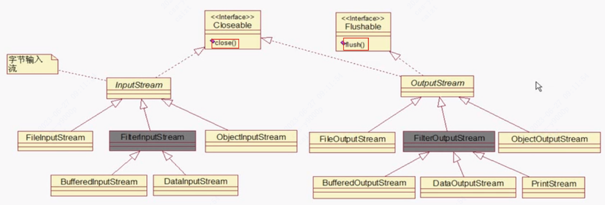
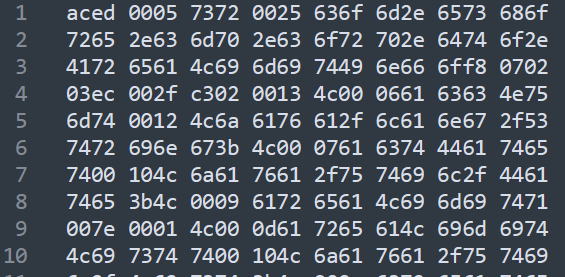
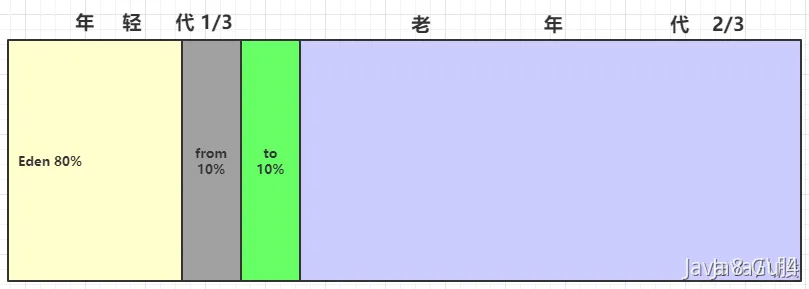
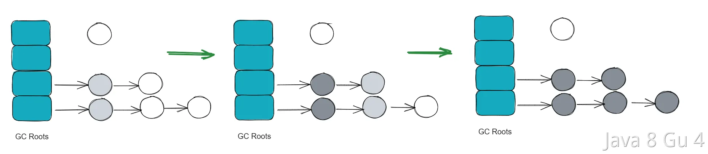
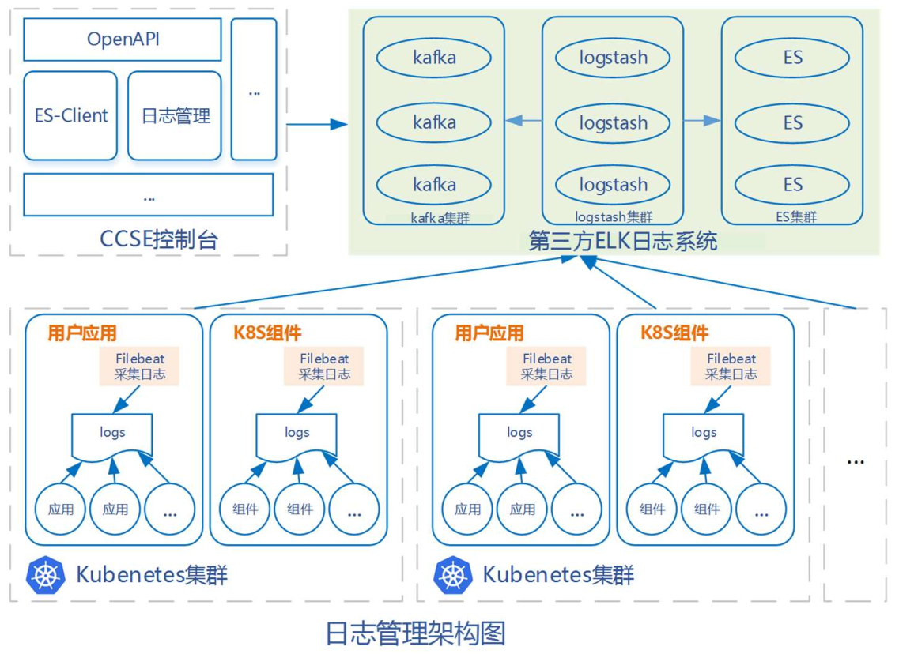

Java高级

# IO

指Input/Output，即输入java内存和输出到外部：

Input指从外部读入数据到内存

Output指把数据从内存输出到外部

**（以下图与文字均只展示in，省略 out，因为基本上是对称的，标红的是缺少对称的，标蓝是常用的）**

主要可分为字节流和字符流：


## 一、字节流

顾名思义以字节**Byte**为单位，主要有两种：

- InputStream：抽象类，所有输入字节流实现继承自它，**只能读不能写**

- OutputStream：抽象类，所有输出字节流实现继承自它，**只能写不能读**

> **注意**：写输入流会导致流关闭，同理读输出流也会导致关闭

继承关系如下



InputStream和OutputStream都继承了Closeable，使用完成后需要关闭，建议用`try(resource)`语法自动关闭流。

### 文件输入流 FileInputStream

构造方法接收一个文件，从文件流中读取数据，调用抽象类的read方法，每次读一个字节并返回int。

```java
public void readFile() throws IOException {
    // 创建一个FileInputStream对象:
    InputStream input = new FileInputStream("src/readme.txt");
    int n;
    while ((n = input.read()) != -1) { // 反复调用FileInputStream的read()方法，直到返回-1表示读到文件末尾
        System.out.println(n); // 打印byte的值
    }
    input.close(); // 关闭流
}
```

上面的问题是发生异常时，InputStream无法关闭，应该在try-finally块中保证关闭。使用try(resource)优化：

```java
public void readFile() throws IOException {
    try (InputStream input = new FileInputStream("src/readme.txt")) {
        int n;
        while ((n = input.read()) != -1) {
            System.out.println(n);
        }
    } // 编译器在此自动为我们写入finally并调用close()
}
```

#### 缓冲区

一次读取一个字节并不是最高效的方法，对于文件和网络流来说，利用**缓冲区**一次性读取多个字节效率要高很多

> 缓冲区是操作系统的一个用于高速IO的区域，缓存了需要IO的若干字节，避免每个字节都IO。并维护一个指针指向未读的缓冲区。当缓冲区全部读完后继续调用`read()`，会触发操作系统下一次读取并再次填满缓冲区。
>
> InputStream读取一个或多个字节，都是从缓冲区读取，该区域已经完成了IO，因此速度较快。

`InputStream`提供了两个重载方法来支持读取多个字节：

- `int read(byte[] b)`：读取若干字节并填充到`byte[]`数组，返回读取的字节数（注意不再是字节的int指）
- `int read(byte[] b, int off, int len)`：指定`byte[]`数组的偏移量和最大填充数

需要先定义一个`byte[]`数组作为缓冲区，`read()`方法会**尽可能多**地读取字节到缓冲区， 但不会超过缓冲区的大小。

```java
public void readFile() throws IOException {
    try (InputStream input = new FileInputStream("src/readme.txt")) {
        // 定义1000个字节大小的缓冲区:
        byte[] buffer = new byte[1000];
        int n;
        while ((n = input.read(buffer)) != -1) { // 读取到缓冲区
            System.out.println("read " + n + " bytes.");
        }
    }
}
```


#### 阻塞

在调用`InputStream`的`read()`方法读取数据时，我们说`read()`方法是**阻塞**（Blocking）的。意思是，对于下面的代码，执行到第二行时，必须等`read()`方法返回后才能继续。因为读取IO流相比执行普通代码，速度会慢很多，因此，无法确定`read()`方法调用到底要花费多长时间。

```java
int n;
n = input.read(); // 必须等待read()方法返回才能执行下一行代码
int m = n;
```


### 过滤器输入流 FilterInpustStream

采用 装饰器模式（包装模式）。顾名思义，过滤器就是给 数据流 后面加个过滤器，然后再通过 过滤器 进行 输入/输出 操作。过滤器会在中间起到特殊处理作用。

FilterInpustStream子类可以分成两类：

- DataInputStream能以一种与机器无关的方式，直接从地从字节输入流读取JAVA基本类型和String类型的数据。

- 其它的子类使得能够对InputStream进行改进，即在原有的InputStream基础上可以提供了新的功能特性。日常中用的最多的就是**BufferedInputStream**，使得inputStream具有缓冲的功能。

> 装饰器模式
>
> 若直接使用继承，为各种`InputStream`附加更多的功能，根本无法控制代码的复杂度，很快就会失控。
>
> 为了解决依赖继承会导致子类数量失控的问题，JDK首先将`InputStream`分为两大类：
>
> - 一类是直接提供数据的基础`InputStream`，例如：FileInputStream、ByteArrayInputStream、ServletInputStream
> - 一类是提供额外附加功能的`InputStream`，例如：BufferedInputStream、DigestInputStream、CipherInputStream
>
> 当我们需要给一个“基础”`InputStream`附加各种功能时，我们先确定这个能提供数据源的`InputStream`，因为我们需要的数据总得来自某个地方，例如，`FileInputStream`，数据来源自文件：
>
> ```
> InputStream file = new FileInputStream("test.gz");
> ```
>
> 紧接着，我们希望`FileInputStream`能提供缓冲的功能来提高读取的效率，因此我们用`BufferedInputStream`包装这个`InputStream`，得到的包装类型是`BufferedInputStream`，但它仍然被视为一个`InputStream`：
>
> ```
> InputStream buffered = new BufferedInputStream(file);
> ```
>
> 最后，假设该文件已经用gzip压缩了，我们希望直接读取解压缩的内容，就可以再包装一个`GZIPInputStream`：
>
> ```
> InputStream gzip = new GZIPInputStream(buffered);
> ```
>
> 无论我们包装多少次，得到的对象始终是`InputStream`，我们直接用`InputStream`来引用它，就可以正常读取：
>
> ```ascii
> ┌─────────────────────────┐
> │GZIPInputStream          │
> │┌───────────────────────┐│
> ││BufferedFileInputStream││
> ││┌─────────────────────┐││
> │││   FileInputStream   │││
> ││└─────────────────────┘││
> │└───────────────────────┘│
> └─────────────────────────┘
> ```
>
> 上述这种通过一个“基础”组件再叠加各种“附加”功能组件的模式，称之为Filter模式（或者装饰器模式：Decorator）。它可以让我们通过少量的类来实现各种功能的组合

### 缓冲区输入流 BufferedInputStream

### 数据输入流 DataInputStream

这个数据流，并非像前面的一样，只能处理字节或字节数组。它允许通过数据流读写各种 Java 基本类型。

创建方式也是经典的装饰器模式。

```java
DataInputStream dis = new DataInputStream(InputStream is);
DataOutputStream dos = new DataOutputStream(OutputStream is);
```

### OutputStream共性方法

子类均继承

1. `public void close()` ：关闭此输出流并释放与此流相关联的任何系统资源。

2. `public void flush()` ：刷新此输出流并强制**缓冲区**的所有输出字节被写出。

   > 为什么要有`flush()`？
   >
   > 因为向磁盘、网络写入数据的时候，出于效率的考虑，操作系统并不是输出一个字节就立刻写入到文件或者发送到网络，而是把输出的字节先放到内存的一个**缓冲区**里（本质上就是一个`byte[]`数组），等到缓冲区写满了，再一次性写入文件或者网络。对于很多IO设备来说，一次写一个字节和一次写1000个字节，花费的时间几乎是完全一样的。因此需要flush方法将缓冲区输出。
   >
   > 通常情况下不需要显式调用，因为缓冲区写满时OutputStream会自动flush，此外调用close关闭时也会自动flush。但某些情况需要显式flush，如网络聊天软件这种高实时性场景，输入一句话点发送时就必须发送，而不能等缓冲区满。

3. `write()`：写一个字节到输出流。

4. `public void write(byte[] b)`：将 b.length个字节从字节数组b写入此输出流。

5. `public void write(byte[] b, int off, int len)` ：从指定的字节数组写入 len字节，从偏移量 off开始输出到此输出流。 **也就是说从off个字节数开始读取一直到len个字节结束**

6. `public abstract void write(int b)` ：将指定的字节输出流。

### 文件输出流 FileOutputStream

如何将若干个字节写入文件流：

```java
public void writeFile() throws IOException {
    OutputStream output = new FileOutputStream("out/readme.txt");
    output.write(72); // H
    output.write(101); // e
    output.write(108); // l
    output.write(108); // l
    output.write(111); // o
    output.close();
}
```

每次写入一个字节非常麻烦，更常见的方法是一次性写入若干字节。这时，可以用`OutputStream`提供的重载方法`void write(byte[])`来实现：

```java
public void writeFile() throws IOException {
    try (OutputStream output = new FileOutputStream("C:/Users/css/Downloads/out.txt")) {
        output.write("Hello".getBytes("UTF-8")); // Hello
    } // 编译器在此自动为我们写入finally并调用close()
}
```

此外可以在已存在的文件基础上，**追加写**文件流，构造方法加参数`append=true`

```java
public void writeFile() throws IOException{
    try (OutputStream output = new FileOutputStream("C:/Users/css/Downloads/out.txt")) {
        output.write("Hello".getBytes("UTF-8"));
    }
    // 对上面的文件，创建追加写文件流
    try (OutputStream output = new FileOutputStream("C:/Users/css/Downloads/out.txt", true)) {
        output.write("World".getBytes("UTF-8")); // HelloWorld
    }
}
```

### PrintStream

`FilterOutputStream`的子类，它在`OutputStream`的接口上，额外提供了一些写入各种数据类型的方法：

- 写入`int`：`print(int)`
- 写入`boolean`：`print(boolean)`
- 写入`String`：`print(String)`
- 写入`Object`：`print(Object)`，实际上相当于`print(object.toString())`

以及对应的一组`println()`方法，它会自动加上换行符。

常用的`System.out.println()`实际上就是使用`PrintStream`打印各种数据。其中，`System.out`是系统默认提供的`PrintStream`，表示标准输出：

```java
System.out.print(12345); // 输出12345
System.out.print(new Object()); // 输出类似java.lang.Object@3c7a835a
System.out.println("Hello"); // 输出Hello并换行
```

`System.err`是系统默认提供的标准错误输出。

`PrintStream`和`OutputStream`相比，除了添加了一组`print()`/`println()`方法，可以打印各种数据类型，比较方便外，它还有一个额外的优点，就是不会抛出`IOException`，使用时就不必捕获该异常。

## 二、字符流

与字节流（byte为单位）的区别在于，字符流以**char**类型为单位

主要也是两种：Reader和Writer

### 字节流与字符流对比

| InputStream                         | Reader                                |
| :---------------------------------- | :------------------------------------ |
| 字节流，以`byte`为单位              | 字符流，以`char`为单位                |
| 读取字节（-1，0~255）：`int read()` | 读取字符（-1，0~65535）：`int read()` |
| 读到字节数组：`int read(byte[] b)`  | 读到字符数组：`int read(char[] c)`    |

| OutputStream                           | Writer                                   |
| :------------------------------------- | :--------------------------------------- |
| 字节流，以`byte`为单位                 | 字符流，以`char`为单位                   |
| 写入字节（0~255）：`void write(int b)` | 写入字符（0~65535）：`void write(int c)` |
| 写入字节数组：`void write(byte[] b)`   | 写入字符数组：`void write(char[] c)`     |
| 无对应方法                             | 写入String：`void write(String s)`       |

### FileReader

是`Reader`的一个子类，它可以打开文件并获取`Reader`

```java
public void readFile() throws IOException {
    // 创建一个FileReader对象:
    Reader reader = new FileReader("src/readme.txt"); // 字符编码是???
    for (;;) {
        int n = reader.read(); // 反复调用read()方法，直到返回-1
        if (n == -1) {
            break;
        }
        System.out.println((char)n); // 打印char
    }
    reader.close(); // 关闭流
}
```

注意，要避免乱码问题，需要在创建`FileReader`时**指定编码**。否则会使用系统编码

```java
Reader reader = new FileReader("src/readme.txt", StandardCharsets.UTF_8);
```

### CharArrayReader

可以在内存中模拟一个`Reader`，它的作用实际上是把一个`char[]`数组变成一个`Reader`，这和`ByteArrayInputStream`非常类似：

```java
try (Reader reader = new CharArrayReader("Hello".toCharArray())) {
}
```

### StringReader

也是在内存中模拟一个`Reader`，可以直接把`String`作为数据源，它和`CharArrayReader`几乎一样：

```java
try (Reader reader = new StringReader("Hello")) {
}
```

### InputStreamReader

> `Reader`和`InputStream`有什么关系？
>
> 除了特殊的`CharArrayReader`和`StringReader`（因为它们的数据源本身就已经是字符），普通的`Reader`实际上是基于`InputStream`构造的，因为`Reader`需要从`InputStream`中读入字节流（`byte`），然后，根据编码设置，再转换为`char`就可以实现字符流。查看`FileReader`的源码，它在内部实际上持有一个`FileInputStream`。
>
> 既然`Reader`本质上是一个基于`InputStream`的`byte`到`char`的转换器，那么，如果我们已经有一个`InputStream`，想把它转换为`Reader`，是完全可行的。`InputStreamReader`就是这样一个转换器，它可以把任何`InputStream`转换为`Reader`。

用于转换字节流为字符流，构造方法接收字节流：

```java
// 持有InputStream:
InputStream input = new FileInputStream("src/readme.txt");
// 变换为Reader:
Reader reader = new InputStreamReader(input, "UTF-8");
...
// 使用完要关闭流
reader.close();
input.close();
```

> 注意流关闭的顺序，应该先关闭**最外层的**。
>
> 如果先关闭input，再关闭reader，会报错IOException：Stream closed。原因是reader使用了input，所以先关闭input，再关闭reader时相当于使用一个已关闭的流。
>
> 或者直接关闭最外层input。

#### 最佳实践

实际上也是层层包裹的**装饰器模式**，使用完毕时只需要关闭最外层的Reader即可，因此可以通过`try (resource)`更简洁地改写如下：

```java
try (Reader reader = new InputStreamReader(new FileInputStream("src/readme.txt"), "UTF-8")) {
    // TODO:
}
```

### OutputStreamWriter

与InputStreamReader对称。除了`CharArrayWriter`和`StringWriter`外，普通的Writer实际上是基于`OutputStream`构造的，它接收`char`，然后在内部自动转换成一个或多个`byte`，并写入`OutputStream`。因此，`OutputStreamWriter`就是一个将任意的`OutputStream`转换为`Writer`的转换器

```java
try (Writer writer = new OutputStreamWriter(new FileOutputStream("readme.txt"), "UTF-8")) {
    // TODO:
}
```

### PrintWriter

`PrintStream`最终输出的总是byte数据，而`PrintWriter`则是扩展了`Writer`接口，它的`print()`/`println()`方法最终输出的是`char`数据。两者的使用几乎一样。

```java
public class Main {
    public static void main(String[] args)     {
        StringWriter buffer = new StringWriter();
        try (PrintWriter pw = new PrintWriter(buffer)) {
            pw.println("Hello");
            pw.println(12345);
            pw.println(true);
        }
        System.out.println(buffer.toString());  // 最终在这打印
    }
}
```

## 三、文件File

Java标准库的`java.io.File`对象表示一个文件或者目录，创建`File`对象需要传入文件路径，但该过程不涉及IO操作。

```java
File file = new File("C:/Users/css/Downloads/out.txt");
System.out.println(file);
```

注意Windows平台使用`\`作为路径分隔符，在Java字符串中需要用`\\`表示一个`\`。Linux平台使用`/`作为路径分隔符。File有一个静态变量`separator`表示当前平台的系统分隔符。

```java
File f = new File("C:\\Windows\\notepad.exe"); // win
File f = new File("/usr/bin/javac"); // linux
System.out.println(File.separator); // 根据当前平台打印"\"或"/"
```

路径可以传入**绝对路径**或**相对路径**。传入相对路径时，相对路径前面加上当前目录就是绝对路径，用`.`表示当前目录，`..`表示上级目录：

```java
// 假设当前目录是C:\Docs
File f1 = new File("sub\\javac"); // 绝对路径是C:\Docs\sub\javac
File f3 = new File(".\\sub\\javac"); // 绝对路径是C:\Docs\sub\javac
File f3 = new File("..\\sub\\javac"); // 绝对路径是C:\sub\javac
```

File对象有3种形式表示的路径

1. getPath()：构造方法传入的路径
2. getAbsolutePath()：绝对路径
3. getCanonicalPath()：规范路径，类似绝对路径

```java
File f = new File("..");  // 当前目录D:\WorkSpace\cmp5g
System.out.println(f.getPath());  // ..
System.out.println(f.getAbsolutePath());  // D:\WorkSpace\cmp5g\cmp-ord\..
System.out.println(f.getCanonicalPath());  // D:\WorkSpace\cmp5g
```


### 文件和目录

`File`对象既可以表示文件，也可以表示目录。但同一个路径只可能是文件或目录，或者都不存在。

- isFile()：判断是否是一个已存在的文件
- isDirectory()：判断是否是一个已存在的目录

>  特别注意
>
> 构造一个`File`对象，即使传入的文件或目录不存在，代码也不会出错，因为构造一个`File`对象，并不会导致任何磁盘操作。只有当我们调用`File`对象的某些方法的时候，才真正进行磁盘操作。

用`File`对象获取到一个文件时，还可以进一步判断文件的权限和大小：

- `boolean canRead()`：是否可读；
- `boolean canWrite()`：是否可写；
- `boolean canExecute()`：是否可执行；
- `long length()`：文件字节大小。

### 创建和删除文件

当File对象表示一个文件时，可以通过`createNewFile()`创建一个新文件，用`delete()`删除该文件：

```java
File file = new File("/path/to/file");
if (file.createNewFile()) {
    // 文件创建成功:
    // TODO:
    if (file.delete()) {
        // 删除文件成功:
    }
}
```


有时程序需要读写一些临时文件，File对象提供了`createTempFile()`来创建一个临时文件，以及`deleteOnExit()`在JVM退出时自动删除该文件。

```java
public static void main(String[] args) throws IOException {
    File f = File.createTempFile("tmp-", ".txt"); // 提供临时文件的前缀和后缀
    f.deleteOnExit(); // JVM退出时自动删除
    System.out.println(f.isFile()); // true
    System.out.println(f.getAbsolutePath()); // C:\Users\css\AppData\Local\Temp\tmp-4429494305733269296.txt
}
```

### 遍历文件和目录

当File对象表示一个目录时，可以使用`list()`和`listFiles()`列出目录下的文件和子目录名。`listFiles()`提供了一系列重载方法，可以过滤不想要的文件和目录：

```java
public static void main(String[] args) throws IOException {
    File f = new File("C:\\Windows");
    File[] fs1 = f.listFiles(); // 1、列出所有文件和子目录
    printFiles(fs1);
    File[] fs2 = f.listFiles(new FilenameFilter() { // 2、过滤，仅列出.exe文件
        public boolean accept(File dir, String name) {
            return name.endsWith(".exe"); // 返回true表示接受该文件
        }
    });
    printFiles(fs2);
}

static void printFiles(File[] files) {  // 辅助打印
    System.out.println("==========");
    if (files != null) {
        for (File f : files) {
            System.out.println(f);
        }
    }
    System.out.println("==========");
}
```

### 获取父级目录

```java
File f2 = new File("C:\\Users\\css\\Downloads\\out.txt");
System.out.println(f2.getParentFile());  // C:\Users\css\Downloads
```


### 创建和删除目录

和文件操作类似，File对象如果表示一个目录，可以通过以下方法创建和删除目录：

- `boolean mkdir()`：创建当前File对象表示的目录；
- `boolean mkdirs()`：创建当前File对象表示的目录，并在必要时将不存在的父目录也创建出来；
- `boolean delete()`：删除当前File对象表示的目录，当前目录必须为空才能删除成功。

### Path

Java标准库还提供了一个`Path`对象，它位于`java.nio.file`包。`Path`对象和`File`对象类似，但操作更加简单

```java
public static void main(String[] args) throws IOException {
    Path p1 = Paths.get(".", "project", "study"); // 构造一个Path对象
    System.out.println(p1);  // .\project\study 
    Path p2 = p1.toAbsolutePath(); // 转换为绝对路径
    System.out.println(p2);  // D:\WorkSpace\cmp5g\cmp-ord\.\project\study	
    Path p3 = p2.normalize(); // 转换为规范路径
    System.out.println(p3); // D:\WorkSpace\cmp5g\cmp-ord\project\study
    File f = p3.toFile(); // 转换为File对象
    System.out.println(f); // D:\WorkSpace\cmp5g\cmp-ord\project\study
    for (Path p : Paths.get("..").toAbsolutePath()) { // 可以直接遍历Path
        System.out.println("  " + p);
    }
}
```

# 序列化

- 对象序列化，将对象以二进制的形式保存在硬盘上。
- 反序列化；将二进制的文件转化为对象读取
- 实现serializable接口，不想让字段放在硬盘上就加**transient**

序列化和反序列化需要遵循相同的协议，如阿里的 fastjson，谷歌的 ProtocolBuf，JDK 原生的序列化（仅适用java，不适用于java于其他语言交互）

## 序列化

把一个Java对象变为`byte[]`数组，需要使用`ObjectOutputStream`。它负责把一个Java对象写入一个字节流：

```java
public class Main {
    public static void main(String[] args) throws IOException {
        ByteArrayOutputStream buffer = new ByteArrayOutputStream();
        try (ObjectOutputStream output = new ObjectOutputStream(buffer)) {
            // 写入int:
            output.writeInt(12345);
            // 写入String:
            output.writeUTF("Hello");
            // 写入Object:
            output.writeObject(Double.valueOf(123.456));
        }
        System.out.println(Arrays.toString(buffer.toByteArray()));// [-84, -19, 0, 5, 119, 11, 0, 0, 48, ......]
    }
}

```

手写序列化，利用jdk实现

```java
public class DefaultMessageProtocol implements MessageProtocol {
    @Override
    public RpcRequest unmarshallingReqMessage(byte[] data) throws Exception {
        ObjectInputStream in = new ObjectInputStream(new ByteArrayInputStream(data));
        return (RpcRequest) in.readObject();
    }

    @Override
    public byte[] marshallingRespMessage(RpcResponse response) throws Exception {
        return serialize(response);
    }
  
   private byte[] serialize(Object obj) throws Exception {
        ByteArrayOutputStream baos = new ByteArrayOutputStream();
        ObjectOutputStream out = new ObjectOutputStream(baos);
        out.writeObject(obj);
        return baos.toByteArray();
    }
}
```

## 反序列化

和`ObjectOutputStream`相反，`ObjectInputStream`负责从一个字节流读取Java对象：

```java
try (ObjectInputStream input = new ObjectInputStream(...)) {
    int n = input.readInt();
    String s = input.readUTF();
    Double d = (Double) input.readObject();
}
```

> 注意：反序列化时，由JVM直接构造出Java对象，**不调用构造方法**，构造方法内部的代码，在反序列化时根本不可能执行。

安全性：因为Java的序列化机制可以导致一个实例能直接从`byte[]`数组创建，而不经过构造方法，因此，它存在一定的安全隐患。一个精心构造的`byte[]`数组被反序列化后可以执行特定的Java代码，从而导致严重的安全漏洞。

实际上，Java本身提供的基于对象的序列化和反序列化机制既存在安全性问题，也存在兼容性问题。更好的序列化方法是通过JSON这样的通用数据结构来实现，只输出基本类型（包括String）的内容，而不存储任何与代码相关的信息。

## serialVersionUID

用于**验证版本一致性**。

如果一个类实现了Serializable接口，就必须定义serialVersionUID，如果该类没有定义serialVersionUID，接口会默认生成一个。

但是强烈建议用户自定义一个serialVersionUID，且**不能更改**，否则反序列化时报InvalidClassException异常。

例如：

1、先进行序列化，然后在反序列化之前修改了类，那么就会报错。因为修改了类，对应的SerialversionUID也变化了，而序列化和反序列化就是通过对比其SerialversionUID来进行的，一旦SerialversionUID不匹配，反序列化就无法成功。

```java
public static void main(String[] args)  {
    AreaLimitInfo obj = new AreaLimitInfo();
    obj.setAreaLimit("安徽");
    try (ObjectOutputStream oos = new ObjectOutputStream(new FileOutputStream("tempFile"))){
        oos.writeObject(obj);  // 对象写入文件
    } catch (IOException e) {
        e.printStackTrace();
    }
}
```

写入的tempFile大概如下：



2.1、修改AreaLimitInfo类 的 serialVersionUID，574488211598856253L 改为 574488211598856258L，然后反序列化：

```java
public class AreaLimitInfo implements Serializable {
    // private static final long serialVersionUID = -574488211598856253L;
    private static final long serialVersionUID = -574488211598856258L;
    ...
}
public static void main(String[] args) {
    try (ObjectInputStream ois = new ObjectInputStream(new FileInputStream("tempFile"))){
        AreaLimitInfo obj = (AreaLimitInfo) ois.readObject();  // 从文件读出对象
        System.out.println(obj);  // com.eshxxx.cmp.corp.dto.AreaLimitInfo@4f4a7090
    } catch (IOException | ClassNotFoundException e ) {
        e.printStackTrace();
    }
}
```

此时会报错：

```
java.io.InvalidClassException: com.eshxxx.cmp.corp.dto.AreaLimitInfo; local class incompatible: stream classdesc serialVersionUID = -574488211598856253, local class serialVersionUID = -574488211598856258
```

可以看到抛出InvalidClassException异常，且指出序列化前后的serialVersionUID不一致。

2.2、将serialVersionUID还原为序列化时的值，才能正常反序列化

# JUnit单元测试

JUnit是事实上的单元测试的标准框架。JUnit能给出成功和失败的测试，还可以生成测试报告，统计测试的成功率、测试的**代码覆盖率**等。高质量的代码，测试覆盖率应该在**80%以上**。

好处：确保单个方法按照正确预期运行；修改代码后，只需确保对应的单元测试通过。便于组织测试代码，并随时运行。

规范：

1. 单元测试代码本身必须非常简单，能一下看明白，决不能再为测试代码编写测试；
2. 每个单元测试应当互相独立，不依赖运行的顺序；
3. 测试时不但要覆盖常用测试用例，还要特别注意测试边界条件，例如输入为`0`，`null`，空字符串`""`等情况。

## 使用

在要测试的方法上加`@Test`注解，方法内部调用`assertEquals(1, Factorial.fact(1))`表示，期望`Factorial.fact(1)`返回`1`。

```java
public class FactorialTest {
    @Test
    void testFact() {
        assertEquals(1, Factorial.fact(1));
        assertEquals(2, Factorial.fact(2));
        assertEquals(6, Factorial.fact(3));
        assertEquals(3628800, Factorial.fact(10));
        assertEquals(2432902008176640000L, Factorial.fact(20));
    }
}
```

`Assertion`定义了各种断言方法：

- `assertEquals(expected, actual)`：**（常用）**判断actual是否与expected相等。

- `assertTrue(condition)`: **（常用）**期待condition为`true`

  有重载方法`assertTrue(boolean condition, String message)`：如果condition**不为true**，输出message

- `assertFalse()`: 期待结果为`false`

- `assertNotNull()`: 期待结果为非`null`

- `assertArrayEquals()`: 期待结果为数组并与期望数组每个元素的值均相等


## 使用Fixture

JUnit提供了编写测试前准备、测试后清理的固定代码，我们称之为Fixture（JUnit5 推出）。

1. @BeforeEach：用于表示应在**当前类中的每个`@Test`方法之前**执行注解方法。
2. @AfterEach：用于表示应在**当前类中的每个`@Test`方法之后**执行注解方法。
3. @BeforeAll：在所有`@Test`方法运行前，仅运行一次。
4. @AfterAll：在所有`@Test`方法运行后，仅运行一次。

> 因为`@BeforeAll`和`@AfterAll`在所有`@Test`方法运行前后仅运行一次，因此它们只能初始化静态变量。

最佳实践：

- 对于实例变量，在`@BeforeEach`中初始化，在`@AfterEach`中清理，它们在各个`@Test`方法中互不影响，因为是不同的实例；
- 对于静态变量，在`@BeforeAll`中初始化，在`@AfterAll`中清理，它们在各个`@Test`方法中均是唯一实例，会影响各个`@Test`方法。

### Q：这些注解的实现原理？

只能是AOP，基于动态代理。因此到每次运行一个`@Test`方法前，JUnit首先创建一个`XxxTest`实例，所以每个`@Test`方法，内部的成员变量都是独立的，无法将成员变量的状态带到其他`@Test`方法。

换句话说，每个`@Test`方法各自独立，互不影响，这也体现了“单元测试”的思想。


## 异常测试

除了正常的输入输出，有时要针对可能导致异常的情况进行测试。

例如以下方法，如果为负数，则直接抛出`IllegalArgumentException`：

```java
public class Factorial {
    public static long fact(long n) {
        if (n < 0) {
            throw new IllegalArgumentException();
        }
        long r = 1;
        for (long i = 1; i <= n; i++) {
            r = r * i;
        }
        return r;
    }
}
```

现在想对这种异常情况进行测试，使用`assertThrows()`来期望捕获一个指定的异常。第二个参数`Executable`封装了我们要执行的会产生异常的代码。执行`Factorial.fact(-1)`时，必定抛出`IllegalArgumentException`。`assertThrows()`在捕获到指定异常时表示通过测试，未捕获到异常，或者捕获到的异常类型不对，均表示测试失败：

```java
@Test
void testNegative() {
    // Executable用lambda简化
    assertThrows(IllegalArgumentException.class, () -> {
        Factorial.fact(-1);  
    });
}
```


## Spring单元测试

Spring的JUnit单元测试并不一定需要启动容器。在Spring中可以使用两种不同类型的单元测试，需要根据具体测试需求来决定是否启动容器：

1. 基础JUnit测试：这种测试不需要启动容器，可以直接测试组件类（如Service、Controller等）的逻辑。

   > 可以使用@Test注解标记测试方法，并使用JUnit提供的断言方法（如assertEquals、assertTrue）进行测试。

2. 带有Spring容器的JUnit测试：这种测试需要启动Spring容器，以便能够测试组件类与容器中其他组件的交互。

   >  可以使用@RunWith(xxx.class)和@SpringBootTest注解标记测试类

# JDBC

## 基本使用

Connection代表一个JDBC连接，它相当于Java程序到数据库的连接（通常是TCP连接）。打开一个Connection时，需要准备URL、用户名和口令，才能成功连接到数据库。

依赖，引入JDBC驱动：

```xml
<dependency>
    <groupId>mysql</groupId>
    <artifactId>mysql-connector-java</artifactId>
    <version>5.1.47</version>
    <scope>runtime</scope>
</dependency>
```

代码：

```java
// JDBC连接的URL, 不同数据库有不同的格式:
// 参数分别为：使用uniCode编码、编码格式为utf8、不使用SSL加密
String JDBC_URL = "jdbc:mysql://localhost:3306/cmp_corp?useUnicode=true&characterEncoding=UTF-8&useSSL=false";
String JDBC_USER = "root";
String JDBC_PASSWORD = "password";
// 使用try (resource)语法，自动关闭
// 1. 建立连接
try (Connection conn = DriverManager.getConnection(JDBC_URL, JDBC_USER, JDBC_PASSWORD)) {
    // 2. 创建Statement
    try (Statement stmt = conn.createStatement()) {
        // 3. 执行SQL，并用ResultSet接收结果
        try (ResultSet rs = stmt.executeQuery("SELECT id, grade, name, gender FROM students WHERE gender=1")) {
            while (rs.next()) {
                long id = rs.getLong(1); // 注意：查询结果的索引从1开始
                long grade = rs.getLong(2);
                String name = rs.getString(3);
                int gender = rs.getInt(4);
            }
        }
    }
}
```

## 防止SQL注入

正常的SQL：

```sql
SELECT * FROM user WHERE login='bob' AND pass='1234'
```

用户可能通过精心构造的字符串，拼出意想不到的SQL，如传入login= `"bob' OR pass="`, pass = `" OR pass='"`：

```sql
SELECT * FROM user WHERE login='bob' OR pass=' AND pass=' OR pass=''
```

**解决**

本质上，只要将引号`'`转义，就能防止拼接。

JDBC提供了`PreparedStatement`，替换上面使用的`Statement`：

```java
try (Connection conn = DriverManager.getConnection(JDBC_URL, JDBC_USER, JDBC_PASSWORD)) {
    // SQL用'?'占位
    try (PreparedStatement ps = conn.prepareStatement("SELECT id, grade, name, gender FROM students WHERE gender=? AND grade=?")) {
        ps.setObject(1, "M"); // 填充占位符。注意：索引从1开始
        ps.setObject(2, 3);
        try (ResultSet rs = ps.executeQuery()) { // 读取查询结果
            while (rs.next()) {
                long id = rs.getLong("id");
                long grade = rs.getLong("grade");
                String name = rs.getString("name");
                String gender = rs.getString("gender");
            }
        }
    }
}
```

## 连接池

JDBC连接池有一个标准的接口`javax.sql.DataSource`，但只是接口，没有实现。常用的JDBC连接池有：HikariCP、C3P0、BoneCP、Druid等。最常用的是HikariCP

依赖：

```xml
<dependency>
    <groupId>com.zaxxer</groupId>
    <artifactId>HikariCP</artifactId>
    <version>2.7.1</version>
</dependency>
```

代码：

```java
// 设置连接池配置
HikariConfig config = new HikariConfig();
config.setJdbcUrl("jdbc:mysql://localhost:3306/test");
config.setUsername("root");
config.setPassword("password");
config.addDataSourceProperty("connectionTimeout", "1000"); // 连接超时：1秒
config.addDataSourceProperty("idleTimeout", "60000"); // 空闲超时：60秒
config.addDataSourceProperty("maximumPoolSize", "10"); // 最大连接数：10
// 使用配置创建连接池
DataSource ds = new HikariDataSource(config);
// 获取连接，由前面的DriverManage.getConnection()，改为从连接池获取连接
try (Connection conn = ds.getConnection()) { 
    ...
}
```

连接池内部维护了若干个`Connection`实例，如果调用`ds.getConnection()`，就选择一个**空闲连接**，并标记它为“正在使用”然后返回。

调用`conn.close()`时（try-with-resource语句隐式执行），不是真正“关闭”连接，而是释放到连接池中，以便下次获取连接时能直接返回。

配置参数：维护的最小、最大活动连接数，指定一个连接在空闲一段时间后自动关闭等。


# JVM

意义：从软件层面屏蔽不同操作系统在底层硬件与指令上的区别（一次编译，处处运行）。而没有虚拟机的语言，如c++，在win和linux上执行要编译为不同的程序。

java源码编译为字节码（用javac命令）后，还是不能直接执行，要由JVM解释为CPU能执行的机器码。

因此Java不能简单划分为编译型或解释型语言。

## JIT

当JVM发现某段java代码执行频繁时，认为这是热点代码，通过**JIT**（Just In Time，即时编译）将其直接翻译为机器码，并进行**优化**和**缓存**。经过JIT优化的代码执行效率媲美C++。

JIT实现有两种：

1. 基于采样：周期性检测各线程栈顶，发现某方法经常出现在栈顶，则认为是热点方法。优点是简单，缺点是无法精确计量一个方法的热度，容易受线程阻塞干扰
2. 基于计数器（**HotSpot**使用该方法）：为每个方法，甚至是代码块设置计数器，统计执行次数，超过阈值就认为是热点方法。有两种计数器：
   - 方法计数器：记录方法被调用次数
   - 回边计数器：记录方法中for或while循环执行次数


JIT对代码的优化：**逃逸分析**、**锁消除**、锁膨胀、**标量替换&栈上分配**、**方法内联**、空值检查消除、类型检测消除、公共子表达式消除。

### 逃逸分析

对象基于逃逸分析（Escape Analysis）有三种状态：

1. 全局逃逸：对象超出了方法或线程的范围，如存储在静态字段，或作为方法的返回值输出到方法外部

   ```java
   public class GlobalEscapeExample {
       private static Object staticObj;
       public void globalEscape() {
       	staticObj = new Object(); // 这个对象赋值给静态字段，因此它是全局逃逸的
       }
       
       public static StringBuffer createStringBuffer(String s1, String s2) {
           StringBuffer sb = new StringBuffer();
           sb.append(s1);
           sb.append(s2);
           return sb;  // 对象创建后作为方法返回值，也是全局逃逸
       }
   }
   ```

   

2. 参数逃逸：对象作为参数传递，或被参数引用。但在方法调用期间不会全局逃逸

   ```java
   public class GlobalEscapeExample {
   	public void methodA() {
           Object localObj = new Object();
           methodB(localObj);  // localObj作为参数从methodA方法传递到methodB方法，发生参数逃逸。
       }
       public void methodB(Object param) {
           // 但不会从methodB方法中逃逸
       }
   }
   ```

   

3. 无逃逸：对象可以被标量替换，意味着它的内存分配可以从生成的代码中移除

   ```java
   public static StringBuffer createStringBuffer(String s1, String s2) {
           StringBuffer sb = new StringBuffer();
           sb.append(s1);
           sb.append(s2);
           return sb.toString();  // 返回值不是sb对象引用，不发生逃逸
       }
   ```

   

### 锁消除

### 标量替换&栈上分配

> **标量**（Scalar）指一个无法再分解成更小数据的数据。例如Java中的**原始数据类型**就是标量。
>
> 相对的，那些还可以分解的数据叫 **聚合量**（Aggregate），例如对象，可以分解为标量和聚合量。

- **标量替换**：JIT阶段，如果经过**逃逸分析**，发现某对象不会被外界访问，则经过JIT优化，会把该对象拆解为若干标量。

  标量替换之后就便于栈上分配了。

- **栈上分配**：方法中创建的对象，如果是**无逃逸**[见【逃逸分析】第3点](#逃逸分析)的，则可以对其内存分配进行优化，将堆上分配改为栈上分配。


例如如下代码，在alloc方法中创建100万个User对象，且该对象是无逃逸的：

```java
public class StackAllocTest {
    public static void main(String[] args) {
        long a1 = System.currentTimeMillis();
        for (int i = 0; i < 1000000; i++) {
            alloc();
        }
        // 查看执行时间
        long a2 = System.currentTimeMillis();
        System.out.println("cost " + (a2 - a1) + " ms");
        // 为了方便查看堆内存中对象个数，线程sleep
        try {
            Thread.sleep(100000);
        } catch (InterruptedException e) {
            e.printStackTrace();
        }

    }
    private static void alloc() {
        User user = new User();
    }
}
```

指定以下JVM参数运行：

```java
-Xmx4G -Xms4G -XX:+PrintGCDetails -XX:+HeapDumpOnOutOfMemoryError
```

在程序打印cost XX ms后，代码运行结束前，使用`[jmap][1]`命令查看当前堆内存情况，可以看到堆中创建了100万个`StackAllocTest$User`实例。

```
➜  ~ jps
2809 StackAllocTest
2810 Jps
➜  ~ jmap -histo 2809

 num     #instances         #bytes  class name
----------------------------------------------
   1:           524       87282184  [I
   2:       1000000       16000000  StackAllocTest$User
   3:          6806        2093136  [B
   4:          8006        1320872  [C
   5:          4188         100512  java.lang.String
   6:           581          66304  java.lang.Class
```

则开启JVM逃逸分析后：

```java
-Xmx4G -Xms4G -XX:+DoEscapeAnalysis -XX:+PrintGCDetails -XX:+HeapDumpOnOutOfMemoryError
```

可以看到User实例数降到8万（为什么不降为0？因为虽然由堆上分配改为栈上分配，但线程的栈内存是有限的，-xss）：

```
➜  ~ jps  // jps命令，查看本机jvm进程
709
2858 Launcher
2859 StackAllocTest  // pid=2859，进程名StackAllocTest（默认为main方法类名）
2860 Jps
➜  ~ jmap -histo 2859  // jmap命令， -histo：打印每个class的实例数、内存占用、类全名。2859是进程pid

 num     #instances         #bytes  class name
----------------------------------------------
   1:           524      101944280  [I
   2:          6806        2093136  [B
   3:         83619        1337904  StackAllocTest$User
   4:          8006        1320872  [C
   5:          4188         100512  java.lang.String
   6:           581          66304  java.lang.Class
```


### 方法内联

将方法的代码直接插入调用的地方，减少方法调用的开销。适用于规模小且频繁调用的方法。

```java
public class InlineExample {
    public int add (int a, int b) {
        return a+b;
    }
    public void exampleMethod() {
        int result = add(1, 2);  // 调用add方法
    }
    // 上面两个方法可以改写为内联方法
    public void inlineMethod() {
        int result = 1 + 2;  // 调用的add方法很简单，直接将add的逻辑拿过来
    }
}
```


### JIT优化带来的问题

问题：JIT优化之前，对Java应用的所有请求，都要经过解释执行，该过程较耗时。如果请求量大，慢的更明显，解释器对CPU资源占用更多，间接导致CPU、LOAD等飙高，进而导致引用性能进一步下降。这也就是很多应用刚重启时大量超时的原因。

随着请求不断增多，JIT优化触发，后续的热点请求就可能不需要解释执行，直接运行JIT优化后缓存的机器码了。

解决：

1. 提升JIT优化效率，如阿里JDK：DragonWell，使用JwarmUp技术，用文件记录Java应用上一次运行时编译信息，下次Java启动时读取该文件，在流量来之前提前完成类加载、初始化和方法编译
2. 预热。在应用刚启动时只切给部分小流量，触发JIT优化，之后再慢慢调大。


## JVM模型

这段代码运行时的jvm模型如下图

```java
public class Math {
    public static final int initDate = 666;
    public User user = new User();

    public Math() {
    }

    public int compute() {
        int a = 1;
        int b = 2;
        int c = (a + b) * 3;
        return c;
    }

    public static void main(String[] args) {	// 主函数调用compute
        Math math = new Math();
        math.compute();
    }
}
```


### 线程私有区域

图中蓝色区域（栈、本地方法栈、程序计数器）。

例如，执行main方法的主线程会在内存中开启一片区域，存放其私有的程序计数器、虚拟机栈、本地方法栈等，如图左边所示，框住只是为了说明其逻辑上的关系，物理上并不在一起。

1. 虚拟机栈 VM Stack

   又称栈 or 线程栈。创建一个线程就在虚拟机栈中分配一块私有的栈，每个线程中的方法**调用**又会在本栈中创建一个**栈帧**。存储局部变量、对象指针、操作数栈、动态链接、方法出口。

   - 局部变量表： 存放着方法中的局部变量，包括基本类型和引用类型。在编译期间就已确定空间大小，运行期间大小不变。

   - 操作数栈：用来操作方法中的数的一个临时栈

   - 动态链接： 把符号引用（字面量，例如方法名）转换为直接引用（指针，指向真实地址）存在内存空间中

   - 方法出口：记录该方法调用完毕应该回到的地方 (放到我们这个例子中就是回到Main函数的下一行)

   栈由多个栈帧组成，栈帧具有栈数据结构FIFO的特性，栈顶存放**当前执行方法**的栈帧，下一层调用上一层。

   JVM为这个区域规定了两种异常状况：

   - StackOverflowError：线程请求的栈深度大于虚拟机所允许的深度时抛出；
   - OutOfMemoryError：虚拟机栈无法申请到足够的内存时抛出。

2. 本地方法栈 Native Method Stack

   为JVM使用的Native方法（C、C++代码）提供运行空间，存储JNI（Java Native Interface）指针。功能上与虚拟机栈是类似。

   该区域JVM也规定了StackOverflowError和OutOfMemoryError异常。

3. 程序计数器 Program Counter Register

   当前线程所执行的**字节码的行号**指示器，指向下一条要执行的命令。方法执行完返回时必须要用到。

   该区域没有规定任何异常。

### 线程共享区域

图中黄色区域（堆、方法区），虽然逻辑上分区，但**物理上是连续的区域**。


1. 堆 Heap

   存储所有对象实例。JVM的垃圾回收主要发生在该区域。（与栈具有数据结构FIFO特性不同，jvm的堆和数据结构的堆没有关系）

   从结构上，堆被划分为新生代和老年代；而新生代又分为Eden区、To Survivor区（s0）、From Survivor区（s1），大小比例为**8:1:1**。

   

   当堆中没有内存可供完成实例分配，且堆也无法再扩展时，将会抛出OutOfMemoryError异常。

2. 方法区 Method Area

   存储类的静态信息（.class）、常量、**静态变量**（存指针，指向堆）、即时编译（JIT）产生的代码

   由于HotSpot虚拟机将GC算法拓展到了该区域，因此方法区有时也被称为**永久代**（Permanent Generation），1.8之后改称**元空间**（Metaspace）。

   和新生代、老年代一样，永久代也是可能会发生GC的，当方法区内存分配超过限制的最大值，将抛出OutOfMemoryError异常。

   - **运行时常量池**

     是方法区的一部分。Class 文件中的常量池（编译器生成的字面量和符号引用）会在类加载后被放入这个区域。

     除了在编译期生成的常量，还允许动态生成，例如 String 类的 intern()。

**直接内存**

JDK 1.4 中新引入了 NIO 类，它可以使用 Native 函数库直接分配**堆外内存**，然后通过 Java 堆里的 DirectByteBuffer 对象作为这块内存的引用进行操作。这样能在一些场景中显著提高性能，因为避免了在堆内存和堆外内存来回拷贝数据。

#### Q：Java对象一定在堆上分配吗？

不一定，如果没开启逃逸分析，那对象根据常识，在堆上分配内存。

如果开启了逃逸分析：

```java
-Xmx4G -Xms4G -XX:+DoEscapeAnalysis -XX:+PrintGCDetails -XX:+HeapDumpOnOutOfMemoryError
```

若该对象是无逃逸的，则JIT优化后，堆内存分配的对象会大大减少，优化至栈上分配。[（见：标量替换&栈上分配）](#标量替换&栈上分配)


### JVM模型的版本更新

jdk1.7版本中，将字符串常量池从方法区移动到了堆中，避免方法区内存有限从而出现OOM错误。

jdk1.8版本则将方法区从运行时内存移动到了本地内存中，方法区不再与堆相连。


## 垃圾回收（GC）

就是将没有引用的对象回收，主要是针对堆和方法区进行，这些区域是**线程共享**的。

程序计数器、虚拟机栈和本地方法栈这三个区域属于**线程私有**的，只存在于线程的生命周期内，线程结束之后就会消失，因此不需要回收。


新生代与老年代是1：3；

新生代包括eden区、s0和s1（Survivor缩写），大小比例是8：1：1。

### Minor GC 和 Full GC

HotSpot虚拟机中的GC可分为两种：Partial GC和Full GC。

- YGC（Young GC，或minor GC）：对新生代堆gc，在eden区（也包含某个s0/s1）满时发生。使用**拷贝算法**，频率较高，性能耗费小

- FGC（Full GC，或Major GC）：全堆（新生代+老年代）范围gc，在老年代满时发生。使用**标记压缩**算法，比YGC慢。需要两类垃圾收集器结合使用。

  FGC触发时机：

  1. 手动调用System.gc
  2. 在Minor GC之后，若JVM判断老年代的连续内存空间已少于先前每次Minor GC结束后晋升至老年代的对象总大小的平均值，则JVM会进行Full GC（具体的判断逻辑随着收集器不同有所区别）；
  3. 方法区（永久代）的空间不足时。

  

### 堆对象生命周期

1. 新建对象，默认先放入eden区，此时年龄为0。

   - eden区放满，触发YGC，还存活的对象放入s0，且年龄+1。

   - eden区放不下（大对象，如长字符串或数组），直接放老年代。

     `-XX:PretenureSizeThreshold`，大于此值的对象直接放老年代

2. 下一次YGC，扫描并回收eden + s0，还存活的对象放s1，且年龄+1（也就是每次YGC，存活的交替放入s0或s1）。

   YGC之后的结果放不下s区，则放入老年代[**见：空间分配担保**]()

   因此YGC有三种情况，根据剩余的存活对象大小：

   1. 小于Survivor区：直接进入另一个Survivor区。
   2. 大于Survivor区并且小于老年代可用内存：去老年代。
   3. 大于Survivor并且大于老年代：触发FullGC。

3. 当**年龄到达阈值**时（一般默认15，CMS是6），放入老年代。该阈值可以用`-XX:MaxTenuringThreshold`指定

   若YGC的存活对象s区装不下，不管年龄多少，**多余的**直接放入老年代。见下文[对象年龄动态判断机制](#####对象年龄动态判断机制)。

4. 当老年代放满，触发FGC

> 空间分配担保
>
> 在每一次执行YoungGC之前，JVM会检查老年代最大可用的连续空间是否大于新生代所有对象的总空间。如果大于，那么说明本次Young GC是安全的。
>
> 如果小于，那么虚拟机会查看HandlePromotionFailure 参数设置的值判断是否允许担保失败。如果值为true，那么会继续检查老年代最大可用连续空间是否大于历次晋升到老年代的对象的平均大小（一共有多少对象在内存回收后存活下来是不可预知的，因此只好取之前每次垃圾回收后晋升到老年代的对象大小的平均值作为参考）。如果大于，则尝试进行一次YoungGC，但这次YoungGC依然是有风险的；如果小于，或者HandlePromotionFailure=false，则会直接触发一次Full GC。
>
> 注意：HandlePromotionFailure这个参数，在JDK 7中就不再支持了。在后续的版本中， 只要检查老年代最大可用连续空间是否大于**历次晋升到老年代的对象的平均大小**，如果大于，则认为担保成功。

#### 对象年龄动态判断机制

当单个 Survivor 区所有**小于等于某个年龄N的对象**占用超过 50% (`-XX:TargetSurvivorRatio`)，则年龄大于等于N的对象，即使没到阈值，也直接放入老年代。例如50%的对象最大年龄为8，则年龄>8的放入老年代。

```c++
uint ageTable::compute_tenuring_threshold(size_t survivor_capacity) {
    size_t desired_survivor_size = (size_t)((((double) survivor_capacity)*TargetSurvivorRatio)/100);
    size_t total = 0;
    uint age = 1;
    while (age < table_size) {
        total += sizes[age];
        if (total > desired_survivor_size) break;
        age++;
    }
    uint result = age < MaxTenuringThreshold ? age : MaxTenuringThreshold;
    ...
}
```


#### Q：JVM如何判断对象存活？

1. 引用计数法

   为每个对象设置一个引用计数器，每当有引用时，计数器+1，引用失效时计数器-1。当对象引用为0时，判断对象失效。

   - 优点：实现简单，效率高；

   - 缺点：难以解决垃圾对象间循环引用，但实际上已经无法寻址的情况。

2. **根可达**分析法

   从**GC Roots**出发，与之直接或间接关联的对象就是有效对象，反之就是无效对象。

   可作为GC Roots的对象包括：

   - 虚拟机栈中引用的对象（局部变量）
   - 方法区中类静态属性引用的对象（静态变量）
   - 方法区中常量引用的对象（常量）
   - 本地方法栈中JNI引用的对象（JNI指针）

#### Q：Minor GC如何避免全堆扫描？

由于**老年代的对象可能引用新生代的对象**，在标记存活对象的时候，需要扫描老年代的对象，如果该对象拥有对新生代对象的引用，那么这个引用也会被作为 GC Roots。这相当于就做了**全堆扫描**。

HotSpot虚拟机通过**卡表**技术避免Minor GC触发全堆扫描。具体策略是将老年代的空间分成大小为 512B的若干张卡，并且维护一个卡表。卡表本身是字节数组，数组中的每个元素对应着一张卡，本质上就是维护一个标识位，这个标识位代表对应的卡是否可能存有指向新生代对象的引用，如果可能存在，那么这张卡就是所谓的**脏卡**。

在进行Minor GC的时候，只需要在卡表中寻找脏卡，并将脏卡中的老年代指向新生代的引用加入到GC Roots中，当完成所有脏卡的扫描之后，将所有脏卡的标识位清零。


#### Q：yGC频繁原因？

eden区设置太小；对象创建太频繁；

其他情况不会单纯引起ygc，也会导致fgc


#### Q：为什么需要两个Survivor区？

如果只用一个s0，则一次YGC的范围是eden + s0，结果存哪里？如果用标记复制算法，则必须找一块eden + s0以外的区域存储gc后的结果。如果用标记清除算法则存在碎片问题，用标记整理会有效率问题。

所以好的办法是使用标记复制算法，将gc结果存放另一块区域s1。

#### Q：被标记为失效的对象是否一定会被回收？

被标记为失效的对象被回收前会经历如下步骤：

1. JVM判断对象是否重写了finalize()方法：

   - 若重写了finalize()，则将其放入F-Queue队列中；
   - 若未重写，则直接回收。

2. 执行队列中的finalize()方法：

   JVM自动创建一个优先级较低的线程执行队列中的finalize()方法，只负责触发，不保证执行完毕。若finalize()方法执行了耗时操作，则JVM会停止执行方法并立刻回收对象。

3. 对象销毁/重生：

   若finalize()方法中将this赋值给了某个引用，则该对象会重生，否则会被回收。

#### Q：为什么年龄达15时放入老年代？

因为对象markword中的分代年龄用4bit表示，最大15

对象内存布局


markword结构（64位系统中是8B=64bit）


#### Q：JVM如何保证给对象分配内存过程的线程安全？

jvm给对象分配内存的过程：

1. 如果JIT的逃逸分析后该对象没有逃逸，那么可能优化到栈上分配——不存在线程安全问题（栈是线程独享的）。

2. 否则对象主要分配到新生代上，如果启动了**TLAB**，则分配到TLAB中——不存在线程安全问题。

3. 最后才会在堆上分配内存，如果同一块堆内存空间被多个线程同时分配对象，JVM会采用**CAS+失败重试**的方式来避免线程问题。

> **TLAB：Thread Local Allocation Buffer，线程本地分配缓存。**
>
> 是JVM在堆内存的**eden区**划分出来的一块专用空间，是线程专属的。在虚拟机的TLAB功能启动的情况下，在线程初始化时，虚拟机会为每个线程分配一块TLAB空间，只给当前线程使用，这样每个线程都单独拥有一个空间，如果需要分配内存，就在自己的空间上分配，这样就不存在竞争的情况，可以大大提升分配效率。
>
> 所以说，因为有了TLAB技术，**堆内存并不是完全的线程共享**，其eden区域中还是有一部分空间是分配给线程独享的。注意这里的独享只是”分配“上独享，对于读取、垃圾回收等动作，堆内存是线程共享的。

### 垃圾回收算法

1. 标记清除：优点是时间短。缺点是不连续，有碎片。只有CMS使用

   

2. （标记）拷贝算法：优点是无碎片，缺点是浪费空间

   

3. 标记整理（标记压缩）：优点是无碎片，缺点是时间长

   

> 回收器主要使用2和3：
>
> 年轻代回收器适合使用标记拷贝，而且用两个Survivor区解决拷贝问题
>
> 老年代回收器通常使用标记整理。但CMS使用标记清除

### 主流垃圾收集器


实线连接表示配合使用。分类方法有串行/并行，年轻代/老年代/不分代：

- 串行垃圾回收器：Serial GC， Serial Old

- 并行垃圾回收器：Parallel Scavenge，Parallel Old，ParNew

- 并发标记扫描垃圾回收器：CMS

  

发展路线：内存越来越大，**STW**时间越来越短。从分代到不分代。

|                   | 管理内存 | STW时间 |
| ----------------- | -------- | ------- |
| Serial            | 几十M    |         |
| Parallel Scavenge | 几个G    |         |
| CMS               | 几十G    | 200ms   |
| G1                | 上百G    | 10ms    |
| ZGC               | 4TB      | 1ms     |


#### JVM默认回收器

- 1.7和1.8：PS+PO （Parallel Scavenge + Parallel Old）
- 1.9：G1

#### Q：为什么要STW机制？

如果不暂停线程，让其继续执行，会破坏GC Root的依赖关系，导致某些对象被回收，增加gc的复杂性。

有时我们需要全局所有线程进入 SafePoint， 这样才能统计出那些内存还可以回收用于 GC，以及回收不再使用的代码清理 **CodeCache**，以及执行某些 Java instrument 命令或者 JDK 工具（例如 jstack 打印堆栈就需要 Stop the world 获取当前所有线程快照）。

> **STW**
>
> stop the world的简写，停止所有用户线程，所有线程进入**SafePoint**等待。
>
> STW 阶段可以简单分为（这段时间内，JVM 都是处于所有线程进入 Safepoint 就 block 的状态）：
>
> 1. 某个操作，需要 Stop the world（就是上面提到的哪些情况下会让所有线程进入 SafePoint， 即发生 Stop the world 的那些操作）
> 2. 向 Signal Dispatcher 这个 JVM 守护线程发起 Safepoint 同步信号并交给对应的模块执行。
> 3. 对应的模块，采集所有线程信息，并对每个线程根据状态做不同的操作以及标记（根据之前源代码那一块的描述，有5种情况）
> 4. 所有线程都进入 Safepoint 并 block。
> 5. 做需要发起 Stop the world 的操作。
> 6. 操作完成，所有线程从 Safepoint 恢复。

#### Q：什么情况会导致 STW 时间过长？

基于上面的STW各阶段，导致 Stop the world 时间过长的原因有：

1. 阶段 4 耗时过长，即等待所有线程中的某些线程进入 Safepoint 的时间过长，这个很可能和有 **大有界循环与JIT优化** 有关，也很可能是 OpenJDK 11 引入的获取调用堆栈的类`StackWalker`的使用导致的，也可能是系统 CPU 资源问题或者是系统内存脏页过多或者发生 swap 导致的。
2. 阶段 5 耗时过长，需要看看是哪些操作导致的，例如偏向锁撤销过多， GC时间过长等等，需要想办法减少这些操作消耗的时间，或者直接关闭这些事件（例如关闭偏向锁，关闭 JFR 的 OldObjectSample 事件采集）减少进入，这个和本篇内容无关，这里不赘述。
3. 阶段2，阶段3耗时过长，由于 Signal Dispatcher 是单线程的，可以看看当时 Signal Dispatcher 这个线程在干什么，可能是 Signal Dispatcher 做其他操作导致的。也可能是系统 CPU 资源问题或者是系统内存脏页过多或者发生 swap 导致的。

#### Q：什么是Safepoint ？

可以理解成是在**代码执行过程中的一些特殊位置**，当线程执行到这些位置的时候，**线程可以暂停**。

在 SafePoint 保存了其他位置没有的**一些当前线程的运行信息，供其他线程读取**。这些信息包括：线程上下文的任何信息，例如对象或者非对象的内部指针等等。信息的使用场景：

1. 当需要 GC 时，需要知道哪些对象还被使用，或者已经不被使用可以回收了，这样就需要每个线程的对象使用情况。
2. 对于偏向锁（Biased Lock），在高并发时想要解除偏置，需要线程状态还有获取锁的线程的精确信息。
3. 对方法进行即时编译优化（OSR栈上替换），或者反优化（bailout栈上反优化），这需要线程究竟运行到方法的哪里的信息。

线程只有运行到了 SafePoint 的位置，他的**一切状态信息才是确定的**

> **Safepoint 如何实现**
>
> SafePoint 可以插入到代码的某些位置，每个线程运行到 SafePoint 代码时，主动去检查是否需要进入 SafePoint，称为 **Polling**
>
> 理论上，可以在每条 Java 编译后的字节码的边界，都放一个检查 Safepoint 的机器命令。线程执行到这里的时候，会执行 **Polling** 询问 JVM 是否需要进入 SafePoint，这个询问是会有性能损耗的，所以 JIT 会优化尽量减少 SafePoint。
>
> 经过 **JIT 编译优化**的代码，会在下列放置一个 SafePoint：
>
> 1. 所有方法的返回之前
>
> 2. 所有非counted loop的循环（即：无界循环）回跳之前（即循环体末尾）
>
>    **注意**：对于明确有界的int循环，不会放置 SafePoint，如：
>
>    ```java
>    for (int i = 0; i < 100000000; i++) {
>        ...
>    }
>    ```
>
>    但是int换成**long**就还是会放置 SafePoint
>
> 目的：防止发生 GC 需要 Stop the world 时，该线程一直不能暂停


> **STW时线程状态的变化**
>
> 针对 SafePoint，线程有 5 种情况；假设现在有一个操作触发了某个 VM 线程所有线程需要进入 SafePoint（例如现在需要 GC），如果其他线程现在：
>
> 1. **运行字节码**
>
>    运行字节码时，解释器会看线程是否被标记为 **poll armed**，如果是，VM 线程调用 `SafepointSynchronize::block(JavaThread *thread)`进行 block。
>
> 2. **运行 native 代码**
>
>    当运行 native 代码时，VM 线程略过这个线程，但是给这个线程设置 **poll armed**，让它在执行完 native 代码之后，它会检查是否 poll armed，如果还需要停在 SafePoint，则直接 block。
>
> 3. **运行 JIT 编译好的代码**
>
>    由于运行的是编译好的机器码，直接查看本地 local polling page 是否为脏，如果为脏则需要 block。这个特性是在 Java 10 引入的 [JEP 312: Thread-Local Handshakes](https://openjdk.java.net/jeps/312) 之后，才是只用检查本地 local polling page 是否为脏就可以了。
>
> 4. **处于 BLOCK 状态**
>
>    在需要所有线程需要进入 SafePoint 的操作完成之前，不许离开 BLOCK 状态
>
> 5. **处于线程切换状态或者处于 VM 运行状态**
>
>    会一直轮询线程状态直到线程处于阻塞状态（线程肯定会变成上面说的那四种状态，变成哪个都会 block 住）。

#### Q：哪些情况下会让所有线程进入 SafePoint（即发生STW）？

1. **定时进入 SafePoint**：每经过`-XX:GuaranteedSafepointInterval` 配置的时间，都会让所有线程进入 Safepoint，一旦所有线程都进入，立刻从 Safepoint 恢复。这个定时主要是为了一些没必要立刻 Stop the world 的任务执行，可以设置`-XX:GuaranteedSafepointInterval=0`关闭这个定时，我推荐是关闭。
2. **由于 jstack，jmap 和 jstat 等命令，也就是 [Signal Dispatcher](https://zhida.zhihu.com/search?content_id=124069063&content_type=Article&match_order=1&q=Signal+Dispatcher&zhida_source=entity) 线程要处理的大部分命令，都会导致 Stop the world**：这种命令都需要采集堆栈信息，所以需要所有线程进入 Safepoint 并暂停。
3. **偏向锁取消（这个不一定会引发整体的 Stop the world，参考[JEP 312: Thread-Local Handshakes](https://link.zhihu.com/?target=https%3A//openjdk.java.net/jeps/312)）**：Java 认为，锁大部分情况是没有竞争的（某个同步块大多数情况都不会出现多线程同时竞争锁），所以可以通过偏向来提高性能。即在无竞争时，之前获得锁的线程再次获得锁时，会判断是否偏向锁指向我，那么该线程将不用再次获得锁，直接就可以进入同步块。但是高并发的情况下，偏向锁会经常失效，导致需要取消偏向锁，取消偏向锁的时候，需要 Stop the world，因为要获取每个线程使用锁的状态以及运行状态。
4. **Java Instrument 导致的 Agent 加载以及类的重定义**：由于涉及到类重定义，需要修改栈上和这个类相关的信息，所以需要 Stop the world
5. **Java Code Cache相关**：当发生 JIT 编译优化或者去优化，需要 OSR 或者 Bailout 或者清理代码缓存的时候，由于需要读取线程执行的方法以及改变线程执行的方法，所以需要 Stop the world
6. **GC**：这个由于需要每个线程的对象使用信息，以及回收一些对象，释放某些堆内存或者直接内存，所以需要 Stop the world
7. **JFR 的一些事件**：如果开启了 JFR 的 OldObject 采集，这个是定时采集一些存活时间比较久的对象，所以需要 Stop the world。同时，JFR 在 dump 的时候，由于每个线程都有一个 JFR 事件的 buffer，需要将 buffer 中的事件采集出来，所以需要 Stop the world。

#### 年轻代垃圾收集器

年轻代因为有两个s区，因此都可以采用**标记-复制**算法。

1. Serial 串行垃圾回收器：串行回收，STW

   

2. ParNew 并行垃圾回收器：可以理解为Serial回收器的多线程版，STW时多个线程并行回收。

   默认开启的线程数与CPU数量相同，在CPU核数很多的机器上，可以通过参数`-XX:ParallelGCThreads`来设置线程

   

3. Parallel Scavenge（ParallelGC）

#### 老年代垃圾收集器

1. SerialOld：可理解为Serial回收器的老年代版本，同样是一个单线程回收器，使用的是**标记整理**算法。其作用主要有：

   - 在JDK1.5及之前的版本中与Parallel Scavenge收集器搭配使用；
   - 作为CMS收集器的后备预案，如果CMS出现Concurrent Mode Failure，则SerialOld将作为后备收集器进行垃圾回收；
   - JVM使用的实际上是基于SerialOld改进的PS MarkSweep收集器。

2. ParallelOld：类似新生代的Parallel Scavenge，也是一种多线程的回收器，关注的重点同样在于吞吐量。使用了**标记-整理**算法进行垃圾回收。

3. CMS：

   即Concurrent Mark Sweep，并发标记清除，优点是并发和低停顿，因为主要关注系统停顿时间。

   缺点：

   1. 对CPU敏感：并发阶段虽然不会导致用户线程停顿，但是会因为占用了一部分线程使应用程序变慢

   2. 有碎片

   3. 无法处理**浮动垃圾**：最后一步并发清理，不阻塞用户线程，但是这部分垃圾是在标记之后，只能等待下一次gc。

   使用的是**标记清除**算法。共有四个阶段：

   1. 初始标记：标记所有[根可达](#####Q：JVM如何判断对象存活？)对象，需要STW（但非常短）

   2. 并发标记：用户线程与gc线程**并发执行**（最耗时，因此才用并发，不会产生长时间STW）

   3. 重新标记：会STW，因为上一个阶段可能会存在标记失误（从线程角度理解），需要再次标记保证正确性  

   4. 并发清理：一次性完成回收

   

CMS的标记清除算法，其实就是三色标记法：

> **三色标记法**
>
> 为解决根可达算法**循环引用**问题，以及引用计数法STW时间长的问题，引入三色标记法
>
> 将对象分为三种状态：白、灰、黑。
>
> - 白色：该对象没有被标记过。
> - 灰色：该对象已经被标记过了，但该对象的引用对象还没标记完。
> - 黑色：该对象已经被标记过了，并且他的全部引用对象也都标记完了
>
> 
>
> 总体分为标记过程和清除过程。
>
> **标记过程**可以分为三个阶段：初始标记（Initial Marking）、并发标记（Concurrent Marking）和重新标记（Remark）。
>
> - 初始标记：遍历所有的根对象，将根对象和直接引用的对象标记为灰色。在这个阶段中，只会扫描被直接或者间接引用的对象，而不会扫描整个堆。因此，初始标记阶段的时间比较短。（Stop The World）
>
> - 并发标记：从灰色对象开始遍历整个对象图，将被引用的对象标记为灰色，并将已经遍历过的对象标记为黑色。并发标记过程中，应用程序线程可能会修改对象图，因此垃圾回收器需要使用**写屏障（Write Barrier）**技术来保证并发标记的正确性（不需要STW）
>
> - 重新标记：标记在并发标记阶段中被修改的对象以及未被遍历到的对象。这个过程需要STW，从灰色对象重新开始遍历对象图，将被其引用的对象标记为灰色，并将已经遍历过的对象标记为黑色。
>
> 标记过程之后，垃圾回收器会执行**清除操作**，将**未被标记为可达对象**（即白色）的对象进行回收，从而释放内存空间。此时应该不存在灰色（因为所有能遍历的对象都已扫描）。
>
> 三个阶段，只有并发标记不需要STW，其他都需要。
>
> 
>
> **写屏障**
>
> 是一种在对象引用被修改时，将其新的引用信息记录在特殊数据结构中的机制。**在三色标记法中，写屏障技术被用于记录对象的标记状态，并且只对未被标记过的对象进行标记。**
>
> 当应用程序线程修改了一个对象的引用时，写屏障会记录该对象的新标记状态。
>
> - 如果该对象未被标记过，那么它会被标记为灰色（因为该对象被别人引用，说明是可达的，只是由于gc和应用线程并发，gc还没扫描到它），以便在垃圾回收器的下一次遍历中进行标记。
> - 如果该对象已经被标记为可达对象，那么写屏障不会对该对象进行任何操作。（该对象后继引用修改到别处，不影响该对象自身被引用，因此可达关系不变）
>
> 通过使用写屏障技术，可以使得三色标记法过程中标记更加准确。然而，尽管写屏障对于维护垃圾收集器的准确性至关重要，它们仍然存在一些局限性：性能开销、并发场景、保守策略导致的多标、优化策略导致某些引用更新被错过等。所以写屏障依然会带来 **多标** 和 **少标**  的准确性问题。

#### 不分代垃圾收集器

1. G1（Garbage First，垃圾优先）：jdk9默认。使用三色标记算法 + SATB。

   - 并发回收：G1能充分利用CPU、多核环境下的硬件优势，使用多个CPU（CPU或者CPU核心）来缩短STW的停顿时间
   - 空间整合：将整个Java堆划分为多个大小相等的独立区域（Region），新生代和老年代不再物理隔离，而是逻辑划分到不同的Region
   - 分代收集：虽然G1是不分代收集器，但不意味着没有年轻代和老年代，而是不需要其他收集器配合就能管理年轻代和老年代
   - 可预测的停顿：相对于CMS的一大优势，G1除了追求低停顿外，还能建立可预测的停顿时间模型，能让使用者明确指定一个长度为M毫秒的时间片段内，消耗在垃圾收集上的时间不得超过N毫秒
   - 支持热插拔：G1可以在运行时动态调整堆的大小，以适应不同的内存需求。

   G1 和 CMS比较：

   > 他们都是基于三色标记法实现的，替代了原有的传统的可达性分析（三色标记也是可达性分析的一种，只不过特殊一点），可以大大的降低STW的时长。但还是有很多不同：
   >
   > | 特性           | CMS                          | G1                                               |
   > | -------------- | ---------------------------- | ------------------------------------------------ |
   > | 回收位置       | 老年代                       | **整堆**                                         |
   > | GC算法         | 标记-清除算法                | 标记-复制算法回收年轻代，标记-整理算法回收老年代 |
   > | 垃圾识别算法   | 三色标记法——增量更新解决漏标 | 三色标记法——原始快照解决漏标                     |
   > | 碎片产生       | 有内存碎片                   | 可防止内存碎片                                   |
   > | **可预测性**   | 无法预测                     | G1的STW时长可预测                                |
   > | 堆内存基本要求 | 一般要求不高                 | 4G以上                                           |
   > | 自适应调优     | 不支持                       | 支持                                             |
   >
   > 总之就是，G1会把Java的堆分为多个大小相等的Region（每个Region的大小为1M-32M），他在年轻代回收的时候采用标记-复制算法，而在老年代回收的时候，采用的是标记-整理算法，这两种算法都可以避免内存碎片的产生。
   >
   > G1在回收的过程中，标记和清理的过程是并行的，可以充分利用多个CPU来缩短STW的时长，在复制的过程中是并发的，可以让复制线程和用户线程并发执行，不需要STW。并且G1还可以在运行时动态的做区域内存大小的调整。

   

2. ZGC：oracle官方，java11引入，逻辑和物理都不分代

   颜色指针 + 读屏障

3. Shenandoah ：redhat开发，和ZGC差不多

4. Epsilon：啥也不干（调试用，或确认不用GC的场景）

#### Q：什么是多标和漏标？

是三色标记法可能产生的问题：

多标：这个对象原本应该被回收掉的白色对象，但是被错误的标记成了黑色的存活对象。从而导致这个对象没有被GC回收掉。

> 多标会产生浮动垃圾，该问题一般都不需要解决，因为这种垃圾不会太多，在**下一次GC**的时候也都能被回收掉。

漏标（少标）：一个对象本来应该是黑色存活对象，但是没有被正确的标记上，导致被错误的垃圾回收掉了。漏标发生的两个充要条件：

1. 至少有一个黑色对象在自己被扫描标记之后，才指向了这个白色对象
2. 所有的灰色对象在自己引用扫描完成之前，删除了对白色对象的引用

漏标是需要避免的，有两种解决方案，分别是阻止其中一个条件：

1. 增量更新（CMS方案）：打破上述条件1，即若有黑色对象在自己被gc扫描标记后，又重新指向某个白色对象，那就将黑色对象的引用记录下来，在后续【重新标记】阶段，再以这个记录的黑色对象为根开始扫描。通过这个方式，被黑色对象引用的白色对象就会被置灰色，从而存活。

   > 增量更新其实就是**实时记录变化**，确保每一次变化都会被重新检查，避免漏掉任何可能被错误视为垃圾的活跃对象。

2. 原始快照（G1方案）：打破条件2，即若灰色对象在扫描完成前删除了对白色对象的引用，那就在灰色对象删除引用之前，先将其引用的白色对象记录下来，在后续【重新标记】阶段，再以这些白色对象为根开始扫描，这样原本漏标的白色对象就会被置灰色，从而存活。

   > 原始快照就是基于GC开始时的状态做决策，忽略之后的变化，确保GC的稳定性和一致性，但可能需要更多的内存来记录快照。

### GC调优

减少FGC（实际上是减少STW）

### Java中引用的类型

JDK1.2之后，Java中存在4种引用类型，从强到弱包括：强、软、弱、虚。

#### 强引用 Strong Reference

Java的**默认引用**声明，只要强引用存在，垃圾回收器**永远不会回收**被引用的对象，即使内存不足时，JVM也会直接抛出OutOfMemoryError，而不会回收对象。

将引用指向一个对象（`=`号赋值），则创建强引用。

将引用赋值为null，则中断强引用。

#### 软引用 Soft Reference

  用于描述一些非必需但有用的对象，可通过` java.lang.ref.SoftReference `来使用软引用：

  ```java
SoftReference<Object> obj = new SoftReference<>();
  ```

在内存足够的时候，软引用对象不会被回收；内存不足时，JVM则会回收软引用对象。如果回收了软引用对象之后仍然没有足够的内存，JVM才会抛出OutOfMemoryError。

软引用的特性可以很好地解决OOM问题，适用于很多缓存场景，如网页缓存、图片缓存等。

#### 弱引用 Weak Reference

弱引用的强度比软引用要更弱，无论内存是否足够，只要 JVM 开始GC，那被弱引用关联的对象都会被回收。可通过` java.lang.ref.WeakReference ` 来使用弱引用，如：

  ```java
WeakReference<Object> obj = new WeakReference<>();
  ```

最常见的例子：ThreadLocal是弱引用

#### 虚引用 Phantom Reference

最弱的引用类型，如果一个对象仅持有虚引用，那么它等同于没有持有任何引用。

  ```java
PhantomReference<Object> obj = new PhantomReference<>();
  ```

无法通过虚引用获得对象。虚引用必须与**引用队列**配合使用。虚引用的实际应用场景为当对象被回收时，收到系统通知。

  > **引用队列**
  >
  > 可以与软引用、弱引用以及虚引用一起配合使用，当垃圾回收器准备回收一个对象时，如果发现它还有引用，那么就会在回收对象之前，把这个引用加入到与之关联的引用队列中去。程序可以通过判断引用队列中是否已经加入了引用，来判断被引用的对象是否将要被垃圾回收，这样就可以在对象被回收之前采取一些必要的措施。  

比较：

| 特性        | 强引用 | 软引用     | 弱引用     | 虚引用     |
| ----------- | ------ | ---------- | ---------- | ---------- |
| 生命周期    | 最长   | 次于强引用 | 次于软引用 | 次于弱引用 |
| OOM前被清理 | 否     | 是         | 是         | 是         |
| GC被清理    | 否     | 否         | 是         | 是         |

### finalize方法

是Object的protected方法。当某个对象被jvm垃圾回收的时候，finalize()将被自动调用。但是jvm不保证finalize()一定被调用

默认为空实现，自定义某个类M的finalize()需要重写

```java
public class M {
    @Override
    protected void finalize () throws  Throwable {
        System.out.println("finalize");
    }
}
```


## JVM命令

- 标准：-开头，所有Hotspot都支持

- 非标准：-X开头，特定版本hotspot支持特定命令

- 不稳定：-XX开头，下个版本可能取消

  -XX: +PrintCommandLineFlags 打印命令行参数值
  
  > 注意：-XX开头之后，带有加号“+”、减号“-”的参数一般为开关参数，加号就是启用，减号就是禁用。

### 线上JVM启动参数

```shell
-server #服务器模式
-Xmx4g #【常用】最大堆内存4g
-Xms4g #【常用】初始堆内存4g
-Xmn2g #新生代内存大小2g
-Xss256K #线程栈大小256k
-XX:SurvivorRatio=8 #eden与survivor比例
-XX:MetaspaceSize=512m #【常用，java8及以上版本】元空间初始大小
-XX:MaxMetaspaceSize=1g #元空间最大大小
-XX:MaxTenuringThreshold=7 #该参数主要是控制新生代需要经历多少次GC晋升到老年代中的最大阈值。
-XX:GCTimeRatio=19 #吞吐量 垃圾收集时间为1/(1+19),默认值为99，即1%时间用于垃圾收集。
-XX:+UseParNewGC #使用ParNew收集器
-XX:+CMSParallelRemarkEnabled #开启并发标记
-XX:+UseConcMarkSweepGC #【常用】使用CMS收集器
-XX:+UseG1GC #【常用】使用G1回收器
-XX:+UseCMSCompactAtFullCollection 和 -XX:CMSFullGCsBeforeCompaction=0 配合使用 意思就是GC之后对堆内存进行压缩整理
-XX:CMSFullGCsBeforeCompaction=0 
-XX:+UseCompressedOops #开启对象压缩
-XX:+PrintGCDetails #【常用】打印gc详情
-XX:+HeapDumpOnOutOfMemoryError #【常用】OOM时生成dump文件
-XX:HeapDumpPath=/data/logs/xxx/debug/xxx.20210331_082950.dump #dump存放路径
```

举例：

```shell
/usr/java/default/jre/bin/java -server -Xmx4g -Xms4g -Xmn2g -Xss256K -XX:SurvivorRatio=8 -XX:MetaspaceSize=512m -Xnoclassgc -XX:MaxTenuringThreshold=7 -XX:GCTimeRatio=19 -XX:+DisableExplicitGC -XX:+UseParNewGC -XX:+UseConcMarkSweepGC -XX:+UseCMSCompactAtFullCollection -XX:CMSFullGCsBeforeCompaction=0 -XX:+CMSParallelRemarkEnabled -XX:+CMSClassUnloadingEnabled -XX:+UseCMSInitiatingOccupancyOnly -XX:CMSInitiatingOccupancyFraction=70 -XX:SoftRefLRUPolicyMSPerMB=0 -XX:+UseFastAccessorMethods -XX:+UseCompressedOops -XX:+PrintGCDetails -XX:+PrintGCDateStamps -XX:+PrintGCTimeStamps -Xloggc:/data/logs/xxx/debug/gc.20210331_082950.log -XX:+HeapDumpOnOutOfMemoryError -XX:HeapDumpPath=/data/logs/xxx/debug/xxx.20210331_082950.dump -Dfile.encoding=UTF-8 -Djava.awt.headless=true -Djetty.logging.dir=/data/logs/xxx -Djava.io.tmp=/tmp -jar xxx.jar --spring.profiles.active=prod
```


### 常见的JVM工具

jps：JDK 1.5提供的一个显示当前所有java进程pid的命令，简单实用，非常适合在linux/unix平台上简单察看当前java进程的一些简单情况。

jstack：JVM自带的命令行工具，主要用于生成线程的堆栈信息，用于诊断死锁及线程阻塞等问题。

jmap：JVM自带，可以生成JVM中堆内存的Dump文件，用于分析堆内存的使用情况。排查内存泄漏等问题。

jstat：JVM自带，主要用来监控JVM中的类加载、GC、线程等信息。

**Arthas**：Alibaba开源的Java诊断工具，非常强大

jhat：使用jmap可以生成Java堆的Dump文件，生成dump文件之后就可以用jhat命令，将dump文件转成html的形式，然后通过http访问可以查看堆情况。

JConsole：一个基于JMX（Java Management Extensions）的监控工具，可以用来监视JVM中的内存、线程、GC等信息，并可以执行一些诊断和故障排除任务。

VisualVM：一个基于NetBeans平台的可视化工具，可以监视本地和远程JVM进程的性能和资源使用情况，包括CPU、内存、线程、GC等信息，并可以进行故障排除和性能分析。

YourKit：一个商业的JVM分析工具，可以进行内存、CPU、线程等方面的分析，提供了一些高级功能如内存泄漏检测、代码热替换等。

JProfiler：一个商业的JVM分析工具，可以监视JVM中的内存、线程、GC等信息，并提供一些高级功能如代码分析、内存泄漏检测等。

## Java类加载机制

类是在运行期间第一次使用时动态加载的，而不是一次性加载所有类。JVM将类的`.class `文件中的二进制数据读入到内存中，将其放在**方法区**内，然后在**堆区**创建一个 `java.lang.Class`对象。 **`Class`对象**封装了类在方法区内的数据结构，并提供访问方法区内的数据结构的接口。

JVM类加载机制主要有三点：

1. **全盘负责**，当一个类加载器负责加载某个Class时，该Class所依赖的和引用的其他Class也将由该类加载器负责载入，除非显示使用另外一个类加载器来载入；
2. **父类委托**，先让父类加载器试图加载该类，只有在父类加载器无法加载该类时才尝试从自己的类路径中加载该类；
3. **缓存机制**，缓存机制保证所有加载过的Class都会被缓存，当程序中需要使用某个Class时，类加载器先从缓存区寻找该Class，只有缓存区不存在，系统才会读取该类对应的二进制数据，并将其转换成Class对象，存入缓存区。当修改了Class后，必须重启JVM，程序的修改才会生效。

### 类的生命周期

大致分为类的加载、类的使用、以及类的卸载。

类的加载阶段又分为**加载、链接、初始化**。其中链接过程又包含了验证、准备和解析（后文详述）

#### 类的使用

类在加载完毕后，会有代码段来引用该类，如初始化该类的对象，或者通过反射获取该类的元数据。

#### 类的卸载

该类满足下面2个条件，则该类在fullGC期间从方法区回收：

- 该类所有的实例都已被GC回收；
- 该类的ClassLoader（类加载器）已经被GC回收。

> 注意：JVM不会在程序运行过程中频繁地卸载类，因为类卸载是一个比较**耗时**的操作，会影响程序的性能。通常情况下，Java虚拟机会在需要释放内存空间时才会对不再使用的类进行卸载。

> 思考：JVM自带的类加载器因为需要一直加载基础对象，所以JDK自带的基础类是一定不会被回收掉的，那么会有哪些类会被回收掉呢？
>
> 答案就是那些**自定义类加载器**一些场景的类会被回收掉，如tomcat，SPI，JSP等临时类，是存活不久的，所以需要来不断回收


### 类加载的时机

类加载的时机：JVM规范允许类加载器在预料某个类将要被使用时就预先加载它，不需要等到某个类被“首次主动使用”时再加载。如果在预先加载的过程中遇到了` .class `文件缺失或存在错误，类加载器必须在程序首次主动使用该类时才报告错误（LinkageError错误）如果这个类一直没有被程序主动使用，那么类加载器就不会报告错误。

### 类加载的过程

类加载包括3个阶段：**加载**、链接（Link，分为3个具体步骤：**验证、准备、解析**）、**初始化**。

> 加载阶段与连接阶段的部分内容交叉进行，加载阶段尚未完成，连接阶段可能已经开始了。但这两个阶段的开始时间仍然保持着固定的先后顺序。

#### 1、加载（Load）

查找并加载类的二进制数据（.class文件）到JVM。

- 通过一个类的全限定名来获取其定义的二进制字节流。

- 将这个字节流所代表的静态存储结构转化为方法区的运行时数据结构。

- 在**JVM堆**中生成一个代表这个类的 `java.lang.Class`对象，作为对方法区中这些数据的访问入口。

  > 虚拟机规范未规定 Class 对象的存储位置，对于 HotSpot 而言，Class 对象比较特殊，它虽然是对象，但存放在**方法区**中。

可以使用系统提供的类加载器或自定义自己的类加载器来完成加载。

#### 2、验证

确保被加载的类的正确性，确保` .Class `文件的字节流中包含的信息符合当前虚拟机的要求，并且不会危害虚拟机自身的安全。

- 文件格式验证：验证字节流是否符合Class文件格式的规范；
- 元数据验证：对字节码描述的信息进行语义分析以保证其描述的信息符合Java语言规范的要求；
- 字节码验证：通过数据流和控制流分析，确定程序语义是合法的、符合逻辑的；
- 符号引用验证：确保解析动作能正确执行。

验证阶段非常重要但不是必须的，它对程序运行期没有影响。如果所引用的类经过反复验证，可以考虑采用 `-Xverifynone`参数来关闭大部分的类验证措施，以缩短虚拟机类加载的时间。

#### 3、准备

为类的静态变量（static）分配内存，并将其初始化为**默认值**。这些内存都在**方法区**中分配。

- 该阶段进行内存分配的仅包括static变量，不包括实例变量，实例变量会在对象实例化时随着对象分配在Java堆中；

- 如果只是静态变量static，则初始化为默认值（int是0），而不是代码中的显式赋值；

  ```java
  public static int value = 123;
  ```

- 如果是常量（final），那就会被初始化为指定的值。

  ```java
  public static final int value = 123;
  ```

#### 4、解析

把类中的符号引用转换为直接引用。

- 符号引用：与实际的内存地址无关，一组符号来描述目标，可以是任何字面量，类似于变量名。存储在编译后的class文件。

- 直接引用：与实际的**内存地址**直接相关，指向目标的指针、相对偏移量或一个间接定位到目标的句柄。常见7类：类或接口、字段、类方法、接口方法、方法类型、方法句柄、访问控制修饰符。程序运行期间动态生成。

  > 假设有两个类A和B，其中A类中有一个成员变量x，B类中有一个方法foo会调用A类中的成员变量x，实际上是通过符号引用来引用A类中的x变量。
  >
  > 在解析阶段，将符号引用转为直接引用，实际上是JVM为B类生成一条指令，用于获取x变量的内存地址，比如：
  >
  > ```
  > getstatic 0x1000
  > ```

#### 5、初始化（Init）

类加载的最后一步，也是真正执行类中定义的 Java 程序代码(字节码)，利用懒加载的思想，这个类首次主动使用才初始化（见下文[类初始化时机](#####类初始化的时机)。为类的静态变量赋予正确的初始值。步骤：

- 假如该类的直接父类还没有被初始化，则先初始化其直接父类；

- 假如类中有初始化语句，则系统依次执行这些初始化语句。

- 执行类构造器 `<clinit> ()`方法：该方法是由编译器自动收集类中的所有类变量的赋值动作和静态语句块（static {} 块）中的语句合并产生的，编译器收集的顺序是由语句在源文件中出现的顺序所决定的。 

  > 注意：
  >
  > 1. `<clinit>()` 方法不需要显式调用父类构造器，虚拟机会保证在子类的 `<clinit>()` 方法执行之前，父类的 `<clinit>()` 方法已经执行完毕。由于父类的 `<clinit>()` 方法先执行，意味着父类中定义的静态语句块要优先于子类的变量赋值操作。（[见Q：静态代码块、构造代码块、构造函数以及Java类初始化顺序？](#Q：静态代码块、构造代码块、构造函数以及Java类初始化顺序？)）
  > 2. `<clinit>()` 方法不是必需的，如果一个类没有静态语句块，也没有对类变量的赋值操作，那么编译器可以不为这个类生成 `<clinit>()` 方法。
  > 3. 接口中不能使用静态代码块，但接口也需要通过 `<clinit>()` 方法为接口中定义的静态成员变量显式初始化。但接口与类不同，接口的 `<clinit>()` 方法不需要先执行父类的 `<clinit>()` 方法，只有当父接口中定义的变量使用时，父接口才会初始化。
  > 4. 虚拟机会保证一个类的 `<clinit>()` 方法在多线程环境中被正确加锁、同步。如果多个线程同时去初始化一个类，那么只会有一个线程去执行这个类的 `<clinit>()` 方法。

##### 类初始化的时机

**一、主动引用**：jvm规范并未强制要求何时加载，但当对类进行**主动引用**时必须对类初始化。

类的主动引用包括六种情况：

1. 创建类的实例（new关键字，即字节码的new指令）；
2. 访问类的静态变量（字节码getstatic指令），或者对该静态变量赋值（putstatic指令）；
3. 调用类的静态方法（invokestatic指令）；
4. 反射：使用 java.lang.reflect 包的方法对类进行反射调用
5. 初始化某个类时，如果父类还未初始化，则先触发父类初始化；
6. Java虚拟机启动时被标明为启动类的类（ 直接使用 `java.exe`命令来运行的某个主类，也是包含main方法的类）

**二、被动引用**：不会触发初始化。

除主动引用的场景外，其余均为被动引用，主要有三种情况：

1. 通过子类引用父类的静态字段，不会导致子类初始化。

  ```java
  System.out.println(SubClass.value);  // value 字段在 其父类SuperClass 中定义，这里只会初始化父类
  ```

2. 通过**数组**定义来引用类，不会触发此类的初始化。

  该过程只会对数组类进行初始化

  ```java
  SuperClass[] sca = new SuperClass[10];
  ```

  > **数组类**是一个由虚拟机自动生成的、直接继承自 Object 的子类，其中包含了数组的属性和方法。由于是基础类，没有独自的类加载器，用JVM自带的类加载器。

3. **常量**在编译阶段会存入调用类的常量池中，本质上并没有直接引用到定义常量的类，因此不会触发定义常量的类的初始化。

  ```java
  System.out.println(ConstClass.HELLOWORLD);
  ```


##### Q：静态代码块、构造代码块、构造函数以及Java类初始化顺序？

创建对象时执行顺序：**静态块——main()——构造块——构造方法**。

1. 静态代码块：类中以static开头的`{}`代码块

   - 类加载阶段执行（第五步初始化），因此**只执行一次**，且在main函数之前

   - 一个类中可以有多个静态代码块，jvm将其拼接后一次执行

   - 无法访问非静态变量（因为此时尚未创建）

   - 静态块中的变量，外部无法访问（局部）

     ```java
     public class Test{
         static int cnt = 6;
         int a = 1;
         // 1. 静态块1，先于主函数执行
         static {
             cnt += 9;
             a += 1;  // 报错，a是非静态变量
             int b = 1;
         }
         // 3. 最后执行
         public static void main(String[] args) {
             System.out.println(cnt);
         }
         // 2. 静态块2，先于主函数执行，但在静态块1之后
         static {
            cnt /= 3;
            b += 1; // 报错，b是上一个静态块的局部变量
         }
     }  // 最终输出：5
     ```

     

2. 构造代码块：类中的花括号`{}`代码块

   对象创建时调用，即new时，因此可能多次执行（静态块只一次）

   可以访问静态变量和非静态变量

   构造块中 的变量，外部也无法访问（局部）

父子类的初始化顺序：

```java
public class HelloA {
    public HelloA(){	System.out.println("A的构造函数");  }  //构造函数
    {	//构造代码块
        System.out.println("A的构造代码块");
    }
    static {	//静态代码块
        System.out.println("A的静态代码块");
    }
}
public class HelloB extends HelloA{
    public HelloB(){  System.out.println("B的构造函数");  }   //构造函数
    {  //构造代码块
        System.out.println("B的构造代码块");
    }
    static {  //静态代码块
        System.out.println("B的静态代码块");
    }
    public static void main(String[] args) {// 测试
        System.out.println("main");
        HelloB b = new HelloB();
    }
}
// 输出：
A的静态代码块
B的静态代码块
main
A的构造代码块
A的构造函数
B的构造代码块
B的构造函数
// 如果new两个B，只会多输出main后面的内容一次，因为静态代码块在程序中只执行一次。
```


### Q：类加载的过程线程安全吗？

是线程安全的，如上文所示，在loadClass方法中，是被synchronized加了锁的

### Q：Java类什么时候被加载？

参照上面[类初始化时机](#####类初始化的时机)，初始化作为类加载的最后一步，因此有六种情况：1、创建类实例；2、访问类静态变量；3、调用类静态方法；4、反射机制访问类；5、该类作为某个要被加载类的父类；6、JVM启动时加载某些基础类


### 类与类加载器

两个类相等，需要类本身相等，并且使用**同一个类加载器**进行加载。这是因为每一个类加载器都拥有一个独立的类名称空间，任意一个类都需要**类加载器和类本身**来确定其在JVM中的唯一性。否则，即使这两个类来源于同一个Class文件，被同一个虚拟机加载，只要加载它们的类加载器不同，那这两个类就必定不相等。

这里的相等，包括类的 Class 对象的equals() 方法、isAssignableFrom() 方法、isInstance() 方法、instanceof 关键字的返回结果为 true

### 加载器分类

类加载器包括：

- Bootstrap ClassLoader 启动类加载器
- ExtClassLoader 扩展类加载器
- AppClassLoader 应用类加载器
- User ClassLoader 自定义类加载器

从JVM的角度而言，类加载器只分为两种：启动类加载器和其他类加载器。启动类加载器由C++实现，是JVM的一部分（Hotspot虚拟机），其他所有类加载器都由Java实现，独立于虚拟机之外，继承自抽象类` java.lang.ClassLoader `，需要由启动类加载器加载到内存后才能去加载其他类。

具体地：

- 启动类加载器负责加载存放在 `<JAVA_HOME>\lib`下的类库（如所有的java.开头的类）。启动类加载器无法被Java程序直接引用。

- 扩展类加载器负责加载 `<JAVA_HOME>\lib\ext`目录中的所有类库（如javax.开头的类）。开发者可以直接使用扩展类加载器。

- 应用程序类加载器负责加载用户类路径（ClassPath）所指定的类，开发者可以直接使用该类加载器。如果应用程序中没有自定义类加载器，一般情况下这就是程序中默认的类加载器。


#### 类加载的方式

- 启动应用时候由JVM初始化加载
- 通过Class.forName()方法动态加载
- 通过ClassLoader.loadClass()方法动态加载

#### Q：Class.forName()和ClassLoader.loadClass()的区别？

- `Class.forName()`除了将类的.class文件加载到jvm中之外，还会对类进行解释，执行类中的static块；
- `ClassLoader.loadClass()`只将.class文件加载到jvm中，不会执行static中的内容，只有在newInstance()创建实例时才会去执行static块。
- `Class.forName(name,initialize,loader)`通过传入参数也可控制是否加载static块。

### 双亲委派机制

如果一个类加载器收到了类加载的请求，它首先不会自己去尝试加载这个类，而是**把请求委托给父加载器**去完成，依次向上，因此所有的类加载请求最终都应该被传递到顶层的启动类加载器中，只有当父加载器在它的搜索范围中没有找到所需的类时，即无法完成该加载时，子加载器才会尝试自己去加载该类。

每个类加载器对他加载过的类有缓存

向上委托查找，向下委托加载

**双亲委派模型（Parents Delegation Model）**

该模型要求除了顶层的启动类加载器外，其它的类加载器都要有自己的父类加载器。这里的父子关系一般通过**组合**关系（Composition）来实现，而不是继承关系（Inheritance）。


#### Q：双亲委派机制意义？

- 防止内存中出现多份同样的字节码，保证Java程序安全稳定运行。

  例如，即使重写` java.lang.System `类，无论使用哪个类加载器，最终都会委派给顶端的启动类加载器，所以还是会加载Java提供的System类，避免System类遭到恶意修改。

- 使得 Java 类随着它的类加载器一起具有一种带有优先级的层次关系，从而使得基础类得到统一。

  例如 java.lang.Object 存放在 rt.jar 中，如果编写另外一个 java.lang.Object 并放到 ClassPath 中，程序可以编译通过。由于双亲委派模型的存在，所以在 rt.jar 中的 Object 比在 ClassPath 中的 Object 优先级更高，这是因为 rt.jar 中的 Object 使用的是启动类加载器，而 ClassPath 中的 Object 使用的是应用程序类加载器。rt.jar 中的 Object 优先级更高，那么程序中所有的 Object 都是这个 Object。

#### 双亲委派源码实现

java.lang.ClassLoader的loadClass()方法：

```java
protected Class<?> loadClass(String name, boolean resolve) throws ClassNotFoundException {
    synchronized (getClassLoadingLock(name)) {
        // 查询该类是否被加载过
        Class<?> c = findLoadedClass(name);
        // 如果没有
        if (c == null) {
            long t0 = System.nanoTime();
            try {
                // 委派父类加载器加载
                if (parent != null) {
                    c = parent.loadClass(name, false);
                // 对于bootstap类加载器来说，他是没有父加载器的，所以用bootstrap加载该类
                } else {
                    c = findBootstrapClassOrNull(name);
                }
            } catch (ClassNotFoundException e) {
                // ClassNotFoundException thrown if class not found
                // from the non-null parent class loader
            }
            // 如果还没加载到，说明此类的二进制文件还没有定位到，需要使用自己的类加载器
            if (c == null) {
                // 使用自定义的加载方式
                c = findClass(name);
                // 省略...
            }
        }
        // 省略...
        return c;
    }
}
```

那么最后一步的findClass是什么意思呢？我们可以通过JDK8的classLoader源码的注释中发现这么一个例子：

```java
class NetworkClassLoader extends ClassLoader {
  String host;
  int port;

  public Class findClass(String name) {
      byte[] b = loadClassData(name);
      return defineClass(name, b, 0, b.length);
  }

  private byte[] loadClassData(String name) {
      // load the class data from the connection
       . . .
  }
}
```

再结合ClassLoader#findClass是protect的且为空实现，所以我们可以发现，findClass的作用就是给子类去加载其他二进制文件使用的，同时，还应该调用ClassLoader#defineClass去将二进制文件加载为Class类。

上面的代码总结为如下几个步骤：

1. 缓存思想，如果该类已经被加载过，则不加载
2. 使用双亲委派模型，对该类进行加载。若父加载器为空，则使用启动类加载器。
3. 如果通过CLASSPATH找不到该类的定义，则会通过findClass让子类自定义的去获取类定义的二进制文件
4. 然后通过defineClass将二进制文件加载为类

#### Q：有哪些破坏双亲委派的例子？

 **向前兼容**

由于双亲委派模型是在JDK1.2之后才被引入的，而类加载器和抽象类java.lang.ClassLoader则是JDK1.0时候就已经存在，面对已经存在的用户自定义类加载器的实现代码，Java设计者引入双亲委派模型时不得不做出一些妥协。

为了向前兼容，JDK1.2之后的java.lang.ClassLoader添加了一个新的proceted方法findClass()，在此之前，用户去继承java.lang.ClassLoader的唯一目的就是重写loadClass()方法，因为虚拟机在进行类加载的时候会调用加载器的私有方法loadClassInternal()，而这个方法的唯一逻辑就是去调用自己的loadClass()。

JDK1.2之后已不再提倡用户再去覆盖loadClass()方法，应当把自己的类加载逻辑写到findClass()方法中，在loadClass()方法的逻辑里，如果父类加载器加载失败，则会调用自己的findClass()方法来完成加载，这样就可以保证新写出来的类加载器是符合双亲委派模型的。 

 **SPI实现**

双亲委派模型很好地解决了各个类加载器的基础类统一问题(越基础的类由越上层的加载器进行加载)，基础类之所以被称为“基础”，是因为它们总是作为被调用的API。但是，如果基础类又要调用用户的代码，那该怎么办呢。 

这并非是不可能的事情，一个典型的例子便是JNDI服务，它的代码由启动类加载器去加载(在JDK1.3时放进rt.jar)，但JNDI的目的就是对资源进行集中管理和查找，它需要调用独立厂商实现部部署在应用程序的classpath下的JNDI接口提供者(SPI, Service Provider Interface)的代码，但启动类加载器不可能“认识”这些代码。

为了解决这个困境，Java设计团队只好引入了一个不太优雅的设计：**线程上下文类加载器**(Thread Context ClassLoader)。这个类加载器可以通过java.lang.Thread类的setContextClassLoader()方法进行设置，如果创建线程时还未设置，它将会从父线程中继承一个；如果在应用程序的全局范围内都没有设置过，那么这个类加载器默认就是应用程序类加载器。

有了线程上下文类加载器，JNDI服务使用这个线程上下文类加载器去加载所需要的SPI代码，也就是父类加载器请求子类加载器去完成类加载动作，**这种行为实际上就是打破了双亲委派模型的层次结构来逆向使用类加载器**，已经违背了双亲委派模型，但这也是无可奈何的事情。

Java中所有涉及SPI的加载动作基本上都采用这种方式，例如JNDI,JDBC,JCE,JAXB和JBI等。

 **TOMCAT** 

一个web容器可能需要部署多个应用程序，不同的应用程序可能会依赖同一个第三方类库的不同版本，但是不同版本的类库中某一个类的全路径名可能是一样的，如果采用默认的类加载机制，那么就会无法加载多个相同的类。

Tomcat 为了实现隔离性，所以并没有完全遵守双亲委派的原则：

## Java反射

通常情况下，Java中使用某个类时，需要先知道它是什么类，对外暴露了哪些方法，然后创建类的实例，之后通过类的对象进行操作。

所谓反射，就是java运行时并不知道要初始化的类是什么，而是通过类的全限定名，调用class.forName()方法获取类，然后再通过类对象的getMethod()方法获取要调用的方法的对象，再通过类的getConstructor()方法获取类的构造器，最后通过Constructor的getInstance()方法创建类的实例，并通过方法对象的invoke()方法调用真正想要使用的方法。

总之，反射就是在**运行时**才知道要操作的类是什么，并且可以在运行时获取类的完整构造，并调用对应的方法。

Java反射的基本流程大致如下：

```java
Class clz = Class.forName("com.xxx.xxx");
Method method = clz.getMethod("methodName", int.class);
Constructor constructor = clz.getConstructor();
Object object = constructor.newInstance();
method.invoke(object, 1);
```


# 日志

## SLF4J

Spring Boot默认用`SLF4J + Logback`来记录日志，并用`INFO`级别输出到控制台。

依赖（spring默认集成slf4j，如果没有再单独引入）

```xml
<dependency>
    <groupId>org.slf4j</groupId>
    <artifactId>slf4j-api</artifactId>
    <version>1.7.5</version>
</dependency>
<dependency>
    <groupId>org.slf4j</groupId>
    <artifactId>slf4j-log4j12</artifactId>
    <version>1.7.5</version>
</dependency>
```

在src/main/resources/log4j.properties配置：

```properties
# 一、配置根Logger
# 格式：log4j.rootLogger = [ level ] , appenderName1, appenderName2, ...

###
# 1. level（可选）: 设定日志记录的最低级别，从高到低分为OFF、FATAL、ERROR、WARN、INFO、DEBUG、ALL或者自定义的级别。
# Log4j建议只使用四个级别，优先级从高到低分别是ERROR、WARN、INFO、DEBUG。
# 通过在这里定义的级别，可以控制到应用程序中相应级别的日志信息的开关。
# 比如在这里定义了INFO级别，则应用程序中所有DEBUG级别的日志信息将不被打印出来。
# 2. appenderName:就是指定日志信息输出到哪个地方。您可以同时指定多个输出目的地。
### 

# 输出debug级别及以上的日志，输出到stdout、D、E三个地方
log4j.rootLogger=debug,stdout,D,E

# 二、分别配置三个输出目的地

#输出信息到控制台
log4j.appender.stdout=org.apache.log4j.ConsoleAppender
log4j.appender.stdout.Target=System.out
log4j.appender.stdout.layout=org.apache.log4j.PatternLayout
log4j.appender.stdout.layout.ConversionPattern=[%-5p] %d{yyyy-MM-dd HH:mm:ss,SSS} method:%l%n%m%n

# 输出DEBUG 级别以上的日志到=D://Environment/Java/logs/log.log
log4j.appender.D=org.apache.log4j.DailyRollingFileAppender
log4j.appender.D.File=D://Environment/Java/logs/log.log
log4j.appender.D.Append=true
log4j.appender.D.Threshold=DEBUG 
log4j.appender.D.layout=org.apache.log4j.PatternLayout
log4j.appender.D.layout.ConversionPattern=%-d{yyyy-MM-dd HH:mm:ss}  [ %t:%r ] - [ %p ]  %m%n

#输出ERROR 级别以上的日志到D://Environment/Java/logs/error.log
log4j.appender.E=org.apache.log4j.DailyRollingFileAppender
log4j.appender.E.File=D://Environment/Java/logs/error.log 
log4j.appender.E.Append=true
log4j.appender.E.Threshold=ERROR 
log4j.appender.E.layout=org.apache.log4j.PatternLayout
log4j.appender.E.layout.ConversionPattern=%-d{yyyy-MM-dd HH:mm:ss}  [ %t:%r ] - [ %p ]  %m%n
```

使用

```java
public class Query {
    private static final Logger logger = LoggerFactory.getLogger(Query.class);
    public static void main(String[] args) {
        // 四种级别日志
        logger.debug("================114511415e");
        logger.info("Start to process file: {}", entry.getKey());  // {}占位符，要传参数
        logger.warn("==============END==============");
        logger.error("解析{}异常：{}", "db-server.conf", e); // 有几个{}，就传几个参数        
}
```

## 增加唯一标识（traceId）

对于常见的 web 应用，每一次请求都可以认为新开了一个线程。

在并发高一点的情况，我们的日志会出现穿插的情况。所以需要一个过滤条件，可以将请求的整个生命周期（链路）连接起来，也就是我们常说的 traceId。

例如，要跟踪某个线程的日志，traceId=’202009021658001’，执行如下命令：

```bash
grep 202009021658001 app.log
```

简单的思路是为每一个请求生成一个唯一标识（如UUID），然后在输入日志时附带这个标识即可。

缺点是需要在调用链的线程上下文中传递这个标识，增加系统复杂性。

**注意**：这个请求还可能跨系统RPC，因此考虑放在HTTP**请求头**和**响应头**

请求头，使用拦截器，实现HandlerInterceptorAdapter接口的preHandle方法：

```java
@Component
@ConditionalOnProperty(name = {"cmp.meta.type"}, havingValue = "server", matchIfMissing = true)
public class WebHandlerInterceptorAdapter extends HandlerInterceptorAdapter {
    public boolean preHandle(HttpServletRequest request, HttpServletResponse response, Object handler) throws IOException {
        if (handler instanceof HandlerMethod) {
            Class<?> beanType = handlerMethod.getBeanType();
            if (beanType.getName().startsWith("com.eshore")) {  // 只拦截自己项目的类
                // 如果请求头不存在X-REQUEST-ID，生成一个traceId给它
                String xCtgRequestId = request.getHeader("X-REQUEST-ID");  
                if (StringHelper.isEmpty(xCtgRequestId)) {
                    xCtgRequestId = LocalUser.getTraceId();
                }
                AppContext.setAttribute("X-REQUEST-ID", xCtgRequestId);  
            }
        }
    }
}
```

响应头，使用Advice，实现ResponseBodyAdvice接口的beforeBodyWrite方法：

```java
@ControllerAdvice
@ConditionalOnProperty(name = {"cmp.meta.type"}, havingValue = "server", matchIfMissing = true)
public class WebResponseBodyAdvice implements ResponseBodyAdvice {
    public Object beforeBodyWrite(Object returnValue, MethodParameter methodParameter, MediaType mediaType, Class clazz, ServerHttpRequest serverHttpRequest, ServerHttpResponse serverHttpResponse) {
        HttpHeaders httpHeaders = serverHttpResponse.getHeaders();
        // 在（对外的）响应头中写入traceId
        httpHeaders.set("X-REQUEST-ID", LocalUser.getTraceId());
    }
}
```

**解决方案：MDC**

MDC（Mapped Diagnostic Context）顾名思义提供日志的上下文信息，通过MDC中的参数值区分输出的日志，SLF4J的MDC实质上就是一个Map。通常实现SLF4J的日志系统支持MDC，即表明该日志系统负责维护这个Map。应用就可以依赖于日志系统，直接存取key/value对到该Map中。

在aop中拦截controller，在其执行前取http请求头中的traceId放入MDC

```java
@Aspect
@Component
@Order(1)
public class HttpAspect {
    @Pointcut("this(com.xxx.BaseController)")
    public void log() {}

    @Before("log()")
    public void doBefore(JoinPoint joinPoint) {
        String uuid = request.getHeader("X-REQUEST-ID"); // 取traceId
        MDC.put("X-B3-TraceId", uuid);  // 存入MDC
    }
}
```

然后在logback.xml中设置日志输出格式，`X-B3-TraceId`就是我们存入MDC的key，对应值就是traceId：

```xml
<property name="FILE_LOG_PATTERN"
          value="%d{yyyy-MM-dd HH:mm:ss.SSS} `%X{X-B3-TraceId:-}` [%thread] %-5level %logger{36} - %msg%n"/>
```

缺点：只能用于明确的上下文（父子线程），对于线程复用的情况（如线程池），无法传递traceId。

解决：[TransmittableThreadLocal](Java并发.md###TransmittableThreadLocal)

## 分布式日志系统

ELK = Elasticsearch + Logstash  + Kibana

- Elasticsearch：分析和搜索引擎

- Logstash：服务端数据处理管道，能够同时从多个来源采集、转换数据，然后将数据以**JSON格式**发送到诸如 Elasticsearch 等“存储库”中。

- Kibana：在Elasticsearch中对数据可视化

> 由于Logstash重量级，可改用FileBeat收集日志。
>
> FileBeat：**轻量型日志采集器**，机器配置要求极低，可直接从日志读取发送给ES、Logstash、Kafka等。支持增量续传、异常重启断点续传。			

### 自带完整的日志系统

在k8s集群中容器化部署完整的日志系统 

- Filebeat：以DaemonSet形式部署到每个节点，挂载两个宿主机目录（应用日志目录、K8S组件日志目录)  
- Kafka：以StatefulSet形式部署，用于**缓存Filebeat采集的日志**  
- Logstash：以Deployment形式部署，作为Kafka的消费者，Logstash以无状态运行，可以任意扩展实例数 
- Elasticsearch：以StatefulSet形式部署，挂载localPV存储数据，节点可扩展 

- 优点：独立部署，不依赖第三方日志系统
- 缺点：每个K8S集群都部署一套ELK，资源消耗大 


### 对接第三方日志系统 

对接第三方ELK日志系统，K8S集群节点只需部署Filebeat 

- Filebeat：以DaemonSet形式部署到每个节点，挂载两个宿主机目录（应用日志目录、K8S组件日志目录) 

- 优点：多个K8S集群共用日志系统，K8S集群只需部署Filebeat，节省资源消耗
- 缺点：依赖第三方日志系统  



### E：ELK丢失日志

经排查比对，确定是Kafka到Logstash丢失了数据。查看发现Kafka的一条消息里面有多行日志，之间用空格拼接（实际上是换行符）。Logstash配置为

```yaml
input{
  #kafka输入源配置
  kafka{
    #kafka集群地址
    bootstrap_servers => "kafka-01:9092,kafka-02:9092,kafka-03:9092"
    #从kafka中哪个topic读取数据，这里的topic名要与filebeat中使用的topic保持一致
    topics_pattern  => "elk-.*"
    #logstash的消费线程，一般一个线程对应kafka中的一个partition（分区），同一组logstash的consumer_threads之和应该不大于一个topic的partition，超过了就是资源的浪费，一般的建议是相等。
    consumer_threads => 5
    decorate_events => true
    #由于filebeat传输数据给kafka集群的时候，会附加很多tag，默认情况下，logstash就会将这串tag也认为是message的一部分。这样不利于后期的数据处理。所有需要添加codec处理。得到原本的message数据。
    codec => "json"
    auto_offset_reset => "latest"
    group_id => "logstash1" #logstash 集群需相同
  }
}
```

第12行配置，Kafka的一条消息视为一个JSON，拿过来直接转，这样可能会截断换行符拼接后面的内容。因此需要改为`codec => line`，即一条消息按换行符分割读取。

为什么Kafka不是一行日志一条消息呢？因为kafka的“是否聚合”选项，默认“是”，会将不同行日志聚合在一条消息。

# SSH

SecureShell，一种网络协议，用于计算机之间的加密登录。

SSH之所以能够保证安全，原因在于它采用了公钥加密**（非对称加密，公加私解）**：（1）远程主机收到用户的登录请求，把自己的公钥发给用户。（2）用户使用这个公钥，将登录密码加密后，发送回来。（3）远程主机用自己的私钥，解密登录密码，如果密码正确，就同意用户登录。

> 实际上存在风险——**中间人攻击**：如果有人截获了登录请求，然后冒充远程主机，将**伪造的公钥**发给用户，那么用户很难辨别真伪，用户使用伪造的公钥加密密码后，攻击者就能顺利解密出用户的密码。
>
> 因为不像https协议，SSH协议的公钥是没有证书中心（CA）公证的，也就是说，都是自己签发的。
>
> 如何解决：远程主机必须在自己的网站上贴出公钥指纹，以便用户自行核对。

SSH有两个不兼容版本：1.x和2.x。

**JSch** 是SSH2的一个纯Java实现。使用该库可以在java应用中连接到一个ssh的 服务器，使用它的端口转发，X11转发，文件传输等功能。

连接：

```java
public void connect() throws JSchException {
    JSch jsch = new JSch();
    session = jsch.getSession(username, host, port);
    session.setPassword(password);

    // 为session对象设置properties,第一次访问服务器时不用输入yes
    java.util.Properties config = new java.util.Properties();
    config.put("StrictHostKeyChecking", "no");
    session.setConfig(config);
    session.connect();
}
```

执行命令：

```java
public String execCmd(String command) throws JSchException, IOException {
    // 返回信息
    final StringBuilder stringBuilder = new StringBuilder(256);
    BufferedReader reader = null;
    // 创建连接通道，并设置命令
    Channel channel = null;
    channel = session.openChannel("exec");
    ((ChannelExec) channel).setCommand(command);
    channel.setInputStream(null);
    ((ChannelExec) channel).setErrStream(null);
    // 连接以运行命令
    channel.connect();
    InputStream in = channel.getInputStream();
    reader = new BufferedReader(new InputStreamReader(in, Charset.forName(String.valueOf(StandardCharsets.UTF_8))));
    String buf;
    while ((buf = reader.readLine()) != null) {
        stringBuilder.append(buf);
        stringBuilder.append(";");
    }
    channel.disconnect();
    return stringBuilder.toString();
}
```

