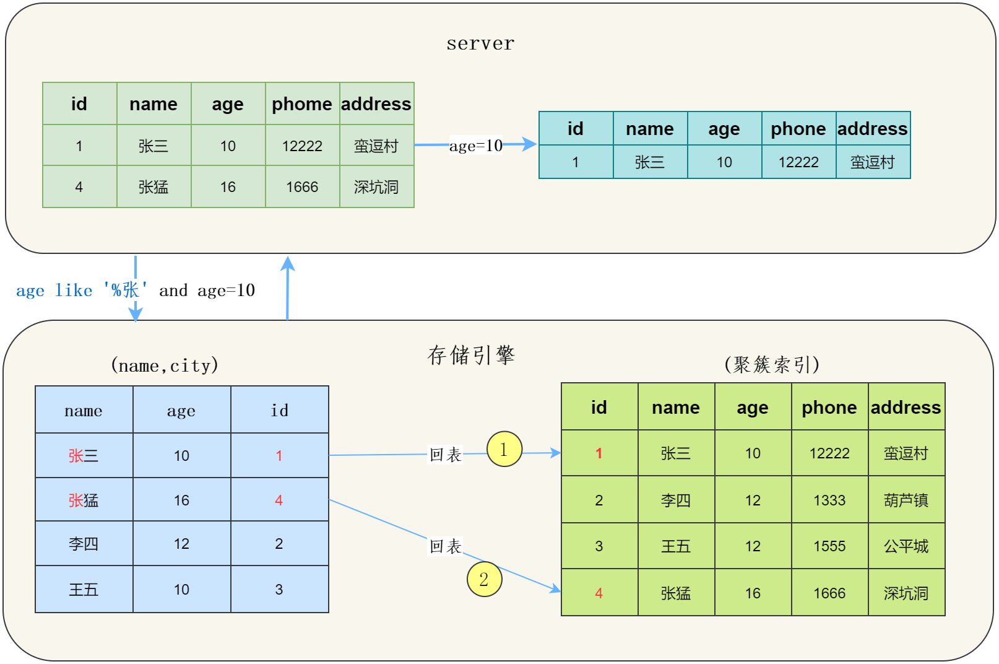

MySQL


# SQL

## 类型

DDL：数据定义语言，如CREATE、DROP、ALTER

DQL：数据查询语言（**Query**），如SELECT

DML：数据操作语言，如INSERT、UPDATE、DELETE

DCL：数据控制语言，如GRANT、REVOKE、COMMIT、ROLLBACK

## Q：DROP、DELETE 与 TRUNCATE 的区别？

|      | DROP          | DELETE           | TRUNCATE |
| ---- | ------------- | ---------------- | -------- |
| 类型 | DDL           | DML              | DDL      |
| 回滚 | 不可          | 可               | 可       |
| 范围 | 全表数据+结构 | 全表或某些行数据 | 全表数据 |
| 速度 | 最快          | 慢               | 快       |

## 比较运算符

| 符号        | 描述                             | 备注                                                         |
| :---------- | :------------------------------- | :----------------------------------------------------------- |
| !=          | 不等于                           |                                                              |
| <>          | 不等于                           |                                                              |
| BETWEEN     | 在两值之间                       | 相当于`>=min && <=max`                                       |
| NOT BETWEEN | 不在两值之间                     | 相当于`<min || >max`                                         |
| <=>         | 严格比较两个值是否相等，包括NULL | 当col1，col2两个可能存在NULL值的列需要进行相等比较时，可以使用 col1 <=> col2，可以包括null=null的情况 |

# 数据类型

## 数值类型

MySQL 支持所有标准 SQL 数值数据类型。

这些类型包括严格数值数据类型(INTEGER、SMALLINT、DECIMAL 和 NUMERIC)，以及近似数值数据类型(FLOAT、REAL 和 DOUBLE PRECISION)。

关键字INT是INTEGER的同义词，关键字DEC是DECIMAL的同义词。

BIT数据类型保存位字段值，并且支持 MyISAM、MEMORY、InnoDB 和 BDB表。

作为 SQL 标准的扩展，MySQL 也支持整数类型 TINYINT、MEDIUMINT 和 BIGINT。

下面的表显示了需要的每个整数类型的存储和范围，加粗的为常用

| 类型         | 大小                                     | 范围（有符号）                                               | 范围（无符号）                                               | 用途            |
| :----------- | :--------------------------------------- | :----------------------------------------------------------- | :----------------------------------------------------------- | :-------------- |
| **TINYINT**  | 1 Bytes                                  | [-128，127]                                                  | [0，255]                                                     | 小整数值        |
| SMALLINT     | 2 Bytes                                  | [-32 768，32 767]                                            | [0，65 535]                                                  | 大整数值        |
| MEDIUMINT    | 3 Bytes                                  | [-8 388 608，8 388 607]                                      | [0，16 777 215]                                              | 大整数值        |
| INT或INTEGER | 4 Bytes                                  | [-2 147 483 648，2 147 483 647]                              | [0，4 294 967 295]                                           | 大整数值        |
| **BIGINT**   | 8 Bytes                                  | [-9,223,372,036,854,775,808，9 223 372 036 854 775 807]      | [0，18 446 744 073 709 551 615]                              | 极大整数值      |
| FLOAT        | 4 Bytes                                  | (-3.402 823 466 E+38，-1.175 494 351 E-38)，0，(1.175 494 351 E-38，3.402 823 466 351 E+38) | 0，(1.175 494 351 E-38，3.402 823 466 E+38)                  | 单精度 浮点数值 |
| DOUBLE       | 8 Bytes                                  | (-1.797 693 134 862 315 7 E+308，-2.225 073 858 507 201 4 E-308)，0，(2.225 073 858 507 201 4 E-308，1.797 693 134 862 315 7 E+308) | 0，(2.225 073 858 507 201 4 E-308，1.797 693 134 862 315 7 E+308) | 双精度 浮点数值 |
| DECIMAL      | 对DECIMAL(M,D) ，如果M>D，为M+2否则为D+2 | 依赖于M和D的值                                               | 依赖于M和D的值                                               | 小数值          |

## 日期和时间类型

表示时间值的日期和时间类型为DATETIME、DATE、TIMESTAMP、TIME和YEAR。

每个时间类型有一个有效值范围和一个"零"值，当指定不合法的MySQL不能表示的值时使用"零"值。

TIMESTAMP类型有专有的自动更新特性

| 类型      | 大小 ( bytes) | 范围                                                         | 格式                | 用途                     |
| :-------- | :------------ | :----------------------------------------------------------- | :------------------ | :----------------------- |
| DATE      | 3             | 1000-01-01/9999-12-31                                        | YYYY-MM-DD          | 日期值                   |
| TIME      | 3             | '-838:59:59'/'838:59:59'                                     | HH:MM:SS            | 时间值或持续时间         |
| YEAR      | 1             | 1901/2155                                                    | YYYY                | 年份值                   |
| DATETIME  | 8             | '1000-01-01 00:00:00' 到 '9999-12-31 23:59:59'               | YYYY-MM-DD hh:mm:ss | 混合日期和时间值         |
| TIMESTAMP | 4             | '1970-01-01 00:00:01' UTC 到 '2038-01-19 03:14:07' UTC结束时间是第 **2147483647** 秒，北京时间 **2038-1-19 11:14:07**，格林尼治时间 2038年1月19日 凌晨 03:14:07 | YYYY-MM-DD hh:mm:ss | 混合日期和时间值，时间戳 |

## 字符串类型

字符串类型指CHAR、VARCHAR、BINARY、VARBINARY、BLOB、TEXT、ENUM和SET

**注意**：

- DDL中，char(n) 和 varchar(n) 中括号中 n 代表**字符的个数**，并不代表字节个数，比如 CHAR(30) 就可以存储 30 个字符。

  > 字节数根据编码而定，utf8编码最大字符长度为3字节。5.5.3版本以后支持**utf8mb4**编码（推荐使用），最大长度4字节。

- CHAR 和 VARCHAR 类型类似，但它们保存和检索的方式不同。它们的最大长度和是否尾部空格被保留等方面也不同。在存储或检索过程中不进行大小写转换。

- BINARY 和 VARBINARY 类似于 CHAR 和 VARCHAR，不同的是它们包含二进制字符串而不要非二进制字符串。也就是说，它们包含字节字符串而不是字符字符串。这说明它们没有字符集，并且排序和比较基于列值字节的数值值。

- BLOB 是一个**二进制**大对象，可以容纳可变数量的数据。有 4 种 BLOB 类型：TINYBLOB、BLOB、MEDIUMBLOB 和 LONGBLOB。它们区别在于可容纳存储范围不同。

- 有 4 种 TEXT 类型：TINYTEXT、TEXT、MEDIUMTEXT 和 LONGTEXT。对应的这 4 种 BLOB 类型，可存储的最大长度不同，可根据实际情况选择。

| 类型        | 大小                  | 用途                            |
| :---------- | :-------------------- | :------------------------------ |
| CHAR        | 0-255 bytes           | 定长字符串                      |
| **VARCHAR** | 0-65535 bytes         | **变长**字符串                  |
| TINYBLOB    | 0-255 bytes           | 不超过 255 个字符的二进制字符串 |
| TINYTEXT    | 0-255 bytes           | 短文本字符串                    |
| BLOB        | 0-65 535 bytes        | 二进制形式的长文本数据          |
| TEXT        | 0-65 535 bytes        | 长文本数据                      |
| MEDIUMBLOB  | 0-16 777 215 bytes    | 二进制形式的中等长度文本数据    |
| MEDIUMTEXT  | 0-16 777 215 bytes    | 中等长度文本数据                |
| LONGBLOB    | 0-4 294 967 295 bytes | 二进制形式的极大文本数据        |
| LONGTEXT    | 0-4 294 967 295 bytes | 极大文本数据                    |


## Q：char和varchar区别？

主要区别在于存储方式

- char是定长，在DDL指定字段长度（也就是**字符个数**，0~255），实际存储时不能超过，不够的在末尾用空格填充。

  - 优点：定长，内存碎片少

  - 缺点：空间利用率低。

- varchar是可变长度（**字符个数**，0~65535），只存储实际的字符串内容，且需要额外空间记录长度。

  - 优点：灵活、兼容性好。

  - 缺点：需要1~2字节存长度；产生内存碎片；由于变长，update可能导致页分裂

    > 表中数据刚开始插入时，可变长度字段值根据实际长度存储。而行与行之间数据紧密连续存放在磁盘，值变长就放不下了，需要页分裂扩展空间。

举例：字符串以CHAR(4) 和 VARCHAR(4)存储需要的空间

| 字符串       | `CHAR(4)` | 所需存储空间 | `VARCHAR(4)` | 所需存储空间 |
| :----------- | :-------- | :----------- | :----------- | :----------- |
| `''`         | `'    '`  | 4字节        | `''`         | 1字节        |
| `'ab'`       | `'ab  '`  | 4字节        | `'ab'`       | 3字节        |
| `'abcd'`     | `'abcd'`  | 4字节        | `'abcd'`     | 5字节        |
| `'abcdefgh'` | `'abcd'`  | 4字节        | `'abcd'`     | 5字节        |

## Q：为什么 VarChar 建议不要超过255?

- 当定义varchar长度小于等于255时，长度标识位只需要一个字节(utf-8编码，0xffffffff=255)

- 当大于255时，长度标识位需要两个字节，并且建立的**「索引也会失效」**


## Q：TEXT和BlOB区别？

1. BLOB 可以储存图片，TEXT只能存纯文本（两者都可以存文本）。
2. BLOB 大小写敏感，TEXT不敏感。

# MySQL架构


主要分三层：

- 客户端：最上层的服务并不是MySQL所独有的，大多数基于网络的客户端/服务器的工具或者服务都有类似的架构。比如连接处理、授权认证、安全等等。
- Server层：大多数MySQL的核心服务功能都在这一层，包括查询**解析、分析、优化、缓存**以及所有的内置函数（例如，日期、时间、数学和加密函数），所有跨存储引擎的功能都在这一层实现：存储过程、触发器、视图等。
- 存储引擎层：负责MySQL中数据的存储和提取。Server层通过API与存储引擎进行通信。这些接口屏蔽了不同存储引擎之间的差异，使得这些差异对上层的查询过程透明。

# SQL执行过程

1. 通过连接器跟客户端**「建立连接」**

2. **「验证权限」**，验证客户端是否有权限执行该sql（读、写、读写权限等）。有才继续。

3. 先看**「查询缓存」**。有则直接返回结果，没有则继续。

   > 查询缓存：本质是一个**哈希表**，key为sql、表名、db名、系统环境信息等，value为查询结果。
   >
   > 缓存写入：在获得查询结果时
   >
   > 缓存删除：表发生修改时，整个表的缓存都删除

4. 通过分析器对sql**「语义分析」**，检查语法是否正确。正确才继续

5. 通过优化器**「sql优化」**（比如选择索引，join 表的连接顺序），生成**查询计划**

6. 通过执行器调用**「存储引擎」**执行该查询计划，然后返回**执行结果**

   

# 索引

数据库索引是 DBMS 中一个 排序的数据结构，以 协助快速查询、更新 数据库表中数据，通俗地说相当于目录。索引的实现通常使用 B 树以及变种 B+ 树。

## 索引分类


从基本使用使用的角度来讲：

- 主键索引: InnoDB主键是默认的索引，数据列不允许重复，不允许为NULL，一个表只能有一个主键。
- 唯一索引: 数据列不允许重复，允许为NULL值，一个表允许多个列创建唯一索引。
- 普通索引: 基本的索引类型，没有唯一性的限制，允许为NULL值。
- 组合索引：多列值组成一个索引，用于组合搜索，效率大于索引合并

从数据结构上分类：有哈希表、B树、B+树

从物理存储角度分类：聚簇索引和非聚簇索引

## B树索引

B 树索引，又称 **平衡树索引**。MySQL、Oracle 和 SQL Server 数据库默认的都是 B 树索引（实际是用 B+ 树实现，只是查看表索引时打印BTREE）


### m阶B树性质

1. 若节点关键字（键）个数为k，则子节点个数（即指针个数）为k+1
2. 键和数据一起存放
3. 非叶节点由键+指针构成
   - 键两侧各有一个指针
   - 键左边指针指向**小于等于**当前关键字的子节点，右边则**大于等于**（见上图）
   - 键从小到大排列
4. 根节点：
   - 最少2个子节点，最多m个（m阶的含义）
   - 最少1个键，最多m-1个
5. 非根节点：
   - 最少$\lceil m/2 \rceil$个子节点，最多m个
   - 最少$\lceil m/2 \rceil$-1个键，最多m-1个
6. 叶节点：
   - 在同一层
   - 只放元素，没有指针

### 查找过程

B树索引中，从根节点开始，二分查找节点，直到叶节点，除了**根节点常驻内存**，其他结点都需要从磁盘载入内存（即一次IO）

定位叶节点后，将整个节点载入内存，在节点中查找关键字

### 更新操作

**插入**

**删除**

1. 直接删除

   被删除关键字所在节点键数满足 大于 $\lceil m/2 \rceil$-1，则直接删除

2. 兄弟够借

   被删除键所在节点键数刚好为$\lceil m/2 \rceil$-1，则删除后不满足b树性质，需要从兄弟节点借一个

   如下图，3阶b树，删除24，则该节点键数为0，不满足最少1个的约束，需要从左兄弟借一个21（不绝对，从右兄弟借也可）

   

   借来之后21比父节点23小，需要再交换调整：

   

3. 兄弟不够借

### 最大高度

即节点最少

根最少2个子节点，非叶最少$\lceil m/2 \rceil$个子节点


### 最小高度：log~m~n

每层都满，则所有节点之和为

1+m+m^2^+m^3^....+m^h−1^ = (m^h−1^)/(m−1)

每个节点都放满，则每个节点键最多为m-1，所有关键字上限为

（m-1) * (m^h−1^)/(m−1) =  (m^h−1^)

记关键字数量为n，则n <=  (m^h−1^)，得

h >= log~m~n

最小高度为：$$log_mn$$

## B+树索引

**b树**结构如下


**b+树**结构：


### 对b树的改进之处

b+树由b树改进而来，大部分性质相同，与b树的不同在于：

- 所有的非叶结点只存储 **关键字信息** 和指针，不再存放数据；所有**数据都放叶子**（b树非叶也放数据）

  > 因此扇出更多，m更大。

- 所有叶子节点之间都有一个**双向**链指针。

  > 因此范围查找更快

优点：

- 只存放键，不存放值，因此一次读取，可以在同一内存页中获取更多的键，有利于更快地缩小查找范围
- 叶结点由一条链相连，因此当需要进行一次**全数据遍历** 的时候，B+ 树只需要使用 O(logN) 时间找到最小结点，然后通过链进行 O(N) 的顺序遍历即可；或者在**范围查找**时，B+ 树只需要找到该关键字然后沿着链表遍历即可。

### Q：使用主键索引，B树和B+树哪个快？

显然由于B树叶子和非叶节点都保存数据，导致非叶节点中保存的指针数量（也称为**扇出**，fanout）比B+树少，则相同数据量需要增加树的高度，IO操作变多，因此：

- 若对单次查询，因为B+树必须查到叶子节点，而B树可能在非叶节点就已查到，因此快慢不一定
- 对多次查询，由于B+树高度较低，因此平均查找长度（即总体IO次数）比B树少，即b+树更快。
- 若不是主键索引，则B+树不一定快，因为要回表


### Q：是否m越大越好？

不管是内存中的数据，还是磁盘中的数据，操作系统都是按页（一页大小通常是 4KB，这个值可以通过 getconfig PAGE_SIZE 命令查看）来读取的，一次会读一页的数据。**如果要读取的数据量超过一页的大小，就会触发多次 IO 操作。**所以，我们在选择 m 大小的时候，要尽量让每个节点的大小等于一个页的大小。读取一个节点，只需要一次磁盘 IO 操作

### Q：B+树查找IO次数计算？

Innodb的数据组织的最小单位是page（页），默认页大小**16KB**。由上面分析，让节点大小与页大小相等。非叶节点存主键(8B)+指针(6B，InnoDB源码设置) = 14B，每个非叶可以有 16KB/14B = 1170 个子节点。

假设一行数据大小为1KB，则叶节点能存放16KB/1KB = 16行数据

则高度为2的B+树可存放1170*16 = 18720行数据

高度为3可存放1170 * 1170 * 16=21902400行

所以高度为3的B+树主键索引能存放两千万+条数据，又由于根节点**常驻内存**，因此走到叶节点只需要**两次IO**

### Q：单表最大容量？

理论上没有上限，b+树越高存的越多，但超过三层会导致性能下降，所以最多三层，即两千万条左右。

## 哈希索引

innodb本身的索引结构是B+tree，hash索引是innodb提供的特性功能。该功能是自适应的（非手动开关），innodb监控索引表，如果监控到某个索引经常用，那么就认为是热数据，然后内部自己创建一个hash索引

### Q：Hash索引和B+树索引区别？

1. hash无法 范围查询 和 模糊查询，只支持**等值查询**，优点是更快（缺点是不稳定，当hash碰撞频繁时性能差，而B+树查询效率稳定）
2. hash不支持索引排序、多列索引的最左前缀匹配（因为hash不可预测）
3. hash避免不了回表查询。而B+树在聚簇索引、覆盖索引等可只用索引得到数据，不需要回表

## 最左前缀匹配原则

一个联合索引是有先后顺序的，例如(a,b,c)。从最左边的索引列开始，任何连续的索引都能匹配上，当条件未命中，如**缺失**（相当于查该列全部）或是**范围查询**（如>、<、BETWEEN、LIKE、IN）就会停止匹配。（注意是索引顺序的最左，与查询条件的顺序无关，因为优化器能调整条件的顺序）

**具体规则**：

1. 如果建立`(a,b)`顺序的索引，若查询条件为b=xxx，是无法命中`(a,b)`索引的（因为a缺失）；

   若查询条件是`a=1 and b=2`或者`b=2 and a=1`都可以命中`(a,b)`索引（最左指的是索引的顺序，与where条件顺序无关）；

2. 若查询条件为a = 1 and b = 2 and **c > 3** and d = 4，对于索引`(a,b,c,d)`，d=4是用不到该索引的，因为c字段是一个范围查询，它之后的字段会停止匹配。 但这个索引不是完全失效，该查询会**用到索引的一部分**，即`(a，b，c)`

   而索引`(a,b,d,c)`能被查询条件`a = 1 and b = 2 and c > 3 and d = 4`命中，因为范围查询的c列在索引的最后，且条件a、b、c的顺序能任意调整

3. （MySQL 8.0改进）对查询条件a = 1 and b = 2 and **c >= 3** and d = 4，索引`(a,b,c,d)`生效，即`>、<、>=、<=、BETWEEN、like等` **范围查询不会影响最左匹配**

   > `>=` 虽然是范围，但也包括=号，属于精确匹配的特例，因此会命中索引
   >
   > `BETWEEN` 相当于>=和<=的集合
   >
   > `like`同理，


一条sql可能命中多个索引（explain查看`possible_keys`），最终走哪个索引由优化器基于**成本预估**来决定。

> explain命令：加在sql之前，用于查看执行计划，见 [查看执行计划（explain）](##查看执行计划（explain）)


**原理**

索引的底层是一颗B+树，那么联合索引也还是一颗B+树，只不过联合索引的健值数量不是一个，而是多个。构建一颗B+树只能根据一个值来构建，因此数据库依据联合索引最左字段来构建B+树。

例如联合索引(a,b)的B+树：


**先按a值排序，当a值相等时，才按b值排序**。因此当a用范围查询时，b是无序的，无法使用索引，即索引某列是**范围查询**时，其右侧的列无法使用索引。

 

**注意**

只是MySQL有这个限制，Oracle任意顺序都可以


## 添加索引原则

1. 很少使用的列不加索引（应该建在**查询频繁**的列，但修改频繁的列不适合）

2. 区分度低的列不加（如性别只有两种，区分度低，加索引意义不大）

3. 特殊数据类型不加（text、image和 bit）

4. 有外键的列必须加
5. 索引的个数应该适量（索引需要占用空间；表更新时候也需要维护。

## 索引失效场景

下列都**可能**导致索引失效，而转向全表扫描

1. 违反最左前缀法则（对非最右端的索引使用范围条件>、<、between、in、等）

2. 在索引上做任何操作（计算、**函数**、自动/手动类型转换），不然会导致索引失效而转向全表扫描

   例如：**DATE_FORMAT**函数将create_date字段按'%Y-%m-%d'格式化后，再看是否等于'2023-02-01'。

   但这样会导致不走create_date字段的索引：

   ```sql
   select * from sum_group_status_trend_create where group_id =100000000034019 and DATE_FORMAT(create_date,'%Y-%m-%d') = '2023-02-01'
   ```

3. 使用不等于（`!=` 或者 `<>`）判断时

4. 使用 `is null` / `is not null` 判断

5. 使用`like`

6. 索引字段是字符串，但查询时不加引号

7. （不一定失效）使用or


## 聚簇索引（主键索引）

并不是一种索引类型，而是一种数据存储方式，将 **数据存储** 和 **索引** 放到一起，找到索引也就找到了数据。

MySQL 里只有 **INNODB** 表支持聚簇索引，INNODB 表数据本身就是聚簇索引，非叶子节点按照主键顺序存放，叶子节点存放主键以及对应的行记录。所以对 INNODB 表进行全表顺序扫描会非常快。

特点：

1. 检索效率高，磁盘IO少（索引和数据放一起）
2. 表的物理存储依据聚簇索引的结构，所以一个数据表只能有**一个**聚簇索引，但可以拥有多个非聚簇索引；
3. 一般而言，会在频繁使用、排序的字段上创建聚簇索引。
  - 定义了主键，则主键就是聚簇索引。
  - 没定义主键，则找第一个**唯一的not NULL列**就是聚簇索引
  - 还找不到，则innoDB创建一个隐藏的row-id作为聚簇索引，大小为**6B**。

**非聚簇索引**

除了聚簇索引以外的其他索引，也称**二级索引**。

也是 **B 树**结构，与聚簇索引不同在于，非聚簇索引的叶节点不存储真正的数据行，只存储**主键**。查询得到主键后还需要再次到聚簇索引树中查找完整数据行，称为**回表**。


## 索引下推

Index Condition Pushdown (ICP)，MySQL5.6 添加的功能，用于优化数据查询。默认开启，可使用系统参数`optimizer_switch`控制

查询条件包含索引列时，将这些条件传给存储引擎，由存储引擎判断是否需要回表。其实就是将service层生成执行计划（选择索引）的工作交给下面，因此叫“下推”。

目的是为了**减少回表**，见下面两种情况：

- 不使用索引下推，引擎层查找到`name like '张%'`的数据，再由Server层去过滤`age=10`这个条件，这样一来，就回表了**两次**，浪费了联合索引的另外一个字段`age`。

  

- 使用了索引下推优化，把where的条件放到了引擎层执行，直接根据`name like '张%' and age=10`的条件进行过滤，减少了回表的次数。只回表一次。

  

## 回表

如果索引的列在 select 选择的列中（因为在 mysql 中索引是根据索引列的值进行排序的，所以索引节点中存在该列中的部分值）或者根据一次索引查询就能获得记录就不需要回表。（即**覆盖索引**）

如果 select 选择列中有大量的非索引列，索引就需要到全表中找到相应的列的信息，**先定位主键值，再定位数据行**，这就叫**回表**。

**例子**

表t设计如下：

`t(id PK, name KEY, sex, flag);`  // id是主键，因此是聚集索引；name是普通索引

表中有四条记录：

```
1, shenjian, m, A
3, zhangsan, m, A
5, lisi, m, A
9, wangwu, f, B
```

两棵B+树索引分别如下图：

　　（1）id为PK，聚集索引，叶子节点存储行记录；

　　（2）name为KEY，普通索引，叶子节点存储PK值，即id；


执行如下语句时

```
select * from  t  where name = 'lisi';　
```

如下图**粉红色**路径，需要扫描**两遍**索引树：

（1）先通过普通索引（右边的树）定位到主键值id=5；

（2）在通过聚集索引定位到行记录；


**如何避免回表**

使用聚集索引（主键或第一个唯一索引），不使用普通索引


## 覆盖索引

索引列包含了select选择的所有字段，就不需要回表了，只扫描索引树就能获得结果，可加快查询。

例如，name字段是user表的其中一个索引：

```sql
select name from user where name = ‘张三’;
```


**实践**

避免使用select *

## Q：为什么二级索引不直接存数据地址，而是存主键？

当这行数据地址变化时，二级索引树也要做更新。而主键一般是不变的，存主键可以避免这部分开销

地址变化的情况：插入、更新或删除，可能引起聚簇索引b+树的变动（如节点分裂），进而导致地址变化

## Q：为什么推荐使用自增 id 作为主键？

1. 普通索引的 B+ 树上存放的是主键索引的值，如果该值较大，会**「导致普通索引的存储空间较大」**
2. 使用自增 id 做主键索引新插入数据只要放在该页的最尾端就可以，直接**「按照顺序插入」**，不用刻意维护
3. 页分裂容易维护，当插入数据的当前页快满时，会发生页分裂的现象，如果主键索引不为自增 id，那么数据就可能从页的中间插入，页的数据会频繁的变动，**「导致页分裂维护成本较高」**

但是也有缺点：

- 受单机DB性能的限制，并发大时，innodb在按主键进行插入的时候会造成明显的锁争用，主键的上界会成为争抢的热点，因为所有的插入都发生在这里，并发插入会导致间隙锁竞争。
- Auto_Increment锁机制会造成自增锁的抢夺。解决：调优innodb_autoinc_lock_mode的配置。
- 自增id容易暴露业务规模。


## Q：索引越多越好吗？

并不是，每建一条索引，都会新建一棵B+树，会占用内存，每个节点16KB。并且索引树的规模也会随着数据规模而倍增（插入一条数据，则所有索引树也都要改变）

## 全文索引

MySQL 5.6 前，只有MyISAM 支持。MySQL 5.6 及以后，MyISAM 和 InnoDB 存储引擎均支持。

只有字段的数据类型为 char、varchar、text 及其系列才可以建全文索引。

全文索引 比 `like + %` 快 N 倍，但是可能存在精度问题。

创建：

```sql
create table fulltext_test (
    id int(11) NOT NULL AUTO_INCREMENT,
    content text NOT NULL,
    tag varchar(255),
    PRIMARY KEY (id),
    FULLTEXT KEY content_tag_fulltext(content,tag)  // 创建联合全文索引列
) ENGINE=MyISAM DEFAULT CHARSET=utf8;
```

使用：

```sql
# 与模糊匹配的like语法不同，全文索引使用 match 和 against 关键字
# match函数必须完全对应全文索引，联合全文索引的列、顺序须完全一致
# against函数中输入查询文本
select * from fulltext_test where match(content,tag) against('xxx xxx');
```

# 存储引擎

常见的有三种

##  InnoDB

InnoDB实现了四个标准隔离级别，是MySQL 默认的事务型存储引擎，因此默认隔离级别也是可重复读。通过多版本并发控制（MVCC）+ Next-Key Locking 防止幻读。


## MyISAM

设计简单，数据以紧密格式存储。对于只读数据，或者表比较小、可以容忍修复操作，则依然可以使用它。

## MEMORY

所有的数据都在**内存**中，速度快，但安全性不高。

不能建立太大的表。所以只使用在相对较小的数据库表，或者查询的临时表。

## Q：几种存储引擎比较？

|                  | InnoDB             | MyISAM                | MEMORY      |
| ---------------- | ------------------ | --------------------- | ----------- |
| 事务             | 支持               | 不支持                | 不          |
| 外键             | 支持               | 不                    | 不          |
| 主键（唯一索引） | 必须有             | 可以没有              |             |
| 聚簇索引         | 聚簇索引           | 非聚簇索引            |             |
| 全文索引         | 支持               | 支持                  |             |
| 哈希索引         | 支持               | 不                    | 支持        |
| count            | 不保存表具体行数   | 用一个变量保存        |             |
| 日志             | redo log           | 没有                  |             |
| 锁               | 表锁和行锁         | 只有表锁              |             |
| 存储容量         | 64TB               | 256TB                 | RAM（内存） |
| 存储文件         | 表定义frm、数据ibd | frm、数据myd、myi索引 |             |
| 缓存             | 有                 | 无                    | 不需要      |

## InnoDB执行更新语句流程

用以下语句来举例，c 字段无索引，id 为主键索引

```
update T set c=c+1 where id=2;
```

1. 执行器先找引擎取 id=2 这一行。id 是主键，引擎直接用树搜索找到这一行

2. - 若这一行所在的数据页本来就**在内存中**，就**直接返回**给执行器
   - 若不在内存，需要先从磁盘读入内存，然后再返回

3. 执行器拿到引擎给的行数据，把这个值加1（ c=c+1），得到新的一行数据，再调用引擎接口写入这行新数据

4. 引擎将这行新数据更新到内存中，同时将这个更新操作**记录到 redo log **，此时 redo log 处于 **「prepare」** 状态。然后告知执行器执行完成了，随时可以提交事务

5. 执行器**生成这个操作的 binlog**，并把 binlog **「写入磁盘」**

6. 执行器调用引擎的**提交事务**接口，引擎把刚刚写入的 redo log 改成**「commit」**（提交）状态，更新完成。


## Q：Innodb 事务为什么要两阶段提交?

本质是为了保证这两个日志逻辑上的一致。

考虑两种情况：

- 有 redolog 无 binlog。

  假设在 redolog 写完，binlog 还未写完，这时 MySQL 进程异常重启，导致binlog 里面就没有记录这个语句。然后你会发现，如果需要用这个 binlog 来恢复临时库的话，由于这个语句的 **「binlog 丢失」**，这个临时库就会少了这一次更新，恢复出来的这一行 c 的值就是 0，与原库的值不同。

- 有 binlog 无 redolog。

  如果在 binlog 写完之后 crash，由于 redolog 还没写，崩溃恢复以后这个事务无效，所以这一行c的值是0。但是 binlog 里面已经记录了“把c从0改成1”这个日志。所以，在之后用 binlog 来恢复的时候就**「多了一个事务出来」**，恢复出来的这一行 c 的值就是 1，与原库的值不同。

可以看到，**如果不使用“两阶段提交”，那么数据库的状态就有可能和用它的日志恢复出来的库的状态不一致**。

## Q：一条更新语句的执行流程？

1. 执行器先找引擎获取ID=2这一行。ID是主键，存储引擎检索数据，找到这一行。如果ID=2这一行所在的数据页本来就在内存中，就直接返回给执行器；否则，需要先从磁盘读入内存，然后再返回。
2. 执行器拿到引擎给的行数据，把这个值加上1，比如原来是N，现在就是N+1，得到新的一行数据，再调用引擎接口写入这行新数据。
3. 引擎将这行新数据更新到内存中，同时将这个更新操作记录到redo log里面，此时redo log处于prepare状态。然后告知执行器执行完成了，随时可以提交事务。
4. 执行器生成这个操作的binlog，并把binlog写入磁盘。
5. 执行器调用引擎的提交事务接口，引擎把刚刚写入的redo log改成提交（commit）状态，更新完成。

# 日志

## bin log：归档日志

用于记录用户执行的数据操作型SQL的信息**（DML）**

二进制文件，**在server层**

作用：主从复制、数据恢复

## undo log：回滚日志

**InnoDB 存储引擎**特有，用于保证数据的原子性，**「保存了事务发生之前的数据的一个版本，即记录的是修改之前的数据，可用于回滚」**，同时可以提供多版本并发控制下的读（MVCC）。

作用：事务回滚、实现多版本控制(MVCC)

## redo log：重做日志

**InnoDB 存储引擎**特有，用于**记录事务操作的变化**（数据修改后的值），不管事务是否提交都会记录。

执行DML时，log不是直接落盘，而是先记录到内存的redo log buffer（redo日志缓冲区）中，再**批量写入**磁盘文件。写入时机：

1. buffer空间不足时

2. 事务提交时

3. redo log线程大约每秒刷盘一次

4. 正常关闭服务器时

5. 触发checkpoint规则

   > redolog buffer、redolog file都是以块（block）方式保存的，称为重做日志块（redo log block），大小固定512B。
   >
   > redolog file也是固定大小的，写入方式是**循环利用**。
   >
   > `write_pos` 是当前记录的位置，`checkpoint`是当前要擦除的位置。当`write_pos`追上`checkpoint`时，表示redo log日志已经写满。这时候需要执行`checkpoint`规则腾出可写空间。
   >
   > 

作用：数据恢复、crash-safe

## relay log：中继日志

在主从复制中使用，是一个中介临时的日志文件，用于存储从master节点同步过来的binlog

## slow query log：慢查询日志

记录执行时间超过 `long_query_time` 这个变量定义的时长的查询语句


## general log：一般查询日志

记录用户执行的数据查询型SQL的信息**（DQL）**

## error log：错误日志

记录MySQL的启动、运行、关闭过程

## Q：redolog 和 binlog 的区别？

| redolog          | binlog                                           |
| ---------------- | ------------------------------------------------ |
| innodb独有       | server层，所有存储引擎（InnoDB、MyISAM等）都要用 |
| 记录具体修改数据 | 记录操作                                         |
| 循环利用         | 满了生成新的                                     |
| crash-safe       | 不能                                             |


# 主从复制

指将 **主数据库（Master）**中的 DDL 和 DML 操作通过**binlog**传输到 **从数据库（Slave）** 上，然后将这些日志重新执行（redo），从而使得从数据库的数据与主数据库保持一致。

MySQL 支持单向、异步复制，复制过程中有一主一从、一主多从。

作用：

1. 备份

2. 读写分离，负载均衡

流程：

两端三线程

- Master 端：binlog线程 —— 记录下所有改变了数据库数据的语句，放进 Master 的 **binlog** 中；
- Slave 端： I/O 线程 —— 负责从 Master上拉取 binlog 内容，放进自己的**Relay log**中；

- Slave 端：SQL 执行线程 —— 读取 Relay log，并顺序执行该日志中的 SQL 事件。


## Q：主从同步延迟如何处理？

原因：一个服务器开放Ｎ个链接给客户端来连接的，这样有会有大并发的更新操作, 但是从服务器的里面读取 binlog 的线程仅有一个，当某个 SQL 在从服务器上执行的时间稍长 或者由于某个 SQL 要进行锁表就会导致**主服务器的 SQL 大量积压**，未被同步到从服务器里。这就导致了主从不一致， 也就是主从延迟。

解决办法：

1. 写操作后的读操作指定发给数据库主服务器
   例如，注册账号完成后，登录时读取账号的读操作也发给数据库主服务器。这种方式和业务强绑定，对业务的侵入和影响较大，如果哪个新来的程序员不知道这样写代码，就会导致一个bug。

2. 读从机失败后再读一次主机

   这就是通常所说的 "二次读取" ，二次读取和业务无绑定，只需要对底层数据库访问的 API 进行封装即可，实现代价较小，不足之处在于如果有很多二次读取，将大大增加主机的读操作压力。例如，黑客暴力破解账号，会导致大量的二次读取操作，主机可能顶不住读操作的压力从而崩溃。

3. 关键业务读写操作全部指向主机，非关键业务采用**读写分离**

   例如，对于一个用户管理系统来说，注册 + 登录的业务读写操作全部访问主机，用户的介绍、爰好、等级等业务，可以采用读写分离，因为即使用户改了自己的自我介绍，在查询时却看到了自我介绍还是旧的，业务影响与不能登录相比就小很多，还可以忍受。

## Canal

阿里巴巴开源的数据同步工具，主要应用场景是数据库的**增量数据同步**。

原理：模拟 MySQL slave 的交互协议，把自己伪装成为一个 MySQL slave ，向 MySQL master 发送**dump协议**，MySQL master 收到 dump 请求后，会被这个伪装的slave ( canal )**拉取 binlog**并 解析成流，然后对接到各个后续的消费者中，如ES、数据库等。

# 读写分离


主服务器：处理写操作，以及实时性要求高的读操作

从服务器：处理读操作。

优点：

- 主从服务器负责各自的读和写，极大程度缓解了锁的争用；
- 从服务器可以使用 MyISAM，提升查询性能以及节约系统开销；
- 增加冗余，提高可用性。

**实现方案**

读写分离常用**代理**方式来实现，代理服务器接收应用层传来的读写请求，然后决定转发到哪个服务器。

1. 基于 MySQL proxy 代理（中间件）

   在应用和数据库之间增加 **代理层**，接收应用对数据库的请求，根据不同请求类型（即是读 read 还是写 write）转发到不同的实例，在实现读写分离的同时可以实现负载均衡。

   MySQL 的代理最常见的是 mysql-proxy、cobar、mycat、Atlas 等。

2. 基于应用内路由（代码封装）

   在应用程序中实现，针对不同的请求类型去不同的DB实例执行。

   可基于 spring 的 **aop**：用 aop 来拦截 spring 项目的 dao 层方法，动态切换主从数据源。

3. 基于 MySQL-Connector-Java 的 JDBC 驱动方式

   Java 程序通过在连接 MySQL 的 JDBC 中配置主库与从库等地址，JDBC 会自动将读请求发送给从库，将写请求发送给主库，此外， MySQL 的 JDBC 驱动还能够实现多个从库的负载均衡。

4. 基于 sharding-jdbc 的方式

   sharding-sphere 是强大的读写分离、分表分库中间件，sharding-jdbc 是 sharding-sphere 的核心模块。

5.    UDAL：天翼云DB中间件

# 分表

常用方案：

1. 纵向拆分（分表）：字段太多的表拆成多个表

2. 横向拆分（分库，又称水平分表）：同一个表的数据按某种方式路由，分配到不同的库

   路由即决定数据分到哪里，常按某个键或几个键hash取模，或按某个范围（0-999，1000-1999……）

3. 中间表：需要经常join的一些表，拆分重组放入中间表，代替join

4. 增加冗余字段


中间件：sharding-jdbc、Mycat、UDAL

优点：容量大

缺点：

1. 分布式事务、

2. 未带shard查询（导致遍历所有分库）、

3. 跨库无法join

   以上解决都需要带shard

4. 单实例自增主键无法保证全局唯一

   使用分段预分配id、或使用分布式ID（snowflake算法）

# Q：MySQL使用CPU100%原因？

1. 慢sql：优化
2. 死锁：直接kill查询进程
3. 访问激增：减少连接数


# 查看执行计划（explain）

explain模拟优化器执行SQL语句，除了select，其他比如insert，update和delete均可以使用explain查看执行计划，从而知道mysql是如何处理sql语句，分析查询语句或者表结构的性能瓶颈。

**作用**

1、表的读取顺序
2、数据读取操作的操作类型
3、哪些索引可以使用
4、哪些索引被实际使用
5、表之间的引用
6、每张表有多少行被优化器查询

**用法**

> explain + SQL语句

执行计划包含的信息，比较重要的字段有：

- select_type : 查询类型，有简单查询、联合查询、子查询等
- type：联结类型，最坏情况为all（扫全表）
- key : 使用的索引
- rows : 扫描的行数

| 信息            | 描述                                                         |
| --------------- | ------------------------------------------------------------ |
| id              | 查询的序号，包含一组数字，表示查询中执行select子句或操作表的顺序<br/>**两种情况**<br/>id相同，执行顺序从上往下<br/>id不同，id值越大，优先级越高，越先执行 |
| **select_type** | 查询类型，主要用于区别普通查询，联合查询，子查询等的复杂查询<br/>1、simple ：简单的select查询，不包含子查询或者UNION<br/>2、primary ：查询中若包含任何复杂的子部分，最外层查询被标记为primary <br/>3、subquery：在select或where中包含了子查询<br/>4、derived：衍生，from子句中包含的子查询，MySQL会递归执行这些子查询，把结果放到临时表中<br/>5、union：如果第二个select出现在UNION之后，则被标记为UNION，如果union包含在from子句的子查询中，外层select被标记为derived<br/>6、union result：UNION 的结果<br/> |
| table           | 这行数据在哪个表                                             |
| partitions      | 匹配的分区（mysql建表时可以水平分区存储，按某个字段进行划分，有key、hash和range等方式） |
| type            | 显示联结类型，显示查询使用了何种类型，按照从最佳到最坏类型排序<br/>1、system：表中仅有一行（=系统表）这是const联结类型的一个特例。<br/>2、const：表示通过索引一次就找到，const用于比较primary key或者unique索引。因为只匹配一行数据，所以如果将主键置于where列表中，mysql能将该查询转换为一个常量<br/>3、eq_ref:唯一性索引扫描，对于每个索引键，表中只有一条记录与之匹配。常见于唯一索引或者主键扫描<br/>4、ref:非唯一性索引扫描，返回匹配某个单独值的所有行，本质上也是一种索引访问，它返回所有匹配某个单独值的行，可能会找多个符合条件的行，属于查找和扫描的混合体<br/>5、range:只检索给定范围的行，使用一个索引来选择行。key列显示使用了哪个索引，一般就是where语句中出现了between,in等范围的查询。这种范围扫描索引扫描比全表扫描要好，因为它开始于索引的某一个点，而结束另一个点，不用全表扫描<br/>6、index:index 与all区别为index类型只遍历索引树。通常比all快，因为索引文件比数据文件小很多。<br/>7、**all：遍历全表**以找到匹配的行<br/>**注意:一般保证查询至少达到range级别，最好能达到ref。**<br/> |
| possible_keys   | 指出可能使用哪个索引                                         |
| **key**         | 显示**实际决定使用**的键(索引)。如果没有选择索引，键是NULL。查询中如果使用覆盖索引，则该索引和查询的select字段重叠。<br/>**注意：表数据量太少也可能不走索引** |
| key_len         | 表示索引中使用的字节数，该列计算查询中使用的索引的长度在不损失精度的情况下，长度越短越好。如果键是NULL,则长度为NULL。该字段显示为索引字段的最大可能长度，并非实际使用长度。 |
| ref             | 显示索引的哪一列被使用了，如果有可能是一个常数，哪些列或常量被用于查询索引列上的值 |
| **rows**        | 根据表统计信息以及索引选用情况，大致估算出找到所需的记录所需要读取的行数。**越小说明查询越快** |
| filtered        | 查询的表行占表的百分比                                       |
| Extra           | 包含不适合在其他列中显示，但是十分重要的额外信息<br/>1、Using filesort：说明mysql会对数据适用一个外部的索引排序。而不是按照表内的索引顺序进行读取。MySQL中无法利用索引完成排序操作称为“文件排序”<br/>2、Using temporary:使用了临时表保存中间结果，mysql在查询结果排序时使用临时表。常见于排序order by和分组查询group by。<br/>3、Using index:表示相应的select操作用使用覆盖索引，避免访问了表的数据行。如果同时出现using where，表名索引被用来执行索引键值的查找；如果没有同时出现using where，表名索引用来读取数据而非执行查询动作。<br/>4、Using where :表明使用where过滤<br/>5、using join buffer:使用了连接缓存<br/>6、impossible where:where子句的值总是false，不能用来获取任何元组<br/>7、select tables optimized away：在没有group by子句的情况下，基于索引优化Min、max操作或者对于MyISAM存储引擎优化count（*），不必等到执行阶段再进行计算，查询执行计划生成的阶段即完成优化。<br/>8、distinct：优化distinct操作，在找到第一匹配的元组后即停止找同样值的动作。<br/> |
| dbnode          | （UDAL特有）显示在哪个分片                                   |

