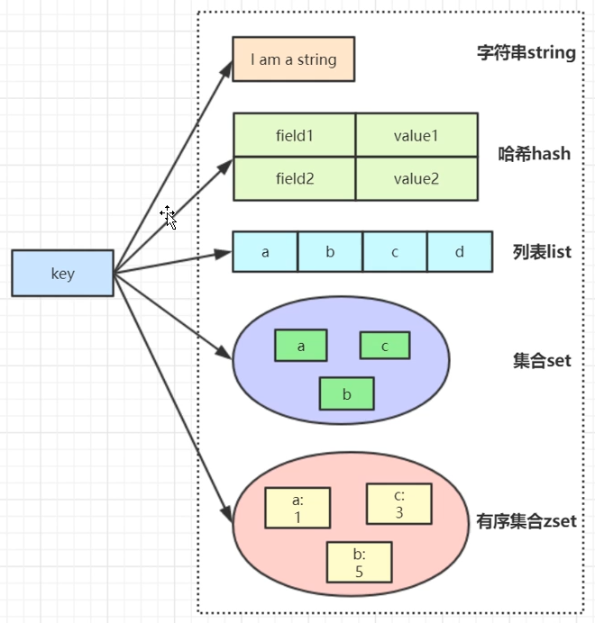
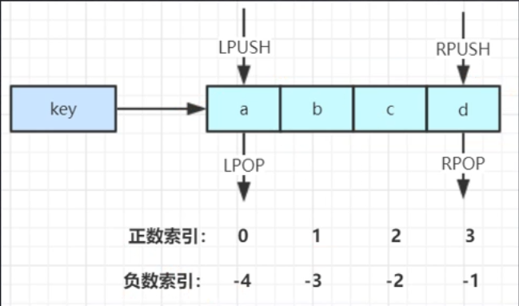
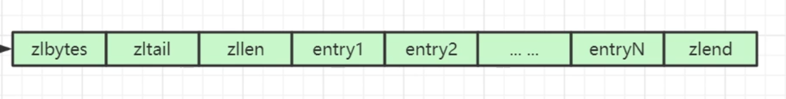
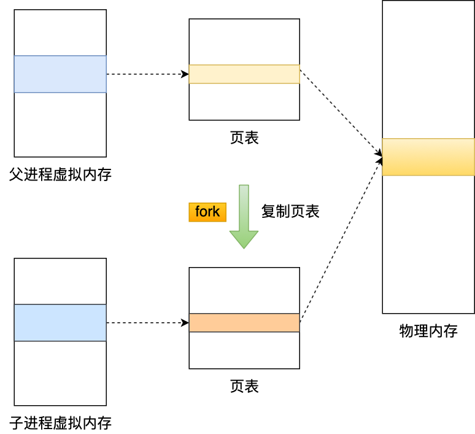
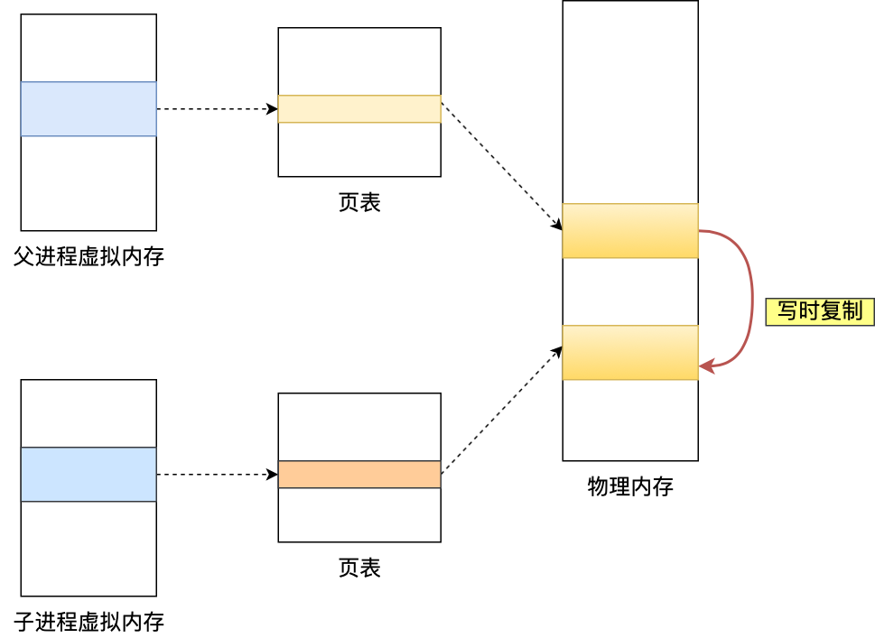
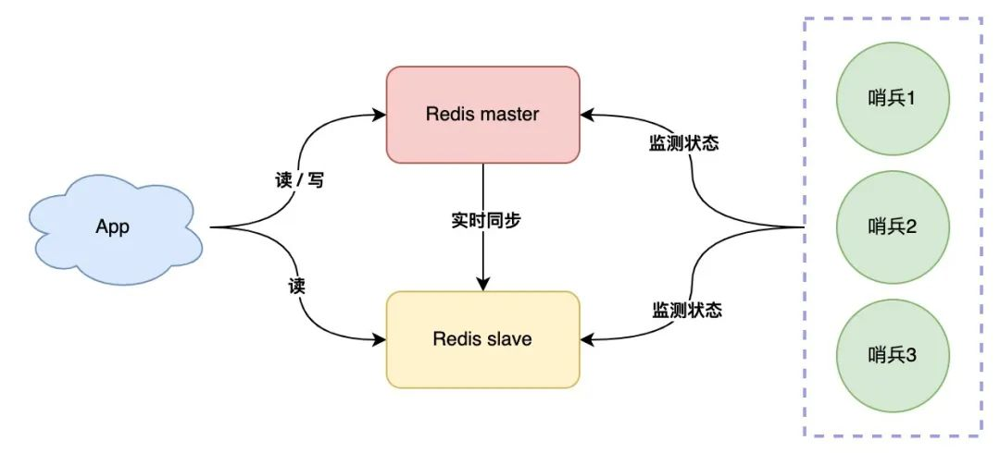
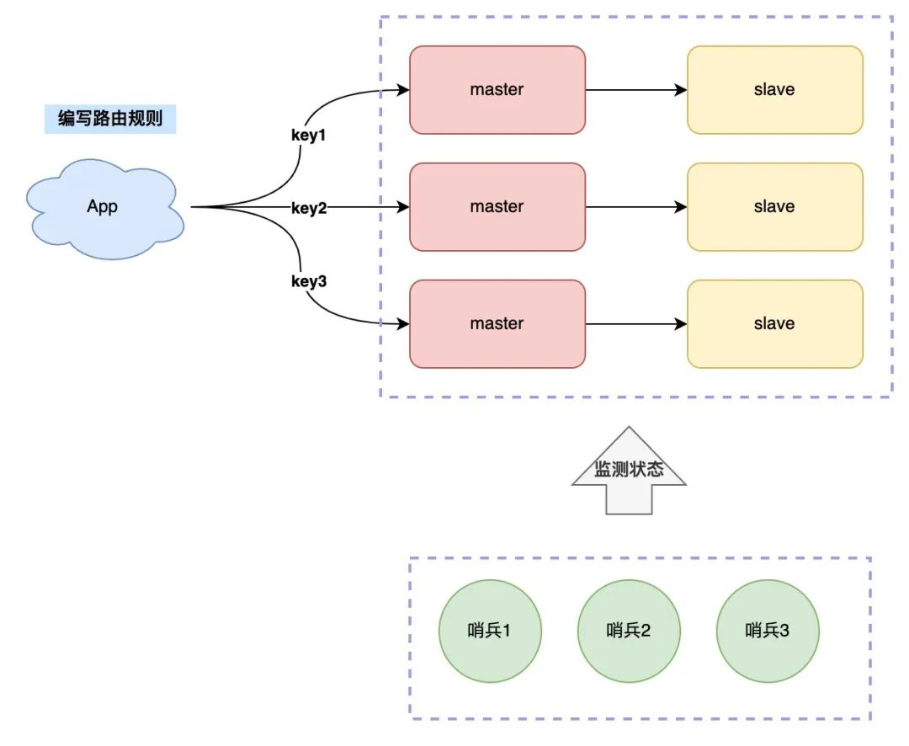
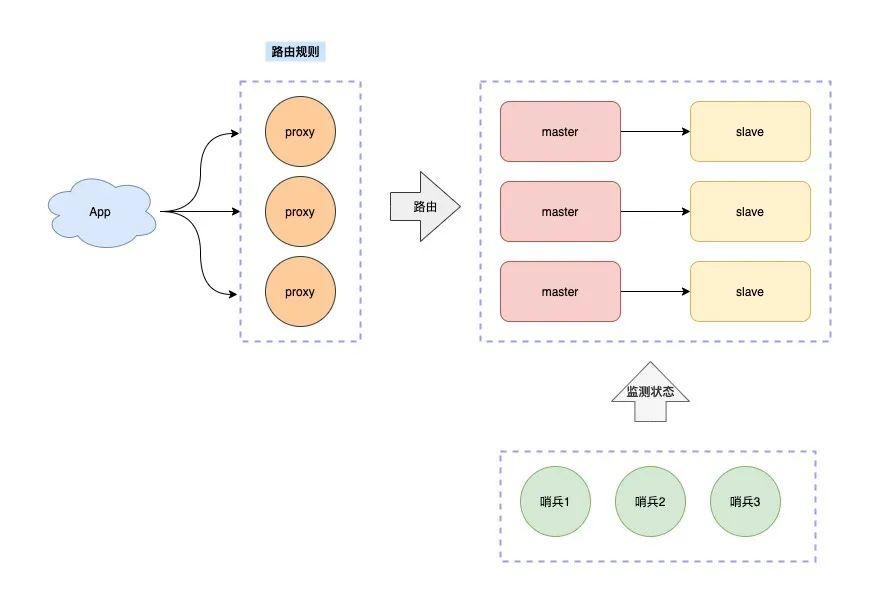
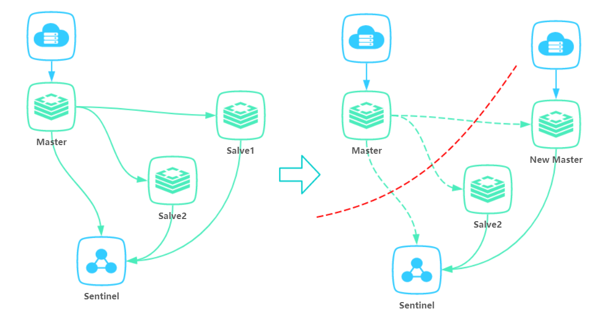
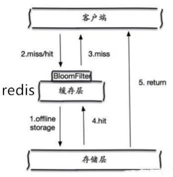

Redis

# 基本架构

单体redis分为0~15号DB（配置文件设置），每个DB相当于命名空间，并不是传统意义上的DB。

DB内key不能重复，不同DB互不影响

redis集群模式只能使用一个数据库空间：db0

# 数据结构

Redis本质都是**k-v键值对**，用一个唯一的字符串key来标识存储，数据结构指value的存储结构。

- Key的大小上限为**512MB**，但建议不超过1KB，这样既节约存储空间，也利于检索。
- value大小上限为**512M**（对String类型而言）。
- k-v对上限：**2^32-1**个。
- Hash、List、Set、ZSet的元素上限是**2^32-1**个。

**基本数据结构**共有5种：字符串string、列表list、字典hash、集合set、有序集合zset。

此外还有3种**特殊类型**：

- Geo：地理位置定位，用于存储地理位置信息，并对存储的信息进行操作（Redis 3.2 推出）。
- HyperLogLog：用来做基数统计算法的数据结构，如统计网站的 UV。
- Bitmaps：用一个比特位来映射某个元素的状态，在 Redis 中，它的底层是基于字符串类型实现的，可以把 bitmaps 成作一个以比特位为单位的数组。



## String（字符串）

- 简介：最常用的数据结构，是一个k-v键值对，v是字符串。它是二进制安全的，value大小上限为 512M

- 简单使用举例：set key value、get key 等

- 应用场景：共享session、分布式锁，计数器、限流、存储图片或序列化的对象

- 内部编码有 3 种：
  1. int（8 字节，java的Long）
  
  2. embstr（小于等于 39 字节字符串）
  
  3. raw（大于 39 个字节字符串）
  
     

## Hash（哈希）

- 简介：存储二级map，无序，第一级是 k - v 键值对，其中 v 本身又是一个 k-v 键值对

- 简单使用举例：

  1. **hset** key field value：设置map（key对应的map，下文不再强调）中的k-v为 field value 

  2. **hget** key field：获取map中的k = field的v

  3. **hgetall** key：获取map中所有k-v

  4. **hlen** key：得到map的k-v对总数

  5. **hdel** key ：删除map

  6. **hincrby** key filed inc：map中k=field的值加上inc

- 内部编码：ziplist（压缩列表） 、hashtable（哈希表）

- 应用场景：存对象（k为对象唯一id，v为map，恰好存放对象的所有属性）


## List（列表）

- 简介：k-v 键值对，v是列表（list）类型，从左向右存储多个有序的字符串，一个列表最多可存储 **2^32-1** 个元素

- 简单使用举例：

  1. **lpush** key value [value ...]：列表（key对应的列表，下文不再强调）头插一个（或多个）

  2. **rpush** key value [value ...]：列表尾插一个（或多个）

  3. **lpop** key：从列表头部弹出

  4. **rpop** key：从列表尾部弹出

  4. **blpop** key [key ...] timeout：从列表头部弹出一个（或多个）元素，若**列表空**则阻塞等待timeout秒，若=0则一直阻塞

  4. **brpop** key [key ...] timeout：从列表尾部弹出一个（或多个）元素，若**列表空**则阻塞等待timeout秒，若=0则一直阻塞

  7. **lindex** key idx：通过索引取值：

     - 若下标（idx）为非负数，返回`list[idx]`元素，idx=0为最左元素。

     - 若下标为负，从右向左，idx=-1为最右元素。

     - 若下标超过数组长度，返回nil

     

  6. **lset** key idx val：通过索引设值：`list[idx] = val`

  7. **lrange** key start end：获取`[start, stop]`区间元素，与java数组不同，右边是闭区间（stop号元素也能取到）。

     

- 内部编码：ziplist（压缩列表）、linkedlist（链表）

- 应用场景：栈（lpush+lpop）、消息队列（lpush+rpop）、阻塞队列（lpush+brpop）

  **公众号文章列表（或微博信息流）**：分库分表分布式的db，order by 本来就很耗时，再聚合排序更耗时。
  
  利用redis全局一致的特性，对每个用户id，博主发布一条就 lpush msg:{用户id} 消息id，则顺序读list就是最新的消息。查看最新的5条消息列表用 lrange msg:{用户id} 0 5  
  
  **异步队列**：将需要延后处理的任务结构体序列化为字符串，放入Redis列表，再用一个线程从列表中轮询处理。


## Set（集合）

- 简介：k-v 键值对，其中v是字符串集合（元素不重复），无序

- 简单使用举例：

  1. **sadd** key member1 [member2 ...]：（key对应的，下文不再强调）集合添加一个（或多个）成员
  2. **srem** key member1 [member2 ...]：集合删除一个或多个成员
3. **sismember** key member：判断member是否在集合中，若在返回1；若不在或key不存在，返回0
  4. **smembers** key：返回集合所有成员
5. **scard** key：返回集合成员数量
  6. **srandmember** key [count]：返回随机count个成员，不加count则默认一个
7. **spop** key [count]：弹出随机count个成员，不加count则默认一个
  8. **sdiff** key1 key2：求两个集合的差集
9. **SINTER** key1 [key2 … ]：求两个及以上集合的交集
  9. **SUNION** key1 [key2]：求几个集合并集

- 内部编码：intset（整数集合）、hashtable（哈希表）

- 应用场景：用户标签、社交需求

  1. 生成随机数抽奖

     添加抽奖人：sadd key {userID}；查看所有参与抽奖用户：smembers key；

     抽取n名中奖者：srandmember key n 或者spop key n

  2. 朋友圈点赞

     点赞，把对某条朋友圈点赞的用户id存在一个集合里：sadd like:{消息id} {用户id}；

     取消点赞：srem  like:{消息id} {用户id};

     检查用户是否点过赞：sismember  like:{消息id} {用户id}；

     获取点赞的用户列表：smembers  like:{消息id}；获取点赞用户数：scard  like:{消息id}；

  3. 微博关注模型

     a关注的人：aSet -> {w, x, y, z}

     b关注的人：bSet -> {u, v, w, x}

     求a和b的共同关注，用交集：sinter aSet bSet; 返回{w, x}

     a和b是好友，则a可能认识的人，用差集：sdiff bSet aSet；返回{u, v}

     判断a关注的人也关注x，看x是否在集合a：sismember aSet x

     


## zset（有序集合）

- 简介：k-v 键值对，v是**已排序**的字符串集合，排序依据是元素的score

  **注意**：

  - score相同时，redis对元素使用**字典排序**

  - score 值可以是整数值或**双精度浮点数**。

- 简单格式举例：
  1. **zadd** key score member [[score2 member2] ...]：有序集合中加入一个（或多个）带分值元素
  
  2. **zrem** key member [member ...]：从有序集合中删除元素
  
  3. **zscore** key member：返回member的分值
  
  3. **zincrby** key increment member：将member的分值加上increment，increment可以为负数；当key不存在 ，或member不再集合中，该命令等同于**zadd** key increment member
  
  4. **zrank** key member：返回member在集合中的排名
  
  5. **zrange** key start stop [withscores]：顺序返回排名在`[start, stop]`区间的元素；带withscores则带上分值，以value1,score1, ..., valueN,scoreN格式返回
  
     下标为负数则从最后排名开始，-1为倒数第一，以此类推
  
  5. **zrevrange** key start stop [withscores]：倒序，带withscores则带上分值
  
  2. **zrangebyscore** key min max [WITHSCORES] [LIMIT offset count] ：返回score介于`[min, max]`区间的元素，顺序根据分值排名（从小到大）。可选的 LIMIT 参数指定返回结果的数量及区间（就像 SQL 中的 SELECT LIMIT offset,  count )
  
- 底层内部编码：

  1. ziplist（压缩列表）

     类似数组，但本质上是链表，根据socre排序

     

  2. skiplist（跳跃表）

     将有序链表改造为多层索引，元素较多时，查找效率接近二分（OlogN）

     

- 应用场景：用户点赞排序。

  1. 热门排行榜

     点击新闻：`zincrby hotNews:20220419 1 总理记者会` // 给hotNews:20220419这个zset中”总理记者会”元素的score++

     展示当日排行前十：`zrevrange hotNews:20220419 0 9 withscores`  // 对hotNews:20220419 按score倒序排列，取前10个


## Bitmap

本质上就是一个string类型的bit数组，数组每个元素都是二进制0或1。

1. **SETBIT命令** `SETBIT <key> <offset> <value>`：将指定bit数组中的offset位置（下标从0开始）置为value（0或1）
2. **GETBIT命令** `GETBIT <key> <offset>`：读取指定bit数组中offset位置的bit
3. **BITCOUNT命令** `BITCOUNT key`：统计指定bit数组中，1的个数。

应用：统计10亿用户的在线状态

用数据库肯定撑不住，因此考虑bitmap。只需要一个 key = login_status 的bit数组，存储所有用户登陆状态，长度为10亿，占用内存仅100MB。将用户id作为offset，在线置1，离线置0。

例如用户id=10086，用`SETBIT login_status 10086 1`将其上线状态写入。统计时用`BITCOUNT login_status` 即可得到10亿用户的在线数。

**缺点**是id必须连续或集中，否则浪费空间。可以考虑改用set存放在线的用户id。

# 存储结构

dict是一个用于维护key和value映射关系的数据结构，与很多语言中的Map或dictionary类似。Redis的一个database中所有key到value的映射，就是使用一个dict来维护的。dict本质上是为了解决查找问题(Searching)。

```c
//dict字典的数据结构
typedef struct dict{
    dictType *type; //直线dictType结构，dictType结构中包含自定义的函数，这些函数使得key和value能够存储任何类型的数据
    void *privdata; //私有数据，保存着dictType结构中函数的 参数
    dictht ht[2]; //两张哈希表
    long rehashidx; //rehash的标记，rehashidx=-1表示没有进行rehash，rehash时每迁移一个桶就对rehashidx加一
    int itreators;  //正在迭代的迭代器数量
}
 
//dict结构中ht[0]、ht[1]哈希表的数据结构
typedef struct dictht{
    dictEntry[] table;        //数组中存放哈希节点dictEntry的地址
    unsingned long size;      //哈希表table的大小，出始大小为4
    unsingned long  sizemask; //用于将hash值映射到table位置的索引，大小为（size-1）
    unsingned long  used;     //记录哈希表已有节点（键值对）的数量
}
```

redis存储k-v使用哈希表，求key的hash值以确定放数组哪个位置（桶），对hash冲突的k-v，使用拉链法解决。

dict维护两张哈希表，只有在重哈希的过程中，ht[0]和ht[1]才都有效。平常情况下只有ht[0]有效。


# Rehash（扩容/收缩）原理？

背景：当数据增多超过负载因子后，为降低冲突概率需要扩容哈希表，原有的k-v需要rehash。

> 扩容：table直接翻倍，原理与HashMap类似，因为取模使用位运算
>
> 负载因子 = 哈希表已保存节点数量 / 哈希表大小，`load_factor = ht[0].used / ht[0].size`
>
> **渐进式**rehash：同时保留新旧两个hash结构，在后续的定时任务和hash操作中，逐渐将旧hash的内容转移到新hash中。原因是，如果哈希表里保存的键值对数量很大时，集中rehash可能会导致服务器在一段时间内停止服务（redis单线程）。

在rehash进行期间，每次对字典执行添加、删除、查找或者更新操作时，程序除了执行指定的操作以外，还会顺带将ht[0]下标rehashidx的元素（桶）上的链表移动到扩容后的ht[1]上，然后将rehashidx++，表示下一次要迁移链表所在桶的位置。

当 ht[0] 包含的所有键值对都迁移到了 ht[1] 之后 （ht[0] 变为空表），释放 ht[0] 。 将 ht[1] 设置为 ht[0] ， 并在 ht[1] 新创建一个空白哈希表， rehashidx置为-1，为下一次 rehash 做准备。


触发扩容：满足以下两种情况

- 当redis没有执行 BGSAVE 命令或者 BGREWRITEAOF 命令，且负载因子>=1

- 当redis执行 BGSAVE 命令或者 BGREWRITEAOF 命令，且负载因子>=5

  > 两种情况判断的负载因子不同，是因为在执行 BGSAVE 命令或 BGREWRITEAOF命令的过程中， Redis会fork一个子进程，而大多数操作系统都采用写时复制（copy-on-write）技术来优化子进程的使用效率，所以在子进程存在期间，服务器会提高执行扩展操作所需的负载因子，从而尽可能地避免在**子进程存在期间进行扩容**操作，这可以避免不必要的内存写入操作， 最大限度地节约内存。

触发收缩：当负载因子<0.1。

Rehash进行期间的添加、删除和查询操作：

1. 添加：如果正在Rehash，会把数据插入到ht[1]（平常情况插入到ht[0]），这样时为了保证ht[0]不再新增数据，随着rehash操作最终变空。
2. 查询：先在ht[0]上进行查找，再判断当前是否正在Rehash，如果没有，那么在ht[0]上的查找结果就是最终结果。否则，在ht[1]上进行查找。查询时会先根据key计算出桶的位置，在到桶里的链表上寻找key。
3. 删除：判断当前是不是在重哈希过程中，如果是只在ht[0]中查找要删除的key；否则ht[0]和ht[1]它都要查找删除。


# Redis为何高效？

官方数据是10万+的QPS（每秒内查询次数）

1. 单线程

   单线程避免了多线程的竞争，省去了多线程切换带来的时间和性能开销，并且不会出现死锁。

   > 多线程的本质就是 CPU 模拟出来多个线程的情况，这种模拟出来的情况代价就是上下文的切换，对于一个内存的系统来说，没有上下文的切换就是效率最高的。

   - 4.0之前是单线程，具体而言 **网络I/O 、Get/Set** 操作是单线程。持久化、集群同步还是用其他线程完成

   - 4.0之后添加多线程，将耗时的命令异步化，避免阻塞单线程的事件循环。具体是大数据的异步删除功能，例如 `unlink key`、`flushdb async`、`flushall async` 等

   - 6.0开始用多线程处理网络IO

2. 基于内存存储实现，省去磁盘IO开销

3. 文件事件Proc使用**IO多路复用程序**监听多个socket，基于非阻塞IO模型，实现高性能网络通信模型。

   对于一个 DB 来说，CPU 通常不会是瓶颈，因为大多数请求不会是 CPU 密集型的，而是 I/O 密集型。Redis真正的性能瓶颈在于网络 I/O，也就是客户端和服务端之间的网络传输延迟


# 如何实现数据不丢失？

把数据从内存存储到磁盘上（持久化），三种方式

1. AOF 日志（Append Only File，文件追加方式）：记录所有的操作命令，并以文本的形式追加到文件中。
2. RDB 快照（Redis DataBase）：将某一个时刻的内存数据，以二进制的方式写入磁盘。
3. 混合持久化方式：Redis 4.0 新增了混合持久化的方式，集成了 RDB 和 AOF 的优点。


# 持久化

Redis 是基于内存，为避免数据丢失，需要持久化到磁盘，有两种方式

## 1. RDB

是 **Redis 默认 **的持久化方式。把内存数据以**快照**的形式保存到磁盘上。在指定的时间间隔内，执行指定次数的写操作，将内存中的数据集快照写入磁盘中

执行完操作后，在指定目录下会生成一个 dump.rdb 文件，Redis 重启的时候，通过加载 dump.rdb 文件来恢复数据。

优点：适合大规模的数据恢复场景，如备份，全量复制等。

缺点：没办法做到实时持久化/秒级持久化；新老版本存在 RDB 格式兼容问题

### Q：写后日志的风险？

- 数据可能会丢失：如果 Redis 刚执行完命令，此时发生故障宕机，会导致这条命令存在丢失的风险（未持久化）。
- 可能阻塞其他操作：AOF 日志其实也是在**主线程**中执行（主进程中fork一个子进程AOF），所以当 Redis 把日志文件写入磁盘的时候，还是会**阻塞**后续的操作无法执行。

### Q：RDB做快照时会阻塞线程吗？

Redis 提供了两个命令，用于手动生成 **RDB 快照文件**，分别是 `save` 和 `bgsave`。

- `save` ：**同步**命令，在主线程中执行，会导致**阻塞**（因此快照时不能写）。

- `bgsave` ：**异步**命令，fork操作创建一个子进程，用于写入 RDB 文件的操作，避免了对主线程的阻塞：

  - 当主线程读，则主线程和 bgsave 子进程互相不影响；

  - 当主线程写，被修改的数据会复制一份副本，然后 bgsave子进程会把副本数据写入 RDB 文件

此外还有自动触发命令 `sava m n`，表示m秒内数据集存在n次修改时，自动触发`bgsave`。

## 2. AOF

AOF（append only file） 持久化，采用**日志**记录每个操作命令，追加到文件中，重启时再重新执行 AOF 文件中的命令来恢复数据。它主要解决数据持久化的**实时性**问题。

优点：数据的一致性和完整性更高。

缺点：实时写文件还是会损耗性能；AOF 记录的内容越多，文件越大，数据恢复变慢。

随着AOF文件会越来越大，为避免出现此种情况，新增了**重写机制**。

> 重写机制：当AOF文件的大小超过所设定的阈值时， Redis就会启动AOF文件的内容**压缩**，只保留可以恢复数据的最小指令集。


AOF提供三种策略：

1. Always：每次写命令后，同步写AOF
2. Everysec：每次写明了先写入AOF文件的内核缓冲区，然后**每秒**将缓冲区内容刷入磁盘
3. No：**默认**策略，相当于不开启AOF。不是由Redis控制刷盘时机，而是由**操作系统**控制。


## 3. 混合

Redis 4.0 后，增加了 AOF 和 RDB 混合的机制： 把数据以 RDB 的方式写入文件，再将后续的操作命令以 AOF 的格式存入文件，既保证了 Redis 重启速度，又降低数据丢失风险。

缺点是兼容性差，一旦开启了混合持久化，在4.0之前版本都不识别该混合文件，同时由于前部分是RDB格式，阅读性较差。

## 比较

|          | RDB      | AOF    |
| -------- | -------- | ------ |
| 使用时机 | 重启时   | 重启时 |
| 记录时机 | 指定间隔 | 实时   |
|          |          |        |


# Q：大key有什么问题？如何解决？

大key指值或value特别大的键值对。对字符串类型，一般认为超过 10k 的就是 bigkey；对非字符串类型，体现在哈希，列表，集合类型的元素过多。

## 1、阻塞持久化

有两个阶段会导致阻塞父进程：

- 创建子进程的过程中，由于要复制父进程的页表等数据结构，阻塞时间跟**页表的大小**有关：页表越大，阻塞时间越长；

- 创建完子进程后，如果父进程修改了共享数据中的大 Key，就会发生写时复制，这期间会拷贝物理内存，由于大 Key 占用的物理内存很大，**拷贝物理内存这一过程会比较耗时**，有可能会阻塞父进程。

  > AOF 重写机制和 RDB 快照（bgsave 命令）的过程，都会分别通过 `fork()` 函数创建一个子进程来处理任务。
  >
  > 在创建子进程的过程中，操作系统会把父进程的「页表」复制一份给子进程，这个页表记录着虚拟地址和物理地址映射关系，而不会复制物理内存，也就是说，两者的虚拟空间不同，但其对应的物理空间是同一个。
  >
  > 于是子进程就共享了父进程的物理内存数据了，这样能够**节约物理内存资源**，页表对应的页表项的属性会标记该物理内存的权限为**只读**。
  >
  > 
  >
  > 随着Redis存在越来越多的大 Key，占用内存也会增大，对应的页表就会越大。在通过 `fork()` 函数创建子进程的时候，虽然不会复制父进程的物理内存，但是**内核会把父进程的页表复制一份给子进程，如果页表很大，那么这个复制过程是会很耗时的，那么在执行 fork 函数的时候就会发生阻塞现象**。
  >
  > 而`fork()`是由 Redis 主线程调用的，如果 fork 发生阻塞，那么意味着就会阻塞 Redis 主线程，进而阻塞客户端。
  >
  > 
  >
  > 何时发生物理内存的复制？
  >
  > 当父进程或者子进程在向共享内存发起写操作时，CPU 就会触发**写保护中断**，这个「写保护中断」是由于违反权限导致的，然后操作系统会在「写保护中断处理函数」里进行物理内存的复制，并重新设置其内存映射关系，将父子进程的内存读写权限设置为可读写，最后才会对内存进行写操作，这个过程被称为**写时复制(Copy On Write)**。
  > 写时复制顾名思义，在发生写操作的时候，操作系统才会去复制物理内存，这样是为了防止 fork 创建子进程时，由于物理内存数据的复制时间过长，而导致父进程长时间阻塞的问题。
  >
  > 

用`info` 命令可以获取到 latest_fork_usec 指标，表示 Redis 最近一次 fork 操作耗时。

```sql
# 最近一次 fork 操作耗时（ms）
latest_fork_usec:315
```

如果 fork 耗时很大，比如超过1秒，则需要做出优化调整：

- 单个实例的内存占用控制在 10 GB 以下，这样 fork 函数就能很快返回。
- 如果 Redis 只是当作纯缓存使用，不关心 Redis 数据安全性问题，可以考虑关闭 AOF 和 AOF 重写，这样就不会调用 fork 函数了。
- 在主从架构中，要适当调大 repl-backlog-size，避免因为 repl_backlog_buffer 不够大，导致主节点频繁地使用全量同步的方式，全量同步的时候，是会创建 RDB 文件的，也就是会调用 fork 函数。

## 2、阻塞线程，导致客户端超时。

由于 Redis 执行命令是单线程处理，操作大 key （增删改）比较耗时，会阻塞 Redis 工作线程。对客户端而言，将长时间没有响应。

## 3、引发网络阻塞。

每次获取大 key 产生的网络流量较大，如果一个 key 的大小是 1 MB，每秒访问量为 1000，那么每秒会产生 1000MB 的流量，这对于普通千兆网卡的服务器来说是灾难性的。


## 4、内存分布不均。

集群模型在 slot 分片均匀情况下，会出现数据和查询倾斜情况，部分有大 key 的 Redis 节点占用内存多，QPS 也会比较大。

## 解决办法

1. 设计阶段把大 key 拆分成一个一个小 key。
2. 定时检查 Redis 是否存在大 key ，如果该大 key 是可以删除的，不要使用 DEL 命令（因为该命令会阻塞主线程），而是用 **unlink** 命令（Redis 4.0+）删除大 key（因为该命令的删除过程是异步的，不会阻塞主线程）
3. 实在无法避免大key，用java自带的GZIPOutputStream对字符进行压缩（String转byte[])，读取时用GZIPInputStream解压

# 主从复制

是指将一台Redis服务器的数据，复制到其他的Redis服务器。前者称为主节点(master/leader)，后者称为从节点(slave/follower)； 

数据的复制是**单向**的，只能由主节点到从节点。 

Master可写可读，Slave 只能读。 

## 优点

1. 数据冗余：主从复制实现了数据的热备份，是持久化之外的一种数据冗余方式。 

2. 故障恢复：当主节点出现问题时，可以由从节点提供服务，实现快速的故障恢复；实际上是一种服务冗余。 

3. 负载均衡：在主从复制的基础上，配合**读写分离**（即写主节点，读从节点），分担服务器负载；尤其是在写少读多的场景下，通过多个从节点分担读负载，可以大大提高Redis集群的并发量。 

4. 高可用基石：除了上述作用以外，主从复制还是**哨兵和集群**能够实施的基础，因此说主从复制是Redis高可用的基础。 


## 典型架构 

1. 一主多从，一对多。 


2. 特殊的**链式**架构，中间的结点整体作为从机，但同时也是最右边从机的主机。 


## 复制原理 

Slave 启动成功连接到 master 后会发送一个sync命令 

Master 接到命令，启动后台的存盘进程，同时收集所有接收到的用于修改数据集命令，在后台进程执行完毕之后，master将传送整个数据文件到slave，并完成一次完全同步。 

全量复制：而slave服务在接收到数据库文件数据后，将其存盘并加载到内存中。 

增量复制：Master 继续将新的所有收集到的修改命令依次传给slave，完成同步。 

但是只要是重新连接master，一次完全同步（全量复制）将被自动执行 

## 哨兵模式 

主从切换的方法是：当主服务器宕机后，需要手动把一台从服务器切换为主服务器，需要人工干预，不推荐。Redis2.8开始正式提供了Sentinel（哨兵） 架构来解决这个问题。 

哨兵是一个**独立的进程**。通过发送命令，等待Redis服务器响应，从而监控运行的多个Redis实例。 

哨兵有两个作用： 

- 通过发送命令，让Redis服务器返回其运行状态，包括主服务器和从服务器。 

- 当哨兵监测到master宕机，会根据**投票算法**，自动决定将哪个slave切换成master，然后通过**发布订阅模式**通知其他的从服务器，修改配置文件，让它们切换主机。之前的master恢复后，也只能做slave。 


缺点：只有一个哨兵，网络出问题时可能会误判。

解决：部署多个哨兵，每间隔一段时间，询问 master 是否正常。一旦有某个哨兵判定 master 异常，哨兵之间发起协商判定master是否真的异常。通过**共识算法**（Raft）选举新master。

> 共识算法：分布式系统中多个节点如何就一个问题达成共识的算法，如 Paxos、Raft。




## 实战

**主要配置** 

编辑sentinel.conf 文件 

```
# 哨兵sentinel监控的redis主节点的 ip port
# master-name 可以自己命名的主节点名字 只能由字母A-z、数字0-9 、这三个字符".-_"组成。
# quorum 配置多少个sentinel哨兵统一认为master主节点失联 那么这时客观上认为主节点失联了
# sentinel monitor <master-name> <ip> <redis-port> <quorum>
sentinel monitor mymaster 127.0.0.1 6379 2
```

 

**启动** 

linux下，使用命令（sentinel.conf是配置文件名，可自定义）： 

```
$ redis-sentinel sentinel.conf 
```

# Redis集群

Redis Cluster 是一种分布式去中心化的运行模式，是Redis 3.0 版本中推出，集群由多个redis节点组成，它将数据分布在不同的服务器上，以此来降低系统对单主节点的依赖，从而提高 Redis 服务的读写性能。

Redis集群系统满足**CAP理论中的CP**，cp系统还有zookeeper。

## 集群的演进

一个实例扛不住写压力，那我们是否可以部署多个实例，然后把这些实例按照一定规则组织起来，把它们当成一个整体，对外提供服务，这样不就可以解决集中写一个实例的瓶颈。

为了组织这些实例，我们制定规则如下：

1. 每个节点各自存储一部分数据，所有节点数据之和才是全量数据
2. 制定一个路由规则，对于不同的 key，把它路由到固定一个实例上进行读写



这种方案也叫做「客户端分片」，缺点是，**客户端需要维护这个路由规则，你需要把路由规则写到你的业务代码中。**

优化：加proxy层，维护路由规则，客户端就无需关心服务端有多少个 Redis 节点了，只需要和这个 Proxy 交互即可。开源方案：Twemproxy、Codis 。



直到Redis 3.0 ，官方推出了解决方案：Redis Cluster，无需部署哨兵集群，集群内 Redis 节点通过 **Gossip 协议**互相探测健康状态，在故障时可发起自动切换。路由转发规则也不需要客户端自己维护，使用SDK即可。

## 如何确定节点

使用**类一致性哈希算法**。Redis Cluster将自己分成了**16384**个Slot（槽位），哈希槽类似于数据分区，每个键值对都会根据它的 key，被映射到一个哈希槽中。集群模式不再分多db，只使用一个db0

计算方式：

1. 根据键值对的 key，按照 CRC16 算法计算一个 16 bit 的值。
2. 再用 16bit 值对 16384 取模，结果就是该key对应的哈希槽。

每个Redis节点负责处理一部分槽位，加入你有三个master节点 ABC，每个节点负责的槽位如下：节点A：0-5000，节点B：5001-10000，节点C：10001-16383

## 集群脑裂

因为网络问题，导致 Redis master 节点跟 slave 节点和 sentinel 集群处于不同的网络分区，因为 sentinel 集群无法感知到 master 的存在，所以将 slave 节点提升为 master 节点，此时存在**两个**不同的 master 节点。Redis Cluster 集群部署方式同理。



# 发布订阅

Redis 发布订阅 (pub/sub) 是一种消息通信模式：发送者 (pub) 发送消息，订阅者 (sub) 接收消息。

Redis 客户端可以订阅任意数量的频道。

- `SUBSCRIBE channel [channel ...]` ：订阅给定的一个或多个频道的信息。
- `PUBLISH channel message`：将信息发送到指定的频道。

例如三个客户端 —— client2 、 client5 和 client1 都订阅了频道 -- channel1 ，当有新消息通过 PUBLISH 命令发送给频道 channel1 时， 这个消息就会被发送给订阅它的三个客户端：


# 淘汰策略

由前面我们知道redis放内存，然而内存是有限的，**内存满**时就会执行淘汰（回收）

1. no-eviction：不删除
2. allkeys-lru
3. volatile-lru
4. allkeys-random
5. volatile-random

6. volatile-ttl：从已设置过期时间的哈希表中随机挑选多个 Key，然后选择**剩余时间最短**的数据淘汰掉

**Redis 4.0后增加以下两种**：

7. volatile-lfu：从已设置过期时间的数据集中挑选最不经常使用的数据淘汰算法，也就是最频繁被访问的数据将来最有可能被访问到)

8. allkeys-lfu：当内存不足以容纳新写入数据时，在键空间中，移除最不经常使用的key。

说明：

- allkeys前缀：从所有 Key 的数据集（`server.db[i].dict`）中挑选

- volatile前缀：从已设置过期时间的数据集（`server.db[i].expires`）中挑选

- 带-lru后缀的：先随机挑，再从挑出的用**lru算法**（Least Recently Used）淘汰最近最少使用

- 带-random后缀的：直接随机
- 带-lfu后缀的：先随机挑，再从挑出的用lfu算法(Least Frequently Used)淘汰最不经常使用

# Q：如何实现定时机制？

Redis server是**事件驱动**的程序，要处理两种事件：

- 文件事件：server对**socket**的抽象

- 时间事件：server对**定时操作**的抽象


定时机制通过**时间事件**实现，由三个属性组成：

1. id：时间事件标识
2. when：记录时间事件的到达时刻
3. timeProc：时间事件处理器

# 过期删除策略

redis数据可以设定过期时间，到期后执行删除。Redis的过期删除策略是：**惰性删除** 和 **定期删除**，两种策略配合使用。

1. （**被动**触发）惰性删除：由`db.c/expireIfNeeded`函数实现，所有键读写命令执行之前都会调用 `expireIfNeeded`函数对其进行检查，如果过期，则删除该键，然后执行键不存在的操作；未过期则不作操作，继续执行原有的命令。

   优点：节省计算资源

   缺点：占用内存大，若某个key已过期却一直未读写，则一直存在

2. （**主动**触发）定期删除：由`Redis.c/activeExpireCycle` 函数实现，函数以一定的频率运行，每次运行时，都从一定数量的数据库中取出一定数量的**随机键**进行检查，并删除其中的过期键。

   优点：有效释放过期key占用内存

   缺点：计算开销大，而且触发的时机难以确定（每个key的过期时间不一样，如何定批处理时机？）

3. （**主动**触发）定时删除：对每个设置过期时间的key，都创建一个定时器

   缺点：计算开销很大

# Q：如何实现分布式锁

- 加锁：用一个唯一标识做key，uuid做value（区分加锁者，解锁要用）

  1）先用setnx命令设置k-v

  2）再设置锁过期时间：EXPIRE key timeout，避免资源被永远锁住。

  两条都成功则说明加锁成功。失败则说明key被其他客户端占用，轮询等待。

  然而这两条命令不是原子的，高并发环境会出问题。用lua脚本执行两条命令，保证原子性

  **注意**

  redis2.6.12版本增加新命令，一条就可以完成

  ```
  SET product:10001 true EX 10 NX  // 当且仅当product:10001不存在时，设product:10001值为true，10秒过期
  ```

  

- 解锁：传入k、v，用k查询redis得到v1，判断v1==v？如果相等，说明是同一个客户端上的锁，可以解锁；若不相等不能解锁。解锁操作就是del key。

  del key之前需要看key是否存在，然后再用del命令删，redis没有执行这两个功能的命令，必须用lua脚本保证原子性：

  ```lua
  if redis.call('get', KEYS[1]) == ARGV[1]
      then
          return redis.call('del', KEYS[1])
      else
          return 0
  end
  ```

  

- 锁续期：开一个定时任务，在分线程里检查主线程的锁（key）是否还存在，存在则续期。

# 缓存穿透问题

用户短时间内频繁的请求**一定不存在**的数据（一定未命中redis），这些请求必然直接落在**数据库**上，导致数据库性能急剧下降，最终影响服务整体的性能。

这个在实际项目很容易遇到，如抢购活动、秒杀活动的接口 API 被大量的恶意用户刷，导致短时间内数据库宕机。

**解决方案**

1. 给不存在的数据（作为key）缓存一个自定义的**空值**（什么值无所谓，有value就行）。下次读到这个空值就知道数据不存在，顶多查redis，不会查db。

2. 使用分布式互斥锁排队。当从缓存中获取数据失败时，给当前接口加上锁，从数据库中加载完数据并写入后再释放锁。若其它线程获取锁失败，则等待一段时间后重试。

   > 该方式将高并发压力从db转移到分布式锁，对分布式锁考验很大。
   >
   > 再优化：集群扩容、二级缓存等

3. 使用**布隆过滤器**。将所有可能存在的key放到布隆过滤器中，先过滤掉肯定不存在的key，之后再走缓存和DB。

   > 但还是有缺点：无法保证过滤器包含所有key，并不能完全过滤不存在的key。

>**布隆过滤器**
>
>是一种数据结构，对所有可能查询的参数以hash形式存储，可以高效地判断某个元素**一定不存在或有概率存在**。
>
>实际使用时在Controller先用布隆过滤器进行校验，一定不存在的直接丢弃，从而避免了对底层存储系统的查询压力；
>
>


# 缓存雪崩问题

在短时间内有大量缓存失效。

如果这期间有大量的请求发生，大量查询直接请求db也有可能导致db宕机。

在 Redis 集群的数据分布算法上如果使用的是传统的 hash 取模，在增加或移除 Redis 节点的时候就会出现大量的缓存失效的情形。

**解决方案**

1. 某个key失效时，像解决缓存穿透一样加分布式锁排队。

2. 加机器。建立备份缓存A和B，A 设置超时时间，B 不设值超时时间，先从 A 读缓存，A 没有读 B，并且更新 A 缓存和 B 缓存。

3. 计算数据缓存节点的时候采用**一致性hash** 算法，这样在节点数量发生改变时不会存在大量的缓存数据需要迁移的情况发生。

4. 数据**预热**（本质是使过期时间分散）

   在正式部署之前，我先把可能的数据先预先访问一遍，这样部分可能大量访问的数据就会加载到缓存中。在即将发生大并发访问前手动触发加载缓存不同的key，设置不同的过期时间。
   
   或者给缓存失效的时间取随机值。


# Q：如何保证双写一致性？

双写一致性：缓存和数据库一致。

要保证缓存一致性需要付出很大的代价，缓存数据最好是那些对一致性要求不高的数据，允许缓存数据存在一些脏数据。

## **常用方案**

查询时先查缓存，没有才查库，并用库数据更新缓存。数据库更新（或删除）时删缓存，并且先更新库，再删缓存。

优点：实现简单

缺点：查库与更新缓存不是原子操作，若查库后库又更新了，则写入的缓存不是最新的。同理数据库更新和删缓存也不是原子操作。这会导致数据库和缓存有概率不一致。

### Q：为什么先更新库再删缓存？

考虑 2 个线程并发「读写」数据：

1. 缓存中 X 不存在（数据库 X = 1）
2. 线程 A 读取数据库，得到旧值（X = 1）
3. 线程 B 更新数据库（X = 2)
4. 线程 B 删除缓存
5. 线程 A 将旧值写入缓存（X = 1）

最终 X 的值在缓存中是 1（旧值），在数据库中是 2（新值），产生不一致。

这种情况「理论」来说是可能发生的，但其实概率「很低」，这是因为它必须满足 3 个条件：

1. 缓存刚好已失效
2. 读请求 + 写请求并发
3. 更新数据库 + 删除缓存的时间（步骤 3-4），要比读数据库 + 写缓存时间短（步骤 2 和 5）。这种概率极低，一般第4步要晚于第5步，此时数据库是2（新值），且缓存删除，未产生不一致。

若要完全避免不一致，只能采用最终一致性，用延迟双删，

## 最终一致性方案

要保证严格一致性，只能采用**最终一致性**。

### 1) 延迟双删

基于上面的**先更新库再删缓存**方案。若删缓存失败，则定时重试（即**延迟双删**）。但要注意延迟时间的设置，要大于「主从复制」的延迟时间，且大于线程 B 读取数据库 + 写入缓存的时间，考虑到如下情况：

1. 线程 A 更新主库 X = 2（原值 X = 1）
2. 线程 A 删除缓存
3. 线程 B 查询缓存，没有命中，查询「从库」得到旧值（从库 X = 1）
4. 从库「同步」完成（主从库 X = 2）
5. 线程 B 将「旧值」写入缓存（X = 1）。

#### **Q：延迟双删后如果有查询请求需要写缓存怎么办？**

因为延迟双删最终目的是保证缓存删掉，所以即使延迟过程中有其他写请求也不影响，最后删掉就行。


#### 改进：基于mq的异步重试

将删缓存请求发送mq事务消息，由消费者完成删缓存。


**Q：为什么要异步？**

同步重试会一直「占用」这个线程资源，无法服务其它客户端请求，影响吞吐量。优点：利用消息队列的可靠性（不丢失）保证投递。


### 2) 订阅变更日志

通过Canal组件，监控Mysql中binlog的日志，把更新后的数据同步到Redis（也可以照上面发mq操作）

优点：

- 无需考虑写消息队列失败情况：只要写 MySQL 成功，Binlog 肯定会有；
- 自动投递到下游队列：canal 自动把数据库变更日志「投递」给下游的消息队列

缺点：需要投入精力去维护 canal 的高可用和稳定性


### 3) 加锁保证强一致

查库和写缓存、库更新和删缓存，这个过程都加redis锁保证原子性

优点：极端情况下也完全一致

缺点：损失性能

### 4) 分布式协议保证强一致

 2PC、3PC、Paxos、Raft 

# Q：如何实现数据冷热分离？

例：对于用户信息user，写库时写一份redis，过期时间一天。查询时对每个key，先查redis，有则返回，并给key延期； 没有再查库，并写redis

# 各种用到缓存思想的场景

**浏览器**
当 HTTP 响应允许进行缓存时，浏览器会将 HTML、CSS、JavaScript、图片等静态资源进行缓存。

**ISP**
网络服务提供商（ISP）是网络访问的第一跳，通过将数据缓存在 ISP 中能够大大提高用户的访问速度。

**反向代理**
反向代理位于服务器之前，请求与响应都需要经过反向代理。通过将数据缓存在反向代理，在用户请求反向代理时就可以直接使用缓存进行响应。

**本地缓存**
使用 Guava Cache 将数据缓存在服务器本地内存中，服务器代码可以直接读取本地内存中的缓存，速度非常快。

**分布式缓存**
使用 Redis、Memcache 等分布式缓存将数据缓存在分布式缓存系统中。

相对于本地缓存来说，分布式缓存单独部署，可以根据需求分配硬件资源。不仅如此，服务器集群都可以访问分布式缓存，而本地缓存需要在服务器集群之间进行同步，实现难度和性能开销上都非常大。

**数据库缓存**
MySQL 等数据库管理系统具有自己的查询缓存机制来提高查询效率。

**Java 内部的缓存**
Java 为了优化空间，提高字符串、基本数据类型包装类的创建效率，设计了字符串常量池及 Byte、Short、Character、Integer、Long、Boolean 这六种包装类缓冲池。

**CPU 多级缓存**
CPU 为了解决运算速度与主存 IO 速度不匹配的问题，引入了多级缓存结构，同时使用 MESI 等缓存一致性协议来解决多核 CPU 缓存数据一致性的问题。

# Redis与Memcached比较

|            | Redis                | Memcached        |
| ---------- | -------------------- | ---------------- |
| 数据类型   | 多种                 | 只有字符串       |
| 持久化     | 有                   | 无               |
| 网络IO模型 | 单线程的多路 IO 复用 | 多线程的非阻塞IO |

# JCS

本地缓存

主要实现类：package org.apache.jcs下，JCS类

配置文件：cache.ccf

主要api：

```java
JCS cache = JCS.getInstance(); //获取缓存实例
cache.get(key);  // 用key查询元素
cache.put(key, ele);  // 放入元素
```

**优点**

1. 缓存和应用在同一个进程（本地）内，请求缓存非常快，**没有网络开销**。
2. 轻量级，几乎不依赖其他库。

**缺点**

1. 不适用于存在分布式事务的系统。 
2. 缓存跟应用程序耦合性较高。 
3. 分布式的支持较简单，不适合特别大型的分布式项目。
