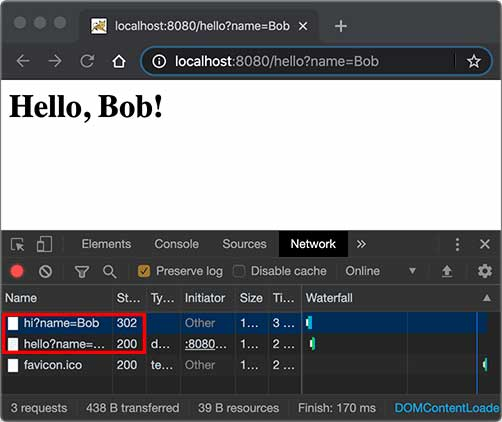

Spring常见问题

# Servlet

编写HTTP服务器很简单，但要编写完善的服务非常复杂。

在JavaEE平台上，处理TCP连接，解析HTTP协议这些底层工作统统扔给现成的Web服务器去做，因此提供了Servlet API，我们使用这套API编写自己的Servlet来处理HTTP请求，Web服务器实现Servlet API接口，实现底层功能：

```
                 ┌───────────┐
                 │My Servlet │
                 ├───────────┤
                 │Servlet API│
┌───────┐  HTTP  ├───────────┤
│Browser│<──────>│Web Server │
└───────┘        └───────────┘
```

## servlet基础

一个Servlet总是继承自`HttpServlet`，然后覆写`doGet()`或`doPost()`等方法。注意到`doGet()`方法传入了`HttpServletRequest`和`HttpServletResponse`两个对象，分别代表HTTP请求和响应。

使用Servlet API时，并不直接与底层TCP交互，也不需要解析HTTP协议，因为`HttpServletRequest`和`HttpServletResponse`就已经封装好了请求和响应。以发送响应为例，我们只需要设置正确的响应类型，然后获取`PrintWriter`，写入响应即可。

servlet简单实现：

```java
// WebServlet注解表示这是一个Servlet，并映射到地址“/”:
@WebServlet(urlPatterns = "/")
public class HelloServlet extends HttpServlet {
    @Override
    protected void doGet(HttpServletRequest req, HttpServletResponse resp) throws ServletException, IOException {
        // 设置响应类型:
        resp.setContentType("text/html");
        // 获取输出流:
        PrintWriter pw = resp.getWriter();
        // 读取url传参
        String name = req.getParameter("name");
        if (name == null) {
            name = "world";
        }
        // 写入响应:
        pw.write("<h1>Hello, " + name + "!</h1>");
        // 最后不要忘记flush强制输出:
        pw.flush();
    }
}
```

Servlet API是一个jar包，需要通过Maven来引入

```xml
<project xmlns="http://maven.apache.org/POM/4.0.0"
    xmlns:xsi="http://www.w3.org/2001/XMLSchema-instance"
    xsi:schemaLocation="http://maven.apache.org/POM/4.0.0 http://maven.apache.org/maven-v4_0_0.xsd">
    <modelVersion>4.0.0</modelVersion>
    <groupId>com.itranswarp.learnjava</groupId>
    <artifactId>web-servlet-hello</artifactId>
    <!-- 打包类型为war-->
    <packaging>war</packaging>
    <version>1.0-SNAPSHOT</version>

    <properties>
        <project.build.sourceEncoding>UTF-8</project.build.sourceEncoding>
        <project.reporting.outputEncoding>UTF-8</project.reporting.outputEncoding>
        <maven.compiler.source>11</maven.compiler.source>
        <maven.compiler.target>11</maven.compiler.target>
        <java.version>11</java.version>
    </properties>

    <dependencies>
         <!-- 引入Servlet API-->
        <dependency>
            <groupId>javax.servlet</groupId>
            <artifactId>javax.servlet-api</artifactId>
            <version>4.0.0</version>
            <scope>provided</scope>
        </dependency>
    </dependencies>

    <build>
        <finalName>hello</finalName>
    </build>
</project>
```

注意到这个`pom.xml`与前面我们讲到的普通Java程序有个区别，打包类型不是`jar`，而是`war`，表示Java Web Application Archive

注意到`<scope>`指定为`provided`，表示编译时使用，但不会打包到`.war`文件中，因为运行期Web服务器本身已经提供了Servlet API相关的jar包。

普通的Java程序是通过启动JVM，然后执行`main()`方法开始运行。但是Web应用程序有所不同，我们无法直接运行`war`文件，必须先启动Web服务器（常用如Tomcat），再由Web服务器加载我们编写的`HelloServlet`，这样就可以让`HelloServlet`处理浏览器发送的请求。

要运行我们的`hello.war`，首先要[下载Tomcat服务器](https://tomcat.apache.org/download-90.cgi)，解压后，把`hello.war`复制到Tomcat的`webapps`目录下，然后切换到`bin`目录，执行`startup.sh`或`startup.bat`启动Tomcat服务器。

## servlet开发

上述方法在tomcat中运行war，如果想在IDE中断点调试，还需要打开Tomcat的远程调试端口并且连接上去。

如何在IDE中启动并调试webapp？可以把Tomcat的jar包全部引入进来，然后自己编写一个`main()`方法，先启动Tomcat，然后让它加载我们的webapp就行。

新建一个`web-servlet-embedded`工程，编写`pom.xml`，`<packaging>`类型仍然为`war`，引入依赖`tomcat-embed-core`和`tomcat-embed-jasper。不必引入Servlet API，因为引入Tomcat依赖后自动引入了Servlet API

```xml
<project xmlns="http://maven.apache.org/POM/4.0.0"
    xmlns:xsi="http://www.w3.org/2001/XMLSchema-instance"
    xsi:schemaLocation="http://maven.apache.org/POM/4.0.0 http://maven.apache.org/xsd/maven-4.0.0.xsd">
    <modelVersion>4.0.0</modelVersion>

    <groupId>com.itranswarp.learnjava</groupId>
    <artifactId>web-servlet-embedded</artifactId>
    <version>1.0-SNAPSHOT</version>
    <packaging>war</packaging>

    <properties>
        <project.build.sourceEncoding>UTF-8</project.build.sourceEncoding>
        <project.reporting.outputEncoding>UTF-8</project.reporting.outputEncoding>
        <maven.compiler.source>11</maven.compiler.source>
        <maven.compiler.target>11</maven.compiler.target>
        <java.version>11</java.version>
        <tomcat.version>9.0.26</tomcat.version>
    </properties>

    <dependencies>
        <dependency>
            <groupId>org.apache.tomcat.embed</groupId>
            <artifactId>tomcat-embed-core</artifactId>
            <version>${tomcat.version}</version>
            <scope>provided</scope>
        </dependency>
        <dependency>
            <groupId>org.apache.tomcat.embed</groupId>
            <artifactId>tomcat-embed-jasper</artifactId>
            <version>${tomcat.version}</version>
            <scope>provided</scope>
        </dependency>
    </dependencies>
</project>
```

编写一个`main()`方法，启动Tomcat服务器，可直接在浏览器访问`http://localhost:8080/`

```java
public class Main {
    public static void main(String[] args) throws Exception {
        // 启动Tomcat:
        Tomcat tomcat = new Tomcat();
        tomcat.setPort(Integer.getInteger("port", 8080));
        tomcat.getConnector();
        // 创建webapp:
        // tomcat加载当前工程作为根webapp
        Context ctx = tomcat.addWebapp("", new File("src/main/webapp").getAbsolutePath());
        WebResourceRoot resources = new StandardRoot(ctx);
        resources.addPreResources(
                new DirResourceSet(resources, "/WEB-INF/classes", new File("target/classes").getAbsolutePath(), "/"));
        ctx.setResources(resources);
        tomcat.start();
        tomcat.getServer().await();
    }
}
```


## servlet进阶

前面基础的servlet只能处理get请求，如果要处理post请求，就需要覆写`doPost()`方法。如果没有覆写doPost，post请求就会返回405或400（get同理），参考源码：

```java
// javax.servlet.http.HttpServlet#doPost
protected void doPost(HttpServletRequest req, HttpServletResponse resp) throws ServletException, IOException {
    String protocol = req.getProtocol();
    String msg = lStrings.getString("http.method_post_not_supported");
    if (protocol.endsWith("1.1")) {
        resp.sendError(405, msg);
    } else {
        resp.sendError(400, msg);
    }
}
```

一个Webapp完全可以有多个Servlet，分别映射不同的路径，浏览器发出的HTTP请求总是由Web Server先接收，然后根据Servlet配置的映射，不同的路径转发到不同的Servlet。这种根据路径转发的功能一般称为**Dispatch**。映射到`/`的`IndexServlet`比较特殊，它实际上会接收所有未匹配的路径，相当于`/*`，因为Dispatcher的逻辑可以用伪代码实现如下：

```java
String path = ...
if (path.equals("/hello")) {
    // 路径“/hello”转发到helloServlet处理
    dispatchTo(helloServlet);
} else if (path.equals("/signin")) {
    // 路径“/signin”转发到signinServlet处理
    dispatchTo(signinServlet);
} else {
    // 所有未匹配的路径均转发到"/"
    dispatchTo(indexServlet);
}
```

### HttpServletRequest

封装了一个HTTP请求，它实际上是从`ServletRequest`继承而来。最早设计Servlet时，设计者希望Servlet不仅能处理HTTP，也能处理类似SMTP等其他协议，因此，单独抽出了`ServletRequest`接口，但实际上除了HTTP外，并没有其他协议会用Servlet处理，所以这是一个过度设计。

常用的方法有：

- getMethod()：返回请求方法，例如，`"GET"`，`"POST"`；
- getRequestURI()：返回请求路径，但不包括请求参数，例如，`"/hello"`；
- getQueryString()：返回请求参数，例如，`"name=Bob&a=1&b=2"`；
- getParameter(name)：返回请求参数，GET请求从URL读取参数，POST请求从Body中读取参数；
- getContentType()：获取请求Body的类型，例如，`"application/x-www-form-urlencoded"`；
- getContextPath()：获取当前Webapp挂载的路径，对于ROOT来说，总是返回空字符串`""`；
- getCookies()：返回请求携带的所有Cookie；
- getHeader(name)：获取指定的Header，对Header名称不区分大小写；
- getHeaderNames()：返回所有Header名称；
- getInputStream()：如果该请求带有HTTP Body，该方法将打开一个输入流用于读取Body；
- getReader()：和getInputStream()类似，但打开的是Reader；
- getRemoteAddr()：返回客户端的IP地址；
- getScheme()：返回协议类型，例如，`"http"`，`"https"`；

还有两个方法：`setAttribute()`和`getAttribute()`，可以给当前`HttpServletRequest`对象附加多个Key-Value，相当于把`HttpServletRequest`当作一个`Map<String, Object>`使用。

### HttpServletResponse

封装了一个HTTP响应。由于HTTP响应必须先发送Header，再发送Body，所以，操作`HttpServletResponse`对象时，必须先调用设置Header的方法，最后调用发送Body的方法。

常用的设置Header的方法有：

- setStatus(sc)：设置响应代码，默认是`200`；
- setContentType(type)：设置Body的类型，例如，`"text/html"`；
- setCharacterEncoding(charset)：设置字符编码，例如，`"UTF-8"`；
- setHeader(name, value)：设置一个Header的值；
- addCookie(cookie)：给响应添加一个Cookie；
- addHeader(name, value)：给响应添加一个Header，因为HTTP协议允许有多个相同的Header；

**注意**

写入完毕后调用`flush()`却是必须的，因为大部分Web服务器都基于HTTP/1.1协议，会复用TCP连接。如果没有调用`flush()`，将导致缓冲区的内容无法及时发送到客户端。此外，写入完毕后千万不要调用`close()`，原因同样是因为会复用TCP连接，如果关闭写入流，将关闭TCP连接，使得Web服务器无法复用此TCP连接。

### Servlet多线程模型

一个Servlet类在服务器中只有一个实例，但对于每个HTTP请求，Web服务器会使用多线程执行请求。因此，一个Servlet的`doGet()`、`doPost()`等处理请求的方法是多线程并发执行的。如果Servlet中定义了字段，要注意多线程并发访问的问题：

```java
public class HelloServlet extends HttpServlet {
    private Map<String, String> map = new ConcurrentHashMap<>();

    protected void doGet(HttpServletRequest req, HttpServletResponse resp) throws ServletException, IOException {
        // 注意读写map字段是多线程并发的:
        this.map.put(key, value);
    }
}
```

但是对于每个请求，Web服务器会创建唯一的`HttpServletRequest`和`HttpServletResponse`实例，因此，`HttpServletRequest`和`HttpServletResponse`实例只有在当前处理线程中有效，它们总是局部变量，不存在多线程共享的问题。

### 重定向

Redirect， 指当浏览器请求一个URL时，服务器返回一个重定向指令，告诉浏览器地址已经变了，麻烦使用新的URL再重新发送新请求。

```java
// 我们已经编写了一个能处理`/hello`的`HelloServlet`，如果收到的路径为`/hi`，希望能重定向到`/hello`，可以再编写一个RedirectServlet

@WebServlet(urlPatterns = "/hi")
public class RedirectServlet extends HttpServlet {
    protected void doGet(HttpServletRequest req, HttpServletResponse resp) throws ServletException, IOException {
        // 构造重定向的路径:
        String name = req.getParameter("name");
        String redirectToUrl = "/hello" + (name == null ? "" : "?name=" + name);
        // 发送302重定向响应:
        resp.sendRedirect(redirectToUrl);
        
        // 如果要发送301重定向，上面的代码要这么写
        // resp.setStatus(HttpServletResponse.SC_MOVED_PERMANENTLY); // 301
        // resp.setHeader("Location", "/hello");
    }
}
```

**过程**

如果浏览器发送`GET /hi`请求，`RedirectServlet`将处理此请求。由于`RedirectServlet`在内部又发送了重定向响应，因此，浏览器会收到如下响应：

```
HTTP/1.1 302 Found
Location: /hello
```

当浏览器收到302响应后，它会立刻根据`Location`的指示发送一个新的`GET /hello`请求。

```ascii
┌───────┐   GET /hi     ┌───────────────┐
│Browser│ ────────────> │RedirectServlet│
│       │ <──────────── │               │
└───────┘   302         └───────────────┘


┌───────┐  GET /hello   ┌───────────────┐
│Browser│ ────────────> │ HelloServlet  │
│       │ <──────────── │               │
└───────┘   200 <html>  └───────────────┘
```

观察Chrome浏览器的网络请求，可以看到两次HTTP请求，并且浏览器的地址栏路径自动更新为`/hello`：




重定向有两种：

- 临时重定向：响应状态码302
- 永久重定向：响应状态码301

两者的区别：如果服务器发送301，浏览器会**缓存**`/hi`到`/hello`这个重定向的关联，下次请求`/hi`的时候，浏览器就直接发送`/hello`请求了。

**作用**

当Web应用升级后，如果请求路径发生了变化，可以将原来的路径重定向到新路径，从而避免浏览器请求原路径找不到资源。


### 转发

Forward，指内部转发。当一个Servlet处理请求的时候，它可以决定自己不继续处理，而是转发给另一个Servlet处理。

```java
// 我们已经编写了一个能处理`/hello`的`HelloServlet`，继续编写一个能处理`/morning`的`ForwardServlet`

@WebServlet(urlPatterns = "/morning")
public class ForwardServlet extends HttpServlet {
    protected void doGet(HttpServletRequest req, HttpServletResponse resp) throws ServletException, IOException {
        req.getRequestDispatcher("/hello").forward(req, resp);
    }
}
```

`ForwardServlet`在收到请求后，它并不自己发送响应，而是把请求和响应都转发给路径为`/hello`的Servlet，后续请求的处理实际上是由`HelloServlet`完成的。这种处理方式称为转发（Forward），我们用流程图画出来如下：

```ascii
                          ┌────────────────────────┐
                          │      ┌───────────────┐ │
                          │ ────>│ForwardServlet │ │
┌───────┐  GET /morning   │      └───────────────┘ │
│Browser│ ──────────────> │              │         │
│       │ <────────────── │              ▼         │
└───────┘    200 <html>   │      ┌───────────────┐ │
                          │ <────│ HelloServlet  │ │
                          │      └───────────────┘ │
                          │       Web Server       │
                          └────────────────────────┘
```

**转发和重定向的区别**

转发是在Web服务器内部完成的，对浏览器来说，它只发出了一个HTTP请求，浏览器的地址栏路径仍然是`/morning`，浏览器并不知道该请求在Web服务器内部实际上做了一次转发。

## MVC

```
   HTTP Request    ┌─────────────────┐
──────────────────>│DispatcherServlet│
                   └─────────────────┘
                            │
               ┌────────────┼────────────┐
               ▼            ▼            ▼
         ┌───────────┐┌───────────┐┌───────────┐
         │Controller1││Controller2││Controller3│
         └───────────┘└───────────┘└───────────┘
               │            │            │
               └────────────┼────────────┘
                            ▼
   HTTP Response ┌────────────────────┐
<────────────────│render(ModelAndView)│
                 └────────────────────┘
```

## Filter过滤器

过滤器是Servlet规范的组件，对 **请求和响应**`(ServletRequest request, ServletResponse response)`进行预处理。

过滤器 **依赖于servlet容器**，基于函数回调实现。随web应用的启动而启动，只初始化一次，随web应用的停止而销毁。

1. 启动服务器时加载过滤器的实例，并调用init()方法来初始化实例
2. 每一次请求时都只调用方法doFilter()进行处理；
3. 停止服务器时（stop Spring应用）调用destroy()方法，销毁实例。

**使用**

1. 实现Filter接口（引入 javax.servlet.*），重写init、doFilter和destroy方法
2. a)实现类加上@Component注解

```java
@Component
public class TimeFilter implements Filter {
    @Override
    public void init(FilterConfig filterConfig) throws ServletException {
        System.out.println("=======================time filter init======================");
    }

    @Override
    public void doFilter(ServletRequest request, ServletResponse response, FilterChain chain) throws IOException, ServletException {
        System.out.println("======================time filter start======================");
        long startTime =  System.currentTimeMillis();

        chain.doFilter(request, response);  // 在重写的doFilter中调用FilterChain实例的doFilter方法

        long endTime = System.currentTimeMillis();
        System.out.println("time filter 消耗"+ (endTime - startTime) + "ms");
        System.out.println("======================time filter end ======================");
    }

    @Override
    public void destroy() {
        System.out.println("======================time filter destroy======================");
    }
}
```

b)若要指定过滤的url，在过滤器实现类加`@WebFilter()`，启动类加`@ServletComponentScan`

```java
@WebFilter("/user/*")  // 参数填要过滤的url
public class TimeFilter implements Filter {
	...
}
```

c)或用配置类注册Filter，也可设置过滤的url

```java
@Configuration
public class FilterConfiguration {
    // 返回一个用于注册filter的bean
    @Bean
    public FilterRegistrationBean<TimeFilter> timeFilter() {
        FilterRegistrationBean<TimeFilter> registrationBean = new FilterRegistrationBean<>();
        TimeFilter timeFilter = new TimeFilter();
        registrationBean.setFilter(timeFilter);   // 设置Filter
        List<String> urls = new ArrayList<>();
        urls.add("/*");
        registrationBean.setUrlPatterns(urls);  // 设置要过滤的url
        // 注意一定要设置过滤的url，否则会将静态资源也过滤进来
        // 从而报转换错误：java.lang.ClassCastException:
        //        org.springframework.web.servlet.resource.ResourceHttpRequestHandler cannot be cast to
        //        org.springframework.web.method.HandlerMethod
        return registrationBean;
    }
}
```

从doFilter方法的参数可知，filter里面是能够获取到**请求**的参数和**响应**的数据；但此方法是无法知道是哪一个Controller类中的哪个方法被执行。

**注意**

Filter中是没法使用注入的bean的，也就是无法使用@Autowired

```java
@Component
public class TimeFilter implements Filter {
    // 注入的值为null
    @Autowired
    private UserService userService;
}
```

Spring中，web应用启动的顺序是：listener->filter->servlet，先初始化listener，然后再来就filter的初始化，再接着才到我们的dispathServlet的初始化，因此，当我们需要在filter里注入一个注解的bean时，就会注入失败，因为filter初始化时，注解的bean还没初始化，没法注入。

此外对请求和响应进行预处理时，注意不要影响原始的请求和响应，用**代理**模式”复制“一份再处理，参考：

[修改请求](https://www.liaoxuefeng.com/wiki/1252599548343744/1328976435871777)

[修改响应](https://www.liaoxuefeng.com/wiki/1252599548343744/1328976456843298)


## Listener监听器

与Filter一样也是Servlet规范的组件，一般来说Listener启动在Filter之前，销毁在其后。

其中最常用的是`ServletContextListener`,它会在整个Web应用程序初始化完成后，以及Web应用程序关闭后获得回调通知。一个Web服务器可以运行一个或多个WebApp，对于每个WebApp，Web服务器都会为其创建一个全局唯一的`ServletContext`实例

```java
@WebListener  // 务必加这个注解，同时在启动类加@ServletComponentScan
public class AppListener implements ServletContextListener {
    // 在此初始化WebApp,例如打开数据库连接池等:
    public void contextInitialized(ServletContextEvent sce) {
        System.out.println("WebApp initialized: ServletContext = " + sce.getServletContext());
    }

    // 在此清理WebApp,例如关闭数据库连接池等:
    public void contextDestroyed(ServletContextEvent sce) {
        System.out.println("WebApp destroyed.");
    }
}
```

除了`ServletContextListener`外，还有几种Listener：

- HttpSessionListener：监听HttpSession的创建和销毁事件；
- ServletRequestListener：监听ServletRequest请求的创建和销毁事件；
- ServletRequestAttributeListener：监听ServletRequest请求的属性变化事件（即调用`ServletRequest.setAttribute()`方法）；
- ServletContextAttributeListener：监听ServletContext的属性变化事件（即调用`ServletContext.setAttribute()`方法）；

用于监听请求的ServletRequestListener用法：

```java
@WebListener
public class MyServletRequestListener implements ServletRequestListener {
    @Override
    public void requestInitialized(ServletRequestEvent sre) {  // 监听请求建立
        System.out.println("requestInitialized" + "," + new Date());
        Object count = sre.getServletContext().getAttribute("count");  // 从请求中获取ServletContext实例，并取count属性，作为访问次数统计
        Integer cInteger = 0;
        if (count != null) {
            cInteger = Integer.valueOf(count.toString());
        }
        System.out.println("历史访问次数：" + count);
        cInteger++;
        sre.getServletContext().setAttribute("count", cInteger);
    }
    
    @Override
    public void requestDestroyed(ServletRequestEvent sre) {  // 监听请求销毁
        System.out.println("requestDestroyed" + "," + new Date());
        System.out.println("当前访问次数：" + sre.getServletContext().getAttribute("count"));
    }
}
```

## Q：jar包和war包的区别？

jar包是java打的包，war包可以理解为javaweb打的包。

jar包中只是用java来写的项目打包来的，里面只有编译后的class和一些部署文件。

而war包里面的东西就全了，包括写的代码编译成的class文件，依赖的包，配置文件，所有的网站页面，包括html，jsp等等。一个war包可以理解为是一个web项目，里面是项目的所有东西。

前后端分离的项目，后端war包存放空页面

# Tomcat

spring内置的服务器，默认配置：

- 连接等待队列长度100
- 最大连接数 8192
- 最小工作线程 10
- 最大线程数 200
- **连接超时时间 20s**

配置yml：

```yaml
server:
  tomcat:
    # 接受队列容量。能建立连接请求的最大队列长度。与 Linux 中的系统参数 somaxconn 取较小值
    accept-count: 100
    # 服务器在任何给定时间接受和处理的最大连接数。一旦达到限制，操作系统仍然可以接受基于“acceptCount”属性的连接。
    max-connections: 8192
    threads:
      # 工作线程的最小数量，初始化时创建的线程数
      min-spare: 10
      # 工作线程的最大数量 io密集型建议10倍的cpu数，cpu密集型建议cpu数+1，绝大部分应用都是io密集型
      max: 200
    # 连接器在接受连接后等待显示请求 URI 行的时间。
    connection-timeout: 20000
    # 在关闭连接之前等待另一个 HTTP 请求的时间。如果未设置，则使用 connectionTimeout。设置为 -1 时不会超时。
    keep-alive-timeout: 20000
    # 在连接关闭之前可以进行流水线处理的最大HTTP请求数量。当设置为0或1时，禁用keep-alive和流水线处理。当设置为-1时，允许无限数量的流水线处理或keep-alive请求。 
    max-keep-alive-requests: 100
```

## Q：SpringBoot单体应用支持的最大并发？

在默认设置中，最大并发量是**200**。

原因：最大并发实际上取决于**web容器**。SpringBoot并不是web容器，而是内置了Tomcat。Tomcat的线程池参数：核心线程数10，最大线程数是200，队列长度 Integer.MAX_VALUE。

而 **Tomcat 线程池机制**和JDK不太一样，先使用核心线程数配置，再使用最大线程配置，最后才使用队列长度。因此假设1000个请求同时到来，核心线程直接用完，然后启用最大线程数200，最后再放队列，所以默认支持的最大并发是200。

> JDK 线程池：先使用核心线程数配置，接着使用队列长度，最后再使用最大线程配置。

扩展：如果修改tomcat配置，可以提升最大并发数。

再扩展：如果使用其他web容器（springboot还支持Jetty、Netty、Undertow等）

> 参考原文：[面试官：一个 SpringBoot 项目能处理多少请求？（小心有坑）](https://mp.weixin.qq.com/s/PXC4pFE_ZpydBAzCJZmiqQ)

### 扩展

> 先上结论：spring的最大并发并不完全由tomcat的最大线程数决定，还要看tomcat的参数：**maxConnections + acceptCount + 1**

上面是从线程池角度分析，以下从连接角度分析。

如下图，连接首先到达操作系统的 **接受队列**，然后进入tomcat。当连接数超过接受队列容量，则等待：


当tomcat最大线程用满，则进入**tomcat的队列**。

当连接数大于`maxConnections + acceptCount + 1`时，新来的请求并不会被服务器拒绝，而是**不会接受**（即进行3次握手），一段时间后（客户端的超时时间或者服务端Tomcat默认的20s，取较小值）会出现请求连接超时。


测试：

```yaml
server:
  port: 8080
  tomcat:
    accept-count: 3
    max-connections: 6
    threads:
      min-spare: 2
      max: 3
```


使用 ss -nlt 查看连接排队队列情况：

```bash
ss -nlt|grep 8080
```

- Recv-Q表示（acceptCount）连接排队队列目前长度
- Send-Q表示（acceptCount）连接排队队列的容量

10个并发线程时，可以看到，连接排队队列有4个请求在等待，队列容量是3。


解释：10个线程，tomcat最大线程数3，接受队列3，剩下4个线程等待进入接受队列。

当并发线程为11个时，使用 ss -nlt 查看连接状态：

```bash
ss -nt|grep 8080
```

- Recv-Q表示客户端有多少个字节发送但还没有被服务端接收
- Send-Q就表示为有多少个字节未被客户端接收。


由于11 > maxConnections+acceptCount+1=10，因此有个连接一直停留在 SYN_RECV 状态，客户端则一直停留在 SYN-SENT，不会完成 3 次握手了。直到客户端或tomcat连接超时。

其他10个建立的连接，有6个被接收，4个在排队中。


# Spring

## Spring IoC

**Inverse of Control（控制反转）**是一种设计思想：

- **控制**指的是对象创建（实例化、管理）的权力；
- **反转**是控制权交给外部环境（Spring 框架、IoC 容器）。

> **IoC 容器**是 Spring 用来实现 IoC 的载体，IoC 容器 负责管理对象的整个生命周期，包括创建、装配（通过依赖注入）、销毁等。  IoC 容器实际上就是个 Map，存放各种对象。
>
> Spring实现IoC的方式，就是对象的创建和管理交给Spring负责。所有组件（对象）统称为**JavaBean**，每个对象就是一个bean。

例如：现有类 A 依赖于类 B

- **传统的开发方式** ：往往是在类 A 中手动通过 new 关键字来 new 一个 B 的对象出来
- **使用 IoC 思想的开发方式** ：不通过 new 关键字来创建对象，而是通过 IoC 容器(Spring 框架) 来帮助我们实例化对象。我们需要哪个对象，直接从 IoC 容器里取即可。

```java
// 传统方式
Class A {}
Class B {
    // B需要将A的实例new出来，也就是我们说的控制
    private A a = new A();
    public void use() {
        System.out.print(a);
    }
}
// IoC
@Component // 说明A自己控制自己，把自己初始化出来，注入给了容器
Class A {}
Class B {
  	// B不需要控制a，直接使用。如果A没有把自己注入给容器，B就不能使用
    @Resource
    private A a;
    public void use() {
        System.out.print(a);
    }
}
```

### IoC的优点

1. 使用者无需关心引用bean的实现细节。例如对B b = new A(c, d, e, f);来说，如果B要使用A，还需要把c, d, e, f多个类全都感知一遍，显然麻烦且不合理
2. 使用者无需关心bean的修改。
3. 单例模式，不用创建多个相同的bean导致浪费


### IoC 和 DI 

网上常把IoC和DI等同。IoC 最常见以及最合理的实现方式叫做**依赖注入**（Dependency Injection，简称 DI）。

> 老马（Martin Fowler）在一篇文章中提到将 IoC 改名为 DI，原文如下，原文地址：https://martinfowler.com/articles/injection.html 。大概意思是 IoC 太普遍并且不表意，很多人会因此而迷惑，所以，使用 DI 来精确指名这个模式比较好。

### IoC实现机制

反射+工厂模式

1. 从**配置元数据**中获取要DI的业务POJO

 > 配置元数据：xml、注解、configuration类等
 >
 > POJO：Plain Old Java Object，普通java对象。注意与JavaBean区分

2. 通过反射，将业务POJO形成BeanDefinition注入Spring容器

3. 使用方通过ApplicationContext从Spring容器直接获取

### 无侵入容器

在设计上，Spring的IoC容器是一个高度可扩展的无侵入容器。所谓无侵入，是指应用程序的组件无需实现Spring的特定接口，或者说，组件根本不知道自己在Spring的容器中运行。这种无侵入的设计有以下好处：

1. 应用程序组件既可以在Spring的IoC容器中运行，也可以自己编写代码自行组装配置；
2. 测试的时候并不依赖Spring容器，可单独进行测试，大大提高了开发效率。

## Spring AOP

Aspect-Oriented Programming（面向切面编程）能够将那些与业务无关，却为业务模块所**共用**的代码（称为**横切逻辑代码**）（例如：事务处理、日志管理、权限控制等）封装起来，便于减少重复代码，降低模块耦合度，增加可拓展性和可维护性。

- Aspect切面：由切入点和通知组成，既包含横切逻辑的定义，也包括切入点的定义。切面是一个横切关注点的模块化，一个切面能够包含同一个类型的不同增强方法，比如说事务处理和日志处理可以理解为两个切面。

- PointCut 切入点：是对连接点进行拦截的条件定义，决定通知应该作用于截哪些方法

- Advice 通知：定义了通过切入点拦截后做什么，是切面的具体行为。主要有三大类

  > Before 前置通知：在方法调用前
  >
  > After 后置通知：在方法调用后，无论方法是否异常
  >
  > After-returning 后置返回通知：在方法正常返回后
  >
  > After-throwing 后置异常通知：在方法抛出异常时
  >
  > Around 环绕通知：在方法调用前后

- Target 目标对象：要被增强（代理）的对象（或称：切面通知的对象），即包含主业务逻辑的类对象

- JoinPoint 连接点：程序运行时的执行点，可以是正在执行的方法， 或者是正在抛出的异常。Spring只支持**方法类型**的连接点。由两个信息确定：
  > 方法：表示程序执行点，即在哪个目标方法
  > 相对点：目标方法的调用前、后、环绕
  
- Weaving 织入：将切面和业务逻辑连接起来，并创建通知代理的过程。可以在编译时、类加载时和运行时完成。
  
  > 编译时织入：静态代理
  > 运行时织入：动态代理（如spring）

### AOP实现原理

Spring AOP 就是基于动态代理的

- 如果要代理的对象实现了某个接口，那么 Spring AOP 会使用 **JDK Proxy**，去创建代理对象
- 对于没有实现接口的对象，就无法使用 JDK Proxy 代理，这时候 Spring AOP 会使用 **Cglib** 生成一个被代理对象的子类来作为代理，如下图所示：


### Q：Spring AOP创建时机？

**实例化后**

在BeanPostProcessor后置处理器时创建，有jdk动态代理和cglib两种实现

org.springframework.aop.framework.autoproxy.AbstractAutoProxyCreator#postProcessBeforeInstantiation

```java
@Override
public Object postProcessBeforeInstantiation(Class<?> beanClass, String beanName) {
    Object cacheKey = getCacheKey(beanClass, beanName);
    // 创建代理
    TargetSource targetSource = getCustomTargetSource(beanClass, beanName);
    if (targetSource != null) {
        if (StringUtils.hasLength(beanName)) {
            this.targetSourcedBeans.add(beanName);
        }
        // 直接去生成代理对象
        Object[] specificInterceptors = getAdvicesAndAdvisorsForBean(beanClass, beanName, targetSource);
        Object proxy = createProxy(beanClass, beanName, specificInterceptors, targetSource);
        this.proxyTypes.put(cacheKey, proxy.getClass());
        return proxy;
    }
    return null;
}
```


# Q：Spring 用到了哪些设计模式？

1. 工厂模式：**BeanFactory**就是简单工厂模式的体现，用来创建对象的实例；
2. 单例模式：Bean默认为单例模式。
3. 代理模式：Spring的AOP功能用到了JDK的动态代理和CGLIB字节码生成技术；
4. 模板方法：用来解决代码重复的问题。比如. RestTemplate, JmsTemplate, JpaTemplate。
5. 观察者模式：定义对象键一种一对多的依赖关系，当一个对象的状态发生改变时，所有依赖于它的对象都会得到通知被制动更新，如Spring中listener的实现–ApplicationListener。
6. 责任链模式：SpringMVC中，通过一系列的拦截器来处理请求执行前，执行后，以及结束的response，核心的类是`handlerExecutionChain`，它封装了HandlerAdapter和一系列过滤器

# Q：SpringBoot是怎么启动的？


SpringBoot通常有一个入口类：`XXXApplication`， 里面有main方法，就是标准Java应用的入口方法，在main中调用`SpringApplication.run()` 启动整个应用：

```java
@SpringBootApplication
public class Application {
    public static void main(String[] args) {
    	SpringApplication.run(Application.class, args);  也可简化调用静态方法
    }
}
```

run方法的实现分两步：`new SpringApplication`的初始化过程，`SpringApplication.run`的启动过程。

## 总流程图


## 一、SpringApplication构造函数

调用`initialize`方法：

1. 添加源：将提供的源（通常是**配置类**）添加到应用的源列表中。
2. 设置 Web 环境：判断应用是否应该运行在 Web 环境中，这会影响后续的 Web 相关配置。
3. 加载初始化器：从`spring.factories`文件中加载所有列出的`ApplicationContextInitializer`实现，并将它们设置到`SpringApplication`实例中，以便在应用上下文的初始化阶段执行它们。
4. 设置监听器：加载和设置`ApplicationListener`实例，以便应用能够响应不同的事件。
5. 确定主应用类：确定主应用类，这个主应用程序类通常是包含`public static void main(String[] args)`方法的类，是启动整个SpringBoot应用的入口点。

> 其中第3步**加载初始化器**是Spring Boot的**自动配置的核心**，因为在这一步会从`spring.factories`文件中加载并实例化指定类型的类。
>
> ```java
> private <T> Collection<? extends T> getSpringFactoriesInstances(Class<T> type, Class<?>[] parameterTypes, Object... args) {
>     // 3.1 获取当前线程的上下文类加载器
>     ClassLoader classLoader = Thread.currentThread().getContextClassLoader();
>     // 3.2 从spring.factories加载指定类型的工厂名称，并使用LinkedHashSet确保名称的唯一性，以防重复
>     Set<String> names = new LinkedHashSet<String>(SpringFactoriesLoader.loadFactoryNames(type, classLoader));
>     // 3.3 创建指定类型的实例。这里使用反射来实例化类，并传入任何必要的参数
>     List<T> instances = createSpringFactoriesInstances(type, parameterTypes, classLoader, args, names);
>     // 3.4 对实例进行排序，这里使用的是Spring的注解感知比较器，可以处理@Order注解和Ordered接口
>     AnnotationAwareOrderComparator.sort(instances);
>     // 3.5 返回实例集合
>     return instances;
> }
> ```
>
> 

下图总结了`new SpringApplication()`的主要流程，主要调用`initialize`方法初始化SpringBoot应用的关键组件和配置。这个过程确保了在应用上下文被创建和启动之前，所有关键的设置都已就绪，包括环境设置、初始化器和监听器的配置，以及主应用类的识别。


## 二、执行run方法


```java
public ConfigurableApplicationContext run(String... args) {
    // 创建并启动一个计时器，用于记录应用启动耗时
    StopWatch stopWatch = new StopWatch();
    stopWatch.start();

    ConfigurableApplicationContext context = null;
    FailureAnalyzers analyzers = null;

    // 配置无头（headless）属性，影响图形环境的处理
    configureHeadlessProperty();

    // 获取应用运行监听器，并触发开始事件
    SpringApplicationRunListeners listeners = getRunListeners(args);
    listeners.starting();

    try {
        // 创建应用参数对象
        ApplicationArguments applicationArguments = new DefaultApplicationArguments(args);
        // 准备环境，包括配置文件和属性源
        ConfigurableEnvironment environment = prepareEnvironment(listeners, applicationArguments);
        // 打印应用的 Banner
        Banner printedBanner = printBanner(environment);
        // 创建应用上下文
        context = createApplicationContext();
        // 创建失败分析器
        analyzers = new FailureAnalyzers(context);
        // 准备上下文，包括加载 bean 定义
        prepareContext(context, environment, listeners, applicationArguments, printedBanner);
        // 刷新上下文，完成 bean 的创建和初始化
        refreshContext(context);
        // 刷新后的后置处理
        afterRefresh(context, applicationArguments);
        // 通知监听器，应用运行完成
        listeners.finished(context, null);
        // 停止计时器
        stopWatch.stop();
        // 如果启用了启动信息日志，记录应用的启动信息
        if (this.logStartupInfo) {
            new StartupInfoLogger(this.mainApplicationClass).logStarted(getApplicationLog(), stopWatch);
        }
        //触发ApplicationStartedEvent 事件
        listeners.started(context);
        //调用实现了 CommandLineRunner 和 ApplicationRunner 接口的 bean 中的 run 方法
		callRunners(context, applicationArguments);
        // 触发 ApplicationReadyEvent 事件
        listeners.running(context);
        // 返回配置好的应用上下文
        return context;
    }
    catch (Throwable ex) {
        // 处理运行失败的情况
        handleRunFailure(context, listeners, analyzers, ex);
        throw new IllegalStateException(ex);
    }
}

```

其中几个重要步骤：

**启动&停止计时器**：在代码中，用到stopWatch来进行计时。所以在最开始先要启动计时，在最后要停止计时。这个计时就是最终用来统计启动过程的时长的。最终在应用启动信息输出的实时打印出来，如以下内容：

```java
2023-11-18 09:00:05.789  INFO 12345 --- [           main] com.hollis.myapp.Application            : Started Application in 6.666 seconds (JVM running for 7.789)
```

**获取和启动监听器**：这一步从spring.factories中解析初始所有的SpringApplicationRunListener 实例，并通知他们应用的启动过程已经开始。

> SpringApplicationRunListener 是 Spring Boot 中的一个接口，用于在应用的启动过程中的不同阶段提供回调。实现这个接口允许监听并响应应用启动周期中的关键事件。SpringApplicationRunListener 接口定义了多个方法，每个方法对应于启动过程中的一个特定阶段。这些方法包括：
>
> 1. starting()：在运行开始时调用，此时任何处理都未开始，可以用于初始化在启动过程中需要的资源。
> 2. environmentPrepared()：当 SpringApplication 准备好 Environment（但在创建 ApplicationContext 之前）时调用，这是修改应用环境属性的好时机。
> 3. contextPrepared()：当 ApplicationContext 准备好但在它加载之前调用，可以用于对上下文进行一些预处理。
> 4. contextLoaded()：当 ApplicationContext 被加载（但在它被刷新之前）时调用，这个阶段所有的 bean 定义都已经加载但还未实例化。
> 5. started()：在 ApplicationContext 刷新之后、任何应用和命令行运行器被调用之前调用，此时应用已经准备好接收请求。
> 6. running()：在运行器被调用之后、应用启动完成之前调用，这是在应用启动并准备好服务请求时执行某些动作的好时机。
> 7. failed()：如果启动过程中出现异常，则调用此方法。

**装配环境参数**：这一步主要是用来做参数绑定的，prepareEnvironment 方法会加载应用的外部配置。这包括 application.properties 或 application.yml 文件中的属性，环境变量，系统属性等。所以，我们自定义的那些参数就是在这一步被绑定的。

**打印Banner**：这一步的作用很简单，就是在控制台打印应用的启动横幅Banner。如以下内容：

```java
  .   ____          _            __ _ _
 /\\ / ___'_ __ _ _(_)_ __  __ _ \ \ \ \
( ( )\___ | '_ | '_| | '_ \/ _` | \ \ \ \
 \\/  ___)| |_)| | | | | || (_| |  ) ) ) )
  '  |____| .__|_| |_|_| |_\__, | / / / /
 =========|_|==============|___/=/_/_/_/
 :: Spring Boot ::                (v3.1.5)
```

**创建应用上下文**：到这一步就真的开始启动了，第一步就是先要创建一个Spring的上下文出来，只有有了这个上下文才能进行Bean的加载、配置等工作。

### 准备上下文

这一步非常关键，很多核心操作都是在这一步完成的：

```java
private void prepareContext(ConfigurableApplicationContext context, ConfigurableEnvironment environment,
        SpringApplicationRunListeners listeners, ApplicationArguments applicationArguments, Banner printedBanner) {
    // 将environment设置到应用上下文中
    context.setEnvironment(environment);
    // 对应用上下文进行后处理（可能涉及一些自定义逻辑）
    postProcessApplicationContext(context);
    // 应用所有的ApplicationContextInitializer
    applyInitializers(context);
    // 通知监听器上下文准备工作已完成
    listeners.contextPrepared(context);
    // 如果启用了启动信息日志，则记录启动信息和配置文件信息
    if (this.logStartupInfo) {
        logStartupInfo(context.getParent() == null);
        logStartupProfileInfo(context);
    }
    // 向上下文中添加特定于 Spring Boot 的单例 Bean
    context.getBeanFactory().registerSingleton("springApplicationArguments", applicationArguments);
    if (printedBanner != null) {
        context.getBeanFactory().registerSingleton("springBootBanner", printedBanner);
    }
    // 加载应用的源（如配置类）
    Set<Object> sources = getSources();
    Assert.notEmpty(sources, "Sources must not be empty");
    load(context, sources.toArray(new Object[sources.size()]));
    // 通知监听器上下文加载已完成
    listeners.contextLoaded(context);
}
```

这一步，会打印启动的信息日志，主要内容如下：

```java
2023-11-18 09:00:00.123  INFO 12345 --- [           main] com.example.myapp.Application            : Starting Application v0.1.0 on MyComputer with PID 12345 (started by user in /path/to/app)
```

### 刷新上下文

是Spring启动的核心步骤，这一步骤包括了实例化所有的 Bean、设置它们之间的依赖关系以及执行其他的初始化任务。

```java
@Override
public void refresh() throws BeansException, IllegalStateException {
	synchronized (this.startupShutdownMonitor) {
		// 为刷新操作准备此上下文
		prepareRefresh();
		// 告诉子类刷新内部 bean 工厂
		ConfigurableListableBeanFactory beanFactory = obtainFreshBeanFactory();
		// 为在此上下文中使用做好 bean 工厂的准备工作
		prepareBeanFactory(beanFactory);
		try {
			// 允许在上下文子类中对 bean 工厂进行后处理
			postProcessBeanFactory(beanFactory);
			// 调用在上下文中注册为 bean 的工厂处理器
			invokeBeanFactoryPostProcessors(beanFactory);
			// 注册拦截 bean 创建的 bean 处理器
			registerBeanPostProcessors(beanFactory);
			// 初始化此上下文的消息源
			initMessageSource();
			// 初始化此上下文的事件多播器
			initApplicationEventMulticaster();
			// 在特定上下文子类中初始化其他特殊 bean
			onRefresh();
			// 检查监听器 bean 并注册它们
			registerListeners();
			// 实例化所有剩余的（非懒加载）单例
			finishBeanFactoryInitialization(beanFactory);
			// 最后一步：发布相应的事件
			finishRefresh();
		}
		catch (BeansException ex) {
			if (logger.isWarnEnabled()) {
				logger.warn("Exception encountered during context initialization - " +
						"cancelling refresh attempt: " + ex);
			}
			// 销毁已经创建的单例以避免悬挂资源
			destroyBeans();
			// 重置“激活”标志
			cancelRefresh(ex);
			// 将异常传播给调用者
			throw ex;
		}
		finally {
			// 在 Spring 的核心中重置常见的内省缓存，因为我们可能不再需要单例 bean 的元数据...
			resetCommonCaches();
		}
	}
}
```

主要就是创建BeanFactory，然后再通过BeanFactory来实例化Bean。

**注意**：很多人都会忽略一个关键的步骤（网上很多介绍SpringBoot启动流程的都没提到），那就是**Web容器的启动**，及Tomcat的启动其实也是在这个步骤。

在refresh()-> onRefresh()中，调用createWebServer方法中。第20行factory.getWebServer() 获取的factory有三种实现，分别是JettyServletWebServerFactory、TomcatServletWebServerFactory、UndertowServletWebServerFactory这三个，默认使用`TomcatServletWebServerFactory`。

```java
@Override
protected void onRefresh() {
    super.onRefresh();
    try {
        createWebServer();  // 调用下面
    }
    catch (Throwable ex) {
        throw new ApplicationContextException("Unable to start web server", ex);
    }
}

private void createWebServer() {
    WebServer webServer = this.webServer;
    ServletContext servletContext = getServletContext();
    if (webServer == null && servletContext == null) {
        StartupStep createWebServer = getApplicationStartup().start("spring.boot.webserver.create");
        ServletWebServerFactory factory = getWebServerFactory();
        createWebServer.tag("factory", factory.getClass().toString());
        // 这里默认获取 TomcatServletWebServerFactory
        this.webServer = factory.getWebServer(getSelfInitializer());
        createWebServer.end();
        getBeanFactory().registerSingleton("webServerGracefulShutdown",
                new WebServerGracefulShutdownLifecycle(this.webServer));
        getBeanFactory().registerSingleton("webServerStartStop",
                new WebServerStartStopLifecycle(this, this.webServer));
    }
    else if (servletContext != null) {
        try {
            getSelfInitializer().onStartup(servletContext);
        }
        catch (ServletException ex) {
            throw new ApplicationContextException("Cannot initialize servlet context", ex);
        }
    }
    initPropertySources();
}
```


TomcatServletWebServerFactory的getWebServer方法如下，这里会创建一个Tomcat：

```java
@Override
public WebServer getWebServer(ServletContextInitializer... initializers) {
    if (this.disableMBeanRegistry) {
        Registry.disableRegistry();
    }
    Tomcat tomcat = new Tomcat();
    File baseDir = (this.baseDirectory != null) ? this.baseDirectory : createTempDir("tomcat");
    tomcat.setBaseDir(baseDir.getAbsolutePath());
    for (LifecycleListener listener : this.serverLifecycleListeners) {
        tomcat.getServer().addLifecycleListener(listener);
    }
    Connector connector = new Connector(this.protocol);
    connector.setThrowOnFailure(true);
    tomcat.getService().addConnector(connector);
    customizeConnector(connector);
    tomcat.setConnector(connector);
    tomcat.getHost().setAutoDeploy(false);
    configureEngine(tomcat.getEngine());
    for (Connector additionalConnector : this.additionalTomcatConnectors) {
        tomcat.getService().addConnector(additionalConnector);
    }
    prepareContext(tomcat.getHost(), initializers);
    return getTomcatWebServer(tomcat);
}
```

上面第23行会创建并启动一个TomcatServer：

```java
protected TomcatWebServer getTomcatWebServer(Tomcat tomcat) {
    return new TomcatWebServer(tomcat, getPort() >= 0, getShutdown());
}

public TomcatWebServer(Tomcat tomcat, boolean autoStart, Shutdown shutdown) {
    Assert.notNull(tomcat, "Tomcat Server must not be null");
    this.tomcat = tomcat;
    this.autoStart = autoStart;
    this.gracefulShutdown = (shutdown == Shutdown.GRACEFUL) ? new GracefulShutdown(tomcat) : null;
    initialize();
}
```

然后在第10行initialize()中完成tomcat的启动：


入口类要使用`@SpringBootApplication`注解声明，主要包含三个Annotation：

- @EnableAutoConfiguration 通过@import将所有符合自动配置条件的bean定义都加载到IoC容器 搜索符合自动配置条件的功能需要借助于SpringFactoriesLoader提供的配置查找的功能 即根据 @EnableAutoConfiguration的完整类名作为查找的Key 获取对应的一组Configuration类
- @Configuration 和JavaConfig形式的Spring loc容器的配置类使用的@Configuration一样 是其定义成一个JavaConfig配置类
- @ComponentScan 对应XML配置中的元素 其功能就是自动扫描并加载符合条件的组件（比如@Component和@Repository等）或者bean定义，最终将这些bean定义加载到IoC容器

# Q：如何解决循环依赖？

A创建时--->需要B---->B去创建--->需要A，从而产生了循环依赖

Spring使用三级缓存，其实就是三个map：

1. `singletonObjects`：ConcurrentHashMap<beanName, bean>。也称单例池，缓存已经经历了完整生命周期的bean对象。

2.  `earlySingletonObjects`：HashMap<beanName, bean>。比单例池多了一个early，表示缓存的是早期的bean对象（Bean的生命周期还没完整） 

3. `singletonFactories` ：ConcurrentHashMap<beanName, bean>。缓存ObjectFactory，表示对象工厂，表示用来创建早期bean对象的 工厂。

SingletonObjecs 完成初始化的单例对象的cache（一级缓存）

EarlySingletonObjecs 完成实例化但没有初始化的 提前曝光的单例对象的Cache（二级缓存）

SingletonFactories 进入实例化阶段的单例对象工厂的cache（三级缓存）


# Q：循环依赖无法解决的场景？

**1.@Repository**

```java
// IA 、 IB是两个空接口，略
@Repository
public class A implements IA {
    @Autowired
    private IB ib;
}
@Repository
public class B implements IB {
    @Autowired
    private IA ia;
}
```

A、B两个实现类中互相注入对方的接口，若A、B的注解都是@Repository，则spring无法启动，报错： Error creating bean with name 'a': Bean with name 'a' has been injected into other beans [b] in its raw version as part of a circular reference, but has eventually been wrapped. This means that said other beans do not use the final version of the bean. This is often the result of over-eager type matchin                                   

只有当其中一个不是@Repository，或两个都不是，比如用@Service、@Controller或@Component时，才不会报错

**2.循环依赖+@Async**

```java
@Component
public class AService {
   @Autowired
   private BService bService;

   @Async
   public void test() {
      System.out.println(bService);
   }
}
```

```java
@Component
public class BService {
   @Autowired
   private AService aService;
}
```

原因：@Async也会生成代理对象（但与AOP是两码事）。由于循环依赖+AOP，AService**提前AOP**，因此B注入的是AService的**AOP代理对象**。而AService的@Async代理对象并不会提前，依然是初始化后生成，因此放入单例池的是@Async代理对象，与注入B的产生不一致冲突。

解决：本质都是避免提前AOP
1 在A的bService加@Lazy。于是B在使用的时候才创建（即test方法）

2 test方法移到B。Spring对循环依赖的两个类创建还是有**先后顺序**的，先创建A再创建B，因此B不会提前AOP，而是顺利走完生命周期添加到单例池，然后A也顺利创建

**3.都是原型**

```java
@Scope("prototype")
@Component
public class AService {
   @Autowired
   private BService bService;
}
@Scope("prototype")
@Component
public class BService {
	@Autowired
	private AService aService;
}
```

A需要注入一个新的B（因为B是原型），同理然后B也需要注入一个新的A，如此死循环。

解决：将其中一个设为单例

**4.构造函数注入**

```java
@Component
public class AService {
   private BService bService;
   public AService(BService bService) {
      this.bService = bService;
   }
}
@Component
public class BService {
	private AService aService;
	public BService(AService aService) {
		this.aService = aService;
	}
}
```

先构造A，发现A需要注入B；再构造B，发现B需要注入A，互相死锁。

解决：构造方法加@Lazy

# Q：@Component 和 @Configuration + @Bean 同时存在，创建bean用哪个？

`allowBeanDefinitionOverriding=true;`，默认是允许BeanDefinition覆盖

因此若同时存在，默认情况下，容器加载的是@Configuration + @Bean 配置的bean

## getBean方法机制

推断构造方法，并调用生成bean，如果是单例（默认），放入spring容器。

可以传多个参数，第一个为beanName，后面的作为构造函数参数。

对同一个beanName，默认只生成一次，多次调用（即使构造参数不同）返回的都是单例


# Q：Spring Boot 配置优先级？

优先级由高到低：

1. 命令行参数
2. 来自 java:comp/env 的 JNDI 属性
3. Java 系统属性（System.getProperties()）
4. 操作系统环境变量
5. RandomValuePropertySource 配置的 random.* 属性值
6. 配置文件（YAML文件、Properties 文件）
7. @Configuration 注解类上的 @PropertySource 指定的配置文件
8. 通过SpringApplication.setDefaultProperties 指定的默认属性

### 配置文件优先级

Spring Boot 启动时，会自动加载 **JAR 包内部及 JAR 包所在目录**指定位置的配置文件（Properties 文件、YAML 文件），下图中展示了 Spring Boot 自动加载的配置文件的位置及其加载顺序

> 说明：
>
> /myBoot：表示 JAR 包所在目录，目录名称自定义；
>
> /childDir：表示 JAR 包所在目录下 config目录的子目录，目录名自定义；
>
> JAR：表示 Spring Boot 项目打包生成的 JAR；
>
> 数字：越小优先级越高

可以看到，同一位置下，Properties 文件优先级高于 YAML 文件。不同目录下，子目录的文件优先级高于父目录。


# Q：Spring如何实现自动配置？

Spring Boot会根据类路径中的jar包、类，为jar包里的类自动配置，这样可以极大的减少配置的数量。简单点说就是它会根据定义在classpath下的类，自动的给你生成一些Bean，并加载到Spring的Context中。

SpringBoot通过Spring 的条件配置决定哪些bean可以被配置，将这些条件定义成具体的Configuration，然后将这些Configuration配置到spring.factories文件中（这种方式Springboot 2.7.0版本已不建议使用，最新的方式是使用 /META-INF/spring/org.springframework.boot.autoconfigure.AutoConfiguration.imports）

作为key: org.springframework.boot.autoconfigure.EnableAutoConfiguration的值

这时候，容器在启动的时候，由于使用了`@EnableAutoConfiguration`注解，该注解Import的EnableAutoConfigurationImportSelector会去扫描classpath下的所有spring.factories文件，然后进行bean的自动化配置：


# SpringBoot 引导配置

**Spring Boot应用程序的入口点是使用@SpringBootApplication注释的类**


```java
@SpringBootApplication
public class Application {
    public static void main(String[] args) {
        SpringApplication.run(Application.class, args);
    }
}
```

  默认情况下，`Spring Boot`使用嵌入式容器来运行应用程序。在这种情况下，`Spring Boot`使用`public static void main`入口点来启动嵌入式`Web`服务器。此外，它还负责将`Servlet`，`Filter`和`ServletContextInitializer bean`从应用程序上下文绑定到嵌入式`servlet`容器。
 `Spring Boot`的另一个特性是它会自动扫描同一个包中的所有类或`Main`类的子包中的组件。

`Spring Boot`提供了将其部署到外部容器的方式。我们只需要扩展`SpringBootServletInitializer`即可：


```java

public class ServletInitializer extends SpringBootServletInitializer {

    @Override
    protected SpringApplicationBuilder configure(SpringApplicationBuilder application) {
        return application.sources(Application.class);
    }

    @Override
    public void onStartup(ServletContext servletContext) throws ServletException {
        super.onStartup(servletContext);
        servletContext.addListener(new HttpSessionEventPublisher());
    }
}
```

  这里外部`servlet`容器查找在war包下的`META-INF`文件夹下MANIFEST.MF文件中定义的`Main-class`，`SpringBootServletInitializer`将负责绑定`Servlet`，`Filter`和`ServletContextInitializer`。


## BeanDefinition 

表示Bean定义，BeanDefinition中存在很多属性用来描述一个Bean的特点。比如：

- class，表示Bean类型 
- scope，表示Bean作用域，单例或原型等 
- lazyInit：表示Bean是否是懒加载 
- initMethodName：表示Bean初始化时要执行的方法
- destroyMethodName：表示Bean销毁时要执行的方法

Bean定义有两种方式：声明式和定义式

**声明式**

1. xml格式 `<bean/>`  
2. @Bean
3. @Component、@Service、@Controller等

**定义式**

```java
AnnotationConfigApplicationContext context = new AnnotationConfigApplicationContext(AppConfig.class);
// 生成一个BeanDefinition对象
// 下面代码等同于@Component，如果用注解就由框架生成
AbstractBeanDefinition beanDefinition =
        BeanDefinitionBuilder.genericBeanDefinition().getBeanDefinition();
// 设置beanClass等信息
beanDefinition.setBeanClass(UserService.class);
beanDefinition.setScope("prototype");
// 注册到ApplicationContext中
context.registerBeanDefinition("userService", beanDefinition);
// 定义之后才能从容器中获取bean
System.out.println(context.getBean("userService"));
```


## BeanDefinitionReader

这些BeanDefinitionReader在我们使用Spring时用得少，但在Spring源码中用得多，相当于Spring源码的基础设施。

**AnnotatedBeanDefinitionReader**

可以直接把某个类转换为BeanDefinition，并且会解析该类上的**注解**。

注意：它能解析的注解是：@Conditional，@Scope、@Lazy、@Primary、@DependsOn、@Role、@Description

```java
AnnotationConfigApplicationContext context = new AnnotationConfigApplicationContext(AppConfig.class);
AnnotatedBeanDefinitionReader annotatedBeanDefinitionReader = new
        AnnotatedBeanDefinitionReader(context);
// 调用register注册方法，将UserService.class解析为BeanDefinition
annotatedBeanDefinitionReader.register(UserService.class);
System.out.println(context.getBean("userService"));
```

AppConfig类：

```java
@ComponentScan("com.css.service")
public class AppConfig {

    @Bean
    public UserService userService () {
        return new UserService();
    }
}
```

**XmlBeanDefinitionReader**
可以解析`<bean/>`标签

**ClassPathBeanDefinitionScanner**
虽然是扫描器，但是它的作用和`BeanDefinitionReader`类似，它可以扫描某个包路径，解析其中的类。例如：扫描到的类上如果存在@Component注解，那么就会把这个类解析为一个BeanDefinition

```java
// AnnotationConfigApplicationContext context = new AnnotationConfigApplicationContext(AppConfig.class);
// 以下三行等同上面一行操作
// 如果用默认构造方法，则必须要先注册再刷新
AnnotationConfigApplicationContext context = new AnnotationConfigApplicationContext();
context.register(AppConfig.class);
context.refresh();
ClassPathBeanDefinitionScanner scanner = new ClassPathBeanDefinitionScanner(context);
scanner.scan("com.css");  // 扫描
System.out.println(context.getBean("userService"));
```

## BeanFactory

表示Bean工厂，负责创建Bean，并且提供获取Bean的API。 

**“Spring容器”** 就可以理解为BeanFactory

BeanFactory接口存在一个非常重要的实现类是DefaultListableBeanFactory：

```java
DefaultListableBeanFactory beanFactory = new DefaultListableBeanFactory();
// 创建beanDefinition
AbstractBeanDefinition beanDefinition = BeanDefinitionBuilder.genericBeanDefinition().getBeanDefinition();
beanDefinition.setBeanClass(UserService.class);
// 将beanDefinition注册到工厂
beanFactory.registerBeanDefinition("userService", beanDefinition);
System.out.println(beanFactory.getBean("userService"));
```


DefaultListableBeanFactory是非常强大的，支持很多功能，可以通过查看
DefaultListableBeanFactory的类继承实现结构来看


## FactoryBean

我们可以通过BeanPostPorcessor来干涉Spring创建Bean的过程，但是如果我们想一个Bean完完全全由我们来创造，也是可以的，比如通过FactoryBean 

```java
@Component("userService")
public class CssFactoryBean implements FactoryBean {

    @Override
    public Object getObject() throws Exception {
        UserService userService = new UserService();
        return userService;
    }

    @Override
    public Class<?> getObjectType() {
        return UserService.class;
    }
}
//测试：
public static void main(String[] args) throws IOException {
        AnnotationConfigApplicationContext context = new
                AnnotationConfigApplicationContext(AppConfig.class);
        System.out.println(context.getBean("cssFactoryBean")); // com.css.service.UserService@548a102f
        System.out.println(context.getBean("&&&cssFactoryBean")); // com.css.service.CssFactoryBean@5762806e
}
```

 CssFactoryBean这个类实现了FactoryBean之后，从容器中getBean拿到的实际上是CssFactoryBean重写了**getObject**和getObjectType方法返回的bean。

要获得CssFactoryBean这个bean本身，getBean传的名字要在前面加“&”（加多个也可）。

单例池singletonObjects中存的始终只有cssFactoryBean，而没有userService。factoryBeanObjectCache中存的key虽然为cssFactoryBean，指向却是userService实例

### Q：FactoryBean与@Bean区别？

虽然都是创建bean，效果基本上一样，但@Bean会经过BeanPostPorcessor的初始化前和初始化后处理，而FactoryBean只会执行初始化后

### Q：BeanFactory和FactroyBean的关系？

字面意思：BeanFactory是Bean工厂（而不是bean），FactroyBean是工厂Bean。

BeanFactory：Spring中工厂的顶层规范，是IOC容器的核心接口，职责包括：实例化、定位、配置应用程序中的对象及建立这些对象间的依赖。它定义了getBean()、containsBean()等管理Bean的通用方法。

FactroyBean：Spring 容器中有两种Bean：普通Bean和工厂Bean。从Spring容器中获取普通bean，直接返回这个bean的单例。而从Spring容器中获取FactoryBean，其返回的对象不是指定类的一个实例，而是该FactoryBean的getObject方法所返回的对象。

> Spring通过反射机制利用<bean>的class属性指定的实现类来实例化bean 。在某些情况下，实例化bean过程比较复杂，如果按照传统的方式，则需要在<bean>中提供大量的配置信息，配置方式的灵活性是受限的，这时采用编码的方式可能会得到更好的效果。Spring为此提供了一个org.Springframework.beans.factory.FactoryBean的工厂类接口，用户可以通过实现该接口定制实例化bean的逻辑。
>
> Spring框架本身就自带了实现FactoryBean的70多个接口，如ProxyFactoryBean、MapFactoryBean、PropertiesFactoryBean等

## ApplicationContext

是个接口，实际上继承自BeanFactory，不过比BeanFactory更加强大，在Spring源码的定义： 

```java
public interface ApplicationContext extends EnvironmentCapable, ListableBeanFactory, HierarchicalBeanFactory,   MessageSource, ApplicationEventPublisher, ResourcePatternResolver {
    ... 
} 
```

1. HierarchicalBeanFactory：拥有获取父BeanFactory的功能

2. ListableBeanFactory：拥有获取beanNames的功能

3. ResourcePatternResolver：资源加载器，可以一次性获取多个资源（文件资源等等）

4. EnvironmentCapable：可以获取运行时环境（没有设置运行时环境功能）

5. ApplicationEventPublisher：拥有广播事件的功能（没有添加事件监听器的功能）

6. MessageSource：拥有国际化功能

两个比较重要的实现类：

- AnnotationConfigApplicationContext
- ClassPathXmlApplicationContext

### 资源加载

是ApplicationContext继承自ResourcePatternResolver接口的功能，可以直接利用ApplicationContext获取某个文件，或访问URL

```java
public static void main(String[] args) throws IOException {
    AnnotationConfigApplicationContext context = new
            AnnotationConfigApplicationContext(AppConfig.class);
    Resource resource = context.getResource("file://D:\\笔记\\CS-Note\\Spring常见问题.md");  // 绝对路径读取
    // 获取长度
    System.out.println(resource.contentLength());  // 69579
    System.out.println(resource.getFilename());  // Spring常见问题.md
    // resource.getFile();  // 也可以获取文件本身

    Resource resource1 = context.getResource("classpath:application.properties");  // 读取classpath路径下
    System.out.println(resource1.contentLength());  // 223

    Resource resource2 = context.getResource("https://www.baidu.com");  // 读取URL
    System.out.println(resource2.getURL()); // https://www.baidu.com
    
    Resource[] resources = context.getResources("classpath:com/css/*.class");// 用*表达式读取多个资源
    for (Resource res : resources) {
        System.out.println(res.getFilename());
    }
}
```

### 获取运行时环境

是ApplicationContext继承自EnvironmentCapable接口的功能

```java
public static void main(String[] args) throws IOException {
    AnnotationConfigApplicationContext context = new
            AnnotationConfigApplicationContext(AppConfig.class);
    Map<String, Object> systemEnvironment = context.getEnvironment().getSystemEnvironment(); // 获取系统环境信息
    System.out.println(systemEnvironment);
    System.out.println("=======");
    Map<String, Object> systemProperties = context.getEnvironment().getSystemProperties();  // 获取java -d 传入的命令参数
    System.out.println(systemProperties);
    System.out.println("=======");
     // 包含上面两个，以及properties文件的配置
    MutablePropertySources propertySources = context.getEnvironment().getPropertySources();
    System.out.println(propertySources);
    System.out.println("=======");
    System.out.println(context.getEnvironment().getProperty("NO_PROXY"));
    System.out.println(context.getEnvironment().getProperty("sun.jnu.encoding"));
    System.out.println(context.getEnvironment().getProperty("css"));
}
```

### 事件发布

先定义一个事件监听器

```java
@Bean
public ApplicationListener applicationListener() {
    return new ApplicationListener() {
        @Override
        public void onApplicationEvent(ApplicationEvent event) {
            System.out.println("接收到了一个事件:" + event.getSource());
            // 接收到了一个事件:org.springframework.context.annotation.AnnotationConfigApplicationContext@5d22bbb7, started on Fri Oct 21 16:19:18 CST 2022
        }
    };
}
```

发布事件

```java
@Component("userService")
@Scope("prototype")
 //  实现这个接口，重写其setApplicationContext方法，获取spring容器ApplicationContext
public class UserService implements ApplicationContextAware {
	// spring容器
    private ApplicationContext applicationContext;
    
    @Override
    public void setApplicationContext(ApplicationContext applicationContext) throws BeansException {
        this.applicationContext = applicationContext;
    }
    public void test() {
        // 发布事件123
        applicationContext.publishEvent("123");
    }
}
```

## 类型转换

JDK中提供的类型转化工具类 

```java
public class StringToUserPropertyEditor extends PropertyEditorSupport implements PropertyEditor {
    // 重写setAsText方法
    @Override
    public void setAsText(String text) throws IllegalArgumentException {
        User user = new User();
        user.setName(text);
        this.setValue(user);
    }
}
```

```java
@Component("userService")
public class UserService  {

    @Value("css123")
    // 给User对象赋值“css123”，最终效果会给user的name属性赋值
    private User user;

    public void test() {
        System.out.println(user.getName());  // 输出user的name属性
    }
}
```

如何向Spring中注册PropertyEditor：

```java
@Bean
public CustomEditorConfigurer customEditorConfigurer() {
    CustomEditorConfigurer customEditorConfigurer = new CustomEditorConfigurer();
    Map<Class<?>, Class<? extends PropertyEditor>> propertyEditorMap = new HashMap<>();
	// 表示StringToUserPropertyEditor可以将String转化成User类型
    // 设置 map<目标类型， 使用的转换器>
    propertyEditorMap.put(User.class, StringToUserPropertyEditor.class);
    customEditorConfigurer.setCustomEditors(propertyEditorMap);
    return customEditorConfigurer;
}
```

测试

```java
public static void main(String[] args) throws IOException {
    AnnotationConfigApplicationContext context = new
            AnnotationConfigApplicationContext(AppConfig.class);
    UserService userService = (UserService)context.getBean("userService");
    userService.test(); //css123
}
```

# Bean的生命周期

Bean的生命周期指的就是：在Spring中，Bean是如何生成的？
被Spring管理的对象叫做Bean。Bean的生成步骤如下：

1. Spring扫描class得到`BeanDefinition`
2. 根据得到的BeanDefinition去生成bean
3. 首先根据class推断构造方法
4. 根据推断出来的构造方法，反射，得到一个对象（暂时叫做原始对象）
5. 填充原始对象中的属性（依赖注入）
6. 如果原始对象中的某个方法被AOP了，那么则需要根据原始对象生成一个代理对象
7. 把最终生成的代理对象放入单例池（源码中叫做singletonObjects）中，下次getBean()时就直接
    从单例池拿即可

## getBean()

可以用beanName获取容器的bean。可以用别名或多重别名（最终肯定能找到对应bean），存在aliasMap中，是一个map：<别名, 真实名>

## Q：bean是线程安全的吗？

区分单例和多例的情况。

多例Bean每次创建一个新对象，也就是线程之间并不存在Bean共享，自然没有线程安全问题。

 对于单例Bean，所有线程都共享一个单例Bean实例，因此是存在资源的竞争。

- 如果单例Bean是一个**无状态**Bean，也就是线程中的操作不会对Bean的成员执行**查询**以外的操作，那么这个单例Bean是线程安全的。

  > 无状态就是不会保存数据，有状态就是有数据存储功能。任何无状态单例都是线程安全的。

- 对于有状态的bean，Spring官方提供的bean，一般提供了通过ThreadLocal去解决线程安全的方法，比如RequestContextHolder、TransactionSynchronizationManager、LocaleContextHolder等。

## Q： Spring中的Controller ，Service，Dao是不是线程安全的？

controller、service和dao层本身并不是线程安全的，如果只是调用里面的方法，而且多线程调用一个实例的方法，会在内存中复制变量，这是自己线程的工作内存，是安全的。但是对于controller中的类变量，如果只读就是线程安全，如果有读有写就会存在线程并发冲突的问题，所以类变量一般都定义成只读的常量。

## Q：原型bean就一定线程安全吗？

不一定，例如

```java
@RestController
@Scope(value = "prototype") // 多实例-prototype
public class TestController {
    private int var = 0;
    private static int staticVar = 0;
 
    @GetMapping(value = "/test_var")
    public String test() {
        System.out.println("普通变量var:" + (++var)+ "---静态变量staticVar:" + (++staticVar));
        return "普通变量var:" + var + "静态变量staticVar:" + staticVar;
    }
}
```

  请求API三次，得到如下结果：

> 普通变量var:1---静态变量staticVar:1
> 普通变量var:1---静态变量staticVar:2
> 普通变量var:1---静态变量staticVar:3

可以看到虽然每次都是单独创建一个Controller，但类变量在不同请求中是用的同一个。


## Interceptor拦截器

依赖于springMVC框架，基于反射实现（aop机制）

**使用**

1. 引入import org.springframework.web.servlet.HandlerInterceptor;

2. 实现`HandlerInterceptor`接口

   主要实现三个方法

   - `preHandle(request, response, handler)`：方法**执行前**触发。可以获取到方法的请求、响应和Controller对象（就是入参的handler）

   - `postHandle(request, response, handler)`：方法**执行后**触发。参数和`preHandle()`相同。注意当controller内部**有异常时不执行**

   - `afterCompletion(request, response, handler, exception)`：不管controller内部是否有异常，**都会执行**此方法；此方法还会有个Exception ex这个参数；如果有异常，ex会有异常值；没有异常则ex为null
   
     注意：如果controller内部有异常，但异常被@ControllerAdvice 统一捕获的话，ex也会为null

```java
@Component
public class TimeInterceptor implements HandlerInterceptor {
    @Override
    public boolean preHandle(HttpServletRequest request, HttpServletResponse response, Object handler) throws Exception{
        System.out.println("================preHandle================");
        // 强转为HandlerMethod后，获取类名
        System.out.println("获取类名：" + ((HandlerMethod)handler).getBean().getClass().getName());
        // 强转为HandlerMethod后，获取方法名
        System.out.println("获取方法名" + ((HandlerMethod)handler).getMethod().getName());
        request.setAttribute("startTime", System.currentTimeMillis());
        return true;
    }

    @Override
    public void postHandle(HttpServletRequest request, HttpServletResponse response, Object handler, ModelAndView modelAndView) throws Exception {
        System.out.println("================postHandle================");
        Long startTime = (Long) request.getAttribute("startTime");
        System.out.println("time interceptor postHandle 耗时" + (System.currentTimeMillis() - startTime));
    }

    @Override
    public void afterCompletion(HttpServletRequest request, HttpServletResponse response, Object handler, Exception ex) throws  Exception {
        System.out.println("================afterCompletion================");
        Long startTime = (Long) request.getAttribute("startTime");
        System.out.println("time interceptor postHandle 耗时" + (System.currentTimeMillis() - startTime));
        System.out.println("Exception is： "+ex);
    }
}
```


3. 实现WebMvcConfigurer类，重写其`addInterceptors`方法，将2中实现的接口注册到登记类中

```java
@Configuration
public class WebConfigurer implements WebMvcConfigurer {
    @Autowired
    private TimeInterceptor timeInterceptor;  // 注入自定义拦截器

    //这个方法用来注册拦截器，我们自己写好的拦截器需要通过这里添加注册才能生效
    @Override
    public void addInterceptors(InterceptorRegistry registry) {
        // 拦截所有请求
        registry.addInterceptor(timeInterceptor).addPathPatterns("/**");
    }
}
```

**总结**

虽然拦截器可以获取Controller和方法，但却获取不到方法参数。因为在DispatcherServlet类的doDispatch方法中，拦截器的preHandler方法实际上由applyPreHandle方法执行，HandlerMethod没有从request中获取请求参数，来组装方法参数，而是在ha.handle这个方法的时候，才会组装参数

## Aspect切面

AOP操作可以对操作进行横向的拦截。最大的优势在于他可以**获取执行方法的参数**，对方法进行统一的处理。常见使用日志、事务、请求参数校验等

增加依赖：

```xml
<dependency>
    <groupId>org.springframework.boot</groupId>
    <artifactId>spring-boot-starter-aop</artifactId>
    <scope>test</scope>
</dependency>
<dependency>
    <groupId>org.aspectj</groupId>
    <artifactId>aspectjweaver</artifactId>
</dependency>
```

实现切面：

```java
@Component
@Aspect
public class TimeAspect {
    @Around(" execution(* com.tywl.schedule.controller.UserController.*(..))")  // 指定要切的方法，此处为UserController中的全部
    public Object handlerControllerMethod(ProceedingJoinPoint pjp) throws Throwable {
        System.out.println("============time aspect begin============");

        Object[] args = pjp.getArgs();
        for (Object arg : args) {
            System.out.println("arg is:" + arg);
        }

        long start = new Date().getTime();
        Object object = pjp.proceed();
        System.out.println("time aspect 耗时：" + ((new Date().getTime()) - start));
        System.out.println("============time aspect end============");
        return object;
    }
}
```

## Listener、Filter、Interceptor、Aspect总结

|      | Filter                                                       | Interceptor                                                  | Aspect                                 |
| ---- | ------------------------------------------------------------ | ------------------------------------------------------------ | -------------------------------------- |
| 参数 | HttpServletRequest request, HttpServletResponse response     | HttpServletRequest request, HttpServletResponse response, Object handler | ProceedingJoinPoint pjp                |
| 特性 | 可以拿到原始的HTTP请求和响应，但无法获取请求Controller，以及Controller中的方法 | 可以拿到HTTP请求和响应和Controller和方法，但拿不到方法的参数 | 可以拿到方法参数，但拿不到HTTP请求和响 |
| 体系 | Servlet                                                      | Spring                                                       | Spring                                 |

同时采用这几种组件，处理请求的顺序：

Listener ->  Filter  -> Interceptor  -> ControllerAdvice ->  Aspect。最后才到Controller层

控制台输出：

可以看到ServletContextListener最先执行，然后是Filter.init()，再到ServletRequestListener，再到TimeFilter.init()，到Filter.start()，再到HandlerInterceptor，再到Aspect，才到方法。

即Listener与Filter可能是交织执行，并没有确定的顺序，具体要看是哪种Listener

```
WebApp initialized: ServletContext = org.apache.catalina.core.StandardContext$NoPluggabilityServletContext@4a6c18ad
=======================time filter init======================
2022-09-22 16:05:24.461  INFO 39956 --- [           main] c.u.j.r.DefaultLazyPropertyResolver      : Property Resolver custom Bean not found with name 'encryptablePropertyResolver'. Initializing Default Property Resolver
2022-09-22 16:05:24.462  INFO 39956 --- [           main] c.u.j.d.DefaultLazyPropertyDetector      : Property Detector custom Bean not found with name 'encryptablePropertyDetector'. Initializing Default Property Detector
2022-09-22 16:05:24.630  INFO 39956 --- [           main] o.s.s.c.ThreadPoolTaskScheduler          : Initializing ExecutorService 'taskScheduler'
2022-09-22 16:05:24.710  INFO 39956 --- [           main] o.s.s.concurrent.ThreadPoolTaskExecutor  : Initializing ExecutorService 'applicationTaskExecutor'
2022-09-22 16:05:24.768  WARN 39956 --- [           main] ion$DefaultTemplateResolverConfiguration : Cannot find template location: classpath:/templates/ (please add some templates or check your Thymeleaf configuration)
2022-09-22 16:05:24.868  INFO 39956 --- [           main] o.s.b.w.embedded.tomcat.TomcatWebServer  : Tomcat started on port(s): 8085 (http) with context path ''
2022-09-22 16:05:24.870  INFO 39956 --- [           main] com.tywl.schedule.ScheduleApplication    : Started ScheduleApplication in 1.344 seconds (JVM running for 6.622)
requestInitialized,Thu Sep 22 16:05:28 CST 2022
历史访问次数：：null
2022-09-22 16:05:28.243  INFO 39956 --- [nio-8085-exec-1] o.a.c.c.C.[Tomcat].[localhost].[/]       : Initializing Spring DispatcherServlet 'dispatcherServlet'
2022-09-22 16:05:28.243  INFO 39956 --- [nio-8085-exec-1] o.s.web.servlet.DispatcherServlet        : Initializing Servlet 'dispatcherServlet'
2022-09-22 16:05:28.247  INFO 39956 --- [nio-8085-exec-1] o.s.web.servlet.DispatcherServlet        : Completed initialization in 4 ms
======================time filter start======================
================preHandle================
获取类名：com.tywl.schedule.controller.UserController$$EnhancerBySpringCGLIB$$e9f080f2
获取方法名test
============time aspect begin============
==============执行test方法====================
time aspect 耗时：1
============time aspect end============
================postHandle================
time interceptor postHandle 耗时27
================afterCompletion================
time interceptor postHandle 耗时27
Exception is： null
time filter 消耗31ms
======================time filter end ======================
requestDestroyed,Thu Sep 22 16:05:28 CST 2022
当前访问次数：1
requestInitialized,Thu Sep 22 16:05:34 CST 2022
历史访问次数：：1
======================time filter start======================
================preHandle================
获取类名：com.tywl.schedule.controller.UserController$$EnhancerBySpringCGLIB$$e9f080f2
获取方法名test
============time aspect begin============
==============执行test方法====================
time aspect 耗时：0
============time aspect end============
================postHandle================
time interceptor postHandle 耗时2
================afterCompletion================
time interceptor postHandle 耗时2
Exception is： null
time filter 消耗2ms
======================time filter end ======================
requestDestroyed,Thu Sep 22 16:05:34 CST 2022
当前访问次数：2
2022-09-22 16:31:00.148  INFO 39956 --- [extShutdownHook] o.s.s.concurrent.ThreadPoolTaskExecutor  : Shutting down ExecutorService 'applicationTaskExecutor'
2022-09-22 16:31:00.149  INFO 39956 --- [extShutdownHook] o.s.s.c.ThreadPoolTaskScheduler          : Shutting down ExecutorService 'taskScheduler'
======================time filter destroy======================
WebApp destroyed.
```

示意图：


## ApplicationRunner

SpringBoot提供了两个接口来实现Spring容器**启动完成**后执行的功能，两个接口分别为`CommandLineRunner`和`ApplicationRunner`。

这两个接口需要实现一个run方法，将代码在run中实现即可。这两个接口功能基本一致，其区别在于run方法的入参。`ApplicationRunner`的run方法入参为`ApplicationArguments`，为`CommandLineRunner`的run方法入参为String数组。执行顺序用@Order指定

**TestPostConstruct**

```java
@Component
public class TestPostConstruct {

    static { // 静态代码块
        System.out.println("static");
    }
    public TestPostConstruct() {
        System.out.println("constructer");
    }

    @PostConstruct
    public void init() {
        System.out.println("PostConstruct");
    }
}
```

TestApplicationRunner

```java
@Component
@Order(1)
public class TestApplicationRunner implements ApplicationRunner{
    @Override
    public void run(ApplicationArguments applicationArguments) throws Exception {
        System.out.println("order1:TestApplicationRunner");
    }
}
```

TestCommandLineRunner

```java
@Component
@Order(2)
public class TestCommandLineRunner implements CommandLineRunner {
    @Override
    public void run(String... strings) throws Exception {
        System.out.println("order2:TestCommandLineRunner");
    }
}
```

加载顺序为`static静态代码块`>`constructer`>`@PostConstruct`>`CommandLineRunner`和`ApplicationRunner`

# Q：Spring 6.0和SpringBoot 3.0有什么新特性？

Java17：最新的LTS版本

AOT编译：预先编译（Ahead Of Time），这是相对于JIT（Just In Time，即时编译）来说的。AOT可以避免在运行时的编译性能消耗和内存消耗，可以在程序运行初期就达到最高性能。

Spring Native：可以不再依赖Java虚拟机，而是基于GraalVM将Spring应用编译成原生镜像（native image），提供了一种新的部署方式，对云原生友好。优点是不需要JVM就能运行、启动时间短、消耗资源少。缺点是构建时间比JVM更长。
