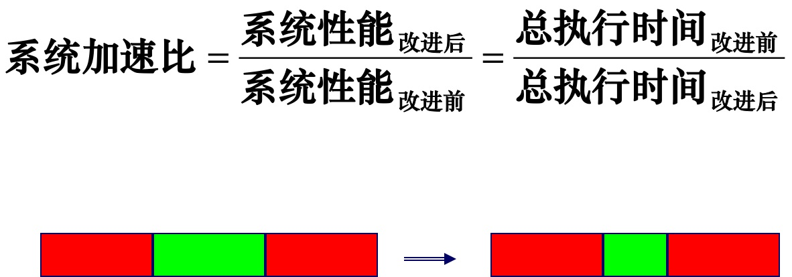
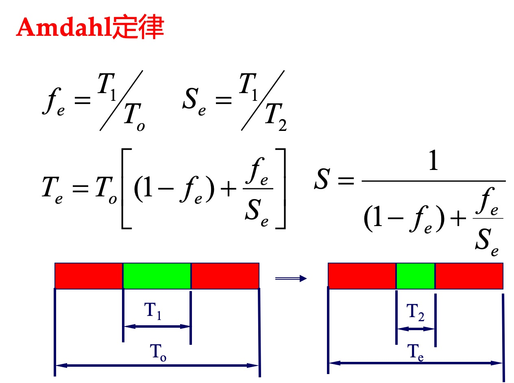

操作系统

# 进程和线程区别？

|          | 进程                                 | 线程                                                         |
| -------- | ------------------------------------ | ------------------------------------------------------------ |
| 概念     | 运行时的程序                         | 是进程的子任务                                               |
| 从属关系 | 一个进程可以有多个线程               | 一个线程只属于一个进程                                       |
| 调度粒度 | 是操作系统调度的最小单位             | 是CPU调度的最小单位                                          |
| 内存     | 有独立内存单元，进程之间互不影响     | 多个线程共享所在进程的内存，线程也有自己的内存空间           |
| 切换开销 | 大                                   | 小                                                           |
| 通信     | 共享内存、管道、信号量、套接字socket | 1. 共享内存（临界区）; 2. 事件（信号），如java的wait() notify()；3. 互斥量，如Synchronized、Lock |


# 父进程和子进程的关系

fork()会产生一个和父进程完全相同的子进程，但子进程在此后多会exec系统调用，出于效率考虑，Linux中引入了写时复制（COW）技术，也就是只有进程空间的各段的内容要发生变化时，才会将父进程的内容复制一份给子进程。在fork之后exec之前两个进程用的是相同的物理空间（内存区），子进程的代码段、数据段、堆栈都是指向父进程的物理空间，也就是说，两者的虚拟空间不同，但其对应的物理空间是同一个。当父子进程中有更改相应段的行为发生时，再为子进程相应的段分配物理空间，如果不是因为exec，内核会给子进程的数据段、堆栈段分配相应的物理空间（至此两者有各自的进程空间，互不影响），而代码段继续共享父进程的物理空间（两者的代码完全相同）。而如果是因为exec，由于两者执行的代码不同，子进程的代码段也会分配单独的物理空间。


# 阻塞 IO与非阻塞 IO

服务端为了处理客户端的连接和请求的数据，写了如下伪代码。

```java
listenfd = socket();   // 打开一个网络通信端口（fd）
bind(listenfd);        // 绑定
listen(listenfd);      // 监听
while(1) {
  connfd = accept(listenfd);  // 阻塞建立连接
  int n = read(connfd, buf);  // 阻塞读数据
  doSomeThing(buf);  // 利用读到的数据做些什么
  close(connfd);     // 关闭连接，循环等待下一个连接
}
```

这段代码与客户端的交互流程：


可以看到，服务端的线程阻塞在了两个地方，一个是 accept 函数，一个是 read 函数。

如果再把 read 函数的细节展开，我们会发现其阻塞在**网卡--内核缓冲区**、**内核缓冲区--用户缓冲区buf** 两个阶段


所以，如果这个连接的客户端一直不发数据，那么服务端线程将会一直阻塞在 read 函数上不返回，也无法接受其他客户端连接。

**非阻塞 IO**

为了解决上面的问题，其关键在于改造这个 read 函数。

一种办法是每次都创建一个新的进程或线程，去调用 read 函数，并做业务处理。这样，当给一个客户端建立好连接后，就可以立刻等待新的客户端连接，而不用阻塞在原客户端的 read 请求上：

```java
while(1) {
  connfd = accept(listenfd);  // 阻塞建立连接
  pthread_create(doWork);  // 创建一个新的线程
}
void doWork() {
  int n = read(connfd, buf);  // 阻塞读数据
  doSomeThing(buf);  // 利用读到的数据做些什么
  close(connfd);     // 关闭连接，循环等待下一个连接
}
```

这样本质上并不是非阻塞IO，只是开多线程而已，线程各自调用read还是阻塞的。而且线程太多会耗尽服务器资源。

真正的非阻塞IO是**操作系统层面提供非阻塞read函数**。该read函数要在没有数据到达时（拷贝到了内核缓冲区），立刻返回一个错误值（-1），而不是阻塞地等待。

操作系统提供了这样的功能，只需要在调用 read 前，将fd设置为非阻塞即可：

```c
fcntl(connfd, F_SETFL, O_NONBLOCK);  // 设置非阻塞
int n = read(connfd, buffer) != SUCCESS);
```

非阻塞的 read，指的是在数据到达前（即数据还未到达网卡，或者到达网卡但还没有拷贝到内核缓冲区之前）这个阶段是非阻塞的。

当数据已到达内核缓冲区，此时调用 read 函数仍然是阻塞的，需要等待数据从内核缓冲区拷贝到用户缓冲区，才能返回。

整体流程：


# IO多路复用

> I/O multiplexing，翻译成IO多路复用有歧义，其实并不是多路IO复用一个物理链路，而是：**单个线程，通过记录跟踪每个I/O流(sock)的状态，来同时管理多个I/O流 。**
>
> IO多路复用是相对于阻塞IO而言的，单个线程调用操作系统的阻塞IO就会挂起，无法处理多个IO（fd）

select, poll, 和 epoll 都是 Linux 中常见的 I/O 多路复用技术，它们可以用于同时监听多个**文件描述符**（file descriptor，后文简称fd），当任意一个fd**就绪**时，就能够非阻塞的读写数据。

> **阻塞/非阻塞**关注的是程序在等待调用结果（消息，返回值）时的状态：
>
> - 阻塞：调用结果返回之前，当前线程被挂起，直到结果返回才继续执行。
> - 非阻塞：无论调用结果是否返回，都不影响当前线程继续执行。
>
> **同步/异步**关注的是消息通信机制：
>
> - 同步：方法A调用方法B，没得到B的结果之前， A不返回，一直等待B的结果到来A才返回。
> - 异步：方法A调用方法B之后，就直接返回了，不需要等待B的结果（B有结果后回调通知A）。

- select 是最原始的 I/O 多路复用技术，它的缺点是最多只能监听 1024 个文件描述符。
- poll在 select 的基础上，取消了监听文件描述符个数的限制，但是复杂度增加，并且线程不安全。
- epoll 在 poll 的基础上进一步优化了复杂度，并且线程安全。

**比较**

|                          | select | poll    | epoll   |
| ------------------------ | ------ | ------- | ------- |
| fd长度（个数）           | 1024   | 无限制* | 无限制* |
| 遍历所有fd               | 是     | 是      | 否      |
| 把fd从用户态copy到内核态 | 是     | 是      | 否      |

*注：上限是系统可以打开的最大文件数，远大于1024，具体可以用命令`cat /proc/sys/fs/file-max`查看。在1GB内存的机器上，大于10万。


## select

> 接着上一节阻塞IO的思路，可以每 accept 一个客户端连接后，将这个文件描述符（connfd）放到一个数组里。然后起一个新的线程一直循环这个数组，调用每一个元素的非阻塞 read 方法，这样就能用**一个线程处理多个客户端连接**。
>
> ```c
> fdlist.add(connfd);
> while(1) {
>   for(fd <-- fdlist) {
>     if(read(fd) != -1) {
>       doSomeThing();
>     }
>   }
> }
> ```
>
> 但每次遍历遇到 read 返回 -1 时仍然是一次浪费资源的系统调用。在 while 循环里做系统调用是不划算的，每次调用都有开销，合理的做法是一次系统调用，在调用中while循环。
>
> 这就引出了select。

select是操作系统提供的系统调用函数，传入一个**fd数组**发给操作系统， 让操作系统去遍历，确定哪个fd可以读写（顾名思义，select 选择就绪的fd）。方法定义如下，可以监听read、write、except（异常）类型的fd：

```c
int select(
    int nfds,  // nfds:监控的文件描述符集里最大文件描述符加1
    fd_set *readfds,  // readfds：监控有读数据到达文件描述符集合，指针
    fd_set *writefds,  // writefds：监控写数据到达文件描述符集合，指针
    fd_set *exceptfds,  // exceptfds：监控异常发生达文件描述符集合, 指针
    struct timeval *timeout);  // timeout：定时阻塞监控时间，3种情况：1.NULL，永远等下去 2.设置timeval，等待固定时间                                                                // 3.设置timeval里时间均为0，检查描述字后立即返回，轮询
```

服务端代码：

一个线程不断接受客户端连接，并把 socket 文件描述符放到一个 list 里。

```java
while(1) {
    connfd = accept(listenfd);
    fcntl(connfd, F_SETFL, O_NONBLOCK);
    fdlist.add(connfd);
}
```

另一个线程不再自己遍历，而是调用 select，将这个fd 数组交给操作系统去遍历。

```java
while(1) {
    // 把一堆文件描述符 list 传给 select 函数
    // 有已就绪的fd就返回，nready 表示就绪的个数
    nready = select(list);
    ...
}
```

不过，当 select 函数返回后，用户依然需要遍历刚刚提交给操作系统的 list，但是**少了很多无效的系统调用**

```java
while(1) {
    nready = select(list);
    // 用户层依然要遍历
    for(fd <-- fdlist) {
        // 只读已就绪的fd
        if(fd != -1) {
            read(fd, buf);
            // 总共只有 nready 个已就绪fd，不用过多遍历
            if(--nready == 0) break;
        }
    }
}
```

总结：

1. select 调用需要传入 fd 数组，需要拷贝一份到内核，高并发场景下这样的拷贝消耗的资源是惊人的。（可优化为不复制）
2. select 在内核层仍然是通过遍历的方式检查fd的就绪状态，是个同步过程，只不过无系统调用切换上下文的开销。（内核层可优化为异步事件通知）
3. select 仅仅返回可读文件描述符的个数，具体哪个可读还是要用户自己遍历。（可优化为只返回给用户就绪的文件描述符，无需用户做无效的遍历）

select 的流程图：


## poll

也是操作系统提供的函数，poll返回后，轮询fd列表获取就绪的fd。

对select的改进：取消了监听1024个fd的限制（fds基于链表）。

但拷贝fd还是要在内核态和用户态之间切换，影响性能。

```c
int poll(struct pollfd *fds, nfds_tnfds, int timeout);

struct pollfd {
    intfd; /*文件描述符*/
    shortevents; /*监控的事件*/
    shortrevents; /*监控事件中满足条件返回的事件*/
};
```


## epoll

针对上面select总结的三点进行了改进：

1. 拷贝一份 fd 集合到内核（用**红黑树**存储），无需用户每次都重新传入，只需告诉内核修改的部分即可。
2. 内核不再通过轮询的方式找到就绪的 fd ，而是通过**异步 IO 事件**唤醒，也避免 fd 再从内核拷贝到用户的开销。
3. 内核仅会将有 IO 事件的 fd 返回给用户，用户也无需遍历整个 fd 集合。

具体实现：

1. 创建一个 epoll 句柄，size告诉内核监听的fd数量：

   ```c
   int epoll_create(int size);
   ```

2. 向内核注册事件，以监控fd。该方法将所有fd拷贝到内核，而不是在epoll_wait方法中重复拷贝，保证epoll只拷贝一次

   ```c
   int epoll_ctl(int epfd, int op, int fd, struct epoll_event *event);
   ```

3. 类似发起了 select() 调用，返回就绪状态的fd，若有则直接使用（即O(1)），而不像poll和select需要遍历（即O(n)）

   ```c
   int epoll_wait(int epfd, struct epoll_event *events, int max events, int timeout);
   ```


## Q：多路复用比阻塞IO快的原因？

错误：用一个线程就可以监控多个文件描述符。（这样的效果，完全可以由用户态去遍历文件描述符并调用其非阻塞的 read 函数实现）

正确：操作系统提供了这样的系统调用，使得原来的 while 循环里多次系统调用，变成了一次系统调用 + 内核层 while 循环遍历这些文件描述符。（就好比我们平时写业务代码，把原来 while 循环里调 http 接口进行批量，改成了让对方提供一个批量添加的 http 接口，然后我们一次 rpc 请求就完成了批量添加。）


## Q：epoll的两种模式是？

我们知道epoll是通过epoll_wait来获取就绪的fd，那么如果就绪的fd一直没有被消费，该如何处理呢？这就有了两种模式。LT（level trigger）和ET（edge trigger）： 

- LT模式（**默认模式**）：当epoll_wait检测到描述符事件发生并将此事件通知应用程序，应用程序可以不立即处理该事件。下次调用epoll_wait时，会再次响应应用程序并通知此事件
- ET模式：当epoll_wait检测到描述符事件发生并将此事件通知应用程序，应用程序必须立即处理该事件。如果不处理，下次调用epoll_wait时，不会再次响应应用程序并通知此事件。

因为ET模式在很大程度上减少了epoll事件被重复触发的次数，因此效率要比LT模式高。epoll工作在ET模式的时候，必须使用非阻塞socket，以避免由于一个文件句柄的阻塞读/阻塞写操作把处理多个文件描述符的任务饿死。

# Swap交换分区

Linux中的一个区域，类似于Windows的虚拟内存，当内存不足时，把一部分硬盘空间虚拟成内存，解决内存容量不足的问题。

合理取值一般是内存的2倍


# 程序编译

- 程序功能的实现通常可以分为两个阶段：

- 静态处理阶段（static），在程序本身开始执行前的处理。通常包括：

- - 翻译阶段（编译）：对源程序做各种检查（语法检查，类型检查等）和变换，将其转变为某种适宜动态执行的形式
  - 连接阶段（可能）：构造出可动态运行的程序形式
  - 装载阶段（可能）：把可运行程序装入运行环境，必要的处理

- 动态执行阶段（run-time），指程序的实际运行期间

- 例：若变量x 的（绝对或相对）位置可静态确定，运行中就可以直接访问。若不能静态确定，运行中每次访问都要查表，效率就比较低

- 语言的“编译实现”：在静态阶段完成尽可能多的处理工作，对源程序做深入的分析和变换，生成的目标形式通常与源程序差异巨大

# Amdahl定律

加快某部件执行速度所获得的系统性能加速比，受限于该部件在系统中所占的比例。

Amdahl定律既可以用来确定系统中对性能限制最大的部件，也可以用来计算通过改进某些部件所获得的系统性能的提高。

- Amdahl定律：加快某部件执行速度所获得的系统性能加速比，受限于该部件在系统中所占的比例。
- Amdahl定律既可以用来确定系统中对性能限制最大的部件，也可以用来计算通过改进某些部件所获得的系统性能的提高。



