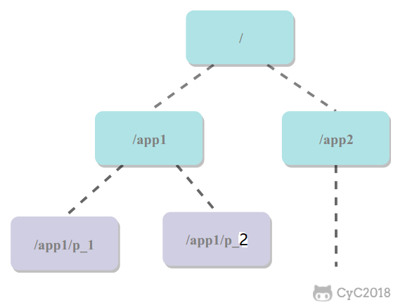
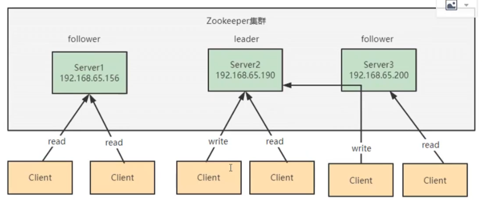
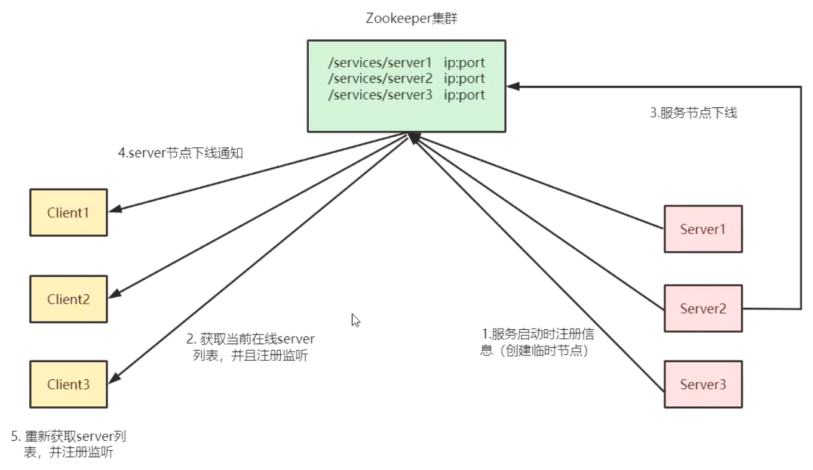
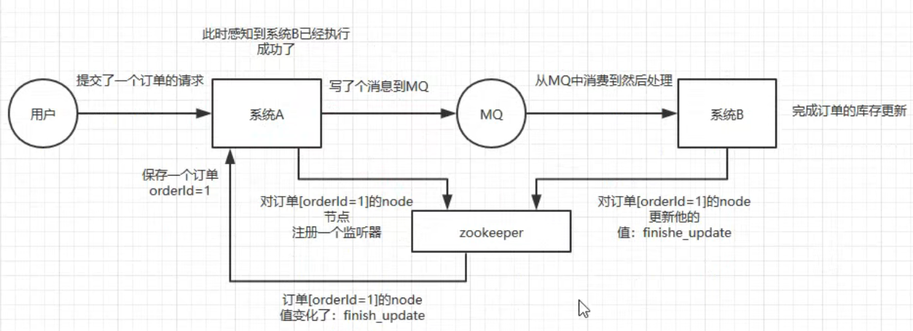
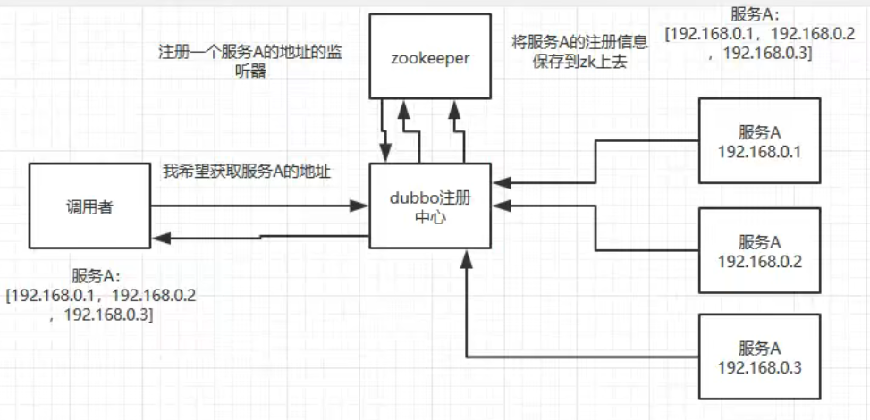
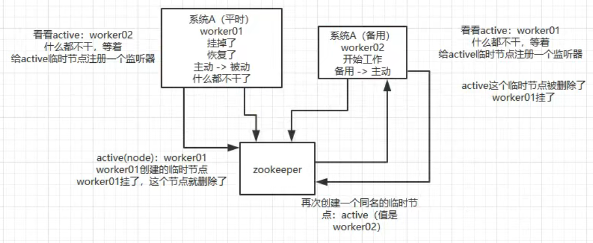
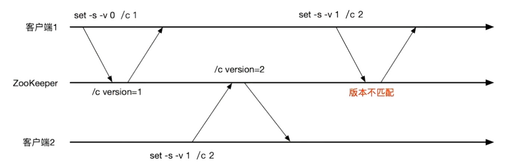

注册中心

# Zookeeper

本质上是一个分布式的小文件存储系统。Zookeeper 提供了一种树形结构的命名空间，根节点为/，/app1/p_1 节点的父节点为 /app1。



节点叫做ZNode，每个ZNode有唯一的路径标识。

ZNode都可以保存数据，默认1MB

ZNode都有版本号，从0开始

## 基本命令

启动zkServer.cmd和zkCli.cmd后，在cli（客户端）使用命令

### 创建节点

```
create  [‐s] [‐e] [‐c] [‐t ttl] 节点名（路径） [节点值]
```

中括号为可选项，没有则默认创建持久化节点 。-s: 顺序节点 -e: 临时节点 -c: 容器节点 -t: 可以给节点添加过期时间，默认禁用，需要通过系统参数启用

节点值可选，不传则为null

### 展示节点层次

输出节点下的层次结构

```
ls 路径
```

例：

```
[zk: localhost:2181(CONNECTED) 1] ls /
[cmp-pc, zookeeper]
[zk: localhost:2181(CONNECTED) 2] ls -R /
/
/cmp-pc
/zookeeper
/cmp-pc/cmp-sys-app
/cmp-pc/cmp-sys-app/cmp-sys-app:local:100.100.7.97:20013:5f83a6db57a54601bb30ecde6ce3581b
/zookeeper/config
/zookeeper/quota
```

-R参数表示递归展示

### 查看节点值

```
get 路径
```

例：

```
[zk: localhost:2181(CONNECTED) 9] get /test
1234
[zk: localhost:2181(CONNECTED) 12] get /test/czz1
null
```


### 查看节点状态

```
stat 路径
```

例：

```
[zk: localhost:2181(CONNECTED) 13] stat /test
cZxid = 0x9
ctime = Tue Sep 27 01:13:47 CST 2022
mZxid = 0x9
mtime = Tue Sep 27 01:13:47 CST 2022
pZxid = 0x9
cversion = 0
dataVersion = 0
aclVersion = 0
ephemeralOwner = 0x0
dataLength = 0
numChildren = 0
```

- cZxid：创建znode的事务ID（Zxid的值）。 
- mZxid：最后修改znode的事务ID。 
- pZxid：最后添加或删除子节点的事务ID（子节点列表发生变化才会发生改变）。 
- ctime：znode创建时间。 
- mtime：znode最近修改时间。 
- dataVersion：znode的当前数据版本。 
- cversion：znode的子节点结果集版本（一个节点的子节点增加、删除都会影响这个 版本）。 
- aclVersion：表示对此znode的acl版本。 
- ephemeralOwner：znode是临时znode时，表示znode所有者的 session ID。 如果 znode不是临时znode，则该字段设置为零。 
- dataLength：znode数据字段的长度。
- numChildren：znode的子znode的数量。

### 设置节点

```
set [-v] [版本号] 路径 值 
```

带-v参数可以指定设置的版本号，如果节点版本与传入版本号不匹配，则设置失败

例：

```
[zk: localhost:2181(CONNECTED) 18] set /test test-changed
```


## **节点类型**

- 永久节点：不会因为会话结束（cli宕机、server宕机）或者超时而消失；

- 临时节点：如果会话结束或者超时就会消失；

- 有序节点：会在节点名的后面加一个数字后缀，并且是有序的，例如生成的有序节点为 /lock/node-0000000000，它的下一个有序节点则为 /lock/node-0000000001，以此类推。

  有序节点也分**永久和临时**两种

  例：create -e -s /test

   

## **监听通知机制**

为一个节点或路径注册**一次性**的监听器（观察者模式），在节点状态发生改变时，服务端会给客户端发送消息。

**命令用法**

1. 对节点数据变化的监听 ：`get -w`
2. 对节点状态变化的监听：`stat -w`
3. 对节点下面的子节点变化监听（只监听到子）： `ls -w`
4. 对节点递归监听（监听下面所有）： `ls -R -w`

例：给/test路径注册监听器，再在/test下创建czz1节点，则触发监听器

```
[zk: localhost:2181(CONNECTED) 1] ls -w /test
[]
[zk: localhost:2181(CONNECTED) 2] create /test/czz1
WATCHER::Created /test/czz1
WatchedEvent state:SyncConnected type:NodeChildrenChanged path:/test
```

**特性**

- 一次性触发：watcher是一次性的，一旦被触发就移除，再次使用需要重新注册
- 客户端顺序回调：watcher回调是顺序串行执行的，只有回调后客户端才能看到最新的数据状态。一个watcher回调逻辑不应该太多，以免影响别的watcher
- 轻量级：WatchEvent是最下的通信单位，结构上只包含通知状态、事件类型和节点路径，并不会告诉数据节点变化前后的具体内容
- 时效性：watcher只有在当前session彻底失效时才无效，若在**session有效期**内快速重连成功，则watcher依然有效


## **分布式锁实现**

- 创建一个锁目录 /lock；
- 当一个客户端需要获取锁时，在 /lock 下创建临时的且有序的子节点；
- 客户端获取 /lock 下的子节点列表，判断自己创建的子节点是否为当前子节点列表中序号最小的子节点，如果是则认为获得锁；否则监听自己的前一个子节点，获得子节点的变更通知后重复此步骤直至获得锁；
- 执行业务代码，完成后，删除对应的子节点。

**会话超时**

如果一个已经获得锁的会话超时了，因为创建的是临时节点，所以该会话对应的临时节点会被删除，其它会话就可以获得锁了。可以看到，这种实现方式不会出现数据库的唯一索引实现方式释放锁失败的问题。

**羊群效应**

一个节点未获得锁，只需要监听自己的前一个子节点，这是因为如果监听所有的子节点，那么任意一个子节点状态改变，其它所有子节点都会收到通知（羊群效应，一只羊动起来，其它羊也会一哄而上），而我们只希望它的后一个子节点收到通知。

## zk集群



**leader**

事务请求（写操作）的唯一调度者和处理者，保证集群事务处理的顺序性；集群内部各服务器的调度者。

对于create、setData、delete等 有写操作的请求，要同一转发给leader处理，leader决定编号、执行操作，该过程称为事务

**follower**

处理客户非事务请求（读操作），可以直接响应；转发事务请求给leader；参与集群leader选举投票

**observer**

非事务请求（读操作）可直接响应；事务请求转发给leader处理。接收来自leader的inform信息。不参与提交和选举

场景：提升集群读性能；跨数据中心部署 

**zk的数据一致性**可以保证：

- 全局可线性化写入：先到达leader的写请求会先处理，leader决定写请求的执行顺序
- 客户端FIFO顺序：来自给定客户端的请求按照发送顺序执行

## 选举

# 应用

## 注册中心




## 分布式协调



A系统发送一个请求到mq，B消费该请求进行处理，A如何知道B的处理结果？用zk。

A发mq后，在zk上对某个节点（如订单orderId=1）的值注册一个监听器，一旦B处理完就修改zk上该节点的值，A立马就能收到通知，问题解决。

## 分布式锁

某个客户端尝试创建**临时**znode，成功则获取到锁，由此保证获得znode的客户端唯一，其他客户端来创建这个znode就会失败，只能对这个znode注册一个监听器。

释放锁就是删除znode，一旦删除会立即通知正在监听的客户端，这时等待的客户端就能获得该锁。

## 配置信息管理（配置中心）

zk可用作很多系统的配置信息管理，如kafka、storm和dubbo等分布式系统都会用zk做元数据/配置信息的管理。

例如将dubbo注册中心（管理多个服务A的 注册）的信息存到zk上，调用者注册一个服务A的地址监听器，只要有服务A注册到dubbo就通知调用者，哪些服务A节点可用



## HA高可用性

hadoop、hdfs、yarn等大数据系统都是用zk开发HA高可用机制，就是一个重要进程做主从备份，主进程挂了立刻通过zk感知切换到备用进程，原主进程恢复后当备份，互为主备




## 条件更新（乐观锁）



每次set的时候带版本号，多客户端设置节点值时，如果版本号不匹配则失败，保证只有一个客户端设置成功（先到先得）


# 服务发现

客户端（注册表）定时拉取

服务端（注册中心）主动推送（UDP）

