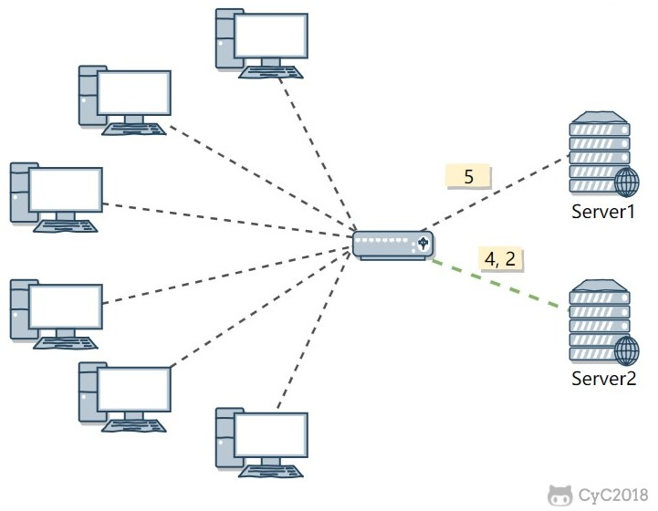
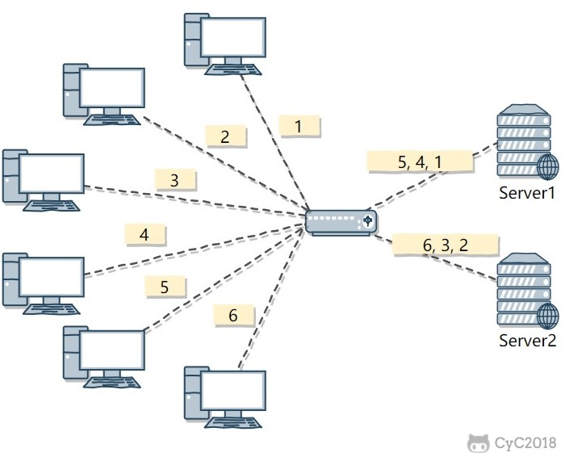

系统设计

# 登录

cookie登录


用户从浏览器输入正确的用户名和密码，在服务器验证成功后登录，将用户信息写redis（分布式session），并给浏览器设置cookie。

浏览器再次请求就会带上这个cookie，作为服务器鉴权的凭证。


https://developer.aliyun.com/article/636281

# 单点登录

单点登录 (Single Sign On，SSO) 是一种身份认证方法，用户一次可通过一组登录凭证登入会话，在该次会话期间无需再次登录，即可安全访问多个相关的应用和服务。同理注销也只需要注销一次。

SSO 通常用于管理一些环境中的身份验证，包括企业内部网或外部网、学生门户网站、公有云服务以及用户需要使用多个应用以完成工作的其他环境。 它还越来越多地用于面向客户的网站和应用（如银行和电子商务网站），将第三方供应商提供的应用打造成无缝、不间断的用户体验。

一般工作原理是：

1. 用户使用 SSO 登录凭证登录到一个可信的应用或连接所有可信应用的中央门户网站（如员工门户网站或学生网站）。

2. 用户成功通过身份验证后，SSO 解决方案将生成一个会话身份验证令牌（token），其中包含关于用户身份（用户名、电子邮件地址等）的特定信息。 该令牌会存储在用户的 Web 浏览器或者 SSO 或 IAM 服务器上，并发送给客户端。

3. 用户尝试访问其他可信的应用时，该应用会向 SSO 或 IAM 服务器核实，确定用户是否通过会话身份验证。 若通过，SSO 解决方案会使用由数字证书签署的身份验证令牌来验证用户，并为用户提供该应用的访问权限。 若未通过，则会提示用户重新输入登录凭证。

   

优点：

减少需要管理的密码，节省时间

缺点：

如果密码泄露，则大部分资源被暴露

改进：

- **自适应 SSO**： 需要在一开始登录时输入用户名和密码，但随后如出现其他风险，例如，当用户从新设备登录或尝试访问特别敏感的数据或功能时，就需要额外的身份验证因子或重新登录。
- **联合 SSO**： 更准确的名称是联合身份管理 (FIM)，是 SSO 的扩展。 SSO 基于单个组织域内应用之间的数字信任关系，而 FIM 会将这种关系扩展到组织外部的可信第三方、供应商和其他服务提供商。 例如，FIM 允许已登录的员工访问第三方 Web 应用程序（如 Slack 或 WebEx），无需额外登录，或者仅使用用户名来登录。
- **社交登录**：允许用户使用他们访问流行社交媒体网站的凭证来访问第三方应用。 社交登录简化了用户的生活。 对于第三方应用提供商，它可以阻止不良行为（例如，错误登录和购物车遗弃），并为改进其应用提供有价值的信息。

协议：

**SAML/SAML 2.0**

SAML（安全性断言标记语言）是使用时间最长的开放标准协议，用于在身份提供程序和多个服务提供程序之间交换加密的身份验证和授权数据。 SAML 比其他协议更能控制安全性，因此通常用于在企业或政府应用域内部和二者之间实施 SSO。

**CAS**

CAS（Central Authentication Service，中央认证服务）是耶鲁大学发起的一个开源项目，旨在为 Web 应用系统提供一种可靠的单点登录方法

**OAuth/OAuth 2.0**

OAuth/OAuth 2.0（开放授权）是一个开放的标准协议，用于交换应用之间的*授权*数据，而不会暴露用户的密码。 

**OpenID Connect (OIDC)**

OICD 也是一个开放标准协议，使用 REST API 和 JSON 身份验证令牌，允许网站或应用通过另一个服务提供商对用户进行身份验证，以此授予用户访问权限。

OICD 位于 OAuth 上层，主要用于实现对第三方应用、购物车等的社交登录。 OAuth/OIDC 是一种轻量级的实现，通常由 SAML 用于跨 SaaS（软件即服务）和云应用、移动应用和物联网 (IoT) 设备实施 SSO。

**LDAP**

LDAP（轻量级目录访问协议）定义一个用于存储和更新用户凭证的目录，以及一个针对该目录对用户进行身份验证的过程。 LDAP 于 1993 年推出，目前仍然是许多实施 SSO 的组织所青睐的身份验证目录解决方案，这是因为 LDAP 支持他们提供对目录访问的细粒度控制。

**ADFS**

ADFS（Active Directory 联合服务）在 Microsoft Windows 服务器上运行，以启用本地和外部应用与服务的联合身份管理（包括单点登录）。 ADFS 使用 Active Directory 域服务 (ADDS) 来提供身份。 

## OAuth

OAuth在"客户端"与"服务提供商"之间，设置了一个**授权层**（authorization layer）。"客户端"不能直接登录"服务提供商"，只能登录授权层，以此将用户与客户端区分开来。"客户端"登录授权层所用的令牌（token），与用户的密码不同。用户可以在登录的时候，指定授权层令牌的权限范围和有效期（例如七天内免密）。

OAuth 2.0的运行流程：


> （A）用户打开客户端以后，客户端要求用户给予授权。
>
> （B）用户同意给予客户端授权。
>
> （C）客户端使用上一步获得的授权，向认证服务器申请令牌。
>
> （D）认证服务器对客户端进行认证以后，确认无误，同意发放令牌。
>
> （E）客户端使用令牌，向资源服务器申请获取资源。
>
> （F）资源服务器确认令牌无误，同意向客户端开放资源。

不难看出来，上面六个步骤之中，B是关键，即用户怎样才能给于客户端授权。有了这个授权以后，客户端就可以获取令牌，进而凭令牌获取资源。


### 令牌与密码

令牌（token）与密码（password）的作用是一样的，都可以进入系统，但是有三点差异。

1. 令牌是短期的，到期会自动失效，用户自己无法修改。密码一般长期有效，用户不修改，就不会发生变化。

2. 令牌可以被数据所有者撤销，会立即失效。以上例而言，屋主可以随时取消快递员的令牌。密码一般不允许被他人撤销。

3. 令牌有权限范围（scope），比如只能进小区的二号门。对于网络服务来说，只读令牌就比读写令牌更安全。密码一般是完整权限。


上面这些设计，保证了令牌既可以让第三方应用获得权限，同时又随时可控，不会危及系统安全。这就是 OAuth 2.0 的优点。

注意，只要知道了令牌，就能进入系统。系统一般不会再次确认身份，所以**令牌必须保密，泄漏令牌与泄漏密码的后果是一样的。** 这也是为什么令牌的有效期，一般都设置得很短的原因。

##  JWT

Json Web Token，是一种用于双方之间传递安全信息的简洁的表述性声明规范，其实就是 token。由三部分组成：

- header：描述元信息，例如产生 signature 的算法
- payload：用于携带你希望向服务端传递的信息，如字段
- signature：签名，用于鉴权

基于JWT进行单点登录SSO的流程：


IDaaS指用户身份认证中心，SP指业务系统。

主要分为以下6个步骤：

1. 用户通过浏览器访问 IdaaS（户身份认证中心）应用服务 。
2. 浏览器向IDaaS发起单点登录请求。
3. IDaaS 生成 JWT token 令牌发送到业务系统。
4. SP（业务系统）获取到 token 令牌，用提供的插件或方法解析验证 JWT token 令牌，解析成功获取到用户信息并验证用户是否存在于业务系统中。
5. 业务应用服务器创建自己系统的请求会话，然后跳转到指定路径。
6. 浏览器显示应用页面，完成sso登录。

验证通过：业务系统重定向到用户首页，或指定的二级页面。

验证失败：业务系统拒绝登录页面提示错误信息。

## CAS

CAS（Central Authentication Service，中央认证服务）是耶鲁大学发起的一个开源项目，是SSO的一种实现方案。

- CAS Client：负责处理对客户端受保护资源的访问请求，需要登录时重定向到CAS Server进行认证，与受保护的客户端应用部署在一起，以Filter方式保护受保护的资源。

- CAS Server：独立部署，主要负责对用户的认证工作。


**核心票据（token）**：

- TGT（Ticket Grangting Ticket)：是CAS为用户签发的登录票据，有TGT就表明用户在CAS上成功登录过。用户在CAS认证成功后，会生成TGT放入Session，同时将TGC写入浏览器cookie。当再次访问CAS时，会先看cookie中是否存在TGC，如果存在则通过TGC获取TGT，如果获取到了TGT则代表用户之前登录过，通过TGT及访问来源生成针对来源的ST，用户就不用再次登录，以此来实现单点登录。

- TGC（Ticket-granting cookie)：是TGT的唯一标识（k-v关系。key=TGC），以cookie的形式存在浏览器和CAS Server三级域名下，是CAS Server 用来明确用户身份的凭证。

- ST（Service Ticket)：ST是CAS为用户签发的访问某一客户端的服务票据。用户访问service时，service发现用户没有ST，就会重定向到 CAS Server 去获取ST。CAS Server 接收到请求后，会先看cookie中是否存在TGC，如果存在则通过TGC获取TGT，如果获取到了TGT则代表用户之前登录过，通过TGT及访问来源生成针对来源的ST。用户凭借ST去访问service，service拿ST 去CAS Server 上进行验证，验证通过service 生成 用户session，并返回资源。

**流程**


CAS Client （其实整合在后端）与受保护的客户端应用部署在一起，以 Filter 方式保护特定的资源。对于访问受保护资源的每个人 Web 请求， CAS Client 会分析该请求的 Http 请求中是否包含 Service Ticket。如果没有，则说明当前用户尚未登录，于是将请求重定向到指定好的 CAS Server 登录地址，并传递 Service （也就是要访问的目的资源地址），以便登录成功过后转回该地址。

**第 3 步**输入认证信息，如果登录成功，CAS Server 随机产生一个相当长度、唯一、不可伪造的结果 Service Ticket，并缓存以待将来验证。之后系统自动**重定向**到 Service 所在地址，并为客户端浏览器设置一个 Ticket Granted Cookie（TGC），CAS Client 在拿到 Service 和新产生的 Ticket 过后，在第 5，6 步中与 CAS Server 进行身份核实，以确保安全 Service Ticket 的合法性。


检测是否登录的优先级：

1. 看session中的attribute：userInfo
2. session没有，再看SSO，参考：com.eshxxx.cmp.portal.config.LoginFilter#doFilter

**实现**

配置CAS过滤器，顺序在最前，检测所有请求是否带ST（ticket）

```java
@Bean
public FilterRegistrationBean<Cas30ProxyReceivingTicketValidationFilter> cas30ProxyReceivingTicketValidationFilter() {
    FilterRegistrationBean<Cas30ProxyReceivingTicketValidationFilter> registrationBean = new FilterRegistrationBean<>();
    registrationBean.setFilter(new Cas30ProxyReceivingTicketValidationFilter());
    registrationBean.addUrlPatterns("/*");  // 过滤所有请求
    registrationBean.setName("CAS Validation Filter");
    registrationBean.addInitParameter("casServerUrlPrefix", ssoHost);
    registrationBean.addInitParameter("serverName", clientHost);
    registrationBean.setOrder(1);
    return registrationBean;
}
```

在login方法中请求SSO，内部实现：com.eshxxx.cmp.portal.utils.CasUtils#sso，核心代码：

```java
// url =  http://sso.ctwxxx.cn:10000 + "/cas/v1/tickets/token"
ResponseEntity<String> tgtResponse = restTemplate.exchange(url, HttpMethod.POST, requestEntity, String.class); // 请求SSO的TGT
if (HttpStatus.CREATED.equals(tgtResponse.getStatusCode())) {
    String tgc = tgtResponse.getBody();  // 从TGT中读取TGC
    // https://sso.ctwxxx.cn/login?service=https://cmp.ctwxxx.cn:4821/&token={tgc}
    return Response.success(ssoLogin + "?service=" + clientHost + "&token=" + tgc);
}
```

login使用上面的返回做重定向，访问SSO的登录页面，由SSO**再做一次重定向**，携带ticket到达我们的门户：https://cmp.ctwxxx.cn:4821/?ticket=ST-103365-BXEyxxxx-aep-cas-aepiamsso-6449xxxxx-rzzd7，这个ticket会被上面配置的CAS过滤器校验。

f12可以看到跳转过程，前两个都是302重定向：


## 单点注销

sso客户端本地登出后，还需要调用sso认证中心单点注销

配置单点登出过滤器：

```java
@Bean
public FilterRegistrationBean<SingleSignOutFilter> filterSingleRegistration() {
    final FilterRegistrationBean<SingleSignOutFilter> registration = new FilterRegistrationBean<>();
    registration.setFilter(new SingleSignOutFilter());
    // 设定匹配的路径
    registration.addUrlPatterns("/*");
    Map<String, String> initParameters = new HashMap<String, String>();
    initParameters.put("casServerUrlPrefix", ssoHost);  // 设置SSO地址
    registration.setInitParameters(initParameters);
    // 设定加载的顺序
    registration.setOrder(1);
    return registration;
}
```

配置单点登出监听器：

```java
@Bean
public ServletListenerRegistrationBean<EventListener> singleSignOutListenerRegistration() {
    ServletListenerRegistrationBean<EventListener> registrationBean = new ServletListenerRegistrationBean<EventListener>();
    registrationBean.setListener(new SingleSignOutHttpSessionListener());
    registrationBean.setOrder(1);
    return registrationBean;
}
```


SSO Server端：

通知其他sso客户端销毁会话。暂无源码，猜测有两种通知方式：主动和被动：

- 主动：MQ发广播消息给所有客户端
- 被动：销毁所有会话，但客户端再次请求SSO Server才知道被注销。


## QQ快速登录原理

QQ 会内置一个小型的 Web Server，提供类似 IIS、Apache 的功能。

访问 QQ 邮箱登录页，浏览器对这个 Web Server发起请求，由于是同一台机子访问，所以地址就是：127.0.0.1（实际是 https://localhost.ptlogin2.qq.com:4301/，这个域名指向的是 127.0.0.1，用域名的好处是可以解决 Cookie 跨域等权限问题），由于这个 Web Server 是 QQ 建立的，所以 QQ 可以根据自己的登录状况给访问者返回对应的信息。

## 零信任

**“从不信任，始终验证”**：任何用户、应用或设备 - 无论是在网络外部，还是已经通过身份验证并位于网络内部 - 都必须在访问所需的下一个网络资源之前验证其身份。

# 验证码

## 图形验证码

前端请求getVerifyCode，后端生成四位随机数字+字母，先用时间戳（加上操作名等）作为key存redis。然后绘制图片给前端展示。

前端登录（或其他需要验证的场景）读取用户输入的验证码，与redis存储的验证码比对，判断是否验证通过。

## 短信验证码

后端生成随机六位数，先存redis，然后调短信网关发给对应手机，用户收到短信后将验证码输入，后端将其与redis存储的比对。

# 限流

分为单Java级别限流和网关限流

## 网关限流

微服务部署多个java进程，因此需要从入口网关处限流。主要是用**nginx**，一是控制速率，二是控制并发连接数。

- 控制速率：使用 limit_req_zone 用来限制单位时间内的请求数

  ```
  limit_req_zone $binary_remote_addr zone=mylimit:10m rate=2r/s;
  server { 
      location / { 
          limit_req zone=mylimit;
      }
  }
  ```

  限制每个 IP 访问的速度为 2r/s，因为 Nginx 的限流统计是基于毫秒的，rate = 2r/s，转换一下就是 500ms 内单个 IP 只允许通过 1 个请求。

- 控制并发连接数：利用 limit_conn_zone 和 limit_conn 两个指令

  ```
  limit_conn_zone $binary_remote_addr zone=perip:10m;
  limit_conn_zone $server_name zone=perserver:10m;
  server {
      ...
      limit_conn perip 10;
      limit_conn perserver 100;
  }
  ```

  limit_conn perip 10 ：表示限制单个 IP 同时最多能持有 10 个连接；

  limit_conn perserver 100 ：表示 server 同时能处理并发连接的总数为 100 个。

## spring限流

接口层面，用计数器cnt记录调用数，到达限额max就拒绝

```java
@RestController
@RequestMapping("/api/v1/batmgr")
public class BatchMgrController {
    private static final int max = 5;
    private volatile Integer cnt = 0;
    @GetMapping("testCzz")
    public Integer testCzz (@RequestParam(name = "i") Integer i) throws InterruptedException {
        if (cnt < max) {
            logger.warn("i={}， 当前cnt={}",i, cnt);
            cnt ++; 
            Thread.sleep(10000); // 执行接口主逻辑
            cnt --; // 执行完成后计数自减
            return i;
        } else {
            logger.warn("i={}, cnt={} 到达限流max",i, cnt);
            return -1;
        }
    }
}
```

问题：高并发环境下，由于cnt达限的if判断和cnt自增操作不是原子性，可能同时有超过限额的访问进入if，限流不起效。

在被调用端使用guava的RateLimiter，基于令牌桶算法，用`acquire()`等待令牌执行。

> 常用的限流算法有**令牌桶** 和 **漏桶**
>
> 漏桶算法：把请求比作是水，水来了都先放进桶里，并以限定的速度出水。当加水速度超过出水速度时，最后会导致水直接溢出，即拒绝服务。该算法可以强行限死出水速率，适合在**调用方**限流。
>
> 令牌桶算法：以恒定的速率向桶中放入令牌，当令牌桶满时不再放入，只能取出。每个请求需要消耗一个令牌，取不到令牌则拒绝请求。该算法不仅可以限制请求频率（桶空时，且消耗速度大于放入速度），还能应对突发的大量请求（桶满时），适合做**被调用方**限流。

```java
//创建令牌桶实例
private RateLimiter rateLimiter =  RateLimiter.create(5);  // 每秒5个令牌
public Integer testCzz (@RequestParam(name = "i") Integer i)  {
    rateLimiter.acquire(); // 阻塞等待令牌
    return i;
    if (!rateLimiter.tryAcquire(100, TimeUnit.MICROSECONDS)) {
        logger.warn("i={}, 到达限流max",i);
        return -1;
    }
}
```

调用端：

```java
@GetMapping("testLimit")
public void testLimit() throws ExecutionException, InterruptedException {
    int threadNum = 10;
    ExecutorService executorService = Executors.newCachedThreadPool();
    for (int i = 0; i < threadNum; i++) {
        int finalI = i;
        executorService.execute(() -> {
            Integer res = orderBatMgrApi.testCzz(finalI);  // RPC
            logger.warn("res: {}, ts:{}", res, Instant.now());
        });
    }
    executorService.shutdown();
}
```

观察输出：

```
res: 2, ts:2023-06-29T07:50:12.418Z
res: 7, ts:2023-06-29T07:50:12.419Z
res: 0, ts:2023-06-29T07:50:12.423Z
res: 1, ts:2023-06-29T07:50:12.421Z
res: 4, ts:2023-06-29T07:50:12.421Z
res: 8, ts:2023-06-29T07:50:12.423Z
res: 5, ts:2023-06-29T07:50:12.617Z
res: 9, ts:2023-06-29T07:50:12.816Z
res: 6, ts:2023-06-29T07:50:13.017Z
res: 3, ts:2023-06-29T07:50:13.217Z
```

可以看到一开始就允许5个令牌，从res=8起，每1000/5=200ms释放一个令牌

还可用`tryAcquire()`，若拿不到令牌就等待

```java
private RateLimiter rateLimiter =  RateLimiter.create(5);
public Integer testCzz (@RequestParam(name = "i") Integer i)  {
    if (!rateLimiter.tryAcquire(100, TimeUnit.MICROSECONDS)) {  //  等待100ms
        logger.warn("i={}, 到达限流max",i);
        return -1;
    }
    return i;
}
```

从res=5开始，经过0ms、200ms、400ms……依次释放一个令牌，而tryAcquire只等待100ms后重试，因此res=5之后的令牌都等待超时返回-1

```
res: 7, ts:2023-06-29T08:01:37.548Z
res: 3, ts:2023-06-29T08:01:37.547Z
res: 9, ts:2023-06-29T08:01:37.548Z
res: 0, ts:2023-06-29T08:01:37.549Z
res: 6, ts:2023-06-29T08:01:37.548Z
res: 5, ts:2023-06-29T08:01:37.550Z
res: -1, ts:2023-06-29T08:01:37.551Z
res: -1, ts:2023-06-29T08:01:37.552Z
res: -1, ts:2023-06-29T08:01:37.552Z
res: -1, ts:2023-06-29T08:01:37.553Z
```


# 订单

# 断点续传


# 压测

使用JMeter


## QPS

指系统每秒能处理的请求数(Query Per Second) ，在Web应用中我们更关注的是Web应用每秒能处理的request数量。这个是衡量系统性能的重要指标。

## RT

指响应时间(Response Time)，是指从客户端发**一个请求**开始计时，到客户端接收到从服务器端返回的响应结果结束所经历的时间。

## TP指标

TP99=10ms，表示这段时间99%的请求都在10ms以内。依此类推，TP50、TP90、TP999……

# 微服务网关

性能 3000tps
限流
负载均衡
成功失败情况
失败：下游超时、ng超负载、内存满

# 负载均衡

集群中的应用服务器（节点）通常被设计成无状态，用户可以请求任何一个节点。

负载均衡器会根据集群中每个节点的负载情况，将用户请求转发到合适的节点上。

负载均衡器可以用来实现高可用以及伸缩性：

- 高可用：当某个节点故障时，负载均衡器会将用户请求转发到另外的节点上，从而保证所有服务持续可用；
- 伸缩性：根据系统整体负载情况，可以很容易地添加或移除节点。

负载均衡器运行过程包含两个部分：

1. 根据负载均衡算法得到转发的节点；
2. 进行转发。

## 负载均衡算法

### 1. 轮询（Round Robin）

轮询算法把每个请求轮流发送到每个服务器上。

下图中，一共有 6 个客户端产生了 6 个请求，这 6 个请求按 (1, 2, 3, 4, 5, 6) 的顺序发送。(1, 3, 5) 的请求会被发送到服务器 1，(2, 4, 6) 的请求会被发送到服务器 2。


该算法比较适合每个服务器的性能差不多的场景，如果有性能存在差异的情况下，那么性能较差的服务器可能无法承担过大的负载（下图的 Server 2）。


### 2. 加权轮询（Weighted Round Robbin）

加权轮询是在轮询的基础上，根据服务器的性能差异，为服务器赋予一定的权值，性能高的服务器分配更高的权值。

例如下图中，服务器 1 被赋予的权值为 5，服务器 2 被赋予的权值为 1，那么 (1, 2, 3, 4, 5) 请求会被发送到服务器 1，(6) 请求会被发送到服务器 2。


### 3. 最少连接（least Connections）

由于每个请求的连接时间不一样，使用轮询或者加权轮询算法的话，可能会让一台服务器当前连接数过大，而另一台服务器的连接过小，造成负载不均衡。

例如下图中，(1, 3, 5) 请求会被发送到服务器 1，但是 (1, 3) 很快就断开连接，此时只有 (5) 请求连接服务器 1；(2, 4, 6) 请求被发送到服务器 2，只有 (2) 的连接断开，此时 (6, 4) 请求连接服务器 2。该系统继续运行时，服务器 2 会承担过大的负载。


最少连接算法就是将请求发送给当前最少连接数的服务器上。

例如下图中，服务器 1 当前连接数最小，那么新到来的请求 6 就会被发送到服务器 1 上。



### 4.加权最少连接（Weighted Least Connection）

在最少连接的基础上，根据服务器的性能为每台服务器分配权重，再根据权重计算出每台服务器能处理的连接数。

### 5.随机算法（Random）

把请求随机发送到服务器上。

和轮询算法类似，该算法比较适合服务器性能差不多的场景。



### 6. 源地址哈希法 (IP Hash)

源地址哈希通过对客户端 IP 计算哈希值之后，再对服务器数量取模得到目标服务器的序号。

可以保证同一 IP 的客户端的请求会转发到同一台服务器上，用来实现会话粘滞（Sticky Session）


## 转发实现

### 1. HTTP 重定向

HTTP 重定向负载均衡服务器使用某种负载均衡算法计算得到服务器的 IP 地址之后，将该地址写入 HTTP 重定向报文中，状态码为 302。客户端收到重定向报文之后，需要重新向服务器发起请求。

缺点：

- 需要两次请求，因此访问延迟比较高；
- HTTP 负载均衡器处理能力有限，会限制集群的规模。

该负载均衡转发的缺点比较明显，实际场景中很少使用它。


### 2. DNS 域名解析

在 DNS 解析域名的同时使用负载均衡算法计算服务器 IP 地址。

- 优点：DNS 能够根据地理位置进行域名解析，返回离用户最近的服务器 IP 地址。
- 缺点：由于 DNS 具有多级结构，每一级的域名记录都可能被缓存，当下线一台服务器需要修改 DNS 记录时，需要过很长一段时间才能生效。

大型网站基本使用了 DNS 做为第一级负载均衡手段，然后在内部使用其它方式做第二级负载均衡。也就是说，域名解析的结果为内部的负载均衡服务器 IP 地址。


### 3.反向代理服务器

反向代理服务器位于源服务器前面，用户的请求需要先经过反向代理服务器才能到达源服务器。反向代理可以用来进行缓存、日志记录等，同时也可以用来做为负载均衡服务器。

在这种负载均衡转发方式下，客户端不直接请求源服务器，因此源服务器不需要外部 IP 地址，而反向代理需要配置内部和外部两套 IP 地址。

- 优点：与其它功能集成在一起，部署简单。
- 缺点：所有请求和响应都需要经过反向代理服务器，它可能会成为性能瓶颈。

### 4. 网络层

在操作系统内核进程获取网络数据包，根据负载均衡算法计算源服务器的 IP 地址，并修改请求数据包的**目的 IP** 地址，最后进行转发。

源服务器返回的响应也需要经过负载均衡服务器，通常是让负载均衡服务器同时作为集群的**网关服务器**来实现。

- 优点：在内核进程中进行处理，性能比较高。
- 缺点：和反向代理一样，所有的请求和响应都经过负载均衡服务器，会成为性能瓶颈。

### 5. 链路层

在链路层根据负载均衡算法计算源服务器的 MAC 地址，并修改请求数据包的目的 MAC 地址，并进行转发。

通过配置源服务器的虚拟 IP 地址和负载均衡服务器的 IP 地址一致，从而不需要修改 IP 地址就可以进行转发。也正因为 IP 地址一样，所以源服务器的响应不需要转发回负载均衡服务器，可以直接转发给客户端，避免了负载均衡服务器的成为瓶颈。

这是一种三角传输模式，被称为直接路由。对于提供下载和视频服务的网站来说，直接路由避免了大量的网络传输数据经过负载均衡服务器。

这是目前大型网站使用最广负载均衡转发方式，在 Linux 平台可以使用的负载均衡服务器为 **LVS**（Linux Virtual Server）。

## Q：Ribbon负载均衡 与 Nginx负载均衡区别？

- Nginx是服务器负载均衡：客户端所有请求都会交给nginx，然后由nginx实现请求转发到具体服务器（反向代理）。
- Ribbon是本地负载均衡：客户端调用微服务接口时，由ribbon决定调具体哪个服务（ip+端口）。

Q：一次请求先到Gateway还是nginx？

先到Gateway的nginx，再到Gateway；之后再到服务的nginx，最后才到服务。

# 幂等性

幂等性是系统服务对外一种承诺，承诺只要调用接口成功，外部多次调用对系统的影响是一致的。声明为幂等的服务会认为外部调用失败是常态，并且失败之后必然会有重试。

## **什么情况下需要幂等**

以SQL为例：

SELECT col1 FROM tab1 WHER col2=2，无论执行多少次都不会改变状态，是天然的幂等。
UPDATE tab1 SET col1=1 WHERE col2=2，无论执行成功多少次状态都是一致的，因此也是幂等操作。
UPDATE tab1 SET col1=col1+1 WHERE col2=2，每次执行的结果都会发生变化，这种不是幂等的。
insert into user(userid,name) values(1,'a') 如userid为唯一主键，即重复操作上面的业务，只会插入一条用户数据，具备幂等性。
如userid不是主键，可以重复，那上面业务多次操作，数据都会新增多条，不具备幂等性。
delete from user where userid=1，多次操作，结果一样，具备幂等性

## **如何保证幂等**

**token机制**

1、服务端提供了发送token的接口。我们在分析业务的时候，哪些业务是存在幂等问题的，就必须在执行业务前，先去获取token，服务器会把token保存到redis中。

2、然后调用业务接口请求时，把token携带过去，一般放在请求头部。

3、服务器判断token是否存在redis中，存在表示第一次请求，然后删除token,继续执行业务。

4、如果判断token不存在redis中，就表示是重复操作，直接返回重复标记给client，这样就保证了业务代码，不被重复执行。

**关键点 先删除token，还是后删除token。**

后删除token：如果进行业务处理成功后，删除redis中的token失败了，这样就导致了有可能会发生重复请求，因为token没有被删除。这个问题其实是数据库和缓存redis数据不一致问题，后续会写文章进行讲解。

先删除token：如果系统出现问题导致业务处理出现异常，业务处理没有成功，接口调用方也没有获取到明确的结果，然后进行重试，但token已经删除掉了，服务端判断token不存在，认为是重复请求，就直接返回了，无法进行业务处理了。

先删除token可以保证不会因为重复请求，业务数据出现问题。出现业务异常，可以让调用方配合处理一下，重新获取新的token，再次由业务调用方发起重试请求就ok了。
**token机制缺点**
业务请求每次请求，都会有额外的请求（一次获取token请求、判断token是否存在的业务）。其实真实的生产环境中，1万请求也许只会存在10个左右的请求会发生重试，为了这10个请求，我们让9990个请求都发生了额外的请求。

**乐观锁机制**

这种方法适合在更新的场景中，`update t_goods set count = count -1 , version = version + 1 where good_id=2 and version = 1`
根据version版本，也就是在操作库存前先获取当前商品的version版本号，然后操作的时候带上此version号。我们梳理下，我们第一次操作库存时，得到version为1，调用库存服务version变成了2；但返回给订单服务出现了问题，订单服务又一次发起调用库存服务，当订单服务传如的version还是1，再执行上面的sql语句时，就不会执行；因为version已经变为2了，where条件就不成立。这样就保证了不管调用几次，只会真正的处理一次。
乐观锁主要使用于处理读多写少的问题

**唯一主键**
这个机制是利用了数据库的主键唯一约束的特性，解决了在insert场景时幂等问题。但主键的要求不是自增的主键，这样就需要业务生成全局唯一的主键。

如果是分库分表场景下，路由规则要保证相同请求下，落地在同一个数据库和同一表中，要不然数据库主键约束就不起效果了，因为是不同的数据库和表主键不相关。

**防重表**
使用订单号orderNo做为去重表的唯一索引，把唯一索引插入去重表，再进行业务操作，且他们在同一个事务中。这个保证了重复请求时，因为去重表有唯一约束，导致请求失败，避免了幂等问题。这里要注意的是，去重表和业务表应该在同一库中，这样就保证了在同一个事务，即使业务操作失败了，也会把去重表的数据回滚。这个很好的保证了数据一致性。

**唯一ID**
调用接口时，生成一个唯一id，redis将数据保存到集合中（去重），存在即处理过。 
