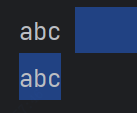

编码

# Unicode

Unicode是世界通用的长度字符集，几乎包含了目前世界上已知的所有字符，也是Java的char和String使用的编码。


# Unicode 和 UTF-8 有什么区别？

unicode是一种字符编码，让每个字符和一个数字对应起来，仅此而已，至于这个数字如何存储它就不管了。

utf8就是定义了如何具体存储这个编码数字的一种方法。

举一个例子：字符串：It's 知乎日报

你看到的unicode字符集是这样的编码表

```text
I 0049
t 0074
' 0027
s 0073
  0020
知 77e5
乎 4e4e
日 65e5
报 62a5
```

每一个字符对应十六进制数字。

计算机只懂二进制，因此，严格按照unicode的方式(UCS-2)，应该这样存储：

```text
I 00000000 01001001
t 00000000 01110100
' 00000000 00100111
s 00000000 01110011
  00000000 00100000
知 01110111 11100101
乎 01001110 01001110
日 01100101 11100101
报 01100010 10100101
```

这个字符串总共占用了18个字节，但是对比中英文的二进制码，可以发现，英文前9位都是0！浪费啊，浪费硬盘，浪费流量。

怎么办？

UTF。

UTF-8是这样做的：

1. 单字节的字符，字节的第一位设为0，对于英语文本，UTF-8码只占用一个字节，和ASCII码完全相同；
2. 2. n个字节的字符(n>1)，第一个字节的前n位设为1，第n+1位设为0，后面字节的前两位都设为10，这n个字节的其余空位填充该字符unicode码，高位用0补足。这样就形成了如下的UTF-8标记位：

0xxxxxxx

110xxxxx 10xxxxxx

1110xxxx 10xxxxxx 10xxxxxx

11110xxx 10xxxxxx 10xxxxxx 10xxxxxx

111110xx 10xxxxxx 10xxxxxx 10xxxxxx 10xxxxxx

1111110x 10xxxxxx 10xxxxxx 10xxxxxx 10xxxxxx 10xxxxxx

... ...

于是，”It's 知乎日报“就变成了：

```text
I 01001001
t 01110100
' 00100111
s 01110011
  00100000
知 11100111 10011111 10100101
乎 11100100 10111001 10001110
日 11100110 10010111 10100101
报 11100110 10001010 10100101
```

和上边的方案对比一下，英文短了，每个中文字符却多用了一个字节。但是整个字符串只用了17个字节，比上边的18个短了一点点。

# 零宽空格（ZWSP）

就是完全没有宽度的字符，特点就是肉眼不可见，Unicode为`\u200B`，URLEncode结果为`%e2%80%8b` 或 `\xe2\x80\x8b`

解决方式是代码中替换掉：

```java
String str = "abc" + "\u200B";
System.out.println(str);
System.out.println(str.length()); // 4
String replace = str.replace("\u200B", "");  // 替换为空字符
System.out.println(replace);
System.out.println(replace.length());  // 3
```

打印看不出任何区别：

