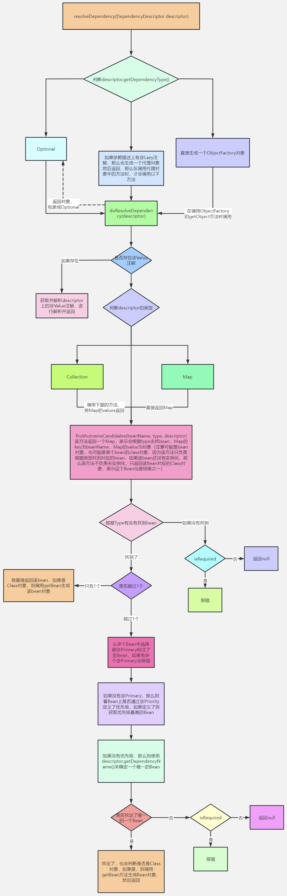
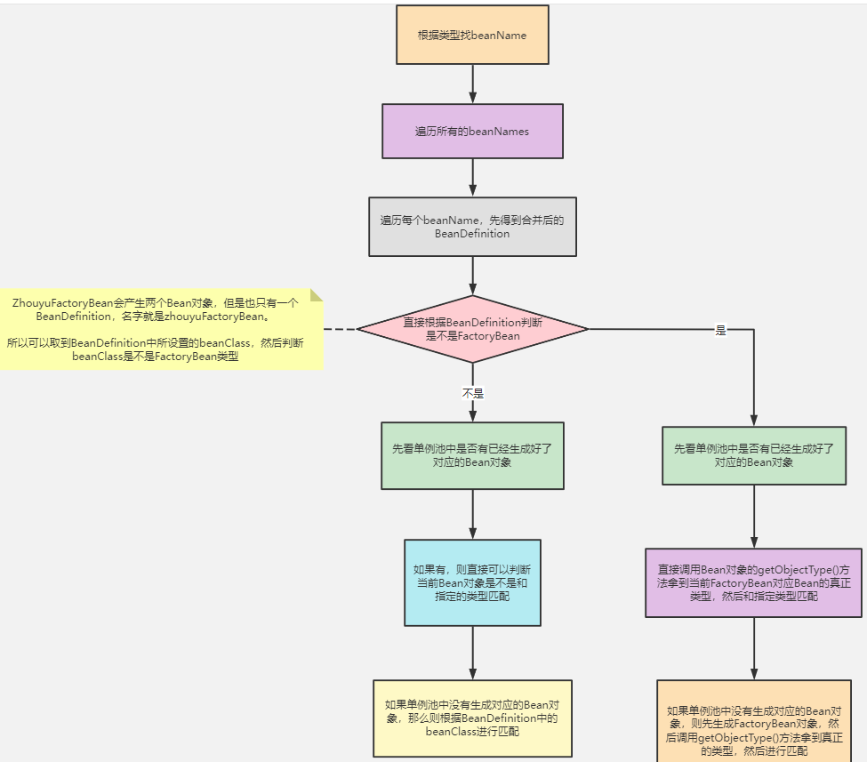
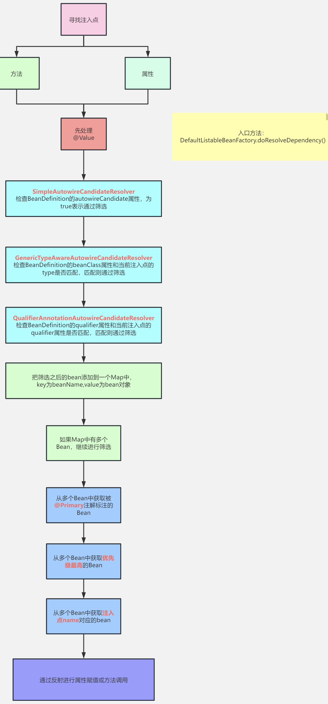

# 一、Bean生成过程

生成时机：

流程：


## 1.生成BeanDefinition  

   扫描流程

   

实现：org.springframework.context.annotation.ClassPathScanningCandidateComponentProvider#scanCandidateComponents

1. 首先，通过ResourcePatternResolver获得指定包路径（默认是classpath）下的所有 .class 文件，保存为**Resource**对象。

2. 遍历每个Resource，解析Resource对象得到**MetadataReader**（具体实现类为SimpleMetadataReader）

   利用MetadataReaderFactory，实现类为CachingMetadataReaderFactory  

3. 过滤：

   1.  利用MetadataReader进行@Component注解的**excludeFilters**和**includeFilters**判断，进行第一次过滤
   2.  过滤后再进行条件注解**@Conditional**的筛选（条件注解并不能理解：某个类上是否存在@Conditional注解，如果存在则调用注解中所指定的类的match方法进行匹配，匹配成功则通过筛选，匹配失败则pass掉。）

4. 筛选通过后，基于MetadataReader生成**ScannedGenericBeanDefinition**

5. 再基于MetadataReader判断：

   1. 必须是**独立类**（可以不依赖外部类来构造，即不能是内部类，但可以是静态内部类 ）
   2. 不能是接口或抽象类

6. 如果筛选通过，那么就表示扫描到了一个Bean，将ScannedGenericBeanDefinition加入结果集。最后得到候选BeanDefinition集合

7. 遍历候选BeanDefinition集合

   1. 读scope注解

   2. 根据类名生成bean名字（规则：**首字母大写，直接转小写；多个大写字母开头，不转，直接用类名**）

   3. 设置BeanDefinition的默认值（不使用lazy等）

   4. 解析@Lazy、@Primary、@DependsOn等注解（实际上都是开关），为BeanDefinition设置开关

   5. 检查**BeanDefinitionMap**中是否存在同名BeanDefinition。如果存在，再看是否兼容；兼容则跳过该bean，不兼容则抛错。

      > 兼容指的是该BeanDefinition与已存在的等价，或者源自同一个类
      >
      > 两次扫描扫到相同bean就是兼容的，但同一次扫描扫到相同的bean就是不兼容的

   6. 注册到BeanDefinitionMap

      先生成BeanDefinitionHolder（其实就是BeanDefinitionMap + beanName）。如果有别名，beanName添加到**别名map**。最后写入DefaultListableBeanFactory的beanDefinitionMap<String, BeanDefinition>（ConcurrentHashMap类型）

8. 

   

MetadataReader表示类的元数据读取器，主要包含了一个AnnotationMetadata，功能有

1. 获取类的名字
2. 获取父类的名字
3. 获取所实现的所有接口名
4. 获取所有内部类的名字
5. 判断是不是抽象类
6. 判断是不是接口
7. 判断是不是一个注解
8. 获取拥有某个注解的方法集合
9. 获取类上添加的所有注解信息
10. 获取类上添加的所有注解类型集合
    合

值得注意的是，CachingMetadataReaderFactory解析某个.class文件得到MetadataReader对象是利用的ASM技术，并没有加载这个类到JVM。并且，最终得到的ScannedGenericBeanDefinition对象，beanClass属性存储的是当前类的**名字**，而不是class对象。（beanClass属性的类型是Object，它即可以存储类的名字，也可以存储class对象）

最后，上面是说的通过扫描得到BeanDefinition对象，我们还可以通过直接定义BeanDefinition，或解析spring.xml文件的<bean/>，或者@Bean注解得到BeanDefinition对象。（后续课程会分析@Bean注解是怎么生成BeanDefinition的）。

## 2.合并BeanDefinition  

实现：org.springframework.beans.factory.support.DefaultListableBeanFactory#preInstantiateSingletons

遍历DefaultListableBeanFactory的beanDefinitionNames，是bean名的列表

1. 获取【合并后】的BeanDefinition

   先从AbstractBeanFactory的 **mergedBeanDefinitions**（ConcurrentHashMap <String, RootBeanDefinition>）中取RootBeanDefinition

   如果取不到，递归找父BeanDefinition合并，最后用子BeanDefinition属性覆盖父BeanDefinition属性

2. 如果【非**抽象Bean** && 单例 && 非懒加载】，才处理

3. `isFactoryBean()`判断是否为FactoryBean：先从**单例池**找；找不到再去找BeanDefinition，再递归找父的BeanFactory。

   1. 如果是，要特殊处理：安全判断（如果系统有设置安全管理器），再看是否实现SmartFactoryBean接口（继承FactoryBean接口），有则getBean()创建bean对象（最终调用该类覆写的**getObject()**方法创建）
   2. 如果不是，getBean()创建bean对象

   所以FactoryBean很特殊，实现这个接口的bean类，可通过重写getObject()向spring容器注册自定义的bean（一般类注册的都是class为类自身的bean）

4. 

**抽象Bean**

父子BeanDefinition实际用的比较少。例如，这么定义的情况下，child是单例Bean：

```xml
<bean id="parent" class="com.zhouyu.service.Parent" scope="prototype"/>
<bean id="child" class="com.zhouyu.service.Child"/>
```

但是这么定义的情况下，child就是原型Bean了 ：

   ```xml
<bean id="parent" class="com.zhouyu.service.Parent" scope="prototype"/>
<bean id="child" class="com.zhouyu.service.Child" parent="parent"/>
   ```

因为child的父BeanDefinition是parent，所以会继承parent上所定义的scope属性。
而在根据child来生成Bean对象之前，需要进行BeanDefinition的合并，得到完整的child的
BeanDefinition  。 

抽象Bean  并不是指抽象类，而是抽象的xml bean。其唯一作用在于继承

```xml
<bean id="parent" class="com.zhouyu.service.Parent" abstract="true"/>
<bean id="child" class="com.zhouyu.service.Child"/>
```


## getBean方法

前期扫描是准备工作，这里真正开始创建bean

AbstractBeanFactory 类的 `getBean(String name)`：返回一个bean，若容器没有就创建。

具体逻辑在类内

```java
protected <T> T doGetBean(String name, @Nullable Class<T> requiredType, @Nullable Object[] args, boolean typeCheckOnly)
```


1. 用bean名找BeanDefinition，如果没有就去父bean工厂找。

2. 检查@DependsOn。遍历依赖该bean的所有bean，只用名字检查，依赖关系存入dependentBeanMap中。先创建该bean依赖的bean

3. 开始创建，看@Scope。

   1. 是单例，getSingleton()——传入一个lambda表达式（用于回调），先锁单例池，然后看池里是否有，没有就创建后加入池。
   2. 是原型，创建一个对象
   3. 是其他：request或session

   三种情况都调**createBean()**（下文3.加载类详述）

   最后都调getObjectForBeanInstance()：如果是&开头，检查是否FactoryBean，不满足抛错。

4. 检查前几步通过name生成的beanInstance类型是否是requiredType


## 3.加载类

BeanDefinition合并之后，就可以去创建Bean对象了。

创建Bean就必须实例化对象，实例化就必须先加载当前BeanDefinition所对应的class，AbstractAutowireCapableBeanFactory类的createBean()方法中，一开始就会调用这行代码就是去加载类：  

```java
Class<?> resolvedClass = resolveBeanClass(mbd, beanName);  
```

如果beanClass被加载了（Object beanClass属性的类型变为Class），就直接返回。否则**根据bean名**加载对应类
（doResolveBeanClass方法）
默认使用**ClassUtils.getDefaultClassLoader()**所返回的类加载器，如果BeanFactory有指定就用指定的类加载器。  

> ClassUtils.getDefaultClassLoader()：
>
> 1. 优先返回当前线程中的ClassLoader
> 2. 线程中类加载器为null的情况下，返回ClassUtils类的类加载器
> 3. 如果ClassUtils类的类加载器为空，那么则表示是Bootstrap类加载器加载的ClassUtils类，那么
>    则返回系统类加载器  

## 4.实例化前

当前BeanDefinition对应的类成功加载后，就可以实例化对象了。

但是Spring在实例化对象之前，提供了一个扩展点**InstantiationAwareBeanPostProcessor.postProcessBeforeInstantiation()**，允许用户来控制是否在某些Bean实例化之前做一些启动动作。比如下面代码会导致，在userService这个Bean实例化前打印：

```java
@Component
public class ZhouyuBeanPostProcessor implements InstantiationAwareBeanPostProcessor {
    @Override
    public Object postProcessBeforeInstantiation(Class<?> beanClass, String beanName) throws BeansException {
        if ("userService".equals(beanName)) {
            System.out.println("实例化前");
        }
        return null;
    }
}
```

**注意**

postProcessBeforeInstantiation()是有返回值的，如果这么实现：

```java
@Component
public class ZhouyuBeanPostProcessor implements InstantiationAwareBeanPostProcessor {
    @Override
    public Object postProcessBeforeInstantiation(Class<?> beanClass, String beanName) throws BeansException {
       if ("userService".equals(beanName)) {
          System.out.println("实例化前");
          return new UserService();
       }
       return null;
    }
}
```

userService这个Bean，在实例化前会直接返回一个由我们所定义的UserService对象。

这种情况表示不需要Spring来实例化了，并且后续的Spring依赖注入也没了，会跳过这些步骤，直接到**13.初始化后**。

## 5.实例化

   在这个步骤中就会根据BeanDefinition去创建一个对象了。

实现：org.springframework.beans.factory.support.AbstractAutowireCapableBeanFactory#doCreateBean

### 5.1 Supplier创建对象

首先判断BeanDefinition中是否设置了Supplier，如果设置了则调用Supplier的get()得到对象。
​

得直接使用BeanDefinition对象来设置Supplier，比如：

```java
AbstractBeanDefinition beanDefinition = BeanDefinitionBuilder.genericBeanDefinition().getBeanDefinition();
beanDefinition.setInstanceSupplier(new Supplier<Object>() {
 @Override
 public Object get() {
  return new UserService();
 }
});
context.registerBeanDefinition("userService", beanDefinition);
```

### 5.2 工厂方法创建对象

如果没有设置Supplier，则检查BeanDefinition中是否设置了factoryMethod，也就是工厂方法，有两种方式可以设置factoryMethod，比如：
​

方式一：

```java
<bean id="userService" class="com.zhouyu.service.UserService" factory-method="createUserService" />
```

对应的UserService类为：

```java
public class UserService {

 public static UserService createUserService() {
  System.out.println("执行createUserService()");
  UserService userService = new UserService();
  return userService;
 }

 public void test() {
  System.out.println("test");
 }

}
```

方式二：

```java
<bean id="commonService" class="com.zhouyu.service.CommonService"/>
<bean id="userService1" factory-bean="commonService" factory-method="createUserService" />
```

对应的CommonService的类为：

```java
public class CommonService {

 public UserService createUserService() {
  return new UserService();
 }
}
```


Spring发现当前BeanDefinition方法设置了工厂方法后，就会区分这两种方式，然后调用工厂方法得到对象。
​

值得注意的是，我们通过@Bean所定义的BeanDefinition，是存在factoryMethod和factoryBean的，也就是和上面的方式二非常类似，@Bean所注解的方法就是factoryMethod，AppConfig对象就是factoryBean。如果@Bean所所注解的方法是static的，那么对应的就是方式一。

### 5.3 推断构造方法

第一节已经讲过一遍大概原理了，后面有一节课单独分析源码实现。推断完构造方法后，就会使用构造方法来进行实例化了。
​

额外的，在推断构造方法逻辑中除开会去选择构造方法以及查找入参对象意外，会还判断是否在对应的类中是否存在使用**@Lookup注解**了方法。如果存在则把该方法封装为LookupOverride对象并添加到BeanDefinition中。
​

在实例化时，如果判断出来当前BeanDefinition中没有LookupOverride，那就直接用构造方法反射得到一个实例对象。如果存在LookupOverride对象，也就是类中存在@Lookup注解了的方法，那就会生成一个代理对象。
​


@Lookup注解就是**方法注入**，使用demo如下：

```java
@Component
public class UserService {

 private OrderService orderService;

 public void test() {
  OrderService orderService = createOrderService();
  System.out.println(orderService);
 }

 @Lookup("orderService")
 public OrderService createOrderService() {
  return null;
 }

}
```

## 6. BeanDefinition的后置处理

Bean对象实例化出来之后，接下来就应该给对象的属性赋值了。在真正给属性赋值之前，Spring又提供了一个扩展点**MergedBeanDefinitionPostProcessor.postProcessMergedBeanDefinition()**，可以对此时的BeanDefinition进行加工，比如：

```java
@Component
public class ZhouyuMergedBeanDefinitionPostProcessor implements MergedBeanDefinitionPostProcessor {
 	@Override
 	public void postProcessMergedBeanDefinition(RootBeanDefinition beanDefinition, Class<?> beanType, String beanName) {
  		if ("userService".equals(beanName)) {
   			beanDefinition.getPropertyValues().add("orderService", new OrderService());
  		}
 	}
}
```

在Spring源码中，AutowiredAnnotationBeanPostProcessor就是一个MergedBeanDefinitionPostProcessor，它的postProcessMergedBeanDefinition()中会去查找注入点，并缓存在AutowiredAnnotationBeanPostProcessor对象的一个Map中（injectionMetadataCache）。

## 7. 实例化后

在处理完BeanDefinition后，Spring又设计了一个扩展点：**InstantiationAwareBeanPostProcessor.postProcessAfterInstantiation()**，比如：
​

```java
@Component
public class ZhouyuInstantiationAwareBeanPostProcessor implements InstantiationAwareBeanPostProcessor {

 @Override
 public boolean postProcessAfterInstantiation(Object bean, String beanName) throws BeansException {

  if ("userService".equals(beanName)) {
   UserService userService = (UserService) bean;
   userService.test();
  }

  return true;
 }
}
```

上述代码就是对userService所实例化出来的对象进行处理。
​

这个扩展点，在Spring源码中基本没有怎么使用。

## 8. 自动注入

这里的自动注入指的是Spring的自动注入，后续依赖注入课程中单独讲
​

## 9. 处理属性

这个步骤中，就会处理@Autowired、@Resource、@Value等注解，也是通过**InstantiationAwareBeanPostProcessor.postProcessProperties()**扩展点来实现的，比如我们甚至可以实现一个自己的自动注入功能，比如：

```java
@Component
public class ZhouyuInstantiationAwareBeanPostProcessor implements InstantiationAwareBeanPostProcessor {

 @Override
 public PropertyValues postProcessProperties(PropertyValues pvs, Object bean, String beanName) throws BeansException {
  if ("userService".equals(beanName)) {
   for (Field field : bean.getClass().getFields()) {
    if (field.isAnnotationPresent(ZhouyuInject.class)) {
     field.setAccessible(true);
     try {
      field.set(bean, "123");
     } catch (IllegalAccessException e) {
      e.printStackTrace();
     }
    }
   }
  }

  return pvs;
 }
}
```

关于@Autowired、@Resource、@Value的底层源码，会在后续的依赖注入课程中详解。

## 10. 执行Aware

完成了属性赋值之后，Spring会执行一些回调，包括：

1. BeanNameAware：回传beanName给bean对象。
2. BeanClassLoaderAware：回传classLoader给bean对象。
3. BeanFactoryAware：回传beanFactory给对象。

## 11. 初始化前

初始化前，也是Spring提供的一个扩展点：**BeanPostProcessor.postProcessBeforeInitialization()**，比如

```java
@Component
public class ZhouyuBeanPostProcessor implements BeanPostProcessor {

 @Override
 public Object postProcessBeforeInitialization(Object bean, String beanName) throws BeansException {
  if ("userService".equals(beanName)) {
   System.out.println("初始化前");
  }

  return bean;
 }
}
```

利用初始化前，可以对进行了依赖注入的Bean进行处理。
​

在Spring源码中：

1. InitDestroyAnnotationBeanPostProcessor会在初始化前这个步骤中执行@PostConstruct的方法，
2. ApplicationContextAwareProcessor会在初始化前这个步骤中进行其他Aware的回调：
   1. EnvironmentAware：回传环境变量
   2. EmbeddedValueResolverAware：回传占位符解析器
   3. ResourceLoaderAware：回传资源加载器
   4. ApplicationEventPublisherAware：回传事件发布器
   5. MessageSourceAware：回传国际化资源
   6. ApplicationStartupAware：回传应用其他监听对象，可忽略
   7. ApplicationContextAware：回传Spring容器ApplicationContext

## 12. 初始化

1. 查看当前Bean对象是否实现了InitializingBean接口，如果实现了就调用其afterPropertiesSet()方法
2. 执行BeanDefinition中指定的初始化方法

### 

## 13. 初始化后

这是Bean创建生命周期中的最后一个步骤，也是Spring提供的一个扩展点：**BeanPostProcessor.postProcessAfterInitialization()**，比如：

```java
@Component
public class ZhouyuBeanPostProcessor implements BeanPostProcessor {

 @Override
 public Object postProcessAfterInitialization(Object bean, String beanName) throws BeansException {
  if ("userService".equals(beanName)) {
   System.out.println("初始化后");
  }

  return bean;
 }
}
```

可以在这个步骤中，对Bean最终进行处理，Spring中的**AOP就是基于初始化后实现**的，**初始化后返回的对象才是最终的Bean对象**。

## 总结BeanPostProcessor

1. 实例化前 InstantiationAwareBeanPostProcessor.postProcessBeforeInstantiation()

2. 实例化

3. MergedBeanDefinitionPostProcessor.postProcessMergedBeanDefinition() 可以修改bdf

4. 实例化后 InstantiationAwareBeanPostProcessor.postProcessAfterInstantiation()  此时bean可能属性没赋值

5. 属性赋值（spring自带的依赖注入）

6. InstantiationAwareBeanPostProcessor.postProcessProperties(@Autowired、@Resource、@Value)

   此时bean已经创建

7. Aware对象

8. 初始化前 BeanPostProcessor.postProcessBeforeInitialization() （此时若有@PostConstruct，则执行）

9. 初始化

10. 初始化后 BeanPostProcessor.postProcessAfterInitialization()

# 二、Bean销毁过程

销毁时机：容器关闭时

销毁对象：只销毁单例，因为容器根本不存原型bean

```java
AnnotationConfigApplicationContext context = new AnnotationConfigApplicationContext(AppConfig.class);
context.close();  // 关闭容器
//context.registerShutdownHook();  // 方法2：调用关闭钩子
```

## 扫描过程

实现：org.springframework.beans.factory.support.AbstractBeanFactory#registerDisposableBeanIfNecessary

1. 不能是原型bean && **需要销毁**。是否需要销毁调requiresDestruction()判断：
   1. 实现**DisposableBean**或**AutoCloseable**接口；
   2. 或 bd设置了destroyMethodName属性（指定destroyMethod的方法名）。如果属性值为“(inferred)”，则自动找名为**close**的方法，找不到再找名为shutdown的。
   3. 或 类实现了DestructionAwareBeanPostProcesso && 其中有一个实现了DestructionAwareBeanPostProcessor.requiresDestruction()返回true（其实就是看哪些方法有**@PreDestroy**）
2. 是否单例，单例才继续走（其他类型自定义处理）
3. 把符合上述任意一个条件的Bean适配成DisposableBeanAdapter对象，并存入**disposableBeans**中（一个LinkedHashMap），并不立即执行

## Spring容器关闭过程

实现：org.springframework.context.support.AbstractApplicationContext#doClose

1. 首先发布ContextClosedEvent事件

2. 调用lifecycleProcessor的onCloese()方法

3. 销毁所有单例Bean

   1. 遍历disposableBeans

         1. 把每个disposableBean从单例池中移除

         2.  调用disposableBean的destroy()（**在这里真正执行destroy逻辑**）

         3.  如果这个disposableBean还被其他Bean**依赖**了，先销毁其他Bean（类似拓扑排序的算法）

         4.   如果这个disposableBean还包含了inner beans，将这些Bean从单例池中移除掉

             (inner beans是bean的所有内部类，参考https://docs.spring.io/spring-framework/docs/current/reference/html/core.html#beans-inner-beans)

   2. 清空manualSingletonNames，是一个Set，存的是用户手动注册的单例Bean的beanName

   3. 清空allBeanNamesByType，是一个Map <bean类型，该类型所有的beanName数组>

   4. 清空singletonBeanNamesByType，和allBeanNamesByType类似，只不过只存了单例Bean

4. 清空beanFactory，清空标志位

**涉及设计模式：适配器模式**
在销毁时，Spring会找出实现了DisposableBean接口的Bean。
但是我们在定义一个Bean时，如果这个Bean实现了DisposableBean接口，或者实现了AutoCloseable接口，或者在BeanDefinition中指定了destroyMethodName，那么这个Bean都属于“DisposableBean”，这些Bean在容器关闭时都要调用相应的销毁方法。
所以，这里就需要进行适配，将实现了DisposableBean接口、或者AutoCloseable接口等**适配成实现了DisposableBean接口**，所以就用到了DisposableBeanAdapter。
会把实现了AutoCloseable接口的类封装成DisposableBeanAdapter，而DisposableBeanAdapter实现了DisposableBean接口。


# 三、依赖注入


org.springframework.beans.factory.support.AbstractAutowireCapableBeanFactory#populateBean

## 1.（已过期的）xml注入

org.springframework.beans.factory.support.AbstractAutowireCapableBeanFactory#autowireByName

org.springframework.beans.factory.support.AbstractAutowireCapableBeanFactory#autowireByType

分别处理这两种注解：

```java
@Bean(autowire = Autowire.BY_NAME)  // 找set方法，切出set后面的名字，去找属性
@Bean(autowire = Autowire.BY_TYPE)  // 找set方法，拿形参类型，去找属性
```


都调用unsatisfiedNonSimpleProperties()找当前Bean中能进行自动注入的属性名：

1. 该属性有对应的set方法
2. 没有在**ignoredDependencyTypes**中
3. 属性对应的set方法定义的接口没有在**ignoredDependencyInterfaces**中
4. 属性类型不是简单类型及其数组，如：int、Integer、int[]


## 2. @Autowired方式

@Autowired注解相当于XML中的autowire属性的**注解方式的替代**  

由AutowiredAnnotationBeanPostProcessor处理，执行postProcessProperties()方法，会直接给对象中的属性赋值。内部并不会处理pvs，直接返回了

1. 找出该类的所有注入点（@Autowired、@Value、@Inject 修饰的**属性、方法**），解析注入点并缓存（用于原型），生成`InjectedElement`。如果有父类，再往上找直到Object，头插法放入列表（父在前）

   static修饰的除外（原因？static修饰的属性和方法只属于类，只有一份，如果多处注入导致冲突）。String类型也除外（根本不需要注入）

2. 遍历1中每个注入点，对bean的执行注入

   1. 对属性，先找值，再反射set。（org.springframework.beans.factory.annotation.AutowiredAnnotationBeanPostProcessor.AutowiredFieldElement#inject）
   2. 对方法（必须是setXX），遍历参数列表找到**每个参数**的值，先找值，然后反射invoke调用。（org.springframework.beans.factory.annotation.AutowiredAnnotationBeanPostProcessor.AutowiredMethodElement#inject）

找值最终都调AutowireCapableBeanFactory.resolveDependency()，原型bean只在第一次执行时解析，之后有缓存了，再创建就直接取缓存

DefaultListableBeanFactory中**resolveDependency()**是上面方法的具体实现，具体流程图  :



findAutowireCandidates()  

根据类型找beanName的底层流程  




DefaultListableBeanFactory.doResolveDependency()具体流程图为  



## 3. @Resource注解

由CommonAnnotationBeanPostProcessor处理，执行postProcessProperties()

底层工作流程图  

  

# 四、循环依赖

