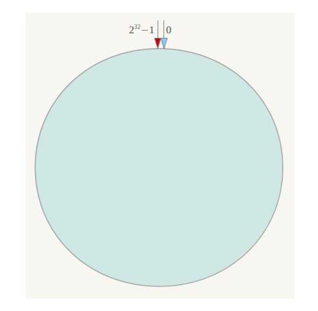

# 一、背景

分布式系统中移除或者添加一个服务器时，需要尽可能小地改变已存在的服务请求与处理请求服务器之间的映射关系。一致性哈希解决了简单哈希算法在分布式[哈希表](https://link.segmentfault.com/?enc=p5OInMW%2F3WSZJ2KGlosPvg%3D%3D.wHQzjtg98brugvAMWUH5UQcNSPlsjqS19iRWDulfLadBLHhAH7UoXjTMYo6zEk7uh6YTnppjEI%2FzP%2BJpK7aAIjOfBPjKMI2NMTb4IA3Slgw%3D)（Distributed Hash Table，DHT）中存在的动态伸缩等问题 。

# 二、优点

- 可扩展性。一致性哈希算法保证了增加或减少服务器时，数据存储的改变最少，相比传统哈希算法大大节省了数据移动的开销 。

- 更好地适应数据的快速增长。采用一致性哈希算法分布数据，当数据不断增长时，部分虚拟节点中可能包含很多数据、造成数据在虚拟节点上分布不均衡，此时可以将包含数据多的虚拟节点分裂，这种分裂仅仅是将原有的虚拟节点一分为二、不需要对全部的数据进行重新哈希和划分。

  虚拟节点分裂后，如果物理服务器的负载仍然不均衡，只需在服务器之间调整部分虚拟节点的存储分布。这样可以随数据的增长而动态的扩展物理服务器的数量，且代价远比传统哈希算法重新分布所有数据要小很多。

# 一致性哈希算法与哈希算法的关系

一致性哈希算法是在哈希算法基础上提出的，在动态变化的分布式环境中，哈希算法应该满足的几个条件：平衡性、单调性和分散性。

- 平衡性：是指 hash 的结果应该平均分配到各个节点，这样从算法上解决了负载均衡问题。
- 单调性：是指在新增或者删减节点时，不影响系统正常运行。
- 分散性：是指数据应该分散地存放在分布式集群中的各个节点（节点自己可以有备份），不必每个节点都存储所有的数据。

# 三、原理

通过一个叫作一致性哈希环的数据结构实现。这个环的起点是 0，终点是 2^32 - 1，并且起点与终点连接，故这个环的整数分布范围是 [0, 2^32-1]，如下图所示：

## 定位算法

1、计算节点哈希，放到哈希环

2、计算对象哈希，放到哈希环

3、为每个对象寻找存放节点：在哈希环上顺时针找距离该对象最近的节点

Object A、Object B、Object C、Object D四个数据对象，经过哈希计算后，在环空间上的位置如下：

根据一致性哈希算法，数据A会被定位到Node A上，B被定位到Node B上，C被定位到Node C上，D被定位到Node D上：

## 1、节点减少

现假设Node C宕机，可以看到此时对象A、B、D不会受到影响，只有C对象被重定位到Node D。

## 2、节点增加

如下图

此时对象Object A、B、D不受影响，只有对象C需要重定位到新的Node X 。一般的，在一致性哈希算法中，如果增加一台服务器，则受影响的数据仅仅是新服务器到其环空间中前一台服务器（即沿着逆时针方向行走遇到的第一台服务器）之间数据，其它数据也不会受到影响。

综上所述，一致性哈希算法对于节点的增减都只需重定位环空间中的**一小部分**数据，具有较好的容错性和可扩展性。

## 虚拟节点

节点太少时（如只有两个）可能造成数据在节点的分布不均匀，大量数据集中到某个节点。

解决办法是引入虚拟节点，即对每一个节点计算多个哈希，每个哈希位置都放置一个虚拟节点。如下图，节点A和B都计算三个哈希

数据的定位算法不变，只是多了一步虚拟节点到实际节点的映射，即Node A#1、Node A#2和Node A#3最终都定位到实际节点A，Node B亦然。

