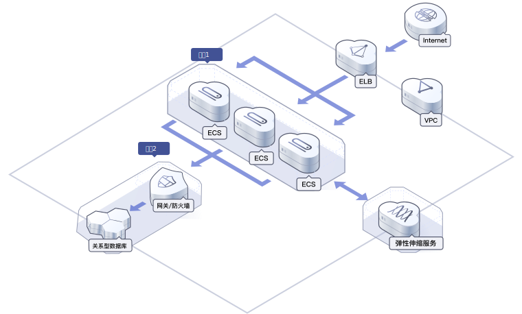
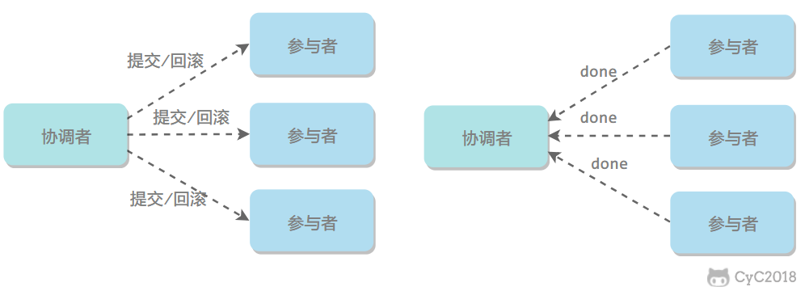
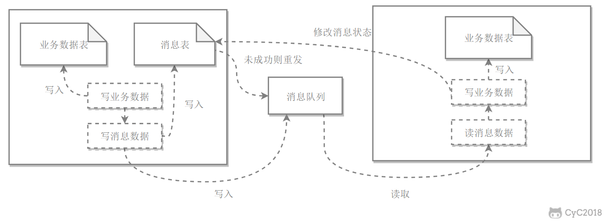
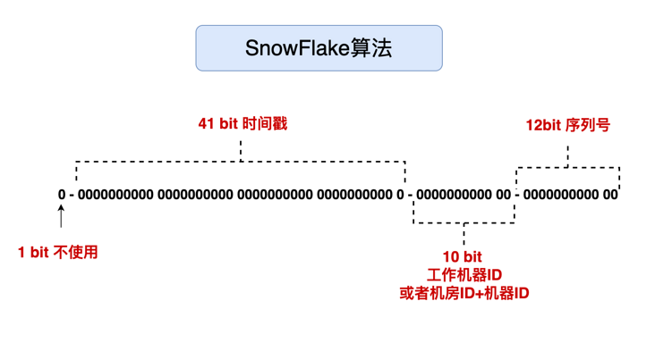
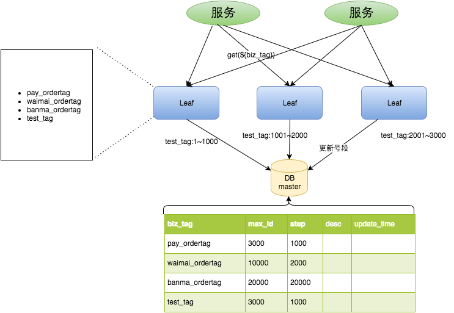
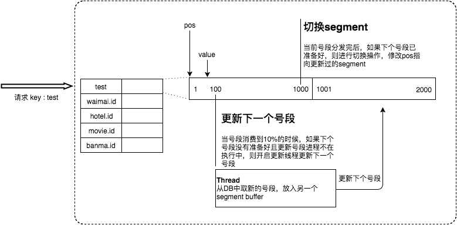
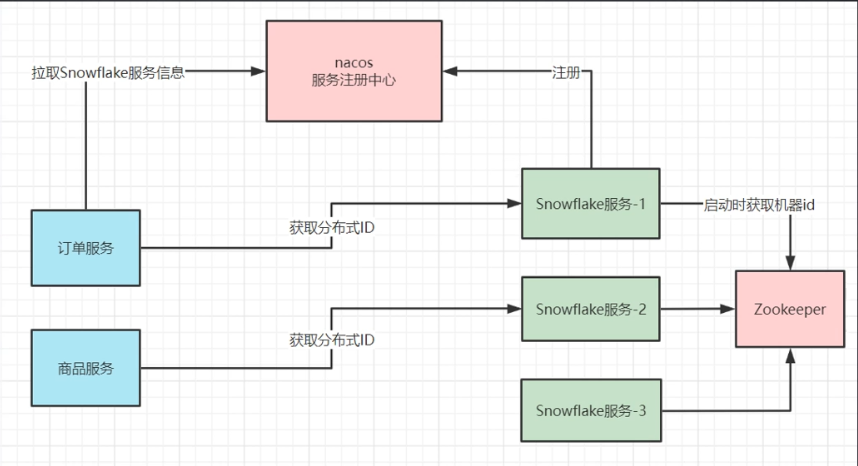
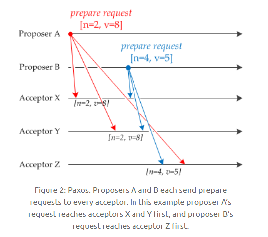

# CAP理论

一个分布式系统不可能同时满足Consistency（一致性）、Availability（可用性）、Partition Tolerance（分区容错性），最多满足两项。 

## Consistency

一致性：各节点的数据保证一致（每次成功写入之后，无论从哪个节点读取，都能读取到最新数据），相当于向所有节点的写操作是原子操作（要么全部失败要么全部成功）。

## Availability

可用性：每次向未崩溃的节点发送请求，总能保证收到响应数据（允许不是最新数据，允许一定延迟）。 一致性C和可用性A在分布式环境下是无法兼顾的

- 若要保证一致性：则必须进行节点间数据同步，**同步期间数据锁定**，导致期间的读取失败或超时，破坏了可用性；
- 若要保证可用性：则不允许节点间同步期间锁定，这又破坏了一致性。

## Partition tolerance

> 网络分区： 指分布式系统中的节点被划分为多个区域，每个区域内部可以通信，但是区域之间无法通信。

分区容忍性：分布式系统在遇到任何**网络分区**故障的时候，仍然需要能对外提供一致性和可用性的服务，除非是整个网络环境都发生了故障。

## 权衡

在分布式系统中，分区容忍性P必不可少，因为需要总是假设网络是不可靠的。因此，CAP 理论实际上是要在可用性C和一致性A之间做权衡。

可用性和一致性往往是冲突的，很难使它们同时满足。在多个节点之间进行数据同步时，

- 为了保证一致性（CP），不能访问未同步完成的节点（同步期间**锁定**），也就失去了部分可用性；
- 为了保证可用性（AP），允许读取所有节点的数据（同步期间不锁定），但是又可能导致数据不一致。

**典型CP系统**

Zookeeper、Redis集群

**典型AP系统**

SpringCloud Eureka、RocketMQ


## BASE 

是基本可用（Basically Available）、软状态（Soft State）和最终一致性（Eventually Consistent）三个短语的缩写。

BASE 理论是对 CAP 中的**CA**权衡的结果，基本可用和软状态是对A的妥协，最终一致性是对C的妥协

它的核心思想是：即使无法做到强一致性，但每个应用都可以根据自身业务特点，采用适当的方式来使系统达到最终一致性。

### 基本可用

指分布式系统在出现故障的时候，保证核心可用，允许损失部分可用性。

例如，电商在做促销时，为了保证购物系统的稳定性，部分消费者可能会被引导到一个降级的页面。

### 软状态

指允许系统中的数据存在**中间状态**，并认为该中间状态不会影响系统整体可用性，即允许系统不同节点的数据副本之间进行同步的过程存在时延。

### 最终一致性

最终一致性强调的是系统中所有的数据副本，在经过一段时间的同步后，最终能达到一致的状态。

ACID 要求强一致性，通常运用在传统的数据库系统上。而 BASE 要求最终一致性，通过牺牲强一致性来达到可用性，通常运用在大型分布式系统中。

在实际的分布式场景中，不同业务单元和组件对一致性的要求是不同的，因此 ACID 和 BASE 往往会结合在一起使用。

**顺序一致性**

1. 任何一次读都能读到某个数据最后一次写的数据
2. 对其他节点之前的修改是可见（已同步）且确定的，并且新的写入建立在已经达成同步的基础上

**zk写入是强一致性，读取是顺序一次性。**


# 云计算

指通过互联网，以按需服务的方式，为用户提供弹性、可扩展、可共享的IT、数据和应用资源的新服务模式。并不特指某项具体技术和协议。

大型门户网站架构：



- DDoS高防：通过高防IP代理源站IP对外提供服务，将恶意攻击流量引流到高防IP清洗，确保重要业务不被攻击中断
- ELB（Elastic Load Balance，弹性负载均衡）将访问流量均匀分发到多台云服务器，扩展应用系统对外的服务能力，确保业务快速平稳的运行。
- ECS（Elastic Cloud Server, 弹性云服务器）是一种云上可随时自助获取、可弹性伸缩的计算服务
- VPC（Virtual Private Cloud, 虚拟私有云）是用户在云上申请的隔离的、私密的虚拟网络环境

# 分布式锁

java内置锁只能对单jvm有效，若是分布式环境则失效，需要其他解决方案

## 1. 数据库的唯一索引

## 2. Redis 的 SETNX + EXPIRE 指令

- 加锁

  写值：SETNX key value，当键不存在时，对键进行设置操作并返回成功，否则返回失败。KEY 是锁的唯一标识，一般按业务来决定命名。

  设置锁过期时间：EXPIRE key timeout, 设置 key 的超时时间，以保证即使锁没有被显式释放，锁也可以在一定时间后自动释放，避免资源被永远锁住。

  这两条配合使用，因为不是原子性，需要用lua脚本

- 解锁

  先查：get key

  key存在才删除：DEL key，通过删除键值对来释放锁，以便其他线程可以通过 SETNX 命令来获取锁。

  这两条也要用lua脚本保证原子性

  （具体lua见分布式一章）

## 3. Redis 的 RedLock 算法

- 尝试从 N 个互相独立 Redis 实例获取锁；
- 计算获取锁消耗的时间，只有时间小于锁的过期时间，并且从半数以上（N / 2 + 1）实例上获取了锁，才认为获取锁成功；
- 如果获取锁失败，就到每个实例上释放锁。

注意：redlock算法依然有bug，若设置redis持久化策略为RDB，则当某些节点宕机前未持久化，则实际上加锁失败，而客户端认为加锁成功，进而出错。若持久化策略为AOF，又会降低性能，还不如用zk锁。

## 4. Zookeeper锁

某个客户端尝试创建临时znode，成功则获取到锁，由此保证获得znode的客户端唯一，其他客户端来创建这个znode就会失败，只能对这个znode注册一个监听器。

释放锁就是删除znode，一旦删除会立即通知正在监听的客户端，这时等待的客户端就能获得该锁。

# 分布式定时任务

## 1. 单机定时任务

sprintboot的@Scheduled注解，使用cron表达式表示定时任务周期

缺点：

- 功能相对简单，可用性差；部署效率低，开发和维护成本高，不方便管理和控制，尤其在多系统的环境；
- 任务跟踪和告警难以实现。

## 2. 分布式定时任务

运行在分布式集群环境下的调度任务，同⼀个定时任务程序**部署多份**，则同一时刻应当只允许⼀个定时任务执行。

优点：

- 集群的方式进行管理调度，更高效，降低开发和维护成本
- 分布式部署，保证系统高可用性，伸缩性，负载均衡，提高容错；
- 任务可持久化到库，并有完善的重做机制、任务跟踪和告警。

# 

# 分布式事务

指事务的操作位于不同的节点上，需要保证事务的 ACID 特性。

例如在下单场景下，库存和订单如果不在同一个节点上，就涉及分布式事务。

分布式锁和分布式事务区别：

- 锁问题的关键在于进程操作的互斥关系，例如多个进程同时修改账户的余额，如果没有互斥关系则会导致该账户的余额不正确。
- 而事务问题的关键则在于事务涉及的一系列操作需要满足 ACID 特性，例如要满足原子性操作则需要这些操作要么都执行，要么都不执行。

### [#](https://www.cyc2018.xyz/其它/系统设计/分布式.html#_2pc)2PC

两阶段提交（Two-phase Commit，2PC），通过引入协调者（Coordinator）来协调参与者的行为，并最终决定这些参与者是否要真正执行事务。

#### [#](https://www.cyc2018.xyz/其它/系统设计/分布式.html#_1-运行过程)1. 运行过程

##### [#](https://www.cyc2018.xyz/其它/系统设计/分布式.html#_1-1-准备阶段)1.1 准备阶段

协调者询问参与者事务是否执行成功，参与者发回事务执行结果。询问可以看成一种投票，需要参与者都同意才能执行。


#####  1.2 提交阶段

如果事务在每个参与者上都执行成功，事务协调者发送通知让参与者提交事务；否则，协调者发送通知让参与者回滚事务。

需要注意的是，在准备阶段，参与者执行了事务，但是还未提交。只有在提交阶段接收到协调者发来的通知后，才进行提交或者回滚。



#### 2. 存在的问题

##### [#](https://www.cyc2018.xyz/其它/系统设计/分布式.html#_2-1-同步阻塞)2.1 同步阻塞

所有事务参与者在等待其它参与者响应的时候都处于同步阻塞等待状态，无法进行其它操作。

##### [#](https://www.cyc2018.xyz/其它/系统设计/分布式.html#_2-2-单点问题)2.2 单点问题

协调者在 2PC 中起到非常大的作用，发生故障将会造成很大影响。特别是在提交阶段发生故障，所有参与者会一直同步阻塞等待，无法完成其它操作。

##### [#](https://www.cyc2018.xyz/其它/系统设计/分布式.html#_2-3-数据不一致)2.3 数据不一致

在提交阶段，如果协调者只发送了部分 Commit 消息，此时网络发生异常，那么只有部分参与者接收到 Commit 消息，也就是说只有部分参与者提交了事务，使得系统数据不一致。

##### [#](https://www.cyc2018.xyz/其它/系统设计/分布式.html#_2-4-太过保守)2.4 太过保守

任意一个节点失败就会导致整个事务失败，没有完善的容错机制。

### [#](https://www.cyc2018.xyz/其它/系统设计/分布式.html#本地消息表)本地消息表

本地消息表与业务数据表处于同一个数据库中，这样就能利用本地事务来保证在对这两个表的操作满足事务特性，并且使用了消息队列来保证最终一致性。

1. 在分布式事务操作的一方完成写业务数据的操作之后向本地消息表发送一个消息，本地事务能保证这个消息一定会被写入本地消息表中。
2. 之后将本地消息表中的消息转发到消息队列中，如果转发成功则将消息从本地消息表中删除，否则继续重新转发。
3. 在分布式事务操作的另一方从消息队列中读取一个消息，并执行消息中的操作。




# 分布式ID

在开发中，我们通常会需要一个唯一ID来标识数据，如果是单体架构，我们可以通过数据库的主键，或直接在内存中维护一个自增数字来作为ID都是可以的，但对于一个分布式系统，就会有可能会出现ID冲突，此时有以下解决方案：

## 1. UUID

大小为16Byte，标准型式包含32个16进制数字，以连字号分为五段，形式为8-4-4-4-12的36个字符：

```
550e8400-e29b-41d4-a716-446655440000
```

优点：

- 性能非常高：本地生成，没有网络消耗。

缺点：

- 不易于存储：UUID太长，16字节128位，通常以36长度的字符串表示，很多场景不适用。
- 信息不安全：基于MAC地址生成UUID的算法可能会造成MAC地址泄露，这个漏洞曾被用于寻找梅丽莎病毒的制作者位置。
- 不适合做DB主键：MySQL官方建议主键尽量短，36个字符长度的UUID不符合要求。且对MySQL索引不利：UUID无序，在InnoDB引擎下引起B+树频繁调整，严重影响性能

## 2.DB自增id

字段使用auto_increment，单机数据库提供的自增id。作为分布式ID的生成器，复杂度适中，ID长度较之uuid更短。

缺点：

- 受单机DB性能的限制，并发大时，innodb在按主键进行插入的时候会造成明显的锁争用，主键的上界会成为争抢的热点，因为所有的插入都发生在这里，并发插入会导致间隙锁竞争。
- Auto_Increment锁机制会造成自增锁的抢夺。解决：调优innodb_autoinc_lock_mode的配置。
- 自增id容易暴露业务规模。


## 3.UDAL 全局自增id

## 4.redis、zookeeper生成id

比如redis的自增命令、zookeeper的顺序节点，这种方案和单机数据库(mysql)相比，性能有所提高，可以适当选用

## 5.雪花算法



- 1位符号位，始终为0，不使用
- 41-bit 时间戳：单位毫秒，可以表示`（1L<<41）/ (1000L*3600*24*365)=69`年的时间
- 10-bit 机器标识：可以分别表示1024台机器
- 12-bit 序列号：可以表示2048个ID

可以保证在任何一个IDC（数据机房）的任何一台机器在任意毫秒内生成的ID都是不同。

优点：

- 毫秒数在高位，自增序列在低位，整个ID都是**趋势递增**的（但不一定严格递增，可能会跳跃）。
- 不依赖数据库等第三方系统，以服务的方式部署，稳定性更高，生成ID的性能也是非常高的。
- 可以根据自身业务特性分配bit位，非常灵活。

缺点：强依赖机器时钟，如果机器上时钟回拨，会导致发号重复或者服务会处于不可用状态。


**解决**：业界存在tinyid、美团leaf、百度UIDGenerator等开源中间件实现了雪花算法。

## Leaf-segment数据库方案

不是生成每个id都查DB，而是利用proxy server批量获取，每次获取一个segment(step决定大小)号段的值，用完再取新的号段，可以大大的减轻DB的压力。

用一个表记录分发的id号段，biz_tag是主键，用于区分各个业务不同的发号需求，每个biz_tag 的ID获取相互隔离，互不影响。日后由于性能需求要扩容，对biz_tag 分库分表即可。

max_id表示该biz_tag目前所被分配的ID号段的最大值，step表示每次分配的号段长度。

```
+-------------+--------------+------+-----+-------------------+-----------------------------+
| Field       | Type         | Null | Key | Default           | Extra                       |
+-------------+--------------+------+-----+-------------------+-----------------------------+
| biz_tag     | varchar(128) | NO   | PRI |                   |                             |
| max_id      | bigint(20)   | NO   |     | 1                 |                             |
| step        | int(11)      | NO   |     | NULL              |                             |
| desc        | varchar(256) | YES  |     | NULL              |                             |
| update_time | timestamp    | NO   |     | CURRENT_TIMESTAMP | on update CURRENT_TIMESTAMP |
+-------------+--------------+------+-----+-------------------+-----------------------------+
```

大致架构如下图所示：



test_tag在第一台Leaf机器上是1-1000的号段，当这个号段用完时，会去加载另一个长度为step=1000的号段，假设另外两台号段都没有更新，这个时候第一台机器新加载的号段就应该是3001-4000。同时数据库对应的biz_tag这条数据的max_id会从3000被更新成4000，更新号段的SQL语句如下：

```sql
Begin
UPDATE table SET max_id=max_id+step WHERE biz_tag=xxx
SELECT tag, max_id, step FROM table WHERE biz_tag=xxx
Commit
```

优点：

- Leaf服务可以很方便的线性扩展，性能完全能够支撑大多数业务场景。
- ID号码是趋势递增的8byte的64位数字，满足上述数据库存储的主键要求。
- 容灾性高：Leaf服务内部有号段缓存，即使DB宕机，短时间内Leaf仍能正常对外提供服务。
- 可以自定义max_id的大小，非常方便业务从原有的ID方式上迁移过来。

缺点：

- ID号码不够随机，能够泄露发号数量的信息，不太安全。
- TP999数据波动大，当号段使用完之后还是会hang在更新数据库的I/O上，tg999数据会出现偶尔的尖刺。
- DB宕机会造成整个系统不可用。

### 双buffer优化

Leaf 取号段的时机是在号段消耗完的时候进行的，此时若DB阻塞会影响后续取号。



采用双buffer的方式，Leaf服务内部有两个号段缓存区segment。当前号段已下发**10%（根据经验得出）**时，如果下一个号段未更新，则另启一个更新线程去更新下一个号段。当前号段全部下发完后，如果下个号段准备好了则切换到下个号段为当前segment接着下发，循环往复。

- 每个biz-tag都有消费速度监控，通常推荐segment长度设置为服务高峰期发号**QPS的600倍**（10分钟），这样即使DB宕机，Leaf仍能持续发号10-20分钟不受影响。
- 每次请求来临时都会判断下个号段的状态，从而更新此号段，所以偶尔的网络抖动不会影响下个号段的更新。

## Leaf-snowflake方案

将snowflake服务单独部署，注册在nacos。每个业务（订单、商品）调单独的snowflake服务获取分布式id，机器id从zk获取顺序节点值



启动步骤：

1. 启动Leaf-snowflake服务，连接Zookeeper，在leaf_forever父节点下检查自己是否已经注册过（是否有该顺序子节点）。
2. 如果有注册过直接取回自己的workerID（zk顺序节点生成的int类型ID号），启动服务。
3. 如果没有注册过，就在该父节点下面创建一个持久顺序节点，创建成功后取回顺序号当做自己的workerID号，启动服务。


### 弱依赖ZooKeeper

除了每次会去ZK拿数据以外，也会在本机文件系统上缓存一个workerID文件。当ZooKeeper出现问题，恰好机器出现问题需要重启时，能保证服务能够正常启动。这样做到了对三方组件的弱依赖。一定程度上提高了SLA。

### 解决时钟回拨问题

因为这种方案依赖时间，如果机器的时钟发生了回拨，那么就会有可能生成重复的ID号，需要解决时钟回退的问题。


参见上图整个启动流程图，服务启动时首先检查自己是否写过ZooKeeper leaf_forever节点：

1. 若写过，则用自身系统时间与`leaf_forever/${self}`节点记录时间做比较，若小于`leaf_forever/${self}`时间则认为机器时间发生了大步长回拨，服务启动失败并报警。

2. 若未写过，证明是新服务节点，直接创建持久节点`leaf_forever/${self}`并写入自身系统时间，接下来综合对比其余Leaf节点的系统时间来判断自身系统时间是否准确

   > 具体做法是取leaf_temporary下的所有临时节点（所有运行中的Leaf-snowflake节点）的服务IP:Port，然后通过RPC请求得到所有节点的系统时间，计算sum(time)/nodeSize。

3. 若`abs(系统时间 - sum(time)/nodeSize )` < 阈值，认为当前系统时间准确，正常启动服务，同时写临时节点`leaf_temporary/${self}` 维持租约。

4. 否则认为本机系统时间发生大步长偏移，启动失败并报警。

5. 每隔一段时间(3s)上报自身系统时间写入`leaf_forever/${self}`。

由于强依赖时钟，对时间的要求比较敏感，在机器工作时NTP同步也会造成秒级别的回退，建议可以直接关闭NTP同步。要么在时钟回拨的时候直接不提供服务直接返回ERROR_CODE，等时钟追上即可。**或者做一层重试，然后上报报警系统，更或者是发现有时钟回拨之后自动摘除本身节点并报警**

> NTP（Network Time Protocol，网络时间协议）（基于**UDP**，端口号为123）
>
> 是TCP/IP协议族里面的一个应用层协议，用来使客户端和服务器之间进行时钟同步，提供高精准度的时间校正。NTP服务器从**权威时钟源**（例如原子钟、GPS）接收精确的协调世界时UTC，客户端再从服务器请求和接收时间。

### 简单实现

一句话总结：就是**单进程中发号的时间戳不能倒退**

（具体见[SnowFlakeWorker.java](./code/SnowFlakeWorker.java)）

```java
private final long myepoch = 1420041600000L; // 开始时间截 (2015-01-01)
// 获得下一个ID (该方法是线程安全的)
public synchronized long nextId() {
    long timestamp = System.currentTimeMillis();
    // 如果当前时间小于上一次ID生成的时间戳，说明系统时钟回退过，抛错
    if (timestamp < lastTimestamp) {
        throw new RuntimeException(
            String.format("Clock moved backwards.  Refusing to generate id for %d milliseconds", lastTimestamp - timestamp));
    }
    // 如果是同一时间生成的，则进行毫秒内序列
    if (lastTimestamp == timestamp) {
        sequence = (sequence + 1) & sequenceMask;  // sequenceMask=4095，掩码运算，溢出就从头循环
        if (sequence == 0) {  // 毫秒内序列溢出    
            timestamp = tilNextMillis(lastTimestamp);  // 调方法，阻塞到下一个毫秒,获得新的时间戳
        }
    }
    // 时间戳改变，毫秒内序列重置
    else {  sequence = generateRandom();  }
    // 更新上次生成ID的时间截
    lastTimestamp = timestamp;
    // 移位并通过或运算拼到一起组成64位的ID
    // 【思考】为何用时间戳减去开始时间戳？----这样可以表示从2015年起往后69年，而不是从1970年起。
    return ((timestamp - myepoch) << timestampLeftShift) //时间戳左移22位
        | (datacenterId << datacenterIdShift) //数据机房标识左移17位（10位机器号中，高5位用来标识机房，低5位标识机器）
        | (workerId << workerIdShift) //机器id标识左移12位
        | sequence;  // 低12位全是序列号，直接拼接在最后即可
}

protected long tilNextMillis(long lastTimestamp) {
    long timestamp = System.currentTimeMillis();
    while (timestamp <= lastTimestamp) {  // 循环获取当前时间，直到晚于lastTimestamp
        timestamp = System.currentTimeMillis();
    }
    return timestamp;
}
```

# 一致性哈希


Distributed Hash Table（DHT） 是一种哈希分布方式，其目的是为了克服传统哈希分布在服务器节点数量变化时大量数据迁移的问题。

## 优点

- 可扩展性。一致性哈希算法保证了增加或减少服务器时，数据存储的改变最少，相比传统哈希算法大大节省了数据移动的开销 。

- 更好地适应数据的快速增长。采用一致性哈希算法分布数据，当数据不断增长时，部分虚拟节点中可能包含很多数据、造成数据在虚拟节点上分布不均衡，此时可以将包含数据多的虚拟节点分裂，这种分裂仅仅是将原有的虚拟节点一分为二、不需要对全部的数据进行重新哈希和划分。

  虚拟节点分裂后，如果物理服务器的负载仍然不均衡，只需在服务器之间调整部分虚拟节点的存储分布。这样可以随数据的增长而动态的扩展物理服务器的数量，且代价远比传统哈希算法重新分布所有数据要小很多。

## 一致性哈希算法与哈希算法的关系

一致性哈希算法是在哈希算法基础上提出的，在动态变化的分布式环境中，哈希算法应该满足的几个条件：平衡性、单调性和分散性。

- 平衡性：是指 hash 的结果应该平均分配到各个节点，这样从算法上解决了负载均衡问题。
- 单调性：是指在新增或者删减节点时，不影响系统正常运行。
- 分散性：是指数据应该分散地存放在分布式集群中的各个节点（节点自己可以有备份），不必每个节点都存储所有的数据。

## 原理

通过一个叫作一致性哈希环的数据结构实现。这个环的起点是 0，终点是 2^32 - 1，并且起点与终点连接，故这个环的整数分布范围是 `[0, 2^32-1]`，如下图所示：


## Q：为什么是2^32？

1. java中int是32位，若表示无符号整数，范围为0~2^32-1
2. ip地址32位

### 1. 定位算法

1. 计算节点哈希，放到哈希环

2. 计算对象哈希，放到哈希环

3. 为每个对象寻找存放节点：在哈希环上**顺时针**找距离该对象最近的节点


Object A、Object B、Object C、Object D四个数据对象，经过哈希计算后，在环空间上的位置如下：


根据一致性哈希算法，数据A会被定位到Node A上，B被定位到Node B上，C被定位到Node C上，D被定位到Node D上：


### 2. 节点减少

现假设Node C宕机，可以看到此时对象A、B、D不会受到影响，只有C对象被重定位到Node D。

### 3. 节点增加


此时对象Object A、B、D不受影响，只有对象C需要重定位到新的Node X 。一般的，在一致性哈希算法中，如果增加一台服务器，则受影响的数据仅仅是新服务器到其环空间中前一台服务器（即沿着逆时针方向行走遇到的第一台服务器）之间数据，其它数据也不会受到影响。

综上所述，一致性哈希算法对于节点的增减都只需重定位环空间中的**一小部分**数据，具有较好的容错性和可扩展性。

### 4. 虚拟节点

节点太少时（如只有两个）可能造成数据在节点的分布不均匀，大量数据集中到某个节点。

解决办法是引入虚拟节点，即对每一个节点计算**多个哈希**，每个哈希位置都放置一个虚拟节点，**本质是增加分散性**。如下图，节点A和B都计算三个哈希


数据的定位算法不变，只是多了一步虚拟节点到实际节点的映射，即Node A#1、Node A#2和Node A#3最终都定位到实际节点A，Node B亦然。


## Paxos

用于达成共识性问题，即对多个节点产生的值，该算法能保证只选出唯一一个值。

主要有三类节点：

- 提议者（Proposer）：提议一个值；
- 接受者（Acceptor）：对每个提议进行投票；
- 告知者（Learner）：被告知投票的结果，不参与投票过程。


### 执行过程

规定一个提议包含两个字段：[n, v]，其中 n 为序号（具有唯一性），v 为提议值。

#### [#](https://www.cyc2018.xyz/其它/系统设计/分布式.html#_1-prepare-阶段)1. Prepare 阶段

下图演示了两个 Proposer 和三个 Acceptor 的系统中运行该算法的初始过程，每个 Proposer 都会向所有 Acceptor 发送 Prepare 请求。



当 Acceptor 接收到一个 Prepare 请求，包含的提议为 [n1, v1]，并且之前还未接收过 Prepare 请求，那么发送一个 Prepare 响应，设置当前接收到的提议为 [n1, v1]，并且保证以后不会再接受序号小于 n1 的提议。

如下图，Acceptor X 在收到 [n=2, v=8] 的 Prepare 请求时，由于之前没有接收过提议，因此就发送一个 [no previous] 的 Prepare 响应，设置当前接收到的提议为 [n=2, v=8]，并且保证以后不会再接受序号小于 2 的提议。其它的 Acceptor 类似。

如果 Acceptor 接收到一个 Prepare 请求，包含的提议为 [n2, v2]，并且之前已经接收过提议 [n1, v1]。如果 n1 > n2，那么就丢弃该提议请求；否则，发送 Prepare 响应，该 Prepare 响应包含之前已经接收过的提议 [n1, v1]，设置当前接收到的提议为 [n2, v2]，并且保证以后不会再接受序号小于 n2 的提议。

如下图，Acceptor Z 收到 Proposer A 发来的 [n=2, v=8] 的 Prepare 请求，由于之前已经接收过 [n=4, v=5] 的提议，并且 n > 2，因此就抛弃该提议请求；Acceptor X 收到 Proposer B 发来的 [n=4, v=5] 的 Prepare 请求，因为之前接收到的提议为 [n=2, v=8]，并且 2 <= 4，因此就发送 [n=2, v=8] 的 Prepare 响应，设置当前接收到的提议为 [n=4, v=5]，并且保证以后不会再接受序号小于 4 的提议。Acceptor Y 类似。

#### 2. Accept 阶段

当一个 Proposer 接收到超过一半 Acceptor 的 Prepare 响应时，就可以发送 Accept 请求。

Proposer A 接收到两个 Prepare 响应之后，就发送 [n=2, v=8] Accept 请求。该 Accept 请求会被所有 Acceptor 丢弃，因为此时所有 Acceptor 都保证不接受序号小于 4 的提议。

Proposer B 过后也收到了两个 Prepare 响应，因此也开始发送 Accept 请求。需要注意的是，Accept 请求的 v 需要取它收到的最大提议编号对应的 v 值，也就是 8。因此它发送 [n=4, v=8] 的 Accept 请求。

#### 3. Learn 阶段

Acceptor 接收到 Accept 请求时，如果序号大于等于该 Acceptor 承诺的最小序号，那么就发送 Learn 提议给所有的 Learner。当 Learner 发现有大多数的 Acceptor 接收了某个提议，那么该提议的提议值就被 Paxos 选择出来。

### [#](https://www.cyc2018.xyz/其它/系统设计/分布式.html#约束条件)约束条件

#### [#](https://www.cyc2018.xyz/其它/系统设计/分布式.html#_1-正确性)1. 正确性

指只有一个提议值会生效。

因为 Paxos 协议要求每个生效的提议被多数 Acceptor 接收，并且 Acceptor 不会接受两个不同的提议，因此可以保证正确性。

#### [#](https://www.cyc2018.xyz/其它/系统设计/分布式.html#_2-可终止性)2. 可终止性

指最后总会有一个提议生效。

Paxos 协议能够让 Proposer 发送的提议朝着能被大多数 Acceptor 接受的那个提议靠拢，因此能够保证可终止性。


## Raft

Raft 也是分布式一致性协议，主要是用来竞选主节点。

- [Raft: Understandable Distributed Consensus(opens new window)](http://thesecretlivesofdata.com/raft)

### [#](https://www.cyc2018.xyz/其它/系统设计/分布式.html#单个-candidate-的竞选)单个 Candidate 的竞选

有三种节点：Follower、Candidate 和 Leader。Leader 会周期性的发送心跳包给 Follower。每个 Follower 都设置了一个随机的竞选超时时间，一般为 150ms~300ms，如果在这个时间内没有收到 Leader 的心跳包，就会变成 Candidate，进入竞选阶段。

- 下图展示一个分布式系统的最初阶段，此时只有 Follower 没有 Leader。Node A 等待一个随机的竞选超时时间之后，没收到 Leader 发来的心跳包，因此进入竞选阶段。

### 多个 Candidate 竞选

- 如果有多个 Follower 成为 Candidate，并且所获得票数相同，那么就需要重新开始投票。例如下图中 Node B 和 Node D 都获得两票，需要重新开始投票。

### 数据同步

- 来自客户端的修改都会被传入 Leader。注意该修改还未被提交，只是写入日志中。

# 幂等性

幂等性是系统服务对外一种承诺，承诺只要调用接口成功，外部多次调用对系统的影响是一致的。声明为幂等的服务会认为外部调用失败是常态，并且失败之后必然会有重试。

## **什么情况下需要幂等**

以SQL为例：

SELECT col1 FROM tab1 WHER col2=2，无论执行多少次都不会改变状态，是天然的幂等。
UPDATE tab1 SET col1=1 WHERE col2=2，无论执行成功多少次状态都是一致的，因此也是幂等操作。
UPDATE tab1 SET col1=col1+1 WHERE col2=2，每次执行的结果都会发生变化，这种不是幂等的。
insert into user(userid,name) values(1,'a') 如userid为唯一主键，即重复操作上面的业务，只会插入一条用户数据，具备幂等性。
如userid不是主键，可以重复，那上面业务多次操作，数据都会新增多条，不具备幂等性。
delete from user where userid=1，多次操作，结果一样，具备幂等性

## **如何保证幂等**

**token机制**

1、服务端提供了发送token的接口。我们在分析业务的时候，哪些业务是存在幂等问题的，就必须在执行业务前，先去获取token，服务器会把token保存到redis中。

2、然后调用业务接口请求时，把token携带过去，一般放在请求头部。

3、服务器判断token是否存在redis中，存在表示第一次请求，然后删除token,继续执行业务。

4、如果判断token不存在redis中，就表示是重复操作，直接返回重复标记给client，这样就保证了业务代码，不被重复执行。

**关键点 先删除token，还是后删除token。**

后删除token：如果进行业务处理成功后，删除redis中的token失败了，这样就导致了有可能会发生重复请求，因为token没有被删除。这个问题其实是数据库和缓存redis数据不一致问题，后续会写文章进行讲解。

先删除token：如果系统出现问题导致业务处理出现异常，业务处理没有成功，接口调用方也没有获取到明确的结果，然后进行重试，但token已经删除掉了，服务端判断token不存在，认为是重复请求，就直接返回了，无法进行业务处理了。

先删除token可以保证不会因为重复请求，业务数据出现问题。出现业务异常，可以让调用方配合处理一下，重新获取新的token，再次由业务调用方发起重试请求就ok了。
**token机制缺点**
业务请求每次请求，都会有额外的请求（一次获取token请求、判断token是否存在的业务）。其实真实的生产环境中，1万请求也许只会存在10个左右的请求会发生重试，为了这10个请求，我们让9990个请求都发生了额外的请求。

**乐观锁机制**

这种方法适合在更新的场景中，`update t_goods set count = count -1 , version = version + 1 where good_id=2 and version = 1`
根据version版本，也就是在操作库存前先获取当前商品的version版本号，然后操作的时候带上此version号。我们梳理下，我们第一次操作库存时，得到version为1，调用库存服务version变成了2；但返回给订单服务出现了问题，订单服务又一次发起调用库存服务，当订单服务传如的version还是1，再执行上面的sql语句时，就不会执行；因为version已经变为2了，where条件就不成立。这样就保证了不管调用几次，只会真正的处理一次。
乐观锁主要使用于处理读多写少的问题

**唯一主键**
这个机制是利用了数据库的主键唯一约束的特性，解决了在insert场景时幂等问题。但主键的要求不是自增的主键，这样就需要业务生成全局唯一的主键。

如果是分库分表场景下，路由规则要保证相同请求下，落地在同一个数据库和同一表中，要不然数据库主键约束就不起效果了，因为是不同的数据库和表主键不相关。

**防重表**
使用订单号orderNo做为去重表的唯一索引，把唯一索引插入去重表，再进行业务操作，且他们在同一个事务中。这个保证了重复请求时，因为去重表有唯一约束，导致请求失败，避免了幂等问题。这里要注意的是，去重表和业务表应该在同一库中，这样就保证了在同一个事务，即使业务操作失败了，也会把去重表的数据回滚。这个很好的保证了数据一致性。

**唯一ID**
调用接口时，生成一个唯一id，redis将数据保存到集合中（去重），存在即处理过。 