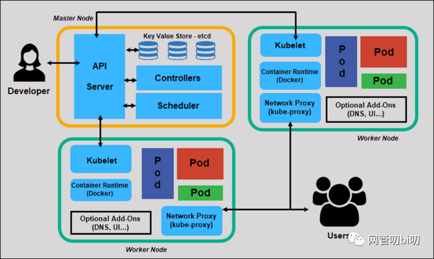
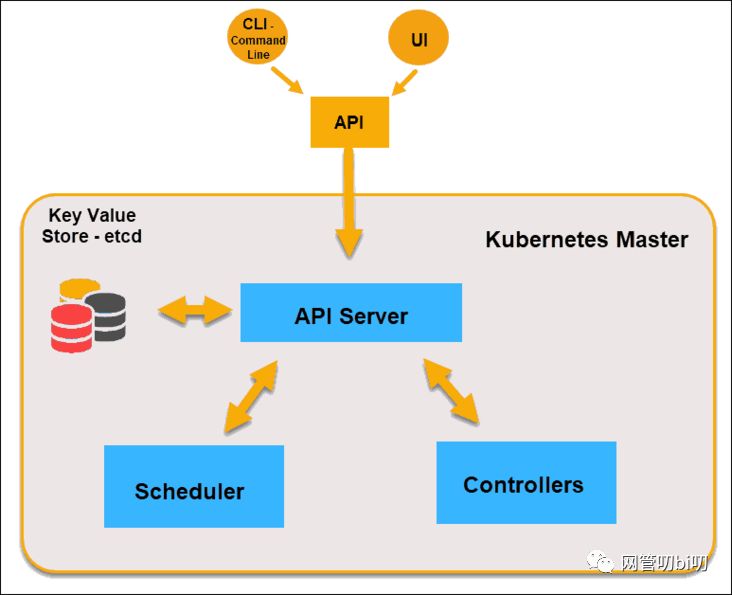
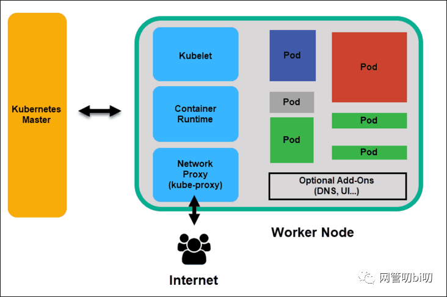
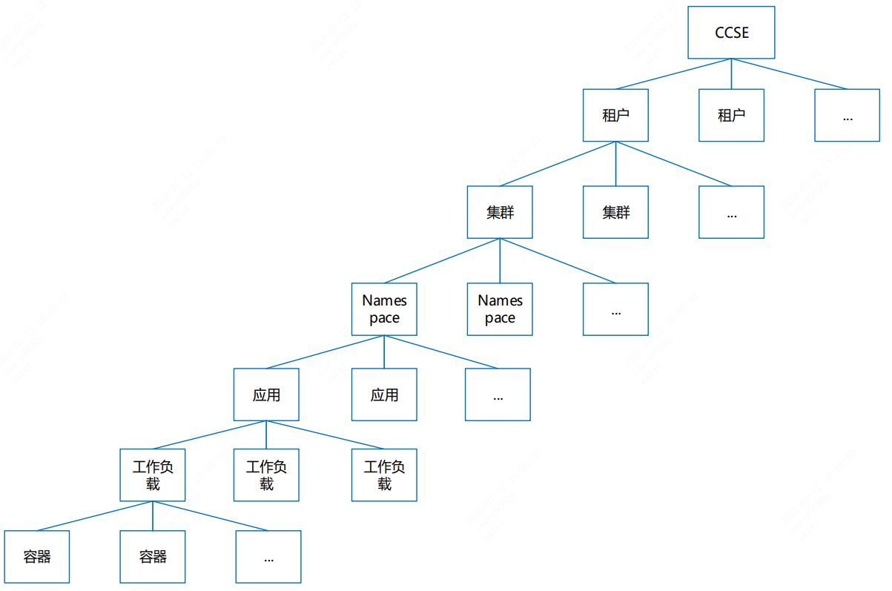
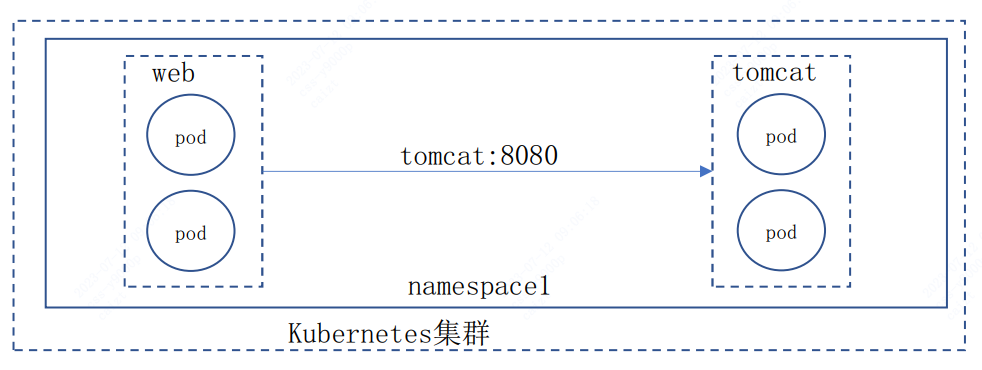
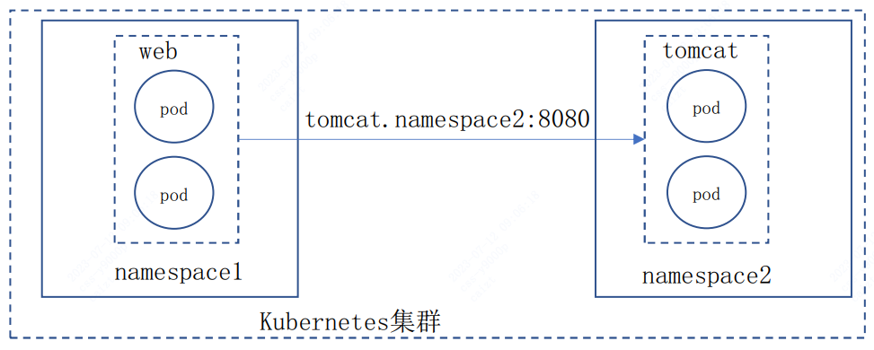
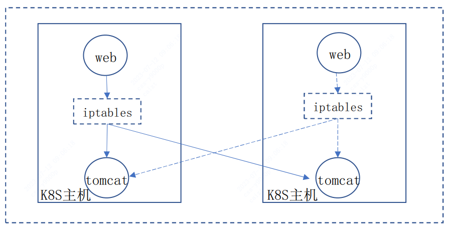
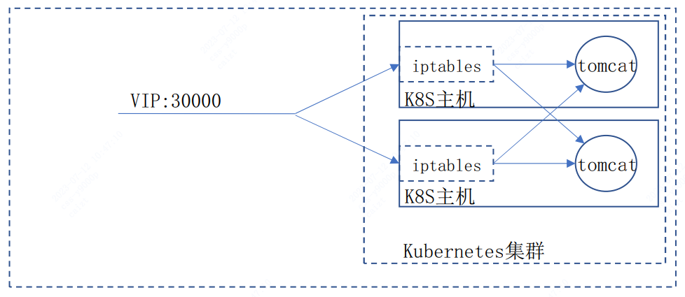
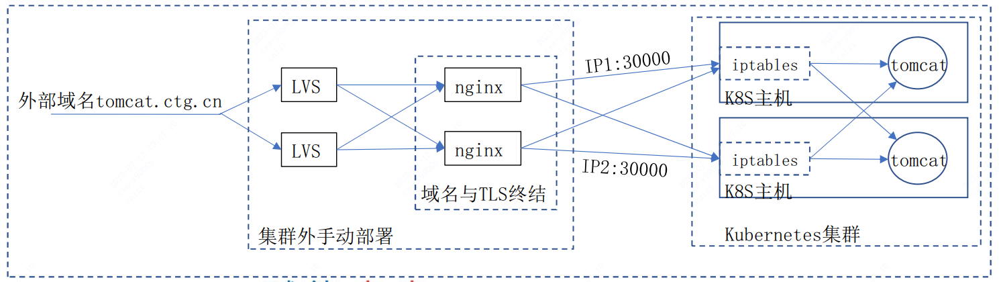

容器

# Docker

Docker是一个高效的轻量级容器化解决方案，可以让应用程序快速部署，安全运行，并且使其更容易跨环境迁移和管理。

Docker 可以为应用程序提供一个可复用的容器，从而可以在同一操作系统中和不同操作系统中部署应用，实现跨平台应用开发。它可以简化应用的部署，提高性能，确保应用程序的完整性和可靠性，降低运维成本。

优点：

1. 节约资源：通过分割物理机的硬件资源，将其抽象出来，在需要的时候为不同的容器提供资源，这样就能减小磁盘和内存的开销； 
2. 轻量级：Docker容器本身只有几百兆的大小，而且不需要安装宿主操作系统，能够极大地缩小应用程序启动时间； 
3. 灵活性：支持跨平台的部署，可以更灵活的部署应用程序和微服务； 
4. 弹性：可以更加简单的增加节点，并能够实现服务的弹性扩容和缩容； 
5. 安全性：根据容器隔离，可以避免恶意攻击，提高应用程序的安全性； 
6. 可重复性：可以在任何地方重复利用，从而大大减少了管理时间和成本； 
7. 可移植性：可以在开发环境和生产环境之间更加容易的移植。


## 原理

说起Docker，基本上就是指容器。容器被称为轻量级的虚拟化技术，实际上是不准确的。确切地说，容器是一种对进程进行隔离的运行环境。

> 本文提到的进程、Docker等概念或软件均以Linux平台为准。
>
> 我们知道进程是Linux操作系统执行任务的最小单元，一个时间同步服务是一个进程，一个Java服务是一个进程，一个Nginx服务是一个主进程+若干工作进程，总之，把一个系统比作一个办公室，进程就是一个个打工人：正常情况下，一个进程是能**感知到其他进程**的存在的，正如一个打工人放眼望去，办公室里还坐着一群其他打工人。进程的唯一标识是进程ID，用数字1、2、3……表示，好比打工人的工牌号，大家都各不一样。
>
> 而容器技术首先要解决的就是进程的**隔离**，即一个进程在运行的时候看不到其他进程。如何让一个打工人在工作时看不到其他打工人呢？方法是给这个打工人带一个VR眼镜，于是他看到的不是一个真实的办公室，而是一个虚拟的办公室。在这个虚拟办公室中，只有他一个打工人，没有别人。在Linux系统中，对一个进程进行隔离，主要是通过**Namespace**和**Cgroup**两大机制实现的。一个被隔离的进程，操作系统也会正常分配进程ID，比如12345，但是隔离进程自己看到的ID总是1，好比打工人的工牌是12345，但他自己通过VR眼镜看到的工牌号却是1，感觉自己是1号员工似的。
>
> 例如：制作一个Docker镜像，然后以Docker模式启动这个Python服务程序，再看看进程ID，从进程自己的视角看，它看到的进程ID总是`1`，并且，用`/ps`看不到其他进程，只能看到自己。再用`/ls`看一下磁盘，看到的也不是系统的根目录，而是Docker给挂载的一个虚拟的文件系统。但其实从操作系统看，这个Docker进程和其他进程一样，也有一个唯一的进程ID为`10475`。

一个容器进程本质上是一个运行在沙盒中的**隔离进程**，由Linux系统本身负责隔离，Docker只是提供了一系列工具，帮助我们设置好隔离环境后，启动这个进程。

1、最基本的隔离就是进程之间看不到彼此，这是由Linux的**Namespace**机制实现的。进程隔离的结果就是以隔离方式启动的进程看到的自身进程ID总是1，且看不到系统的其他进程。

2、第二种隔离就是隔离系统真实的文件系统。Docker利用Linux的**mount**机制，给每个隔离进程挂载了一个虚拟的文件系统，使得一个隔离进程只能访问这个虚拟的文件系统，无法看到系统真实的文件系统。至于这个虚拟的文件系统应该长什么样，这就是制作Docker镜像要考虑的问题。比如我们的Python程序要正常运行，需要一个Python3解释器，需要把用到的第三方库如`psutil`引入进来，这些复杂的工作被简化为一个`Dockerfile`，再由Docker把这些运行时的依赖打包，就形成了Docker镜像。我们可以把一个Docker镜像看作一个zip包，每启动一个进程，Docker都会自动解压zip包，把它变成一个虚拟的文件系统。

3、第三种隔离就是网络协议栈的隔离，这个最不容易理解。

我们举个例子：在Docker中运行`docker run redis:latest`，然后在宿主机上写个程序连接`127.0.0.1:6379`，是无法连接到Redis的，因为Redis虽然监听`127.0.0.1:6379`这个端口，但Linux可以为进程隔离网络，Docker默认启动的Redis进程拥有自己的网络名字空间，与宿主机不同：

```ascii
┌──────────────┐ ┌─────────────────────────┐
│redis:        │ │app:                     │
│  listen: 6379│ │  connect: 127.0.0.1:6379│
├──────────────┤ ├─────────────────────────┤
│127.0.0.1:6379│ │        127.0.0.1        │
└──────────────┘ └─────────────────────────┘
```

要让宿主机访问到Redis，可以用`-p 6379:6379`把Redis进程的端口号映射到宿主机，从而在宿主机上访问Redis：

```ascii
┌──────────────┐ ┌─────────────────────────┐
│redis:        │ │app:                     │
│  listen: 6379│ │  connect: 127.0.0.1:6379│
├──────────────┤ ├─────────────────────────┤
│127.0.0.1:6379│ │     127.0.0.1:6379      │
└──────────────┘ └─────────────────────────┘
            │                     ▲
            │                     │
            └─────────────────────┘
```

因此，在Linux的网络名字空间隔离下，Redis进程和宿主机进程看到的IP地址`127.0.0.1`表面上一样，但实际上是不同的网络接口。

我们再看一个更复杂的例子。如果我们要运行ZooKeeper和Kafka，先启动ZooKeeper：

```
docker run -p 2181:2181 zookeeper:latest
```

再启动Kafka，发现Kafka是无法连接ZooKeeper的，原因是，Kafka试图连接的`127.0.0.1:2181`在它自己的网络接口上并不存在：

```ascii
┌──────────────┐ ┌──────────────┐ ┌─────────────────────────────┐
│zookeeper:    │ │kafka:        │ │Host                         │
│  listen: 2181│ │  listen: 9092│ │                             │
├──────────────┤ ├──────────────┤ ├──────────────┬──────────────┤
│127.0.0.1:2181│ │127.0.0.1:9092│ │127.0.0.1:9092│127.0.0.1:2181│
└──────────────┘ └──────────────┘ └──────────────┴──────────────┘
            │                │                ▲              ▲
            │                └────────────────┘              │
            └────────────────────────────────────────────────┘
```

必须连接到ZooKeeper的`IP:2181`或者宿主机的`IP:2181`。直接指定IP并不是一个好的方式，我们应该利用Docker Compose，把ZooKeeper和Kafka运行在同一个网络名字空间里（例如上图，host可以是主机，或者某个容器），并通过`{hostname}:{端口号}`来访问ZooKeeper端口，让Docker自动把zookeeper名字解析为动态分配的IP地址。`docker-compose.yml`参考配置如下：

```yaml
version: "3"
services:
  zookeeper:
    image: confluentinc/cp-zookeeper:7.3.0
    hostname: zookeeper
    container_name: zookeeper
    environment:
      - ALLOW_ANONYMOUS_LOGIN=yes
      - ZOOKEEPER_CLIENT_PORT=2181  # 端口2181
      - ZOOKEEPER_TICK_TIME=2000

  kafka:
    image: confluentinc/cp-kafka:7.3.0
    container_name: kafka
    ports:
      - "9092:9092"  # 绑定容器的9092端口到主机的9092端口
    depends_on:
      - zookeeper
    environment:
      KAFKA_BROKER_ID: 1
      KAFKA_ZOOKEEPER_CONNECT: 'zookeeper:2181'  # zk连接使用'{hostname}:{端口号}'
      KAFKA_LISTENER_SECURITY_PROTOCOL_MAP: PLAINTEXT:PLAINTEXT,PLAINTEXT_INTERNAL:PLAINTEXT
      KAFKA_ADVERTISED_LISTENERS: PLAINTEXT://localhost:9092,PLAINTEXT_INTERNAL://kafka:29092
      KAFKA_OFFSETS_TOPIC_REPLICATION_FACTOR: 1
      KAFKA_TRANSACTION_STATE_LOG_MIN_ISR: 1
      KAFKA_TRANSACTION_STATE_LOG_REPLICATION_FACTOR: 1
```

## docker-compose

两种方式可以暴露容器的端口：ports和expose。

ports暴露容器端口到主机的任意端口或指定端口，不管是否指定主机端口，使用ports都会将端口暴露给主机。

```yaml
ports:
  - "80:80" # 绑定容器的80端口到主机的80端口
  - "9000:8080" # 绑定容器的8080端口到主机的9000端口
  - "443" # 绑定容器的443端口到主机的任意端口，容器启动时随机分配绑定的主机端口号
```

expose暴露容器给link到当前容器的容器，和ports的区别是，expose不会将端口暴露给主机。

```yaml
expose:
  - "3000"
  - "8000"  #将当前容器的端口3000和8000暴露给link到本容器的容器
```


## 虚拟机和容器比较

| 对比项     | 容器技术                        | 虚拟机技术                      |
| ---------- | ------------------------------- | ------------------------------- |
| 隔离级别   | 进程级                          | 操作系统级                      |
| 隔离策略   | Cgroups                         | Hypervisor                      |
| 系统资源   | 0~5%                            | 5~15%                           |
| 启动速度   | 秒级                            | 分钟级                          |
| 镜像存储   | KB-MB                           | GB-TB                           |
| 性能       | 接近宿主机本地进程              | 低于宿主机                      |
| 集群规模   | 一台宿主机可启动上千量级个容 器 | 一台宿主机只能运行几十 个虚拟机 |
| 高可用策略 | 弹性、负载、动态                | 备份、容灾、迁移                |


# Kubernetes

 K8s 的整体架构



| 概念                     | 描述                                                         |
| ------------------------ | ------------------------------------------------------------ |
| 集群                     | 一个集群指容器运行所需要的资源组合，关联了若干服务器节点、负载均衡、网络、存储等资源。 |
| 容器                     | 一个通过 Docker 镜像创建的运行实例，一个节点可运行多个容器。 |
| 镜像                     | 是容器应用打包的标准格式，在部署容器化应用时可以指定镜像，镜像可以来自于 Docker Hub或者用户的私有 Registry。 |
| 主节点 （Master Node）   | 是 Kubernetes 集群的**管理者**，运行着的服务包括 kube-apiserver、kube-scheduler、kube-controller-manager、etcd 和容器网络 等组件。一般3个管理节点组成 HA 的架构。 |
| 工作节点 （Worker Node） | 是 Kubernetes 集群中承担**工作负载**的节点，可以是虚拟机也可以是物理机。工作节点承担实际的 Pod 调度以及与管理节点的通信等。 一个工作节点上的服务包括 Docker 运行时环境、kubelet、Kube-Proxy 以及其它一些可选的 Addon 组件。 |
| 命名空间 （Namespace）   | 为 Kubernetes 集群提供虚拟的**隔离**作用。Kubernetes 集群初始有 3 个命名空间，分别是默认命名空间 default、系统命名空间 kube-system 和 kube-public ，除此以外，管理员可以创建新的命名空间以满足需求。 |
| Pod                      | 是 Kubernetes 部署应用或服务的最小的**基本单位**。一个 Pod 封装多个应用容器（也可以只有一个容器）、存储资源、一个独立的网络 IP 以及管理控制容器运行方式的策略选项。 |
| 服务（Service）          | 是真实应用服务的抽象，每一个服务后面都有很多对应的容器来提供支持，通过 Kube-Proxy 的 port 和服务 selector 决定服务请求传递给后端 的容器，对外表现为一个单一访问接口，外部不需要了解后端如何运行，这给扩展或维护后端带来很大的好处。 |
| 标签（labels）           | 实质是附着在资源对象上的一系列 Key/Value 键值对，用于指定对用户有意义的对象的属性，标签对内核系统是没有直接意义的。标 签可以在创建一个对象的时候直接赋予，也可以在后期随时修改，每一个对象可以拥有多个标签，但 key 值必须唯一。 |
| 存储卷（Volume）         | k8s 集群中的存储卷跟 Docker 的存储卷有些类似，只不过 Docker 的存储卷作用范围为一个容器，而 Kubernetes的存储卷的生命 周期和作用范围是一个 Pod。每个 Pod 中声明的存储卷由 Pod 中的所有容器共享。支持使用Persistent Volume Claim 即 PVC 这种逻辑 存储，使用者可以忽略后台的实际存储技术，具体关于 Persistent Volumn（pv）的配置由存储管理员来配置。 |
| 持久存储卷               | （Persistent Volume， PV）和持久存储卷声 明（Persistent Volume Claim，PVC） PV 和 PVC 使得 Kubernetes集群具备了存储的逻辑抽象能力，使得在配置 Pod 的逻辑里可以忽略对实际后台存储技术的配置，而把这项配 置的工作交给 PV 的配置者。存储的 PV 和 PVC 的这种关系，跟计算的 Node 和 Pod 的关系是非常类似的；PV 和Node 是资源的提供者， 根据集群的基础设施变化而变化，由 Kubernetes 集群管理员配置；而 PVC 和 Pod是资源的使用者，根据业务服务的需求变化而变化，由 Kubernetes 集群的使用者即服务的管理员来配置。 |
| Ingress                  | 授权入站连接到达集群服务的规则集合。你可以通过 Ingress 配置提供外部可访问的 URL、负载均衡、SSL、基于名称的虚拟主机 等。用户通过 POST Ingress 资源到 API server 的方式来请求 Ingress。 Ingress controller 责实现 Ingress，通常使用负载均衡器，它还 可以配置边界路由和其他前端，这有助于以 HA 方式处理流量。 |
| 镜像仓库（Registry）     | Docker 的镜像存储中心通常被称为 Registry。需要获取私有镜像时，首先需要登录 Registry，然后拉取镜像。修改过镜像后，可以再次将 镜像推送回 Registry 中去。或者通过本地构建Docker镜像再推送到Registry 中。 |
| Deployment               | 部署表示用户对 Kubernetes 集群的一次更新操作。可以是创建一个新的服务，更新一个新的服务，也可以是滚动升级一个服务。 Deployment 为 Pod 和 ReplicaSet 提供了一个声明式定义 (declarative) 方法，用来替代以前的ReplicationController 更方便的管理工作 负载。 |


## 主节点



Master主要包含 `API Server`、`Scheduler`、`Controllers` 三个组成部分， 以及用作存储的 `etcd`，它用来储存整个集群的状态。

- etcd：由CoreOS开发，是一个高可用、强一致性的键值存储，为Kubernetes集群提供储存服务，类似于zookeper。它会存储集群的整个配置和状态。主节点通过查询 etcd 以检查节点，容器的现状。
- API Server：kubernetes最重要的核心元件之一，提供资源操作的唯一入口（其他模块通过API Server查询或修改资源对象，只有API Server才能直接操作etcd），并提供认证、授权、访问控制、API注册和发现等机制。
- Scheduler：负责资源的调度，按照预定的调度策略将 Pod（k8s中调度的基本单位）调度到相应的Node上，这里说的 Node 就是Work Node，当然如果是只有一个节点的集群，Master 也会同时作为 Work Node。
- Controllers：通过 API Server 查询要控制的资源对象的预期状态，它检查其管控的对象的当前状态，确保它们始终处于预期的工作状态，它们的工作包括比如故障检测、自动扩充、减少、滚动更新等。控制器主要有Deployment、StatuefulSet、Service、DaemonSet、Ingress

## 工作节点



可以是物理机也可以是虚拟机器。Node 上运行的主要 K8s 组件有kubelet、kube-proxy、Container Runtime 、Pod 等。

### kubelet

K8s 集群的每个工作节点上都会运行一个 kubelet 程序 维护容器的生命周期，它接收并执行Master 节点发来的指令，管理节点上的 Pod 及 Pod 中的容器。同时也负责Volume（CVI）和网络（CNI）的管理。

每个 kubelet 程序会在 API Server 上注册节点自身的信息，定期向Master节点汇报自身节点的资源使用情况，并通过cAdvisor监控节点和容器的资源。

通过运行 kubelet，节点将自身的 CPU，RAM 和存储等计算机资源变成集群的一部分，相当于是放进了集群统一的资源管理池中，交由 Master 统一调配。

### Container Runtime

容器运行时负责与容器实现进行通信，完成像容器镜像库中拉取镜像，然后启动和停止容器等操作， 引入容器运行时另外一个原因是让 K8s 的架构与具体的某一个容器实现解耦，不光是 Docker 能运行在 K8s 之上，同样也让K8s 的发展按自己的节奏进行。

想要运行在我的生态里的容器，请实现我的CRI （Container Runtime Interface），Container Runtime 只负责调用CRI 里定义的方法完成容器管理，不单独执行 docker run 之类的操作。这个也是K8s 发现Docker 制约了它的发展在 1.5 后引入的。

### kube-proxy

为集群提供内部的服务发现和负载均衡，监听 API Server 中 Service 控制器和它后面挂的 endpoint 的变化情况，并通过 iptables 等方式来为 Service 的虚拟IP、访问规则、负载均衡。

### Pod

Pod 是 K8s 中的最小调度单元。我们的应用程序运行在容器里，而容器又被分装在 Pod 里。一个 Pod 里可以有多个容器，也可以有多个容器。没有统一的标准，是单个还是多个，看要运行的应用程序的性质。不过一个 Pod 里只有一个主容器，剩下的都是辅助主容器工作的。

比如做服务网格 Istio 的 Envoy 网关，就是放在Pod的辅助容器运行来实现流量控制的。 **这就是 K8s 的容器设计模式里最常用的一种模式：sidecar。顾名思义，sidecar 指的就是我们可以在一个Pod中，启动一个辅助容器，来完成一些独立于主进程（主容器）之外的工作。**


## Q：有了Docker为啥还需要k8s？

Docker是一个容器编排工具，可以帮助我们管理应用程序。但如果想要管理大量的容器，就需要更为强大的编排工具，而 K8s 就是这样一个工具。

相比于Docker，K8S有以下优势：

1. 高可用性：可以设置Pod的副本数，保证服务的良好运行。 
2. 自动伸缩：可根据实际情况自动伸缩，自动添加或减少节点；可以有效地根据负载情况调整Pod实例数。 
3. 容易管理：提供了一个完整的系统来管理Docker容器，可以使DevOps开发更加高效。 
4. 安全性：可以提供完善的安全性，包括限制访问，配置安全策略等。 
5. 更好的传输：使用Service和Ingress提供了一个容器化的感知和管理层来实现对网络的透明性。

## 逻辑关系



- CCSE与租户一对多
- 租户与集群一对多
- 集群和命名空间一对多
- 命名空间与应用一对多
- 应用与工作负载一对多
- 工作负载与容器实例一对多

> 应用不是必须的，单个namespace需要部署多个应用时通过应用进行逻辑隔离  

权限控制：

- 租户创建者拥有租户的最高权限
- 租户创建者按组件角色给成员授权
- 成员数据权限可细化到命名空间级别

资源隔离：

- 多个租户的数据相互隔离，互不干扰
- 多个应用通过namespace隔离 

## 工作负载

### 故障迁移

工作负载A设定的实例（Pod）数为四个，分布在不同的主机上。某一时刻某台主机（包含两个Pod）突然挂掉，系统自动在其他健康的节点上生成两个新实例，故障迁移保证了工作负载的实例数永远与设置的一样，保证了工作负载的高可用

### 弹性伸缩

垂直伸缩与水平伸缩：

- 垂直(Vertical)伸缩：调整节点或服务的资源配额。
- 水平(Horizontal)伸缩：调整节点或服务的数量。

CCSE支持Pod**自动水平伸缩**，监测的指标包括**CPU使用率**和**内存使用率**。如CPU使用率超80%时，自动扩容到5个Pod，低于80%时缩容到3个。

扩缩容性能为**秒级**。

**局限**：水平伸缩只适用于无状态服务，具有状态的服务（如MySQL具有数据状态）不适合制作容器镜像。

## 路由-Service  

Service是一个抽象概念，定义了多个Pod的逻辑合集和访问Pod的策略。Service 有自己的 IP 和端口，Service 为 Pod 提供了负载均衡能力。

- 网络代理模式：iptables
- 工作负载需要对外开放访问端口时，可以创建一个或多个Service
- 访问方式：支持NodePort 和 ClusterIP，支持Headless Service
- 支持四层负载的TCP/UDP协议
- 集群部署时设定NodePort端口范围， NodePort端口在集群中唯一  

使用：

- 创建工作负载时可同时创建Service，也可以单独创建Service
- 删除工作负载时同时删除工作负载相关的Service
- 容器端口和服务端口建议设置成一样  

## 负载均衡

Kubernetes内置服务注册、服务发现与负载均衡插件。一个工作负载会暴露两个访问地址：

- 内部访问：服务名 + 容器端口
- 外部访问：主机ip + 主机端口

**Nginx-ingress** 是 K8s 集群默认的负载均衡器，主要负责向外暴露服务，同时提供负载均衡等附加功能；支持 七层（HTTP）/四层（TCP/UDP）的代理功能。  

- K8S集群部署时会默认部署一个Nginx-ingress到kubesystem命名空间，作为集群默认的负载均衡器
- 支持在一个集群的多个命名空间部署多个Nginx-ingress，支持为命名空间指定Nginx-ingress
- 部署Nginx-ingress时指定对外开放的端口范围
- 应用创建的ingress对象存放在应用所属命名空间指定的Nginx-ingress的命名空间中  

### 集群内访问

集群内应用的相互访问采用固定域名（应用名）的方式

- 如果两个应用在同一个命名空间，则直接使用“应用名:容器端口”；

  

- 如果两个应用跨了命名空间，则使用“应用名.命名空间:容器端口”

  

当nginx容器访问tomcat应用时，是由nginx容器所在主机的iptables做负载均衡，主机的iptables由k8s的组件kube-proxy动态更新



### 集群外访问

- 应用的访问量小且不需要做HTTPS
  这种情况下，可以直接使用VIP加NodePort的形式。为应用创建一个NodePort类型的Service，这样每台K8S主机上都会暴露一个主机端口（比如30000），通过主机IP加这个主机端口就可以转发到后端的Pod。K8S的Master主机上已经安装了Keepalived，VIP保证了高可用。

  

- 应用的访问量大或者需要配置HTTPS
  在K8S集群外的主机上搭建一套LVS加Nginx，在Nginx上为每个应用配置SSL证书，Nginx转发到若干台K8S主机的NodePort上。

  