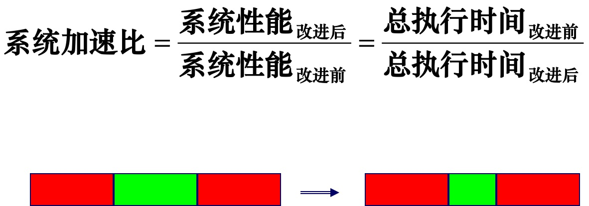
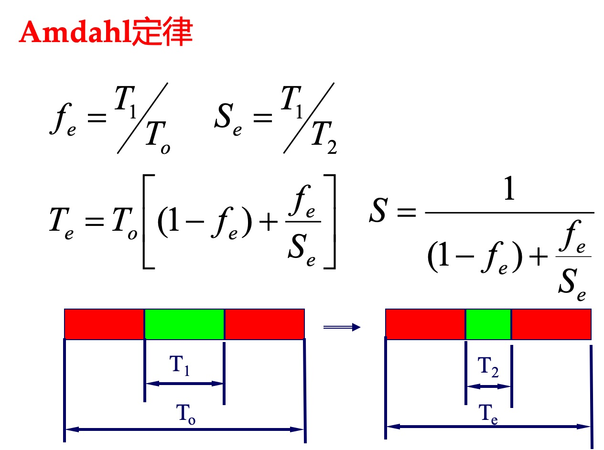

操作系统

# 进程和线程区别？

|          | 进程                                 | 线程                                                         |
| -------- | ------------------------------------ | ------------------------------------------------------------ |
| 概念     | 运行时的程序                         | 是进程的子任务                                               |
| 从属关系 | 一个进程可以有多个线程               | 一个线程只属于一个进程                                       |
| 调度粒度 | 是操作系统调度的最小单位             | 是CPU调度的最小单位                                          |
| 内存     | 有独立内存单元，进程之间互不影响     | 多个线程共享所在进程的内存，线程也有自己的内存空间           |
| 切换开销 | 大                                   | 小                                                           |
| 通信     | 共享内存、管道、信号量、套接字socket | 1. 共享内存（临界区）; 2. 事件（信号），如java的wait() notify()；3. 互斥量，如Synchronized、Lock |

# 父进程和子进程的关系

fork()会产生一个和父进程完全相同的子进程，但子进程在此后多会exec系统调用，出于效率考虑，Linux中引入了写时复制（COW）技术，也就是只有进程空间的各段的内容要发生变化时，才会将父进程的内容复制一份给子进程。在fork之后exec之前两个进程用的是相同的物理空间（内存区），子进程的代码段、数据段、堆栈都是指向父进程的物理空间，也就是说，两者的虚拟空间不同，但其对应的物理空间是同一个。当父子进程中有更改相应段的行为发生时，再为子进程相应的段分配物理空间，如果不是因为exec，内核会给子进程的数据段、堆栈段分配相应的物理空间（至此两者有各自的进程空间，互不影响），而代码段继续共享父进程的物理空间（两者的代码完全相同）。而如果是因为exec，由于两者执行的代码不同，子进程的代码段也会分配单独的物理空间。

# IO多路复用

> I/O multiplexing，翻译成IO多路复用有歧义，其实并不是多路IO复用一个物理链路，而是：**单个线程，通过记录跟踪每个I/O流(sock)的状态，来同时管理多个I/O流 。**

select, poll, 和 epoll 都是 Linux 中常见的 I/O 多路复用技术，它们可以用于同时监听多个**文件描述符**（file descriptor，后文简称fd），当任意一个文件描述符就绪时，就能够非阻塞的读写数据。

- select 是最原始的 I/O 多路复用技术，它的缺点是最多只能监听 1024 个文件描述符。
- poll在 select 的基础上，取消了监听文件描述符个数的限制，但是复杂度增加，并且线程不安全。
- epoll 在 poll 的基础上进一步优化了复杂度，并且线程安全。

## 比较

|                          | select | poll   | epoll  |
| ------------------------ | ------ | ------ | ------ |
| fd长度（个数）           | 1024   | 无限制 | 无限制 |
| 遍历所有fd               | 是     | 是     | 否     |
| 把fd从用户态copy到内核态 | 是     | 是     | 否     |

# Swap交换分区

Linux中的一个区域，类似于Windows的虚拟内存，当内存不足时，把一部分硬盘空间虚拟成内存，解决内存容量不足的问题。

合理取值一般是内存的2倍

# 程序编译

- 程序功能的实现通常可以分为两个阶段：

- 静态处理阶段（static），在程序本身开始执行前的处理。通常包括：

- - 翻译阶段（编译）：对源程序做各种检查（语法检查，类型检查等）和变换，将其转变为某种适宜动态执行的形式
  - 连接阶段（可能）：构造出可动态运行的程序形式
  - 装载阶段（可能）：把可运行程序装入运行环境，必要的处理

- 动态执行阶段（run-time），指程序的实际运行期间

- 例：若变量x 的（绝对或相对）位置可静态确定，运行中就可以直接访问。若不能静态确定，运行中每次访问都要查表，效率就比较低

- 语言的“编译实现”：在静态阶段完成尽可能多的处理工作，对源程序做深入的分析和变换，生成的目标形式通常与源程序差异巨大

# Amdahl定律

加快某部件执行速度所获得的系统性能加速比，受限于该部件在系统中所占的比例。

Amdahl定律既可以用来确定系统中对性能限制最大的部件，也可以用来计算通过改进某些部件所获得的系统性能的提高。

- Amdahl定律：加快某部件执行速度所获得的系统性能加速比，受限于该部件在系统中所占的比例。
- Amdahl定律既可以用来确定系统中对性能限制最大的部件，也可以用来计算通过改进某些部件所获得的系统性能的提高。

