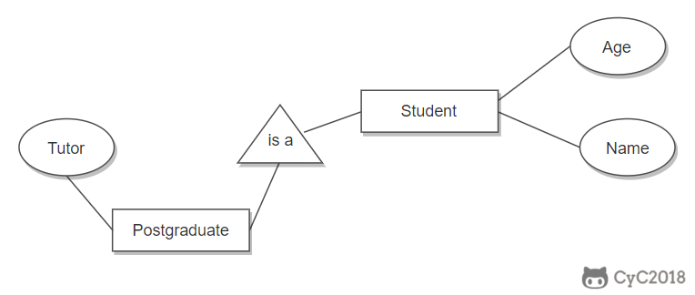
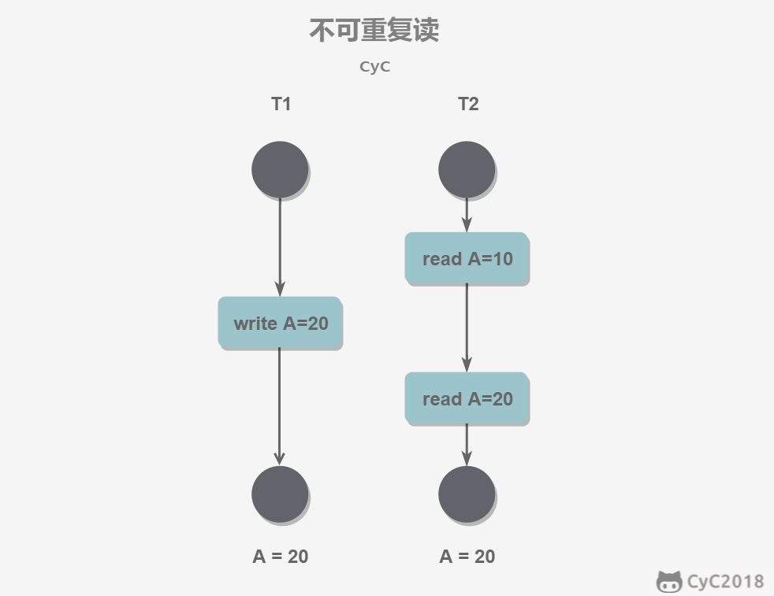

# 关系数据库理论

## 键

超键：能唯一标识元组的属性集，包含候选键和主键。可以是一个或多个属性

候选键：**最小**超键，即没有冗余元素的超键

主键：数据库表 中每行数据的**唯一标识**，每行有且只有唯一主键。可以是一个或多个属性，不能为空NULL

外键：一个表中存在的另一个表的主键，与其他表建立约束，可以为NULL

## 三大范式

第一范式（1NF）：属性不可分。
第二范式（2NF）：在第一范式的基础上，一个表必须有一个主键，非主键列 **完全依赖** 于主键，而不能是依赖于主键的一部分。
第三范式（3NF）：在第二范式的基础上，非主键列只依赖（直接依赖）于主键，不依赖于其他非主键。

## ER图

Entity-Relationship，有三个组成部分：实体、属性、联系。

用来进行关系型数据库系统的概念设计。

###  实体的三种联系

包含一对一，一对多，多对多三种。

- 如果 A 到 B 是一对多关系，那么画个带箭头的线段指向 B；
- 如果是一对一，画两个带箭头的线段；
- 如果是多对多，画两个不带箭头的线段。

下图的 Course 和 Student 是一对多的关系。


### 表示出现多次的关系

一个实体在联系出现几次，就要用几条线连接。

下图表示一个课程的先修关系，先修关系出现两个 Course 实体，第一个是先修课程，后一个是后修课程，因此需要用两条线来表示这种关系。


### 联系的多向性

虽然老师可以开设多门课，并且可以教授多名学生，但是对于特定的学生和课程，只有一个老师教授，这就构成了一个三元联系。


### 表示子类

用一个三角形和两条线来连接类和子类，与子类有关的属性和联系都连到子类上，而与父类和子类都有关的连到父类上。



# 触发器

触发器（trigger）是与表相关的数据库对象，是用户定义在关系表上的一类由**事件驱动**的特殊的存储过程，在满足定义条件时触发，并执行触发器中定义的 语句集合。触发器的这种特性可以协助应用在数据库端确保 数据库的完整性。

使用场景

- 可以通过数据库中的相关表实现 **级联更改**；

- 实时监控某张表中的某个字段的更改，并需要做出相应的处理。

# 事务

作为一个整体，要么都执行，要么都不

作用：保持数据一致性、可恢复性

## ACID原则

- A原子性：事务是最小的执行单位，不可分割。

- C一致性：数据库在事务执行前后都保持一致性状态。在一致性状态下，所有事务对同一个数据的读取结果都是相同的。

- I隔离性：一个事务所做的修改在提交前，对其它事务是不可见。

- D持久性：一旦事务提交，则其所做的修改永远保存到数据库中。即使系统崩溃，事务执行的结果也不能丢失。

  

事务的 ACID 特性概念简单，但不是很好理解，主要是因为这几个特性不是一种**平级关系**：

- 只有满足一致性，事务的执行结果才是正确的。
- 在无并发的情况下，事务串行执行，隔离性一定能够满足。此时只要能满足原子性，就一定能满足一致性。
- 在并发的情况下，多个事务并行执行，事务不仅要满足原子性，还需要满足隔离性，才能满足一致性。
- 事务满足持久化是为了能应对系统崩溃的情况。

### 如何实现ACID特性

- 原子性：由**undo log**日志保证，它记录了需要回滚的日志信息，事务回滚时撤销已经执行成功的sql
- 一致性：一般由**代码层面**来保证
- 持久性：由**内存+redo log**来保证，mysql修改数据同时在内存和redo log记录这次操作，事务提交的时候通过redo log刷盘，宕机的时候可以从redo log恢复
- 隔离性：由**MVCC**来保证


### AUTOCOMMIT

MySQL 默认采用自动提交模式。也就是说，如果不显式使用`START TRANSACTION`语句来开始一个事务，那么每个查询操作都会被当做一个事务并自动提交。

## 事务并发问题

### 脏读

（Dirty Read）事务a读取了事务b**未提交**的数据。

### 不可重复读

（Non-repeatable Read）同一事务内，多次读同一数据结果不一样（因为在此过程中有其他事务对数据进行了修改）。例如事务T2读A，T1修改了A，T2再读A和上一次读到的不同



### 幻读

（Phantom Read）本质也是不可重复读。区别在于不是某条，而是某个范围

例如有事务a对表中的数据进行了修改，这种修改涉及到表中的全部数据行，同时另一个事务b也向表中 插入一行。那么，事务a的用户会发现表中**还有一行**数据没有修改，就好像发生了幻觉一样。

### 丢失更新

（Lost Update）两个事务同时写同一条记录。事务 A 先写，事务 B 后写（B 不知道 A 写），当 B 提交数据后， 其写结果覆盖了 A 的写结果，导致事务 A 更新丢失。


## 隔离级别

表示并发事务对同一资源读取的隔离程度，**由低到高**依次是：

### 未提交读（READ UNCOMMITTED）

事务中的修改，即使没有提交，对其它事务也是可见的。

- 实现：无需特殊控制，不加锁即可。


### 提交读（READ COMMITTED）

**Oracle 默认**的隔离级别。一个事务只能读取已经提交的事务所做的修改。换句话说，一个事务所做的修改在提交之前对其它事务是不可见的

- 实现：MVCC，**每次读取**数据前都生成一个 ReadView，即事务的每条sql都创建一个快照

 

### 可重复读（REPEATABLE READ）

**MySQL 默认**的隔离级别。保证在同一个事务中多次读取同一数据的结果是一样的，也就是说，其他事务的更新在这个事务中不可见。

- 实现：MVCC，**第一次读取**数据前生成一个 ReadView，即只在事务开始时创建一个快照

 

### 可串行化（SERIALIZABLE）

强制事务串行执行，这样多个事务互不干扰，完全不会出现并发一致性问题。

- 实现：**加锁**，保证同一时间只有一个事务执行，也就是保证事务串行执行。

 

### Q：各种级别能否解决一致性问题？


| 隔离级别              | 脏读 | 不可重复读 | 幻读 | 丢失更新 |
| --------------------- | ---- | ---------- | ---- | -------- |
| 未提交读              | 否   | 否         | 否   | 否       |
| 提交读                | 能   | 否         | 否   | 否       |
| 可重复读（mysql默认） | 能   | 能         | 否   | 能       |
| 可串行化              | 能   | 能         | 能   | 能       |


# 锁

## 锁粒度

MySQL 中只有两种：**行级锁**、**表级锁**

加锁需要资源，锁操作增加系统开销。应该尽量只锁定需要修改的那部分数据，锁定的数据量越少，系统的并发程度就越高。

选择封锁粒度时，需要在锁开销和并发程度之间做权衡


## 锁类型

### 读写锁

- 互斥锁（Exclusive），简写为 X 锁，又称写锁。
- 共享锁（Shared），简写为 S 锁，又称读锁。

限制：

1.  事务对数据A加了X锁，就能**读和写**A，加锁期间其他事务不能对A加**任何锁**
2.  事务对A加了S锁，**可以读但不能写**A，加锁期间其他事务还能对A加S锁，但不能加X锁

兼容关系：

|      |  X   |  S   |
| :--: | :--: | :--: |
|  X   | 不能 | 不能 |
|  S   | 不能 |  能  |


### 意向锁

使用意向锁（Intention Locks）更容易地支持多粒度封锁。

背景：在存在行级锁和表级锁的情况下，事务 T 想要对表 A 加 X 锁，就需要先检测是否有其它事务对表 A 或者表 A 中的任意一行加了锁，那么就需要对表 A 的每一行都检测一次，非常耗时。

意向锁在原来的 X/S 锁之上引入了 IX/IS， 都是**表锁**，用来表示一个事务想要在表中的某个数据行上加 X 锁或 S 锁。遵守两个规定：

- 一个事务在获得某个数据行对象的 S 锁之前，必须先获得表的 IS 锁或者更强的锁；
- 一个事务在获得某个数据行对象的 X 锁之前，必须先获得表的 IX 锁。

通过引入意向锁，事务 T 想要对表 A 加 X 锁，只需要先检测是否有其它事务对表 A 加了 X/IX/S/IS 锁，如果加了就表示有其它事务正在使用整个表或者表中某一行的锁（不用遍历每行），因此事务 T 加 X 锁失败。

兼容关系：

|      |  X   |  IX  |  S   |  IS  |
| :--: | :--: | :--: | :--: | :--: |
|  X   |  ×   |  ×   |  ×   |  ×   |
|  IX  |  ×   |      |  ×   |      |
|  S   |  ×   |  ×   |      |      |
|  IS  |  ×   |      |      |      |

- 任意 IS/IX 锁之间都是兼容的，因为它们只表示想要对表加锁，而不是真正加锁；
- X锁与所有锁不兼容
- 这里兼容关系针对的是**表级锁**，而表级的 IX 锁和行级的 X 锁兼容


从读写角度又可分为悲观锁和乐观锁：

### 悲观锁

使用DB锁机制，读/写完就锁，直到提交事务。长事务来说可能导致系统性能差

### 乐观锁

假设不会并发冲突，只在提交时检查。实现：版本号机制或CAS算法

## 封锁协议

### 1.三级封锁协议

其实就是制定加锁规则来控制并发

|              | 一级封锁协议                                                 | 二级封锁协议                                                 | 三级封锁协议                                                 |
| ------------ | ------------------------------------------------------------ | ------------------------------------------------------------ | ------------------------------------------------------------ |
|              | 事务 T 要修改数据 A 时必须加 X 锁，直到 T 结束才释放锁。     | 在一级的基础上，要求读取数据 A 时必须加 S 锁，读取完**马上**释放 S 锁。 | 在二级的基础上，要求读取数据 A 时必须加 S 锁，直到**事务结束**了才能释放 S 锁。 |
| 解决并发问题 | 解决丢失修改                                                 | 解决读脏数据                                                 | 解决不可重复读                                               |
| 解释         | 因为不能同时有两个事务对同一个数据进行修改，那么事务的修改就不会被覆盖。 | 因为如果事务T1在对数据 A 进行修改，根据 1 级封锁协议，会加 X 锁，那么另一个事务T2就不能再加 S 锁了，也就是不会读入数据。 | 因为读 A 时，其它事务不能对 A 加 X 锁，从而避免了在读的期间数据发生改变。 |


### 2.两段锁协议

加锁和解锁分为两个阶段进行。也就是说，事务的**行锁是在需要的时候才加上，但并不会立即释放，而是等到事务结束才全部释放**

事务遵循两段锁协议是保证可串行化调度的**充分不必要**条件。

> 可串行化调度：通过并发控制，使得并发执行的事务结果与某个串行执行的事务结果相同。串行执行的事务互不干扰，不会出现并发一致性问题。

例如以下操作满足两段锁协议，它是可串行化调度。

```html
lock-x(A)...lock-s(B)...lock-s(C)...unlock(A)...unlock(C)...unlock(B)
```

以下操作不满足两段锁协议，但它还是可串行化调度

```html
lock-x(A)...unlock(A)...lock-s(B)...unlock(B)...lock-s(C)...unlock(C)
```

## MySQL 隐式与显式锁定

MySQL 的存储引擎 **InnoDB 采用两段锁协议**，会根据隔离级别在需要的时候自动加锁，并且所有的锁都是在同一时刻被释放，这被称为**隐式锁定**。

InnoDB 也可以使用特定的语句进行**显式锁定**：

```sql
# ?为查询条件
SELECT * FROM table WHERE ? lock in share mode;
SELECT * FROM table WHERE ? for update;
```


# 多版本并发控制（MVCC）

是 MySQL 的 存储引擎 **InnoDB**实现隔离级别的一种**具体方式**，用于实现提交读和可重复读

## 基本思想

读写锁中读和写操作仍然是互斥的，而 MVCC 利用了多版本的思想，写操作更新最新的版本快照，而读操作去读旧版本快照，没有互斥关系（类似CopyOnWrite）

## 版本号

-  TRX_ID：每个事务的唯一id，在事务开始时向 InnoDB 的事务系统申请的，**严格递增**

## Undo 日志链

MVCC 的多版本指的是多个版本的**快照**，存储在 **Undo 日志链**中，该日志通过回滚指针**ROLL_PTR** 把一个数据行的所有快照连接起来。

```sql
# 例如在 MySQL 创建一个表 t，包含主键 id 和一个字段 x。我们先插入一个数据行，然后对该数据行执行两次更新操作。
INSERT INTO t(id, x) VALUES(1, "a");
UPDATE t SET x="b" WHERE id=1;
UPDATE t SET x="c" WHERE id=1;
```

根据 MySQL 的 AUTOCOMMIT 机制，每个操作都会被当成一个事务来执行，所以上面的操作总共涉及到三个事务。


快照中除了记录事务版本号 TRX_ID 和操作之外，还记录了一个 bit 的 DEL 字段，用于标记是否被删除。

INSERT、UPDATE、DELETE 操作会创建一个快照，并将事务版本号 TRX_ID 写入。DELETE 可以看成是一个特殊的 UPDATE，还会额外将 DEL 字段设置为 1。

## ReadView

InnoDB为**每行数据**维护了一个 ReadView 的undo日志链结构（图中右侧）。

同时为**每个事务**维护了一个**未提交的事务id列表** TRX_IDs 和 **两个指针**：TRX_ID_MIN（数组头，表示最早的未提交事务） 和 TRX_ID_MAX（数组尾，表示最晚的未提交事务）。


当前事务在进行 **SELECT** 操作时，对选中的每个ReadView ，从当前版本开始（**链头**，假设为TRX_ID），比较 TRX_ID 与 TRX_ID_MIN 和 TRX_ID_MAX 之间的关系，判断当前事务是否可以使用该数据行快照：

- TRX_ID < TRX_ID_MIN：表示该版本是已提交事务或当前事务自己生成（在当前所有未提交事务之前进行更改的），因此当前事务可以使用这个版本。

- TRX_ID > TRX_ID_MAX：表示该版本是在某些事务启动之后被更改的，而这些事务还没提交，因此当前事务不可使用。

- `TRX_ID_MIN <= TRX_ID <= TRX_ID_MAX`：需要根据**隔离级别**再进行判断：
  
  - 提交读：如果 TRX_ID 在 **TRX_IDs 列表** 中，则该快照不可使用（因为该数据行快照对应的事务还未提交）。否则可以使用（说明快照已经提交）。
  
    > 注意：TRX_ID落在`[TRX_ID_MIN,TRX_ID_MAX]`区间，并不意味着TRX_ID一定存在于TRX_IDs列表。例如数组=[1,2,3,5]，4在`[1,5]`区间，却不在这个数组中。
  
  - 可重复读：都不可以使用。
  
    > 根据可重复读的规定：“我只读我之前提交的”
    >
    > 因为如果可以使用的话，那么其它事务也可以读到这个数据行快照并进行修改，那么当前事务再去读这个数据行得到的值就会发生改变，也就是出现了不可重复读问题。

在数据行快照不可使用的情况下，需要沿着 Undo Log 的回滚指针 ROLL_PTR 找到前一个快照（TRX_ID更小的），再进行上面的判断。如果所有快照都不可见，则该数据行对当前事务不可见，查询结果不包含该行。

[参考例子：https://time.geekbang.org/column/article/70562 图4](https://time.geekbang.org/column/article/70562)

## 快照读与当前读

### 1. 快照读

MVCC 的 SELECT 操作是快照中的数据，不需要进行加锁操作。

```sql
SELECT * FROM table ...;
```

### 2. 当前读

隐式锁定：MVCC 其它对数据库修改的操作（INSERT、UPDATE、DELETE）需要进行加锁操作，从而读取最新的数据。

> 可以看到 MVCC 并不是完全不用加锁，而只是避免了 SELECT 的加锁操作。

显式锁定：在进行 SELECT 操作时，也可以强制指定进行加锁操作。数据库对以下第一个语句选中的行加 S 锁，第二个加 X 锁。

```sql
# ?为查询条件
SELECT * FROM table WHERE ? lock in share mode;
SELECT * FROM table WHERE ? for update;
```

# Next-Key Locks

Next-Key Locks 是 MySQL 的 InnoDB 存储引擎的一种锁实现。

> MVCC 不能解决幻读问题
>
> **即使把所有现存的记录都加上锁，还是阻止不了新插入的记录，**这也是为什么“幻读”会被单独拿出来解决的原因。
>
> 因此需要引入Next-Key Locks 解决。

在可重复读级别下，使用**MVCC + Next-Key Locks**可以解决幻读问题。

## Record Locks

行锁。注意【锁某行】只是一种简称，本质上**锁定的是某行数据的索引**，而不是这行数据本身。

行锁与行锁之间**互斥**。

如果表没有设置索引，InnoDB 会自动在主键上创建隐藏的聚簇索引，因此 Record Locks 依然可以使用。

例如：精确匹配时，锁某行

```sql
SELECT c FROM t WHERE c=10 FOR UPDATE;
```


## Gap Locks

间隙锁。执行范围查询时，若没有命中任何索引，则锁定索引之间的**间隙**，是一个开区间，不包含索引本身。

间隙锁与间隙锁之间**不互斥**。间隙锁冲突的只是**【往间隙中插入记录】**这个操作。

例如当一个事务执行以下语句，就锁定`(11,20)`，其它事务就不能在 t.c 中插入 15。

```sql
SELECT c FROM t WHERE c BETWEEN 10 and 20 FOR UPDATE;
```

这个例子中，事务B不会不会被事务A阻塞，因为他们都加的是间隙锁(5,10)（具体见[加锁规则](###加锁规则)）


## Next-Key Locks

Record Locks + Gap Locks 的结合，不仅锁定一个记录上的索引，也锁定索引之间的间隙。

注意是**先加间隙锁**，再加行锁。

它锁定一个**前开后闭**区间。

例如一个索引包含以下6个值：0、5、10、15 、20、25，那么索引就划分为以下7个区间，即Next-Key Locks分为如下七个区间：

```sql
(-∞, 0]
(0, 5]
(5, 10]
(10, 15]
(15, 20]
(20, 25]
(25, +∞]
```


## 加锁规则

3个原则、两个优化

- 原则1：加锁的基本单位是next-key lock。

- 原则2：查找过程中访问到的对象才会加锁。

- 优化1：索引上的等值查询，给唯一索引加锁（主键索引命中）时，next-key lock退化为行锁。

- 优化2：索引上的等值查询，普通索引无论是否命中，或唯一索引未命中，都向右寻找区间的右端点加**左闭右闭**锁，即next-key lock退化为间隙锁。

- 原则3：对范围查询，无论是否唯一索引，都会**向右搜索**（对默认升序而言）到超出范围的第一个区间端点为止。

  > 如果是降序desc，则向左搜。
  >
  > 这也是“next-key lock”的字面含义：找下一个key值，然后将这段区间上锁

例如表t创建和初始化：

```sql
CREATE TABLE `t` (
  `id` int(11) NOT NULL,
  `c` int(11) DEFAULT NULL,
  `d` int(11) DEFAULT NULL,
  PRIMARY KEY (`id`),
  KEY `c` (`c`)
) ENGINE=InnoDB;

insert into t values(0,0,0),(5,5,5),(10,10,10),(15,15,15),(20,20,20),(25,25,25);
```

### 例一：等值查询间隙锁


由于表t中没有id=7的记录，所以用我们上面提到的加锁规则判断一下的话：

- 根据原则1，加锁单位是next-key lock，session A加锁范围就是(5,10]；

- 同时根据优化2，这是一个等值查询(id=7)，而id=10不满足查询条件，next-key lock退化成间隙锁，因此最终加锁的范围是**(5,10)**。


所以，session B要往这个间隙里面插入id=8的记录会被锁住，但是session C修改id=10这行是可以的。

### 例二：非唯一索引等值锁


- session A先要给索引c上c=5的这一行加上读锁。根据【原则1】，加锁单位是next-key lock，因此会给**(0,5]**加上next-key lock。由于只是普通索引，不适用【优化1】，因此(0,5]锁不会退化为行锁。

- 要注意c是普通索引（非主键索引），根据【优化2】，需要向右遍历，查到c=10才停止。加间隙锁**(5,10)**。

- session B的update语句可以执行完成。因为根据原则2 【只有访问到的对象才会加锁】，这个查询使用覆盖索引，并不需要访问主键索引，所以【主键索引上没有加任何锁】
- 但session C要插入一个(7,7,7)的记录，就会被session A的间隙锁(5,10)锁住。

需要注意，在这个例子中，S锁`lock in share mode`只锁覆盖索引，但如果是X锁`for update`就会锁主键索引。因为 执行 for update时，系统会认为你接下来要更新数据。

这个例子说明，**锁是加在索引上的**；同时，它给我们的指导是，如果你要用lock in share mode来给行加读锁避免数据被更新的话，就必须得绕过覆盖索引的优化，在查询字段中加入索引中不存在的字段。比如，将session A的查询语句改成

```sql
# d没有索引
select d from t where c=5 lock in share mode
```


### 例三：主键索引范围锁

举例之前先思考，下面两条sql，加锁范围相同吗

```sql
select * from t where id=10 for update;
select * from t where id>=10 and id<11 for update;
```

虽然他们逻辑上等价，但是加锁规则不同。第一句加id=10的行锁，第二句加id=10的行锁，以及(10,15]间隙锁。


- 开始执行的时候，要找到第一个id=10的行，因此本该是next-key lock(5,10]。 根据优化1， 主键id上的等值条件，退化成行锁，只加了id=10这一行的行锁。

- 范围查找id>10 and id<11，就往右继续找，找到id=15这一行停下来，因此需要加next-key lock(10,15]。

所以，session A这时候锁的范围就是主键索引上，行锁id=10和next-key lock(10,15]

### 例四：非唯一索引范围锁

与案例三不同，where用字段c


对范围查找c>=10 and c<11，先找到c=10

- 对c=10，由于c是普通索引，不适用【优化1】的锁退化，因此加锁next-key lock(5,10]。又由于【优化2】，加锁(10,15)
- 继续向右搜索，直到c=15停止，于是加锁next-key lock(10,15]

综上加锁next-key lock范围为(5,10]和(10,15]，因此B和C失败

### 例五：死锁


A在索引c上加了next-key lock(5,10] 和间隙锁(10,15)；

B在索引c上加next-key lock(5,10]，注意next-key lock实际上**分为两步**：

1. 先加间隙锁(5,10)成功（因为**间隙锁之间不互斥**）
2. 再加c=10的行锁，此时被A的next-key lock锁阻塞

A再执行插入，被B的间隙锁(5,10)阻塞，此时形成死锁。


### 思考题：为什么B事务会堵住？


因为是desc降序，因此向左搜索。

- 首先对c=20，根据【优化1】，加锁next-key lock(15,20]。根据【优化2】，锁(20,25)。
- 然后对范围c>15 and c<20，由于是desc，查找过程在数轴上**向左遍历**，c从20到15，再到10才停止。根据【原则1】，遍历到c=20时锁(15,20]，c=15时锁(10,15]，c=10时锁(5,10]
- 最后对c=15，根据【优化1】，加锁next-key lock(10,15]。根据【优化2】，锁(15,20)。

综上，对索引c，锁(5,25)，因此B被堵住。对于主键id，锁行id=10，15，20。
