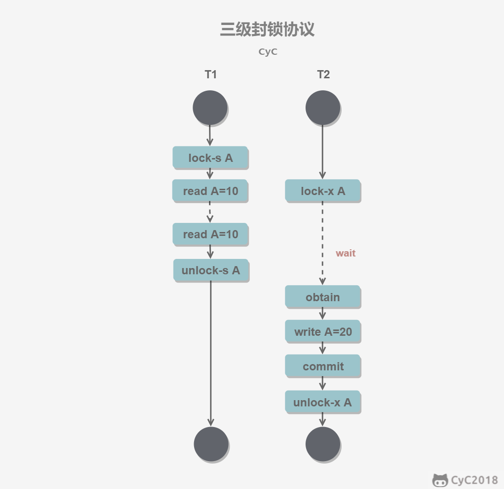

# 关系数据库理论

## 键

超键：能唯一标识元组的属性集，包含候选键和主键。可以是一个或多个属性

候选键：**最小**超键，即没有冗余元素的超键

主键：数据库表 中每行数据的**唯一标识**，每行有且只有唯一主键。可以是一个或多个属性，不能为空NULL

外键：一个表中存在的另一个表的主键，与其他表建立约束，可以为NULL

## 三大范式

第一范式（1NF）：属性不可分。
第二范式（2NF）：在第一范式的基础上，一个表必须有一个主键，非主键列 **完全依赖** 于主键，而不能是依赖于主键的一部分。
第三范式（3NF）：在第二范式的基础上，非主键列只依赖（直接依赖）于主键，不依赖于其他非主键。

## ER图

Entity-Relationship，有三个组成部分：实体、属性、联系。

用来进行关系型数据库系统的概念设计。

###  实体的三种联系

包含一对一，一对多，多对多三种。

- 如果 A 到 B 是一对多关系，那么画个带箭头的线段指向 B；
- 如果是一对一，画两个带箭头的线段；
- 如果是多对多，画两个不带箭头的线段。

下图的 Course 和 Student 是一对多的关系。


### 表示出现多次的关系

一个实体在联系出现几次，就要用几条线连接。

下图表示一个课程的先修关系，先修关系出现两个 Course 实体，第一个是先修课程，后一个是后修课程，因此需要用两条线来表示这种关系。


### 联系的多向性

虽然老师可以开设多门课，并且可以教授多名学生，但是对于特定的学生和课程，只有一个老师教授，这就构成了一个三元联系。


### 表示子类

用一个三角形和两条线来连接类和子类，与子类有关的属性和联系都连到子类上，而与父类和子类都有关的连到父类上。


# 触发器

触发器（trigger）是与表相关的数据库对象，是用户定义在关系表上的一类由**事件驱动**的特殊的存储过程，在满足定义条件时触发，并执行触发器中定义的 语句集合。触发器的这种特性可以协助应用在数据库端确保 数据库的完整性。

使用场景

- 可以通过数据库中的相关表实现 **级联更改**；

- 实时监控某张表中的某个字段的更改，并需要做出相应的处理。

# 事务

作为一个整体，要么都执行，要么都不

作用：保持数据一致性、可恢复性

## ACID原则

- A原子性：事务是最小的执行单位，不可分割。

- C一致性：数据库在事务执行前后都保持一致性状态。在一致性状态下，所有事务对同一个数据的读取结果都是相同的。

- I隔离性：一个事务所做的修改在提交前，对其它事务是不可见。

  

- D持久性：一旦事务提交，则其所做的修改永远保存到数据库中。即使系统崩溃，事务执行的结果也不能丢失。

  

事务的 ACID 特性概念简单，但不是很好理解，主要是因为这几个特性不是一种**平级关系**：

- 只有满足一致性，事务的执行结果才是正确的。
- 在无并发的情况下，事务串行执行，隔离性一定能够满足。此时只要能满足原子性，就一定能满足一致性。
- 在并发的情况下，多个事务并行执行，事务不仅要满足原子性，还需要满足隔离性，才能满足一致性。
- 事务满足持久化是为了能应对系统崩溃的情况。

### 如何实现ACID特性

- 原子性：由**undo log**日志保证，它记录了需要回滚的日志信息，事务回滚时撤销已经执行成功的sql
- 一致性：一般由**代码层面**来保证
- 持久性：由**内存+redo log**来保证，mysql修改数据同时在内存和redo log记录这次操作，事务提交的时候通过redo log刷盘，宕机的时候可以从redo log恢复
- 隔离性：由**MVCC**来保证


### AUTOCOMMIT

MySQL 默认采用自动提交模式。也就是说，如果不显式使用`START TRANSACTION`语句来开始一个事务，那么每个查询操作都会被当做一个事务并自动提交。

## 事务并发问题

### 脏读

（Dirty Read）事务a读取了事务b**未提交**的数据。

### 不可重复读

（Non-repeatable Read）同一事务内，多次读同一数据结果不一样（因为在此过程中有其他事务对数据进行了修改）。例如事务T2读A，T1修改了A，T2再读A和上一次读到的不同


### 幻读

（Phantom Read）本质也是不可重复读。区别在于不是某条，而是某个范围

例如有事务a对表中的数据进行了修改，这种修改涉及到表中的全部数据行，同时另一个事务b也向表中 插入一行。那么，事务a的用户会发现表中**还有一行**数据没有修改，就好像发生了幻觉一样。

### 丢失更新

（Lost Update）两个事务同时写同一条记录。事务 A 先写，事务 B 后写（B 不知道 A 写），当 B 提交数据后， 其写结果覆盖了 A 的写结果，导致事务 A 更新丢失。


## 隔离级别

表示并发事务对同一资源读取的隔离程度，**由低到高**依次是：

### 未提交读

（READ UNCOMMITTED）事务中的修改，即使没有提交，对其它事务也是可见的。


### 提交读

（READ COMMITTED）一个事务只能读取已经提交的事务所做的修改。换句话说，一个事务所做的修改在提交之前对其它事务是不可见的。**Oracle 默认**采用的是该隔离级别

 

### 可重复读

（REPEATABLE READ）**MySQL 默认**的隔离级别。保证在同一个事务中多次读取同一数据的结果是一样的。

 

### 可串行化

（SERIALIZABLE）强制事务串行执行，这样多个事务互不干扰，完全不会出现并发一致性问题。

该隔离级别需要**加锁**实现，保证同一时间只有一个事务执行，也就是保证事务串行执行。

 

### Q：各种级别能否解决一致性问题？


| 隔离级别              | 脏读 | 不可重复读 | 幻读 | 丢失更新 |
| --------------------- | ---- | ---------- | ---- | -------- |
| 未提交读              | 否   | 否         | 否   | 否       |
| 提交读                | 能   | 否         | 否   | 否       |
| 可重复读（mysql默认） | 能   | 能         | 否   | 能       |
| 可串行化              | 能   | 能         | 能   | 能       |


# 锁

## 锁粒度

MySQL 中只有两种：**行级锁**、**表级锁**

加锁需要资源，锁操作增加系统开销。应该尽量只锁定需要修改的那部分数据，锁定的数据量越少，系统的并发程度就越高。

选择封锁粒度时，需要在锁开销和并发程度之间做权衡


## 锁类型

### 读写锁

- 互斥锁（Exclusive），简写为 X 锁，又称写锁。
- 共享锁（Shared），简写为 S 锁，又称读锁。

限制：

1.  事务对数据A加了X锁，就能**读和写**A，加锁期间其他事务不能对A加**任何锁**
2.  事务对A加了S锁，**可以读但不能写**A，加锁期间其他事务还能对A加S锁，但不能加X锁

兼容关系：

|      |  X   |  S   |
| :--: | :--: | :--: |
|  X   | 不能 | 不能 |
|  S   | 不能 |  能  |


### 意向锁

使用意向锁（Intention Locks）更容易地支持多粒度封锁。

背景：在存在行级锁和表级锁的情况下，事务 T 想要对表 A 加 X 锁，就需要先检测是否有其它事务对表 A 或者表 A 中的任意一行加了锁，那么就需要对表 A 的每一行都检测一次，非常耗时。

意向锁在原来的 X/S 锁之上引入了 IX/IS， 都是**表锁**，用来表示一个事务想要在表中的某个数据行上加 X 锁或 S 锁。遵守两个规定：

- 一个事务在获得某个数据行对象的 S 锁之前，必须先获得表的 IS 锁或者更强的锁；
- 一个事务在获得某个数据行对象的 X 锁之前，必须先获得表的 IX 锁。

通过引入意向锁，事务 T 想要对表 A 加 X 锁，只需要先检测是否有其它事务对表 A 加了 X/IX/S/IS 锁，如果加了就表示有其它事务正在使用整个表或者表中某一行的锁（不用遍历每行），因此事务 T 加 X 锁失败。

兼容关系：

|      |  X   |  IX  |  S   |  IS  |
| :--: | :--: | :--: | :--: | :--: |
|  X   |  ×   |  ×   |  ×   |  ×   |
|  IX  |  ×   |      |  ×   |      |
|  S   |  ×   |  ×   |      |      |
|  IS  |  ×   |      |      |      |

- 任意 IS/IX 锁之间都是兼容的，因为它们只表示想要对表加锁，而不是真正加锁；
- X锁与所有锁不兼容
- 这里兼容关系针对的是**表级锁**，而表级的 IX 锁和行级的 X 锁兼容


从读写角度又可分为悲观锁和乐观锁：

### 悲观锁

使用DB锁机制，读/写完就锁，直到提交事务。长事务来说可能导致系统性能差

### 乐观锁

假设不会并发冲突，只在提交时检查。实现：版本号机制或CAS算法

## 封锁协议

### 1.三级封锁协议

其实就是制定加锁规则来控制并发

|              | 一级封锁协议                                                 | 二级封锁协议                                                 | 三级封锁协议                                                 |
| ------------ | ------------------------------------------------------------ | ------------------------------------------------------------ | ------------------------------------------------------------ |
|              | 事务 T 要修改数据 A 时必须加 X 锁，直到 T 结束才释放锁。     | 在一级的基础上，要求读取数据 A 时必须加 S 锁，读取完**马上**释放 S 锁。 | 在二级的基础上，要求读取数据 A 时必须加 S 锁，直到**事务结束**了才能释放 S 锁。 |
| 解决并发问题 | 解决丢失修改                                                 | 解决读脏数据                                                 | 解决不可重复读                                               |
| 解释         | 因为不能同时有两个事务对同一个数据进行修改，那么事务的修改就不会被覆盖。 | 因为如果事务T1在对数据 A 进行修改，根据 1 级封锁协议，会加 X 锁，那么另一个事务T2就不能再加 S 锁了，也就是不会读入数据。 | 因为读 A 时，其它事务不能对 A 加 X 锁，从而避免了在读的期间数据发生改变。 |




### 2.两段锁协议

加锁和解锁分为两个阶段进行。

事务遵循两段锁协议是保证可串行化调度的**充分不必要**条件。

> 可串行化调度：通过并发控制，使得并发执行的事务结果与某个串行执行的事务结果相同。串行执行的事务互不干扰，不会出现并发一致性问题。

例如以下操作满足两段锁协议，它是可串行化调度。

```html
lock-x(A)...lock-s(B)...lock-s(C)...unlock(A)...unlock(C)...unlock(B)
```

以下操作不满足两段锁协议，但它还是可串行化调度

```html
lock-x(A)...unlock(A)...lock-s(B)...unlock(B)...lock-s(C)...unlock(C)
```

# 多版本并发控制（MVCC）

是 MySQL 的 存储引擎 **InnoDB**实现隔离级别的一种**具体方式**，用于实现提交读和可重复读

## 基本思想

读写锁中读和写操作仍然是互斥的，而 MVCC 利用了多版本的思想，写操作更新最新的版本快照，而读操作去读旧版本快照，没有互斥关系（类似CopyOnWrite）

## 版本号

- 系统版本号 SYS_ID：是一个递增的数字，每开始一个新的事务，系统版本号就会**自动递增**。
- 事务版本号 TRX_ID ：事务开始时的系统版本号。

## Undo 日志

MVCC 的多版本指的是多个版本的**快照**，存储在 **Undo log**中，该日志通过回滚指针**ROLL_PTR** 把一个数据行的所有快照连接起来。

```sql
# 例如在 MySQL 创建一个表 t，包含主键 id 和一个字段 x。我们先插入一个数据行，然后对该数据行执行两次更新操作。
INSERT INTO t(id, x) VALUES(1, "a");
UPDATE t SET x="b" WHERE id=1;
UPDATE t SET x="c" WHERE id=1;
```

根据 MySQL 的 AUTOCOMMIT 机制，每个操作都会被当成一个事务来执行，所以上面的操作总共涉及到三个事务。


快照中除了记录事务版本号 TRX_ID 和操作之外，还记录了一个 bit 的 DEL 字段，用于标记是否被删除。

INSERT、UPDATE、DELETE 操作会创建一个快照，并将事务版本号 TRX_ID 写入。DELETE 可以看成是一个特殊的 UPDATE，还会额外将 DEL 字段设置为 1。

## ReadView

MVCC 维护了一个 ReadView 结构，主要包含了**当前系统未提交的事务列表** TRX_IDs {TRX_ID_1, TRX_ID_2, ...}，还有TRX_ID_MIN（最早的） 和 TRX_ID_MAX（最晚的）。


在进行 **SELECT** 操作时，根据数据行快照的 TRX_ID 与 TRX_ID_MIN 和 TRX_ID_MAX 之间的关系，判断数据行快照是否可以使用：

- TRX_ID < TRX_ID_MIN：表示该数据行快照是在当前所有未提交事务之前进行更改的，因此可以使用。
- TRX_ID > TRX_ID_MAX：表示该数据行快照是在系统某些事务启动之后被更改的，因此不可使用。
- `TRX_ID_MIN <= TRX_ID <= TRX_ID_MAX`：需要根据隔离级别再进行判断：
  - 提交读：如果 TRX_ID 在 **TRX_IDs 列表** 中，表示该数据行快照对应的事务还未提交，则该快照不可使用。否则表示已经提交，可以使用。
  - 可重复读：都不可以使用。因为如果可以使用的话，那么其它事务也可以读到这个数据行快照并进行修改，那么当前事务再去读这个数据行得到的值就会发生改变，也就是出现了不可重复读问题。

在数据行快照不可使用的情况下，需要沿着 Undo Log 的回滚指针 ROLL_PTR 找到下一个快照（TRX_ID更小的），再进行上面的判断。

## 快照读与当前读

### 1. 快照读

MVCC 的 SELECT 操作是快照中的数据，不需要进行加锁操作。

```sql
SELECT * FROM table ...;
```

### 2. 当前读

MVCC 其它会对数据库进行修改的操作（INSERT、UPDATE、DELETE）需要进行加锁操作，从而读取最新的数据。可以看到 MVCC 并不是完全不用加锁，而只是避免了 SELECT 的加锁操作。

```sql
INSERT;
UPDATE;
DELETE;
```

在进行 SELECT 操作时，可以强制指定进行加锁操作。以下第一个语句需要加 S 锁，第二个需要加 X 锁。

```sql
# ?为查询条件
SELECT * FROM table WHERE ? lock in share mode;
SELECT * FROM table WHERE ? for update;
```

# Next-Key Locks

Next-Key Locks 是 MySQL 的 InnoDB 存储引擎的一种锁实现。

> MVCC 不能解决幻读问题
>
> **即使把所有现存的记录都加上锁，还是阻止不了新插入的记录，**这也是为什么“幻读”会被单独拿出来解决的原因。
>
> 因此需要引入Next-Key Locks 解决。

在可重复读级别下，使用**MVCC + Next-Key Locks**可以解决幻读问题。

## Record Locks

锁定一个记录上的索引，而不是记录本身。

如果表没有设置索引，InnoDB 会自动在主键上创建隐藏的聚簇索引，因此 Record Locks 依然可以使用。

例如精确匹配时，锁某行

```sql
SELECT c FROM t WHERE c=10 FOR UPDATE;
```


## Gap Locks

间隙锁。执行范围查询时，若没有命中任何索引，则锁定索引之间的**间隙**，但是不包含索引本身。

例如当一个事务执行以下语句，就锁定`(11,20)`，其它事务就不能在 t.c 中插入 15。

```sql
SELECT c FROM t WHERE c BETWEEN 10 and 20 FOR UPDATE;
```

## Next-Key Locks

Record Locks + Gap Locks 的结合，不仅锁定一个记录上的索引，也锁定索引之间的间隙。

它锁定一个**前开后闭**区间。例如一个索引包含以下值：10, 11, 13, and 20，那么就需要锁定以下区间：

```sql
(-∞, 10]
(10, 11]
(11, 13]
(13, 20]
(20, +∞)
```

即在五个间隙上锁，只能操作这四个值
