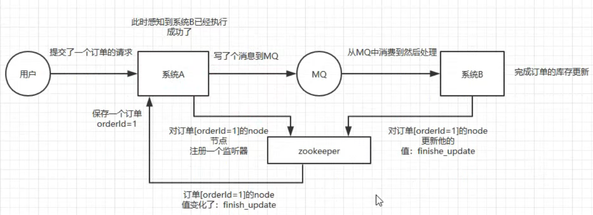
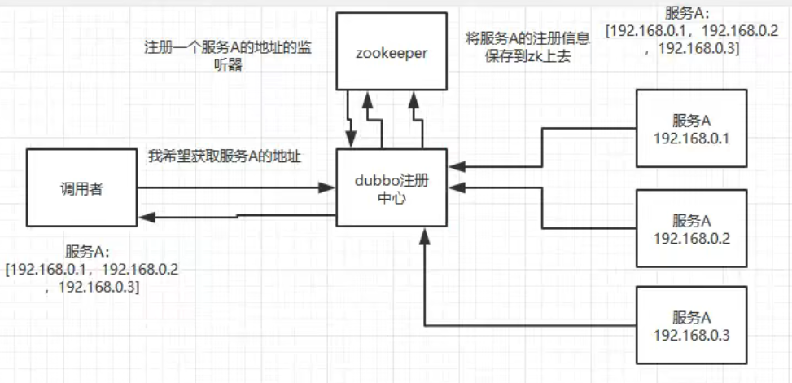
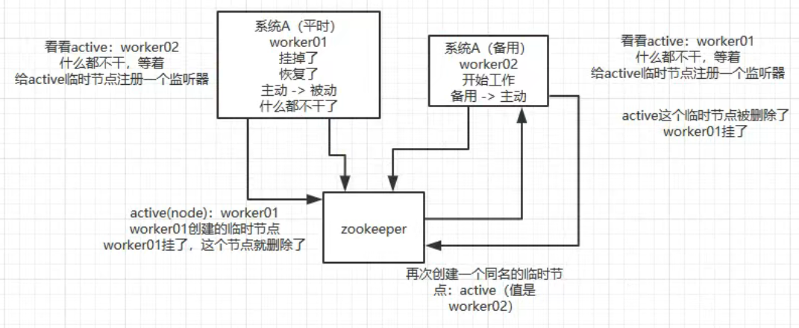

# Zookeeper

Zookeeper 提供了一种树形结构的命名空间，根节点为/，/app1/p_1 节点的父节点为 /app1。

## 基本命令

创建节点：create [节点名] [节点值]

展示节点：ls [路径]

**节点类型**

- 永久节点：不会因为会话结束或者超时而消失；
- 临时节点：如果会话结束或者超时就会消失；
- 有序节点：会在节点名的后面加一个数字后缀，并且是有序的，例如生成的有序节点为 /lock/node-0000000000，它的下一个有序节点则为 /lock/node-0000000001，以此类推。

**监听器**

为一个节点注册监听器，在节点状态发生改变时，会给客户端发送消息。

**分布式锁实现**

- 创建一个锁目录 /lock；
- 当一个客户端需要获取锁时，在 /lock 下创建临时的且有序的子节点；
- 客户端获取 /lock 下的子节点列表，判断自己创建的子节点是否为当前子节点列表中序号最小的子节点，如果是则认为获得锁；否则监听自己的前一个子节点，获得子节点的变更通知后重复此步骤直至获得锁；
- 执行业务代码，完成后，删除对应的子节点。

**会话超时**

如果一个已经获得锁的会话超时了，因为创建的是临时节点，所以该会话对应的临时节点会被删除，其它会话就可以获得锁了。可以看到，这种实现方式不会出现数据库的唯一索引实现方式释放锁失败的问题。

**羊群效应**

一个节点未获得锁，只需要监听自己的前一个子节点，这是因为如果监听所有的子节点，那么任意一个子节点状态改变，其它所有子节点都会收到通知（羊群效应，一只羊动起来，其它羊也会一哄而上），而我们只希望它的后一个子节点收到通知。

# 应用

## 分布式协调

A系统发送一个请求到mq，B消费该请求进行处理，A如何知道B的处理结果？用zk。

A发mq后，在zk上对某个节点（如订单orderId=1）的值注册一个监听器，一旦B处理完就修改zk上该节点的值，A立马就能收到通知，问题解决。

## 分布式锁

某个客户端尝试创建临时znode，成功则获取到锁，由此保证获得znode的客户端唯一，其他客户端来创建这个znode就会失败，只能对这个znode注册一个监听器。

释放锁就是删除znode，一旦删除会立即通知正在监听的客户端，这时等待的客户端就能获得该锁。

## 元数据/配置信息管理

zk可用作很多系统的配置信息管理，如kafka、storm和dubbo等分布式系统都会用zk做元数据/配置信息的管理。

例如将dubbo注册中心（管理多个服务A的注册）的信息存到zk上，调用者注册一个服务A的地址监听器，只要有服务A注册到dubbo就通知调用者，哪些服务A节点可用

## HA高可用性

hadoop、hdfs、yarn等大数据系统都是用zk开发HA高可用机制，就是一个重要进程做主从备份，主进程挂了立刻通过zk感知切换到备用进程，原主进程恢复后当备份，互为主备

