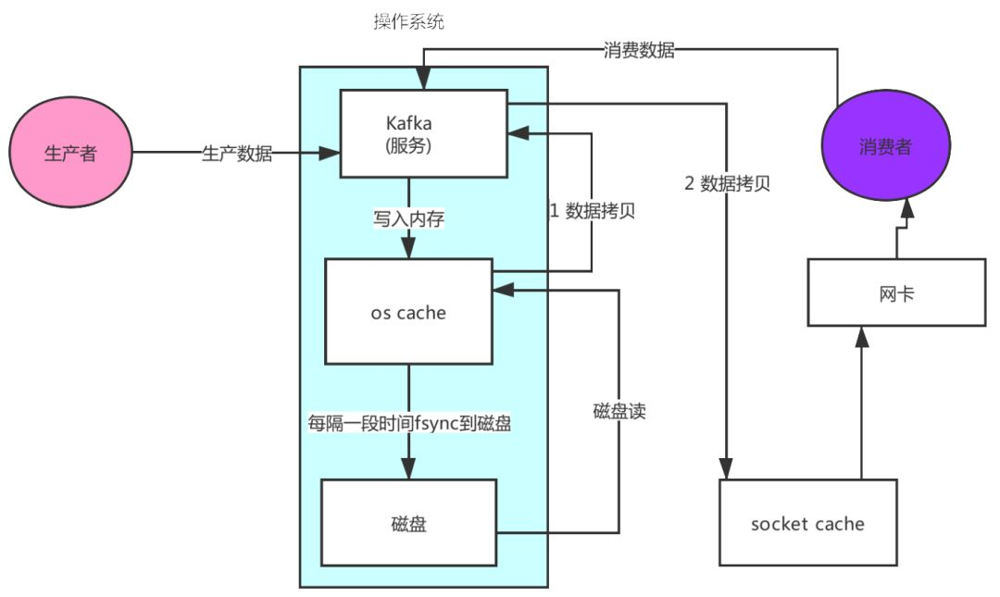
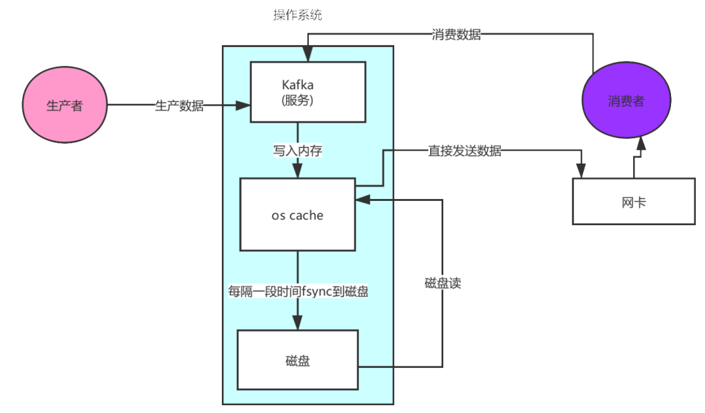
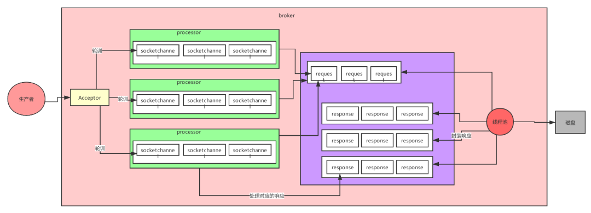
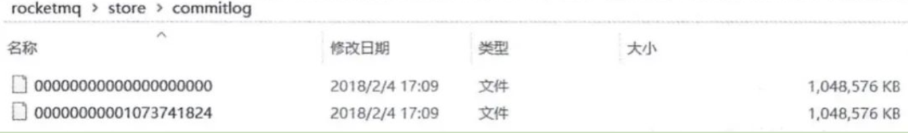
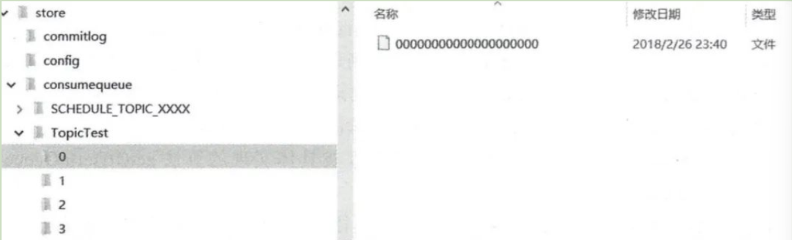
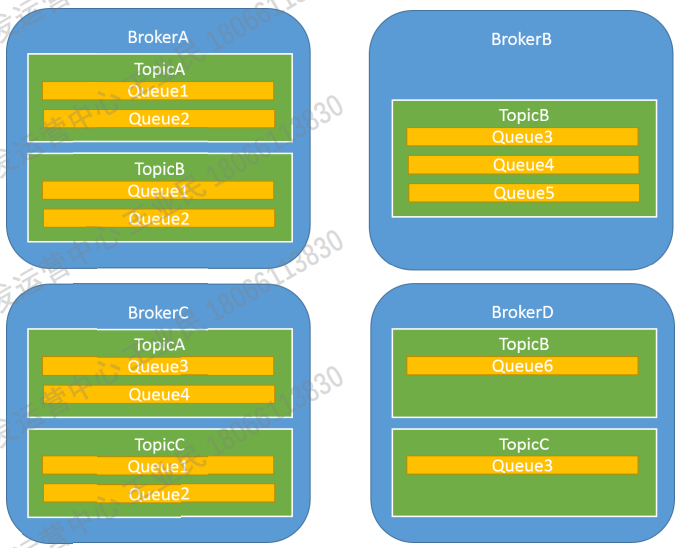
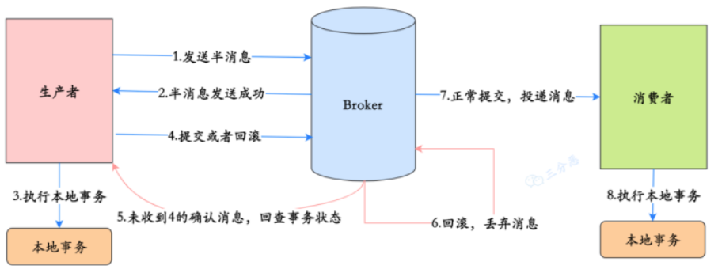
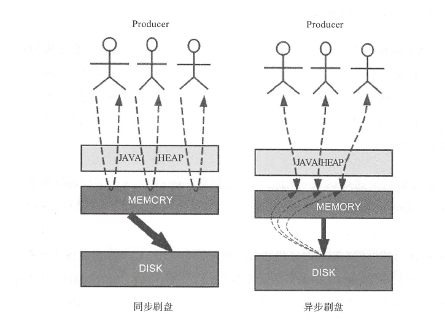
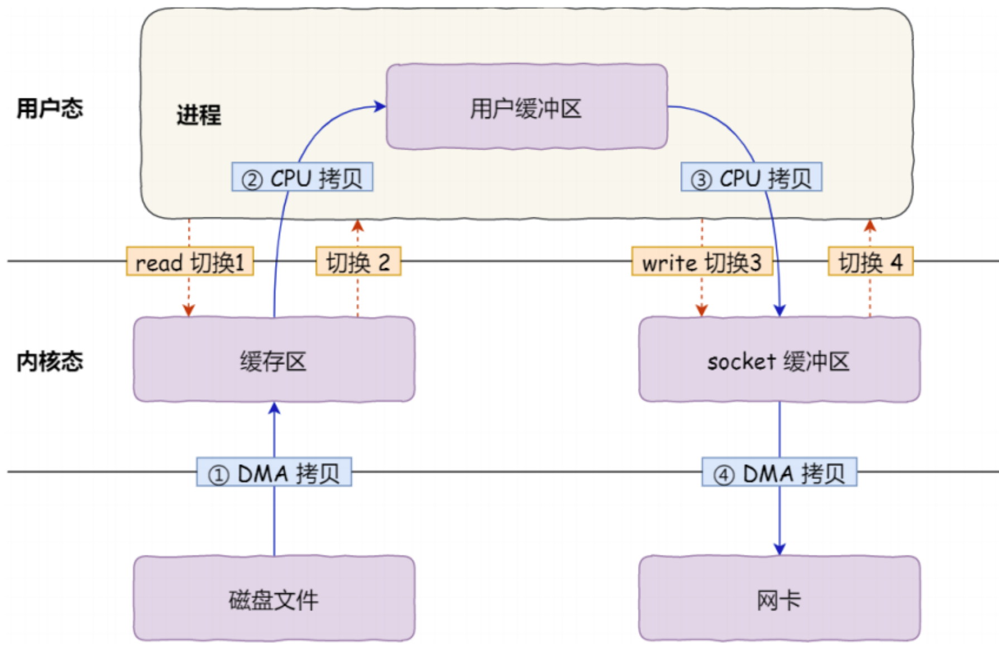
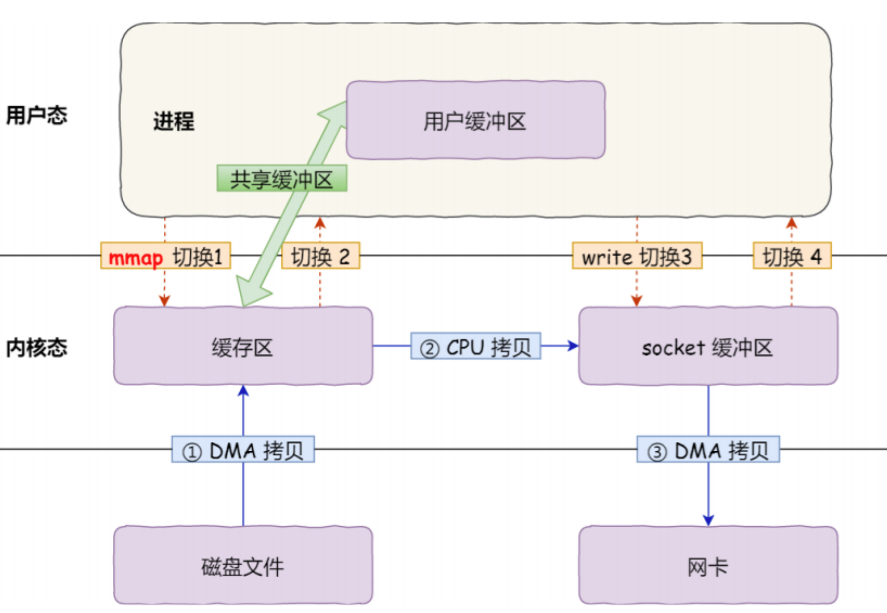

# 比较

|                         | ActiveMQ         | RabbitMQ         | RocketMQ                              | Kafka                                                |
| ----------------------- | ---------------- | ---------------- | ------------------------------------- | ---------------------------------------------------- |
| 功能                    | MQ功能极其完备   | MQ功能完备       | MQ功能较为完善                        | MQ功能较为简单，主要使用在大数据的实时计算和日志采集 |
| 单机吞吐量              | 万级             | 万级             | 十万级                                | 十万级                                               |
| 时效性                  | ms级             | μs级（延迟最低） | ms级                                  | ms级以内                                             |
| 可用性                  | 高，基于主从架构 | 高，基于主从架构 | 非常高，分布式架构                    | 非常高，分布式架构，一个数据多个副本                 |
| 消息可靠性              |                  |                  |                                       | 会丢数据                                             |
| topic数量对吞吐量的影响 |                  |                  | topic达到百级时，吞吐量会有小幅度下降 | topic达到千级时，吞吐量会大幅下降                    |


# Q：消息队列如何保证消息顺序性？

## RocketMQ

顺序性的前提都是单线程。

**局部顺序性**

- queue级别：对某个topic，设n个生产者和消费者，生产者发指定queue，消费者读取同一个queue，queue内肯定是有序的，则每对生产者-消费者的消息流是有序的，前提是**单线程**。
- topic级别：业务可以hash切分为多topic，每个topic只有一个生产者和一个消费者，则topic内有序，前提是**单线程**。

所以一般要求的顺序性都指全局顺序性

**全局顺序性**

对某个topic只能是一个生产者，一个消费者，且**单线程**。要求全局顺序性必然无法并发，损失性能。

## kafka

每个消费者**只能消费一个**partition，若消费者比partition多，则有消费者拿不到数据，没有意义

写入同一个partition的数据一定是有顺序的，因此生产者写入时，可以指定一个key，则相同key一定会分发到同一个partition


# Q：如何保证消息不丢失？

## Kafka

**情形1：消费者丢数据**

kafka消费者会自动提交offset（记为i），broker就认为i号消息已被消费，若此时消费者出问题，则下次请求broker给的就是i+1号消息了，i号消息丢失。

解决：改为手动提交

```
request.required.asks=0
# 0: 相当于异步的，不需要leader给予回复，producer立即返回，发送就是成功，那么发送消息网络超时或broker crash(1、Partition的Leader还没有commit消息 2、Leader与Follower数据不同步)，既有可能丢失也可能会重发
# 1：当leader接收到消息之后发送ack, 丢会重发, 丢的概率很小
# -1：当所有的follower都同步消息成功后发送ack. 不会丢失消息
```

**情形2：broker丢数据**

某个broker宕机，重新选举leader，此时follower数据未同步完，leader也挂了，则leader上的数据丢失。

解决：给这个topic设置`replication.factor`大于1，即每个partition至少有2个副本

broker设置`min.insync.replicas`大于1，要求leader至少有一个follower与自己保持同步中

生产者设置`acks = all`，要求每条数据必须写入所有replica后，才认为写成功

生产者设置`retries = MAX（最大整数）`，要求写入失败时，无限重试

**Q：生产者是否会丢数据？**

按照情形2的解决办法，能保证生产者一定将数据发送到broker，且存有2个以上副本，若不满足，生产者会不断重试

## RocketMQ


# Q：如何保证消息不重复？

kafka消费者会在获取消息后提交offset（相当于序号）给zk，告诉broker消费到哪了，从而保证消费者获取消息的基本顺序性，当消费者宕机重启后，还能从上次消费的地方继续开始

然而消费者并不是每条消息都提交offset，而是定时**批量提交**。若消费到中间某个消息（序号i），还未提交offset就宕机，则下次重启时无法继续从消息i开始，而是从i之前的某条开始，这就会出现重复消息

**解决**

1. 用redis记录消息id（流水号），消费者每次消费都读redis，遇到重复就跳过
2. 用数据库唯一主键约束
3. 加分布式锁（实际项目），一条消息从生产到消费全程加锁

## RocketMQ重复消费场景

1、发送阶段

当一条消息已被成功发送到Broker并完成持久化，此时出现网络闪断，导致Broker对Producer应答ack失败。Producer等待超时并尝试再次发送消息，则Broker中就可能会出现两条内容相同、并且Message ID也相同的消息，那么后续Consumer就一定会消费两次该消息。  

2、消费阶段

消息已投递到Consumer并完成业务处理，当Consumer向Broker提交offset时网络闪断，Broker未收到offset。为了保证消息**至少被消费一次**的原则，Broker将在网络恢复后再次尝试投递之前已被处理过的消息。此时Consumer就会收到与之前处理过的内容相同、且Message ID也相同的消息。

> 至少一次原则：RocketMQ保证每条消息必须要被**成功消费一次**。  

3、Rebalance时

> Rebalance即重新均衡，指的是**集群消费**模式下，同⼀个Consumer Group中的Consumer数量变化时，将⼀个Topic下的多个Queue在多个Consumer间进行重新分配的过程。  

消费者中某个消费者1已经接收queue1的消息，但未提交offset，此时发生Rebalance，queue1的消费者被重新指定为消费者2，则消费者2也可能读到queue1中的消费者1接收但未提交offset的这条消息。

# Q：如何处理消息积压？

考虑提高消费能力

- 增加消费者：若当前topic的queue数量大于消费者数量，就可以增加消费者来加快积压消息的消费
- 增加消费者线程：每个消费者的线程增加，则消费速度提升
- 消息迁移Queue：若当前topic的queue数量不超过消费者数量，再增加消费者也没用（消费者数不能超过分区数，否则有消费者闲置），此时就应考虑增加queue。把部分积压消息转到**临时topic**，因为不用业务处理，只是单纯转发，因此速度很快。再增加消费者去消费临时topic的消息，消费完后恢复原状。

# Q：Kafka为何能做到高性能？

## 1 顺序写

追加写磁盘，顺序写的性能极高

## 2 零拷贝

先来看看非零拷贝的情况，数据从内存拷贝到kafka服务进程那块，又拷贝到socket缓存那块，整个过程耗费的时间比较高



kafka利用了Linux的sendFile技术（NIO），省去了进程切换和一次数据拷贝，让性能变得更好。



# Q：客户端和服务端最大的区别是什么？

客户端需要connect操作，不需要启动Netty服务器进行accpet。

基于RocketMQ，提供高性能、高可用服务

# Kafka

## Broker 

就是Server。 包含多个 Topic , Partition, 和 Replica. 负责协调 Producer 和 Consumer 主从结构为: 主节点为 Controller, 从节点为从节点 Kafka 启动是会往 Zookeeper 中注册当前 Broker 信息. 谁先注册谁就是 Controller. 读取注册上来的从节点的数据(通过监听机制), 生成集群 的元数据信息, 之后把这些信息都分发给其他的服务器, 让其他服务器能感知到集群中其它成员的 存在

## Topic 

标准 MQ模型 中的 Queue。Kafka 中一个 Topic 的消息会保存在不同的 Partition (不同的 Broker)来保证高可用

## Partition （分区） 

可以理解为将标准 MQ 的 Queue 的消息进行拆分，来实现高可用 Producer 发送的 Message，根据 key 和 partition 数进行 hash，然后进行投递。

一个分区只能被同一个 Consumer Group （消费者组）中的一个 Consumer 消费，分区内消费有序。因此消费者组可用于实现某个topic的并行消费，n个消费者组同时消费某topic的n个分区，且不会互相干扰

## Replica （副本）

每一个 Partition 都可以设置多个副本，但 Replica 的数量应不超过 Broker 的数量 

Leader：Partition 的所有副本中只能有一个 Leader 节点(Broker)。Producer 写数据只往 Leader 中写。Consumer 读数据也是从 Leader 中读

Follower：只用于**备份**Leader，采用 pull 模式

## Producer

标准 MQ 中的发送方，一个Producer通常只发送一类消息（同一个topic）。发送给 Broker 使用**push** (推)模式

## Consumer Group （消费者组）

一类Consumer的集合名称，这类Consumer通常消费一类消息（同一个topic），且消费逻辑一致。


## Controller

kafka也是主从式的架构，主节点就叫controller，其余的为从节点，controller是需要和zookeeper进行配合管理整个kafka集群。

## Zookeeper

kafka严重依赖于zookeeper集群，所有的broker在启动的时候都会往zookeeper进行注册，目的就是选举出一个controller【先到先得】

controller会监听zookeeper里面的多个目录，例如有一个目录/brokers/，其他从节点往这个目录上**注册（就是往这个目录上创建属于自己的子目录而已）**自己，这时命名规则一般是它们的id编号，比如/brokers/0、/brokers/1、/brokers/2

注册时各个节点必定会暴露自己的主机名，端口号等等的信息，此时controller就要去**读取注册上来的从节点的数据（通过监听机制），生成集群的元数据信息，之后把这些信息都分发给其他的服务器，让其他服务器能感知到集群中其它成员的存在**。

此时模拟一个场景，我们创建一个主题（其实就是在zookeeper上/topics/topicA这样创建一个目录而已），kafka会把分区方案生成在这个目录中，此时controller就监听到了这一改变，它会去同步这个目录的元信息，然后同样下放给它的从节点，通过这个方法让整个集群都得知这个分区方案，此时从节点就各自创建好目录等待创建分区副本即可。这也是整个集群的管理机制。


## Kafka网络设计

kafka的网络设计和Kafka的调优有关，这也是为什么它能支持高并发的原因



首先客户端发送请求全部会先发送给一个Acceptor，broker里面会存在3个线程（默认是3个），这3个线程都是叫做processor，Acceptor不会对客户端的请求做任何的处理，直接封装成一个个socketChannel发送给这些processor形成一个队列，发送的方式是轮询，就是先给第一个processor发送，然后再给第二个，第三个，然后又回到第一个。消费者线程去消费这些socketChannel时，会获取一个个request请求，这些request请求中就会伴随着数据。

线程池里面默认有8个线程，这些线程是用来处理request的，解析请求，如果request是写请求，就写到磁盘里。读的话返回结果。
processor会从response中读取响应数据，然后再返回给客户端。这就是Kafka的网络三层架构。

所以如果我们需要对kafka进行增强调优，增加processor并增加线程池里面的处理线程，就可以达到效果。request和response那一块部分其实就是起到了一个缓存的效果，是考虑到processor们生成请求太快，线程数不够不能及时处理的问题。

所以这就是一个加强版的reactor网络线程模型。

# CTG-MQ


## Name Server

一个几乎无状态节点，可集群部署，节点之间无同步信息。 它主要提供broker注册、Topic路由管理等功能

## Broker

消息中转角色，负责存储消息，转发消息，一般也称Server。

CTG-MQ一般在多个服务器部署broker集群

### 消息存储

生产者发送的消息并不是瞬间到达消费者（否则就失去了MQ的意义），而是存储在本地文件系统中，这些相关文件默认在当前用户主目录下的store目录中。 目录下的文件： 

- abort：该文件在Broker启动后会自动创建，正常关闭Broker，该文件会自动消失。若在没有启动Broker的情况下，发现这个文件是存在的，则说明之前Broker的关闭是非正常关闭。
- checkpoint：其中存储着commitlog、consumequeue、index文件的最后刷盘时间戳
- **commitlog**：其中存放着commitlog文件，而消息是写在commitlog文件中的
- config：存放着Broker运行期间的一些配置数据
- **consumequeue**：其中存放着consumequeue文件，队列就存放在这个目录中
- index：其中存放着消息索引文件indexFile
- lock：运行期间使用到的全局资源锁  

#### CommitLog

> 说明：在很多资料中commitlog目录中的文件简单就称为commitlog文件。但在源码中，该文件被命名为mappedFile  

存放producer端写入的消息主体内容，消息是不定长的。

mappedFile文件大小上限为1G，文件名由**20位**十进制数构成，表示当前文件的第一条消息的起始位移偏移量。比如第⼀个文件名00000000000000000000，表示起始偏移量为0；当第一个文件写满了，写入第⼆个文件，名为00000000001073741824，表示起始偏移量为1073741824（上一个文件大小为1G=1073741824），以此类推。



#### ConsumeQueue

消息消费队列，引入的目的主要是**提高消费的性能**。由于RocketMQ是基于主题topic的订阅模式，消息消费是针对topic进行的，如果要遍历commitlog文件，根据topic检索消息非常低效。

于是consumer将consumequeue作为消息的**索引**（每个索引20B），保存了消息在commitlog的起始物理偏移量offset（8B）、消息体大小size（4B）和消息tag的hashCode（8B）。

每个文件可以包含30W个索引，目录结构：topic/queue/file，按topic、queue来划分



#### IndexFile

除了通过通常的指定Topic进行消息消费外，rocketMQ还提供一种可以通过**key或时间**来查询消息的方法。前提是**消息体中包含key**，且已经发送到broker。

文件名以创建的时间戳命名，固定单个IndexFile文件大小为400M，可以保存2000W个索引，底层存储为hashMap结构，因此RocketMQ索引文件底层实现为**hash索引**。

总结：RocketMQ采用的是混合型的存储结构，即每个Broker下所有队列共用一个CommitLog文件来存储。并使用consumequeue文件索引，实现数据和索引分离。broker使用同步刷盘或异步刷盘方式将消息持久化。

## Topic 

在ctg-mq中，topic类似于JMS规范中的队列，所有消息都是存放在不同的 topic中，**每个topic都有与之对应的生产者和消费者**。

broker与topic是多对多关系，broker里可能有多个topic，一个Topic可以分片（分成多个Queue）存在多个broker上（分布式）。

## Tag

用于区分同一Topic下不同类型的消息。

Topic是消息的一级分类，Tag是消息的二级分类。  

## Queue

每个Topic由多个队列Queue组成，Queue内有序，（类似kafka的分区）是存放数据的最小单位  

**broker-topic-queue关系**

broker与topic是多对多关系，一个broker里可以有多个topic，一个topic可以存在多个broker中 

topic又分为多个queue，即queue分布在不同的broker上，从而实现**分布式**。



## 生产者

生产组：一类Producer的集合名称，这类Producer通常发送一类消息（同一个topic），且发送逻辑一致，一般由业务系统负责产生消息。

生产者实例： 一个生产者实例代表**生产者的一员**，不同的生产者用不同的实例名字创建。

发送方式：

- 默认**轮询**topic的所有队列，每个队列接收平均的消息量。
- CTG-MQ也可以用`sendByGroupId(MQMessage message)`指定队列，在message中设置groupId，MQ内部按groupId来hash到某个队列
- 最小投递延迟算法：统计每次消息投递的时间延迟，然后根据统计出的结果将消息投递到时间延迟最小的Queue。  

### 消息写入过程

一条消息进入到Broker后经历了以下几个过程才最终被持久化。

1. Broker根据queueId，获取到该消息对应索引条目要在consumequeue目录中的写入偏移量，即QueueOffset
2. 将queueId、queueOffset等数据，与消息一起封装为消息单元
3. 将消息单元写入到commitlog
4. 同时，形成消息索引条目
5. 将消息索引条目分发到相应的consumequeue  

## 消费者

消费组：一类Consumer的集合名称，这类Consumer通常消费一类消息（同一个topic），且消费逻辑一致，一般是后台系统负责异步消费。消费进度由存储在消费组上。

消费者实例 ：一个消费者实例代表**消费组的一员**，不同的消费者用不同的实例名字创建。

约束：若topic分为n个队列，则消费者数量不能超过n，否则会有消费者无法消费消息。

### 消息读取过程

当Consumer来拉取消息时会经历以下几个步骤： 

1. Consumer获取到其要消费消息所在Queue的消费偏移量offset，计算出其要消费消息的消息offset

   > 消费*offset*即消费进度，*consumer*对某个*Queue*的消费*offset*，即消费到了该*Queue*的第几条消息
   >
   > 消息*offset =* 消费*offset + 1*

2. Consumer向Broker发送拉取请求，其中会包含其要拉取消息的Queue、消息offset及消息Tag。

3. Broker计算在该consumequeue中的queueOffset。

   > *queueOffset =* 消息*offset \* 20*字节

4. 从该queueOffset处开始向后查找第一个指定Tag的索引条目。解析该索引条目的前8个字节，即可定位到该消息在commitlog中的offset

5. 从对应commitlog offset中读取消息单元，并发送给Consumer

### 广播消费和集群消费

**广播消费** 

注意：使用消费模式，在很多使用场景都会带来影响或限制，在CTG-MQ中， 应尽量避免使用此消费模式。

在广播消费模式下，一条消息被多个Consumer消费，即使这些 Consumer属于同一个Consumer Group，消息也会被**Consumer Group中 的每个Consumer都消费一次**，广播消费中的Consumer Group概念可以认 为在消息划分方面无意义。

 V1.x版本由于广播消费的**消费进度，是保存在客户端**的（因为广播模式下consumer group中每个consumer都会
消费所有消息，但它们的消费进度不同 ），对于很多使用场景 会带来影响，在ctg-mq中，并不推荐使用此消费模式。

 V2.x版本在服务端存储消费状态，不支持此消费模式。推荐通过**多消费组** （订阅组）的方式进行消费。

**集群消费** 

一个Topic 可以被一个或多个 Consumer Group 消费，即一条消息每个 Consumer Group都能收到，但**一条消息只会被一个 Consumer Group 消费一次**，消费组内具体哪个consumer消费取决于内部分发机制。

每个Consumer Group有自己独立的消费进度，**消费进度保存在服务端**（因为同消费组的客户端之间需要共享进度）。 

负载均衡：一个Consumer Group中的消费者实例可以平均分摊消费消息。例如某个Topic有12条消息，其中一个Consumer Group有3个不同的消费者实例（可能是3个进程，或者3台机器），那么每个实例只消费其中的4条消息。 在此消费模式下，可以做到Point-To-Point的消费，也可以做到JMS里面广播消费，能满足绝大部分场景，推荐使用此消费模式。

### Offset管理

- 本地管理：对应广播消费，offset存每个Consumer客户端，默认路径为当前用户主目录下的`.rocketmq_offsets/${clientId}/${group}/Offsets.json`  
- 远程管理：对应集群消费，offset存broker，默认路径为当前用户主目录下的`store/config/consumerOffset.json`  

### offset提交方式

集群消费模式下，comsumer读取消息后会向broker提交消费进度，分为同步提交和异步提交

- 同步提交：comsumer读取完**一批消息**后向broker提交这些消息的offset，然后等待broker响应。若超时没收到响应，则重新提交，收到响应之前阻塞消费。
- 异步提交：comsumer读取完**一批消息**后向broker提交这些消息的offset，无需等待broker响应，就可继续读取下一批消息。

### 重试队列

当rocketMQ对消息的消费出现异常时，会将发生异常的消息的offset提交到Broker中的一个特殊队列（而不是等待时长后再去重试读取原来offset的消息）。重试队列也是通过延迟消息处理的。


重试队列是对于消费组的（因为要保证一条消息只会被一个 Consumer Group 消费一次），因此队列名为`%RETRY%{$ConsumerGroup}@{$ConsumerGroup}`。

### 死信队列

当⼀条消息初次消费失败，RocketMQ 会⾃动进⾏消息重试；达到最⼤重试次数后，若消费依然失败，说明消费组在正常情况下⽆法正确地消费该消息，RocketMQ 不会⽴刻将消息丢弃，⽽是将其发送到该消费组对应的特殊队列中，称为死信队列（Dead-Letter Queue，DLQ），而其中的消息则称为死信消息（Dead-Letter Message，DLM）。

- 死信队列中的消息不会再被消费者正常消费，即DLQ对于消费者是不可见的
- 死信存储有效期与正常消息相同，均为 3 天（commitlog文件的过期时间），3 天后会被自动删除
- 死信队列就是一个特殊的Topic，名称为%DLQ%consumerGroup@consumerGroup ，即每个消费者组都有一个死信队列，消费组下所有topic的死信消息都写入同一队列。
- 如果⼀个消费者组未产生死信消息，则不会为其创建相应的死信队列

## 消费模型

主要有push和pull两种

### PUSH模型

推送模型（被动），是一个“**发布-订阅**”模型，由consumer封装了轮询过程，并注册MessageListener监听器，consumer接收消息后，回调监听器接口Listener方法。对用户而言，感觉消息是被推送过来的。

优点：**实时性好**。

缺点：需要维护一个**长连接**，资源消耗大。

适合场景：client数量不多，server数据变化频繁。

客户端会自动开启多线程消费消息（线程数可配，默认5~64），即listener里面的方法，会被多线程执行。

客户端内部可以根据堆积量进行调整，使用者不需要新启、管理消费线程。并有流控机制，当客户端缓存一定量消息，导致消费不及时，会停止推送新消息。

### PULL模型

拉取模型（主动），又称队列模型，是一种“发--存--收”模型。应用通常主动调用Consumer的pull方法从Broker拉消息，主动权由应用控制，但实时性取决于应用主动拉取的频率，线程数由应用自主决定。

对于无序消费，应用可以多次调用pull并拉到数据，且与是否签收无关。对于有序消费，只要同一Queue的消息被拉出去消费，但未签收，则此Queue无法再拉取消费。

consumer在pull的时候，告诉broker自己buffer中可用的容量，整个流程如下：

1. consumer请求broker，告诉broker本地的可承载量，比如500
2. broker在收到消息后，如果没有消息则进入**long polling（长轮询）**状态
3. 当有消息的时候，broker直接向consumer进行push，总共push的数据量为500
4. 在整个push期间，consumer无需重新pull，即可获取数据
5. 由于broker知道最大容量，所以无需担心被冲垮。


## 分布式

通过将topic分成多queue，分布在不同的broker上，以实现分布式

## 消息模式

### 有序消息

生产者用`sendByGroupId()` 发送，以保证消息按序存储。【约束】只能是单生产者实例单线程串行发送。

消费者**按序消费**，前一条消息未完成消费，则后续的消费阻塞。若consumer消费失败，会不断**重试**这条消息，直到消费成功。

在CTG-MQ中，主要有两种：普通和严格

**普通有序消息** 

在正常情况下可以保证完全的顺序消息，但是一旦发生通 信异常，Broker重启，由于队列总数发生变化，哈希取模后定位的队列会变 化，产生短暂的消息顺序不一致。 如果业务能容忍在集群异常情况（如某个Broker宕机或者重启）下，消息短 暂的乱序，使用普通顺序方式比较合适。

**严格有序消息** 

无论正常异常情况都能保证顺序，但是牺牲了分布式 Failover特性，即Broker集群中只要有一台机器不可用，则整个集群都不可 用（或者影响hash值对应队列的使用），服务可用性大大降低。 如果服务器部署为同步双写模式，此缺陷可通过备机自动切换为主避免，不 过仍然会存在几分钟的服务不可用。

在CTG-MQ中，消息模式选择的优先顺序为：**无序消息>普通有序消息>严格有序消息**。在业务场景允许的情况下，优先选择无序消息，或者 在业务能变通的情况下，将有序消息转化为无序消息。 如果一定要用有序，若业务能容忍短暂乱序，推荐普通有序消费。

 **有序消息的缺点** & 必须注意事项：

1. 对于生产者，因为要保证顺序，所以一般单线程串行发送， 性能较低。对一个Topic有多个Queue的场景，可增加生产者数，每个生产者发送固定的Queue，提高性能。 

2. 对于消费者，因为要保证顺序，所以一般单线程串行消费，消费性能较低。对一个Topic有多个Queue的场景，可以通过增加消费者 实例数，提高性能，但应用必须考虑消息者实例数量变化，由于负载均 衡带来的短时间数据乱序问题。

3. 对于普通有序消息，当节点故障时，由于Queue数的变化，导致hash 值的变化，产生与消费都会出现短暂的消息顺序不一致；对于严格有序 消息，当节点故障时，Queue数不会变化，产生与消费都会出现异常， 直到故障节点恢复。

4. 对于普通有序消息，意味着业务能接受短时间消息乱序，所以一般情 况下可以在线态扩容；对于严格有序消息，需要将所有消息消费完，并且停止服务，才能扩容。

5. 有一种场景，同一Topic所有消息必须是有序生产与有序消费，可以使 用多Queue然后在生产消费端做顺序处理，也可以拆分多个Topic然后 使用单Queue进行处理，但在设计时，应用必须考虑单Queue的处理性 能是否能满足。对于单Queue，只要对应的broker故障，则服务中断。

### 无序消息

普通消息、延时消息、事务消息都是无序的。无序消息的**重试只对集群消费生效**。（广播消费失败不重试）

优点：

1. 生产者可以使用**多进程、多线程**往同一个TOPIC发送，性能较好
2. 消费者可以使用**多进程、多线程**同时消费一个topic，性能较好 
3. 可以充分使用集群的 **failover**（故障转移）特点，无须依赖自动主备切换（切换过期服务中断），包括： 
   1. 当集群中某一broker节点故障时，不影响业务消息生产， 消息将failover发送到其它节点
   2. 当集群中某一broker节点故障时，不影响其它节点数据 消费，故障恢复后既可消费 
   3. 充分利用failover特点，可不部署自动切换组件，减少 部署复杂度和运维难度

4. 动态扩容

### 消息过滤

有两种⽅案：

- Broker 端过滤：在 Broker 端按照 Consumer 的去重逻辑进⾏过滤。这样做的好处是避免了⽆⽤的消息传输到 Consumer 端，提高吞吐量。缺点是加重了 Broker 的负担，实现复杂。 
- Consumer 端过滤：⽐如按照消息的 tag 去重，这样的好处是实现起来简单，缺点是有⼤量 ⽆⽤的消息到达了 Consumer 端只能丢弃不处理。

⼀般采⽤Cosumer端过滤。如果希望提⾼吞吐量，可以采⽤Broker过滤

消息过滤三种方式：

1. 根据Tag过滤：这是最常⻅的⼀种，⽤起来⾼效简单

   ```java
   DefaultMQPushConsumer consumer = new DefaultMQPushConsumer("CID_EXAMPLE");
   consumer.subscribe("TOPIC", "TAGA || TAGB || TAGC");  // 过滤出带TAGA、TAGB、TAGC三个标签，用或运算符
   ```

2. SQL 表达式过滤：更加灵活

   ```java
   DefaultMQPushConsumer consumer = new DefaultMQPushConsumer("please_rename_unique_group_
   name_4");
   // 只有订阅的消息有这个属性a, a >=0 and a <= 3，才过滤
   consumer.subscribe("TopicTest", MessageSelector.bySql("a between 0 and 3");
   ```

3. Filter Server ⽅式：最灵活，也是最复杂的⼀种⽅式，允许⽤户⾃定义函数进⾏过滤

### 延时消息

消息写入到Broker后，在指定的时长后才可被消费的消息。

使用：不支持随意时长的延迟，是通过特定的延迟等级来指定的 

```java
// 服务端的MessageStoreConfig类
private String messageDelayLevel = "1s 5s 10s 30s 1m 2m 3m 4m 5m 6m 7m 8m 9m 10m 20m 30m 1h 2h";
```

实现原理：**缓存 + 定时任务**。Broker收到延时消息，会先发送到topic（加特定开头，如SCHEDULE_TOPIC_XXXX）的对应延迟等级的consumequeue 中，然后通过⼀个定时任务轮询这些队列，到期后再把消息投递到⽬标Topic的队列中。总之就是把延时消息先缓存到临时topic，时间到后再发送到原topic。

### 事务消息

半消息：是指Producer 成功发送到 Broker 端的消息，但暂时还不能被 Consumer 消费的消息。只有等 Producer 端执⾏完本地事务后经过⼆次确认了之后，Consumer 才能消费此条消息。（因为消息在broker还是可以控制撤回的，但consumer消费后就不容易撤回了。）

依赖半消息，可以实现**分布式消息事务**，其中的关键在于**⼆次确认以及消息回查**（保证左半部分完成后才发送消费者）

>分布式事务：一次操作由若干分支操作组成，这些分支操作分属不同应用，分布在不同服务器上。分布式事务需要保证这些分支操作要么全部成功，要么全部失败。分布式事务与普通事务一样，就是为了保证操作结果的一致性。  



二次确认：上图的第4步，若broker正常收到确认，立即能操作提交或回滚。若超时就回滚。

消息回查：第5步，重新查询本地事务的执行状态

## 数据可靠性

### 1、刷盘策略

CTG-MQ的所有消息都是持久化的，到达broker后，先写入系统Page Cache（磁盘缓存），然后刷盘（写磁盘），可以保证内存与磁盘都有一份数据。有同步刷盘和异步刷盘，通过Broker配置文件里的`flushDiskType`参数设置为SYNC_FLUSH、ASYNC_FLUSH指定

#### 异步刷盘

消息写入Page Cache后就立刻返回写成功。速度快吞吐量大，但有可能丢数据

#### 同步刷盘

消息写入磁盘才返回写成功。性能不如异步，但数据一定不会丢。流程：消息写入线程Page Cache后，立刻启动刷盘线程写磁盘并等待，刷盘线程完成后唤醒等待线程，返回生产者写成功。



### 2、主从复制策略

若是主从架构，消息需要从Master复制到Slave上，有同步和异步两种复制方式。通过Broker配置文件里的`brokerRole`参数进行设置的，这个参数可以被设置成ASYNC_MASTER、SYNC_MASTER、SLAVE

#### 同步复制

如果Master出故障，Slave上有全部的备份数据，容易恢复。但是会增大数据写入延迟，降低系统吞吐量

#### 异步复制

系统拥有较低的延迟和较高的吞吐量。但是如果Master出了故障，有些数据因为没有被写入Slave，有可能会丢失

### 3、不同级别的数据可靠策略

- 最高保障：实时刷盘+同步复制
- 中等保障：异步刷盘+同步复制
- 中下级别：异步刷盘+异步复制
- 最低级别：异步刷盘/实时刷盘+单主机

推荐设置为**异步刷盘、同步复制**，即brokerRole=SYNC_MASTER，flushDiskType=ASYNC_FLUSH

### 4、数据清除策略

消息的数据都存储在Commit Log上，所以数据清除是就是**删除过期的Commit Log**。

默认过期时间为72小时。在Broker.config配置消息保留时间：`fileReservedTime=xxx`  

#### 定时删除

Broker内部有一定时服务，默认4点开始删除过期的消息数据。数据删除是由**最旧的一个Commit Log**文件开始

#### 发送时触发删除

当磁盘使用空间达到85%以上，有消息生产时触发数据删除，由**最旧的一个Commit Log**文件开始，一次最大删除10个文件

触发的删除有两种操作：1）保证数据高可靠：磁盘空间超过85%则拒绝服务；2）保证服务高可用：磁盘空间超过85%则强制删除非过期文件。

## 高性能

### 1、PageCache+顺序读

ConsumeQueue逻辑消费队列存储的数据较少，并且是**顺序读**，在PageCache机制的**预读取**作⽤下，ConsumeQueue⽂件的读性能⼏乎接近读内存。

⻚缓存（PageCache)是OS对⽂件的缓存，⽤于加速对⽂件的读写。⼀般来说，程序对⽂件进⾏顺序读写的速度⼏ 乎接近于内存的读写速度，主要原因就是由于OS使⽤PageCache机制对读写访问操作进⾏了性能优化，将⼀部分 的内存⽤作PageCache。对于数据的写⼊，OS会先写⼊⾄Cache内，随后通过异步的⽅式由pdflush内核线程将 Cache内的数据刷盘⾄物理磁盘上。对于数据的读取，如果⼀次读取⽂件时出现未命中PageCache的情况，OS从 物理磁盘上访问读取⽂件的同时，会顺序对其他相邻块的数据⽂件进⾏预读取。

### 2、MappedByteBuffer

是**零拷贝**的一种java实现方式（mmap机制），是java nio引入的文件内存映射方案，读写性能极高。利⽤了NIO中的FileChannel模型将磁盘上的物理⽂件直接映射到⽤户态的内存地址中（即**将CommitLog映射到内存**）

正因为需要使⽤内存映射机制，故RocketMQ的⽂件存储都使⽤**定⻓存储**，⽅便⼀次将整个⽂件映射⾄内存

### Q：什么是零拷贝？

在操作系统中，使⽤传统IO的⽅式，数据需要经历⼏次拷⻉，还要经历⽤户态/内核态切换。



1. 从磁盘复制数据到内核态内存；
2. 从内核态内存复制到⽤户态内存；
3. 然后从⽤户态内存复制到⽹络驱动的内核态内存；
4. 最后是从⽹络驱动的内核态内存复制到⽹卡中进⾏传输。

通过零拷⻉的⽅式，减少⽤户态与内核态的上下⽂切换和内存拷⻉的次数，⽤来提升I/O的性能。



## 高可用

### 集群接入高可用（NameServer）

多个集群管理服务+故障自动切换，实现集群接入点高可用

### 消息服务高可用（Broker）

- 通过生产与消费的自动负载均衡，实现Failover，保证某一组服务在全挂的情况下，不影响整体业务
- 通过自主研发的自动主备切换，实现主机故障自动备升主，保证服务连续性，自动主备切换可剥离
- 通过消息过期删除策略，保证服务的可持续性  

## 原生RocketMQ的问题

- 功能不完善：功能比较单一，针对不同应用场景无法有效支 持，如消息轨迹查询，严格消费机制，数据自动删除策略等。

- 可维护性差：缺乏配套监控运维能力，难以迅速发现解决如 消息堆积、队列堵塞等问题。 
- 可靠性较低：消息服务不提供主备切换能力，存在单点故障， 无法保证服务高可用

## CTG-MQ的改进

高可用、高可靠改进： 

- 实现自动主备切换、自动拉起功能，保证服务高可用 

- 实现消息删除策略，按不同的场景优先保证服务可用性或者 数据安全性。


 可维护性改进： 

- 实现按生产者、消费者、数据节点、队列4种维度的运行状态 监控，方便快速发现问题
- 实现可视化的监控、配置、管理界面 
- 实现自动化测试，以快速迭代 

新增功能： 

- 消息轨迹收集、分析与查询，做到可查可追踪

- 严格的消费机制，满足消费严格不重复的应用需求 

- 重新封装SDK，简化应用使用，并提供按hash算法实现消息 局部有序生产消费

## 使用

### 消费端

创建一个类，继承CtgTopicListener，并实现ApplicationRunner

覆写com.eshore.cmp.sync.controller.listener.SaveRecordListener#run()、com.eshore.cmp.sync.controller.listener.SaveRecordListener#onMqMessage()

1. run方法在app启动时执行，**工厂模式**创建一个消费组，里面只有一个push型消费者，用IConsumer.pushMessagesByTopic()监听某个topic

   内部再调IMQPushConsumer.listenTopic()，方法内部为Listener**订阅**topic，并注册Listener

2. onMqMessage方法，处理消费到消息后的处理逻辑

### 生产端

工厂模式获取一个生产者，然后用IProducer.sendMsgToTopicSyn()发送一条消息

MQMessage说明

| 属性       | 类型   | 说明                                                         |
| ---------- | ------ | ------------------------------------------------------------ |
| sourceType | int    | 0：主题 1：队列  （cmp中默认0）                              |
| sourceName | String | 主题或队列名称                                               |
| body       | byte[] | 消息体                                                       |
| Key        | String | 消息体的key                                                  |
| Tag        | String | 消息的标签                                                   |
| groupId    | Object | 发往指定分区的关键词，可以为空，如果设置将发往其hash值的分区 |
