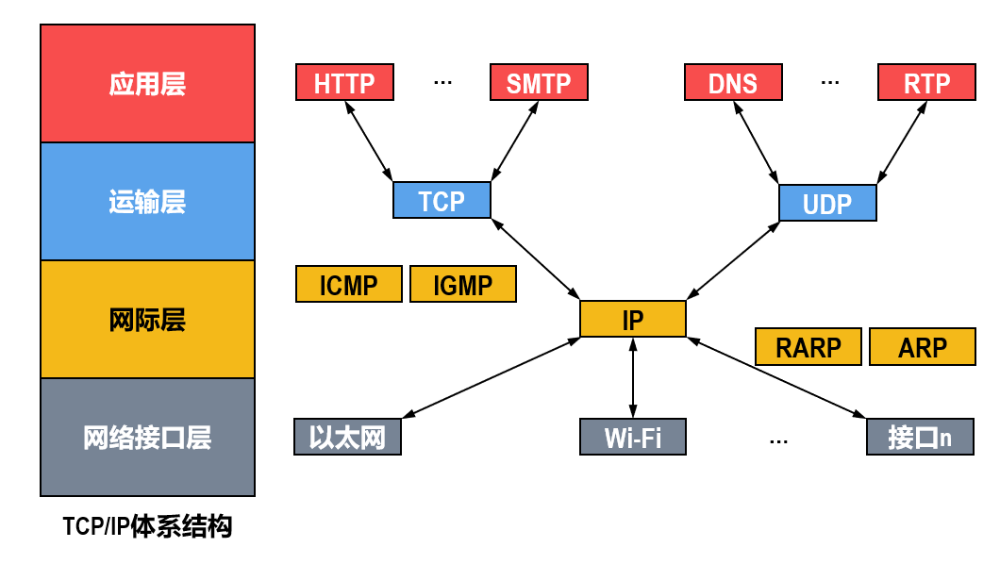


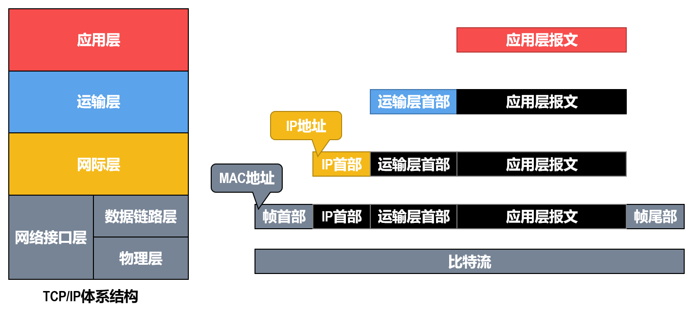

# 网络层-IP

- **MTU**：IP层一个网络包的最大长度，以太网中一般为 **1500** 字节；

  然而 Internet 上的路由器可能会将 MTU 设为不同的值，则整个网络需要使用一系列机制调整每个路由器的MTU以保证数据报顺利到达目的地。IPV4标准建议MTU为 **576** 字节。

- **MSS**：除去 IP 和 TCP 头部之后，一个网络包所能容纳的 **TCP 数据载荷** 部分 的最大长度：1500-20-20=**1460字节**（ip头定长，tcp头最少20）；

## IP数据报格式


固定长度：**20字节**。

可变长度：0~40字节（可选+填充），但要**4字节对齐**。（如上图这样画每行4字节，就是为了对齐

- **版本** : 有 4（IPv4）和 6（IPv6）两个值；

- **首部长度** : 单位是4字节，取值5~15（4bit，最大能表示15，但头部最少20字节）

- **区分服务** : 用来获得更好的服务，一般情况下不使用。

- **总长度** : 【首部 + 数据】的长度，单位字节。16bit最大65535

- **生存时间** ：TTL，它的存在是为了防止无法交付的数据报在互联网中不断兜圈子。以路由器**跳数**为单位，当 TTL 为 0 时就丢弃数据报。

- **协议** ：指出携带的数据应该上交给哪个协议进行处理。

  | 协议名称 | ICMP | IGMP | TCP  | UDP  | IPV6 | OSPF |
  | -------- | ---- | ---- | ---- | ---- | ---- | ---- |
  | 字段值   | 1    | 2    | 6    | 17   | 41   | 89   |

- **首部检验和** ：检验和不包含数据部分，可以减少计算的工作量。

  数据报每经过一个**路由器**，都要重新计算检验和，因为首部中的某些字段的值（例如生存时间TTL、标志以及片偏移等）都可能发生变化

- **标识** : 在数据报长度过长从而发生分片的情况下，相同数据报的不同分片具有相同的标识符。

- **片偏移** : 和标识符一起，用于发生分片的情况。片偏移的单位为 8 字节。

- 

# 传输层-TCP

## TCP 首部格式


固定长度：**20字节**。

可变长度：0~40字节（选项+填充），但要**4字节对齐**。（如上图这样画每行4字节，就是为了对齐

- **源端口**：16bit，表示0~65535号端口

- **目的端口**：16bit，表示0~65535号端口

- **序号 seq** ：用于对**数据部分**字节流进行编号，例如序号为 301，表示第一个字节的编号为 301，如果携带的数据长度为 100 字节，那么下一个报文段的序号应为 401。

  因为占32位，所以取值范围0~2^31-1。当序号到达最后一个时，下一个序号又回到0

- **确认号 ack** ：期望收到的下一个报文段的序号。例如 B 正确收到 A 发送来的一个报文段，序号为 501，携带的数据长度为 200 字节，因此 B 期望下一个报文段的序号为 701，B 发送给 A 的确认报文段中确认号就为 701。

  取值范围也是0~2^31-1，到达最后一个回头

- **数据偏移** ：数据部分距离报文段起始处的偏移量，实际上指的是**首部的长度**（单位是4字节），取值5~15（4bit，最大能表示15，但头部最少20字节）

- **确认 ACK** ：当 ACK=1 时确认号字段ack有效，否则无效。TCP 规定，在连接建立后所有传送的报文段都必须把 ACK 置 1（除了FIN）。

- **同步 SYN** ：在**连接建立时**用来同步序号。当 SYN=1，ACK=0 时表示这是一个连接请求报文段。若对方同意建立连接，则响应报文中 SYN=1，ACK=1。

- **终止 FIN** ：用来**释放一个连接**，当 FIN=1 时，表示此报文段的发送方的数据已发送完毕，并要求释放连接。

- **窗口** ：窗口值作为接收方让发送方设置其发送窗口的依据。之所以要有这个限制，是因为接收方的数据缓存空间是有限的。

- **校验和**：接收时用于判断是否误码，发送时计算填入。在下图介绍计算方法

- **选项**：长度可变，0~40字节。

  - 最大报文段长度（MSS，指TCP**数据载荷**部分长度）选项：一般认为应尽可能大，但不能超过IP分片的长度限制。TCP建立时双方将自己支持的MSS写入该字段，数据传输阶段取较小的那个MSS值。默认536，即TCP报文总长度最小为536+20=556


## 伪首部

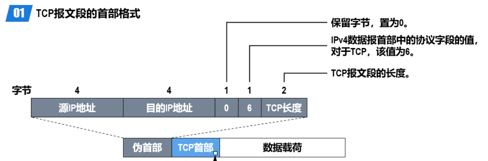

**发送时**

会添加伪首部，用于计算校验和

1. 将TCP首部中检验和字段的值置为0。
2. 将伪首部、TCP首部以及数据载荷这三部分划分成若干个**2字节**的字。若伪首部、TCP首部以及数据载荷这三部分的总长度不是偶数个字节，则在最后添加1个“全0”字节。
3. 对划分出的全部2字节的字进行反码算数运算求和，并将求和结果取反码。
4. 将步骤③得到的结果写入TCP首部中的检验和字段。

**接收时**

1. 给接收到的TCP报文段前面添加一个12字节的伪首部。
2. 将伪首部、TCP首部以及数据载荷这三部分划分成若干个2字节的字。
3. 对划分出的全部2字节的字进行反码算数运算求和，并将求和结果取反码。
4. 若步骤③得到的**结果为0**，则表示TCP报文段在传输过程中没有误码。否则，表示出现了误码。


## 三次握手（三报文握手）


假设 A 为客户端，B 为服务器端。三次握手的报文**都不携带数据**。

- 首先 B 处于 LISTEN（监听）状态，等待客户的连接请求。

- A 向 B 发送连接请求报文，SYN=1，**ACK=0**（因为是**初始报文**，不需要对任何报文确认），选择一个初始的序号 x。

- B 收到连接请求报文，如果同意建立连接，则向 A 发送连接确认报文，SYN=1，ACK=1，确认号为 x+1（因为A发来的报文不携带数据，所以期望收到下一个报文序号是x+1），同时也选择一个初始的序号 y。

- A 收到 B 的连接确认报文后，还要向 B 发出确认，ACK=1，确认号为 y+1，序号为 x+1。

  注意这是一个**普通报文**，可以携带数据。如果未携带数据则不消耗序号seq，即A发出的下一个报文seq仍为x+1。而前两个报文虽然不带数据，但都消耗一个序号。

- B 收到 A 的确认后，连接建立，双方都可以进行收发。

- 数据传送时，**ack=发送方的seq+发送方的len**。（具体见wireshark抓包一节）

  注意：带SYN、FIN的报文不同，ack=发送方的seq+发送方的len**+1**。

## 四次挥手（四报文挥手）


以下描述不讨论序号和确认号，因为序号和确认号的规则比较简单（前两个报文：u为A上一个报文的序号+1，v为B的上一个报文序号+1。第三个报文：w为**半关闭状态**下B发送的上一个报文序号+1，u+1是对之前A发送释放连接报文的**重复确认**）。

并且不讨论 ACK（因为 ACK 在连接建立之后都为 1）。

- A 发送连接释放报文，FIN=1。
- B 收到之后发出确认，此时 TCP 属于**半关闭状态**，B 能向 A 发送数据但是 A 不能向 B 发送数据。
- 当 B 不再需要连接时，发送连接释放报文，FIN=1。
- A 收到后发出确认，进入 TIME-WAIT 状态，**等待 2 MSL**（最大报文存活时间）后释放连接。
- B 收到 A 的确认后**立刻**释放连接。

## Q：为什么三次握手不能简化为两次？

一句话：防止重复建立连接。

考虑情况：客户端发送的连接请求c1如果在网络中滞留，隔很长一段时间才能收到服务器端发回的连接确认。客户端等待一个超时重传时间之后，就会重新请求连接c2。

但是这个滞留的连接请求c1最后还是会到达服务器，如果不进行三次握手，那么服务器就会打开两个连接。如果有第三次握手，客户端会忽略服务器对连接c2请求的确认，因此就不会再次打开连接。

**通俗理解（全网独家！！！）**

客户端是主动方，只用两次握手就能建立**单向**连接了。但服务器是被动方，也需要一去一回两次握手建立**单向**连接，本质上总共需要四次握手才能建立双向连接。但服务器发送响应给客户端，和服务器发送建立连接的请求，这两次可以优化为一次，因此三次就足够。

## Q：为什么要四次挥手？

类似于《Q：为什么三次握手不能简化为两次？》的通俗理解，结束双向连接也需要双方分别结束单向连接，共四次。

第一次挥手后，服务器就进入 CLOSE-WAIT 状态，是为了让服务器端发送还未传送完毕的数据。

**为何不像三次握手那样将服务器的两次握手合并成一次？**

因为此时连接已建立，应该让服务器充分利用连接。

**TIME_WAIT**

客户端接收到服务器端的 FIN 报文后进入此状态，此时并不是直接进入 CLOSED 状态，还需要等待一个时间计时器设置的时间 2MSL。两个理由：

- 确保A最后一个确认报文能够到达B。如果 B 没收到 A 发送来的确认报文，那么就会重新发送连接释放请求报文（超时重传），导致A一直无法关闭。
- 为了让本连接持续时间内所产生的所有报文都从网络中消失，使得下一个新的连接不会出现旧的连接请求报文。

## Q：2MSL如何得出？

**类似问题：如何保证A发出最后一个连接释放报文，B一定能关闭？**

考虑最坏情况：A发出最后一个连接释放报文，最多1MSL到达B，如果该报文丢失，则B发起超时重传（B发出FIN也会等2MSL），最多1MSL到达A，总共经历2MSL。如果2MSL后没收到B的报文，则说明B没有超时重传，确认B已经关闭，因此A可以放心关闭。

## Q：既然 IP 层会分片，为什么 TCP 层还需要 MSS 呢？

考虑情况：如果tcp整个报文交给IP层分片，当IP层有一个超过MTU大小的数据要发送，则要进行分片，把这个数据拆分成若干个小于MTU的分片。

而IP层没有tcp的超时重传机制，只要其中一个IP分片丢失，则所有分片都要重传。则一个tcp报文的超时重传会导致下层多个IP分片的重传。

因此tcp报文的长度不应超过IP报文的最大长度

## Q：TCP的字节序是大端小端？

TCP/IP协议规定使用 **“大端”** 字节序作为网络字节序。

> Big-Endian（大端字节序）：高位字节排放在内存的低地址端，低位字节排放在内存的高地址端（这是人类读写数值的方法）；
>
> Little-Endian（小端字节序）：低位字节排放在内存的低地址端，高位字节排放在内存的高地址端。
>
> 例如 0x1234567 的大端和小端存储如下，地址从左到右：
>
> 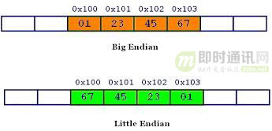

如果接收到的第一个字节作为高位字节（如上图“01”），这就要求发送时也是先发高位字节。

因此收发双方需要约定使用同样的字节序，才能正常传输。TCP就约定都用大端。

## Q：什么是SYN攻击？如何解决？

TCP 连接建立是需要三次握手，假设攻击者短时间伪造不同 IP 地址的 `SYN` 报文，服务端每接收到一个 `SYN` 报文，就进入`SYN_RCVD` 状态，但服务端发送出去的 `ACK + SYN` 报文，无法得到未知 IP 主机的 `ACK` 应答，久而久之就会**占满服务端的 SYN 接收队列（未连接队列）**，使得服务器不能为正常用户服务。

**解决**

修改 Linux 内核参数，控制队列大小和当队列满时应做什么处理。

- 当网卡接收数据包的速度大于内核处理的速度时，会有一个队列保存这些数据包。控制该队列的最大值如下参数：

```
net.core.netdev_max_backlog
```

- SYN_RCVD 状态连接的最大个数：

```
net.ipv4.tcp_max_syn_backlog
```

- 超出处理能力时，对新的 SYN 直接回报 RST，丢弃连接：

```
net.ipv4.tcp_abort_on_overflow
```

## TCP可靠传输

TCP 使用超时重传来实现可靠传输：如果一个已经发送的报文段在超时时间内没有收到确认，那么就重传这个报文段。

一个报文段从发送再到接收到确认所经过的时间称为往返时间 RTT，加权平均往返时间 RTTs 计算如下：
$$
RTTs = (1-a)*RTTs+a*RTT
$$
其中，0 ≤ a ＜ 1，RTTs 随着 a 的增加更容易受到 RTT 的影响。

超时时间 RTO 应该略大于 RTTs，TCP 使用的超时时间计算如下：
$$
RTO=RTTs+4*RTTd
$$
其中 RTTd 为偏差的加权平均值。

**【2011年 题40】**主机甲与主机乙之间已建立一个TCP连接，主机甲向主机乙发送了3个连续的TCP段，分 别包含300字节、400字节和500字节的有效载荷，第3个段的序号为900。若主机乙仅正 确接收到第1和第3个段，则主机乙发送给主机甲的确认序号是 ()

A．300     B．500     C．1200      D．1400

答案：B

TCP保证按序接收，报文1和3都接收到，缺了2，因此会要求重传2。第3个报文序号900，则根据第2个报文长度400，900-400=500，即是第2个报文的序号。期望获得该报文，则ACK=500

## TCP滑动窗口

窗口是缓存的一部分，用来暂时存放字节流。发送方和接收方各有一个窗口，接收方通过 TCP 报文段中的窗口字段告诉发送方自己的窗口大小，发送方根据这个值和其它信息设置自己的窗口大小。

发送窗口内的字节都允许被发送，接收窗口内的字节都允许被接收。如果发送窗口左部的字节已经发送并且收到了确认，那么就将发送窗口向右滑动一定距离，直到左部第一个字节不是已发送并且已确认的状态；接收窗口的滑动类似，接收窗口左部字节已经发送确认并交付主机，就向右滑动接收窗口。

接收窗口只会对窗口内最后一个按序到达的字节进行确认，例如接收窗口已经收到的字节为 {31, 34, 35}，其中 {31} 按序到达，而 {34, 35} 就不是，因此只对字节 31 进行确认。发送方得到一个字节的确认之后，就知道这个字节之前的所有字节都已经被接收。


##  TCP 流量控制

流量控制是为了控制发送方发送速率，保证接收方来得及接收。

接收方发送的确认报文中的窗口字段可以用来控制发送方窗口大小，从而影响发送方的发送速率。将窗口字段设置为 0，则发送方不能发送数据。

##  TCP 拥塞控制

如果网络出现拥塞，分组将会丢失，此时发送方会继续重传，从而导致网络拥塞程度更高。因此当出现拥塞时，应当控制发送方的速率。这一点和流量控制很像，但是出发点不同。流量控制是为了让接收方能来得及接收，而拥塞控制是为了降低整个网络的拥塞程度。


TCP 主要通过四个算法来进行拥塞控制：慢开始、拥塞避免、快重传、快恢复。

发送方需要维护一个叫做**拥塞窗口**（cwnd）的状态变量，注意拥塞窗口与发送方窗口的区别：拥塞窗口只是一个状态变量，实际决定发送方能发送多少数据的是发送方窗口。

为了便于讨论，做如下假设：

- 接收方有足够大的接收缓存，因此不会发生流量控制；
- 虽然 TCP 的窗口基于字节，但是这里设窗口的大小单位为报文段。


### 1. 慢开始与拥塞避免

发送的最初执行慢开始，令 cwnd = 1，发送方只能发送 1 个报文段；当收到确认后，将 cwnd 加倍，因此之后发送方能够发送的报文段数量为：2、4、8 ...

注意到慢开始每个轮次都将 cwnd 加倍，这样会让 cwnd 增长速度非常快，从而使得发送方发送的速度增长速度过快，网络拥塞的可能性也就更高。设置一个慢开始门限 ssthresh，当 cwnd >= ssthresh 时，进入拥塞避免，每个轮次只将 cwnd 加 1。

如果出现了超时，则令 ssthresh = cwnd / 2，然后重新执行慢开始。

### 2. 快重传与快恢复

在接收方，要求每次接收到报文段都应该对最后一个已收到的有序报文段进行确认。例如已经接收到 M1 和 M2，此时收到 M4，应当发送对 M2 的确认。

在发送方，如果收到三个重复确认，那么可以知道下一个报文段丢失，此时执行快重传，立即重传下一个报文段。例如收到三个 M2，则 M3 丢失，立即重传 M3。

在这种情况下，只是丢失个别报文段，而不是网络拥塞。因此执行快恢复，令 ssthresh = cwnd / 2 ，cwnd = ssthresh，注意到此时直接进入拥塞避免。

慢开始和快恢复的快慢指的是 cwnd 的设定值，而不是 cwnd 的增长速率。慢开始 cwnd 设定为 1，而快恢复 cwnd 设定为 ssthresh。


# 传输层-UDP

## UDP 首部格式


首部字段只有 8 个字节，包括源端口、目的端口、长度（报文长度）、检验和。

- **源端口**：16bit，表示0~65535号端口

- **目的端口**：16bit，表示0~65535号端口

- **长度**：16bit，表示报文的**字节数**

- **检验和**：

伪首部：12 字节，为计算**检验和**临时添加，发送时去除。包含IP首部的一些字段。

## Q：TCP和UDP不同？ 

|                | TCP                                                          | UDP                                                          |
| -------------- | ------------------------------------------------------------ | ------------------------------------------------------------ |
| 面向           | 字节流（把应用层传下来的报文看成字节流，把字节流组织成大小不等的数据块） | 报文（对于应用程序传下来的报文不合并也不拆分，只是添加 UDP 首部） |
| 连接           | 面向连接                                                     | 无连接                                                       |
| 交付           | 可靠交付（不丢失，有序）                                     | 不可靠， 尽最大可能交付                                      |
| 拥塞控制       | 有                                                           | 无                                                           |
|                | 全双工                                                       |                                                              |
|                | 点对点（一对一）                                             | 一对一、一对多、多对一、多对多                               |
| 报文最大长度   | 无上限（TCP首部的序号并未限制长度）。但建议不超过IP分片限制（1500-ip头20=1480） | 65536（UDP首部的长度字段16bit）                              |
| 首部           | 不定长，20~60字节（选项部分可选）                            | 定长，8字节                                                  |
| 伪首部         | 协议位：6                                                    | 协议位：17                                                   |
| 首部的长度字段 | 4bit，指示首部长度（字节数）                                 | 2bit，指示报文长度                                           |

## Q：什么是TCP拆包、粘包？

UDP对上层（应用层）报文直接加首部处理，既不合并也不拆分，因此说UDP协议是面向报文的

而TCP面向字节流，将应用层数据视为一连串字节流，并无具体含义，编号仅是为了传输。因此发送时，可能会将有具体含义的某段字节流拆分为多个TCP段（包），称为**拆包**。反之，将某几段字节流合并为一个TCP段，称为**粘包**。

两种解决：

1. 对每个包，包开头指明实际长度
2. 将每个包封装为固定长度，不足的填充

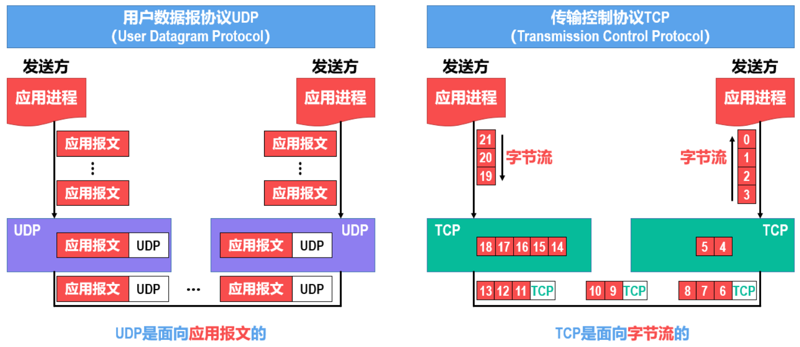


# 应用层-HTTP

## HTTP头部

是HTTP报文的一部分

### 1.通用头

是客户端和服务器都可以使用的头部，可以在客户端、服务器和其他应用程序之间提供一些非常有用的通用功能

|    首部字段名     |                    说明                    |
| :---------------: | :----------------------------------------: |
|   Cache-Control   |               控制缓存的行为               |
|    Connection     | 控制不再转发给代理的首部字段、管理持久连接 |
|       Date        |             创建报文的日期时间             |
|      Pragma       |                  报文指令                  |
|      Trailer      |             报文末端的首部一览             |
| Transfer-Encoding |         指定报文主体的传输编码方式         |
|      Upgrade      |               升级为其他协议               |
|        Via        |            代理服务器的相关信息            |
|      Warning      |                  错误通知                  |

### 2.请求头

是请求报文特有的，它们为服务器提供了一些额外信息，比如客户端希望接收什么类型的数据

|     首部字段名      |                      说明                       |
| :-----------------: | :---------------------------------------------: |
|       Accept        |            用户代理可处理的媒体类型             |
|   Accept-Charset    |                  优先的字符集                   |
|   Accept-Encoding   |                 优先的内容编码                  |
|   Accept-Language   |             优先的语言（自然语言）              |
|    Authorization    |                  Web 认证信息                   |
|       Expect        |              期待服务器的特定行为               |
|        From         |               用户的电子邮箱地址                |
|        Host         |               请求资源所在服务器                |
|      If-Match       |              比较实体标记（ETag）               |
|  If-Modified-Since  |               比较资源的更新时间                |
|    If-None-Match    |        比较实体标记（与 If-Match 相反）         |
|      If-Range       |      资源未更新时发送实体 Byte 的范围请求       |
| If-Unmodified-Since | 比较资源的更新时间（与 If-Modified-Since 相反） |
|    Max-Forwards     |                 最大传输逐跳数                  |
| Proxy-Authorization |         代理服务器要求客户端的认证信息          |
|        Range        |               实体的字节范围请求                |
|       Referer       |            对请求中 URI 的原始获取方            |
|         TE          |                传输编码的优先级                 |
|     User-Agent      |              HTTP 客户端程序的信息              |

### 3.响应头

便于客户端提供信息，比如，客服端在与哪种类型的服务器进行交互

|     首部字段名     |             说明             |
| :----------------: | :--------------------------: |
|   Accept-Ranges    |     是否接受字节范围请求     |
|        Age         |     推算资源创建经过时间     |
|        ETag        |        资源的匹配信息        |
|      Location      |   令客户端重定向至指定 URI   |
| Proxy-Authenticate | 代理服务器对客户端的认证信息 |
|    Retry-After     |   对再次发起请求的时机要求   |
|       Server       |    HTTP 服务器的安装信息     |
|        Vary        |   代理服务器缓存的管理信息   |
|  WWW-Authenticate  |   服务器对客户端的认证信息   |

### 4.实体头

指的是用于应对实体主体部分的头部，比如，可以用实体头部来说明实体主体部分的数据类型

|    首部字段名    |          说明          |
| :--------------: | :--------------------: |
|      Allow       | 资源可支持的 HTTP 方法 |
| Content-Encoding | 实体主体适用的编码方式 |
| Content-Language |   实体主体的自然语言   |
|  Content-Length  |     实体主体的大小     |
| Content-Location |   替代对应资源的 URI   |
|   Content-MD5    |   实体主体的报文摘要   |
|  Content-Range   |   实体主体的位置范围   |
|   Content-Type   |   实体主体的媒体类型   |
|     Expires      | 实体主体过期的日期时间 |
|  Last-Modified   | 资源的最后修改日期时间 |

## 请求报文

客户端发送一个请求报文给服务器，服务器根据请求报文中的信息进行处理，并将处理结果放入响应报文中返回给客户端。

请求报文结构：

- 第一行是包含了请求方法、URL、协议版本；
- 接下来的多行都是请求首部 Header，每个首部都有一个首部名称，以及对应的值。
- 一个**空行**用来分隔首部和内容主体 Body
- 最后是请求的内容主体（13行

```text
GET http://www.example.com/ HTTP/1.1
Accept: text/html,application/xhtml+xml,application/xml;q=0.9,image/webp,image/apng,*/*;q=0.8,application/signed-exchange;v=b3;q=0.9
Accept-Encoding: gzip, deflate
Accept-Language: zh-CN,zh;q=0.9,en;q=0.8
Cache-Control: max-age=0
Host: www.example.com
If-Modified-Since: Thu, 17 Oct 2019 07:18:26 GMT
If-None-Match: "3147526947+gzip"
Proxy-Connection: keep-alive
Upgrade-Insecure-Requests: 1
User-Agent: Mozilla/5.0 xxx

param1=1&param2=2
```

## 响应报文

服务器返回给客户端的报文

- 第一行包含协议版本、状态码以及描述，最常见的是 200 OK 表示请求成功了
- 接下来多行也是首部内容
- 一个**空行**分隔首部和内容主体
- 最后是响应的内容主体（18行

```text
HTTP/1.1 200 OK
Age: 529651
Cache-Control: max-age=604800
Connection: keep-alive
Content-Encoding: gzip
Content-Length: 648
Content-Type: text/html; charset=UTF-8
Date: Mon, 02 Nov 2020 17:53:39 GMT
Etag: "3147526947+ident+gzip"
Expires: Mon, 09 Nov 2020 17:53:39 GMT
Keep-Alive: timeout=4
Last-Modified: Thu, 17 Oct 2019 07:18:26 GMT
Proxy-Connection: keep-alive
Server: ECS (sjc/16DF)
Vary: Accept-Encoding
X-Cache: HIT

<!doctype html>
<html>
<head>
    <title>Example Domain</title>
	// 省略... 
</body>
</html>
```

## URL

HTTP 使用 URL（ **U** niform **R**esource **L**ocator，统一资源定位符）来定位资源，它是 URI（**U**niform **R**esource **I**dentifier，统一资源标识符）的子集，URL 在 URI 的基础上增加了定位能力。

URN（Uniform Resource Name，统一资源名称），也是URI的子集，它只是用来定义一个资源的名称，并不具备定位该资源的能力。例如 urn:isbn:0451450523 用来定义一个书籍名称，但是却没有表示怎么找到这本书。


## HTTP方法

HTTP/1.0 定义了三种：GET, POST 和 HEAD 

HTTP/1.1 增加了六种：OPTIONS, PUT, PATCH, DELETE, TRACE 和 CONNECT

| 方法                                   | 描述                                                         |
| :------------------------------------- | ------------------------------------------------------------ |
| GET                                    | 请求指定的页面信息，并返回具体内容，通常只用于读取数据。     |
| POST                                   | 向指定资源提交数据进行处理请求（例如提交表单或者上传文件）。数据被包含在请求体中。POST 请求可能会导致新的资源的建立或已有资源的更改。 |
| HEAD                                   | 类似于 GET 请求，只不过返回的响应中没有具体的内容，用于获取报头，确认 URL 的有效性以及资源更新的日期时间等。 |
| =================HTTP1.1新增========== | ======================HTTP1.1新增=======================     |
| PUT                                    | 替换 URL 标识的资源（如文件等），没有的话就新增，**不带验证机制**。（不安全） |
| DELETE                                 | 请求服务器删除资源数据，同样不带验证机制。（不安全）         |
| PATCH                                  | 是对 PUT 方法的补充，用来对已知资源进行**局部更新**（PUT只能完全替换）。（不安全） |
| CONNECT                                | 将服务器作为**代理**，建立隧道让服务器代替用户进行访问。使用 SSL（Secure Sockets Layer，安全套接层）和 TLS（Transport Layer Security，传输层安全）协议把通信内容加密后经网络隧道传输。 |
| OPTIONS                                | 查询指定的 URL 能够支持的 HTTP 请求方法。例如会返回 `Allow: GET, POST, HEAD, OPTIONS` 这样的内容。 |
| TRACE                                  | 回显服务器收到的请求数据，即服务器返回自己收到的数据，主要用于测试和诊断。（不安全，容易受到 XST 攻击） |

put示例：

```html
PUT /new.html HTTP/1.1
Host: example.com
Content-type: text/html
Content-length: 16

<p>New File</p>
```

patch示例：

```html
PATCH /file.txt HTTP/1.1
Host: www.example.com
Content-Type: application/example
If-Match: "e0023aa4e"
Content-Length: 100

[description of changes]
```

delete示例：

```html
DELETE /file.html HTTP/1.1
```

## HTTP状态码

服务器返回的 **响应报文** 中第一行为状态行，包含了状态码以及原因短语，用来告知客户端请求的结果。

| 状态码 |            类别            |            含义            |
| :----: | :------------------------: | :------------------------: |
|  1XX   |   Informational（信息）    |     接收的请求正在处理     |
|  2XX   |      Success（成功）       |      请求正常处理完毕      |
|  3XX   |   Redirection（重定向）    | 需要进行附加操作以完成请求 |
|  4XX   | Client Error（客户端错误） |     服务器无法处理请求     |
|  5XX   | Server Error（服务器错误） |     服务器处理请求出错     |

### 1XX 信息

- **100 Continue** ：表明到目前为止都很正常，客户端可以继续发送请求或者忽略这个响应。
- 101 协议切换：例如从HTTP切换为Websocket

### 2XX 成功

- **200 OK**
- **204 No Content** ：请求已经成功处理，但是返回的响应报文不包含实体的主体部分。一般在只需要从客户端往服务器发送信息，而不需要返回数据时使用。
- **206 Partial Content** ：表示客户端进行了范围请求，响应报文包含由 Content-Range 指定范围的实体内容。

### 3XX 重定向

指当浏览器请求一个URL时，服务器返回一个重定向指令，告诉浏览器地址已经变了，麻烦使用新的URL再重新发送新请求。

**过程**

如果浏览器发送`GET /hi`请求，Spring的`RedirectServlet`将处理此请求。由于`RedirectServlet`在内部又发送了重定向响应，因此，浏览器会收到如下响应：

```
HTTP/1.1 302 Found
Location: /hello
```

当浏览器收到302响应后，它会立刻根据`Location`的指示发送一个新的`GET /hello`请求。

```ascii
┌───────┐   GET /hi     ┌───────────────┐
│Browser│ ────────────> │RedirectServlet│
│       │ <──────────── │               │
└───────┘   302         └───────────────┘


┌───────┐  GET /hello   ┌───────────────┐
│Browser│ ────────────> │ HelloServlet  │
│       │ <──────────── │               │
└───────┘   200 <html>  └───────────────┘
```

观察Chrome浏览器的网络请求，可以看到两次HTTP请求，并且浏览器的地址栏路径自动更新为`/hello`：

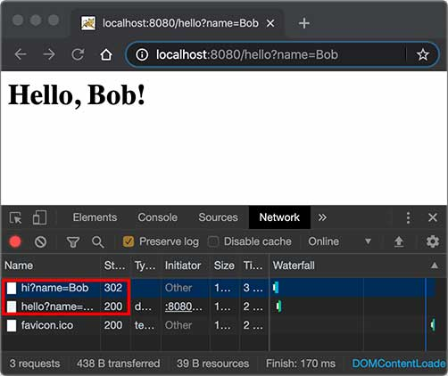

**注意**：301和302区别：如果服务器发送301，浏览器会**缓存**`/hi`到`/hello`这个重定向的关联，下次请求`/hi`的时候，浏览器就直接发送`/hello`请求了。

- **301 Moved Permanently** ：永久性重定向
- **302 Found** ：临时性重定向
- **303 See Other** ：和 302 有着相同的功能，但是 303 明确要求客户端应该采用 GET 方法获取资源。
- 注：虽然 HTTP 协议规定 301、302 状态下重定向时不允许把 POST 方法改成 GET 方法，但是大多数浏览器都会在 301、302 和 303 状态下的重定向把 POST 方法改成 GET 方法。
- **304 Not Modified** ：如果请求报文首部包含一些条件，例如：If-Match，If-Modified-Since，If-None-Match，If-Range，If-Unmodified-Since，如果不满足条件，则服务器会返回 304 状态码。
- **307 Temporary Redirect** ：临时重定向，与 302 的含义类似，但是 307 要求浏览器不会把重定向请求的 POST 方法改成 GET 方法。

### 4XX 客户端错误

- **400 Bad Request** ：请求报文中存在语法错误。
- **401 Unauthorized** ：该状态码表示发送的请求需要有认证信息（BASIC 认证、DIGEST 认证）。如果之前已进行过一次请求，则表示用户认证失败。
- **403 Forbidden** ：请求被拒绝。
- **404 Not Found**：服务器上没有找到请求的资源

### 5XX 服务器错误

- **500 Internal Server Error** ：服务器正在执行请求时发生错误。
- **503 Service Unavailable** ：服务器暂时处于超负载或正在进行停机维护，现在无法处理请求。

## 连接管理

****


**短连接与长连接**

当浏览器访问一个包含多张图片的 HTML 页面时，除了请求访问的 HTML 页面资源，还会请求图片资源。如果每进行一次 HTTP 通信就要新建一个 TCP 连接，那么开销会很大。

长连接只需要建立一次 TCP 连接就能进行多次 HTTP 通信。

- 从 HTTP/1.1 开始默认是长连接的，如果要断开连接，需要由客户端或者服务器端提出断开，使用 `Connection : close`；
- 在 HTTP/1.1 之前默认是短连接的，如果需要使用长连接，则使用 `Connection : Keep-Alive`。

**流水线**

默认情况下，HTTP 请求是按顺序发出的，下一个请求只有在当前请求收到响应之后才会被发出。由于受网络延迟和带宽的限制，在下一个请求被发送到服务器之前，可能需要等待很长时间。

流水线：同一条长连接上连续发出请求，而不用等待响应返回，这样可以减少延迟。

## Session

Session 是浏览器和服务器会话过程中，服务器会分配的一块储存空间 。

因为HTTP协议是一个无状态协议，即Web应用程序无法区分收到的两个HTTP请求是否是同一个浏览器发出的。为了跟踪用户状态，服务器可以向浏览器分配一个唯一ID，并以Cookie的形式发送到浏览器，浏览器在后续访问时总是附带此Cookie，这样，服务器就可以识别用户身份。

**Session机制**

指这种基于唯一ID识别用户身份的机制。每个用户第一次访问服务器后，会自动获得一个Session ID（即发送给浏览器的Cookie）。如果用户在一段时间内没有访问服务器，那么Session会自动失效，下次即使带着上次分配的Session ID访问，服务器也认为这是一个新用户，会分配新的Session ID。

### java操作

JavaEE的Servlet机制内建了对Session的支持。我们以登录为例，当一个用户登录成功后，我们就可以把这个用户的名字放入一个`HttpSession`对象，以便后续访问其他页面的时候，能直接从`HttpSession`取出用户名：

```java
@WebServlet(urlPatterns = "/signin")
public class SignInServlet extends HttpServlet {
    // 模拟一个数据库:
    private Map<String, String> users = Map.of("bob", "bob123", "alice", "alice123", "tom", "tomcat");

    // POST请求时处理用户登录:
    protected void doPost(HttpServletRequest req, HttpServletResponse resp) throws ServletException, IOException {
        String name = req.getParameter("username");
        String password = req.getParameter("password");
        String expectedPassword = users.get(name.toLowerCase());
        if (expectedPassword != null && expectedPassword.equals(password)) {
            // 判断用户登录成功后，立刻将用户名放入当前HttpSession中
            req.getSession().setAttribute("user", name);
            resp.sendRedirect("/");
        } else {
            resp.sendError(HttpServletResponse.SC_FORBIDDEN);
        }
    }
}
```

服务器识别Session的关键就是依靠一个名为`JSESSIONID`的Cookie。在Servlet中第一次调用`req.getSession()`时，Servlet容器自动创建一个Session ID，然后通过一个名为`JSESSIONID`的Cookie发送给浏览器：


除了可以将用户信息通过 Cookie 存储在用户浏览器中，也可以利用 Session 存储在服务器端，存储在服务器端的信息更加安全。

Session 可以存储在服务器上的文件、数据库或者内存中。也可以将 Session 存储在 Redis 这种内存型数据库中，效率会更高。

## Cookie

因为HTTP 协议是无状态的，HTTP/1.1 引入 Cookie 来保存状态信息，是服务器发送到**用户浏览器**并保存在**本地**的一小块数据，它会在浏览器之后向同一服务器再次发起请求时被携带上，用于告知服务端两个请求是否来自同一浏览器。

Cookie是Session机制的一种实现方式（其他实现还有隐藏表单、URL末尾附加ID等，但不如Cookie常用）。实际上，Servlet提供的`HttpSession`本质上就是通过一个名为`JSESSIONID`的Cookie来跟踪用户会话的。除了这个名称外，其他名称的Cookie我们可以任意使用。

Cookie 曾一度用于客户端数据的存储，现已淘汰。新的浏览器 API 已经允许开发者直接将数据存储到本地，如使用 Web storage API（本地存储和会话存储）或 IndexedDB。


### 创建过程

服务器发送的响应报文中包含首部字段： Set-Cookie 。客户端得到响应报文后把 Cookie 内容保存到浏览器中。

```html
HTTP/1.0 200 OK
Content-type: text/html
Set-Cookie: yummy_cookie=choco
Set-Cookie: tasty_cookie=strawberry

[page content]
```

客户端之后对同一个服务器发送请求时，会从浏览器中取出 Cookie 信息并通过 Cookie 请求首部字段发送给服务器。

```html
GET /sample_page.html HTTP/1.1
Host: www.example.org
Cookie: yummy_cookie=choco; tasty_cookie=strawberry
```

### 持久性 Cookie

- 会话期 Cookie：浏览器关闭之后它会被自动删除，也就是说它仅在会话期内有效。
- 持久性 Cookie：指定过期时间（Expires）或有效期（max-age）之后就成为了持久性的 Cookie。

```html
Set-Cookie: id=a3fWa; Expires=Wed, 21 Oct 2015 07:28:00 GMT;
```

### java操作

如果我们想要设置一个Cookie，例如，记录用户选择的语言，可以编写一个`LanguageServlet`：

```java
@WebServlet(urlPatterns = "/pref")
public class LanguageServlet extends HttpServlet {

    private static final Set<String> LANGUAGES = Set.of("en", "zh");

    protected void doGet(HttpServletRequest req, HttpServletResponse resp) throws ServletException, IOException {
        String lang = req.getParameter("lang");
        if (LANGUAGES.contains(lang)) {
            // 创建一个新的Cookie:
            Cookie cookie = new Cookie("lang", lang);
            // 该Cookie生效的路径范围:
            cookie.setPath("/");
            // 该Cookie有效期:
            cookie.setMaxAge(8640000); // 8640000秒=100天
            // 将该Cookie添加到响应:
            resp.addCookie(cookie);
            // 如果访问的是https网页，还需要调用setSecure(true)，否则浏览器不会发送该Cookie。
        }
        resp.sendRedirect("/");
    }
}
```

读取Cookie主要依靠遍历`HttpServletRequest`附带的所有Cookie。

```java
private String parseLanguageFromCookie(HttpServletRequest req) {
    // 获取请求附带的所有Cookie:
    Cookie[] cookies = req.getCookies();
    // 如果获取到Cookie:
    if (cookies != null) {
        // 循环每个Cookie:
        for (Cookie cookie : cookies) {
            // 如果Cookie名称为lang:
            if (cookie.getName().equals("lang")) {
                // 返回Cookie的值:
                return cookie.getValue();
            }
        }
    }
    // 返回默认值:
    return "en";
}
```

### 浏览器禁用 Cookie

此时无法使用 Cookie 保存用户信息，只能用 Session。

此外，不能再将 Session ID 存放到 Cookie 中，而是使用 **URL 重写技术**，将 Session ID 作为 URL 的参数进行传递。

### 安全性问题

存储在浏览器中，容易被恶意查看

### 服务器集群问题

多台服务器集群使用反向代理作为网站入口：

```ascii
                                     ┌────────────┐
                                ┌───>│Web Server 1│
                                │    └────────────┘
┌───────┐     ┌─────────────┐   │    ┌────────────┐
│Browser│────>│Reverse Proxy│───┼───>│Web Server 2│
└───────┘     └─────────────┘   │    └────────────┘
                                │    ┌────────────┐
                                └───>│Web Server 3│
                                     └────────────┘
```

如果多台Web Server采用无状态集群，那么反向代理总是以轮询方式将请求依次转发给每台Web Server，这会造成一个用户在Web Server 1存储的Session信息，在Web Server 2和3上并不存在，即从Web Server 1登录后，如果后续请求被转发到Web Server 2或3，那么用户看到的仍然是未登录状态。

**解决**

- 方案一：在所有Web Server之间进行**Session复制**，但这样会严重消耗网络带宽，并且，每个Web Server的内存均存储所有用户的Session，内存使用率很低。
- 方案二：采用**粘滞会话**（Sticky Session）机制，即反向代理在转发请求的时候，总是根据JSESSIONID的值判断，相同的JSESSIONID总是转发到固定的Web Server，但这需要反向代理的支持。

无论采用何种方案，使用Session机制，会使得Web Server的集群很难扩展，因此，Session适用于中小型Web应用程序。**对于大型Web应用程序来说，通常需要避免使用Session机制**。

### **使用 Session 维护用户登录状态**

**Session存服务端redis，客户端只存Session ID（放Cookie）**

- 用户进行登录时，用户提交包含用户名和密码的表单，放入 HTTP 请求报文中；
- 服务器验证该用户名和密码，如果正确则把用户信息存储到 Redis 中，它在 Redis 中的 Key 称为 Session ID；
- 服务器返回的响应报文的 Set-Cookie 首部字段包含了这个 Session ID（需要考虑安全性，不能让它被恶意攻击者轻易获取），客户端收到响应报文之后将该 Cookie 值存入浏览器中；
- 客户端之后对同一个服务器进行请求时会包含该 Cookie 值，服务器收到之后提取出 Session ID，从 Redis 中取出用户信息，继续之前的业务操作。

## Q：Cookie与Session比较？

|          | Cookie                                            | 客户端Session                                       | 服务端Session                               |
| -------- | ------------------------------------------------- | --------------------------------------------------- | ------------------------------------------- |
| 格式     | ASCII码字符串                                     | 字符串                                              | 任意类型（但本质上还是字符串）              |
| 大小     | 4KB                                               | 5MB（在浏览器中称sessionStorage）                   | 无上限                                      |
| 生命周期 | 过期时间 之前，一直有效（页面或浏览器关闭后失效） | 过期时间 之前，一直有效；（页面或浏览器关闭后失效） | 一直有效（服务器程序终止后失效）            |
| 存储位置 | 浏览器（客户端）                                  | 浏览器（客户端）                                    | 服务器上（文件、数据库或者内存，甚至Redis） |
| 安全性   | 差，易被恶意查看（解决：加密，在服务器解密）      |                                                     | 好，因为不存客户端。可以安全存放用户信息    |
| 用途     | 会话状态管理、个性化设置、浏览器行为跟踪          |                                                     | 同Cookie                                    |

## 缓存

### 优点

- 缓解服务器压力；
- 降低客户端获取资源的延迟：缓存通常位于内存中，读取缓存的速度更快。并且缓存服务器在地理位置上也有可能比源服务器来得近，例如浏览器缓存。

### 实现方法

- 让代理服务器进行缓存；
- 让客户端浏览器进行缓存。

### Cache-Control

HTTP/1.1 通过 Cache-Control 首部字段来控制缓存。

**1 禁止进行缓存**

no-store 指令规定不能对请求或响应的任何一部分进行缓存。

```html
Cache-Control: no-store
```

**2 强制确认缓存**

no-cache 指令规定缓存服务器需要先向源服务器验证缓存资源的有效性，只有当缓存资源有效时才能使用该缓存对客户端的请求进行响应。

```html
Cache-Control: no-cache
```

**3 私有缓存和公共缓存**

private 指令规定了将资源作为私有缓存，只能被单独用户使用，一般存储在用户浏览器中。

```html
Cache-Control: private
```

public 指令规定了将资源作为公共缓存，可以被多个用户使用，一般存储在代理服务器中。

```html
Cache-Control: public
```

**4 缓存过期机制**

max-age 指令出现在请求报文，并且缓存资源的缓存时间小于该指令指定的时间，那么就能接受该缓存。

max-age 指令出现在响应报文，表示缓存资源在缓存服务器中保存的时间。

```html
Cache-Control: max-age=31536000
```

Expires 首部字段也可以用于告知缓存服务器该资源什么时候会过期。

```html
Expires: Wed, 04 Jul 2012 08:26:05 GMT
```

- 在 HTTP/1.1 中，会优先处理 max-age 指令；
- 在 HTTP/1.0 中，max-age 指令会被忽略掉。

### 内容协商

通过内容协商返回最合适的内容，例如根据浏览器的默认语言选择返回中文界面还是英文界面。

**类型**

**1.1 服务端驱动型**

客户端设置特定的 HTTP 首部字段，例如 Accept、Accept-Charset、Accept-Encoding、Accept-Language，服务器根据这些字段返回特定的资源。

它存在以下问题：

- 服务器很难知道客户端浏览器的全部信息；
- 客户端提供的信息相当冗长（HTTP/2 协议的首部压缩机制缓解了这个问题），并且存在隐私风险（HTTP 指纹识别技术）；
- 给定的资源需要返回不同的展现形式，共享缓存的效率会降低，而服务器端的实现会越来越复杂。

**1.2 代理驱动型**

服务器返回 300 Multiple Choices 或者 406 Not Acceptable，客户端从中选出最合适的那个资源。

**Vary**

```html
Vary: Accept-Language
```

在使用内容协商的情况下，只有当缓存服务器中的缓存满足内容协商条件时，才能使用该缓存，否则应该向源服务器请求该资源。

例如，一个客户端发送了一个包含 Accept-Language 首部字段的请求之后，源服务器返回的响应包含 `Vary: Accept-Language` 内容，缓存服务器对这个响应进行缓存之后，在客户端下一次访问同一个 URL 资源，并且 Accept-Language 与缓存中的对应的值相同时才会返回该缓存。

## 内容编码

浏览器发送 Accept-Encoding 首部，其中包含有它所支持的压缩算法，以及各自的优先级。服务器则从中选择一种，使用该算法对响应的消息主体进行压缩，并且发送 Content-Encoding 首部来告知浏览器它选择了哪一种算法。由于该内容协商过程是基于编码类型来选择资源的展现形式的，响应报文的 Vary 首部字段至少要包含 Content-Encoding。

常见编码：gzip、compress、deflate、identity

## 范围请求

如果网络出现中断，服务器只发送了一部分数据，范围请求可以使得客户端只请求服务器未发送的那部分数据，从而避免服务器重新发送所有数据。

**1.Range**

在请求报文中添加 Range 首部字段指定请求的范围。

```html
GET /z4d4kWk.jpg HTTP/1.1
Host: i.imgur.com
Range: bytes=0-1023
```

请求成功的话服务器返回的响应包含 206 Partial Content 状态码。

```html
HTTP/1.1 206 Partial Content
Content-Range: bytes 0-1023/146515
Content-Length: 1024
...
(binary content)
```

**2.Accept-Ranges**

响应首部字段 Accept-Ranges 用于告知客户端是否能处理范围请求，可以处理使用 bytes，否则使用 none。

```html
Accept-Ranges: bytes
```

**3.响应状态码**

- 在请求成功的情况下，服务器会返回 206 Partial Content 状态码。
- 在请求的范围越界的情况下，服务器会返回 416 Requested Range Not Satisfiable 状态码。
- 在不支持范围请求的情况下，服务器会返回 200 OK 状态码。

## 分块传输编码

Chunked Transfer Encoding，可以把数据分割成多块，让浏览器逐步显示页面。

## 多部分对象集合

一份报文主体内可含有多种类型的实体同时发送，每个部分之间用 boundary 字段定义的分隔符进行分隔，**每个部分**都可以有首部字段。

例如，上传多个表单时可以使用如下方式

```html
Content-Type: multipart/form-data; boundary=AaB03x

--AaB03x
Content-Disposition: form-data; name="submit-name"

Larry
--AaB03x
Content-Disposition: form-data; name="files"; filename="file1.txt"
Content-Type: text/plain

... contents of file1.txt ...
--AaB03x--
```

第一行是首部，表示是多部份对象，边界分隔符是“AaB03x”

第3行 表示一个部分对象的起始边界，第4行是其首部，名称为“submit-name”，内容是Larry

第7行 表示另一个部分对象的起始边界，第8行是其首部，表示名称为“files”，文件名为“file1.txt”，11行开始是文件内容

第12行表示多部份的结束，在分隔符之后加上“--”

## 通信数据转发

**1.代理**

代理服务器接受客户端的请求，并且转发给其它服务器。

使用代理的主要目的是：

- 缓存
- 负载均衡
- 网络访问控制
- 访问日志记录

代理服务器分为正向代理和反向代理两种

- 正向代理：客户端请求经过代理到达服务器，服务器不知道真正的客户端是谁
- 反向代理：服务器响应经过代理到达客户端，客户端不知道真正的服务器是谁


**2.网关**

与代理服务器不同的是，网关服务器会将 HTTP 转化为其它协议进行通信，从而请求其它非 HTTP 服务器的服务。

**3.隧道**

使用 SSL 等加密手段，在客户端和服务器之间建立一条安全的通信线路。


## HTTP1.1

### Q：HTTP1.0与HTTP1.1比较？

|          | HTTP1.0                                                      | HTTP1.1                                                      |
| -------- | :----------------------------------------------------------- | ------------------------------------------------------------ |
| 连接长短 | 一次请求-响应，建立一个连接，用完关闭；每一个请求都要建立一个连接 | 默认**长连接**，完成一次HTTP请求和响应后，可以接着复用该连接；但必须**串行**（一个连接不能同时发送多个请求）。 |
| 连接数   | 一个                                                         | 支持同时打开**多个 TCP 连接**。连接数没有具体限制，但浏览器会限制，如Chrome 最多允许对同一个 Host 建立 **6个** TCP 连接 |
| 方法     | 定义三种方法：GET, POST 和 HEAD                              | 增加了六种：OPTIONS, PUT, PATCH, DELETE, TRACE 和 CONNECT    |
| 状态码   |                                                              | 新增状态码 100（表示信息）                                   |
| 新特性   |                                                              | 支持**分块传输**编码                                         |
| 新特性   |                                                              | 支持虚拟主机（一台服务器拥有多个域名，在逻辑上可以看成多个服务器） |
| 新特性   |                                                              | 新增缓存处理指令 max-age                                     |
| 新特性   |                                                              | 连接支持流水线（`Pipelining`字段，又称管道机制）：连接内同时发出多个请求，不用一个个等待响应 |

### Q：短连接、长连接、管道机制和并行连接的区别？

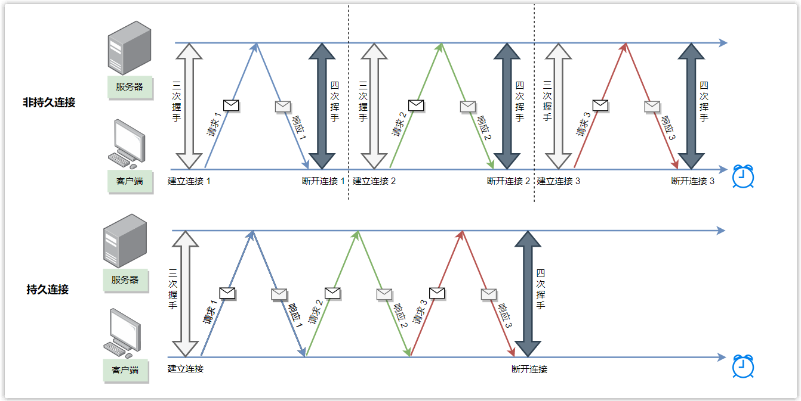

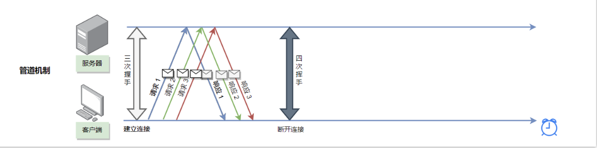

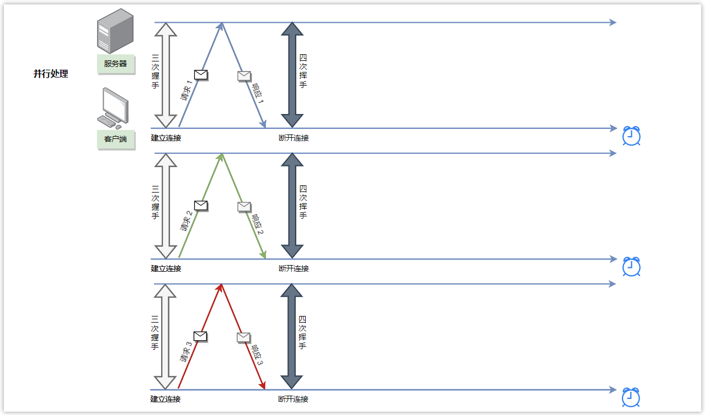

**管道机制**

连接内同时发出多个请求，不用一个个等待响应。

**管道的缺点：队头堵塞**

虽然请求可以连续发出，但服务器必须按照接收请求的顺序依次发送对这些管道化请求的响应，以保证客户端能够区分出每次请求的响应内容。（原因大概是 HTTP/1.1 是个文本协议，只看返回报文无法确定是哪个请求的返回）

如果服务端在处理一个请求时耗时比较长，那么后续请求的处理都会被阻塞住，会导致客户端迟迟收不到数据

实际上，虽然管道机制的想法很好，但实现困难，因而很多浏览器不支持。一般为了提升性能，采用**并行多个 TCP 连接**的形式来实现请求的同时发送。

## HTTPS

HTTP 有以下三个安全性问题：

1. 使用明文进行通信，内容可能会被窃听；
2. 不验证通信方的身份，通信方的身份有可能遭遇伪装；
3. 无法证明报文的完整性，报文有可能遭篡改。

HTTPS 并不是新协议，而是让 HTTP 先和 **SSL**（Secure Sockets Layer）通信，再由 SSL 和 TCP 通信，即 HTTPS 使用隧道通信。


**TLS**（Transport Layer Security）基于SSL3.0设计，以下SSL/TLS都指的是同一协议。

通过SSL，HTTPS 解决了上述三个安全性问题，具有了加密（防窃听）、认证（防伪装）和完整性保护（防篡改）。

### TLS 四次握手

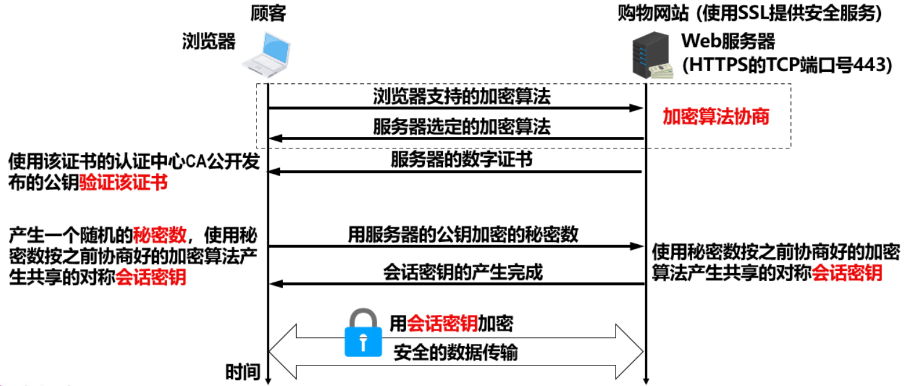

- 前两次握手：加密算法协商。

  1. Client Hello：浏览器向服务器发送一些可选的加密算法，以及【客户端随机数】。

  2. Server Hello：服务器从这些加密算法中选出自己支持的算法告知浏览器，并发送一个包含其公钥的**数字证书** 和 【服务端随机数】。

     浏览器用该证书的认证中心CA公开发布的公钥对该证书进行验证，验证通过后才进行下一步。

- 后两次握手：产生**会话密钥**。使用**非对称加密算法**计算，即浏览器选择一个随机数`pre_master_key`，用公钥加密后发送，服务器用私钥解密得到该`pre_master_key`。

  此时双方都掌握三个随机数：【客户端随机数】、【服务端随机数】和`pre_master_key`，用这三个随机数计算得到会话密钥。

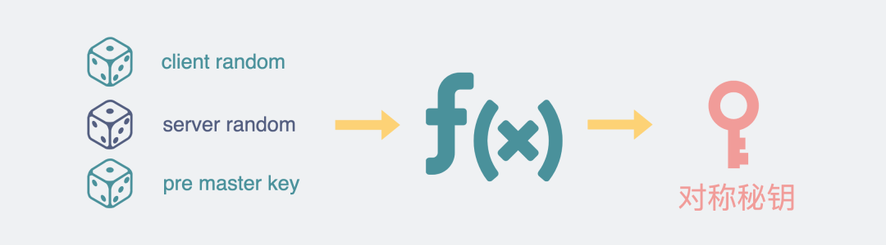

之后就建立了用会话密钥**对称加密**的安全传输连接

### 加密

**1.对称密钥加密**（Symmetric-Key Encryption），加密和解密使用**同一密钥**。

- 优点：运算速度快；
- 缺点：无法安全地将密钥传输给通信方。
- 常用算法：AES

**2.非对称密钥加密**，又称公开密钥加密（Public-Key Encryption），加密和解密使用**不同的密钥**。

- 加密【公加私解】：公开密钥所有人都可以获得，通信发送方获得接收方的公钥之后，用公钥加密，接收方收到通信内容后使用私有密钥解密。

- 签名【私加公解】：还可用来签名，过程与加密相反。因为私钥无法被其他人获取，因此发送方使用其私钥签名，接收方使用发送方的公钥对签名解密，就能判断这个签名是否正确，即是否发送方发出的，其他人由于没有私钥不能伪造，此外发送方也无法抵赖。


- 优点：可以更安全地将公开密钥传输给通信发送方；
- 缺点：运算速度慢。
- 常用算法：RSA

**3.HTTPS 采用的加密方式：混合加密（RSA+AES）**

- 先使用非对称密钥加密（如RSA），传输对称密钥加密方式（如AES）需要的 Secret Key，从而保证安全性;
- 获取到 Secret Key 后，再使用对称密钥加密方式进行通信，从而保证效率。

实际中也可以不将密钥和数据分开加密，整体先RSA再AES，与接收端约定好即可。

### 认证

通过使用 **证书** 来对通信方进行认证。

数字证书认证机构（CA，Certificate Authority）是客户端与服务器双方都可信赖的第三方机构。

服务器的运营人员向 CA 提出公开密钥的申请，CA 在判明提出申请者的身份之后，会对已申请的公开密钥做数字签名，然后分配这个已签名的公开密钥，并将该公开密钥放入公开密钥证书后**绑定**在一起。

进行 HTTPS 通信时，服务器会把 **证书** 发送给客户端。客户端取得其中的公开密钥之后，先使用数字签名进行验证，如果验证通过，就可以开始通信了。

### 完整性保护

SSL 提供报文摘要功能来进行完整性保护。

HTTP 也提供了 MD5 报文摘要功能，但不是安全的。例如报文内容被篡改之后，同时重新计算 MD5 的值，通信接收方是无法意识到发生了篡改。

HTTPS 的报文摘要功能之所以安全，是因为它结合了加密和认证这两个操作。试想一下，加密之后的报文，遭到篡改之后，也很难重新计算报文摘要，因为无法轻易获取明文。

### 

### HTTPS 的缺点

- 因为需要加密解密等过程，因此速度会更慢；
- 需要支付证书授权的高额费用。

## HTTP2 

HTTP/1.x 实现简单是以牺牲性能为代价的：

- 客户端需要使用多个连接才能实现并发和缩短延迟；
- 报文为纯文本格式，体积大
- 不会压缩请求和响应首部，从而导致不必要的网络流量；
- 不支持有效的资源优先级，致使底层 TCP 连接的利用率低下。

Http2改进：

多路复用、二进制传输、压缩首部、服务端推送

### 二进制帧

HTTP1的报头是基于ASCII文本的，无法直接表示二进制（除非用base64转换）

HTTP/2.0 将报文分成 HEADERS 帧和 DATA 帧，它们都是二进制格式的。


在通信过程中，只会有一个 TCP 连接存在，它承载了任意数量的双向数据流（Stream）。

- 流（Stream）是二进制帧的双向传输序列，对于一个完整的请求-响应过程。
- 消息（Message）是**逻辑上完整**的一系列帧。
- 帧（Frame）是**最小**的通信单位，来自不同数据流的帧可以交错发送，然后再根据每个**帧头**的数据流标识符重新组装。


### 多路复用

HTTP2可以在一个TCP连接中并行发送多个流（即并行多个请求或响应），以复用这个TCP连接

通过流的Stream ID区分不同的请求-响应，解决了HTTP1.1 的队头阻塞问题。

### 服务端推送

HTTP/1.1 中，只能客户端发起请求，服务器对请求进行响应。

HTTP/2 中，服务端可以**主动**给客户端推送必要的资源

例如客户端请求一个资源时，会把相关的资源一起发送给客户端，客户端就不需要再次发起请求了。例如客户端请求 page.html 页面，服务端就把 script.js 和 style.css 等与之相关的资源一起发给客户端。


### 首部压缩

HTTP/1.1 的首部带有大量信息，而且每次都要重复发送。

HTTP/2.0 改进：

1. 要求客户端和服务器同时维护和更新一个包含之前见过的**首部字段表**，从而避免了重复传输。
2. 此外HTTP/2.0 也使用 **Huffman 编码**对首部字段进行压缩。


## HTTP3


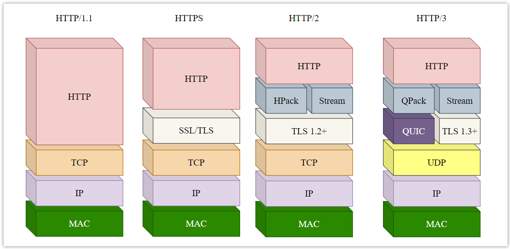

### 无队头阻塞

HTTP/2 仍然采用 TCP 连接，因此并没有解决 TCP 的【队头阻塞】问题，只要出现丢包，则TCP就要重传，可能导致连接上的所有流阻塞，直到丢的包重传成功。

HTTP3 基于**QUIC协议**，底层是UDP。丢包不会阻塞其他流，彻底解决了【队头阻塞】问题。将原先 TCP 协议提供的部分功能上移至 QUIC，在应用层保证可靠性。

### 优化重传机制

TCP 采用**序号+确认号+超时重传**机制来保证消息的可靠性，由于网络拥堵情况不断变化，因而消息的超时时间并不是固定的，而是通过不断采样消息的【往返时间】不断调整的，但 **TCP 超时采样存在不准确的问题**。

例如客户端发送一个序号为 N 的包，然后超时了。于是重新发送一个序号为 N 的包，之后服务器收到后返回一个确认号 ACK 为 N+1 的包。但此时客户端并无法判断这个确定包是对【原始报文】的确认还是【重传报文】的确认，如下图，情况1会将采样时间算长，情况2会将采样时间算短

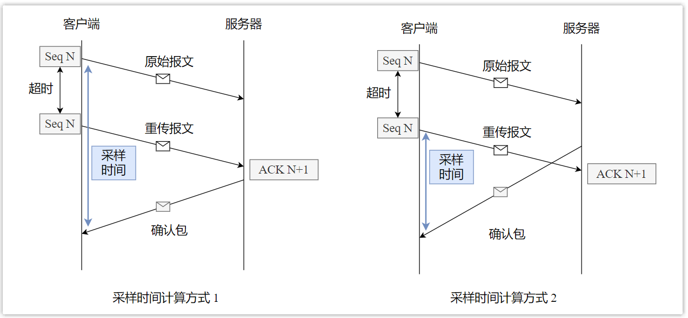

问题：原始报文和重传报文序列号都为N，如何确定ACK N+1是回应哪个报文？

QUIC 定义了一个**递增**的序列号（不再叫 Seq，而是 Packet Number），每个序列号的包只发送一次，**即使重传相同的包，其序列号也不一样**。

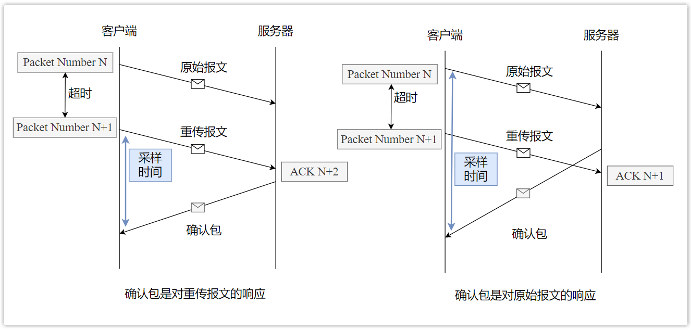

如何知道包 N 和包 N+1 是同一个包呢？QUIC 定义了一个 **Offset **概念。发送的数据有个偏移量 Offset，可以通过 Offset 知道数据目前发送到了哪里，因而如果某个 Offset 的包没有收到确认，就重发。

### 连接迁移

一条 TCP 连接是由四元组标识的，分别是**源 IP、源端口、目的 IP、目的端口**。一旦其中一个元素发生了变化，就需要断开重连。

QUIC 不再采用四元组，而是以一个 **64 位的随机数 ID** 来标识连接，通过此连接 ID 标记通信的两端，之后即使网络发生变化，IP 或端口变了，但只要 ID 不变，则无需重连，只需要复用原先连接即可。时延低，减少了用户的卡顿感，实现连接迁移。

## 总结HTTP的升级

| 版本     | 升级                                                         |
| -------- | ------------------------------------------------------------ |
| HTTP/1.0 | GET、POST、HEAD方法，基于TCP                                 |
| HTTP/1.1 | 增加了六种：OPTIONS, PUT, PATCH, DELETE, TRACE 和 CONNECT；引入长连接、管道（流水线）、分块传输；支持多个连接；新增100状态码； |
| HTTP/2   | 多路复用、二进制传输、首部压缩、服务器推送                   |
| HTTP/3   | 基于UDP                                                      |


## Q：GET和POST区别？

| GET                                                         | POST                                   |
| ----------------------------------------------------------- | -------------------------------------- |
| get 提交的数据放在 URL 中（http包头），可能会存在安全问题。 | post 参数放在请求主体（http正文）中    |
| get请求参数会被缓存，会留在浏览器历史记录                   | post请求不会被缓存，也不会保留历史记录 |
| get 只支持 URL 编码（百分比编码，只能用ASCII字符）          | post 支持多种编码                      |
| get 提交的数据大小有限制（是浏览器的限制，与http无关）      | post 提交的数据大小没限制              |
| get产生一个TCP数据包                                        | post产生两个（视浏览器而定）           |

### 幂等性

幂等的 HTTP 方法，同样的请求被执行一次与连续执行多次的效果是一样的，服务器的状态也是一样的。即，幂等方法不应该具有副作用（统计用途除外），是安全的。


在正确实现的条件下，GET，HEAD，PUT 和 DELETE等方法都是幂等的，而 **POST 方法不是**。

例如，DELETE删多次，最终结果都是删除一个URL资源而已：

```text
DELETE /idX/delete HTTP/1.1   -> Returns 200 if idX exists
DELETE /idX/delete HTTP/1.1   -> Returns 404 as it just got deleted
DELETE /idX/delete HTTP/1.1   -> Returns 404
```

### 可缓存

如果要对响应进行缓存，需要满足以下条件：

- 请求报文的 HTTP 方法本身是可缓存的，包括 GET 和 HEAD，但是 PUT 和 DELETE 不可缓存，POST 在多数情况下不可缓存的。
- 响应报文的状态码是可缓存的，包括：200, 203, 204, 206, 300, 301, 404, 405, 410, 414, and 501。
- 响应报文的 Cache-Control 首部字段没有指定不进行缓存。

### XMLHttpRequest

为了阐述 POST 和 GET 的另一个区别，需要先了解 XMLHttpRequest：

> XMLHttpRequest 是一个 API，它为客户端提供了在客户端和服务器之间传输数据的功能。它提供了一个通过 URL 来获取数据的简单方式，并且不会使整个页面刷新。这使得网页只更新一部分页面而不会打扰到用户。XMLHttpRequest 在 AJAX 中被大量使用。

- 在使用 XMLHttpRequest 的 POST 方法时，浏览器会先发送 Header 再发送 Data。但并不是所有浏览器会这么做，例如火狐就不会。
- 而 GET 方法 Header 和 Data 会一起发送。

# wireshark抓包

SYN表示建立连接

FIN表示关闭连接

ACK表示响应

PSH表示有 data 数据传输

RST表示连接重置

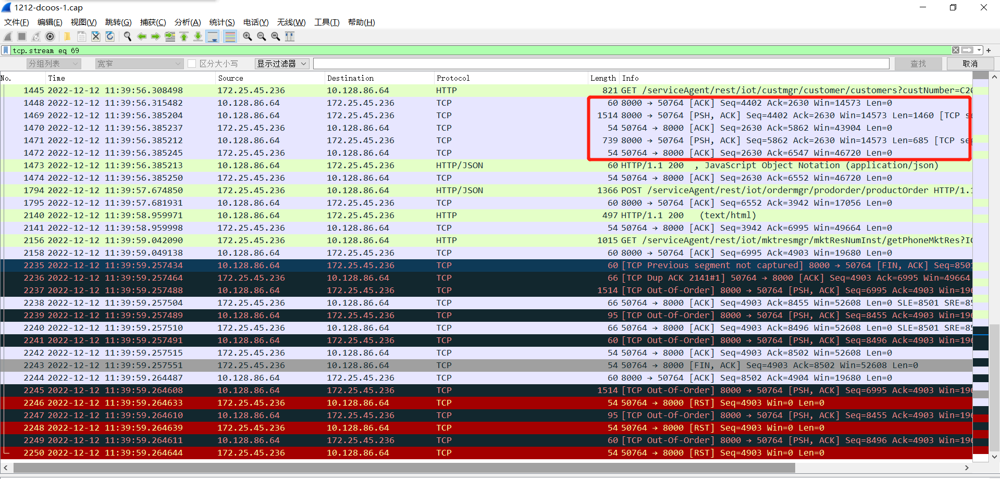

如图表示一个已经建立的TCP连接，红框第一行表示A向B发送一个空包（LEN=0），表示确认（ACK）收到B的第2630字节以前的内容

第二行表示A向B传输数据（PSH），长度1460，因此发送第4402~5861（4402+1460-1，因为包括4402）个字节。

第三行表示B向A发送一个空确认包，ACK=5862 （A发送的最后一个字节号5861+1）

由上可知实际使用符合TCP传输规定

## TLS 解密

### 

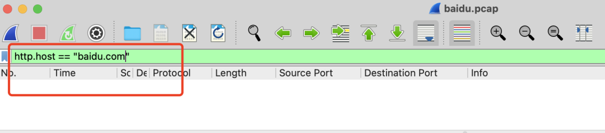

HTTP协议里的Host和实际发送的request body都会被加密。所以没办法通过`http.host`进行过滤。

HTTPS握手中的Client Hello阶段，里面有个扩展`server_name`，会记录你想访问的是哪个网站，通过下面的筛选条件可以将它过滤出来。

```
  tls.handshake.extensions_server_name == "baidu.com"
```

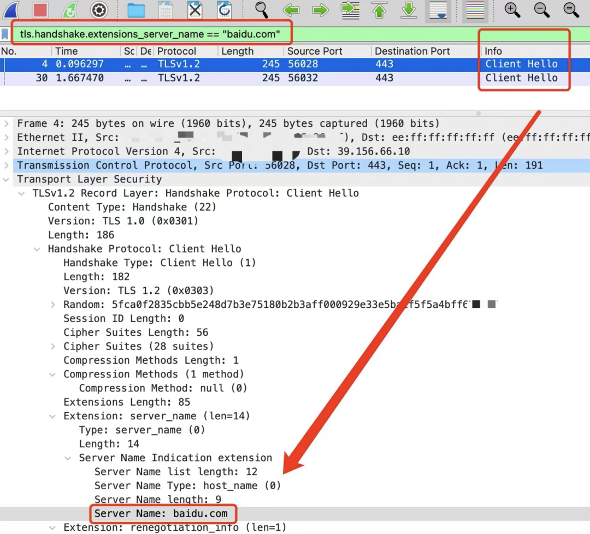

执行tcpdump抓包

```
$ tcpdump -i eth0 host 39.156.66.10 -w baidu.pcap
```

然后在另外一个命令行窗口下执行下面的命令，**目的是将加密的key导出，并给出对应的导出地址**是`/Users/xiaobaidebug/ssl.key`。

```
$ export SSLKEYLOGFILE=/Users/xiaobaidebug/ssl.key
```

然后在同一个命令行窗口下，继续执行curl命令或用命令行打开chrome浏览器。**目的是为了让curl或chrome继承这个环境变量。**

```
$ curl 'https://baidu.com'
或者
$ open -a Google\ Chrome #在mac里打开chrome浏览器
```

此时会看到在`/Users/xiaobaidebug/`下会多了一个`ssl.key`文件。

这时候跟着下面的操作修改`wireshark`的配置项。

再修改`wireshark`的配置项，将`ssl.key`文件路径填入。

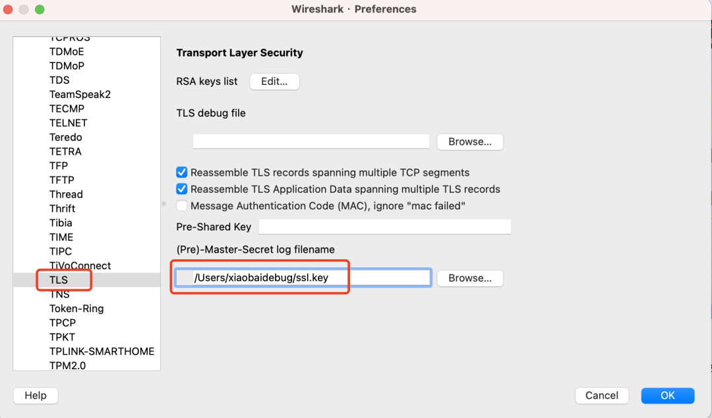

点击确定后，就能看到**18号和20号数据包已经被解密**

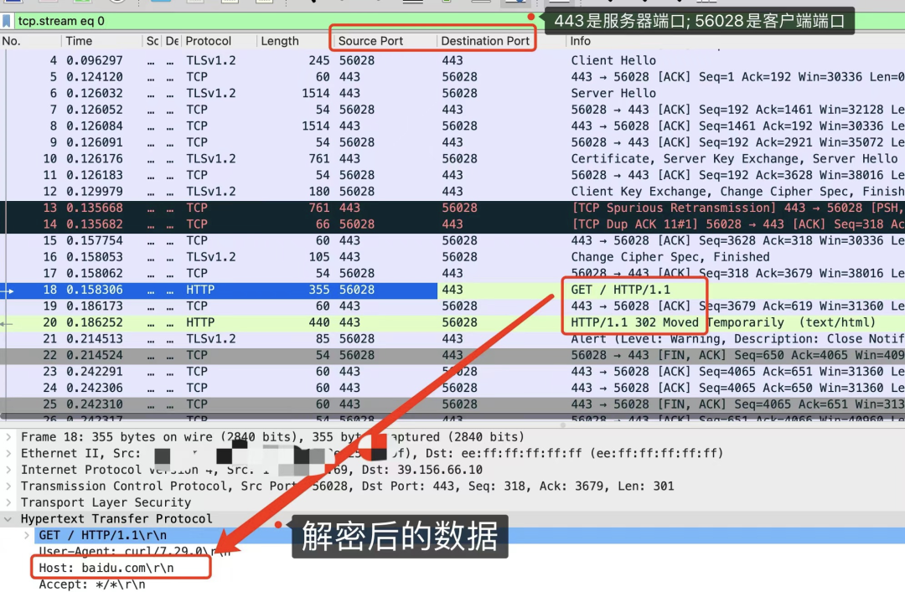

此时再用`http.host == "baidu.com"`，就能过滤出数据了。

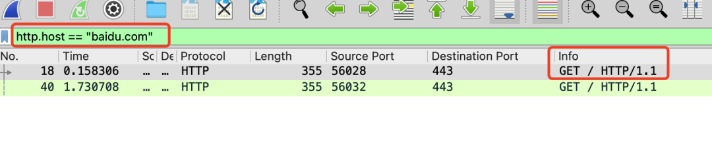


参考：https://mp.weixin.qq.com/s/h1SgPEkOlg8QZomJy1pt_A

# Socket

Socket（套接字）是一个抽象概念，一个应用程序通过一个Socket来建立一个远程连接，而Socket内部通过TCP/IP协议传输数据。一个Socket就是由 **IP地址+端口号**（范围是0～65535）组成

使用Socket进行网络编程时，本质上就是两个进程之间的网络通信。其中一个进程必须充当服务器端，它会主动监听某个指定的端口，另一个进程必须充当客户端，它必须主动连接服务器的IP地址和指定端口，如果连接成功，服务器端和客户端就成功地建立了一个TCP连接，双方后续就可以随时发送和接收数据。

## Q：Socket和http的区别和应用场景

Socket连接就是所谓的长连接，理论上客户端和服务器端一旦建立起连接将不会主动断掉；Socket适用场景：网络游戏，银行持续交互，直播，在线视屏等。
http连接就是所谓的短连接，即客户端向服务器端发送一次请求，服务器端响应后连接即会断开等待下次连接。http适用场景：公司OA服务，互联网服务，电商，办公，网站等等等等

## 编写HTTP Server（1.0)

一个HTTP Server本质上是一个TCP服务器，先用[TCP编程](https://www.liaoxuefeng.com/wiki/1252599548343744/1305207629676577)的多线程实现的服务器端框架。

只需要在`handle()`方法中，用Reader读取HTTP请求，用Writer发送HTTP响应，即可实现一个最简单的HTTP服务器。

```java
public class Server {
    public static void main(String[] args) throws IOException {
        ServerSocket ss = new ServerSocket(8080); // 监听指定端口
        System.out.println("server is running...");
        for (;;) {
            Socket sock = ss.accept();
            System.out.println("connected from " + sock.getRemoteSocketAddress());
            Thread t = new Handler(sock);  // 传入Socket创建线程
            t.start();
        }
    }
}

class Handler extends Thread {
    Socket sock;

    public Handler(Socket sock) {
        this.sock = sock;
    }

    public void run() {
        try (InputStream input = this.sock.getInputStream()) {
            try (OutputStream output = this.sock.getOutputStream()) {
                handle(input, output);
            }
        } catch (Exception e) {
            try {
                this.sock.close();
            } catch (IOException ioe) {
            }
            System.out.println("client disconnected.");
        }
    }
    // 核心逻辑：处理http请求和发送响应
    private void handle(InputStream input, OutputStream output) throws IOException {
    	System.out.println("Process new http request...");
    	var reader = new BufferedReader(new InputStreamReader(input, StandardCharsets.UTF_8));
    	var writer = new BufferedWriter(new OutputStreamWriter(output, StandardCharsets.UTF_8));
    	// 读取HTTP请求:
    	boolean requestOk = false;
    	String first = reader.readLine();
    	if (first.startsWith("GET / HTTP/1.")) { // 不是以这个开头的，认为请求非法
        	requestOk = true;
   	 	}
    	for (;;) {
        	String header = reader.readLine();
        	if (header.isEmpty()) { // 读取到空行时, HTTP Header读取完毕
            	break;
        	}
        	System.out.println(header);
    	}
    	System.out.println(requestOk ? "Response OK" : "Response Error");
    	if (!requestOk) {
        	// 发送错误响应:
        	writer.write("HTTP/1.0 404 Not Found\r\n");
        	writer.write("Content-Length: 0\r\n");
        	writer.write("\r\n");
        	writer.flush();
    	} else {
        	// 发送成功响应:
        	String data = "<html><body><h1>Hello, world!</h1></body></html>";
        	int length = data.getBytes(StandardCharsets.UTF_8).length;
            // 首先发送响应代码，表示一个成功的200响应，使用HTTP/1.0协议
        	writer.write("HTTP/1.0 200 OK\r\n");
            // Header
        	writer.write("Connection: close\r\n");
        	writer.write("Content-Type: text/html\r\n");
        	writer.write("Content-Length: " + length + "\r\n");
             // 空行标识Header和Body的分隔
        	writer.write("\r\n");
            // Body
        	writer.write(data);
        	writer.flush();
    	}
	}
}
```

# Websocket

现在使用最广泛的`HTTP1.1`，也是基于TCP协议的，**同一时间里**，客户端和服务器**只能有一方主动**发数据，这就是所谓的**半双工**。也就是说，好好的全双工TCP，被HTTP用成了半双工。这是由于HTTP协议设计之初，考虑的是看看网页文本的场景，能做到**客户端发起请求再由服务器响应**，就够了，根本就没考虑网页游戏这种，客户端和服务器之间都要互相主动发大量数据的场景。

所以为了更好的支持这样的场景，我们需要另外一个**基于TCP的新协议**。于是新的应用层协议**websocket**就被设计出来了。

> 虽然名字带了个socket，但其实socket和websocket之间，就跟雷峰和雷峰塔一样，二者接近**毫无关系**。

## 建立websocket连接

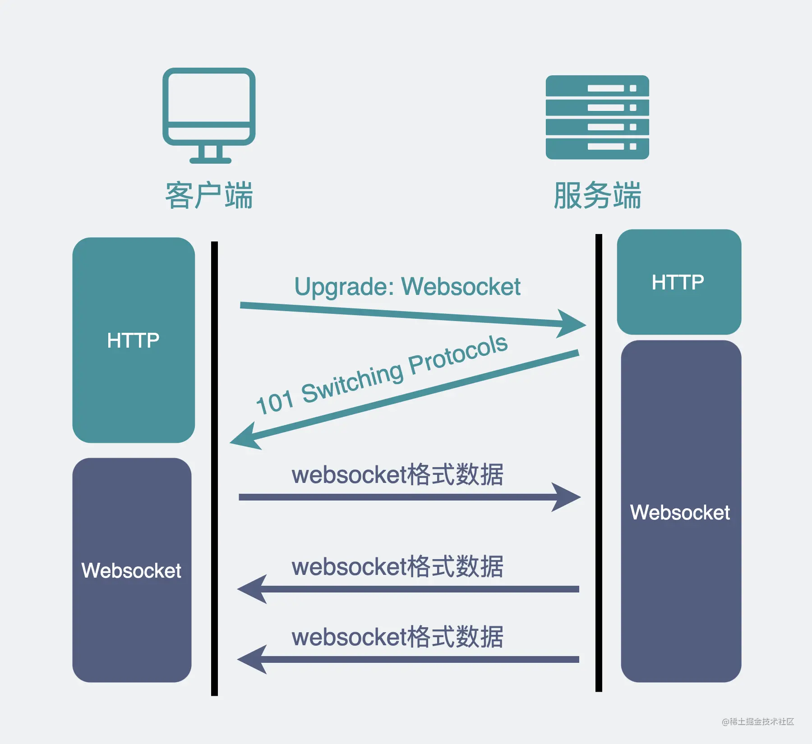

浏览器在**TCP三次握手**建立连接之后，都**统一使用HTTP协议**先进行一次通信。

- 如果此时是**普通的HTTP请求**，那后续双方就还是老样子继续用普通HTTP协议进行交互，这点没啥疑问。
- 如果这时候是**想建立websocket连接**，就会在HTTP请求里带上一些**特殊的header头**。

   ```
   Connection: Upgrade
   Upgrade: websocket
   Sec-WebSocket-Key: T2a6wZlAwhgQNqruZ2YUyg==\r\n
   ```

这些header头的意思是，浏览器想**升级协议（Connection: Upgrade）**，并且想升级成**websocket协议（Upgrade: websocket）**。

同时带上一段**随机生成的base64码（Sec-WebSocket-Key）**，发给服务器。

如果服务器正好支持升级成websocket协议。就会走websocket握手流程，同时根据客户端生成的base64码，用某个**公开的**算法变成另一段字符串，放在HTTP响应的 `Sec-WebSocket-Accept` 头里，同时带上`101状态码`，发回给浏览器。

```
HTTP/1.1 101 Switching Protocols\r\n
Sec-WebSocket-Accept: iBJKv/ALIW2DobfoA4dmr3JHBCY=\r\n
Upgrade: websocket\r\n
Connection: Upgrade\r\n
```

> http状态码=200（正常响应）的情况，大家见得多了。101确实不常见，它其实是指**协议切换**。

之后，浏览器也用同样的**公开算法**将`base64码`转成另一段字符串，如果这段字符串跟服务器传回来的**字符串一致**，那验证通过。

就这样经历了一来一回两次HTTP握手，websocket就建立完成了，后续双方就可以使用webscoket的数据格式进行通信了。

你在网上可能会看到一种说法："websocket是基于HTTP的新协议"，**其实这并不对**，因为websocket只有在建立连接时才用到了HTTP，**升级完成之后就跟HTTP没有任何关系了**。

# 应用层其他协议

## 常用端口


|       应用       | 应用层协议 | 端口号  | 传输层协议 |                             备注                             |
| :--------------: | :--------: | :-----: | :--------: | :----------------------------------------------------------: |
|     域名解析     |    DNS     |   53    |  UDP/TCP   | 两种情况使用 TCP：1. 长度超过 **512** 字节（因为UDP 建议最大只支持 512 ）2. 区域传送（主域名服务器向辅助域名服务器传送变化的那部分数据，数据量大） |
| 动态主机配置协议 |    DHCP    |  67/68  |    UDP     |                                                              |
| 简单网络管理协议 |    SNMP    | 161/162 |    UDP     |                                                              |
|   文件传送协议   |    FTP     |  20/21  |    TCP     |                   控制连接 21，数据连接 20                   |
|   远程终端协议   |   TELNET   |   23    |    TCP     |                                                              |
|  超文本传送协议  |    HTTP    |   80    |    TCP     |                                                              |
| 简单邮件传送协议 |    SMTP    |   25    |    TCP     |                                                              |
|   邮件读取协议   |    POP3    |   110   |    TCP     |                                                              |
| 网际报文存取协议 |    IMAP    |   143   |    TCP     |                                                              |

## 1. 域名系统DNS

是一个分布式数据库，提供了**主机名**和 **IP 地址**之间相互转换的服务。

**分布式数据库**是指，每个站点只保留它自己的那部分数据。

### 域名格式

1. 共四级，从左到右分别是低级域名到高级域名；
2. 每一级都由英文+数字构成，不超过63字符（加上分隔符`.`号，总共不超过63*4+3=255）；


### 域名结构（逻辑概念）

层次树状结构：

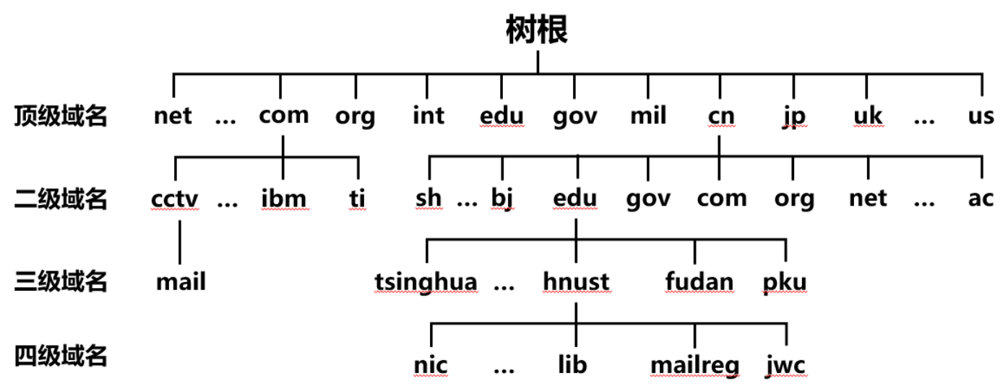

树根：没有对应域名

顶级：国家（cn）、组织（com、org）等

二级：省、机构等

### 域名服务器（物理存在）

域名和ip对应关系实际上保存再域名服务器上

1. 根域名服务器：最高层级，全球共13台。并不直接对域名解析，而是返回该域名**所属顶级域名**所在的服务器的（即顶级服务器）ip
2. 顶级域名服务器
3. 权限域名服务器
4. 本地域名服务器：不属于域名服务器的等级结构。主机最先请求本地服务器，本地服务器只做代理作用

域名服务器使用**高速缓存**减少网络中DNS报文数量

### 域名解析过程


1. 递归查询：如果主机所询问的本地域名服务器不知道被查询域名的 IP 地址，那么本地域名服务器就以 DNS 客户端的身份，向其他根域名服务器继续发出查询请求报文，即**把查询委托给其他服务器**，而不是让主机自己进行下一步查询。根服务器又将查询委托给服务器①，如此递归下去，直到查到主机B。如上图步骤（1）~（10）。
2. 迭代查询：当根域名服务器收到本地域名服务器发出的迭代查询请求报文时，要么给出所要查询的 IP 地址，要么告诉本地服务器下一步应该找哪个域名服务器进行查询，然后**还是让本地服务器进行后续的查询**，如上图步骤（2）~（9）。

由于递归查询对被查询的服务器负担太大，通常采取以下方式：主机A到本地DNS用递归查询，其余用迭代查询。

DNS

### DNS劫持

即域名劫持，是通过将原域名对应的 IP 地址进行替换从而使得用户访问到错误的网站，或者使用户无法正常访问网站的一种攻击方式。

攻击者冒充原域名所属机构，修改电子邮件来修改机构的域名注册信息，或将域名转让给其他组织，并将新域名保存在指定DNS服务器，使用户无法通过对原域名解析来访问目的网址。

域名劫持往往只能在特定的网络范围内进行，范围外DNS解析正常。

预防手段：

直接通过ip地址访问，避开DNS

## 2. 文件传送协议FTP

FTP 使用 TCP 进行连接，它需要两个连接来传送一个文件：

- 控制连接：服务器打开端口号 21 等待客户端的连接，客户端主动建立连接后，使用这个连接将客户端的命令传送给服务器，并传回服务器的应答。
- 数据连接：用来传送一个文件的数据。

根据数据连接**是否由服务器端主动**建立，FTP 有主动和被动两种模式：

1. 主动模式：服务器端主动建立数据连接，其中服务器端的端口号为 20，客户端的端口号随机，但是必须大于 1024，因为 0~1023 是熟知端口号。
2. 被动模式：客户端主动建立数据连接，其中客户端的端口号由客户端自己指定，服务器端的端口号随机。

主动模式要求客户端开放端口号给服务器端，需要去配置客户端的防火墙。

被动模式只需要服务器端开放端口号即可，无需客户端配置防火墙。但是安全性减弱。

## 3. 动态主机配置协议

DHCP (Dynamic Host Configuration Protocol) 提供了即插即用的连网方式，用户不再需要手动配置 IP 地址等信息。

DHCP 配置的内容不仅是 IP 地址，还包括子网掩码、网关 IP 地址。

DHCP 工作过程如下：

1. 客户端发送 Discover 报文，该报文的目的地址为 255.255.255.255:67，源地址为 0.0.0.0:68，被放入 UDP 中，该报文被广播到同一个子网的所有主机上。如果客户端和 DHCP 服务器不在同一个子网，就需要使用中继代理。
2. DHCP 服务器收到 Discover 报文之后，发送 Offer 报文给客户端，该报文包含了客户端所需要的信息。因为客户端可能收到多个 DHCP 服务器提供的信息，因此客户端需要进行选择。
3. 如果客户端选择了某个 DHCP 服务器提供的信息，那么就发送 Request 报文给该 DHCP 服务器。
4. DHCP 服务器发送 Ack 报文，表示客户端此时可以使用提供给它的信息。

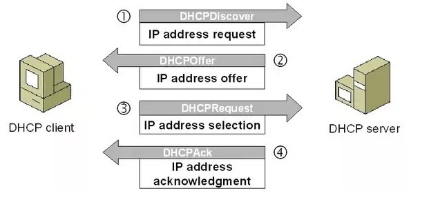

## 4. 电子邮件协议

一个电子邮件系统由三部分组成：用户代理、邮件服务器以及邮件协议。

邮件协议包含发送协议和读取协议，发送协议常用 SMTP，读取协议常用 POP3 和 IMAP。


#### SMTP

SMTP 只能发送 ASCII 码，而互联网邮件扩充 MIME 可以发送二进制文件。MIME 并没有改动或者取代 SMTP，而是增加邮件主体的结构，定义了非 ASCII 码的编码规则。


#### POP3

POP3 的特点是只要用户从服务器上读取了邮件，就把该邮件删除。但最新版本的 POP3 可以不删除邮件。

#### IMAP

IMAP 协议中客户端和服务器上的邮件保持同步，如果不手动删除邮件，那么服务器上的邮件也不会被删除。IMAP 这种做法可以让用户随时随地去访问服务器上的邮件。


## 5. 远程登录协议

TELNET 用于登录到远程主机上，并且远程主机上的输出也会返回。

TELNET 可以适应许多计算机和操作系统的差异，例如不同操作系统系统的换行符定义。

## Web 页面请求过程

### 1. DHCP 配置主机信息

- 假设主机最开始没有 IP 地址以及其它信息，那么就需要先使用 DHCP 来获取。
- 主机生成一个 DHCP 请求报文，并将这个报文放入具有目的端口 67 和源端口 68 的 UDP 报文段中。
- 该报文段则被放入在一个具有广播 IP 目的地址(255.255.255.255) 和源 IP 地址（0.0.0.0）的 IP 数据报中。
- 该数据报则被放置在 MAC 帧中，该帧具有目的地址 FF:<zero-width space>FF:<zero-width space>FF:<zero-width space>FF:<zero-width space>FF:FF，将广播到与交换机连接的所有设备。
- 连接在交换机的 DHCP 服务器收到广播帧之后，不断地向上分解得到 IP 数据报、UDP 报文段、DHCP 请求报文，之后生成 DHCP ACK 报文，该报文包含以下信息：IP 地址、DNS 服务器的 IP 地址、默认网关路由器的 IP 地址和子网掩码。该报文被放入 UDP 报文段中，UDP 报文段有被放入 IP 数据报中，最后放入 MAC 帧中。
- 该帧的目的地址是请求主机的 MAC 地址，因为交换机具有自学习能力，之前主机发送了广播帧之后就记录了 MAC 地址到其转发接口的交换表项，因此现在交换机就可以直接知道应该向哪个接口发送该帧。
- 主机收到该帧后，不断分解得到 DHCP 报文。之后就配置它的 IP 地址、子网掩码和 DNS 服务器的 IP 地址，并在其 IP 转发表中安装默认网关。

### 2. ARP 解析 MAC 地址

- 主机通过浏览器生成一个 TCP 套接字，套接字向 HTTP 服务器发送 HTTP 请求。为了生成该套接字，主机需要知道网站的域名对应的 IP 地址。
- 主机生成一个 DNS 查询报文，该报文具有 53 号端口，因为 DNS 服务器的端口号是 53。
- 该 DNS 查询报文被放入目的地址为 DNS 服务器 IP 地址的 IP 数据报中。
- 该 IP 数据报被放入一个以太网帧中，该帧将发送到网关路由器。
- DHCP 过程只知道网关路由器的 IP 地址，为了获取网关路由器的 MAC 地址，需要使用 ARP 协议。
- 主机生成一个包含目的地址为网关路由器 IP 地址的 ARP 查询报文，将该 ARP 查询报文放入一个具有广播目的地址（FF:<zero-width space>FF:<zero-width space>FF:<zero-width space>FF:<zero-width space>FF:FF）的以太网帧中，并向交换机发送该以太网帧，交换机将该帧转发给所有的连接设备，包括网关路由器。
- 网关路由器接收到该帧后，不断向上分解得到 ARP 报文，发现其中的 IP 地址与其接口的 IP 地址匹配，因此就发送一个 ARP 回答报文，包含了它的 MAC 地址，发回给主机。

### 3. DNS 解析域名

- 知道了网关路由器的 MAC 地址之后，就可以继续 DNS 的解析过程了。
- 网关路由器接收到包含 DNS 查询报文的以太网帧后，抽取出 IP 数据报，并根据转发表决定该 IP 数据报应该转发的路由器。
- 因为路由器具有内部网关协议（RIP、OSPF）和外部网关协议（BGP）这两种路由选择协议，因此路由表中已经配置了网关路由器到达 DNS 服务器的路由表项。
- 到达 DNS 服务器之后，DNS 服务器抽取出 DNS 查询报文，并在 DNS 数据库中查找待解析的域名。
- 找到 DNS 记录之后，发送 DNS 回答报文，将该回答报文放入 UDP 报文段中，然后放入 IP 数据报中，通过路由器反向转发回网关路由器，并经过以太网交换机到达主机。

### 4. HTTP 请求页面

- 有了 HTTP 服务器的 IP 地址之后，主机就能够生成 TCP 套接字，该套接字将用于向 Web 服务器发送 HTTP GET 报文。
- 在生成 TCP 套接字之前，必须先与 HTTP 服务器进行三次握手来建立连接。生成一个具有目的端口 80 的 TCP SYN 报文段，并向 HTTP 服务器发送该报文段。
- HTTP 服务器收到该报文段之后，生成 TCP SYN ACK 报文段，发回给主机。
- 连接建立之后，浏览器生成 HTTP GET 报文，并交付给 HTTP 服务器。
- HTTP 服务器从 TCP 套接字读取 HTTP GET 报文，生成一个 HTTP 响应报文，将 Web 页面内容放入报文主体中，发回给主机。
- 浏览器收到 HTTP 响应报文后，抽取出 Web 页面内容，之后进行渲染，显示 Web 页面。

# Base64编码

目的是把二进制数据变成文本格式，这样在很多文本中就可以处理二进制数据（如电子邮件协议pop3、SMTP等）。一共用到`A~Z`、`a~z`、`+`和`/`，共64个ASCII字符

缺点：效率变低，因为长度增加1/3

编码举例：3个byte数据分别是`e4`、`b8`、`ad`，按**6bit分组**得到`39`、`0b`、`22`和`2d`：

```ascii
┌───────────────┬───────────────┬───────────────┐
│      e4       │      b8       │      ad       │
└───────────────┴───────────────┴───────────────┘
┌─┬─┬─┬─┬─┬─┬─┬─┬─┬─┬─┬─┬─┬─┬─┬─┬─┬─┬─┬─┬─┬─┬─┬─┐
│1│1│1│0│0│1│0│0│1│0│1│1│1│0│0│0│1│0│1│0│1│1│0│1│
└─┴─┴─┴─┴─┴─┴─┴─┴─┴─┴─┴─┴─┴─┴─┴─┴─┴─┴─┴─┴─┴─┴─┴─┘
┌───────────┬───────────┬───────────┬───────────┐
│    39     │    0b     │    22     │    2d     │
└───────────┴───────────┴───────────┴───────────┘
```

因为6位整数的范围总是`0~63`，所以，能用**64个字符**表示：字符`A~Z`对应索引`0~25`，字符`a~z`对应索引`26~51`，字符`0~9`对应索引`52~61`，最后两个索引`62`、`63`分别用字符`+`和`/`表示。

如果byte数组长度不是3的整数倍（因为要保证总bit数是6的整数倍），就在末尾补一个或两个`0x00`，转成字符是`=`。

## 计算编码前大小

要计算原byte数组长度，就先去掉末尾的`=`。

编码后字符数为A，则编码前Byte数=A*0.75，因为如上图所示，用4个字符表示3个Byte。

