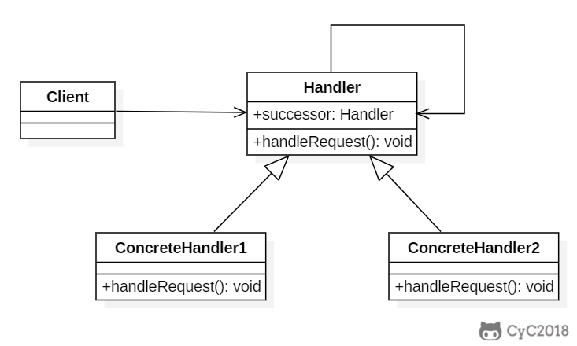

- 创建型模式：单例、工厂、抽象工厂、建造者、原型
- 结构型模式：适配器、桥接、装饰、组合、外观、享元、代理
- 行为型模式：模板方法、命令、迭代器、观察者、中介者、备忘录、解释器、状态、策略、职责链、访问者

# 一、创建型

## 单例

采取一定的方法保证在整个的软件系统中，对某个类只能存在一个对象实例， 并且该类只提供一个取得其对象实例的方法(静态方法)。实例化单例时调用该方法，而不是new一个
使用场景：
1.需要频繁的进行创建和销毁的对象、创建对象时耗时过多或耗费资源过多(即：重量级对象)

2.经常用到的对象、工具类对象、频繁访问数据库或文件的对象(比如数据源、session 工厂等)

一、饿汉式（静态常量)
 实现：
	1.构造器私有化（防止new）
	2.类的内部创建对象
	3.对外暴露一个静态的方法

```java
class Singleton {

    //1. 构造器私有化,  外部不能 new
    private Singleton() {}
    
    //2.本类内部创建对象实例
    private final static Singleton instance = new Singleton();

    //3. 提供一个公有的静态方法，返回实例对象
    public static Singleton getInstance() { return instance;}    
}
```

优缺点
优点：写法简单，在类装载时完成实例化，避免线程同步问题
缺点：类装载时就完成实例化，没有达到lazy loading效果。如果实例始终未使用，会造成内存浪费
结论
这种单例模式可用，但会造成内存浪费

二、饿汉式（静态代码块）
实现：
	1.构造器私有化（防止new）
	2.类的内部创建对象
	3.对外暴露一个静态的方法

```java
class Singleton {
    //1. 构造器私有化,外部不能new
    private Singleton() {}
    
    private static Singleton instance;
    
    //2.在静态代码块中，创建单例对象
    static { 
        instance = new Singleton();
    }
    //3. 提供一个公有的静态方法，返回实例对象
    public static Singleton getInstance() { return instance;}    
}
```

优缺点
和上面一样，只是将类实例化的过程放在静态代码块中
结论
可用，但会造成内存浪费

三、懒汉式（线程不安全）
实现
	1.构造器私有化（防止new）
	2.类的内部创建对象
	3.对外暴露一个静态的方法
	

```java
class Singleton {
    //1. 构造器私有化,外部不能new
    private Singleton() {}
    
    private static Singleton instance;
    
    //2. 提供一个公有的静态方法，返回实例对象
    //即提供静态的方法，使用到的时候才会创建instance
    public static Singleton getInstance() {
        if(instance == null) {  // 同时多个线程进入，可能会创建多个实例
            instance = new Singleton();
        }
        return instance;
    }    
}
```

优缺点
优点：懒加载
缺点：多线程会产生多个实例
结论
不可用于实际

四、懒汉式（线程安全，同步方法）

1.构造器私有化（防止new）

2.类的内部创建对象

3.对外暴露一个静态的方法

实现

```java
class Singleton {
    //1. 构造器私有化,外部不能new
    private Singleton() {}
    
    private static Singleton instance;
    
    //2. 提供一个公有的静态方法，返回实例对象
    public static synchronized Singleton getInstance() {
        if(instance == null) {
            instance = new Singleton();
        }
        return instance;
    }    
}

```

优缺点
优点：线程安全
缺点：效率低，每个线程在想获得类实例时，执行 getInstance()方法都要进行同步。
结论
实际开发不推荐

五、懒汉式（线程安全，同步代码块）
实现

```java
class Singleton {
    //1. 构造器私有化,外部不能new
    private Singleton() {}
    
    private static Singleton instance;
    
    //2. 提供一个公有的静态方法，返回实例对象
    public static Singleton getInstance() {
        if(instance == null) {  // 如果实例为空，执行同步代码块
            synchronized(Singleton.class) {
                instance = new Singleton();
            }
        }
        return instance;
    }    
}
```

优缺点
优点：本意是想改进第四种方式，减少同步的次数，判断在实例为空时才执行同步，而不是每次调用getInstance都同步。
缺点：实际上并不能线程同步，例如当两个线程都进入if，就会创建两个实例。本质上是【判断与使用没有原子化】
结论
不能使用

六、双重检查
实现

```java
class Singleton {
    //1. 构造器私有化,外部不能new
    private Singleton() {}
    
    private static volatile Singleton instance;
    
    //提供一个静态的公有方法，加入双重检查代码
    public static Singleton getInstance() {
        if(instance == null) {
            synchronized (Singleton.class) {
                if(instance == null) {  // 同步块内再次检查。由于进入同步块是互斥的，此时只有一个线程能操作
                    instance = new Singleton();
                }
            }
        }
        return instance;
    }   
}

```

优缺点
优点：
	1. 双重检查，保证线程安全
	2. 懒加载，保证效率
	3. 使用volatile，当一个字段被声明为volatile，java线程内存模型确保所有线程看到这个变量的值是一致的。
	结论
	推荐使用

## Q：如果加锁后判断，还需要双重检查吗？

不用，但是每次获取单例都得加锁，影响并发效率。


七、静态内部类
实现

```java
class Singleton {
    //构造器私有化
    private Singleton() {}

    //写一个静态内部类,该类中有一个静态属性 Singleton 
    private static class SingletonInstance {
        private static final Singleton INSTANCE = new Singleton();
    }

    //提供一个静态的公有方法，直接返回 SingletonInstance.INSTANCE
    public static Singleton getInstance() {
        return SingletonInstance.INSTANCE;
    }
}
```

优缺点
1.这种方式采用了类装载的机制来保证初始化实例时只有一个线程。

2.静态内部类方式在 Singleton 类被装载时并不会立即实例化，而是在需要实例化时，调用 getInstance 方法，才会装载 SingletonInstance 类，从而完成 Singleton 的实例化。

3.类的静态属性只会在第一次加载类的时候初始化，所以在这里，JVM 帮助我们保证了线程的安全性，在类进行初始化时，别的线程是无法进入的。

4.优点：避免了线程不安全，利用静态内部类特点实现延迟加载，效率高

结论
推荐使用

八、枚举
实现

```java
enum Singleton {
    INSTANCE; //属性
    public void sayOK() {
        System.out.println("ok~");
    }
}
```

优缺点
1.这借助 JDK1.5 中添加的枚举来实现单例模式。不仅能避免多线程同步问题，而且还能防止反序列化重新创建新的对象。

2.这种方式是 Effective Java 作者 Josh Bloch 提倡的方式
结论
推荐使用

九、单例模式源码分析
JDK 中，java.lang.Runtime 就是经典的单例模式(饿汉式)

```java
public class Runtime {
    //2.类的内部创建对象
    private static Runtime currentRuntime = new Runtime();
    //3.对外暴露一个静态方法
    public static Runtime getRuntime() {
        return currentRuntime;
    }
    //1.构造器私有化
    private Runtime() {}
}
```


# 二、行为型

## 责任链

### Intent

使多个对象都有机会处理请求，从而避免请求的发送者和接收者之间的耦合关系。将这些对象连成一条链，并沿着这条链发送该请求，直到有一个对象处理它为止。

### Class Diagram

- Handler：定义处理请求的接口，并且实现后继链（successor）




## 策略

### Intent

定义一系列算法，封装每个算法，并使它们可以互换。

策略模式可以让算法独立于使用它的客户端。

### Class Diagram

- Strategy 接口定义了一个算法族，它们都实现了 behavior() 方法。
- Context 是使用到该算法族的类，其中的 doSomething() 方法会调用 behavior()，setStrategy(Strategy) 方法可以动态地改变 strategy 对象，也就是说能动态地改变 Context 所使用的算法。


### 实践

```java
@Service
public class CorpQryServiceImpl extends CorpBaseService implements ICorpQryService {
    @Autowired
    private Map<String, IConnectDiagnosisProcessor> processorMap;
    
	@Override
	public ConnectDiagnosisRsp qryConnectDiagnosisItem(ConnectDiagnosisItemCond cond) {
    	// 选择处理器执行
        IConnectDiagnosisProcessor processor = processorMap.get(cond.getItemType());
        rsp = processor.handle(cond);
    }
}

// IConnectDiagnosisProcessor的一个实现类
@Service("SIM_SUB_PROD_DLDW")
public class SimSubProdDldwProcessorImpl extends CorpBaseService implements IConnectDiagnosisProcessor {
    @Override
    public ConnectDiagnosisRsp handle(ConnectDiagnosisItemCond connectDiagnosisItemCond) {
    	... 
    }
}
```